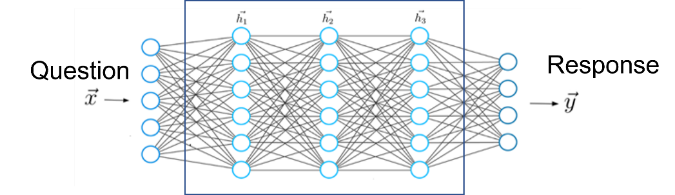

# Chapter 1: Introduction

Artificial intelligence is moving quickly, and large language models (LLMs) sit at the center of that change. New systems appear often—sometimes with large gains in capability or cost—and they already shape how people write, search, code, and make decisions. Whether you are building products, leading a team, or simply trying to keep up, it helps to know what these models are, how they work, and where they came from.

This book is a concise, practical guide to that foundation. It is not a survey paper and not a vendor tutorial. In a short sequence of chapters, it walks from neural networks to modern LLM training and use, with enough explanation and code that you can follow the ideas and try them yourself.

## What Are LLMs?

At heart, large language models are neural networks: layered systems that map inputs to outputs. You provide text (and sometimes images or other signals); the model returns text, labels, or other structured results. Figure 1.1 shows the high-level picture: an input such as a question is encoded, transformed through many hidden layers, and decoded into a response.

*Figure 1.1: An LLM as a neural network. An input vector* $\vec{x}$ *(for example, a question) is transformed through successive hidden layers* $\vec{h}_1, \vec{h}_2, \vec{h}_3$ *into an output vector* $\vec{y}$ *(for example, a response).*

A neural network is a collection of units organized in layers. The input layer represents outside data—an image, a sentence, speech, or clinical measurements. The output layer produces a prediction or generated result. Between them, hidden layers apply learned transformations again and again, so the final representation is a complex function of the first. You can think of the whole network as one large function that turns raw input into something useful.

LLMs are such networks trained on very large text corpora—books, websites, and other sources—so they can predict, interpret, and generate language. Unlike older systems that relied on hand-written rules, they learn patterns and context from data. Scaled up, the same idea powers autocomplete, drafting tools, translation aids, and many other applications. The mechanism is not mysterious: it is mathematics and data at large scale.

## A Brief History of LLMs

Large language models did not appear overnight. A useful starting point is 2012, when deep neural networks reshaped computer vision. That year, AlexNet—a convolutional network with eight layers and about 60 million parameters—won a major image-recognition challenge and outperformed earlier methods by a wide margin.

In 2017, researchers at Google introduced the Transformer for language processing. Unlike earlier recurrent models that processed text largely one step at a time, the Transformer could attend over a whole sequence at once. Its attention mechanism focuses on the parts of the input that matter most for each prediction. The original architecture was not yet a “large language model” in today’s sense, but it became the backbone of nearly all modern LLMs.

In 2018, OpenAI released GPT: a Transformer pretrained on large amounts of text to predict the next token. The first GPT had 12 layers and about 117 million parameters—small by later standards, but a clear demonstration of pretraining followed by fine-tuning. Later that year, Google released BERT. Its larger variant had 24 layers and about 340 million parameters. Unlike GPT’s left-to-right setup, BERT used bidirectional context and excelled at understanding tasks such as question answering, even though it was not designed mainly as a conversational generator.

In 2019, GPT-2 scaled the idea further: 48 layers and about 1.5 billion parameters. It could produce long, fluent text across many styles, and its realism raised early concerns about misuse. In 2020, GPT-3 arrived with 96 layers and about 175 billion parameters, trained on tens of terabytes of text. It could write, reason, and generate code with far less task-specific fine-tuning than earlier systems, and it made the potential of scale unmistakable.

In November 2022, ChatGPT brought that capability to a mass audience. Built on GPT-class models and refined with human feedback (covered later in this book), it was easier to use and better aligned with everyday requests. Adoption was rapid. The model still made mistakes—including fabricating facts—but it showed that LLMs could be practical tools for ordinary users, not only research demos.

After ChatGPT, competition accelerated. OpenAI released GPT-4 in 2023, adding stronger multimodal behavior. Meta’s LLaMA models (from about 7 billion to 70 billion parameters) energized open-source development. In 2024 and 2025, systems such as Anthropic’s Claude, xAI’s Grok, Google’s Gemini, and DeepSeek’s R1 continued to push reasoning, efficiency, context length, and open release. Exact parameter counts are not always public, and leaderboards move quickly; what matters for this book is the shared architecture and training pipeline underneath those products.

Understanding that pipeline—networks, representations, Transformers, pretraining, fine-tuning, and alignment—is the surest way to keep up as the products change.

## Who This Book Is For

This book is for readers who want a clear picture of LLMs without unnecessary jargon: engineers, product and project leads, teachers, students, and curious professionals. The goal is practical understanding you can use—whether you write code every day or mainly need to evaluate systems and tradeoffs.

What sets the book apart is the mix of high-level explanation and runnable Python. Early chapters build a small neural network from scratch; later ones move into Transformers, training, and fine-tuning with notebooks you can follow. If coding is new to you, the main text still aims to stand on its own in plain language.

## Book Overview

The chapters follow the actual path from basic networks to modern LLM practice:

1. **Introduction** — What LLMs are, how we got here, and how this book is organized.
2. **The Basics of Neural Networks** — Neurons, activations, loss, gradient descent, and backpropagation.
3. **Deep Neural Networks** — Depth, training stability, and the ideas that make large models trainable.
4. **Embeddings** — How discrete tokens become vectors the network can compute with.
5. **Tokenizer** — How raw text is split into the units models actually predict.
6. **Transformer: Basic Architecture** — Attention, layers, and the architecture behind today’s LLMs.
7. **Training a Transformer** — The mechanics of training at scale.
8. **Generative Pretraining (GPT)** — Next-token prediction and the pretrained base model.
9. **Supervised Fine-Tuning (SFT)** — Adapting a base model to follow instructions and tasks.
10. **Reinforcement Learning Basics** — The learning framework used in later alignment methods.
11. **RLHF** — Reinforcement learning from human feedback to better match human preferences.
12. **Evaluation** — How to measure model quality and compare systems.
13. **Inference** — Serving models: decoding, speed, and practical deployment concerns.
14. **More RL Methods for LLMs** — Further alignment and optimization methods beyond classic RLHF.

Each chapter builds on the last. By the end, LLMs should look less like a black box and more like a system you can reason about—and put to work with confidence.

We start in the next chapter with neural networks, the foundation everything else rests on.
