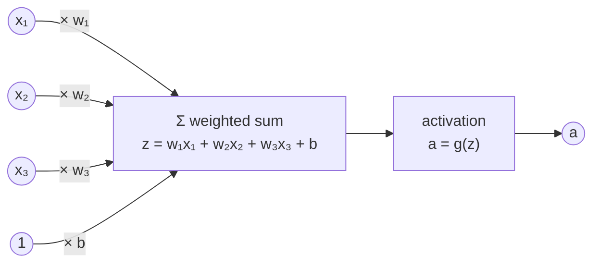

# 2.1 From Biological Inspiration to the Artificial Neuron

A large language model with hundreds of billions of parameters is, at bottom, one simple computation repeated at enormous scale: take a set of input numbers, multiply each by a learned weight, add a bias, and pass the sum through a nonlinear function. This unit is called an *artificial neuron*, and it is the basic building block of every network in this book. In this section we define the neuron, introduce the perceptron learning rule (the oldest algorithm for training one from labeled examples), and see why a single neuron can only draw a straight-line decision boundary. That limitation means a single neuron cannot solve even a problem as simple as XOR, and it is what motivated networks with hidden layers, the subject of the rest of this chapter.

## The artificial neuron

An artificial neuron takes an input vector $`\mathbf{x} = (x_1, \dots, x_d)`$, computes a weighted sum of the inputs plus a bias, and applies an *activation function* $g$ to the result:

```math
z = \sum_{i=1}^{d} w_i x_i + b = \mathbf{w}^\top \mathbf{x} + b, \qquad a = g(z).
```

The **weights** $`w_i`$ say how strongly, and in which direction, each input influences the neuron. The **bias** $b$ shifts the sum independently of the input. The weighted sum $z$ is called the **pre-activation** (or *logit*), and the activation function turns it into the neuron's output $a$. Figure 2.1 shows the flow of computation.



*Figure 2.1: An artificial neuron with three inputs. Each input is multiplied by its weight, the products and the bias are summed into the pre-activation z, and the activation function g produces the output a. The bias can be drawn as the weight on a constant input of 1.*

A tiny numeric example makes this concrete. Let $`\mathbf{x} = (2, -1, 0.5)`$, $`\mathbf{w} = (0.4, 0.3, -1.0)`$, and $b = 0.1$. Then

```math
z = 0.4 \cdot 2 + 0.3 \cdot (-1) + (-1.0) \cdot 0.5 + 0.1 = 0.8 - 0.3 - 0.5 + 0.1 = 0.1.
```

With a step activation (output 1 if $`z \gt 0`$, else 0), the neuron outputs 1. With a sigmoid activation $`\sigma(z) = 1/(1+e^{-z})`$, it outputs $`\sigma(0.1) \approx 0.525`$, a probability-like number just above one half. Section 2.2 surveys the choices of $g$ in detail.

## The perceptron learning rule

The *perceptron* is a neuron with a step activation used as a binary classifier. With labels $y = +1$ and $y = -1$, it predicts $`\hat{y} = \mathrm{sign}(\mathbf{w}^\top \mathbf{x} + b)`$. Training starts with all weights and the bias at zero and visits the examples one at a time. Whenever an example is misclassified, meaning $`y\,(\mathbf{w}^\top \mathbf{x} + b) \le 0`$, the weights are nudged toward the correct answer:

```math
\mathbf{w} \leftarrow \mathbf{w} + \eta\, y\, \mathbf{x}, \qquad b \leftarrow b + \eta\, y,
```

where $`\eta \gt 0`$ is the *learning rate*. Correctly classified examples cause no change. Each update moves the score on the offending example toward its true label, and training stops when a full pass through the data, an *epoch*, produces no mistakes. On the AND function, the perceptron finds $`\mathbf{w} = (2, 2)`$ and $b = -3$: the score $`2x_1 + 2x_2 - 3`$ is positive only for the input $(1, 1)$. The *perceptron convergence theorem* guarantees this success whenever some line (or hyperplane) separates the two classes. When none exists, the rule never settles down.

## The geometric view: a neuron draws a hyperplane

The inputs where the score is exactly zero, $`\mathbf{w}^\top \mathbf{x} + b = 0`$, form a line in two dimensions and a *hyperplane* in general. The weight vector is perpendicular to this boundary, and the bias slides it away from the origin. The neuron assigns one class to every point on one side and the other class to every point on the other side, so it can solve exactly the **linearly separable** problems.

XOR (output 1 if exactly one of two binary inputs is 1) is not linearly separable: the positive points $(0,1)$ and $(1,0)$ sit on one diagonal of the unit square and the negative points $(0,0)$ and $(1,1)$ on the other, and no straight line separates two diagonals of a square. Figure 2.2 shows the perceptron failing on it.


*Figure 2.2: Left: the four XOR points, with several of the boundaries the perceptron visited during training (dashed). Any line leaves at least one point on the wrong side. Right: mistakes per epoch. On separable data the count reaches zero and training stops; on XOR it keeps bouncing between 2 and 4 for as long as training runs.*

The way out, which Section 2.3 develops, is to first transform the inputs with a layer of neurons into a new representation in which the classes *are* linearly separable.

## Neurons as linear models

A single neuron is not a new kind of model. With no activation, it outputs $`\mathbf{w}^\top \mathbf{x} + b`$, and fitting it by minimizing mean squared error is *linear regression*. With a sigmoid activation, it outputs a probability $`\sigma(\mathbf{w}^\top \mathbf{x} + b)`$, and fitting it by minimizing cross-entropy (Section 2.4) is *logistic regression*. Unlike the perceptron's step function, whose derivative is zero almost everywhere, the sigmoid is smooth, so the model can be trained by gradient descent (Section 2.5). The decision boundary, however, is still a hyperplane.

## A short history

In 1943 Warren McCulloch and Walter Pitts modeled a nerve cell as a threshold unit with fixed connections; in 1958 Frank Rosenblatt's perceptron added weights learned from examples. Marvin Minsky and Seymour Papert's 1969 book *Perceptrons* showed that single-layer perceptrons cannot compute functions such as XOR, and research slowed until David Rumelhart, Geoffrey Hinton, and Ronald Williams popularized backpropagation for training hidden layers in 1986. Real neurons are far more complex than these units; from here on we treat neural networks simply as mathematics.

## Key takeaways

- An artificial neuron computes a weighted sum of its inputs plus a bias, $`z = \mathbf{w}^\top \mathbf{x} + b`$, and passes it through an activation function $g$.
- The perceptron learns with a simple mistake-driven rule that converges only when the data are linearly separable.
- A neuron's decision boundary is a hyperplane, so a single neuron cannot solve XOR; hidden layers and nonlinear activations fix this.
- A neuron with no activation is linear regression; with a sigmoid activation it is logistic regression.

## Further reading

McCulloch, Warren S., et al. "A Logical Calculus of the Ideas Immanent in Nervous Activity." *Bulletin of Mathematical Biophysics* 5, no. 4 (1943): 115–133. https://doi.org/10.1007/BF02478259.

Minsky, Marvin, et al. *Perceptrons: An Introduction to Computational Geometry*. Cambridge, MA: MIT Press, 1969.

Nielsen, Michael A. *Neural Networks and Deep Learning*. Determination Press, 2015. http://neuralnetworksanddeeplearning.com/.

Rosenblatt, Frank. "The Perceptron: A Probabilistic Model for Information Storage and Organization in the Brain." *Psychological Review* 65, no. 6 (1958): 386–408. https://doi.org/10.1037/h0042519.

Rumelhart, David E., et al. "Learning Representations by Back-Propagating Errors." *Nature* 323 (1986): 533–536. https://doi.org/10.1038/323533a0.
