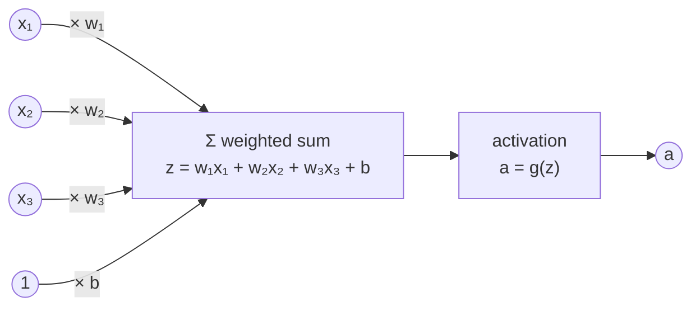
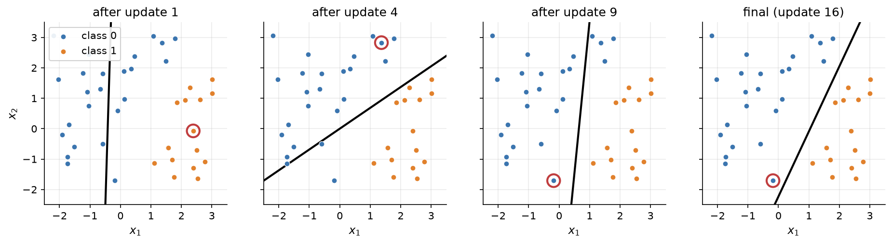
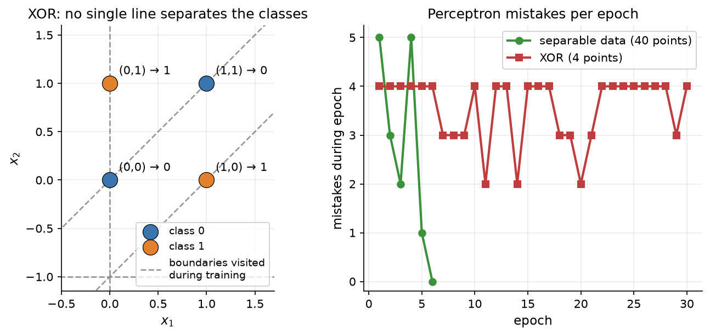
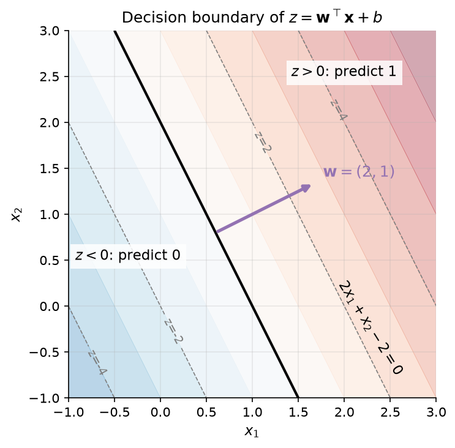
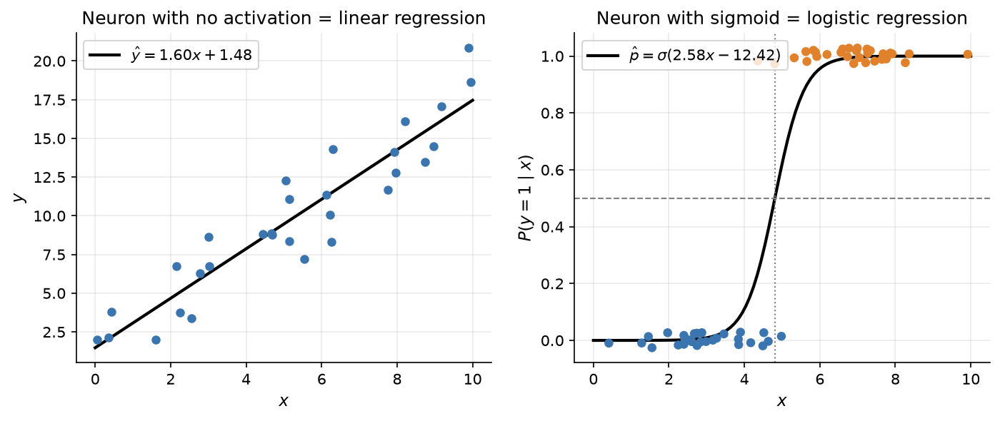

# 2.1 From Biological Inspiration to the Artificial Neuron

A large language model with hundreds of billions of parameters is, at bottom, one simple computation repeated at enormous scale: take a set of input numbers, multiply each by a learned weight, add a bias, and pass the sum through a nonlinear function. This unit is called an *artificial neuron*, and it is the basic building block of every network in this book. In this section we define the neuron, introduce the perceptron learning rule (the oldest algorithm for training one from labeled examples), and examine precisely what a single neuron can and cannot represent. Along the way you will see that a neuron is the same model as linear or logistic regression, depending on its activation function, and that its decision boundary is always a straight line (a hyperplane in higher dimensions). That geometric limitation means a single neuron cannot solve even a problem as simple as XOR, and it is what motivated networks with hidden layers, the subject of the rest of this chapter.

## A short history

The story begins in 1943, when the neurophysiologist Warren McCulloch and the logician Walter Pitts proposed a mathematical model of a nerve cell. A biological neuron receives electrical signals from other neurons through its dendrites, and if the combined input is strong enough, it "fires" a signal down its axon. McCulloch and Pitts abstracted this into a unit with binary inputs and a binary output: the unit outputs 1 if the sum of its excitatory inputs reaches a threshold and no inhibitory input is active, and 0 otherwise. They showed that networks of such units can compute any logical function. Their neurons had fixed, hand-set connections, though; nothing in the model *learned*.

In 1958 the psychologist Frank Rosenblatt introduced the *perceptron*, which added the missing ingredient: adjustable weights and a rule for changing them from examples. Rosenblatt's perceptron could be shown labeled examples and would gradually adjust itself until it classified them correctly, provided a correct setting of the weights existed. The perceptron attracted enormous attention and optimism.

That optimism faded after Marvin Minsky and Seymour Papert published their book *Perceptrons* in 1969. They analyzed carefully what single-layer perceptrons can compute and showed that some very simple functions are out of reach. The most famous example is XOR (exclusive or): output 1 if exactly one of two binary inputs is 1. No single perceptron can compute it, for a geometric reason we will see shortly. Multi-layer networks could in principle compute XOR, but nobody had a practical way to train the hidden layers. Research on neural networks slowed for more than a decade.

The comeback came in 1986, when David Rumelhart, Geoffrey Hinton, and Ronald Williams showed in a widely read *Nature* paper that *backpropagation*, an efficient way to compute gradients through a multi-layer network, lets hidden units learn useful internal representations. (The underlying mathematics of reverse-mode differentiation had been discovered earlier, as Section 2.6 notes, but this paper made it the standard training method for neural networks.) Every model in this book, including every LLM, is trained by a descendant of that method.

It is worth being clear about what the biological analogy does and does not buy us. Real neurons are far more complicated than the units in this chapter: they spike in time, their dendrites perform nonlinear computation, and brains do not appear to learn by backpropagation. Modern neural networks are best understood as a family of flexible mathematical functions that happen to have been inspired by neuroscience. From here on we will treat them as mathematics.

## The artificial neuron

An artificial neuron takes an input vector $`\mathbf{x} = (x_1, \dots, x_d)`$, computes a weighted sum of the inputs plus a bias, and applies an *activation function* $g$ to the result:

```math
z = \sum_{i=1}^{d} w_i x_i + b = \mathbf{w}^\top \mathbf{x} + b, \qquad a = g(z).
```

The pieces have standard names:

- The **inputs** $`x_i`$ are the features of one example, such as pixel intensities or measurements.
- The **weights** $`w_i`$ say how strongly each input influences the neuron, and in which direction. A positive weight means "more of this input pushes the output up"; a negative weight pushes it down.
- The **bias** $b$ shifts the weighted sum up or down independently of the input. Without it, the neuron's decision would be forced to pass through the origin.
- The **pre-activation** $z$ (also called the *logit* when it feeds a sigmoid or softmax) is the weighted sum plus bias.
- The **activation function** $g$ turns $z$ into the neuron's output $a$, also called its *activation*.

Figure 2.1 shows the flow of computation.



*Figure 2.1: An artificial neuron with three inputs. Each input is multiplied by its weight, the products and the bias are summed into the pre-activation z, and the activation function g produces the output a. The bias can be drawn as the weight on a constant input of 1.*

A tiny numeric example makes this concrete. Let $`\mathbf{x} = (2, -1, 0.5)`$, $`\mathbf{w} = (0.4, 0.3, -1.0)`$, and $b = 0.1$. Then

```math
z = 0.4 \cdot 2 + 0.3 \cdot (-1) + (-1.0) \cdot 0.5 + 0.1 = 0.8 - 0.3 - 0.5 + 0.1 = 0.1.
```

With a step activation (output 1 if $`z \gt 0`$, else 0), the neuron outputs 1. With a sigmoid activation $`\sigma(z) = 1/(1+e^{-z})`$, it outputs $`\sigma(0.1) \approx 0.525`$, a probability-like number just above one half. In NumPy the whole computation is one line:

```python
import numpy as np

x = np.array([2.0, -1.0, 0.5])
w = np.array([0.4, 0.3, -1.0])
b = 0.1

z = w @ x + b                      # weighted sum plus bias
step = float(z > 0)                # perceptron-style output
sigmoid = 1 / (1 + np.exp(-z))     # logistic output
print(f"z = {z:.3f}, step = {step:.0f}, sigmoid = {sigmoid:.3f}")
# z = 0.100, step = 1, sigmoid = 0.525
```

The choice of $g$ matters a great deal, and Section 2.2 is devoted to it. For now, two choices are enough: the *step function* used by the original perceptron, and the *sigmoid* used by logistic regression.

## The perceptron learning rule

Rosenblatt's perceptron is a neuron with a step activation used as a binary classifier. It is convenient to label the two classes $y = +1$ and $y = -1$ and to predict

```math
\hat{y} = \operatorname{sign}(\mathbf{w}^\top \mathbf{x} + b).
```

The learning rule is strikingly simple. Start with all weights and the bias at zero. Go through the training examples one at a time. Whenever an example is misclassified, meaning $`y\,(\mathbf{w}^\top \mathbf{x} + b) \le 0`$, nudge the weights toward the correct answer:

```math
\mathbf{w} \leftarrow \mathbf{w} + \eta\, y\, \mathbf{x}, \qquad b \leftarrow b + \eta\, y,
```

where $`\eta \gt 0`$ is a step size (the *learning rate*). Correctly classified examples cause no change. Why does this help? After the update, the new score on the same example is

```math
\mathbf{w}_{\text{new}}^\top \mathbf{x} + b_{\text{new}} = (\mathbf{w}^\top \mathbf{x} + b) + \eta\, y\, (\lVert \mathbf{x} \rVert^2 + 1),
```

so the score moves in the direction of the true label $y$ by a positive amount. Repeat until an entire pass through the data, an *epoch*, produces no mistakes.

Here is the complete algorithm in NumPy:

```python
import numpy as np

def train_perceptron(X, y, lr=1.0, max_epochs=100, seed=0):
    """X: (n, d) inputs; y: (n,) labels in {-1, +1}. Returns w, b, mistakes per epoch."""
    rng = np.random.default_rng(seed)
    w, b = np.zeros(X.shape[1]), 0.0
    mistakes = []
    for _ in range(max_epochs):
        errors = 0
        for i in rng.permutation(len(X)):
            if y[i] * (X[i] @ w + b) <= 0:       # wrong (or exactly on the boundary)
                w += lr * y[i] * X[i]
                b += lr * y[i]
                errors += 1
        mistakes.append(errors)
        if errors == 0:                          # a clean epoch: done
            break
    return w, b, mistakes

# The AND function is linearly separable ...
X = np.array([[0, 0], [0, 1], [1, 0], [1, 1]], dtype=float)
w, b, m = train_perceptron(X, np.array([-1, -1, -1, 1]))
print("AND:", w, b, "mistakes per epoch:", m)

# ... but XOR is not.
w, b, m = train_perceptron(X, np.array([-1, 1, 1, -1]), max_epochs=20)
print("XOR mistakes per epoch:", m)
```

Running it prints:

```text
AND: [2. 2.] -3.0 mistakes per epoch: [2, 2, 1, 2, 2, 3, 2, 2, 1, 0]
XOR mistakes per epoch: [4, 4, 4, 4, 4, 4, 3, 3, 3, 4, 2, 4, 4, 2, 4, 4, 4, 3, 3, 2]
```

For AND the perceptron finds weights $`\mathbf{w} = (2, 2)`$ and $b = -3$ after ten epochs: the score $`2x_1 + 2x_2 - 3`$ is positive only for the input $(1, 1)$. For XOR it never stops making mistakes.

Figure 2.2 shows the algorithm at work on a larger two-dimensional dataset. Each panel draws the current decision boundary, the line where the score is zero, and circles the example that triggered the most recent update. Early boundaries are poor, but each mistake rotates and shifts the line, and after 16 updates spread over six epochs every point is on the correct side.



*Figure 2.2: The perceptron learning rule on 40 linearly separable points. The black line is the decision boundary after the indicated number of updates; the red circle marks the misclassified point that caused the latest update. The final boundary separates the classes perfectly.*

There is a theorem behind this picture. The *perceptron convergence theorem* states that if the two classes can be separated by some hyperplane with a positive margin, the perceptron rule makes only a finite number of mistakes and then stops. The bound depends on how large the inputs are and how wide the margin is, not on the number of examples. The flip side is equally important: if no separating hyperplane exists, the rule never settles down, as the XOR run shows. Figure 2.3 puts the two cases side by side.



*Figure 2.3: Left: the four XOR points, with several of the boundaries the perceptron visited during training (dashed). Any line leaves at least one point on the wrong side. Right: mistakes per epoch. On separable data the count reaches zero and training stops; on XOR it keeps bouncing between 2 and 4 for as long as training runs.*

## The geometric view: a neuron draws a hyperplane

Why exactly can't a perceptron learn XOR? The answer is geometric. The set of inputs where a neuron's score is exactly zero,

```math
\{\mathbf{x} : \mathbf{w}^\top \mathbf{x} + b = 0\},
```

is a line in two dimensions, a plane in three, and a *hyperplane* in general. The neuron assigns one class to every point on one side and the other class to every point on the other side. Three facts about this hyperplane are worth remembering:

1. **The weight vector is perpendicular to the boundary.** If $`\mathbf{x}_1`$ and $`\mathbf{x}_2`$ both lie on the boundary, then $`\mathbf{w}^\top(\mathbf{x}_1 - \mathbf{x}_2) = 0`$, so $`\mathbf{w}`$ is orthogonal to every direction within the boundary. It points toward the side where the score is positive.
2. **The bias moves the boundary.** The distance from the origin to the hyperplane is $`|b| / \lVert \mathbf{w} \rVert`$. Changing $b$ slides the boundary without rotating it.
3. **The score measures signed distance.** For any point, $`(\mathbf{w}^\top \mathbf{x} + b)/\lVert \mathbf{w} \rVert`$ is its signed distance to the boundary. Points far from the boundary get large scores in magnitude; points near it get scores near zero. The contour lines of the score are hyperplanes parallel to the boundary.

Figure 2.4 illustrates all three facts for $`\mathbf{w} = (2, 1)`$ and $b = -2$.



*Figure 2.4: The score z = 2x₁ + x₂ − 2 over the plane. The black line z = 0 is the decision boundary; dashed lines are other level sets of z. The weight vector w = (2, 1), drawn in purple, is perpendicular to the boundary and points toward increasing z.*

A dataset is called **linearly separable** if some hyperplane puts all examples of one class on one side and all examples of the other class on the other side. A single neuron with a threshold can represent exactly the linearly separable classification problems, no more. XOR is not linearly separable: the positive points $(0,1)$ and $(1,0)$ sit on one diagonal of the unit square and the negative points $(0,0)$ and $(1,1)$ on the other, and no straight line separates two diagonals of a square. You can verify this algebraically. Suppose weights $`w_1, w_2`$ and bias $b$ classified all four points correctly. The negative points require $`b \le 0`$ and $`w_1 + w_2 + b \le 0`$; the positive points require $`w_1 + b \gt 0`$ and $`w_2 + b \gt 0`$. Adding the two positive conditions gives $`w_1 + w_2 + 2b \gt 0`$, and adding the two negative conditions gives $`w_1 + w_2 + 2b \le 0`$. Both cannot hold.

The way out, which Section 2.3 develops, is to first transform the inputs with a layer of neurons into a new representation in which the classes *are* linearly separable, and then draw a hyperplane there.

## Neurons as linear models

A single neuron is not a new kind of model. With the right activation function it is exactly one of the two most familiar models in statistics.

**No activation: linear regression.** If $g$ is the identity, the neuron outputs $`\hat{y} = \mathbf{w}^\top \mathbf{x} + b`$, a linear function of its inputs. Fitting the weights by minimizing the mean squared error between $`\hat{y}`$ and real-valued targets is precisely *linear regression*. This is the model to use when the target is a continuous quantity, such as a price or a temperature.

**Sigmoid activation: logistic regression.** If $g$ is the sigmoid,

```math
\hat{p} = \sigma(\mathbf{w}^\top \mathbf{x} + b) = \frac{1}{1 + e^{-(\mathbf{w}^\top \mathbf{x} + b)}},
```

the neuron outputs a number between 0 and 1 that we interpret as the probability of class 1. Fitting the weights by maximizing the likelihood of the observed labels, which is the same as minimizing the cross-entropy loss of Section 2.4, is *logistic regression*. The decision boundary is still the hyperplane $`\mathbf{w}^\top \mathbf{x} + b = 0`$, where $`\hat{p} = 0.5`$, but now the neuron also expresses confidence: points far from the boundary get probabilities near 0 or 1, and points near it get probabilities near one half.

Figure 2.5 shows both models fitted to small one-dimensional datasets.



*Figure 2.5: Left: a neuron with no activation, fitted by least squares, is linear regression. Right: a neuron with a sigmoid activation, fitted by gradient descent on the cross-entropy loss, is logistic regression. The dotted vertical line is the decision boundary, where the predicted probability crosses 0.5.*

Compared with the perceptron, logistic regression has two advantages that will matter throughout the book. First, the sigmoid is smooth, so the loss is a differentiable function of the weights and we can train with gradient descent (Section 2.5) instead of a special-purpose mistake-driven rule. Second, the output is a probability, which lets us measure *how* wrong a prediction is rather than only *whether* it is wrong. The perceptron's step function has a derivative of zero everywhere except at the jump, where it is undefined, so gradients carry no information through it. This is why modern networks use smooth or piecewise-linear activations, the subject of the next section.

The geometric limitation is unchanged, however. Linear regression can only fit linear trends, and logistic regression can only draw a linear boundary. To learn XOR, curved decision boundaries, or the intricate functions that map text to next-token probabilities, we need to combine many neurons into layers. That requires two ingredients: nonlinear activation functions (Section 2.2) and at least one hidden layer (Section 2.3).

## Key takeaways

- An artificial neuron computes a weighted sum of its inputs plus a bias, $`z = \mathbf{w}^\top \mathbf{x} + b`$, and passes it through an activation function $g$.
- The perceptron uses a step activation and a mistake-driven learning rule. It is guaranteed to converge when the data are linearly separable and never converges otherwise.
- Geometrically, a neuron's decision boundary is a hyperplane perpendicular to its weight vector, shifted by the bias. XOR cannot be solved because its classes are not linearly separable.
- A neuron with no activation is linear regression; a neuron with a sigmoid activation is logistic regression. Smooth activations make the model trainable by gradient descent.
- Going beyond linear boundaries requires hidden layers and nonlinear activations, which the next two sections introduce.

## Further reading

McCulloch, Warren S., et al. "A Logical Calculus of the Ideas Immanent in Nervous Activity." *Bulletin of Mathematical Biophysics* 5, no. 4 (1943): 115–133. https://doi.org/10.1007/BF02478259.

Minsky, Marvin, et al. *Perceptrons: An Introduction to Computational Geometry*. Cambridge, MA: MIT Press, 1969.

Nielsen, Michael A. *Neural Networks and Deep Learning*. Determination Press, 2015. http://neuralnetworksanddeeplearning.com/.

Rosenblatt, Frank. "The Perceptron: A Probabilistic Model for Information Storage and Organization in the Brain." *Psychological Review* 65, no. 6 (1958): 386–408. https://doi.org/10.1037/h0042519.

Rumelhart, David E., et al. "Learning Representations by Back-Propagating Errors." *Nature* 323 (1986): 533–536. https://doi.org/10.1038/323533a0.
