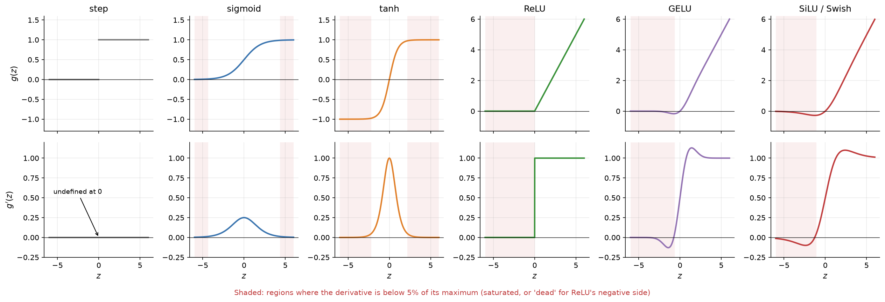
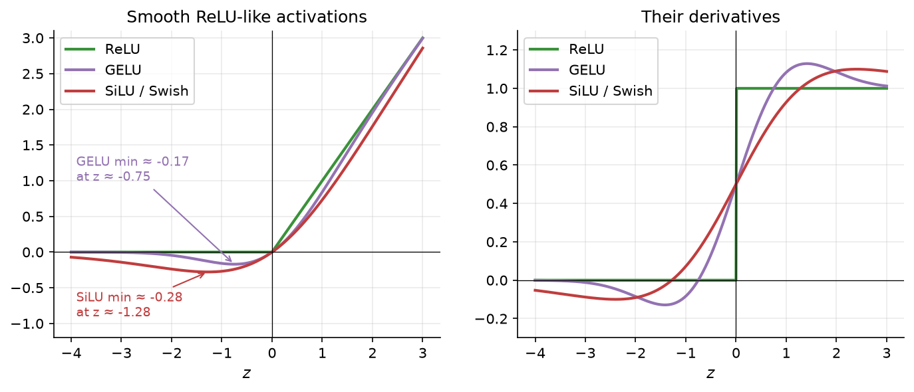

# 2.2 Activation Functions

The activation function is the only part of a neuron that is not linear. It looks like a small detail, a squashing curve applied at the end, but it decides whether a network can represent anything beyond a straight line, how well gradients flow during training, and how much each neuron costs to compute. This section explains why nonlinearity is essential, walks through the activation functions that have mattered historically and the ones used in today's transformers, and plots each function next to its derivative so you can see where learning slows down.

## Why nonlinearity matters

Suppose we build a network from layers that each compute an affine function (a matrix multiplication plus a bias) and apply *no* activation. With two layers,

```math
\mathbf{h} = W_1 \mathbf{x} + \mathbf{b}_1, \qquad \mathbf{y} = W_2 \mathbf{h} + \mathbf{b}_2 .
```

Substituting the first equation into the second gives

```math
\mathbf{y} = W_2 (W_1 \mathbf{x} + \mathbf{b}_1) + \mathbf{b}_2 = \underbrace{(W_2 W_1)}_{W}\, \mathbf{x} + \underbrace{(W_2 \mathbf{b}_1 + \mathbf{b}_2)}_{\mathbf{b}} .
```

The composition is again a single affine map $`W\mathbf{x} + \mathbf{b}`$. The same argument applies to any number of layers: a stack of a hundred linear layers computes exactly the same family of functions as one linear layer. Depth adds parameters and computation but no expressive power. In particular, a deep linear network still cannot solve XOR.

What makes a good activation function? A useful checklist:

- **Nonlinear**, so that depth adds expressive power.
- **Differentiable almost everywhere**, so that gradient descent can use it. A few kinks are fine in practice.
- **Non-saturating** where possible: the derivative should not be close to zero over large ranges of input, or learning stalls (more on this below).
- **Cheap to compute**, because it is applied to every hidden unit of every layer for every token.
- Ideally **roughly zero-centered**, which keeps the inputs to the next layer balanced around zero and tends to make optimization easier.

No function is best on every criterion, which is why several remain in use.

## Step and sigmoid: the historical choices

The **step function** used by the perceptron outputs 1 for positive inputs and 0 otherwise. It is the most literal version of a neuron "firing," but it is useless for gradient-based learning: its derivative is zero everywhere except at $z = 0$, where it does not exist. A small change in a weight almost never changes the output, so the gradient carries no signal about which direction to move.

The **sigmoid** (or logistic function) is a smooth version of the step:

```math
\sigma(z) = \frac{1}{1 + e^{-z}}, \qquad \sigma'(z) = \sigma(z)\,\bigl(1 - \sigma(z)\bigr).
```

It maps any real number into $(0, 1)$, rises most steeply at $z = 0$, and has the convenient property that its derivative can be computed from its output. It was the default hidden-layer activation in the backpropagation era of the late 1980s and 1990s, and it is still the right choice for an output that must be a probability, as in logistic regression or a binary classifier.

As a hidden-layer activation, however, the sigmoid has a serious flaw: **saturation**. For large positive or negative $z$, the curve is almost flat, so its derivative is almost zero. At $z = 5$, for example, $`\sigma(5) \approx 0.9933`$ and $`\sigma'(5) \approx 0.0066`$. Even the maximum of the derivative is only $`\sigma'(0) = 0.25`$. During backpropagation (Section 2.6), the gradient that reaches a weight is multiplied by the activation's derivative at every layer it passes through. A saturated unit therefore passes back almost no gradient, and its incoming weights barely change. In a deep network, multiplying many factors that are at most 0.25 shrinks gradients exponentially with depth, a problem called *vanishing gradients* that Chapter 3 treats in detail.

The sigmoid also is not zero-centered: its outputs are always positive. If all the inputs to a neuron are positive, then the gradients of all its incoming weights share the same sign for a given example, which makes the optimization path zig-zag. This effect is one reason LeCun and colleagues recommended zero-centered inputs and activations in their classic "Efficient BackProp" guide.

## Tanh: zero-centered, but still saturating

The **hyperbolic tangent** is a rescaled and shifted sigmoid:

```math
\tanh(z) = \frac{e^{z} - e^{-z}}{e^{z} + e^{-z}} = 2\sigma(2z) - 1, \qquad \tanh'(z) = 1 - \tanh^2(z).
```

Its outputs lie in $(-1, 1)$ and are centered on zero, and its derivative peaks at 1 rather than 0.25, so gradients shrink less as they pass through a tanh unit near zero. In practice, tanh hidden units usually trained faster than sigmoid units, and tanh remained common in recurrent networks for a long time. But tanh saturates just like the sigmoid: at $z = 3$ its derivative is already below 0.01. We will use tanh for the small networks in this chapter because its smoothness makes hand calculations pleasant.

## ReLU: cheap and non-saturating

The **rectified linear unit** is almost embarrassingly simple:

```math
\mathrm{ReLU}(z) = \max(0, z), \qquad \mathrm{ReLU}'(z) = \begin{cases} 1 & z \gt 0 \\ 0 & z \lt 0 \end{cases}
```

(At exactly $z = 0$ the derivative is undefined; software simply picks 0 or 1, and in practice the choice does not matter.) ReLU became the default activation for deep networks after work around 2010–2011, notably by Nair and Hinton and by Glorot, Bordes, and Bengio, showed that it made deep networks easier to train than sigmoid or tanh. Its advantages:

- **No saturation for positive inputs.** The derivative is exactly 1 whenever the unit is active, so gradients pass through active units unchanged.
- **Cheap.** A comparison and a selection, with no exponentials.
- **Sparse activations.** For a typical input, a good fraction of units output exactly zero, which some researchers argue is a useful inductive bias.

ReLU's weakness is the flip side of its flat left half. A unit whose pre-activation is negative for *every* input in the training set outputs zero everywhere and receives zero gradient, so its weights never change again. Such a unit is called **dead**. Dead units can arise from an unlucky initialization or, more commonly, from a large gradient step that pushes a unit's bias far negative. A network with many dead units has effectively lost capacity. The practical remedies are sensible learning rates and initialization, and variants such as *leaky ReLU*, which uses a small slope (for example 0.01) instead of zero for negative inputs.

## Smooth modern variants: GELU and SiLU

Transformers, including the GPT family, mostly do not use plain ReLU. They use smooth functions that behave like ReLU for large positive and negative inputs but curve gently near zero.

The **Gaussian error linear unit (GELU)**, introduced by Hendrycks and Gimpel, weights its input by the probability that a standard normal random variable is smaller than it:

```math
\mathrm{GELU}(z) = z \, \Phi(z), \qquad \Phi(z) = \tfrac{1}{2}\left(1 + \mathrm{erf}\!\left(z/\sqrt{2}\right)\right),
```

where $`\Phi`$ is the standard normal cumulative distribution function. One intuition: ReLU multiplies its input by a hard gate that is either 0 or 1 depending on the sign of $z$; GELU multiplies by a soft gate $`\Phi(z)`$ that rises smoothly from 0 to 1. A widely used approximation is $`0.5\,z\,\bigl(1 + \tanh[\sqrt{2/\pi}\,(z + 0.044715\,z^3)]\bigr)`$. GELU is the activation in the feed-forward blocks of BERT and GPT-2.

The **sigmoid linear unit (SiLU)**, also called **Swish**, uses the sigmoid as the soft gate:

```math
\mathrm{SiLU}(z) = z\,\sigma(z), \qquad \mathrm{SiLU}'(z) = \sigma(z)\,\bigl(1 + z\,(1 - \sigma(z))\bigr).
```

It was proposed by Elfwing and colleagues for reinforcement learning, and it was independently rediscovered by Ramachandran and colleagues through an automated search over candidate activation functions, where it was named Swish. The name was later generalized to $`z\,\sigma(\beta z)`$ with a parameter $`\beta`$; SiLU is the case $`\beta = 1`$.

GELU and SiLU look nearly identical at a glance. Both are smooth everywhere, both approach $z$ for large positive $z$ and 0 for large negative $z$, and both are *non-monotonic*: they dip slightly below zero for moderately negative inputs. Figure 2.4 below shows that GELU reaches a minimum of about $-0.17$ near $z = -0.75$, and SiLU a minimum of about $-0.28$ near $z = -1.28$. Unlike ReLU, their derivatives are nonzero for small negative inputs, so a unit that is "slightly off" still receives some gradient.

Modern LLMs such as LLaMA go one step further and use *gated* feed-forward layers, in which one linear projection is passed through SiLU and multiplied elementwise by a second linear projection. This combination, called SwiGLU, comes back in Section 8.2 as the feed-forward network of modern GPT blocks.

## Plotting each function and its derivative

The best way to internalize these functions is to look at them. Figure 2.3 plots each activation above its derivative, and Figure 2.4 takes a closer look at ReLU and its smooth relatives near zero. (The NumPy definitions behind both figures, with a table of values at a few sample points, are in [Code 2.2.1](#code-221-activation-functions-and-their-derivatives).)

Read the derivative panels first. Sigmoid and tanh derivatives fall toward zero at both ends: those are the saturated regions. ReLU's derivative is exactly 0 or 1. GELU and SiLU derivatives are close to 1 for positive inputs, are small but nonzero for negative inputs, and even overshoot 1 slightly just above zero; GELU's derivative is about 1.08 at $z = 1$, and SiLU's about 1.09 at $z = 3$.



*Figure 2.3: Six activation functions (top) and their derivatives (bottom). Shaded bands mark where the derivative is below 5% of its maximum: the saturated tails of sigmoid and tanh, the dead negative half of ReLU, and the far negative tails of GELU and SiLU. The step function's derivative is zero everywhere it is defined.*



*Figure 2.4: A closer look at ReLU and its smooth relatives. GELU and SiLU are smooth, dip slightly below zero for negative inputs, and have derivatives that change gradually instead of jumping from 0 to 1.*

A practical guide to choosing:

| Where | Typical choice | Why |
|---|---|---|
| Hidden layers of a small MLP (this chapter) | tanh or ReLU | Simple, easy to differentiate by hand |
| Hidden layers of deep feed-forward and convolutional networks | ReLU (or leaky ReLU) | Cheap, non-saturating |
| Feed-forward blocks of transformers and LLMs | GELU, or SiLU inside SwiGLU | Smooth, slightly better results at scale |
| Output for a binary probability | sigmoid | Maps to (0, 1) |
| Output for a multi-class distribution | softmax (Section 2.4) | Produces a probability vector |
| Output for regression | none (identity) | Target is an unbounded real number |

## Code for this section

The listings below collect the code for this section in the order in which the text refers to them. Later listings may reuse imports and definitions from earlier ones.

### Code 2.2.1: Activation functions and their derivatives

NumPy definitions of sigmoid, tanh, ReLU, GELU, and SiLU, each paired with its derivative. The same definitions generate Figures 2.3 and 2.4; the loop prints each function and its derivative at seven sample points.

```python
import math
import numpy as np

def sigmoid(z):
    return 1 / (1 + np.exp(-z))

erf = np.vectorize(math.erf)
def normal_cdf(z):
    return 0.5 * (1 + erf(z / math.sqrt(2)))
def normal_pdf(z):
    return np.exp(-0.5 * z**2) / math.sqrt(2 * math.pi)

activations = {   # name: (function, derivative)
    "sigmoid": (sigmoid,                        lambda z: sigmoid(z) * (1 - sigmoid(z))),
    "tanh":    (np.tanh,                        lambda z: 1 - np.tanh(z) ** 2),
    "relu":    (lambda z: np.maximum(0, z),     lambda z: (z > 0).astype(float)),
    "gelu":    (lambda z: z * normal_cdf(z),    lambda z: normal_cdf(z) + z * normal_pdf(z)),
    "silu":    (lambda z: z * sigmoid(z),       lambda z: sigmoid(z) * (1 + z * (1 - sigmoid(z)))),
}

np.set_printoptions(suppress=True)
z = np.array([-5.0, -3.0, -1.0, 0.0, 1.0, 3.0, 5.0])
for name, (f, df) in activations.items():
    print(f"{name:8s} g(z):  ", np.round(f(z), 3))
    print(f"{'':8s} g'(z): ", np.round(df(z), 3))
```

The printed table is a compact summary of the figures:

```text
sigmoid  g(z):   [0.007 0.047 0.269 0.5   0.731 0.953 0.993]
         g'(z):  [0.007 0.045 0.197 0.25  0.197 0.045 0.007]
tanh     g(z):   [-1.    -0.995 -0.762  0.     0.762  0.995  1.   ]
         g'(z):  [0.   0.01 0.42 1.   0.42 0.01 0.  ]
relu     g(z):   [0. 0. 0. 0. 1. 3. 5.]
         g'(z):  [0. 0. 0. 0. 1. 1. 1.]
gelu     g(z):   [-0.    -0.004 -0.159  0.     0.841  2.996  5.   ]
         g'(z):  [-0.    -0.012 -0.083  0.5    1.083  1.012  1.   ]
silu     g(z):   [-0.033 -0.142 -0.269  0.     0.731  2.858  4.967]
         g'(z):  [-0.027 -0.088  0.072  0.5    0.928  1.088  1.027]
```
## Key takeaways

- Without a nonlinear activation, any stack of linear layers collapses into a single linear layer, so depth adds nothing.
- Sigmoid and tanh saturate: for large inputs their derivatives are close to zero, which starves the weights of gradient. Tanh is zero-centered and has a larger peak derivative, but saturates just the same.
- ReLU is cheap and does not saturate for positive inputs, which made deep networks much easier to train; its weakness is dead units that never activate.
- GELU and SiLU/Swish are smooth, non-monotonic cousins of ReLU used in transformers; the gated variant SwiGLU appears in Section 8.2.
- Always look at the derivative, not just the function: the derivative is what backpropagation multiplies by.

## Further reading

Elfwing, Stefan, et al. "Sigmoid-Weighted Linear Units for Neural Network Function Approximation in Reinforcement Learning." *Neural Networks* 107 (2018): 3–11. https://doi.org/10.1016/j.neunet.2017.12.012.

Glorot, Xavier, et al. "Deep Sparse Rectifier Neural Networks." In *Proceedings of the Fourteenth International Conference on Artificial Intelligence and Statistics*, 315–323. PMLR 15, 2011. https://proceedings.mlr.press/v15/glorot11a.html.

Hendrycks, Dan, et al. "Gaussian Error Linear Units (GELUs)." arXiv preprint arXiv:1606.08415, 2016. https://arxiv.org/abs/1606.08415.

LeCun, Yann, et al. "Efficient BackProp." In *Neural Networks: Tricks of the Trade*, 9–50. Lecture Notes in Computer Science 1524. Berlin: Springer, 1998. https://doi.org/10.1007/3-540-49430-8_2.

Ramachandran, Prajit, et al. "Searching for Activation Functions." arXiv preprint arXiv:1710.05941, 2017. https://arxiv.org/abs/1710.05941.
