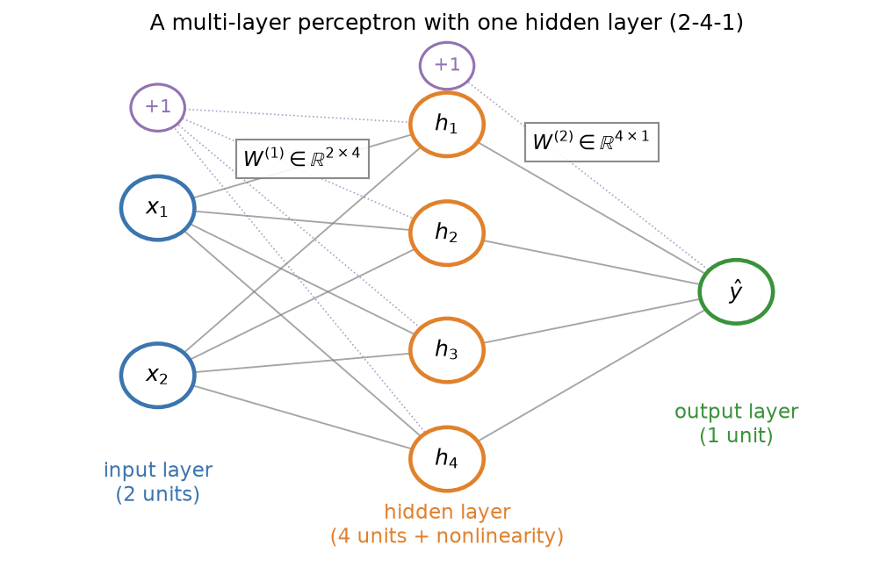
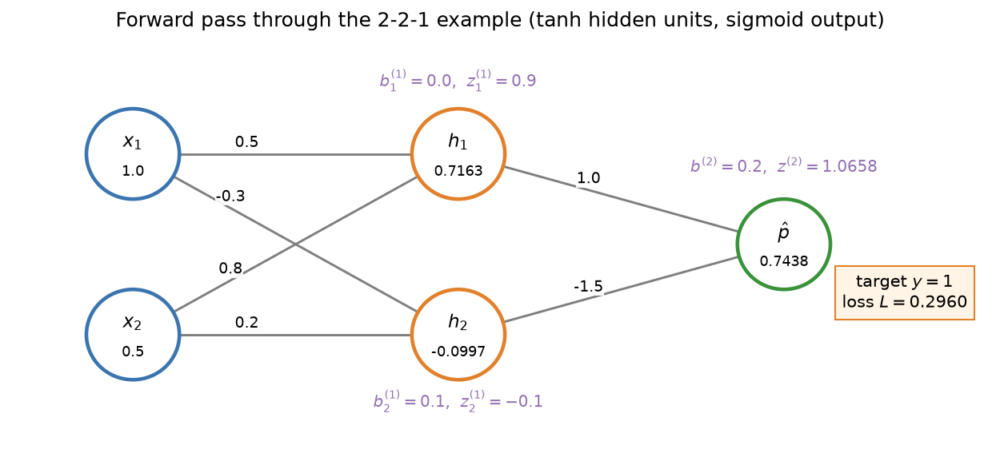
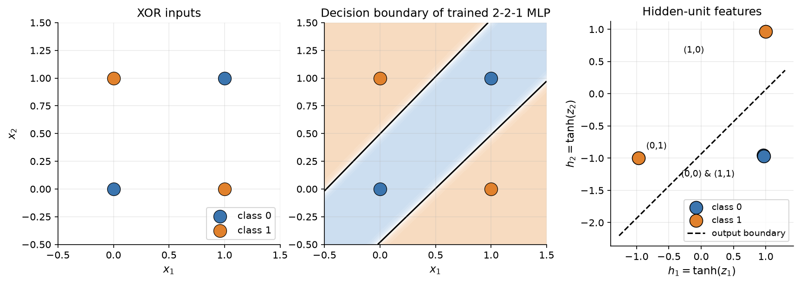
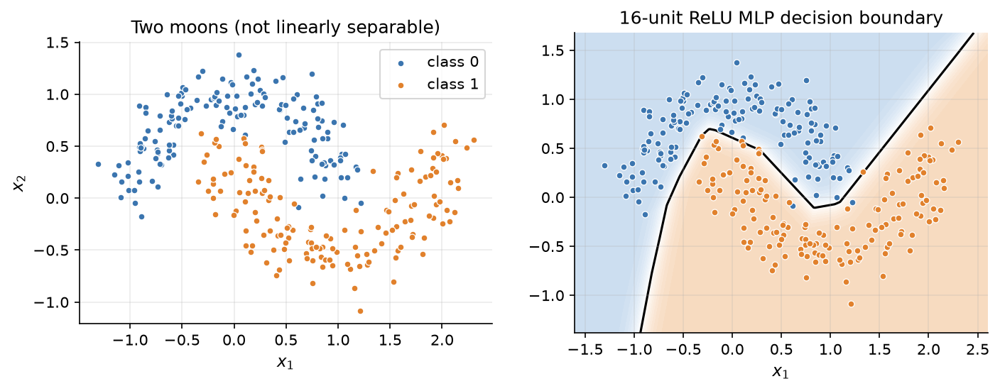
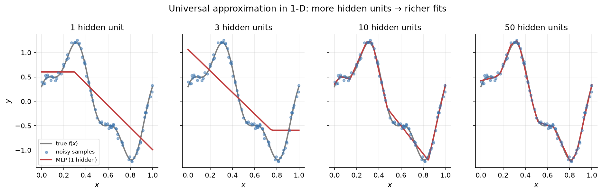

# 2.3 The Multi-Layer Perceptron

Section 2.1 ended with a limitation: a single neuron can only draw a straight line. Section 2.2 supplied half of the fix, nonlinear activations. This section supplies the other half. By placing a layer of neurons between the input and the output, we get a *multi-layer perceptron* (MLP), the simplest neural network that deserves the name. We will write the MLP as a pair of matrix multiplications, trace a forward pass by hand with actual numbers, watch a hidden layer solve XOR by inventing new features, and then discuss what the universal approximation theorem does and does not promise.

## Layers as matrix multiplications

An MLP with one hidden layer has three layers of units:

- The **input layer** holds the $d$ features of an example. It does no computation; it simply presents $`\mathbf{x} \in \mathbb{R}^d`$ to the next layer.
- The **hidden layer** has $H$ neurons. Each one computes its own weighted sum of all the inputs, adds its own bias, and applies an activation $g$. The layer is called hidden because its values are not given in the data: the network has to discover what they should be.
- The **output layer** has $C$ neurons that combine the hidden activations into the final prediction. For a regression it may output one real number; for a classifier, one score per class.

Because every unit in one layer connects to every unit in the next, these are called *fully connected* or *dense* layers. Figure 2.6 draws a network with two inputs, four hidden units, and one output, written "2-4-1."



*Figure 2.6: A multi-layer perceptron with two inputs, one hidden layer of four units, and one output. Every gray line is a weight. The "+1" nodes stand for biases, drawn as weights on a constant input. The hidden layer applies a nonlinearity; the weights of the two layers form matrices W⁽¹⁾ (2 × 4) and W⁽²⁾ (4 × 1).*

Writing out every weighted sum separately quickly becomes unwieldy. Instead we collect the weights of a layer into a matrix. We use the convention, common in code, that an example is a row vector and each *column* of a weight matrix holds the incoming weights of one unit. For a single example $`\mathbf{x} \in \mathbb{R}^{1 \times d}`$, the forward pass is

```math
\begin{aligned}
\mathbf{z}^{(1)} &= \mathbf{x}\, W^{(1)} + \mathbf{b}^{(1)} &&\in \mathbb{R}^{1 \times H} \\
\mathbf{h} &= g\bigl(\mathbf{z}^{(1)}\bigr) &&\in \mathbb{R}^{1 \times H} \\
\mathbf{z}^{(2)} &= \mathbf{h}\, W^{(2)} + \mathbf{b}^{(2)} &&\in \mathbb{R}^{1 \times C} \\
\hat{\mathbf{y}} &= o\bigl(\mathbf{z}^{(2)}\bigr) &&\in \mathbb{R}^{1 \times C}
\end{aligned}
```

with $`W^{(1)} \in \mathbb{R}^{d \times H}`$, $`\mathbf{b}^{(1)} \in \mathbb{R}^{H}`$, $`W^{(2)} \in \mathbb{R}^{H \times C}`$, and $`\mathbf{b}^{(2)} \in \mathbb{R}^{C}`$. The superscript in parentheses is a layer index, not a power. The function $g$ is the hidden activation (tanh, ReLU, GELU, ...) applied elementwise, and $o$ is the output function: the identity for regression, a sigmoid for a single probability, or the softmax of Section 2.4 for a distribution over classes. Entry $`W^{(1)}_{ij}`$ is the weight from input $i$ to hidden unit $j$.

Many textbooks instead write column vectors and $`\mathbf{z} = W\mathbf{x} + \mathbf{b}`$ with $`W \in \mathbb{R}^{H \times d}`$. The two conventions are transposes of each other and describe the same network. We use the row convention because it matches NumPy and PyTorch code, where a batch of examples is stored as a matrix with one example per row.

## The forward pass, step by step

Computing the output of the network from its input is called the **forward pass**. With a batch of $B$ examples stacked into a matrix $`X \in \mathbb{R}^{B \times d}`$, the same equations apply unchanged: $`X W^{(1)}`$ has shape $`B \times H`$, and the bias vector is added to every row. (Section 2.7 discusses this "broadcasting" in detail.) Keeping track of shapes is the single best habit for writing correct neural network code, so here is the forward pass with every shape written out:

| Step | Formula | Shape |
|---|---|---|
| Input batch | $X$ | $`B \times d`$ |
| Hidden pre-activation | $`Z^{(1)} = X W^{(1)} + \mathbf{b}^{(1)}`$ | $`(B \times d)(d \times H) \to B \times H`$ |
| Hidden activation | $`H = g(Z^{(1)})`$ | $`B \times H`$ |
| Output pre-activation (logits) | $`Z^{(2)} = H W^{(2)} + \mathbf{b}^{(2)}`$ | $`(B \times H)(H \times C) \to B \times C`$ |
| Output | $`\hat{Y} = o(Z^{(2)})`$ | $`B \times C`$ |

In NumPy the forward pass takes just four lines ([Code 2.3.1](#code-231-the-mlp-forward-pass-with-shapes)).

### A worked example with actual numbers

Let us push one example through a tiny 2-2-1 network by hand. We will reuse exactly this network in Section 2.6 to compute gradients, so it is worth following carefully. The hidden units use tanh and the output unit uses a sigmoid, so the network outputs the probability that the example belongs to class 1. The parameters are

```math
W^{(1)} = \begin{pmatrix} 0.5 & -0.3 \\ 0.8 & 0.2 \end{pmatrix}, \quad
\mathbf{b}^{(1)} = (0.0,\ 0.1), \quad
W^{(2)} = \begin{pmatrix} 1.0 \\ -1.5 \end{pmatrix}, \quad
b^{(2)} = 0.2,
```

and the input is $`\mathbf{x} = (1.0,\ 0.5)`$ with true label $y = 1$.

**Hidden pre-activations.** Each hidden unit takes a weighted sum of the two inputs using its column of $`W^{(1)}`$:

```math
\begin{aligned}
z^{(1)}_1 &= 1.0 \cdot 0.5 + 0.5 \cdot 0.8 + 0.0 = 0.9, \\
z^{(1)}_2 &= 1.0 \cdot (-0.3) + 0.5 \cdot 0.2 + 0.1 = -0.1.
\end{aligned}
```

**Hidden activations.** Apply tanh elementwise:

```math
h_1 = \tanh(0.9) \approx 0.7163, \qquad h_2 = \tanh(-0.1) \approx -0.0997.
```

**Output pre-activation (logit).**

```math
z^{(2)} = 0.7163 \cdot 1.0 + (-0.0997) \cdot (-1.5) + 0.2 \approx 0.7163 + 0.1495 + 0.2 = 1.0658.
```

**Output probability.**

```math
\hat{p} = \sigma(1.0658) = \frac{1}{1 + e^{-1.0658}} \approx 0.7438.
```

The network assigns probability 0.744 to the correct class. Section 2.4 will define the cross-entropy loss for this prediction as $`-\ln 0.7438 \approx 0.2960`$. Figure 2.7 shows every intermediate value on the network diagram, and [Code 2.3.2](#code-232-checking-the-2-2-1-worked-example) checks the arithmetic in a few lines of NumPy.



*Figure 2.7: The forward pass of the worked example. Numbers on the edges are weights; numbers inside the nodes are activations. Purple labels give each unit's bias and pre-activation. The output probability is 0.7438 and the cross-entropy loss for the target y = 1 is 0.2960.*

## Solving XOR with one hidden layer

Now we can finally solve XOR. The key idea is that the hidden layer transforms the input into a new representation, and the output neuron only needs to draw a line in *that* space.

### A solution by hand

With ReLU hidden units, there is a tidy hand-built solution. Use two hidden units that both look at the sum $`x_1 + x_2`$:

```math
h_1 = \mathrm{ReLU}(x_1 + x_2), \qquad h_2 = \mathrm{ReLU}(x_1 + x_2 - 1), \qquad \hat{y} = h_1 - 2 h_2 .
```

The first unit counts how many inputs are on; the second unit fires only when both are on. Here is the whole truth table:

| $`x_1`$ | $`x_2`$ | $`h_1`$ | $`h_2`$ | $`\hat{y} = h_1 - 2h_2`$ | XOR |
|---|---|---|---|---|---|
| 0 | 0 | 0 | 0 | 0 | 0 |
| 0 | 1 | 1 | 0 | 1 | 1 |
| 1 | 0 | 1 | 0 | 1 | 1 |
| 1 | 1 | 2 | 1 | 0 | 0 |

In matrix form, $`W^{(1)} = \begin{pmatrix} 1 \;\; 1 \\ 1 \;\; 1 \end{pmatrix}`$, $`\mathbf{b}^{(1)} = (0, -1)`$, $`W^{(2)} = (1, -2)^\top`$, and $`b^{(2)} = 0`$. In the hidden space the four inputs map to the points $(0,0)$, $(1,0)$, $(1,0)$, and $(2,1)$. The two positive examples land on the same point, and a line easily separates it from the other two. The ReLU in the second unit is what makes this work: without it, $`\hat{y}`$ would be a linear function of $`x_1 + x_2`$ and could not rise and then fall. [Code 2.3.3](#code-233-the-hand-built-xor-network) evaluates this network on all four inputs and reproduces the table.

### A solution found by training

We do not want to design weights by hand for every problem. Instead, we let gradient descent find them, using the loss of Section 2.4, the gradients of Section 2.6, and the optimizer of Section 2.5. Training a 2-2-1 network with tanh hidden units and a sigmoid output on the four XOR points produces the result in Figure 2.8. (The run uses full-batch gradient descent with learning rate 1.5 for 3,000 steps from one particular random initialization; some initializations get stuck, a first hint of the non-convexity discussed in Section 2.5.)



*Figure 2.8: Left: the XOR inputs. Middle: the decision boundary of a trained 2-2-1 network is a band made of two roughly parallel lines, one contributed by each hidden unit. Right: the same four points in the space of hidden activations. The inputs (0,0) and (1,1) are mapped almost on top of each other, and the output neuron separates the classes with a single line (dashed).*

The right panel of Figure 2.8 is the most important picture in this section. The trained hidden layer maps $(0,0)$ and $(1,1)$ to almost the same point, about $(0.96, -0.96)$, while $(0,1)$ goes to about $(-0.97, -1.00)$ and $(1,0)$ to about $(1.00, 0.97)$. In this new coordinate system the classes are linearly separable, and the output neuron, which is just logistic regression on the hidden activations, can do its job. The network has *learned a feature*. Nobody told it to detect "exactly one input is on"; the representation emerged from minimizing the loss.

This is the central idea of deep learning, and it scales all the way up to LLMs: each layer re-represents its input so that the next layer's job becomes easier. In a language model, the "features" are directions in a high-dimensional space that encode things like syntax, topic, and meaning (Chapter 4).

### A harder dataset: two moons

XOR has only four points. Figure 2.9 shows a more realistic example, the "two moons" dataset: two interleaving half-circles with noise. No straight line separates them, but a 16-unit ReLU MLP trained with gradient descent reaches 98.3% training accuracy with a curved boundary. Because the hidden units are ReLUs, the boundary is made of straight segments: each hidden unit contributes a line where it switches on or off, and the output combines these pieces.



*Figure 2.9: Left: the two-moons dataset (300 points). Right: the decision boundary of a trained MLP with 16 ReLU hidden units. The boundary is piecewise linear because ReLU units are piecewise linear.*

## Universal approximation

How powerful is one hidden layer? The surprising answer is: in principle, powerful enough for any reasonable function. In 1989, George Cybenko proved that a network with one hidden layer of sigmoid units and a linear output can approximate any continuous function on a closed and bounded region (such as the cube $[0,1]^d$) to any desired accuracy, provided the hidden layer is wide enough. In the same year, Kurt Hornik, Maxwell Stinchcombe, and Halbert White proved a similar result for a broad class of "squashing" activation functions. Later work by Leshno and colleagues showed that the result holds for any continuous activation function that is not a polynomial, which includes ReLU.

Formally, for any continuous $f$ on $[0,1]^d$ and any $`\varepsilon \gt 0`$, there exist a width $H$ and parameters such that

```math
\left| f(\mathbf{x}) - \sum_{j=1}^{H} v_j \, g\bigl(\mathbf{w}_j^\top \mathbf{x} + b_j\bigr) \right| \lt \varepsilon \quad \text{for all } \mathbf{x} \in [0,1]^d .
```

In one dimension there is a simple intuition for ReLU networks. Each hidden unit $`\mathrm{ReLU}(w x + b)`$ is a hinge that is flat on one side of the point $x = -b/w$ and a straight line on the other. A weighted sum of $H$ hinges is a piecewise-linear function with up to $H$ bends, and with enough bends you can trace any continuous curve as closely as you like, the same way a polygon with enough sides approximates a circle. Figure 2.10 shows this happening as the hidden layer widens.



*Figure 2.10: A one-hidden-layer ReLU network fitted to 80 noisy samples of a wiggly function, with 1, 3, 10, and 50 hidden units. Each hidden unit adds one possible bend. With 10 units the fit is already close; with 50 it is nearly indistinguishable from the true function. (Fits trained with PyTorch and the Adam optimizer, which Chapter 3 introduces.)*

Universal approximation is reassuring, but it is easy to read too much into it. The theorem guarantees that good weights *exist*. It says nothing about:

- **How many hidden units are needed.** For some functions the required width grows exponentially with the input dimension, which would make a shallow network impractically large.
- **How to find the weights.** The theorem is not about training. Gradient descent on a non-convex loss may or may not find a good approximation.
- **Generalization.** Fitting the training points closely is not the same as predicting new points well. Section 2.8 shows a network with enough capacity to fit noise.

In practice, deeper networks with several narrower layers often represent the same functions with far fewer parameters than one enormous hidden layer, and they are easier to train well. That is the subject of Chapter 3.

## Counting parameters

Every weight and bias is a *parameter*: a number that training adjusts. For an MLP with $d$ inputs, $H$ hidden units, and $C$ outputs, the count is

```math
\underbrace{d \cdot H + H}_{\text{layer 1: } W^{(1)},\ \mathbf{b}^{(1)}} \; + \; \underbrace{H \cdot C + C}_{\text{layer 2: } W^{(2)},\ \mathbf{b}^{(2)}} \; = \; (d + 1) H + (H + 1) C .
```

Some examples, which the short function in [Code 2.3.4](#code-234-counting-mlp-parameters) also computes:

| Network | Parameters |
|---|---|
| 2-2-1 (worked example) | $`3 \cdot 2 + 3 \cdot 1 = 9`$ |
| 2-16-1 (two moons) | $`3 \cdot 16 + 17 \cdot 1 = 65`$ |
| 784-100-10 (a classic digit classifier on 28×28 images) | $`785 \cdot 100 + 101 \cdot 10 = 79{,}510`$ |

Almost all the parameters live in the weight matrices, and the count grows with the product of neighboring layer widths. The same arithmetic, applied to the much larger matrices inside a transformer, is how models end up with billions of parameters. A single feed-forward block in a model whose hidden size is 4,096, with an inner layer of 16,384 units, already has more than 134 million weights in its two matrices ($`2 \times 4096 \times 16384`$).

Going wider is one way to add capacity; going deeper is another. Chapter 3 explains why depth usually wins, and what new problems (vanishing gradients, careful initialization, normalization) it brings.

## Code for this section

The listings below collect the code for this section in the order in which the text refers to them. Later listings may reuse imports and definitions from earlier ones.

### Code 2.3.1: The MLP forward pass with shapes

A one-hidden-layer tanh MLP applied to a random batch of five three-dimensional examples. The comments track each tensor's shape, following the table in [The forward pass, step by step](#the-forward-pass-step-by-step).

```python
import numpy as np

def mlp_forward(X, W1, b1, W2, b2):
    Z1 = X @ W1 + b1          # (B, d) @ (d, H) + (H,)  -> (B, H)
    H = np.tanh(Z1)           # (B, H)
    Z2 = H @ W2 + b2          # (B, H) @ (H, C) + (C,)  -> (B, C)
    return Z2, H              # raw output scores and hidden activations

rng = np.random.default_rng(0)
B, d, Hdim, C = 5, 3, 4, 2
X = rng.normal(size=(B, d))
W1, b1 = rng.normal(size=(d, Hdim)), np.zeros(Hdim)
W2, b2 = rng.normal(size=(Hdim, C)), np.zeros(C)
Z2, H = mlp_forward(X, W1, b1, W2, b2)
print("X", X.shape, "-> H", H.shape, "-> Z2", Z2.shape)
# X (5, 3) -> H (5, 4) -> Z2 (5, 2)
```

### Code 2.3.2: Checking the 2-2-1 worked example

Reproduces the hand calculation of the worked example: pre-activations, tanh activations, logit, output probability, and cross-entropy loss. It reuses `np` from Code 2.3.1.

```python
x = np.array([1.0, 0.5])
W1 = np.array([[0.5, -0.3],
               [0.8,  0.2]])
b1 = np.array([0.0, 0.1])
W2 = np.array([1.0, -1.5])
b2 = 0.2

z1 = x @ W1 + b1
h = np.tanh(z1)
z2 = h @ W2 + b2
p = 1 / (1 + np.exp(-z2))
print("z1 =", z1, " h =", h.round(4), f" z2 = {z2:.4f}  p = {p:.4f}  loss = {-np.log(p):.4f}")
# z1 = [ 0.9 -0.1]  h = [ 0.7163 -0.0997]  z2 = 1.0658  p = 0.7438  loss = 0.2960
```

### Code 2.3.3: The hand-built XOR network

Evaluates the ReLU solution to XOR on all four inputs and prints the hidden representation and the output. It reuses `np` from Code 2.3.1.

```python
relu = lambda z: np.maximum(0, z)
X = np.array([[0, 0], [0, 1], [1, 0], [1, 1]], dtype=float)
W1 = np.array([[1.0, 1.0],
               [1.0, 1.0]])
b1 = np.array([0.0, -1.0])
W2 = np.array([1.0, -2.0])
H = relu(X @ W1 + b1)
print("hidden:", H.tolist(), " output:", H @ W2)
# hidden: [[0.0, 0.0], [1.0, 0.0], [1.0, 0.0], [2.0, 1.0]]  output: [0. 1. 1. 0.]
```

### Code 2.3.4: Counting MLP parameters

Evaluates the formula $`(d + 1) H + (H + 1) C`$ for the three networks in the parameter-count table.

```python
def count_params(d, H, C):
    return (d + 1) * H + (H + 1) * C

for d, H, C in [(2, 2, 1), (2, 16, 1), (784, 100, 10)]:
    print(f"{d}-{H}-{C}: {count_params(d, H, C):,} parameters")
```
## Key takeaways

- An MLP with one hidden layer computes $`\hat{\mathbf{y}} = o\bigl(g(\mathbf{x} W^{(1)} + \mathbf{b}^{(1)})\, W^{(2)} + \mathbf{b}^{(2)}\bigr)`$: two matrix multiplications with a nonlinearity in between.
- Writing out the shape of every tensor, $`(B \times d) \to (B \times H) \to (B \times C)`$, is the best defense against bugs.
- A hidden layer re-represents its input. On XOR, the trained hidden units map the inputs to a space where the classes are linearly separable: the network learns its own features.
- Universal approximation theorems say that one wide enough hidden layer can approximate any continuous function, but they say nothing about the width required, how to find the weights, or how well the result generalizes.
- A dense layer from $n$ units to $m$ units has $`(n + 1)\,m`$ parameters; parameter counts grow with the product of layer widths.

## Further reading

Cybenko, George. "Approximation by Superpositions of a Sigmoidal Function." *Mathematics of Control, Signals, and Systems* 2, no. 4 (1989): 303–314. https://doi.org/10.1007/BF02551274.

Goodfellow, Ian, et al. *Deep Learning*. Cambridge, MA: MIT Press, 2016. https://www.deeplearningbook.org/.

Hornik, Kurt, et al. "Multilayer Feedforward Networks Are Universal Approximators." *Neural Networks* 2, no. 5 (1989): 359–366. https://doi.org/10.1016/0893-6080(89)90020-8.

Leshno, Moshe, et al. "Multilayer Feedforward Networks with a Nonpolynomial Activation Function Can Approximate Any Function." *Neural Networks* 6, no. 6 (1993): 861–867. https://doi.org/10.1016/S0893-6080(05)80131-5.

Nielsen, Michael A. *Neural Networks and Deep Learning*. Determination Press, 2015. http://neuralnetworksanddeeplearning.com/.
