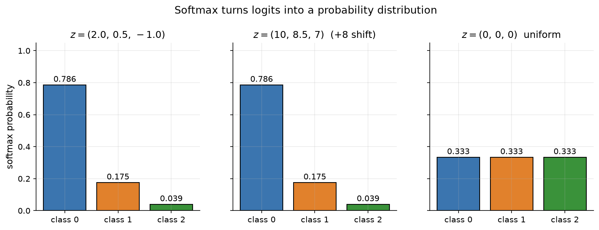
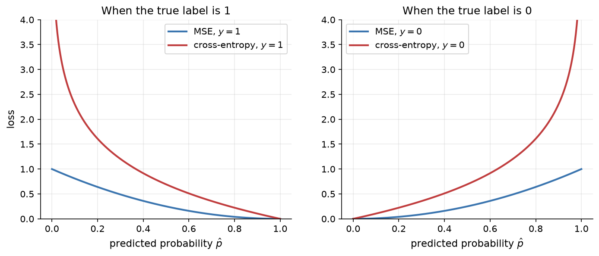
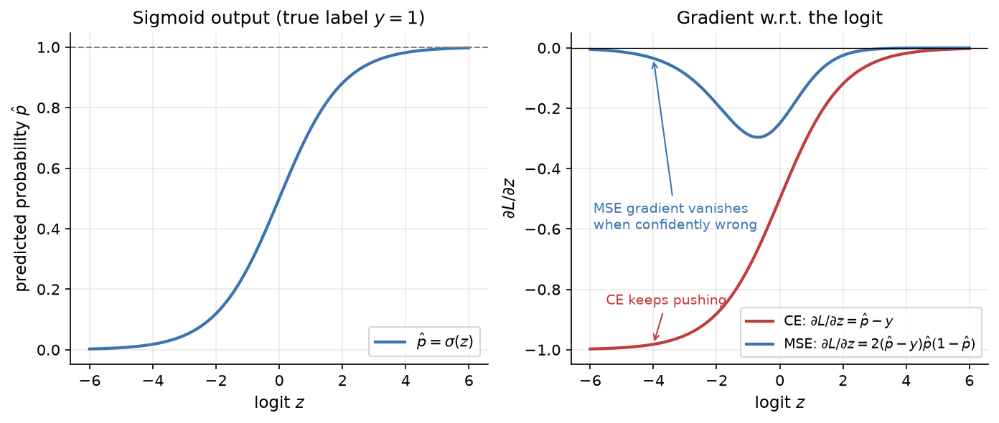
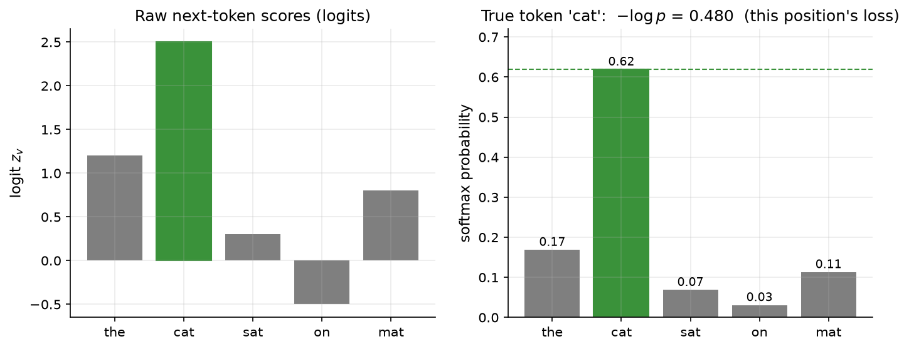

# 2.4 Loss Functions: Measuring Mistakes

A network with random weights produces random outputs. To improve it, we need a precise, numerical answer to the question "how wrong is it?" That answer is the *loss function*. This section introduces the two losses you will meet most often, mean squared error for regression and cross-entropy for classification, explains the softmax function that turns raw scores into probabilities, and derives the remarkably clean gradient of softmax combined with cross-entropy. We end with the connection that matters most for this book: training an LLM to predict the next token is exactly classification with a cross-entropy loss.

## The idea of a loss

A **loss function** $`\ell(\hat{y}, y)`$ takes the model's prediction $`\hat{y}`$ for one example and the correct target $y$, and returns a single non-negative number that is small when the prediction is good and large when it is bad. Averaging over a training set of $N$ examples gives the quantity we actually minimize, often called the *objective* or *cost*:

```math
L(\theta) = \frac{1}{N} \sum_{n=1}^{N} \ell\bigl(f_\theta(\mathbf{x}_n),\, y_n\bigr),
```

where $`\theta`$ collects all the weights and biases and $`f_\theta`$ is the network. Training means finding the $`\theta`$ that makes $`L(\theta)`$ small (Section 2.5).

Why insist on a single number? Because optimization needs a direction. If "wrongness" were a list of several criteria, there would be no unique answer to the question "which small change to the weights makes the model better?" A scalar loss has a gradient, and the gradient answers exactly that question. The design of the loss therefore matters twice: it defines what "good" means, and its shape determines how easily gradient descent can find good weights.

## Mean squared error for regression

When the target is a real number, such as a house price or tomorrow's temperature, the standard choice is the **squared error** $`(\hat{y} - y)^2`$, averaged into the **mean squared error (MSE)**:

```math
L_{\text{MSE}} = \frac{1}{N} \sum_{n=1}^{N} (\hat{y}_n - y_n)^2 .
```

Squaring makes every error positive and penalizes large errors much more than small ones: an error of 2 costs four times as much as an error of 1. The derivative with respect to a prediction is simple, $`\partial (\hat{y} - y)^2 / \partial \hat{y} = 2(\hat{y} - y)`$: the gradient is proportional to the error itself. MSE also has a probabilistic justification. If we assume the target equals the model's prediction plus Gaussian noise with a fixed variance, then minimizing MSE is the same as maximizing the likelihood of the data. We fitted the linear regression in Figure 2.5 with MSE. A related loss, the *mean absolute error* $`|\hat{y} - y|`$, is less sensitive to outliers but has a constant-magnitude gradient that does not shrink as the prediction improves.

## From scores to probabilities: the softmax

For classification with $C$ classes, the last layer of a network produces $C$ real numbers $`\mathbf{z} = (z_1, \dots, z_C)`$, one score per class. These raw scores are called **logits**. They can be any real numbers, positive or negative, and do not sum to anything in particular. To interpret them as probabilities, we apply the **softmax** function:

```math
p_i = \operatorname{softmax}(\mathbf{z})_i = \frac{e^{z_i}}{\sum_{j=1}^{C} e^{z_j}}, \qquad i = 1, \dots, C.
```

Exponentiation makes every entry positive, and dividing by the sum makes the entries add up to 1. The largest logit gets the largest probability, but unlike taking the maximum ("hard max"), softmax is smooth and keeps some probability on every class. For example, the logits $(2.0, 0.5, -1.0)$ become the probabilities $(0.786, 0.175, 0.039)$.

Two properties of softmax are worth knowing:

- **Shift invariance.** Adding the same constant $c$ to every logit does not change the output, because the factor $`e^{c}`$ cancels between numerator and denominator. Only *differences* between logits matter.
- **Sharpness depends on scale.** Multiplying all logits by a large number makes the distribution more peaked; multiplying by a small number flattens it toward uniform. Chapter 13 uses this idea, in the form of a *temperature* parameter, to control how random an LLM's generated text is.

Figure 2.14 below illustrates both.

### The numerically stable softmax

The formula above is correct but dangerous in code. Computers represent numbers with limited range: in standard 64-bit floating point, $`e^{z}`$ overflows to infinity once $z$ exceeds about 709. Logits of a few hundred are not unusual in practice, and a naive implementation then computes $`\infty / \infty`$, which is "not a number" (NaN):

```python
import numpy as np

def softmax_naive(z):
    e = np.exp(z)
    return e / e.sum()

def softmax(z):
    e = np.exp(z - z.max())   # shift so the largest logit is 0
    return e / e.sum()

z = np.array([1000.0, 1001.0, 1002.0])
with np.errstate(over="ignore", invalid="ignore"):
    print("naive: ", softmax_naive(z))
print("stable:", softmax(z))
# naive:  [nan nan nan]
# stable: [0.09003057 0.24472847 0.66524096]
```

The fix uses shift invariance. Subtracting the largest logit from every entry leaves the answer unchanged, but now the largest exponent is $e^0 = 1$ and nothing can overflow. Entries that were far below the maximum may underflow to zero, which is harmless. Every serious library implements softmax this way.



*Figure 2.14: Softmax applied to three sets of logits. Left and middle: shifting every logit by +8 leaves the probabilities unchanged, which is why subtracting the maximum is safe. Right: equal logits give a uniform distribution.*

## Cross-entropy and negative log-likelihood

Given predicted probabilities $`\mathbf{p}`$ and the correct class $c$, how should we score the prediction? The standard answer is the **negative log-likelihood** of the correct class:

```math
\ell_{\text{CE}}(\mathbf{p}, c) = -\ln p_c .
```

If the model assigns probability 1 to the correct class, the loss is 0. If it assigns probability 0.5, the loss is $`\ln 2 \approx 0.693`$. If it assigns probability 0.01, the loss is about 4.6. As $`p_c \to 0`$, the loss grows without bound: confident mistakes are punished severely.

This loss is also called **cross-entropy**. If we write the target as a *one-hot* vector $`\mathbf{y}`$, with $`y_c = 1`$ and all other entries 0, then

```math
\ell_{\text{CE}}(\mathbf{p}, \mathbf{y}) = -\sum_{i=1}^{C} y_i \ln p_i ,
```

which is the information-theoretic cross-entropy between the target distribution $`\mathbf{y}`$ and the predicted distribution $`\mathbf{p}`$. Because only the correct class has $`y_i = 1`$, the sum reduces to $`-\ln p_c`$. The formula also works for "soft" targets that spread probability over several classes, which is useful in techniques such as label smoothing and knowledge distillation.

Averaging over the training set, minimizing cross-entropy is identical to **maximizing the likelihood** of the observed labels under the model, since $`-\frac{1}{N}\sum_n \ln p_{c_n} = -\frac{1}{N} \ln \prod_n p_{c_n}`$. This gives cross-entropy a clear meaning: the model is trained to assign high probability to what actually happened.

Using the logits $(2.0, 0.5, -1.0)$ from before: if the correct class is the first one, the loss is $`-\ln 0.786 \approx 0.241`$; if it is the third, the loss is $`-\ln 0.039 \approx 3.241`$. The loss for a class equals the log-sum-exp of the logits minus that class's logit, so these two losses differ by exactly $2.0 - (-1.0) = 3$.

### Binary cross-entropy

With two classes, it is common to use a single output unit with a sigmoid, $`\hat{p} = \sigma(z)`$, as in logistic regression. The target $y$ is 0 or 1, and the cross-entropy becomes the **binary cross-entropy (BCE)**:

```math
\ell_{\text{BCE}}(\hat{p}, y) = -\bigl[y \ln \hat{p} + (1 - y) \ln (1 - \hat{p})\bigr].
```

When $y = 1$ only the first term survives, and when $y = 0$ only the second. This is exactly the two-class case of softmax cross-entropy: a softmax over two logits $`(z_0, z_1)`$ gives $`p_1 = \sigma(z_1 - z_0)`$, so a single sigmoid output is equivalent to two softmax outputs with one logit fixed at zero.

## Why cross-entropy instead of MSE for classification?

One could train a classifier by minimizing the squared difference between the predicted probability and the 0/1 label. It works, sort of, but cross-entropy is better for two reasons.

**Reason 1: the penalty matches the stakes.** Figure 2.15 plots both losses as functions of the predicted probability. MSE is bounded: the worst possible prediction costs 1. Cross-entropy grows without limit as the model becomes confidently wrong. A model that says "0.1% chance" for something that happens deserves a much larger penalty than one that says "40% chance," and cross-entropy delivers it.



*Figure 2.15: Loss as a function of the predicted probability of class 1, for a true label of 1 (left) and 0 (right). Squared error never exceeds 1, while cross-entropy rises steeply as the prediction approaches the wrong extreme.*

**Reason 2: much better gradients.** What matters for learning is the gradient with respect to the logit $z$, because that is what flows back into the network. For a sigmoid output with BCE, the chain rule gives

```math
\frac{\partial \ell_{\text{BCE}}}{\partial z} = \frac{\partial \ell_{\text{BCE}}}{\partial \hat{p}} \cdot \frac{\partial \hat{p}}{\partial z} = \left( -\frac{y}{\hat{p}} + \frac{1 - y}{1 - \hat{p}} \right) \hat{p}(1 - \hat{p}) = \hat{p} - y .
```

The sigmoid's derivative $`\hat{p}(1 - \hat{p})`$ cancels exactly against the derivative of the log. For squared error on the same sigmoid output, there is no cancellation:

```math
\frac{\partial (\hat{p} - y)^2}{\partial z} = 2(\hat{p} - y)\, \hat{p}(1 - \hat{p}) .
```

Now suppose the true label is 1 but the model is confidently wrong, with $z = -5$ and $`\hat{p} \approx 0.0067`$. The cross-entropy gradient is $`\hat{p} - y \approx -0.993`$: a strong push in the right direction. The MSE gradient is $`2 \times (-0.993) \times 0.0067 \times 0.993 \approx -0.013`$, about 75 times weaker, because the saturated sigmoid's small derivative multiplies it. The model that most needs to learn gets almost no signal. Figure 2.16 shows this across all logits.



*Figure 2.16: Left: the sigmoid output as a function of the logit, for a true label of 1. Right: the gradient of each loss with respect to the logit. The cross-entropy gradient is largest when the model is most wrong; the MSE gradient vanishes at the far left, exactly where the model is confidently wrong.*

## The clean gradient of softmax plus cross-entropy

The same cancellation happens for softmax with $C$ classes, and it is worth deriving because it appears in every classifier and every language model. Write the loss directly in terms of the logits:

```math
\ell = -\ln p_c = -z_c + \ln \sum_{j=1}^{C} e^{z_j} .
```

Differentiate with respect to one logit $`z_i`$. The second term is the "log-sum-exp," and its derivative is the softmax itself:

```math
\frac{\partial}{\partial z_i} \ln \sum_{j} e^{z_j} = \frac{e^{z_i}}{\sum_j e^{z_j}} = p_i .
```

The first term contributes $-1$ if $i = c$ and 0 otherwise, which is $`-y_i`$ for the one-hot target. Putting the two together:

```math
\frac{\partial L}{\partial z_i} = p_i - y_i .
```

The gradient on each logit is simply the predicted probability minus the target. For the correct class it is $`p_c - 1`$, which is negative, so gradient descent raises that logit. For every wrong class it is $`p_i`$, which is positive, so gradient descent lowers those logits in proportion to how much probability they stole. When the prediction is perfect, $`\mathbf{p} = \mathbf{y}`$, and the gradient is zero.

Let us confirm the formula numerically with centered finite differences, a technique we will use repeatedly (Section 2.7):

```python
def cross_entropy_from_logits(z, c):
    zs = z - z.max()
    return -(zs[c] - np.log(np.exp(zs).sum()))   # -log softmax(z)[c], computed stably

z = np.array([2.0, 0.5, -1.0])
c = 2                                            # the correct class is the third one
analytic = softmax(z) - np.eye(3)[c]             # p - y
eps = 1e-6
numeric = np.array([
    (cross_entropy_from_logits(z + eps * np.eye(3)[i], c) -
     cross_entropy_from_logits(z - eps * np.eye(3)[i], c)) / (2 * eps)
    for i in range(3)
])
print("loss    ", round(cross_entropy_from_logits(z, c), 4))
print("analytic", analytic.round(6))
print("numeric ", numeric.round(6))
# loss     3.2413
# analytic [ 0.785597  0.17529  -0.960887]
# numeric  [ 0.785597  0.17529  -0.960887]
```

A practical consequence: libraries combine softmax and cross-entropy into one function that takes *logits*, not probabilities, and computes $`-z_c + \operatorname{logsumexp}(\mathbf{z})`$ in a numerically stable way. PyTorch's `nn.CrossEntropyLoss` works like this (Section 2.9). Applying softmax yourself and then taking a log is both slower and less stable: if a probability underflows to 0, its log is $`-\infty`$.

## Connection to LLMs: next-token prediction is classification

Everything in this section transfers directly to language models. An LLM reads a sequence of tokens and, at each position, outputs a vector of logits with one entry for every token in its vocabulary, typically tens of thousands to a few hundred thousand entries. Softmax turns these logits into a probability distribution over the next token. Training asks the model to put high probability on the token that actually comes next in the training text, and the loss at one position is

```math
\ell_t = -\ln p_\theta(x_t \mid x_1, \dots, x_{t-1}) ,
```

the cross-entropy of a classification problem whose "classes" are the vocabulary entries. Figure 2.17 shows one position with a toy five-token vocabulary.



*Figure 2.17: One position of next-token prediction with a five-word vocabulary. The model's logits (left) become softmax probabilities (right). The true next token is "cat," which receives probability 0.62, so this position contributes −ln 0.62 ≈ 0.480 to the loss.*

The pretraining loss of Chapter 7 is exactly this cross-entropy, averaged over all positions in all training sequences:

```math
L = -\frac{1}{T} \sum_{t=1}^{T} \ln p_\theta(x_t \mid x_{\lt t}) .
```

Its gradient with respect to the logits at each position is, once again, $`\mathbf{p} - \mathbf{y}`$: raise the logit of the token that actually occurred, and lower all others in proportion to their predicted probability. Nothing more exotic is needed to train a language model on trillions of tokens.

Because this average loss is measured in nats (natural-log units), it is often reported as **perplexity**, its exponential:

```math
\text{PPL} = \exp(L) .
```

Perplexity has an intuitive reading: a perplexity of $k$ means the model is, on average, as uncertain as if it were choosing uniformly among $k$ equally likely tokens. A model that guesses uniformly over a 50,000-token vocabulary has loss $`\ln 50000 \approx 10.8`$ and perplexity 50,000; a model with an average loss of 3.0 nats has perplexity $`e^{3} \approx 20.1`$. Chapter 12 discusses perplexity as an evaluation metric and its pitfalls, such as its dependence on the tokenizer.

## Key takeaways

- A loss function turns "how wrong is the model?" into one number whose gradient tells us how to improve the weights.
- Use mean squared error for regression. For classification, use softmax to turn logits into probabilities and cross-entropy (negative log-likelihood) to score them; binary cross-entropy with a sigmoid is the two-class case.
- Compute softmax stably by subtracting the maximum logit, and prefer library functions that take logits directly.
- Cross-entropy beats MSE for classification: it punishes confident mistakes heavily and its gradient does not vanish when a saturated output is wrong.
- The gradient of softmax cross-entropy with respect to the logits is $`\mathbf{p} - \mathbf{y}`$.
- LLM pretraining is next-token classification with exactly this loss, averaged over positions; perplexity is the exponential of the average loss.

## Further reading

Bishop, Christopher M. *Pattern Recognition and Machine Learning*. New York: Springer, 2006.

Goodfellow, Ian, et al. *Deep Learning*. Cambridge, MA: MIT Press, 2016. https://www.deeplearningbook.org/.

Nielsen, Michael A. *Neural Networks and Deep Learning*. Determination Press, 2015. http://neuralnetworksanddeeplearning.com/.
