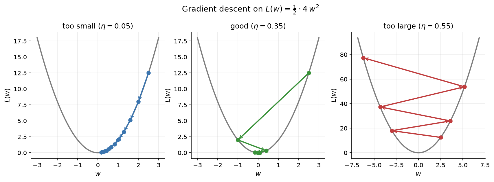
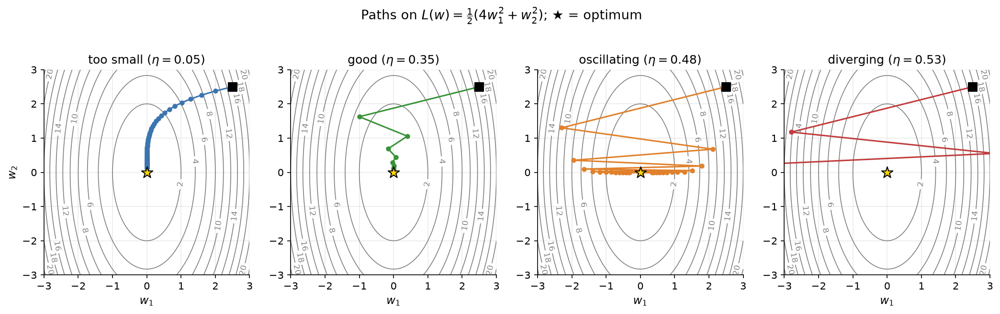
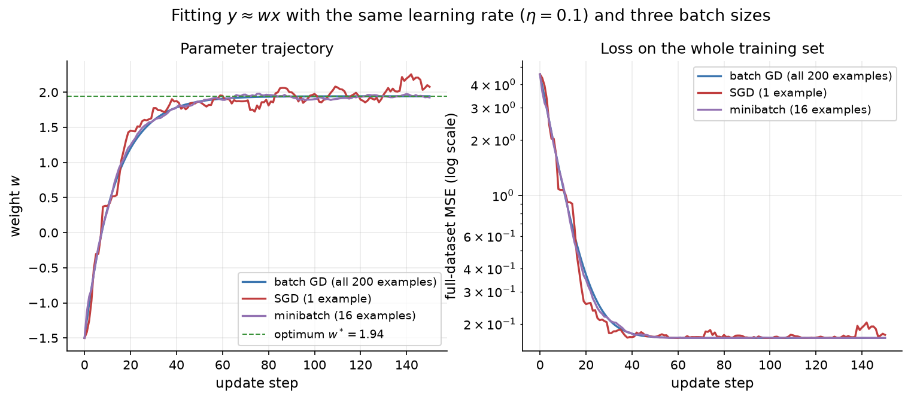
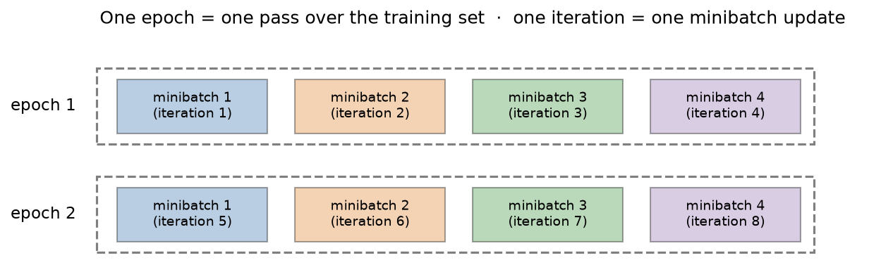

# 2.5 Gradient Descent

We now have a model (the MLP of Section 2.3) and a way to score it (the losses of Section 2.4). What remains is a procedure for improving the model: adjusting its weights so that the loss goes down. For neural networks, that procedure is almost always some form of *gradient descent*. This section explains the idea, shows what the learning rate does on simple loss surfaces where we can see everything, and then introduces the stochastic, minibatch version that trains every model in this book, from the two-moons classifier to LLMs with hundreds of billions of parameters.

## Training as optimization

Collect every weight and bias of a network into one long parameter vector $`\theta`$. For the 2-2-1 network of Section 2.3, $`\theta`$ has 9 entries; for a large LLM it has billions. Training means solving

```math
\theta^\star = \arg\min_{\theta} L(\theta), \qquad L(\theta) = \frac{1}{N} \sum_{n=1}^{N} \ell\bigl(f_\theta(\mathbf{x}_n), y_n\bigr),
```

that is, finding the parameters that minimize the average loss over the training set. We can think of $L$ as a landscape: a surface over parameter space whose height at each point is the loss of the network with those parameters. Training is a walk downhill on that surface.

For linear regression with MSE there is a formula for the minimum (the "normal equations"), but for a neural network there is not. The loss is a complicated, non-convex function of millions of parameters, and we cannot even visualize it. What we *can* do is compute, at our current position, which direction is downhill. That is all gradient descent needs.

## The gradient points uphill

The **gradient** of $L$ is the vector of its partial derivatives:

```math
\nabla_\theta L = \left( \frac{\partial L}{\partial \theta_1}, \frac{\partial L}{\partial \theta_2}, \dots, \frac{\partial L}{\partial \theta_P} \right).
```

Each component says how fast the loss changes when one parameter is nudged while the others stay fixed. Taken together, the gradient has a geometric meaning: it points in the direction in which $L$ increases most steeply, and its length is that steepest rate of increase. You can see why from the first-order Taylor approximation. For a small step $`\Delta\theta`$,

```math
L(\theta + \Delta\theta) \approx L(\theta) + \nabla_\theta L^\top \Delta\theta .
```

Among all steps of a fixed small length, the dot product $`\nabla_\theta L^\top \Delta\theta`$ is most negative when $`\Delta\theta`$ points exactly opposite the gradient. So the steepest way *down* is $`-\nabla_\theta L`$.

**Gradient descent** repeatedly takes a small step in that direction:

```math
\theta_{t+1} = \theta_t - \eta\, \nabla_\theta L(\theta_t) ,
```

where $`\eta \gt 0`$ is the **learning rate** (also called the step size). Start from some initial $`\theta_0`$, apply the update over and over, and the loss should decrease, at least as long as $`\eta`$ is small enough. When the gradient is zero we are at a *stationary point* (a minimum, maximum, or saddle), and the updates stop.

Computing $`\nabla_\theta L`$ efficiently for a network with many parameters is the job of backpropagation (Section 2.6). In this section we assume the gradient is available and study what gradient descent does with it.

## The learning rate: too small, just right, too large

The learning rate is the most important hyperparameter in neural network training. To see why, consider the simplest possible loss, a one-dimensional parabola:

```math
L(w) = \tfrac{1}{2}\, a\, w^2, \qquad \frac{dL}{dw} = a\, w .
```

The gradient descent update is $`w_{t+1} = w_t - \eta a w_t = (1 - \eta a)\, w_t`$. Each step multiplies $w$ by the same factor $`1 - \eta a`$, so after $t$ steps $`w_t = (1 - \eta a)^t w_0`$. Everything depends on that factor:

- If $`0 \lt \eta a \lt 1`$, the factor is between 0 and 1, and $w$ shrinks smoothly toward the minimum at 0. Small $`\eta`$ means a factor close to 1 and slow progress.
- If $`1 \lt \eta a \lt 2`$, the factor is between $-1$ and 0. The iterate overshoots the minimum and lands on the other side, but closer; it converges while oscillating.
- If $`\eta a \gt 2`$, the factor has magnitude greater than 1. Each step overshoots by more than the last, and the iterates **diverge**, flying off to infinity.

So gradient descent on this parabola converges if and only if $`\eta \lt 2/a`$. With $a = 4$ and $`w_0 = 2.5`$:

| Learning rate | Factor $`1 - 4\eta`$ | $`w_0, w_1, w_2, w_3, w_4, w_5`$ | Behavior |
|---|---|---|---|
| $`\eta = 0.05`$ | 0.8 | 2.5, 2.0, 1.6, 1.28, 1.024, 0.819 | slow, steady |
| $`\eta = 0.35`$ | −0.4 | 2.5, −1.0, 0.4, −0.16, 0.064, −0.026 | fast, oscillating |
| $`\eta = 0.55`$ | −1.2 | 2.5, −3.0, 3.6, −4.32, 5.18, −6.22 | diverges |

Figure 2.14 draws these three runs.



*Figure 2.14: Gradient descent on L(w) = ½·4w² from w = 2.5. Too small a learning rate creeps toward the minimum; a good one gets there in a few oscillating steps; too large a learning rate overshoots further on every step and diverges. Note the different vertical scale in the right panel.*

The quantity $a$ is the *curvature* of the loss, its second derivative. Sharply curved directions need small steps, and gently curved ones tolerate large steps. Real losses have many directions with very different curvatures, and that makes choosing $`\eta`$ harder. Consider the two-dimensional bowl

```math
L(w_1, w_2) = \tfrac{1}{2}\left(4 w_1^2 + w_2^2\right),
```

which is four times more curved along $`w_1`$ than along $`w_2`$. The update acts on each coordinate separately: $`w_1`$ is multiplied by $`1 - 4\eta`$ and $`w_2`$ by $`1 - \eta`$. Stability requires $`\eta \lt 0.5`$ because of the steep direction, but the shallow direction then shrinks by a factor of at least $1 - 0.5 = 0.5$ per step, and by much less when we pick a safe, smaller $`\eta`$. Figure 2.15 shows four learning rates.



*Figure 2.15: Gradient descent paths from (2.5, 2.5) on an elongated quadratic bowl, whose contours are ellipses. With η = 0.05 progress is slow along the shallow w₂ direction. With η = 0.35 the path converges in a few steps. With η = 0.48 the steep w₁ direction oscillates back and forth across the valley while w₂ converges. With η = 0.53, just above the stability limit of 0.5, the w₁ oscillation grows and the path leaves the plot.*

The oscillating path at $`\eta = 0.48`$ is typical of real training: the learning rate is limited by the most sharply curved direction, while progress in flat directions stays slow. This mismatch is the main motivation for the improved optimizers in Chapter 3. *Momentum* averages successive gradients so that oscillations cancel and consistent directions accumulate speed, and *Adam* rescales each parameter's step by a running estimate of its gradient magnitude.

A few lines of code confirm the picture numerically ([Code 2.5.1](#code-251-gradient-descent-on-an-elongated-quadratic-bowl)). After 25 steps from (2.5, 2.5), the run with $`\eta = 0.05`$ has $`w_2`$ still at about 0.69, far from the minimum. With $`\eta = 0.35`$ both coordinates are essentially zero. With $`\eta = 0.48`$, $`w_2`$ has converged, but $`w_1`$ is still oscillating at a magnitude of about 0.31. With $`\eta = 0.53`$, $`w_1`$ has grown to about $-42.5$.

In practice, you find a good learning rate empirically: try values spaced by factors of about 3 or 10 (for example 0.001, 0.003, 0.01, 0.03, ...), train briefly with each, and keep the largest one for which the loss decreases steadily. Section 2.7 runs exactly this experiment on a real network.

## Batch, stochastic, and minibatch gradient descent

The loss $`L(\theta)`$ is an average over all $N$ training examples, so its gradient is also an average:

```math
\nabla_\theta L = \frac{1}{N} \sum_{n=1}^{N} \nabla_\theta\, \ell_n , \qquad \ell_n = \ell\bigl(f_\theta(\mathbf{x}_n), y_n\bigr).
```

Computing it exactly requires a forward and backward pass through every example before taking a single step. That is **batch gradient descent** (or full-batch gradient descent). It is fine for the four XOR points, but LLM pretraining datasets contain trillions of tokens; waiting for a full pass before each step would be absurd.

**Stochastic gradient descent (SGD)** goes to the opposite extreme. At each step, pick one example $n$ at random and use its gradient alone:

```math
\theta_{t+1} = \theta_t - \eta\, \nabla_\theta\, \ell_n(\theta_t) .
```

Because $n$ is chosen uniformly at random, the expected value of the single-example gradient equals the full gradient: it is an *unbiased estimate*. Each step is $N$ times cheaper than a full-batch step, but the estimate is noisy, so the path wanders. The idea of optimizing with noisy but unbiased gradient estimates goes back to the stochastic approximation method of Robbins and Monro in 1951.

**Minibatch gradient descent** is the compromise used in practice. At each step, sample a small random subset $`\mathcal{B}`$ of $B$ examples, a *minibatch*, and average their gradients:

```math
\theta_{t+1} = \theta_t - \eta\, \frac{1}{B} \sum_{n \in \mathcal{B}} \nabla_\theta\, \ell_n(\theta_t) .
```

This estimate is still unbiased, and its variance is about $1/B$ times the variance of the single-example estimate (for sampling with replacement it is exactly $1/B$). Somewhat confusingly, the minibatch method is also usually called "SGD," and PyTorch's `torch.optim.SGD` implements it: the optimizer does not care how many examples went into the gradient you give it.

Figure 2.16 compares the three methods on a simple problem: fitting the slope $w$ of the line $`y \approx wx`$ to 200 noisy points, with the same learning rate for all three.



*Figure 2.16: Fitting y ≈ wx to 200 points with learning rate 0.1. Left: the weight over time. Batch gradient descent moves smoothly to the optimum, w ≈ 1.94; single-example SGD follows the same general course but jitters around the optimum; minibatches of 16 are nearly as smooth as the full batch. Right: the loss on the whole training set. After 150 steps, the batch and minibatch runs sit close to the optimum, while SGD keeps fluctuating around it.*

The jitter in SGD is not only a cost. Notice that with a constant learning rate, SGD never settles exactly at the optimum: the noise keeps kicking it around. That is why training schedules usually *decay* the learning rate over time (Chapter 3). On the other hand, noise can help a non-convex optimization escape from shallow regions, and there is evidence that the noise of small-batch training can act as a mild regularizer.

## Why minibatches win

Minibatches dominate practice for two reasons, one statistical and one computational.

**Statistically, diminishing returns.** The error of a minibatch gradient estimate shrinks like $`1/\sqrt{B}`$. Going from 1 example to 16 reduces the noise by a factor of 4, which is a big improvement. Going from 1,000 to 16,000 examples also reduces it by a factor of 4, but costs 15,000 extra examples per step. Beyond some size, a bigger batch buys little extra accuracy per step, and it is better to take more, cheaper steps. Training data also contains a lot of redundancy: many examples carry similar information, so a random sample of a few hundred often points in nearly the same direction as the full dataset.

**Computationally, hardware loves batches.** A GPU can multiply a $`B \times d`$ matrix by a $`d \times H`$ weight matrix in about the same time for $B = 1$ and $B = 64$, because the single-example version leaves most of the chip's arithmetic units idle. Processing a batch together turns many small matrix-vector products into one large matrix-matrix product, which modern hardware executes extremely efficiently (Section 2.7). So a minibatch of 64 costs far less than 64 single-example steps.

Typical batch sizes range from 32 to a few thousand examples for small models. LLM pretraining uses very large batches measured in tokens, often millions of tokens per step, spread across many GPUs.

## Epochs, iterations, and batch size

Three terms describe the progress of training:

- An **iteration** (or *step*) is one parameter update, computed from one minibatch.
- An **epoch** is one full pass over the training set. In practice we shuffle the data at the start of each epoch and cut it into consecutive minibatches, so that every example is used exactly once per epoch.
- The **batch size** $B$ is the number of examples per minibatch.

They are related by

```math
\text{iterations per epoch} = \left\lceil \frac{N}{B} \right\rceil .
```

With $N = 400$ examples and $B = 32$, one epoch is $`\lceil 12.5 \rceil = 13`$ iterations, the last one using the 16 leftover examples. Figure 2.17 draws the relationship.



*Figure 2.17: A training set split into four minibatches. Each minibatch produces one iteration (one update); one pass through all four minibatches is one epoch. The data are reshuffled between epochs, so the minibatches differ from epoch to epoch.*

A shuffled minibatch iterator is short enough to write from scratch ([Code 2.5.2](#code-252-a-shuffled-minibatch-iterator)). On 400 examples with batch size 32, it produces twelve minibatches of 32 and a final one of 16: the 13 iterations per epoch computed above.

LLM papers usually describe training in tokens and steps rather than epochs, because pretraining corpora are so large that models often see each document only about once.

## Non-convex losses and local minima

Our examples so far used convex bowls with a single minimum, where gradient descent with a small enough learning rate is guaranteed to find the best solution. The loss of a neural network with hidden layers is **non-convex**. Among other things, hidden units can be permuted without changing the function the network computes, so every minimum comes with many equivalent copies, and the surface between them must contain hills and saddle points. Gradient descent can in principle get stuck in a *local minimum* that is worse than the best one, or slow down near a *saddle point*, where the gradient is zero but the point is a minimum in some directions and a maximum in others.

We saw a small example in Section 2.3: a 2-2-1 network trained on XOR sometimes fails to find a solution, depending on its random initialization. For the large networks used in practice, experience and theory suggest a more optimistic picture: most local minima that gradient descent finds have losses close to the global minimum, and the main practical obstacles are poorly conditioned regions (flat plateaus and sharp ravines) rather than bad local minima. We return to these issues in Chapter 3, together with the tools that address them: momentum, Adam, and learning-rate schedules such as warmup and cosine decay.

## Code for this section

The listings below collect the code for this section in the order in which the text refers to them. Later listings may reuse imports and definitions from earlier ones.

### Code 2.5.1: Gradient descent on an elongated quadratic bowl

Runs 25 steps of gradient descent on $`L = \tfrac{1}{2}(4 w_1^2 + w_2^2)`$ from (2.5, 2.5) with the four learning rates of Figure 2.15 and prints the final position.

```python
import numpy as np

def grad(w):                       # gradient of 0.5 * (4 w1^2 + w2^2)
    return np.array([4.0 * w[0], 1.0 * w[1]])

for lr in [0.05, 0.35, 0.48, 0.53]:
    w = np.array([2.5, 2.5])
    for step in range(25):
        w = w - lr * grad(w)
    print(f"lr={lr:4.2f}  w after 25 steps = ({w[0]: .3e}, {w[1]: .3e})")
```

Output:

```text
lr=0.05  w after 25 steps = ( 9.445e-03,  6.935e-01)
lr=0.35  w after 25 steps = (-2.815e-10,  5.257e-05)
lr=0.48  w after 25 steps = (-3.109e-01,  1.986e-07)
lr=0.53  w after 25 steps = (-4.250e+01,  1.586e-08)
```

### Code 2.5.2: A shuffled minibatch iterator

A generator that shuffles the data and yields consecutive minibatches covering each example once, checked on 400 random examples with batch size 32. It reuses `np` from Code 2.5.1.

```python
def minibatches(X, y, batch_size, rng):
    """Yield (X_batch, y_batch) pairs covering the data once, in a random order."""
    order = rng.permutation(len(X))
    for start in range(0, len(X), batch_size):
        idx = order[start:start + batch_size]
        yield X[idx], y[idx]

rng = np.random.default_rng(0)
X, y = rng.normal(size=(400, 2)), rng.integers(0, 2, size=400)
sizes = [len(xb) for xb, _ in minibatches(X, y, 32, rng)]
print(len(sizes), "iterations per epoch; batch sizes:", sizes)
# 13 iterations per epoch; batch sizes: [32, 32, 32, 32, 32, 32, 32, 32, 32, 32, 32, 32, 16]
```
## Key takeaways

- Training minimizes the average loss over the training set. The gradient points in the direction of steepest increase, so gradient descent steps against it: $`\theta \leftarrow \theta - \eta \nabla_\theta L`$.
- The learning rate is the most important knob. Too small is slow; too large oscillates or diverges. On a quadratic with curvature $a$, gradient descent converges exactly when $`\eta \lt 2/a`$.
- When curvature differs across directions, the steepest direction limits the learning rate and the flattest direction limits progress, which motivates momentum and Adam (Chapter 3).
- Batch gradient descent uses all examples per step, SGD uses one, and minibatch SGD uses a small random sample: an unbiased, cheap, moderately noisy estimate that makes good use of parallel hardware.
- An epoch is one pass over the data, an iteration is one update, and there are $`\lceil N/B \rceil`$ iterations per epoch.
- Neural network losses are non-convex, but in practice gradient descent on large networks reliably finds good solutions.

## Further reading

Bottou, Léon, et al. "Optimization Methods for Large-Scale Machine Learning." *SIAM Review* 60, no. 2 (2018): 223–311. https://doi.org/10.1137/16M1080173.

Goodfellow, Ian, et al. *Deep Learning*. Cambridge, MA: MIT Press, 2016. https://www.deeplearningbook.org/.

LeCun, Yann, et al. "Efficient BackProp." In *Neural Networks: Tricks of the Trade*, 9–50. Lecture Notes in Computer Science 1524. Berlin: Springer, 1998. https://doi.org/10.1007/3-540-49430-8_2.

Robbins, Herbert, et al. "A Stochastic Approximation Method." *Annals of Mathematical Statistics* 22, no. 3 (1951): 400–407. https://doi.org/10.1214/aoms/1177729586.
