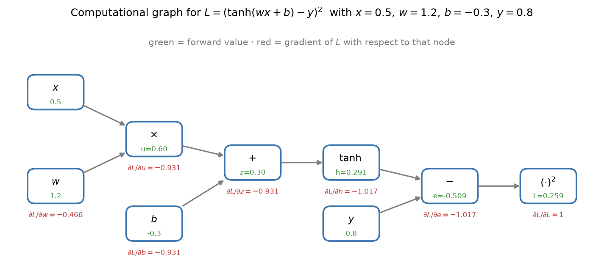
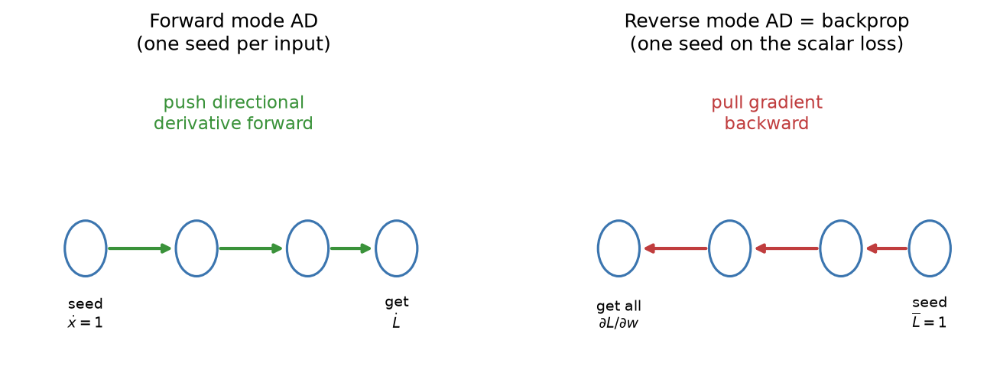
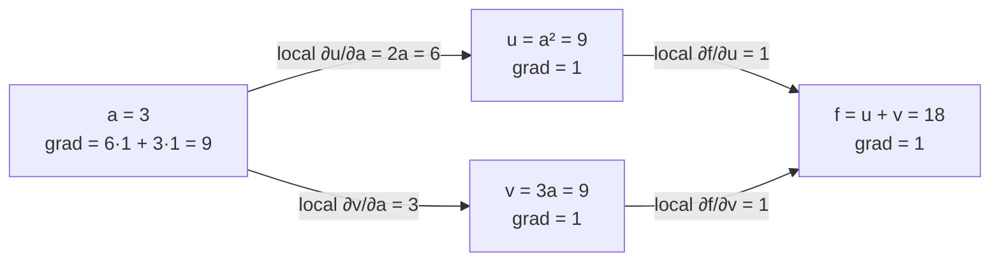
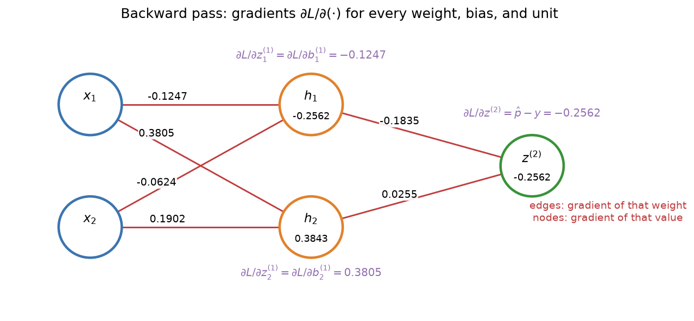
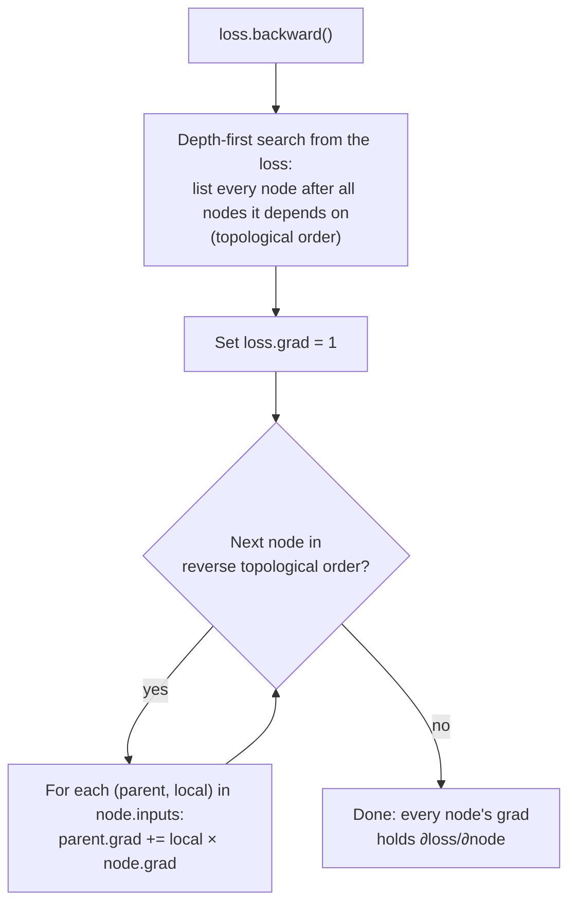
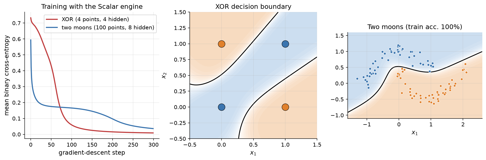

# 2.6 Computational Graphs and Backpropagation

Gradient descent needs the gradient of the loss with respect to every parameter. For the 9-parameter network of Section 2.3 we could derive each partial derivative by hand, but a modern LLM has billions of parameters, and its loss is a composition of thousands of operations. We need a method that computes all these derivatives automatically, exactly, and at a cost comparable to computing the loss itself. That method is *backpropagation*, the reverse mode of automatic differentiation. This section builds it up from the chain rule, derives it by hand for the one-hidden-layer MLP, and then designs a small automatic-differentiation engine of our own in about 80 lines of Python.

## Computations as graphs

Any computation a program performs can be broken down into a sequence of elementary operations, such as addition, multiplication, $`\tanh`$, $`\exp`$, and $`\log`$, each of which is easy to differentiate on its own. We can draw this sequence as a **computational graph**: a directed acyclic graph whose nodes are values (inputs, parameters, intermediate results, the final loss) and whose edges show which values each operation consumes.

Take a single neuron with a tanh activation and a squared-error loss:

```math
L = \bigl(\tanh(w x + b) - y\bigr)^2 .
```

Breaking it into elementary steps and naming every intermediate value:

```math
u = w \cdot x, \quad z = u + b, \quad h = \tanh(z), \quad e = h - y, \quad L = e^2 .
```

With $x = 0.5$, $w = 1.2$, $b = -0.3$, and $y = 0.8$, the **forward pass** evaluates the nodes from left to right: $u = 0.6$, $z = 0.3$, $`h = \tanh(0.3) \approx 0.2913`$, $`e \approx -0.5087`$, and $`L \approx 0.2588`$. Figure 2.18 shows the graph with these values in green.



*Figure 2.18: The computational graph of L = (tanh(wx + b) − y)². Green numbers are forward values; red numbers are the gradient of L with respect to each node, computed by the backward pass described next.*

## The chain rule, one node at a time

We want $`\partial L / \partial w`$ and $`\partial L / \partial b`$. The chain rule says that the derivative of a composition is the product of the derivatives along the path:

```math
\frac{\partial L}{\partial w} = \frac{\partial L}{\partial e} \cdot \frac{\partial e}{\partial h} \cdot \frac{\partial h}{\partial z} \cdot \frac{\partial z}{\partial u} \cdot \frac{\partial u}{\partial w} .
```

Each factor is a **local derivative**: the derivative of one node's output with respect to one of its inputs, which depends only on that operation and the values flowing through it. The local derivatives we need are

| Operation | Output | Local derivatives |
|---|---|---|
| multiply | $u = w x$ | $`\partial u / \partial w = x`$, $`\partial u / \partial x = w`$ |
| add | $z = u + b$ | $`\partial z / \partial u = 1`$, $`\partial z / \partial b = 1`$ |
| tanh | $`h = \tanh z`$ | $`\partial h / \partial z = 1 - h^2`$ |
| subtract | $e = h - y$ | $`\partial e / \partial h = 1`$, $`\partial e / \partial y = -1`$ |
| square | $L = e^2$ | $`\partial L / \partial e = 2e`$ |
| exp | $`s = e^{a}`$ | $`\partial s / \partial a = e^{a} = s`$ |
| log | $`s = \ln a`$ | $`\partial s / \partial a = 1/a`$ |

Rather than multiply out each full path separately, we evaluate the product from the loss backward, one node at a time. Define the **upstream gradient** of a node $v$ as $`\bar{v} = \partial L / \partial v`$, the derivative of the final loss with respect to that node. We start with $`\bar{L} = 1`$ and, for each node, compute its inputs' gradients as

```math
\overline{\text{input}} = \underbrace{\frac{\partial\, \text{node}}{\partial\, \text{input}}}_{\text{local derivative}} \times \underbrace{\overline{\text{node}}}_{\text{upstream gradient}} .
```

For our example, going right to left:

```math
\begin{aligned}
\bar{L} &= 1 \\
\bar{e} &= 2e \cdot \bar{L} = 2(-0.5087) = -1.0174 \\
\bar{h} &= 1 \cdot \bar{e} = -1.0174 \\
\bar{z} &= (1 - h^2)\, \bar{h} = (1 - 0.2913^2)(-1.0174) = 0.9151 \times (-1.0174) = -0.9310 \\
\bar{b} &= 1 \cdot \bar{z} = -0.9310, \qquad \bar{u} = 1 \cdot \bar{z} = -0.9310 \\
\bar{w} &= x \cdot \bar{u} = 0.5 \times (-0.9310) = -0.4655 .
\end{aligned}
```

These are the red numbers in Figure 2.18. The **backward pass** visits each node once, does a small constant amount of work there, and produces the gradient with respect to *every* input of the graph. Notice that the tanh node needed its forward output $h$ to compute its local derivative. Backpropagation must therefore remember intermediate values from the forward pass, which is why training uses much more memory than inference.

## Forward mode versus reverse mode

The chain rule does not dictate the order in which the product of local derivatives is evaluated. There are two natural choices, and they lead to two flavors of **automatic differentiation (AD)**.

**Forward mode** starts at one input and pushes derivatives *forward* alongside the values. Along with every node $v$, it carries $`\dot{v} = \partial v / \partial w`$ for the one chosen input $w$. At the end it has $`\partial L / \partial w`$, the derivative of every output with respect to that *one* input. To get the derivatives with respect to $P$ parameters, forward mode needs $P$ passes.

**Reverse mode** first runs the forward pass and records the graph, then pushes upstream gradients *backward* from one output, as we just did. One backward pass gives $`\partial L / \partial \theta_i`$ for *every* input $`\theta_i`$ at once. To get derivatives of $M$ different outputs, reverse mode needs $M$ passes.



*Figure 2.19: Forward-mode AD seeds one input and pushes a directional derivative toward the output; one pass yields the derivatives of all outputs with respect to that single input. Reverse-mode AD seeds the scalar loss and pulls gradients back toward the inputs; one pass yields the derivatives of that single output with respect to all inputs.*

Neural network training has exactly one scalar output, the loss, and a huge number of inputs, the parameters. Reverse mode computes the entire gradient in one backward pass whose cost is a small constant multiple of the forward pass (typically quoted as about two to three times). Forward mode would need one pass per parameter, billions of passes for an LLM. That asymmetry is why reverse mode, known in the neural network community as **backpropagation**, is the engine of deep learning. The general technique was described by Seppo Linnainmaa in 1970 and applied to neural networks by Paul Werbos in the 1970s, before the 1986 paper by Rumelhart, Hinton, and Williams made it widely known. Forward mode is still useful when a function has few inputs and many outputs; the survey by Baydin and colleagues covers both modes in depth.

## Gradients accumulate when a value is used more than once

In a chain, each node has one consumer. In real networks, one value often feeds several operations: an input goes to every hidden unit, and a hidden activation goes to every output unit. What is the gradient of such a value?

The multivariable chain rule answers: **sum the contributions from every path**. If $a$ is used by operations producing $u$ and $v$, and both affect $L$, then

```math
\frac{\partial L}{\partial a} = \frac{\partial L}{\partial u} \frac{\partial u}{\partial a} + \frac{\partial L}{\partial v} \frac{\partial v}{\partial a} .
```

Consider $f = a^2 + 3a$ at $a = 3$. The value $a$ is used by two branches. Figure 2.20 shows the graph.



*Figure 2.20: Gradients accumulate on fan-out. The value a feeds two branches, so its gradient is the sum of the contributions arriving along both: 6 × 1 + 3 × 1 = 9, which matches the derivative 2a + 3 at a = 3.*

In an implementation, this means a node's gradient must be *accumulated* with `+=`, not assigned with `=`, and it must start at zero. It also means we should finish accumulating a node's gradient from all of its consumers before passing it further back. Processing nodes in reverse **topological order**, so that every node comes after all the nodes that use it, guarantees this.

## Backpropagation through the MLP, by hand

Now let us derive the gradients for the one-hidden-layer MLP of Section 2.3, with tanh hidden units, a sigmoid output, and binary cross-entropy loss. For one example the forward pass is

```math
\mathbf{z}^{(1)} = \mathbf{x} W^{(1)} + \mathbf{b}^{(1)}, \quad
\mathbf{h} = \tanh\bigl(\mathbf{z}^{(1)}\bigr), \quad
z^{(2)} = \mathbf{h} W^{(2)} + b^{(2)}, \quad
\hat{p} = \sigma\bigl(z^{(2)}\bigr), \quad
L = -\bigl[y \ln \hat{p} + (1 - y)\ln(1 - \hat{p})\bigr].
```

We work backward, one node at a time, reusing each result in the next step.

**Step 1: output logit.** From Section 2.4, sigmoid plus binary cross-entropy gives the clean gradient

```math
\frac{\partial L}{\partial z^{(2)}} = \hat{p} - y .
```

**Step 2: output weights and bias.** Since $`z^{(2)} = \sum_j h_j W^{(2)}_j + b^{(2)}`$, the local derivative with respect to $`W^{(2)}_j`$ is $`h_j`$, and with respect to $`b^{(2)}`$ it is 1:

```math
\frac{\partial L}{\partial W^{(2)}_j} = h_j\, \frac{\partial L}{\partial z^{(2)}}, \qquad \frac{\partial L}{\partial b^{(2)}} = \frac{\partial L}{\partial z^{(2)}} .
```

**Step 3: hidden activations.** The local derivative of $`z^{(2)}`$ with respect to $`h_j`$ is $`W^{(2)}_j`$:

```math
\frac{\partial L}{\partial h_j} = W^{(2)}_j\, \frac{\partial L}{\partial z^{(2)}} .
```

**Step 4: through the tanh.** Each hidden unit's activation depends only on its own pre-activation, with local derivative $`1 - h_j^2`$:

```math
\frac{\partial L}{\partial z^{(1)}_j} = \bigl(1 - h_j^2\bigr)\, \frac{\partial L}{\partial h_j} .
```

**Step 5: input weights and biases.** Since $`z^{(1)}_j = \sum_i x_i W^{(1)}_{ij} + b^{(1)}_j`$,

```math
\frac{\partial L}{\partial W^{(1)}_{ij}} = x_i\, \frac{\partial L}{\partial z^{(1)}_j}, \qquad \frac{\partial L}{\partial b^{(1)}_j} = \frac{\partial L}{\partial z^{(1)}_j} .
```

A clear pattern has emerged. **The gradient of a weight is the input on its edge times the upstream gradient at the unit it feeds.** In vector form, $`\partial L / \partial W^{(1)} = \mathbf{x}^\top \bigl(\partial L / \partial \mathbf{z}^{(1)}\bigr)`$ is an outer product, a fact that becomes central when we vectorize in Section 2.7.

### The numbers

Let us plug in the worked example from Section 2.3: $`\mathbf{x} = (1.0, 0.5)`$, $y = 1$, and the forward values $`\mathbf{h} = (0.7163, -0.0997)`$ and $`\hat{p} = 0.7438`$.

1. Output logit: $`\partial L / \partial z^{(2)} = 0.7438 - 1 = -0.2562`$.
2. Output weights: $`\partial L / \partial W^{(2)} = (0.7163, -0.0997) \times (-0.2562) = (-0.1835, 0.0255)`$, and $`\partial L / \partial b^{(2)} = -0.2562`$.
3. Hidden activations: $`\partial L / \partial \mathbf{h} = (1.0, -1.5) \times (-0.2562) = (-0.2562, 0.3843)`$.
4. Through the tanh: $`1 - h_1^2 = 1 - 0.7163^2 = 0.4869`$ and $`1 - h_2^2 = 1 - 0.0997^2 = 0.9901`$, so $`\partial L / \partial \mathbf{z}^{(1)} = (-0.2562 \times 0.4869,\ 0.3843 \times 0.9901) = (-0.1247, 0.3805)`$.
5. Input weights: each row of $`\partial L / \partial W^{(1)}`$ is an input value times this vector:

```math
\frac{\partial L}{\partial W^{(1)}} = \begin{pmatrix} 1.0 \\ 0.5 \end{pmatrix} \begin{pmatrix} -0.1247 & 0.3805 \end{pmatrix} = \begin{pmatrix} -0.1247 & 0.3805 \\ -0.0624 & 0.1902 \end{pmatrix}, \qquad \frac{\partial L}{\partial \mathbf{b}^{(1)}} = (-0.1247,\ 0.3805).
```

Figure 2.21 places these numbers on the network.



*Figure 2.21: The backward pass of the worked example. Red numbers on the edges are the gradients of the loss with respect to each weight; numbers inside the hidden nodes are ∂L/∂h, and the output node shows ∂L/∂z⁽²⁾. Purple labels give the gradients of the pre-activations, which equal the gradients of the biases.*

The signs make intuitive sense. The target is 1 and the prediction is 0.744, so the loss decreases if the output logit rises. Hidden unit 1 has a positive weight to the output and hidden unit 2 a negative one, so gradient descent wants $`h_1`$ to increase (its gradient is negative) and $`h_2`$ to decrease (its gradient is positive). One gradient-descent step with learning rate $`\eta`$ moves every parameter by $`-\eta`$ times its gradient; for example, $`W^{(1)}_{11}`$ goes from 0.5 to $`0.5 + 0.1247\,\eta`$.

## Designing a scalar autograd engine

Deriving gradients by hand is instructive once and error-prone forever after. Every modern framework instead implements reverse-mode AD generically: each operation knows its own local derivatives, the framework records the graph during the forward pass, and a single call runs the backward pass. We now build a miniature version for scalars. The design below is original to this book, and it is deliberately minimal so that every line can be understood.

The design has three ideas:

1. **A value object** called `Scalar` stores a number (`value`), the gradient of the final output with respect to it (`grad`, initially 0), and the list of `inputs` it was computed from.
2. **Local derivatives are computed eagerly.** When an operation creates a new `Scalar`, it stores each input *together with the local derivative with respect to that input*, evaluated right away using the forward values. For $`c = a \times b`$, it stores the pairs $`(a, b.\text{value})`$ and $`(b, a.\text{value})`$. The backward pass then never needs to know which operation produced a node: it only multiplies and adds.
3. **A topological sort** orders the nodes so that each one is processed after every node that consumes it. Walking that order backward and applying `parent.grad += local * node.grad` implements the chain rule with accumulation.

The complete engine is listed in [Code 2.6.1](#code-261-the-scalar-autograd-engine). A few design notes are in order. Subtraction, negation, and division are not given their own derivative rules; they are built from addition, multiplication, and powers, so they inherit correct gradients for free. The `__radd__` and `__rmul__` aliases let expressions such as `3 * a` or `1 + a` work when the left operand is a plain number. The topological sort is iterative rather than recursive, so deep graphs do not hit Python's recursion limit. Figure 2.22 summarizes what `backward()` does.



*Figure 2.22: The backward pass of the Scalar engine. Reverse topological order guarantees that a node's gradient is complete, with contributions from all of its consumers summed, before it is propagated to that node's own inputs.*

### Testing the engine on expressions we can check by hand

We first test the engine on the fan-out example $f = a^2 + 3a$ at $a = 3$, whose derivative is $2a + 3 = 9$, and then on the single-neuron graph of Figure 2.18 ([Code 2.6.2](#code-262-testing-the-engine-on-small-expressions)). The engine returns $f = 18$ with $df/da = 9$, and $L = 0.2588$ with $`\partial L / \partial w = -0.4655`$ and $`\partial L / \partial b = -0.9310`$. Both agree with our hand calculations.

Next, we write the 2-2-1 MLP example directly with `Scalar` operations ([Code 2.6.3](#code-263-backpropagating-through-the-2-2-1-worked-example)). The engine reproduces every number in Figure 2.21, from the loss of 0.2960 to each of the nine parameter gradients. Every gradient matches the hand derivation, even though the engine knows nothing about sigmoids or cross-entropy: it built the sigmoid from `exp`, addition, and division, and differentiated through each piece.

### Training a network with the engine

With gradients available automatically, a complete training loop is short. The functions in [Code 2.6.4](#code-264-a-training-loop-built-on-the-engine) build a one-hidden-layer tanh network out of `Scalar` objects and train it with full-batch gradient descent on binary cross-entropy. Each step computes the average loss over the training set, zeros the old gradients, calls `backward()`, and moves every parameter against its gradient.

The loss function deserves a comment. Computing $`\sigma(z)`$ and then $`\ln \sigma(z)`$ would overflow or return $`\ln 0`$ for large $|z|$. Instead, `bce_from_logit` uses the identity $`\ell = \ln(1 + e^{z}) - y z`$ and rewrites it for positive $z$ so that `exp` only ever receives a non-positive argument. Section 2.9 shows that PyTorch's built-in losses use the same trick.

On XOR, a network with four hidden units trained this way (learning rate 1.0, 300 steps) reduces the loss from 0.7330 at the start to 0.0155 after 200 steps. Its final predicted probabilities of class 1 for the inputs $(0,0)$, $(0,1)$, $(1,0)$, and $(1,1)$ are 0.003, 0.988, 0.991, and 0.011, so every point is classified correctly and confidently ([Code 2.6.5](#code-265-training-on-xor)). Figure 2.23 shows the loss curves for XOR and for a 100-point two-moons dataset, and the decision boundaries the engine learned.



*Figure 2.23: Networks trained entirely with the Scalar engine and full-batch gradient descent (learning rate 1.0, 300 steps). Left: training loss for XOR (4 hidden units) and two moons (100 points, 8 hidden units). Middle and right: the learned decision boundaries. The two-moons network classifies all 100 training points correctly.*

The engine works, but it is slow: training the two-moons network took about 9 seconds in our test run for only 100 examples and 33 parameters, because every multiplication creates a Python object. Section 2.7 fixes this with matrices.

## Common pitfalls

Three mistakes account for a large share of bugs in hand-written and framework-based training code alike.

**Forgetting to zero gradients.** Because gradients accumulate with `+=`, parameters keep the gradients from previous backward passes unless they are reset. In our engine the graph is rebuilt on every forward pass, but the parameter objects persist, so their `grad` fields keep growing. For the loss $`(3w - 1)^2`$ at $w = 2$, whose gradient is $`6(3w - 1) = 30`$, three backward passes without zeroing leave `w.grad` at 30, then 60, then 90 ([Code 2.6.6](#code-266-forgetting-to-zero-gradients)). The correct gradient is 30 every time, but without zeroing it doubles and then triples. This is why every training loop in PyTorch calls `optimizer.zero_grad()` (Section 2.9). Accumulation is occasionally what you want, for example to sum gradients over several small batches before one update, but it should always be deliberate.

**In-place updates during the forward or backward pass.** Our engine computes local derivatives from forward values when each node is created. If you change a parameter's `value` after the forward pass but before `backward()`, the stored local derivatives no longer match the parameters, and the gradient silently becomes wrong. The safe order is always: forward, backward, *then* update. PyTorch guards against the analogous mistake: if an in-place operation modifies a tensor that autograd saved for the backward pass, `backward()` raises an error. Updating parameters *in place* after the backward pass (as in `p.value -= lr * p.grad`) is fine and standard.

**Numerical overflow in exp and log.** $`e^{z}`$ overflows for $z$ above about 709 in 64-bit floating point, and $`\ln 0 = -\infty`$. Naive sigmoids, softmaxes, and cross-entropies hit these limits as soon as logits become large, which happens routinely during training. The cures are the rewritings we have already seen: subtract the maximum inside softmax (Section 2.4), compute cross-entropy from logits with log-sum-exp, and write losses such as `bce_from_logit` so that `exp` never receives a large positive argument. When a loss suddenly becomes `nan`, check these first.

One more check is worth making a habit. Whenever you write a new backward rule, compare it with **finite differences**: nudge a parameter by a small $`\varepsilon`$ in each direction, and compare $`\bigl(L(\theta + \varepsilon) - L(\theta - \varepsilon)\bigr) / 2\varepsilon`$ with the analytic gradient. Section 2.7 turns this into a systematic gradient check.

## Code for this section

The listings below collect the code for this section in the order in which the text refers to them. Later listings may reuse imports and definitions from earlier ones.

### Code 2.6.1: The scalar autograd engine

The complete `Scalar` class described in [Designing a scalar autograd engine](#designing-a-scalar-autograd-engine). Each operation stores its inputs together with their local derivatives, and `backward()` walks a topological order in reverse.

Notebook: [2.6.1-the-scalar-autograd-engine.ipynb](../../code/02-neural-network-basics/2.6.1-the-scalar-autograd-engine.ipynb)

### Code 2.6.2: Testing the engine on small expressions

The fan-out example $f = a^2 + 3a$ at $a = 3$ and the single-neuron graph of Figure 2.18. The expected output is shown in the comments.

Notebook: [2.6.2-testing-the-engine-on-small-expressions.ipynb](../../code/02-neural-network-basics/2.6.2-testing-the-engine-on-small-expressions.ipynb)

### Code 2.6.3: Backpropagating through the 2-2-1 worked example

The worked MLP example of Section 2.3 written with `Scalar` operations. The sigmoid is built from `exp`, addition, and division, and the loss from `log`.

Notebook: [2.6.3-backpropagating-through-the-2-2-1-worked-example.ipynb](../../code/02-neural-network-basics/2.6.3-backpropagating-through-the-2-2-1-worked-example.ipynb)

### Code 2.6.4: A training loop built on the engine

Parameter initialization, the forward pass, a numerically stable binary cross-entropy, and full-batch gradient descent for a one-hidden-layer tanh network made of `Scalar` objects.

Notebook: [2.6.4-a-training-loop-built-on-the-engine.ipynb](../../code/02-neural-network-basics/2.6.4-a-training-loop-built-on-the-engine.ipynb)

### Code 2.6.5: Training on XOR

Trains a network with four hidden units on the four XOR points using the functions of Code 2.6.4, logging the loss every 100 steps.

Notebook: [2.6.5-training-on-xor.ipynb](../../code/02-neural-network-basics/2.6.5-training-on-xor.ipynb)

### Code 2.6.6: Forgetting to zero gradients

Three backward passes without resetting `w.grad`. The gradient accumulates instead of staying at 30; the output is shown in the comments.

Notebook: [2.6.6-forgetting-to-zero-gradients.ipynb](../../code/02-neural-network-basics/2.6.6-forgetting-to-zero-gradients.ipynb)

## Key takeaways

- Any computation can be written as a graph of elementary operations with simple local derivatives. The forward pass evaluates the graph; the backward pass applies the chain rule node by node, multiplying each local derivative by the upstream gradient.
- Reverse-mode automatic differentiation (backpropagation) computes the gradient of one scalar loss with respect to all parameters in a single backward pass, at a cost of a small multiple of the forward pass. Forward mode would need one pass per parameter.
- When a value is used more than once, its gradient is the sum of the contributions from every use; implementations accumulate with `+=` and process nodes in reverse topological order.
- For a dense layer, the gradient of a weight is the input on its edge times the upstream gradient at the unit it feeds.
- A working autograd engine needs only a value object that records its inputs and local derivatives, and a topological sort. Ours reproduces every hand-derived gradient and trains an MLP.
- Zero gradients before each backward pass, never modify values between the forward and backward passes, and compute exponentials and logarithms in numerically stable forms.

## Further reading

Baydin, Atılım Güneş, et al. "Automatic Differentiation in Machine Learning: A Survey." *Journal of Machine Learning Research* 18, no. 153 (2018): 1–43. https://arxiv.org/abs/1502.05767.

Goodfellow, Ian, et al. *Deep Learning*. Cambridge, MA: MIT Press, 2016. https://www.deeplearningbook.org/.

Griewank, Andreas, et al. *Evaluating Derivatives: Principles and Techniques of Algorithmic Differentiation*. 2nd ed. Philadelphia: SIAM, 2008. https://doi.org/10.1137/1.9780898717761.

Nielsen, Michael A. *Neural Networks and Deep Learning*. Determination Press, 2015. http://neuralnetworksanddeeplearning.com/.

Rumelhart, David E., et al. "Learning Representations by Back-Propagating Errors." *Nature* 323 (1986): 533–536. https://doi.org/10.1038/323533a0.
