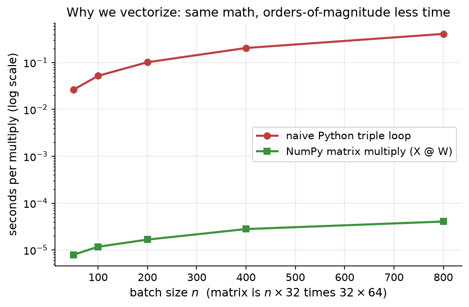
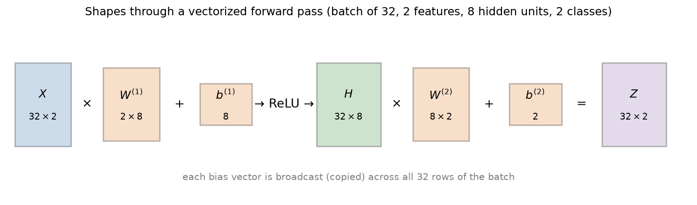
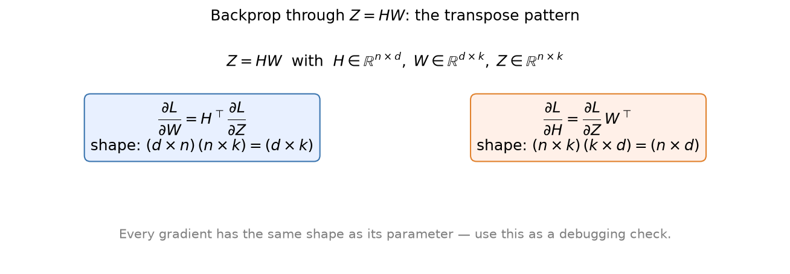
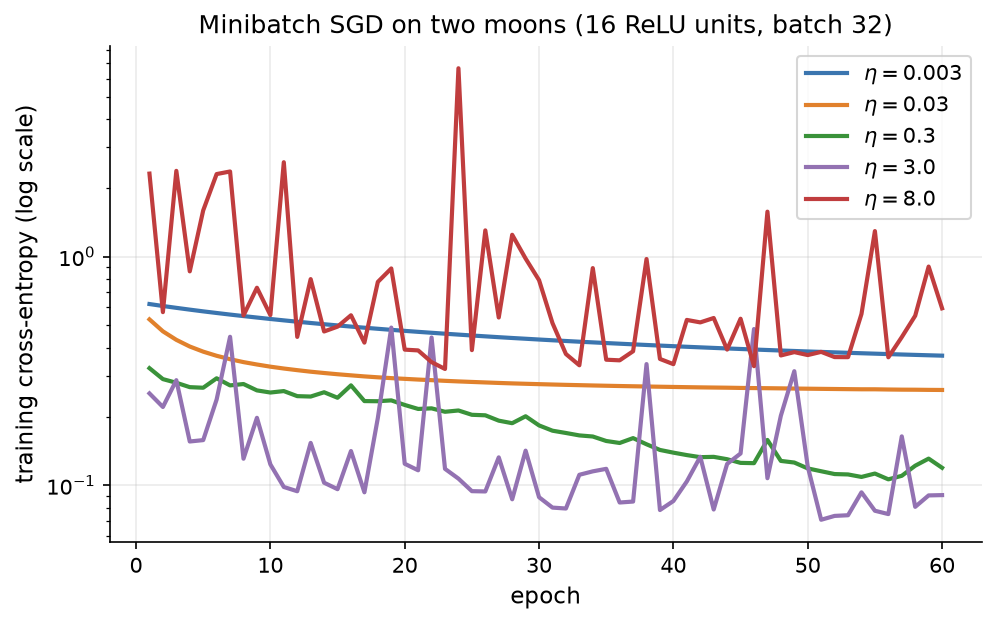
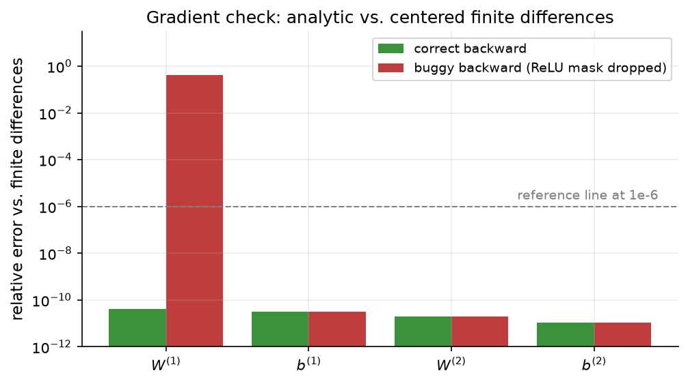

# 2.7 Vectorization: From Scalars to Tensors

The `Scalar` engine of Section 2.6 computes correct gradients, but it is hopelessly slow for real work: every addition and multiplication creates a Python object, so a network with a million weights would build millions of nodes per example. Real frameworks work with whole arrays of numbers at once. This section rewrites the MLP in terms of matrices, explains broadcasting, derives backpropagation in matrix form (where a simple transpose pattern appears), and turns gradient checking into a routine test. It ends with a short note on why matrix multiplication, and therefore GPUs, dominate the cost of neural networks and LLMs.

## Why scalar code is too slow

Python is an interpreted language. Each Python-level operation, whether `a * b` on two floats or a method call on a `Scalar`, carries overhead for type checks, dispatch, and memory allocation that is far larger than the arithmetic itself. A loop that performs one multiplication per iteration spends almost all its time on that overhead.

Libraries such as NumPy and PyTorch avoid this by operating on whole arrays in a single call. `X @ W` hands two blocks of memory to compiled, highly optimized routines (the BLAS family of linear algebra libraries), which use cache-friendly memory access, SIMD instructions that process several numbers per CPU instruction, and multiple cores. The Python interpreter is involved once per array operation, not once per number. This style of programming is called **vectorization**.

The difference is dramatic. Figure 2.24 times the same matrix product computed two ways: a triple loop in plain Python, and one call to NumPy's `@` operator.



*Figure 2.24: Time to multiply an n × 32 matrix by a 32 × 64 matrix with a Python triple loop versus NumPy's matrix multiplication, on a log scale. In our runs the vectorized version was between about 3,500 and 13,000 times faster, and the gap grows with the matrix size. Exact numbers depend on the machine.*

For whole training steps the story is the same. One forward and backward pass over 64 two-moons examples through a 16-unit network took about 12.5 milliseconds with the `Scalar` engine and about 0.036 milliseconds with the vectorized NumPy code of this section, a factor of roughly 350 in our test. For larger layers the gap widens, because the scalar engine's cost grows with the number of multiplications while the vectorized code's cost is dominated by fixed per-call overhead until the matrices are large.

## The MLP with matrices

Section 2.3 already wrote the forward pass for a batch: stack $B$ examples as the rows of $`X \in \mathbb{R}^{B \times d}`$, and each layer becomes one matrix multiplication plus a bias:

```math
Z^{(1)} = X W^{(1)} + \mathbf{b}^{(1)}, \qquad H = g\bigl(Z^{(1)}\bigr), \qquad Z^{(2)} = H W^{(2)} + \mathbf{b}^{(2)} .
```

Row $n$ of $`Z^{(1)}`$ is exactly the pre-activation vector of example $n$; the matrix product computes all $B$ examples' weighted sums at once. Figure 2.25 shows the shapes for a batch of 32 two-dimensional inputs, 8 hidden units, and 2 classes.



*Figure 2.25: Shapes flowing through a vectorized MLP forward pass. Each bias vector is added to every row of the batch.*

## Tensors, shapes, and broadcasting

A **tensor** is a multi-dimensional array: a scalar is a 0-dimensional tensor, a vector is 1-dimensional, a matrix is 2-dimensional, and a batch of images or a batch of token sequences with embedding vectors is 3- or 4-dimensional. Each tensor has a **shape**, the tuple of its sizes along each dimension, such as `(32, 8)`.

In the forward pass, $`X W^{(1)}`$ has shape `(B, H)` while $`\mathbf{b}^{(1)}`$ has shape `(H,)`. Mathematically we mean "add the bias to every row." NumPy and PyTorch do this automatically through **broadcasting**: when two arrays of different shapes are combined elementwise, dimensions are aligned from the right, and any dimension of size 1 (or missing) is virtually stretched to match the other array, without copying data. So `(B, H) + (H,)` behaves like `(B, H) + (1, H)`, which behaves like adding the same row $B$ times. In the same way, adding an array of shape `(2, 1)` to one of shape `(2, 3)` adds the single column to each of the three columns ([Code 2.7.1](#code-271-broadcasting-a-row-and-a-column) shows both cases).

Broadcasting is convenient and also a classic source of silent bugs. If you accidentally combine arrays of shapes `(B,)` and `(B, 1)`, broadcasting produces a `(B, B)` matrix instead of raising an error. When a loss value looks strange, print the shapes.

Broadcasting has a consequence for gradients. If a bias vector was copied to every row in the forward pass, then it influenced the loss through every row, and by the accumulation rule of Section 2.6 its gradient is the **sum over rows** of the upstream gradient. The backward pass of a broadcast is a sum.

## Backpropagation in matrix form

We now derive the backward pass for a batch. Let $`G = \partial L / \partial Z`$ denote the upstream gradient of a layer's output, a matrix with the same shape as $Z$. Consider the product $Z = H W$ with $`H \in \mathbb{R}^{B \times D}`$ and $`W \in \mathbb{R}^{D \times K}`$. Written out, each entry is

```math
Z_{nk} = \sum_{j=1}^{D} H_{nj}\, W_{jk} .
```

The weight $`W_{jk}`$ appears in $`Z_{nk}`$ for every example $n$, with local derivative $`H_{nj}`$. Summing over all the places it appears,

```math
\frac{\partial L}{\partial W_{jk}} = \sum_{n=1}^{B} \frac{\partial L}{\partial Z_{nk}}\, H_{nj} = \sum_{n=1}^{B} \bigl(H^\top\bigr)_{jn}\, G_{nk} = \bigl(H^\top G\bigr)_{jk} .
```

Similarly, $`H_{nj}`$ appears in $`Z_{nk}`$ for every output column $k$, with local derivative $`W_{jk}`$:

```math
\frac{\partial L}{\partial H_{nj}} = \sum_{k=1}^{K} G_{nk}\, W_{jk} = \bigl(G W^\top\bigr)_{nj} .
```

So the backward pass of a matrix product is two more matrix products:

```math
\boxed{\;\frac{\partial L}{\partial W} = H^\top G, \qquad \frac{\partial L}{\partial H} = G\, W^\top\;}
```

This is the **transpose pattern**: to send a gradient backward through a multiplication by $W$, multiply by $`W^\top`$; to get the gradient of $W$ itself, multiply the transposed input by the upstream gradient. The formula $`H^\top G`$ also has a nice reading: it is the sum over the batch of outer products $`\mathbf{h}_n^\top \mathbf{g}_n`$, the matrix version of "input on the edge times gradient at the unit" from Section 2.6. You do not need to memorize the formulas, because the shapes force them. $`\partial L/\partial W`$ must have the shape of $W$, $`D \times K`$, and the only way to combine $H$ (of shape $`B \times D`$) and $G$ (of shape $`B \times K`$) into a $`D \times K`$ matrix is $`H^\top G`$. Figure 2.26 summarizes.



*Figure 2.26: Backpropagation through Z = HW. The gradient with respect to W is Hᵀ times the upstream gradient; the gradient with respect to H is the upstream gradient times Wᵀ. Checking that the shapes multiply out correctly is a reliable way to get these right.*

The other two pieces of the MLP are easier:

- **Bias.** $`Z = HW + \mathbf{b}`$ broadcasts $`\mathbf{b}`$ over rows, so $`\partial L / \partial \mathbf{b} = \sum_n G_{n,:}`$, the column sums of $G$.
- **Elementwise activation.** $`H = g(Z^{(1)})`$ acts on each entry independently, so the gradient is multiplied entry by entry by the derivative: $`\partial L / \partial Z^{(1)} = \bigl(\partial L / \partial H\bigr) \odot g'\bigl(Z^{(1)}\bigr)`$, where $`\odot`$ is elementwise multiplication. For ReLU, $g'$ is 1 where $`Z^{(1)} \gt 0`$ and 0 elsewhere, a *mask*.

Finally, for a softmax output with cross-entropy averaged over the batch, Section 2.4 gives the starting gradient $`\partial L / \partial Z^{(2)} = (P - Y)/B`$, where $P$ holds the predicted probabilities, $Y$ the one-hot targets, and the $1/B$ comes from the average. The complete backward pass for the one-hidden-layer network is therefore

```math
\begin{aligned}
G^{(2)} &= (P - Y)/B, & \frac{\partial L}{\partial W^{(2)}} &= H^\top G^{(2)}, & \frac{\partial L}{\partial \mathbf{b}^{(2)}} &= \textstyle\sum_n G^{(2)}_{n,:}, \\
G^{(1)} &= \bigl(G^{(2)} W^{(2)\top}\bigr) \odot g'\bigl(Z^{(1)}\bigr), & \frac{\partial L}{\partial W^{(1)}} &= X^\top G^{(1)}, & \frac{\partial L}{\partial \mathbf{b}^{(1)}} &= \textstyle\sum_n G^{(1)}_{n,:} .
\end{aligned}
```

## Implementing the network

[Code 2.7.2](#code-272-a-vectorized-mlp-with-a-hand-written-backward-pass) implements the whole network in NumPy, with a ReLU hidden layer, a softmax cross-entropy output, and a hand-written backward pass. Each line of its `backward` function is one equation from the box above. The `assert` in `backward` enforces the most useful debugging habit in this chapter: **every gradient has the same shape as its parameter**. When a shape assertion fails, it usually points directly at a missing transpose or a sum over the wrong axis.

### Training with minibatch SGD

A minibatch training loop ties together Sections 2.4, 2.5, and this one ([Code 2.7.3](#code-273-minibatch-sgd-training-loop)). Each epoch reshuffles the training data and cuts it into minibatches; for each minibatch the loop runs the forward pass, computes the loss and its gradient with respect to the logits, runs the backward pass, and takes an SGD step. After every epoch it records the loss on the full training set.

Figure 2.27 uses this loop to repeat the learning-rate experiment of Section 2.5 on a real network: 400 two-moons points, 16 ReLU hidden units, batch size 32, 60 epochs, and five learning rates spaced by factors of about 3 to 10.



*Figure 2.27: Training loss of the vectorized MLP under minibatch SGD with five learning rates. η = 0.003 and 0.03 are slow. η = 0.3 decreases steadily, and η = 3.0 reaches the lowest loss but noisily. η = 8.0 is unstable: the loss jumps around and ends up worse than the smallest learning rate.*

The pattern matches the one-dimensional analysis. The small learning rates are safe but slow; after 60 epochs their losses are 0.369 and 0.261. The loss at $`\eta = 0.3`$ is 0.119, and $`\eta = 3.0`$ reaches 0.091 but with large spikes. At $`\eta = 8.0`$ training is erratic and the final loss, 0.594, is worse than where the slowest run ended. A reasonable choice here is somewhere between 0.3 and 3; in practice you would pick the largest value that trains smoothly, then consider decaying it over time (Chapter 3).

## Gradient checking

A hand-written backward pass is the kind of code where a single missing factor produces gradients that are wrong but still roughly the right size, so training often still "sort of works" and the bug goes unnoticed. The defense is a **gradient check**: compare the analytic gradient with a numerical estimate from **centered finite differences**,

```math
\frac{\partial L}{\partial \theta_i} \approx \frac{L(\theta + \varepsilon \mathbf{e}_i) - L(\theta - \varepsilon \mathbf{e}_i)}{2\varepsilon},
```

where $`\mathbf{e}_i`$ is the vector with a 1 in position $i$ and zeros elsewhere, and $`\varepsilon`$ is small, such as $`10^{-5}`$. The centered formula has an error proportional to $`\varepsilon^2`$, much smaller than the one-sided version's error proportional to $`\varepsilon`$. Because it needs two forward passes per parameter, it is far too slow for training but perfect for testing on a small network and a small batch.

We compare the two gradients with a **relative error**, which is insensitive to the overall scale of the gradient:

```math
\text{rel\_err}(\mathbf{a}, \mathbf{n}) = \frac{\lVert \mathbf{a} - \mathbf{n} \rVert}{\lVert \mathbf{a} \rVert + \lVert \mathbf{n} \rVert} .
```

In 64-bit floating point, a correct implementation typically gives relative errors around $`10^{-7}`$ or smaller. Values around $`10^{-2}`$ or larger almost always mean a bug. (Kinks such as ReLU's corner at 0 can occasionally produce larger discrepancies if a finite-difference step crosses a kink.)

We apply the check to a small 2-5-2 network on a batch of 20 random examples, with random hidden biases so that some ReLUs are inactive ([Code 2.7.4](#code-274-gradient-checking-with-finite-differences)). The relative errors are $`9.1 \times 10^{-11}`$ for $`W^{(1)}`$, $`4.8 \times 10^{-11}`$ for $`\mathbf{b}^{(1)}`$, $`3.4 \times 10^{-11}`$ for $`W^{(2)}`$, and $`5.5 \times 10^{-12}`$ for $`\mathbf{b}^{(2)}`$. All four errors are $`10^{-10}`$ or smaller: the backward pass is correct. To see that the check has teeth, introduce a plausible bug: forget the ReLU mask, so that `dZ1 = dH` instead of `dH * (Z1 > 0)`. Figure 2.28 shows what happens.



*Figure 2.28: Relative error between analytic and finite-difference gradients for each parameter of a small 2-5-2 network. The correct backward pass (green) agrees to about 10⁻¹¹. With the ReLU mask dropped (red), the error for W⁽¹⁾ jumps to about 0.4, while the other parameters, which the bug does not affect, still pass. The check not only detects the bug but also localizes it.*

The buggy gradient for $`W^{(1)}`$ has a relative error of about 0.4, while $`\mathbf{b}^{(1)}`$, $`W^{(2)}`$, and $`\mathbf{b}^{(2)}`$ still pass. (In this bug only $`W^{(1)}`$'s gradient was recomputed without the mask, so only it fails.) Checking each parameter separately tells you where to look. It is good practice to run a gradient check whenever you write or modify a backward pass, and Lab 6 asks you to do so for both the `Scalar` engine and the vectorized network.

## A short note on GPUs

Count the arithmetic in one dense layer. Multiplying a $`B \times D`$ matrix by a $`D \times K`$ matrix takes $`B \cdot D \cdot K`$ multiplications and about as many additions, roughly $2BDK$ floating-point operations (FLOPs). The bias addition and the activation take only about $BK$ operations each, a factor of $D$ fewer. For layers with hundreds or thousands of inputs, the matrix multiplications account for nearly all of the arithmetic. The backward pass adds two more matrix products of the same size ($`H^\top G`$ and $`G W^\top`$), so a training step costs about three times the forward pass's matrix FLOPs.

**Graphics processing units (GPUs)** are built for exactly this workload. A GPU contains thousands of simple arithmetic units that execute the same instruction on different data in parallel, and modern data-center GPUs include specialized matrix-multiply units ("tensor cores") that operate on small tiles of lower-precision numbers. A large matrix product is embarrassingly parallel: every output entry is an independent dot product. That is why a single GPU can train networks many times faster than a CPU, and why vectorizing your code is a prerequisite for using one at all. A Python loop over scalars cannot keep thousands of arithmetic units busy.

The same arithmetic governs LLMs. A transformer is, computationally, mostly a sequence of large matrix multiplications: projections to queries, keys, and values; the attention products; and the feed-forward layers (Chapter 6). A widely used rule of thumb from the scaling-law literature estimates training cost at about $6N$ FLOPs per training token for a model with $N$ parameters: roughly $2N$ for the forward pass and $4N$ for the backward pass. Multiply by trillions of training tokens and the importance of fast matrix multiplication becomes obvious. PyTorch, which we meet in Section 2.9, runs the same vectorized code on a CPU or a GPU with a one-line change.

## Code for this section

The listings below collect the code for this section in the order in which the text refers to them. Later listings may reuse imports and definitions from earlier ones.

### Code 2.7.1: Broadcasting a row and a column

Adds a vector of shape `(3,)` and a column of shape `(2, 1)` to a `(2, 3)` matrix; the results are shown in the comments.

Notebook: [2.7.1-broadcasting-a-row-and-a-column.ipynb](../../code/02-neural-network-basics/2.7.1-broadcasting-a-row-and-a-column.ipynb)

### Code 2.7.2: A vectorized MLP with a hand-written backward pass

Initialization, forward pass, softmax cross-entropy with its gradient, and the matrix backward pass for a one-hidden-layer ReLU network. Each line of `backward` implements one equation from [Backpropagation in matrix form](#backpropagation-in-matrix-form).

Notebook: [2.7.2-a-vectorized-mlp-with-a-hand-written-backward-pass.ipynb](../../code/02-neural-network-basics/2.7.2-a-vectorized-mlp-with-a-hand-written-backward-pass.ipynb)

### Code 2.7.3: Minibatch SGD training loop

Trains the network of Code 2.7.2 with shuffled minibatches and records the full training loss after every epoch. Figure 2.27 was produced with this loop.

Notebook: [2.7.3-minibatch-sgd-training-loop.ipynb](../../code/02-neural-network-basics/2.7.3-minibatch-sgd-training-loop.ipynb)

### Code 2.7.4: Gradient checking with finite differences

Computes centered finite-difference gradients for every parameter and compares them with the analytic gradients of Code 2.7.2 on a small 2-5-2 network.

Notebook: [2.7.4-gradient-checking-with-finite-differences.ipynb](../../code/02-neural-network-basics/2.7.4-gradient-checking-with-finite-differences.ipynb)

## Key takeaways

- Scalar code pays Python's interpreter overhead once per number; vectorized code pays it once per array operation and was thousands of times faster in our tests.
- A batch of examples forms the rows of a matrix, and each dense layer becomes one matrix multiplication plus a broadcast bias.
- Broadcasting stretches size-1 or missing dimensions to match; its backward pass is a sum over the broadcast dimension, so a bias gradient is the column sum of the upstream gradient.
- Backpropagation through $Z = HW$ follows the transpose pattern $`\partial L/\partial W = H^\top G`$ and $`\partial L/\partial H = G W^\top`$; elementwise activations multiply the gradient entry by entry by their derivative.
- Every gradient has the same shape as its parameter: assert it. Verify every hand-written backward pass with centered finite differences and relative errors.
- Matrix multiplication dominates the arithmetic of neural networks and LLMs, which is why GPUs, built for massively parallel matrix products, are the hardware of deep learning.

## Further reading

Baydin, Atılım Güneş, et al. "Automatic Differentiation in Machine Learning: A Survey." *Journal of Machine Learning Research* 18, no. 153 (2018): 1–43. https://arxiv.org/abs/1502.05767.

Goodfellow, Ian, et al. *Deep Learning*. Cambridge, MA: MIT Press, 2016. https://www.deeplearningbook.org/.

Harris, Charles R., et al. "Array Programming with NumPy." *Nature* 585 (2020): 357–362. https://doi.org/10.1038/s41586-020-2649-2.

Kaplan, Jared, et al. "Scaling Laws for Neural Language Models." arXiv preprint arXiv:2001.08361, 2020. https://arxiv.org/abs/2001.08361.
