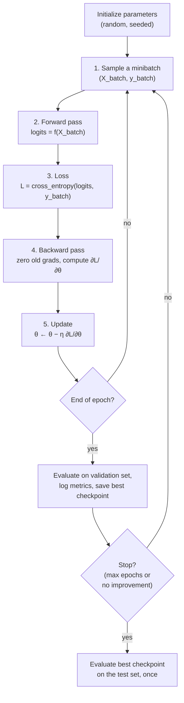
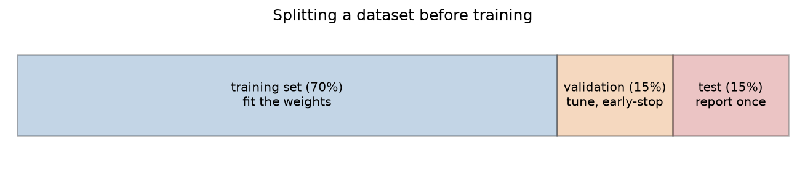
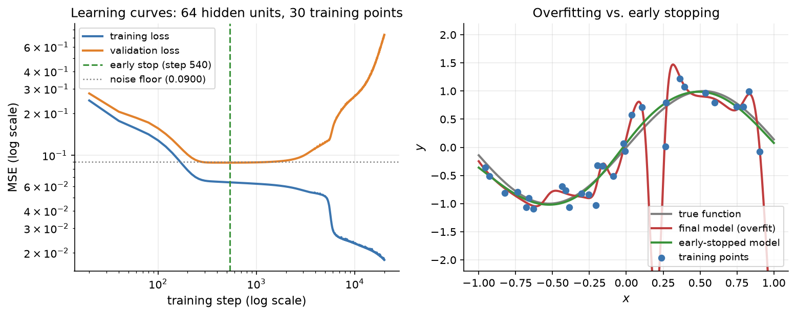
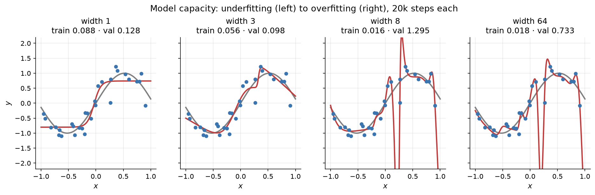
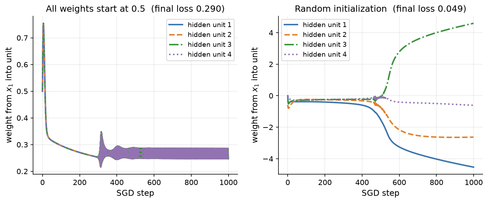

# 2.8 The Training Loop and Generalization

We now have every component needed to train a neural network: a model, a loss, gradients, and an update rule. This section assembles them into a complete training loop, and then turns to the question that matters most in practice. A model is trained on one set of examples, but we care about how well it does on examples it has never seen. That property is called **generalization**, and this section introduces the tools for measuring it (data splits and learning curves), the two ways it can fail (underfitting and overfitting), and the simplest remedies. We also look briefly at initialization and reproducibility, two details that quietly decide whether a training run works at all.

## The anatomy of a training loop

Every training loop in this book, from the 9-parameter XOR network to LLM pretraining on thousands of GPUs, has the same skeleton:

1. **Sample a minibatch** of examples from the training set.
2. **Forward pass**: compute the model's outputs for the minibatch.
3. **Compute the loss**, averaged over the minibatch.
4. **Backward pass**: compute the gradient of the loss with respect to every parameter (after clearing the old gradients, if the framework accumulates them).
5. **Update** the parameters with the optimizer, for plain SGD $`\theta \leftarrow \theta - \eta \nabla_\theta L`$.
6. **Repeat**, and periodically evaluate on held-out data, log metrics, and save checkpoints.

Figure 2.30 draws the loop.



*Figure 2.30: The training loop. The inner cycle (steps 1–5) runs once per minibatch. At the end of each epoch the model is evaluated on validation data, which drives checkpointing and early stopping. The test set is used only once, after training is finished.*

## Training, validation, and test sets

Suppose a model reaches a training loss of nearly zero. Is it a good model? We cannot tell. The training loss measures how well the model fits the examples it was optimized on, and a flexible enough model can drive it to zero by memorizing them. To estimate performance on new data, we must evaluate on data the model has not been trained on.

The standard practice is to split the available labeled data, before any training, into three disjoint parts (Figure 2.31):

- The **training set** is used to compute gradients and update the weights.
- The **validation set** (also called the *development set*) is used to make decisions *about* training: which learning rate, how many hidden units, when to stop. The model never computes gradients on it, but our choices adapt to it.
- The **test set** is used once, at the very end, to report how well the final model generalizes.



*Figure 2.31: A typical split of a labeled dataset. Proportions such as 70/15/15 or 80/10/10 are common for small datasets; very large datasets can use a much smaller fraction for validation and test.*

Why a separate validation set *and* test set? Because every decision made by looking at a dataset leaks a little information about that dataset into the model. If we try twenty learning rates and pick the one with the best validation loss, the chosen model's validation loss is an optimistically biased estimate: part of its apparent quality is luck that happened to suit those particular validation examples. The test set protects against this only if it plays no part in any decision. **Touch the test set once.** If you evaluate on it repeatedly and adjust the model in response, it silently becomes a second validation set, and the number you report no longer measures generalization. Chapter 11 discusses the large-scale version of this problem in LLM evaluation, where benchmark test sets can leak into training data.

The split should be random (shuffle before splitting) unless there is a reason to split otherwise. For time-ordered data, for example, the validation and test sets should come from *later* times than the training set, to mimic how the model will be used.

## Learning curves

The most informative diagnostic of a training run is a plot of the **training loss** and the **validation loss** over time, called the **learning curves**. The training loss usually decreases more or less steadily, since that is what the optimizer is minimizing. The validation loss tells the real story.

Figure 2.32 shows a deliberately overfitting-prone experiment: a network with 64 tanh hidden units fitted to just 30 noisy samples of a smooth curve, $`y = \sin(3x) + \text{noise}`$, with the noise having standard deviation 0.3. Because the noise is random, even a perfect model cannot achieve a mean squared error below the noise variance, $0.3^2 = 0.09$, on new data. That "noise floor" is drawn as a dotted line.



*Figure 2.32: Left: training and validation loss (MSE, log scales) for a 64-unit network trained on 30 noisy points for 20,000 steps. Validation loss reaches its minimum, close to the noise floor, around step 540, then rises as the network starts fitting the noise. Right: the final model (red) passes near every training point but swings wildly between them; the early-stopped model (green) stays close to the true function. (Trained with PyTorch and the Adam optimizer, introduced in Chapter 3, to reach the overfitting regime quickly.)*

Three phases are visible:

1. **Both losses fall.** Early in training the network learns the broad shape of the function, which helps on training and validation data alike.
2. **Validation loss bottoms out.** Around step 540 the validation MSE reaches 0.089, essentially at the noise floor. The model has learned the signal.
3. **The curves diverge.** Training loss keeps falling, eventually to 0.018, far *below* the noise floor, which is only possible by fitting the particular noise in the 30 training points. Validation loss rises to 0.733, eight times worse than at its best.

The gap between the two curves is the **generalization gap**. A widening gap with rising validation loss is the signature of overfitting.

## Underfitting, overfitting, and model capacity

A model's **capacity** is, informally, the richness of the set of functions it can represent. For a one-hidden-layer MLP, the width of the hidden layer is the main capacity knob: by the universal approximation argument of Section 2.3, more hidden units allow more bends and wiggles. Figure 2.33 trains four networks of different widths on the same 30 points, each for 20,000 steps.



*Figure 2.33: Networks with 1, 3, 8, and 64 hidden units trained on the same 30 noisy points (blue) from the gray curve. Titles give the final training and validation MSE. Width 1 underfits; width 3 captures the trend; widths 8 and 64 overfit, with low training loss but large validation loss.*

The four panels show the two failure modes on either side of a good model:

| Hidden units | Final train MSE | Final val MSE | Diagnosis |
|---|---|---|---|
| 1 | 0.088 | 0.128 | **Underfitting**: too simple to follow the curve; both losses are high |
| 3 | 0.056 | 0.098 | About right: close to the noise floor on validation data |
| 8 | 0.016 | 1.295 | **Overfitting**: fits noise, wild between points |
| 64 | 0.018 | 0.733 | **Overfitting** |

- **Underfitting** means the model cannot even fit the training data well. Both training and validation losses are high and close to each other. The remedy is more capacity (wider or deeper networks), better features, or simply training longer.
- **Overfitting** means the model fits the training data, including its noise, much better than it fits new data. Training loss is low and validation loss is much higher. The remedy is more data, less capacity, or regularization.

Two notes of caution. First, capacity is not only width: training time matters too, as the learning curves show. A 64-unit network stopped at step 540 generalizes well, while the same network trained to convergence does not. Second, the relationship between size and overfitting is not monotonic in every experiment; here the 8-unit network happened to end with a worse validation loss than the 64-unit one. Large modern networks, which have far more parameters than training examples, often generalize well despite being able to memorize their training data, a phenomenon that researchers are still working to explain. The lesson is not "small models are better" but "measure validation loss and let it guide you."

## Simple remedies

Three remedies are simple enough to use from day one.

**More data.** Overfitting happens when the model can exploit the peculiarities of a small sample. More training examples make those peculiarities average out. When more data is available, it is usually the most reliable fix, and it is the main reason LLMs are trained on trillions of tokens.

**Early stopping.** Since validation loss typically falls and then rises, simply stop training near its minimum. In practice, evaluate on the validation set every epoch (or every few hundred steps), keep a copy of the parameters with the best validation loss so far, and stop when validation loss has not improved for a fixed number of evaluations, called the *patience*. Then use the saved best checkpoint. Early stopping costs nothing, and it is used almost universally in some form. Prechelt's chapter in *Neural Networks: Tricks of the Trade* discusses practical stopping criteria.

**Smaller models.** If a model overfits badly even with early stopping, reduce its capacity. The validation set is how you pick the size.

More sophisticated regularizers, which let us keep large models while controlling overfitting, come in Chapter 3: *weight decay* (penalizing large weights), *dropout* (randomly zeroing activations during training), and *normalization* layers.

## A complete training loop

[Code 2.8.1](#code-281-a-complete-training-loop-with-early-stopping) puts everything together using the vectorized network from Section 2.7 (`init_params`, `forward`, `softmax_cross_entropy`, and `backward`, also available in `figures/src/numpy_mlp.py`) and a two-moons data generator (`make_moons` in `figures/src/style.py`). It splits the data, trains with minibatch SGD, evaluates on the validation set after every epoch, keeps the best checkpoint, stops early, and finally evaluates the best model on the test set exactly once.

We run it on 300 noisy two-moons points, split 70/15/15, with 128 hidden units, learning rate 0.1, batch size 16, and a patience of 50 epochs. The validation loss reached its minimum of 0.226 at epoch 231 and stopped improving after that, so training ended 50 epochs later, at epoch 281, by which point the training loss was 0.240 and the validation loss had risen to 0.343. The checkpoint from epoch 231 was used for the single test evaluation: a test loss of 0.229 and 91% accuracy on 45 unseen points. With datasets this small, validation and test estimates are noisy (one test point is about 2 percentage points), which is another reason to report exactly how an experiment was run.

## Initialization in brief: why not start at zero?

Every training loop starts from some initial parameters. It might seem natural to set all weights to zero, or to the same small constant. That fails, for a reason called **symmetry**.

If two hidden units in the same layer start with identical incoming weights and identical outgoing weights, they compute the same activation for every input. By the backpropagation equations of Section 2.6, they then receive identical gradients, so after the update their weights are still identical. By induction they stay identical forever: the layer behaves as if it had a single unit, no matter how wide it is. (With all weights and biases exactly zero it is even worse: in our tanh network, $`\tanh(0) = 0`$ and zero outgoing weights mean that every weight gradient is zero, and only the output bias ever changes.) Random initialization **breaks the symmetry**, giving each unit a different starting point so that the units can specialize.

Figure 2.34 shows the effect on a 2-4-1 tanh network trained on two moons with SGD.



*Figure 2.34: The weight from input x₁ into each of four hidden units during training. Left: when every weight starts at 0.5, all four units receive identical updates and their curves lie exactly on top of each other; the network is effectively one unit wide and stalls at a loss of 0.290. Right: with random initialization, the units follow different paths, and the network reaches a loss of 0.049 in the same 1,000 steps.*

The *scale* of the random initialization matters too. Weights that are too large saturate tanh and sigmoid units (Section 2.2) or make activations explode through many layers; weights that are too small make signals and gradients shrink. The initializers we used in this chapter scale the random weights by $`1/\sqrt{\text{fan-in}}`$ or $`\sqrt{2/\text{fan-in}}`$, where the fan-in is the number of inputs to a unit, which keeps activations in a reasonable range. Chapter 3 explains where these scalings come from (Xavier/Glorot and He initialization) and why they become essential in deep networks.

## Reproducibility: seeds and logging

Neural network training is full of randomness: the initial weights, the shuffling of data into minibatches, the train/validation/test split, and, in later chapters, dropout. Two runs with different random draws can end at noticeably different losses, as we saw with XOR in Section 2.3. Two habits make experiments trustworthy.

**Seed every source of randomness.** In NumPy, create a generator with `np.random.default_rng(seed)` and pass it (or the seed) explicitly to every function that needs randomness, as our code does. In PyTorch, call `torch.manual_seed(seed)`. Seeding makes a run repeatable on the same software and hardware. (Bit-for-bit reproducibility across different GPUs or library versions is harder, because some parallel operations do not guarantee the same order of floating-point additions.) And because one seed can be lucky, important comparisons should be repeated with several seeds, reporting the mean and spread.

**Log everything you need to reconstruct the run.** At minimum: the hyperparameters (learning rate, batch size, width, number of epochs, seed), the code version, the dataset version and split, and the training and validation losses at regular intervals. Our `fit` function returns its full history for exactly this reason. Larger projects use experiment trackers that record all of this automatically. A result you cannot reproduce is a result you cannot trust, and in LLM work, where a single training run can cost a great deal of compute, careful logging is not optional.

## Code for this section

The listings below collect the code for this section in the order in which the text refers to them. Later listings may reuse imports and definitions from earlier ones.

### Code 2.8.1: A complete training loop with early stopping

Data splitting, evaluation, and a `fit` function that trains with minibatch SGD, evaluates on the validation set after every epoch, keeps the best checkpoint, and stops early, followed by a single evaluation on the test set. It relies on `init_params`, `forward`, `softmax_cross_entropy`, and `backward` from Section 2.7 (Code 2.7.2, also in `figures/src/numpy_mlp.py`) and on `make_moons` from `figures/src/style.py`.

```python
import copy
import numpy as np

def split(X, y, frac_val=0.15, frac_test=0.15, seed=0):
    rng = np.random.default_rng(seed)
    idx = rng.permutation(len(X))
    n_test, n_val = int(frac_test * len(X)), int(frac_val * len(X))
    test, val, train = idx[:n_test], idx[n_test:n_test + n_val], idx[n_test + n_val:]
    return (X[train], y[train]), (X[val], y[val]), (X[test], y[test])

def evaluate(P, X, y):
    Z, _ = forward(P, X)
    loss, _ = softmax_cross_entropy(Z, y)
    return loss, np.mean(Z.argmax(axis=1) == y)

def fit(train, val, n_hidden=128, lr=0.1, batch_size=16, max_epochs=500, patience=50, seed=0):
    (X_tr, y_tr), (X_val, y_val) = train, val
    rng = np.random.default_rng(seed)
    P = init_params(X_tr.shape[1], n_hidden, int(y_tr.max()) + 1, seed=seed)
    best = {"val_loss": np.inf, "epoch": -1, "params": None}
    history = []
    for epoch in range(max_epochs):
        order = rng.permutation(len(X_tr))                 # reshuffle every epoch
        for start in range(0, len(X_tr), batch_size):
            idx = order[start:start + batch_size]          # 1. sample a minibatch
            Z, cache = forward(P, X_tr[idx])               # 2. forward pass
            loss, dZ = softmax_cross_entropy(Z, y_tr[idx]) # 3. loss (and dL/dZ)
            grads = backward(P, cache, dZ)                 # 4. backward pass
            for k in P:                                    # 5. update
                P[k] -= lr * grads[k]
        tr_loss, _ = evaluate(P, X_tr, y_tr)
        val_loss, val_acc = evaluate(P, X_val, y_val)
        history.append((epoch, tr_loss, val_loss))
        if val_loss < best["val_loss"]:                    # keep the best checkpoint
            best = {"val_loss": val_loss, "epoch": epoch, "params": copy.deepcopy(P)}
        elif epoch - best["epoch"] >= patience:            # early stopping
            break
    return best, history

X, y = make_moons(n=300, noise=0.35, seed=5)
train, val, test = split(X, y)
best, history = fit(train, val)
last_epoch, last_train, last_val = history[-1]
print(f"stopped after epoch {last_epoch}: train loss {last_train:.3f}, val loss {last_val:.3f}")
print(f"best epoch {best['epoch']}: val loss {best['val_loss']:.3f}")
test_loss, test_acc = evaluate(best["params"], *test)    # touched once, at the very end
print(f"test loss {test_loss:.3f}, test accuracy {test_acc:.2f}")
```

Output:

```text
stopped after epoch 281: train loss 0.240, val loss 0.343
best epoch 231: val loss 0.226
test loss 0.229, test accuracy 0.91
```
## Key takeaways

- Every training loop repeats the same steps: sample a minibatch, forward pass, loss, backward pass, update, with periodic evaluation on held-out data.
- Split data into training, validation, and test sets before training. Use the validation set for all decisions; use the test set once, at the end.
- Learning curves (training and validation loss over time) are the primary diagnostic. Rising validation loss while training loss falls signals overfitting.
- Underfitting means both losses are high (add capacity or train longer); overfitting means a large gap between them (add data, stop early, reduce capacity, or regularize as in Chapter 3).
- Early stopping keeps the checkpoint with the best validation loss and stops after a patience period without improvement.
- Initialize weights randomly to break symmetry; identical units receive identical gradients and never differentiate.
- Seed all randomness, repeat important comparisons with several seeds, and log hyperparameters and metrics.

## Further reading

Goodfellow, Ian, et al. *Deep Learning*. Cambridge, MA: MIT Press, 2016. https://www.deeplearningbook.org/.

LeCun, Yann, et al. "Efficient BackProp." In *Neural Networks: Tricks of the Trade*, 9–50. Lecture Notes in Computer Science 1524. Berlin: Springer, 1998. https://doi.org/10.1007/3-540-49430-8_2.

Prechelt, Lutz. "Early Stopping — But When?" In *Neural Networks: Tricks of the Trade*, 55–69. Lecture Notes in Computer Science 1524. Berlin: Springer, 1998. https://doi.org/10.1007/3-540-49430-8_3.

Zhang, Chiyuan, et al. "Understanding Deep Learning Requires Rethinking Generalization." arXiv preprint arXiv:1611.03530, 2016. https://arxiv.org/abs/1611.03530.
