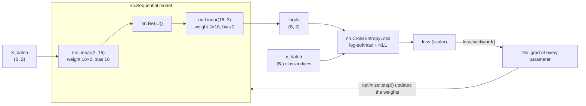
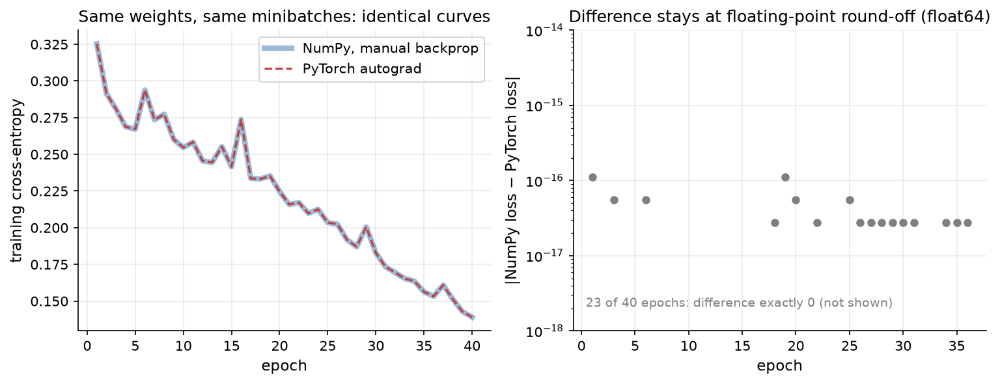

# 2.9 A First Look at PyTorch

We have built every piece of neural network training by hand: neurons, activations, losses, gradient descent, a scalar autograd engine, and a vectorized network with a hand-derived backward pass. From Chapter 3 onward we will use **PyTorch**, a widely used deep learning framework in research and industry, including for training LLMs. This section shows that PyTorch is not magic. Its core ideas are the ones we already implemented, packaged with far more operations, GPU support, and careful engineering. We map our from-scratch pieces to PyTorch's, rebuild the same MLP with `torch.nn`, and verify that our gradients and loss curves match PyTorch's to within floating-point round-off.

## Tensors, `requires_grad`, and `backward()`

PyTorch's central object is the **tensor**, a multi-dimensional array much like a NumPy array, which can live on a CPU or a GPU. A tensor created with `requires_grad=True` tells PyTorch to record every operation performed on it. As you compute, PyTorch builds a computational graph behind the scenes, exactly as our `Scalar` engine did, except that each node is a whole tensor operation rather than a single number. Calling `.backward()` on a scalar result runs reverse-mode automatic differentiation through that graph and stores the gradient of the result with respect to each leaf tensor in its `.grad` attribute.

Consider again the single-neuron example from Section 2.6, $`L = (\tanh(wx + b) - y)^2`$ with $x = 0.5$, $w = 1.2$, $b = -0.3$, and $y = 0.8$. We create `w` and `b` as tensors with `requires_grad=True`, compute `L` with ordinary tensor operations, and call `L.backward()` ([Code 2.9.1](#code-291-the-single-neuron-with-autograd)). PyTorch reports $L = 0.2588$, $`\partial L / \partial w = -0.4655`$, and $`\partial L / \partial b = -0.9310`$. The gradients are exactly the ones we computed by hand and with our engine. The `grad_fn` attribute exposes the recorded graph: `L` was produced by a power operation (`PowBackward0`), whose input was produced by a subtraction (`SubBackward0`), and so on back to `w` and `b`. Each of these `...Backward` objects plays the role of our stored local derivatives, a rule for turning an upstream gradient into gradients for the operation's inputs.

PyTorch's graph is **dynamic** ("define-by-run"): it is built fresh every time the forward code runs, by ordinary Python execution. You can use Python `if` statements and loops in the forward pass, and the graph simply records whatever happened. Our `bce_from_logit` function in Section 2.6, which branched on the sign of the logit, relied on the same property. After `backward()` finishes, PyTorch frees the graph by default; the next forward pass builds a new one.

Like our engine, PyTorch **accumulates** gradients into `.grad`. Calling `backward()` twice without clearing adds the second gradient to the first, which is why training loops must zero gradients every step (Section 2.6).

## Mapping our pieces to PyTorch

Every component we built has a direct counterpart:

| Our from-scratch version | PyTorch |
|---|---|
| `Scalar` value object with `.value`, `.grad`, and recorded inputs | `torch.Tensor` with `requires_grad=True`, `.grad`, and `.grad_fn` |
| Local derivatives stored at each node | Backward functions (`grad_fn`) for each operation |
| `Scalar.backward()` with a topological sort | `loss.backward()` (the autograd engine) |
| Resetting `p.grad = 0.0` | `optimizer.zero_grad()` |
| `p.value -= lr * p.grad` | `optimizer.step()` with `torch.optim.SGD` |
| `W1`, `b1` arrays and `X @ W1 + b1` | `nn.Linear(in_features, out_features)` |
| `np.maximum(0, Z)` | `nn.ReLU()` |
| `softmax_cross_entropy(Z, y)` on logits | `nn.CrossEntropyLoss()` on logits |
| Hand-written `backward(P, cache, dZ)` | Not needed: autograd derives it |

Figure 2.35 shows how the pieces fit together in a PyTorch training step.



*Figure 2.35: A PyTorch training step for the two-moons MLP. The model is a stack of modules; the loss takes raw logits and integer class labels; backward() fills in every parameter's gradient; the optimizer uses those gradients to update the parameters.*

## The worked example, one more time

As a first check, let us rerun the 2-2-1 worked example of Sections 2.3 and 2.6 in PyTorch ([Code 2.9.2](#code-292-the-2-2-1-worked-example-in-pytorch)). We use 64-bit floats (`torch.float64`) so that comparisons with our NumPy results are not limited by 32-bit precision. PyTorch returns the loss 0.2960 and the same nine gradients shown in Figure 2.22. Hand derivation, `Scalar` engine, and PyTorch all agree. Note the function name `binary_cross_entropy_with_logits`: like our `bce_from_logit`, it takes the logit rather than the probability and computes the loss in a numerically stable way.

## Building the same MLP with `torch.nn`

Writing out weight tensors by hand does not scale. PyTorch's `torch.nn` package provides **modules**, objects that hold parameters and define a forward computation. The three we need are:

- `nn.Linear(in_features, out_features)` computes $`\mathbf{x} W^\top + \mathbf{b}`$. It stores its weight with shape `(out_features, in_features)`, the *transpose* of our `W1` convention, and initializes it randomly (uniformly, scaled by $`1/\sqrt{\text{in\_features}}`$).
- `nn.ReLU()` applies $`\max(0, z)`$ elementwise.
- `nn.CrossEntropyLoss()` takes **raw logits** of shape `(B, C)` and integer class labels of shape `(B,)`, applies log-softmax internally in a numerically stable way, and returns the mean negative log-likelihood. Do not apply softmax yourself before this loss: the loss would then apply log-softmax to probabilities, silently computing the wrong thing.

`nn.Sequential` chains modules into a model. To compare with the from-scratch network of Section 2.7 as precisely as possible, we give the PyTorch model **the same initial weights** (transposed to PyTorch's layout) and feed it **the same minibatches in the same order** ([Code 2.9.3](#code-293-comparing-hand-written-and-autograd-gradients)). As a first test, we compute the gradients on one batch of 64 two-moons examples in two ways: with our hand-written `backward` function and with `loss.backward()` on the PyTorch model. For every parameter the two results agree (`np.allclose` returns `True`). The largest difference is about $`3 \times 10^{-17}`$, which is round-off at the level of 64-bit floating-point precision (about $`10^{-16}`$ relative). Our hand-derived matrix backward pass computes the same gradients as PyTorch's autograd.

## Training with `torch.optim.SGD`

A PyTorch training loop has exactly the structure of Figure 2.30. The optimizer object holds references to the model's parameters; `zero_grad()` clears their gradients, and `step()` applies the update rule. For each minibatch, the loop computes the loss with a forward pass and then calls `opt.zero_grad()`, `loss.backward()`, and `opt.step()`, in that order ([Code 2.9.4](#code-294-training-side-by-side-with-the-numpy-network)). We train the PyTorch model this way for 40 epochs with learning rate 0.3 and batch size 32, and train our NumPy network with `train_sgd` from Section 2.7 using the same settings and the same shuffling. Both runs end with a training loss of 0.139024, and the largest per-epoch difference between them is $`1.1 \times 10^{-16}`$. Figure 2.36 plots the two loss curves.



*Figure 2.36: Left: training loss per epoch for the from-scratch NumPy network (thick blue) and the PyTorch network (dashed red), both starting from the same weights and seeing the same minibatches. The curves coincide. Right: the absolute difference between them, which stays at the level of 64-bit round-off for all 40 epochs; in most epochs it is exactly zero.*

After 40 epochs and 520 SGD updates, the two implementations differ by about $`10^{-16}`$, the smallest difference representable near these loss values. Everything PyTorch did in this loop, we could have done (much more slowly) ourselves.

A few PyTorch idioms from these examples are worth highlighting:

- `with torch.no_grad():` turns off graph recording. Use it for evaluation and for manual parameter changes, where you do not want gradients.
- `.item()` converts a one-element tensor to a Python number, and `.numpy()` converts a CPU tensor to a NumPy array (sharing memory).
- To run on a GPU, move the model and data there with `model.to("cuda")` and `X.to("cuda")`; nothing else in the loop changes. This is the payoff of writing vectorized code (Section 2.7).
- The default dtype in PyTorch is 32-bit float; we switched to 64-bit only to make exact comparisons. Real training uses 32-bit or lower precision (16-bit formats are standard for LLMs), for speed and memory.

## Where the book goes from here

This chapter covered the complete foundation: a network with one hidden layer, trained by gradient descent with gradients from backpropagation, and verified three ways. The rest of the book builds on it directly:

- **Chapter 3, deeper networks.** What changes when we stack many hidden layers: vanishing and exploding gradients, careful initialization, normalization, residual connections, and better optimizers such as momentum and Adam with learning-rate schedules, plus regularization with weight decay and dropout.
- **Chapter 4, embeddings.** How discrete symbols such as words become vectors that a network can process, and why the hidden representations of Section 2.3 can capture meaning.
- **Chapter 5, tokenization.** How raw text is split into the tokens that define the "classes" of next-token prediction.
- **Chapter 6, the transformer.** The architecture of modern LLMs: attention, feed-forward blocks with GELU and SwiGLU activations, and the matrix multiplications that dominate their cost.
- **Chapter 8, generative pretraining.** Training a transformer with exactly the cross-entropy loss of Section 2.4, averaged over trillions of token positions, using exactly the training loop of Section 2.8.

When those chapters call `loss.backward()` on a model with billions of parameters, you will know what happens underneath: a graph of simple operations, local derivatives, and the chain rule applied in reverse.

## Code for this section

The listings below collect the code for this section in the order in which the text refers to them. Later listings may reuse imports and definitions from earlier ones.

### Code 2.9.1: The single neuron with autograd

The single-neuron example of Section 2.6 written with PyTorch tensors. The second line of output shows the backward functions of the last two operations in the recorded graph.

```python
import torch

x = torch.tensor(0.5)
w = torch.tensor(1.2, requires_grad=True)
b = torch.tensor(-0.3, requires_grad=True)
y = torch.tensor(0.8)

L = (torch.tanh(w * x + b) - y) ** 2
L.backward()
print(f"L = {L.item():.4f}, dL/dw = {w.grad.item():.4f}, dL/db = {b.grad.item():.4f}")
print(L.grad_fn, L.grad_fn.next_functions[0][0])
```

Output (the memory addresses vary from run to run):

```text
L = 0.2588, dL/dw = -0.4655, dL/db = -0.9310
<PowBackward0 object at 0x...> <SubBackward0 object at 0x...>
```

### Code 2.9.2: The 2-2-1 worked example in PyTorch

Recomputes the loss and all nine gradients of the worked example in 64-bit precision. It reuses `torch` from Code 2.9.1.

```python
torch.set_default_dtype(torch.float64)

x = torch.tensor([1.0, 0.5])
W1 = torch.tensor([[0.5, -0.3], [0.8, 0.2]], requires_grad=True)
b1 = torch.tensor([0.0, 0.1], requires_grad=True)
W2 = torch.tensor([1.0, -1.5], requires_grad=True)
b2 = torch.tensor(0.2, requires_grad=True)

z2 = torch.tanh(x @ W1 + b1) @ W2 + b2
loss = torch.nn.functional.binary_cross_entropy_with_logits(z2, torch.tensor(1.0))
loss.backward()
print(f"loss = {loss.item():.4f}")
print("dW1 =", W1.grad.numpy().round(4).tolist())
print("db1 =", b1.grad.numpy().round(4).tolist())
print("dW2 =", W2.grad.numpy().round(4).tolist(), " db2 =", round(b2.grad.item(), 4))
```

Output:

```text
loss = 0.2960
dW1 = [[-0.1247, 0.3805], [-0.0624, 0.1902]]
db1 = [-0.1247, 0.3805]
dW2 = [-0.1835, 0.0255]  db2 = -0.2562
```

### Code 2.9.3: Comparing hand-written and autograd gradients

Builds the two-moons MLP with `nn.Sequential`, copies in the initial weights of the from-scratch network, and compares the two sets of gradients on one batch of 64 examples. It uses `make_moons` from `figures/src/style.py` and `init_params`, `forward`, `softmax_cross_entropy`, and `backward` from Section 2.7 (Code 2.7.2).

```python
import numpy as np
import torch.nn as nn

X, y = make_moons(n=400, noise=0.2, seed=2)            # two-moons data from figures/src/style.py
P0 = init_params(2, 16, 2, seed=0)                     # from-scratch initial weights (Section 2.7)

model = nn.Sequential(nn.Linear(2, 16), nn.ReLU(), nn.Linear(16, 2))
with torch.no_grad():                                  # copy weights without recording a graph
    model[0].weight.copy_(torch.from_numpy(P0["W1"].T))   # nn.Linear stores (out, in)
    model[0].bias.copy_(torch.from_numpy(P0["b1"]))
    model[2].weight.copy_(torch.from_numpy(P0["W2"].T))
    model[2].bias.copy_(torch.from_numpy(P0["b2"]))
loss_fn = nn.CrossEntropyLoss()
Xt, yt = torch.from_numpy(X), torch.from_numpy(y)

# Gradients on one batch of 64 examples: from scratch vs. autograd
Z, cache = forward(P0, X[:64])
_, dZ = softmax_cross_entropy(Z, y[:64])
ours = backward(P0, cache, dZ)
loss_fn(model(Xt[:64]), yt[:64]).backward()
theirs = {"W1": model[0].weight.grad.T, "b1": model[0].bias.grad,
          "W2": model[2].weight.grad.T, "b2": model[2].bias.grad}
for k in ours:
    diff = np.abs(ours[k] - theirs[k].numpy()).max()
    print(f"{k}: max |difference| = {diff:.1e}, allclose: {np.allclose(ours[k], theirs[k].numpy())}")
```

Output:

```text
W2: max |difference| = 2.8e-17, allclose: True
b2: max |difference| = 2.3e-17, allclose: True
W1: max |difference| = 1.4e-17, allclose: True
b1: max |difference| = 1.4e-17, allclose: True
```

### Code 2.9.4: Training side by side with the NumPy network

Continues from Code 2.9.3. Trains the PyTorch model with `torch.optim.SGD` and the from-scratch network with `train_sgd` (Section 2.7, Code 2.7.3), from the same initial weights and with the same minibatches, then compares their loss histories.

```python
opt = torch.optim.SGD(model.parameters(), lr=0.3)
for p in model.parameters():                          # start clean (we called backward above)
    p.grad = None

rng = np.random.default_rng(0)                        # same shuffling as our train_sgd
history_torch = []
for epoch in range(40):
    order = rng.permutation(len(X))
    for start in range(0, len(X), 32):
        idx = torch.from_numpy(order[start:start + 32])
        loss = loss_fn(model(Xt[idx]), yt[idx])       # forward pass and loss
        opt.zero_grad()                               # clear old gradients
        loss.backward()                               # backward pass
        opt.step()                                    # SGD update
    with torch.no_grad():                             # evaluation: no graph needed
        history_torch.append(loss_fn(model(Xt), yt).item())

P = {k: v.copy() for k, v in P0.items()}
P, history_ours = train_sgd(P, X, y, lr=0.3, epochs=40, batch_size=32, seed=0)
print(f"final loss: ours {history_ours[-1]:.6f}, PyTorch {history_torch[-1]:.6f}")
print(f"largest per-epoch difference: {np.abs(np.array(history_ours) - np.array(history_torch)).max():.1e}")
```

Output:

```text
final loss: ours 0.139024, PyTorch 0.139024
largest per-epoch difference: 1.1e-16
```
## Key takeaways

- PyTorch tensors with `requires_grad=True` record a dynamic computational graph as ordinary Python code runs; `loss.backward()` runs reverse-mode autodiff and fills each leaf's `.grad`.
- Every from-scratch piece has a PyTorch counterpart: value object to tensor, local backward rules to `grad_fn`, manual updates to `torch.optim.SGD`, weight matrices to `nn.Linear`.
- `nn.CrossEntropyLoss` takes raw logits and integer labels and applies log-softmax internally; never apply softmax before it.
- PyTorch accumulates gradients, so call `optimizer.zero_grad()` every step; use `torch.no_grad()` for evaluation.
- With identical initial weights and minibatches, our hand-derived gradients and training curve match PyTorch's to within 64-bit round-off (differences around $`10^{-17}`$ to $`10^{-16}`$).

## Further reading

Baydin, Atılım Güneş, et al. "Automatic Differentiation in Machine Learning: A Survey." *Journal of Machine Learning Research* 18, no. 153 (2018): 1–43. https://arxiv.org/abs/1502.05767.

Goodfellow, Ian, et al. *Deep Learning*. Cambridge, MA: MIT Press, 2016. https://www.deeplearningbook.org/.

Paszke, Adam, et al. "PyTorch: An Imperative Style, High-Performance Deep Learning Library." In *Advances in Neural Information Processing Systems 32*, 2019. https://arxiv.org/abs/1912.01703.
