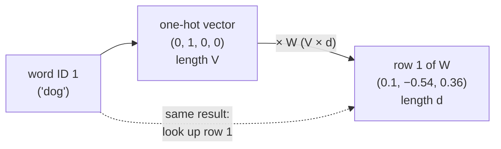

# 4.1 Why Embeddings

Neural networks compute with numbers. Every network in Chapters 2 and 3 took a vector of real numbers as input, multiplied it by weight matrices, and passed the results through nonlinearities. Text isn't made of numbers, though. It is made of discrete symbols: words, pieces of words, punctuation marks. Before a network can read a sentence, each symbol has to become a vector, and the way we make that conversion matters a great deal. This section looks at the most obvious conversion, the one-hot vector, and shows why it fails for language. It then introduces the idea behind every alternative in this chapter: represent each word by a short, dense vector of learned numbers, arranged so that words used in similar ways end up close together. Such vectors are called **embeddings**, and they are the first thing that happens to text inside every LLM.

## From symbols to integers

Suppose we have fixed a **vocabulary**: a list of the $`V`$ distinct symbols the model will ever see. In this chapter the symbols will usually be whole words, because words make the examples easy to follow. Real LLMs use subword *tokens* instead, which Chapter 5 explains; everything in this chapter applies to tokens unchanged. Numbering the vocabulary entries $`0, 1, \dots, V-1`$ turns a sentence into a sequence of integers:

```python
vocab = ["<unk>", "the", "cat", "dog", "sat", "on", "mat"]
word_to_id = {w: i for i, w in enumerate(vocab)}

sentence = "the cat sat on the mat".split()
ids = [word_to_id.get(w, 0) for w in sentence]   # unknown words map to ID 0
print(ids)
# [1, 2, 4, 5, 1, 6]
```

The integers are only names. The fact that "cat" is 2 and "dog" is 3 says nothing about cats and dogs being related, and the fact that "mat" is 6 does not make it "bigger" than "the." If we fed these integers directly into a network as numbers, the first layer would compute $`w \cdot 2`$ for "cat" and $`w \cdot 3`$ for "dog," imposing an ordering and a scale that mean nothing. We need a representation that treats each symbol as a separate category.

## One-hot vectors

The standard way to feed a category into a network is a **one-hot vector**: a vector of length $`V`$ that is 0 everywhere except for a 1 at the position of the symbol's ID. We met one-hot vectors in Section 2.4 as *targets* for classification; here they appear as *inputs*. With the seven-word vocabulary above,

```math
\mathbf{e}_{\text{cat}} = (0, 0, 1, 0, 0, 0, 0), \qquad \mathbf{e}_{\text{dog}} = (0, 0, 0, 1, 0, 0, 0).
```

One-hot vectors fix the ordering problem: no word is larger than another, and each word gets its own dimension. But they have three serious defects.

**They are huge.** A one-hot vector has one entry per vocabulary item. A word-level vocabulary for English easily reaches hundreds of thousands of entries, and the subword vocabularies of modern LLMs contain tens of thousands to a few hundred thousand tokens (Chapter 5). Every input position would be a vector with, say, 50,000 entries.

**They are sparse.** Of those 50,000 entries, exactly one is nonzero. Storing and multiplying such vectors naively wastes almost all of the memory and computation on zeros.

**They carry no notion of similarity.** This is the most important defect. Any two different one-hot vectors are orthogonal, so their dot product is 0, and every pair of distinct words is exactly the same distance apart:

```python
import numpy as np

vocab = ["cat", "dog", "car", "banana"]
one_hot = np.eye(len(vocab))

def cos(a, b):
    return a @ b / (np.linalg.norm(a) * np.linalg.norm(b))

print("cos(cat, dog)    =", cos(one_hot[0], one_hot[1]))
print("cos(cat, banana) =", cos(one_hot[0], one_hot[3]))
print("distance(cat, dog)    =", np.linalg.norm(one_hot[0] - one_hot[1]).round(4))
print("distance(cat, banana) =", np.linalg.norm(one_hot[0] - one_hot[3]).round(4))
```

```text
cos(cat, dog)    = 0.0
cos(cat, banana) = 0.0
distance(cat, dog)    = 1.4142
distance(cat, banana) = 1.4142
```

(The cosine similarity used here measures the angle between two vectors; Section 4.3 treats it properly.) In one-hot space, "cat" is exactly as similar to "dog" as it is to "banana." Whatever a network learns about the word "cat" tells it nothing about "dog," because the two words activate completely different input weights. If the training data contains "the cat sat on the mat" many times but "the dog sat on the mat" only rarely, the network cannot transfer what it learned about cats to dogs. It has to learn every word separately from that word's own occurrences. For rare words, which make up most of any vocabulary, there simply is not enough data.

## What the first layer does with a one-hot vector

Something useful happens anyway as soon as a one-hot vector enters a network. Let the first layer have a weight matrix $`W \in \mathbb{R}^{V \times d}`$ and no bias (we write inputs as row vectors, as in Section 2.7). Multiplying a one-hot row vector by $`W`$ picks out one row:

```math
\mathbf{e}_i^\top W = W_{i,:} .
```

Every other row is multiplied by 0. So the first layer's output for word $`i`$ is simply row $`i`$ of $`W`$, a vector of $`d`$ numbers, and $`d`$ can be much smaller than $`V`$: a few hundred or a few thousand, instead of tens of thousands.

```python
rng = np.random.default_rng(0)
W = rng.normal(size=(4, 3)).round(2)   # V = 4 words, d = 3
x = one_hot[1]                         # "dog"
print(x @ W)
print(W[1])
```

```text
[ 0.1  -0.54  0.36]
[ 0.1  -0.54  0.36]
```

Figure 4.1 shows the equivalence.



*Figure 4.1: Multiplying a one-hot vector by a weight matrix selects one row of the matrix. The multiplication (solid path) and a direct table lookup (dashed path) give the same vector, but the lookup skips $`V \times d`$ multiplications, almost all by zero.*

Two conclusions follow. First, we never need to build the one-hot vector at all. We can store $`W`$ as a table and **look up** row $`i`$ directly, which costs almost nothing. Second, and more important, the rows of $`W`$ are *learned parameters*. When we train the network by gradient descent, each row moves to wherever it helps the network reduce its loss. If "cat" and "dog" play similar roles in the training data, predicting similar things and being predicted by similar things, then gradient descent has every reason to push their rows toward similar values. The rows of $`W`$ are the network's own dense representation of each word.

That row, a dense vector of $`d`$ learned numbers standing in for a discrete symbol, is an **embedding**, and $`W`$ is an **embedding matrix** (or embedding table). The word "embedding" comes from mathematics: we are placing, or embedding, a discrete set of symbols into a continuous space $`\mathbb{R}^d`$.

## The embedding layer in a neural network

Deep learning libraries provide this table as a layer of its own. In PyTorch it is `nn.Embedding(num_embeddings, embedding_dim)`: a $`V \times d`$ matrix of learned parameters, stored in `.weight`, whose output for a tensor of integer IDs of any shape is the same tensor with one extra dimension of size $`d`$, holding the looked-up rows:

```python
import torch
import torch.nn as nn
import torch.nn.functional as F
torch.manual_seed(0)

V, d = 10, 4
emb = nn.Embedding(V, d)
print(emb.weight.shape)

ids = torch.tensor([[3, 7, 3, 1]])            # a batch of one sequence of 4 word IDs
x = emb(ids)
print(x.shape)

one_hot = F.one_hot(ids, num_classes=V).float()   # (1, 4, V)
print(torch.allclose(one_hot @ emb.weight, x))    # lookup == one-hot times matrix
```

```text
torch.Size([10, 4])
torch.Size([1, 4, 4])
True
```

A batch of shape `(B, T)`, holding $`B`$ sequences of $`T`$ word IDs, becomes a tensor of shape `(B, T, d)`, one $`d`$-dimensional vector per position, ready for the layers that follow. The last line confirms the equivalence of Figure 4.1: the lookup gives exactly what a bias-free linear layer would compute on one-hot inputs. Notice also that word 3 appears twice in the sequence and receives the same vector both times. The embedding layer gives a word the same vector wherever it occurs; Section 4.4 returns to what that costs.

### Learned end to end

Where do the rows come from? One option is to train them separately, with a method designed only to produce good word vectors, such as the Word2Vec models of Section 4.2, and then plug them into a larger network. The other is to start the table from small random numbers and train it **end to end**: the embedding layer is simply the first layer of the network, and the same loss and the same optimizer that train every other layer also train the table.

Gradients reach the table through backpropagation like any other layer (Section 2.6), with one special property: only the rows that were actually looked up receive a gradient.

```python
x.sum().backward()                            # any loss that depends on x
print(emb.weight.grad.abs().sum(dim=1))       # gradient magnitude for each row
```

```text
tensor([0., 4., 0., 8., 0., 0., 0., 4., 0., 0.])
```

Rows 1, 3, and 7, the words in the batch, have gradients. Row 3 has twice as much because word 3 appeared twice, and its gradients from the two positions add up. Every other row has exactly zero gradient. The backward pass of a lookup is a *scatter-add*: each position's gradient is added into the row it came from.

This has practical consequences:

- **Frequent words train fast, rare words train slowly.** A word that appears in almost every batch gets a gradient at almost every step. A word that appears once in a billion gets almost none. If a vocabulary entry is nearly absent from the training data, its row can stay close to its random initialization, and the network may behave strangely when it appears. Chapter 5 returns to such under-trained tokens.
- **The network learns its own notion of similarity.** When a table is trained end to end, words used in similar ways tend to end up nearby, for the reason given above. But the table is optimized for whatever helps the rest of the network reduce its loss, not for any separate similarity objective.
- **The table and the layers adapt to each other.** Since the table is learned jointly with the rest of the network, the vectors and the layers that read them are shaped together.

Word2Vec, in the next section, is itself trained this way. It is the simplest case possible: a network that is *only* an embedding table and an output layer, trained end to end so that the table becomes useful to other models afterward. Later chapters use the same `nn.Embedding` layer as the first layer of much larger networks (Chapters 6 and 7).

> **Code Lab 4.4** builds an `nn.Embedding` layer and inspects its weights: it checks that lookup equals one-hot multiplication, confirms the output shape for a batch of sequences, and watches which rows receive gradients, and how much, when some IDs repeat and others never appear.

## Dense vectors and the distributional idea

An embedding is useful only if its geometry means something. What should make two words' vectors close? The answer used throughout this chapter, and throughout modern NLP, is the **distributional hypothesis**: *words that appear in similar contexts tend to have similar meanings*.

You can check this idea on yourself. Suppose you have never seen the word "zorbit," and you read:

- "A zorbit was sitting on the branch."
- "She fed the zorbit a handful of nuts."
- "The zorbit's tail twitched as it climbed."

You now know a lot about zorbits: they are small animals, they climb trees, and they probably eat nuts, even though nobody defined the word. The surrounding words did all the work. A zorbit shows up in the same kinds of contexts as "squirrel," so it probably means something similar.

The distributional hypothesis turns meaning, which is hard to define, into co-occurrence statistics, which are easy to count and easy to predict. It suggests a concrete recipe:

1. Give every word a dense vector of $`d`$ numbers, initialized at random.
2. Set up a prediction task in which a word's vector must help predict the words around it, or the words around it must help predict the word.
3. Train all the vectors by gradient descent on a large corpus of ordinary text.

Words with similar contexts receive similar gradient signals, because they are asked to make similar predictions, and so their vectors drift toward each other. No one labels anything: the text itself provides the training signal, in the same way that the next word in a sentence provides the label for next-token prediction (Section 2.4). This is **self-supervised learning**, and it is why embeddings can be trained on billions of words.

## What we gain

It helps to compare the two representations side by side.

| Property | One-hot vector | Dense embedding |
|---|---|---|
| Length | $`V`$ (tens of thousands or more) | $`d`$ (typically hundreds to a few thousand) |
| Nonzero entries | 1 | all $`d`$ |
| Values | fixed 0s and 1s | learned real numbers |
| Similarity between different words | always 0 | reflects how the words are used |
| Parameters needed downstream | a first layer with $`V \times d`$ weights | the same $`V \times d`$ table, used as a lookup |
| Sharing across words | none | what is learned about one word helps similar words |

The number of parameters is the same either way: a $`V \times d`$ matrix. The difference is in how we think about it and use it. Viewing the matrix as a table of word vectors makes the lookup cheap, lets us inspect the vectors directly, and, most importantly, makes clear that these vectors are where a model stores what it knows about each word as an individual symbol.

Dense vectors also make **generalization** possible. Because "cat" and "dog" end up near each other, any later layer that computes a function of the embedding produces similar outputs for the two words. What the model learns from sentences about cats transfers partly to dogs, and to "kitten" and "puppy," without separate training data for each. This is the same smoothness that lets an MLP generalize from its training points to nearby inputs (Section 2.8); embeddings put words into a space where "nearby" means something.

## The rest of this chapter

The remaining sections build on this idea step by step:

- **Section 4.2** trains word embeddings with Word2Vec, a shallow network that learns vectors by predicting context words, and extends it with fastText's subword pieces.
- **Section 4.3** explores the geometry of the resulting space: cosine similarity, nearest neighbors, analogies, and the social biases that embeddings absorb from text.
- **Section 4.4** explains why one vector per word is not enough, what static vectors are still good for, and where the book picks up the problem again, and ends with a summary of the chapter and exercises.

## Key takeaways

- Networks need numeric inputs, and word IDs are arbitrary labels, so they cannot be fed in as numbers.
- One-hot vectors treat each word as its own category but are $`V`$-dimensional, sparse, and make every pair of distinct words equally dissimilar, so nothing learned about one word transfers to another.
- Multiplying a one-hot vector by a weight matrix selects one row; in practice we skip the multiplication and look the row up in an embedding table.
- `nn.Embedding` stores the table as a $`V \times d`$ parameter and maps IDs of shape `(B, T)` to vectors of shape `(B, T, d)`. Trained end to end, only the rows of words in the batch receive gradients, so rarely seen words train slowly.
- An embedding is a dense, learned vector of $`d \ll V`$ numbers for each symbol. Training moves words that are used alike to nearby points.
- The distributional hypothesis, that words in similar contexts have similar meanings, turns plain text into a self-supervised training signal for embeddings.

## Further reading

Goodfellow, Ian, et al. *Deep Learning*. Cambridge, MA: MIT Press, 2016. Section 12.4. https://www.deeplearningbook.org/.

Jurafsky, Daniel, and James H. Martin. *Speech and Language Processing*. 3rd ed. draft. See the chapter "Vector Semantics and Embeddings." https://web.stanford.edu/~jurafsky/slp3/.
