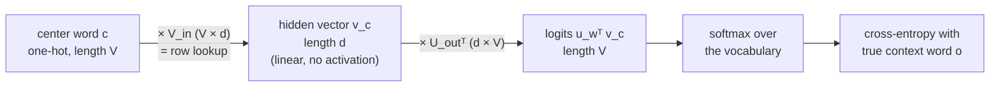

# 4.2 Learning Word Embeddings with Word2Vec

Section 4.1 ended with a recipe: give every word a random dense vector, set up a task in which the vectors must predict each other, and let gradient descent do the rest. **Word2Vec** (Mikolov et al. 2013a, 2013b) is the best-known implementation of that recipe, and it is worth studying closely for two reasons. First, it is small enough to understand completely: it is a neural network with a single linear hidden layer, trained with the softmax cross-entropy of Chapter 2. Second, the tricks that made it fast, especially negative sampling, show up again and again in modern machine learning. This section derives the two Word2Vec architectures, skip-gram and CBOW, explains why the full softmax is too expensive and how negative sampling replaces it, writes the model in a few lines of PyTorch, and finishes with fastText, which builds word vectors out of pieces of words and points ahead to the tokenizers of Chapter 5.

## Turning text into training examples

Word2Vec needs no labeled data. It reads a long stream of words $`w_1, w_2, \dots, w_T`$ and makes its own training examples from it. Pick a **window size** $`m`$. For each position $`t`$, the word $`w_t`$ is the **center word**, and the words within $`m`$ positions on either side, $`w_{t-m}, \dots, w_{t-1}, w_{t+1}, \dots, w_{t+m}`$, are its **context words**.

With $`m = 2`$ and the sentence "the quick brown fox jumps," the center word "brown" has the context words "the," "quick," "fox," and "jumps." Sliding the window along the text produces an enormous number of (center, context) pairs from nothing but raw text:

Notebook: [4.2-turning-text-into-training-examples.ipynb](../../code/04-embeddings/4.2-turning-text-into-training-examples.ipynb)

A corpus of a billion words with $`m = 5`$ yields about ten billion pairs. Each pair is a small piece of evidence about which words keep company with which. Word2Vec turns that evidence into vectors.

## Skip-gram: predict the context from the center word

The **skip-gram** model uses the center word to predict each of its context words. It gives every word $`w`$ in the vocabulary *two* vectors of dimension $`d`$:

- an **input vector** $`\mathbf{v}_w`$, used when $`w`$ is the center word, and
- an **output vector** $`\mathbf{u}_w`$, used when $`w`$ is a context word being predicted.

The input vectors form a matrix $`V_{\text{in}} \in \mathbb{R}^{V \times d}`$ and the output vectors a matrix $`U_{\text{out}} \in \mathbb{R}^{V \times d}`$. (We reuse $`V`$ for the vocabulary size; the subscripts keep the matrices apart.) The model scores a candidate context word $`o`$ for center word $`c`$ by the dot product $`\mathbf{u}_o^\top \mathbf{v}_c`$, and turns the scores for all $`V`$ candidates into probabilities with a softmax:

```math
p(o \mid c) = \frac{\exp\!\left(\mathbf{u}_o^\top \mathbf{v}_c\right)}{\sum_{w=1}^{V} \exp\!\left(\mathbf{u}_w^\top \mathbf{v}_c\right)} .
```

Training maximizes the average log-probability of the true context words over the whole corpus, or equivalently minimizes the average negative log-likelihood:

```math
\mathcal{L}(\theta) = -\frac{1}{T} \sum_{t=1}^{T} \sum_{\substack{-m \le j \le m \\ j \ne 0}} \log p\left(w_{t+j} \mid w_t\right),
```

where $`\theta`$ collects both matrices. This is the **skip-gram objective**.

### Skip-gram as a shallow neural network

Look at this model through the lens of Chapter 2. Feed in the center word as a one-hot vector $`\mathbf{e}_c`$. The first layer multiplies by $`V_{\text{in}}`$, which, as Section 4.1 showed, just selects the row $`\mathbf{v}_c`$. There is no bias and no activation function: the hidden layer is linear. The second layer multiplies the hidden vector by $`U_{\text{out}}^\top`$, producing one logit $`\mathbf{u}_w^\top \mathbf{v}_c`$ for every word in the vocabulary. A softmax and a cross-entropy loss against the true context word complete the picture (Figure 4.2).



*Figure 4.2: Skip-gram as a two-layer network. The first layer is an embedding lookup, the hidden layer is linear, and the output layer is a $`V`$-way softmax classifier trained with cross-entropy, exactly the classifier of Section 2.4.*

So skip-gram is an MLP with one linear hidden layer of width $`d`$, solving a $`V`$-way classification problem. Everything from Chapter 2 applies. The gradient of the loss with respect to the logits is $`\mathbf{p} - \mathbf{y}`$ (Section 2.4): raise the score of the true context word, and lower every other word's score in proportion to its predicted probability. Backpropagation carries that signal into $`\mathbf{v}_c`$ and the output vectors. The one oddity is that we do not care about the classifier itself. Nobody uses a trained skip-gram model to predict context words. The prediction task is a pretext; the product is the matrix $`V_{\text{in}}`$, whose rows are the word embeddings.

Why does this produce good embeddings? Two center words that appear with similar context words are asked to produce similar output distributions. The only thing that differs between the two predictions is the hidden vector, so the cheapest way for the network to produce similar outputs is to give the two words similar input vectors. The distributional hypothesis of Section 4.1 is built directly into the objective.

Why is the hidden layer linear? In Section 2.2 we saw that stacked linear layers collapse into one, which usually argues for nonlinearities. Here the collapse is harmless: the model only needs a low-rank bilinear score $`\mathbf{u}_o^\top \mathbf{v}_c`$, and leaving out the nonlinearity keeps it fast and simple. Mikolov et al. deliberately chose a shallow, cheap model so that it could be trained on far more text than deeper models of the time could handle, and for learning embeddings, more data turned out to matter more than more depth.

## CBOW: predict the center word from its context

The **continuous bag-of-words (CBOW)** model reverses the direction. It averages the input vectors of the context words and uses that average to predict the center word:

```math
\mathbf{h}_t = \frac{1}{2m} \sum_{\substack{-m \le j \le m \\ j \ne 0}} \mathbf{v}_{w_{t+j}}, \qquad
p(w_t \mid \text{context}) = \frac{\exp\!\left(\mathbf{u}_{w_t}^\top \mathbf{h}_t\right)}{\sum_{w=1}^{V} \exp\!\left(\mathbf{u}_w^\top \mathbf{h}_t\right)} .
```

"Bag of words" refers to the averaging: the order of the context words is thrown away. As a network, CBOW is the same two-layer model as skip-gram, except that the hidden vector is the average of several embedding lookups rather than a single one. Because the gradient on $`\mathbf{h}_t`$ is split evenly among the context words, every context word's input vector receives $`1/(2m)`$ of it, the "gradients accumulate when a value is used more than once" rule of Section 2.6 at work.

The two models make different tradeoffs. CBOW makes one prediction per position, while skip-gram makes $`2m`$ predictions per position, one for each context word, so CBOW is faster. Skip-gram gives every (center, context) pair its own update, which tends to help infrequent words, whose few occurrences would otherwise be averaged in with their neighbors. In practice both give useful vectors, and skip-gram with negative sampling became the more common default. We follow it for the rest of the section.

## The cost of the full softmax

The softmax in the skip-gram objective has a problem that has nothing to do with its mathematics: its denominator sums over the entire vocabulary. For a vocabulary of $`V = 100{,}000`$ words and $`d = 300`$, every single (center, context) pair requires 100,000 dot products of length 300 for the forward pass, and the backward pass updates all 100,000 output vectors, because every word's probability appears in $`\mathbf{p} - \mathbf{y}`$. Multiply by ten billion training pairs, and training becomes impractical.

The same issue affects language models that generate text one word or token at a time, such as the GPT models of Chapter 8, whose output layer is also a softmax over the vocabulary. They pay the full cost, because they need the probabilities themselves to generate text, and their output layer is small compared with the rest of the network. Word2Vec's network is *only* the embedding and the output layer, so the softmax dominates everything. And since Word2Vec does not need calibrated probabilities, just good vectors, it can change the objective.

## Negative sampling

**Negative sampling** (Mikolov et al. 2013b) replaces the $`V`$-way classification with a much easier question: *is this (center, context) pair real, or was it made up?*

For each real pair $`(c, o)`$ from the corpus, draw $`k`$ **negative** words $`n_1, \dots, n_k`$ at random from a noise distribution $`P_n`$. The real pair should be classified as real, and each fake pair $`(c, n_i)`$ as fake. Each of these is a binary classification with a logistic model whose logit is the same dot product as before, so the probability that a pair is real is $`\sigma(\mathbf{u}_o^\top \mathbf{v}_c)`$, where $`\sigma`$ is the sigmoid. Applying binary cross-entropy (Section 2.4) to one real pair and $`k`$ fake ones gives the **negative sampling loss**:

```math
\ell_{\text{NEG}}(c, o) = -\log \sigma\!\left(\mathbf{u}_o^\top \mathbf{v}_c\right) - \sum_{i=1}^{k} \log \sigma\!\left(-\mathbf{u}_{n_i}^\top \mathbf{v}_c\right), \qquad n_i \sim P_n .
```

The second term uses $`1 - \sigma(z) = \sigma(-z)`$: the probability that a fake pair is fake. The loss is small when the real context word's output vector points in the same direction as the center word's input vector (large positive dot product) and the negatives' output vectors point away from it (large negative dot products).

The cost is now $`k + 1`$ dot products per pair instead of $`V`$, and only $`k + 1`$ output vectors receive gradients. With $`k = 5`$ and $`V = 100{,}000`$, that is roughly 17,000 times less work for the output layer.

### Gradients

The gradients have the same clean "prediction minus target" form that we saw for binary cross-entropy in Section 2.4, where $`\partial \ell / \partial z = \hat{p} - y`$. Write $`s_o = \sigma(\mathbf{u}_o^\top \mathbf{v}_c)`$ and $`s_i = \sigma(\mathbf{u}_{n_i}^\top \mathbf{v}_c)`$. The real pair has target 1 and each negative has target 0, so

```math
\frac{\partial \ell_{\text{NEG}}}{\partial \mathbf{v}_c} = (s_o - 1)\, \mathbf{u}_o + \sum_{i=1}^{k} s_i\, \mathbf{u}_{n_i}, \qquad
\frac{\partial \ell_{\text{NEG}}}{\partial \mathbf{u}_o} = (s_o - 1)\, \mathbf{v}_c, \qquad
\frac{\partial \ell_{\text{NEG}}}{\partial \mathbf{u}_{n_i}} = s_i\, \mathbf{v}_c .
```

Read the update for the center word's vector: gradient descent moves $`\mathbf{v}_c`$ toward the real context word's output vector, with a strength $`1 - s_o`$ that shrinks as the model becomes confident, and away from each negative's output vector, with strength $`s_i`$, which is large only for negatives the model currently mistakes for real. Well-classified pairs contribute almost nothing, which is exactly the behavior we want.

As in Chapter 2, let us check the derivation against autograd:

Notebook: [4.2-gradients.ipynb](../../code/04-embeddings/4.2-gradients.ipynb)

The hand-derived gradients match autograd to 64-bit round-off. Note the use of `F.logsigmoid` rather than `torch.log(torch.sigmoid(...))`: like the stable softmax of Section 2.4, it avoids taking the log of a number that has underflowed to zero.

### Choosing the negatives

Which words should serve as negatives? Sampling uniformly from the vocabulary would mostly pick rare words that the model can easily tell apart from real contexts. Sampling in proportion to word frequency (the *unigram distribution*) would mostly pick "the," "of," and "and." Mikolov et al. (2013b) found that a compromise works best: the unigram distribution raised to the power 3/4 and renormalized,

```math
P_n(w) = \frac{f(w)^{3/4}}{\sum_{w'} f(w')^{3/4}},
```

where $`f(w)`$ is the count of word $`w`$ in the corpus. The exponent flattens the distribution, giving rare words a larger share than their raw frequency:

Notebook: [4.2-choosing-the-negatives.ipynb](../../code/04-embeddings/4.2-choosing-the-negatives.ipynb)

The rarest word's share rises about fivefold, while the most frequent word's falls a little. The same paper suggests $`k`$ between 5 and 20 for small datasets and as few as 2 to 5 for large ones. Occasionally a "negative" happens to be a true context word; with a large vocabulary this is rare, and it only adds a little noise.

A caution about what negative sampling changes: the model no longer defines a normalized probability distribution over context words, so the trained model is not a language model. That is fine, because we only wanted the vectors. It is also why models that generate text, which do need calibrated next-word probabilities, keep the full softmax (Chapter 8).

### Subsampling frequent words

One more trick matters in practice. The most frequent words ("the," "a," "of") appear in almost every window, so they generate a huge fraction of all training pairs while telling us little: knowing that "the" appears near "cat" is not informative. Mikolov et al. (2013b) discard each occurrence of word $`w`$ in the training text with probability

```math
P_{\text{discard}}(w) = 1 - \sqrt{\frac{t}{f(w)}},
```

where $`f(w)`$ is now the word's *relative* frequency and $`t`$ is a threshold, typically around $`10^{-5}`$. Words rarer than $`t`$ are never discarded (the formula gives a negative number, which we treat as 0), while very frequent words lose most of their occurrences. Subsampling speeds up training, and since removing frequent words effectively widens the window around the words that remain, it also tends to improve the vectors for less frequent words.

## Skip-gram with negative sampling in PyTorch

Putting the pieces together, the whole model is two embedding tables and the loss above. `nn.Embedding` is PyTorch's lookup table from Section 4.1: `emb(ids)` fetches rows `ids` of the table, and only those rows receive gradients.

Notebook: [4.2-skip-gram-with-negative-sampling-in-pytorch.ipynb](../../code/04-embeddings/4.2-skip-gram-with-negative-sampling-in-pytorch.ipynb)

A training step draws a minibatch of (center, context) pairs, samples $`k`$ negatives per pair from the noise distribution with `torch.multinomial`, and runs the usual loop of Section 2.9:

The initialization follows the original Word2Vec code: small random input vectors and all-zero output vectors. It also gives a handy sanity check in the spirit of Chapter 3's training checklist. With zero output vectors, every dot product is 0 and every sigmoid is 1/2, so the initial loss is exactly $`(k + 1) \ln 2`$, about 4.159 for $`k = 5`$. If your first reported loss is far from that, something is wired up wrong.

After training, the rows of `model.inp.weight` are the word embeddings. Some implementations use the average of the input and output vectors instead; either choice works, but the input vectors are the usual default.

> **Code Lab 4.2** trains this skip-gram model with negative sampling from scratch in PyTorch: building the vocabulary, subsampling, generating pairs, sampling negatives, training, and inspecting nearest neighbors of a few words as training progresses.

## fastText: vectors from pieces of words

Word2Vec treats every word as an atomic symbol with its own independent vector. That causes two problems. A word that never appeared in training, such as a new product name or a misspelling, gets no vector at all. And related forms such as "friend," "friendly," "friendship," and "unfriendliness" are learned completely separately, even though they obviously share something; the rare ones end up with poor vectors because each has few occurrences.

**fastText** (Bojanowski et al. 2017) fixes both problems by representing each word as a bag of **character n-grams**. The word is wrapped in boundary symbols `<` and `>`, so that prefixes and suffixes are distinguishable from the same letters in the middle of a word, and then all substrings of length 3 to 6 are extracted. The word itself, with its boundary symbols, is added as one more unit:

Notebook: [4.2-fasttext-vectors-from-pieces-of-words.ipynb](../../code/04-embeddings/4.2-fasttext-vectors-from-pieces-of-words.ipynb)

Note that the trigram `her` from "where" is a different unit from the word "her," which would be written `<her>`.

Each n-gram $`g`$ has its own vector $`\mathbf{z}_g`$, and a word's input vector is the sum of the vectors of its n-grams. If $`\mathcal{G}_w`$ is the set of units for word $`w`$, the skip-gram score becomes

```math
s(w, c) = \sum_{g \in \mathcal{G}_w} \mathbf{z}_g^\top \mathbf{u}_c ,
```

where $`\mathbf{u}_c`$ is the output vector of context word $`c`$. Everything else, including negative sampling, stays the same. Gradients flow into every n-gram vector of the word, so n-grams shared by many words are trained by all of them.

This buys three things:

- **Vectors for unseen words.** A word that never appeared in training still has n-grams that did. Summing their vectors gives a reasonable embedding for a misspelling or a new compound.
- **Shared structure across related words.** "friendly" and "unfriendliness" share many n-grams (`fri`, `rie`, `ien`, `end`, `friend`, and more), so what is learned from the frequent word helps the rare one.
- **Better vectors for morphologically rich languages**, such as Finnish, Turkish, or German, where one root can appear in dozens of inflected forms, most of them rare.

The number of distinct n-grams in a large corpus is enormous, so fastText does not give each its own row. It **hashes** each n-gram to one of a fixed number of buckets (about two million in the original paper), and n-grams that land in the same bucket share a vector. Collisions add a little noise but keep memory bounded.

### A bridge to tokenizers

fastText's move, representing a word as a combination of smaller, reusable pieces, is the same idea that Chapter 5 develops much further. Modern LLMs do not have a vocabulary of words at all. Their tokenizers split text into **subword tokens**, learned from data so that frequent words stay whole while rare words break into frequent pieces, and each token gets one embedding. The difference is in where the composition happens. fastText keeps all the overlapping n-grams of a word and adds their vectors. A subword tokenizer picks *one* segmentation of the text into non-overlapping tokens and leaves it to the model's later layers to combine them. Both solve the same problem that sank the one-hot word vocabulary: a finite table of vectors has to cover an open-ended stream of text.

## Key takeaways

- Word2Vec learns embeddings by self-supervised prediction on raw text: skip-gram predicts each context word from the center word, and CBOW predicts the center word from the average of its context vectors.
- Both are two-layer networks with an embedding lookup, a linear hidden layer, and a softmax output trained with cross-entropy; the embeddings are the rows of the first layer.
- The full softmax costs $`O(V)`$ per training pair. Negative sampling replaces it with $`k + 1`$ binary classifications, real pair versus noise, with loss $`-\log \sigma(\mathbf{u}_o^\top \mathbf{v}_c) - \sum_i \log \sigma(-\mathbf{u}_{n_i}^\top \mathbf{v}_c)`$.
- Negatives are drawn from the unigram distribution raised to the 3/4 power, and frequent words are subsampled; both choices improve speed and vector quality.
- fastText represents a word as the sum of its character n-gram vectors, which gives vectors for unseen words and shares information between related forms, the same motivation behind the subword tokenizers of Chapter 5.

## Further reading

Bojanowski, Piotr, Edouard Grave, Armand Joulin, and Tomas Mikolov. "Enriching Word Vectors with Subword Information." *Transactions of the Association for Computational Linguistics* 5 (2017): 135–146. https://arxiv.org/abs/1607.04606.

Mikolov, Tomas, Kai Chen, Greg Corrado, and Jeffrey Dean. "Efficient Estimation of Word Representations in Vector Space." arXiv preprint arXiv:1301.3781, 2013. https://arxiv.org/abs/1301.3781.

Mikolov, Tomas, Ilya Sutskever, Kai Chen, Greg Corrado, and Jeffrey Dean. "Distributed Representations of Words and Phrases and Their Compositionality." In *Advances in Neural Information Processing Systems 26*, 2013. https://arxiv.org/abs/1310.4546.
