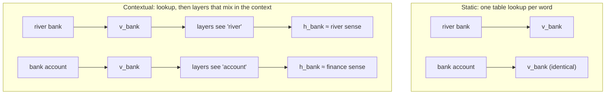

# 4.4 From Static to Contextual Embeddings

Word2Vec and fastText give each word exactly one vector. Once training ends, the vector for "bank" is fixed: the same numbers represent "bank" in "we sat on the river bank" and in "I opened a bank account." Embeddings of this kind are called **static**. They were a large step beyond one-hot vectors, but language does not work one-word-one-meaning. This section shows concretely what goes wrong when every occurrence of a word shares a single vector, and introduces the fix used by every modern language model: **contextual embeddings**, which give each occurrence of a word its own vector, computed from the words around it. We preview how a transformer computes them, leaving the details to Chapter 6.

## One vector per word is not enough

Many common words have several unrelated meanings. "bank" can be the side of a river or a financial institution; "bat" can be an animal or a piece of sports equipment; "spring" can be a season, a coil of metal, or a source of water. Linguists distinguish *homonyms*, whose meanings are unrelated, from *polysemous* words, whose senses are related ("paper" as a material, a newspaper, or an academic article), but for a static embedding the problem is the same: one vector has to serve all of them.

What does that one vector end up representing? Recall how skip-gram trains it (Section 4.2). Every occurrence of "bank" pulls its input vector toward the output vectors of its context words. Occurrences in the financial sense pull toward "money," "loan," and "account"; occurrences in the river sense pull toward "river," "water," and "muddy." The final vector is a compromise between these pulls, weighted by how often each sense occurs in the corpus. In a news corpus, where financial banks are far more common than river banks, the vector sits mostly on the financial side, and the river sense is poorly represented.

A toy example makes the compromise visible. Use 3-dimensional vectors whose axes loosely mean "finance," "water and nature," and "action," and give "bank" a vector partway between the two senses:

```python
import torch
import torch.nn.functional as F

static = {
    "bank":    torch.tensor([0.6, 0.5, 0.0]),   # a blend of both senses
    "river":   torch.tensor([0.0, 1.0, 0.1]),
    "muddy":   torch.tensor([0.0, 0.8, 0.0]),
    "account": torch.tensor([1.0, 0.0, 0.1]),
    "opened":  torch.tensor([0.3, 0.0, 0.9]),
    "the":     torch.tensor([0.1, 0.1, 0.1]),
}
cos = lambda a, b: F.cosine_similarity(a, b, dim=0).item()
print(f"static bank vs river: {cos(static['bank'], static['river']):.3f}, "
      f"vs account: {cos(static['bank'], static['account']):.3f}")
```

```text
static bank vs river: 0.637, vs account: 0.764
```

The static vector is moderately similar to both senses and strongly similar to neither. Any model that reads "bank" through this vector starts out not knowing which bank is meant, and must work it out from the other words using its later layers, if it can.

Ambiguous words are only the most visible symptom. Almost every word shifts its meaning with context. "Heavy" means different things in "a heavy box," "heavy rain," and "a heavy heart." "Run" in "run a company" and "run a marathon" shares a spelling and a loose idea but little else. A word's grammatical role also depends on context: "book" is a noun in "read the book" and a verb in "book a flight." And the meaning of a sentence depends on word order and structure that no bag of static word vectors captures: "dog bites man" and "man bites dog" contain the same three vectors.

## The idea: a vector for each occurrence

The fix is to stop treating the representation of a word as a property of the word alone. Instead, let the vector for the word at position $`t`$ in a sentence be a function of the *whole* sentence:

```math
\mathbf{h}_t = f_\theta(w_1, w_2, \dots, w_T)_t .
```

Here $`f_\theta`$ is a neural network with parameters $`\theta`$, and $`\mathbf{h}_t`$ is the **contextual embedding** of the $`t`$-th word. The same word in two different sentences now gets two different vectors, and ideally the two occurrences of "bank" in our examples end up near "river" and near "account," respectively.

Static embeddings do not disappear. The network $`f_\theta`$ starts by looking up a static vector for each input word in an embedding table, exactly as in Section 4.1, and then transforms those vectors, layer by layer, using information from the other positions. The static embedding is the *starting point* for each occurrence, and the context moves it to the right place. Figure 4.3 shows the difference.



*Figure 4.3: With static embeddings, every occurrence of "bank" gets the same vector. With contextual embeddings, each occurrence starts from the same table lookup, and later layers adjust the vector using the rest of the sentence.*

We have in fact already seen a network that produces contextual vectors: the recurrent network of Section 3.10. Its hidden state $`\mathbf{h}_t`$ depends on the current word and, through $`\mathbf{h}_{t-1}`$, on every word before it. But Section 3.10 also explained the limits of recurrence: computation proceeds one position at a time, and information from distant words has to survive many updates of a fixed-size state. What we want is a way for every position to look *directly* at every other position, in parallel.

## How transformers build contextual vectors

The **transformer** (Vaswani et al. 2017), the architecture of every modern LLM and the subject of Chapter 6, computes contextual embeddings with an operation called **attention**. The core idea fits in one equation. Starting from the vectors $`\mathbf{x}_1, \dots, \mathbf{x}_T`$ for the words in a sentence, compute a new vector for each position $`i`$ as a weighted average of the vectors at *all* positions:

```math
\mathbf{h}_i = \sum_{j=1}^{T} \alpha_{ij}\, \mathbf{x}_j, \qquad \alpha_{ij} = \frac{\exp(s_{ij})}{\sum_{j'=1}^{T} \exp(s_{ij'})} .
```

The weights $`\alpha_{ij}`$ are a softmax over **scores** $`s_{ij}`$ that measure how relevant position $`j`$ is to position $`i`$, so each row of weights is positive and sums to 1. If the score is based on content, then the vector for "bank" can draw heavily on "river" in one sentence and on "account" in another, and move toward the matching sense.

We can try this with the crudest possible score, a scaled dot product between the static vectors themselves, $`s_{ij} = 3\, \mathbf{x}_i^\top \mathbf{x}_j`$:

```python
def contextualize(sentence, scale=3.0):
    """Toy mixing step: each word's new vector is a weighted average of all the
    words in the sentence, weighted by a softmax of scaled dot products."""
    X = torch.stack([static[w] for w in sentence])     # (T, d)
    weights = F.softmax(scale * X @ X.T, dim=-1)       # (T, T), each row sums to 1
    return weights @ X                                 # (T, d)

s1 = ["the", "muddy", "river", "bank"]
s2 = ["opened", "the", "bank", "account"]
h1 = contextualize(s1)[s1.index("bank")]
h2 = contextualize(s2)[s2.index("bank")]
print(f"cos(bank in s1, bank in s2) = {cos(h1, h2):.3f}")
print(f"bank in s1 vs river:   {cos(h1, static['river']):.3f}")
print(f"bank in s2 vs account: {cos(h2, static['account']):.3f}")
```

```text
cos(bank in s1, bank in s2) = 0.610
bank in s1 vs river:   0.936
bank in s2 vs account: 0.950
```

One mixing step with no learned parameters is enough to separate the two occurrences. The two vectors for "bank," which were identical before mixing (cosine 1), now have a cosine of only 0.61, and each is much closer to its own sense (0.936 and 0.950) than the static vector was to either (0.637 and 0.764).

A real transformer layer is more capable than this toy in several ways, all covered in Chapter 6:

- **Learned scores.** Instead of comparing raw embeddings, each position projects its vector into a *query* and a *key* with learned matrices, and the score is the dot product of one position's query with another's key. The model learns what to look for, for example "find the noun this adjective modifies."
- **Learned values.** What gets averaged is not the raw vector but a learned projection of it, a *value*.
- **Several heads.** Each layer runs several attention operations in parallel, so different heads can track different relationships.
- **Many layers.** Transformers stack dozens of layers, each with attention followed by a position-wise MLP, and wrapped in the residual connections and normalization of Chapter 3. Each layer refines the vectors further, so a word's vector can come to reflect not only its neighbors but the meaning of the whole passage.
- **Positions.** Our toy treats the sentence as an unordered set: shuffling the words would give the same vectors. Real models add position information to the input, as Section 4.5 explains.

The output of the final layer is one contextual vector per input position. In an LLM, those vectors are then used to predict the next token (Section 4.5), but they are also useful on their own, as Section 4.6 shows.

## Which context? Both sides or only the left

There is one important design choice in how a transformer computes contextual embeddings: which positions each word may look at.

In an **encoder** model, such as BERT, every position attends to every other position, before and after it. The vector for "bank" in "the bank of the river was muddy" can use "river," which comes later. Encoders are trained with objectives that allow this, such as predicting words that have been hidden in the middle of a sentence, and they produce the best contextual vectors for tasks that read a whole text at once, like classification and search.

In a **decoder** model, such as the GPT-style LLMs of Chapter 7, each position may attend only to itself and earlier positions, because the model is trained to predict the next word and must not see it in advance. The vector for "bank" in "I walked to the bank to deposit a check" is computed before the model has read "deposit," so at that position the model has only "I walked to the" to go on. The ambiguity is resolved at *later* positions, whose vectors can take the whole prefix into account. Chapter 6 implements the mask that enforces this restriction.

## Getting contextual vectors in practice

Pretrained transformers make it easy to extract contextual embeddings. The following code uses the Hugging Face `transformers` library to get the vector for "bank" from BERT's last layer in two sentences:

```python
import torch
from transformers import AutoTokenizer, AutoModel

tok = AutoTokenizer.from_pretrained("bert-base-uncased")
model = AutoModel.from_pretrained("bert-base-uncased").eval()

def word_vector(sentence, word):
    enc = tok(sentence, return_tensors="pt")
    with torch.no_grad():
        hidden = model(**enc).last_hidden_state[0]           # (T, 768): one vector per token
    tokens = tok.convert_ids_to_tokens(enc["input_ids"][0])
    return hidden[tokens.index(word)]                        # first occurrence of the word

a = word_vector("we sat on the river bank", "bank")
b = word_vector("i opened a bank account", "bank")
c = word_vector("the bank approved my loan", "bank")
print(f"river vs finance:   {cos(a, b):.3f}")
print(f"finance vs finance: {cos(b, c):.3f}")
```

```text
river vs finance:   0.332
finance vs finance: 0.746
```

The two occurrences of the financial sense (`b` and `c`) come out much more similar to each other than the river sense (`a`) is to either of them, even though all three start from the same row of BERT's embedding table. (Exact values can differ slightly across library versions.)

Two practical details are worth knowing now. First, the model does not see words; it sees **tokens**, and a long or rare word may be split into several of them. "bank" happens to be a single token in this model's vocabulary, but to get one vector for a word that is split, a common approach is to average its tokens' vectors. Chapter 5 explains how text is split into tokens. Second, the model returns vectors from every layer, not just the last one (pass `output_hidden_states=True`), and different layers hold different information. Vectors from lower layers stay closer to the static embedding of the token, and vectors from higher layers are more shaped by context. Which layer works best depends on the task.

> **Code Lab 4.3** compares static and contextual embeddings for the same word in different sentences: it collects sentences for several ambiguous words, computes their static vectors and their contextual vectors from a pretrained transformer, and plots how the contextual vectors cluster by sense while the static vectors cannot.

## Are static embeddings obsolete?

For most language tasks, contextual embeddings from a pretrained transformer beat static ones, and inside LLMs they are the only kind that matters. Static embeddings still have a place. They are tiny and fast: looking up a vector costs nothing, while a contextual vector requires running a network over the whole sentence. They are easy to inspect, which makes them good for teaching and for studying how meaning is reflected in text statistics, as in Section 4.3. And the ideas behind them, prediction-based training, negative sampling, and subword pieces, live on in the models that replaced them. Most directly, the first layer of every LLM is still a static embedding table, as the next section shows.

## Key takeaways

- A static embedding gives every occurrence of a word the same vector, which blends all of the word's senses in proportion to their frequency and ignores word order.
- A contextual embedding $`\mathbf{h}_t = f_\theta(w_1, \dots, w_T)_t`$ gives each occurrence its own vector, computed from the whole sentence, starting from a static table lookup.
- Recurrent networks produce contextual vectors but process positions sequentially; transformers let every position gather information from every other position in parallel.
- Attention computes each new vector as a softmax-weighted average of the vectors at all positions, with weights based on content; even a parameter-free toy version separates the senses of "bank."
- Encoder models use context on both sides of a word; decoder models, including GPT-style LLMs, use only the left context.

## Further reading

Vaswani, Ashish, et al. "Attention Is All You Need." In *Advances in Neural Information Processing Systems 30*, 2017. https://arxiv.org/abs/1706.03762.
