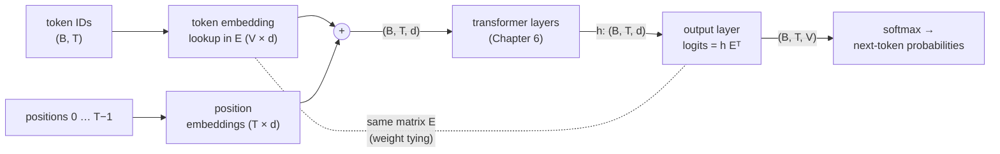

# 4.5 Embeddings Inside LLMs

Every LLM begins and ends with embeddings. The first thing it does with its input is look up one vector per token in an embedding table, and the last thing it does is compare its final hidden vector with a vector for every token in the vocabulary to decide what comes next. In between, the transformer layers of Chapter 6 turn the static lookups into the contextual vectors of Section 4.4. This section looks closely at the two ends. We examine the embedding layer as a lookup table and how it is trained along with the rest of the model, show that the output layer is a second table of token vectors that can share weights with the first, and explain why the model also needs vectors that encode each token's *position*.

## The embedding layer is a lookup table

The input to an LLM is a sequence of integer token IDs produced by the tokenizer (Chapter 5). The model's first layer is an **embedding matrix**

```math
E \in \mathbb{R}^{V \times d},
```

where $`V`$ is the vocabulary size and $`d`$ is the **model dimension**, the width of every vector that flows through the network. Row $`i`$ of $`E`$ is the embedding of token $`i`$. For an input sequence of token IDs $`x_1, \dots, x_T`$, the layer outputs the $`T`$ rows $`E_{x_1,:}, \dots, E_{x_T,:}`$, one $`d`$-dimensional vector per position. As Section 4.1 showed, this is exactly what a linear layer without bias would compute on one-hot inputs, but done as a lookup instead of a multiplication.

In PyTorch the layer is `nn.Embedding(num_embeddings, embedding_dim)`. It stores its table in `.weight`, and calling it on a tensor of integer IDs of any shape returns a tensor with one extra dimension of size $`d`$:

```python
import torch
import torch.nn as nn
import torch.nn.functional as F
torch.manual_seed(0)

V, d = 10, 4
emb = nn.Embedding(V, d)
print(emb.weight.shape)

ids = torch.tensor([[3, 7, 3, 1]])            # a batch of one sequence of 4 token IDs
x = emb(ids)
print(x.shape)

one_hot = F.one_hot(ids, num_classes=V).float()   # (1, 4, V)
print(torch.allclose(one_hot @ emb.weight, x))    # lookup == one-hot times matrix
```

```text
torch.Size([10, 4])
torch.Size([1, 4, 4])
True
```

A batch of shape `(B, T)` becomes a tensor of shape `(B, T, d)`, which is the shape every transformer layer consumes and produces. Notice that token 3 appears twice in the sequence and receives the same vector both times: the embedding layer by itself is static. Only the layers that follow make the vectors contextual.

### How big is the table?

The table has $`V \times d`$ parameters. Some representative sizes:

| Vocabulary size $`V`$ | Model dimension $`d`$ | Embedding parameters $`V \times d`$ |
|---|---|---|
| 50,257 | 768 | 38.6 million |
| 32,000 | 4,096 | 131 million |
| 128,000 | 8,192 | 1.05 billion |

The first row is the configuration of the smallest GPT-2 model, a model with about 124 million parameters in total, so its embedding table accounts for roughly 30 percent of the whole model. In larger models the table is a much smaller fraction: the transformer layers grow roughly with $`d^2`$ per layer times the number of layers (Chapter 6), while the table grows only with $`V \times d`$. For a 7-billion-parameter model with the second row's configuration, the table is under 2 percent of the parameters. Vocabulary size is therefore a real design choice for small models and a minor cost for large ones; Chapter 5 discusses how it trades off against sequence length.

The lookup is also cheap in compute. Fetching $`T`$ rows involves no multiplications at all, so the embedding layer contributes almost nothing to a forward pass. That is not true of the output layer, as we will see.

## Learned end to end

Where do the rows of $`E`$ come from? In early neural NLP systems, it was common to train word vectors separately with Word2Vec and then plug them into a larger model. LLMs do not do this. Their embedding table starts as random numbers, typically drawn from a normal distribution with a small standard deviation (0.02 is a common choice), and is trained **end to end**, by the same next-token cross-entropy loss (Section 2.4) and the same optimizer as every other parameter in the model.

Gradients reach the table through backpropagation like any other layer, with one special property: only the rows that were actually looked up receive a gradient.

```python
x.sum().backward()                            # any loss that depends on x
print(emb.weight.grad.abs().sum(dim=1))       # gradient magnitude for each row
```

```text
tensor([0., 4., 0., 8., 0., 0., 0., 4., 0., 0.])
```

Rows 1, 3, and 7, the tokens in the batch, have gradients. Row 3 has twice as much because token 3 appeared twice, and its gradients from the two positions add up (Section 2.6). Every other row has exactly zero gradient. The backward pass of a lookup is a *scatter-add*: each position's gradient is added into the row it came from.

This has practical consequences:

- **Frequent tokens train fast, rare tokens train slowly.** A token that appears in almost every batch gets a gradient at almost every step. A token that appears once in a billion gets almost none. If a token is in the vocabulary but nearly absent from the training data, its embedding can stay close to its random initialization, and the model may behave strangely when it appears. Chapter 5 returns to these under-trained "glitch tokens."
- **The model learns its own notion of similarity.** The geometry that Section 4.3 found in Word2Vec vectors also appears in trained LLM embedding tables: tokens used in similar ways end up nearby. But the table is optimized for whatever helps the rest of the network predict the next token, not for any separate similarity objective, and the most useful information about a token's meaning in context lives in the later layers, not in the table.
- **There is no "pretraining" of the table before the model.** Since the table is learned jointly with the transformer, the vectors and the layers that read them adapt to each other.

One further detail from the original Transformer: its embedding outputs are multiplied by $`\sqrt{d}`$ before entering the first layer (Vaswani et al. 2017). The paper does not dwell on the reason; a common explanation is that it keeps the token embeddings from being swamped by the position encodings that are added to them (discussed below). Not every model does this; it is one of several conventions for balancing the magnitudes of the vectors at the input.

## The output layer is another embedding table

At the other end of the network, the final transformer layer produces a hidden vector $`\mathbf{h}_t \in \mathbb{R}^d`$ for each position $`t`$. To predict the next token, the model needs a logit for every token in the vocabulary. The **output layer** (often called the *language-model head* or *unembedding*) is a linear map with weight matrix $`W_{\text{out}} \in \mathbb{R}^{V \times d}`$:

```math
\mathbf{z}_t = W_{\text{out}}\, \mathbf{h}_t, \qquad z_{t,i} = \mathbf{w}_i^\top \mathbf{h}_t, \qquad p(x_{t+1} = i \mid x_{\le t}) = \operatorname{softmax}(\mathbf{z}_t)_i .
```

Look at the middle equation. The logit for token $`i`$ is the dot product of the hidden vector with row $`i`$ of $`W_{\text{out}}`$. So $`W_{\text{out}}`$ is also a table of token vectors, one per vocabulary entry, and the model predicts the token whose vector best aligns with its current hidden state. This is exactly the structure of the skip-gram model in Section 4.2, with its input vectors $`\mathbf{v}_w`$ and output vectors $`\mathbf{u}_w`$. An LLM has an input embedding table $`E`$ and an output embedding table $`W_{\text{out}}`$, with a deep transformer in between instead of nothing.

Unlike the input lookup, the output layer is expensive. Every position requires a full matrix-vector product with $`V \times d`$ multiply-adds, and the softmax touches every entry, so *every* row of $`W_{\text{out}}`$ receives a gradient at every step (via $`\mathbf{p} - \mathbf{y}`$, Section 2.4). For large vocabularies, this layer is one of the more costly single operations in the model, and its memory footprint for the logits, $`B \times T \times V`$ numbers, is among the largest in the model.

## Weight tying

If $`E`$ and $`W_{\text{out}}`$ are both $`V \times d`$ tables of token vectors, why not use the *same* table for both? This is **weight tying** (Press and Wolf 2017): set $`W_{\text{out}} = E`$, so that

```math
z_{t,i} = E_{i,:}\, \mathbf{h}_t .
```

The model reads token $`i`$ by looking up row $`i`$ of $`E`$, and predicts token $`i`$ by comparing its hidden state with the same row. Figure 4.4 shows the whole pipeline.



*Figure 4.4: The two ends of an LLM. Token IDs are looked up in the embedding matrix $`E`$, position embeddings are added, and the transformer layers produce one hidden vector per position. With weight tying, the output layer multiplies those vectors by the transpose of the same matrix $`E`$ to get a logit for every token.*

Tying has three attractions:

- **Fewer parameters.** It removes a whole $`V \times d`$ matrix: 38.6 million parameters for the GPT-2-small configuration above.
- **Better training signal for the table.** Without tying, a rare token's input row gets a gradient only when the token appears in the input. With tying, the shared row also receives a gradient at every position through the output softmax, pushed down whenever the token is not the right answer and up when it is.
- **A sensible inductive bias.** Tokens that are interchangeable as outputs, because they fit the same contexts, should probably have similar representations as inputs, and vice versa. Press and Wolf found that tying improved language models of the time while reducing their size.

In PyTorch, tying is a single assignment that makes two modules share one `Parameter` object:

```python
class TinyLM(nn.Module):
    def __init__(self, V, d, max_len, tie=True):
        super().__init__()
        self.tok = nn.Embedding(V, d)                 # token embeddings, V x d
        self.pos = nn.Embedding(max_len, d)           # learned position embeddings
        self.body = nn.Sequential(nn.Linear(d, 4 * d), nn.GELU(), nn.Linear(4 * d, d))
        self.lm_head = nn.Linear(d, V, bias=False)    # output layer, weight is V x d
        if tie:
            self.lm_head.weight = self.tok.weight     # one shared Parameter

    def forward(self, ids):                           # ids: (B, T)
        T = ids.shape[1]
        positions = torch.arange(T, device=ids.device)
        h = self.tok(ids) + self.pos(positions)       # (B, T, d) + (T, d) broadcasts
        h = h + self.body(h)                          # stand-in for the transformer layers
        return self.lm_head(h)                        # (B, T, V) logits

for tie in (False, True):
    m = TinyLM(V=50_257, d=768, max_len=1024, tie=tie)
    n = sum(p.numel() for p in m.parameters())      # a shared Parameter is counted once
    print(f"tie={tie}: {n:,} parameters")
```

```text
tie=False: 82,703,616 parameters
tie=True: 44,106,240 parameters
```

The difference is exactly $`50{,}257 \times 768 = 38{,}597{,}376`$. The `body` here is a one-block MLP standing in for the transformer layers; Chapter 6 replaces it with the real thing. Conveniently, `nn.Linear` stores its weight with shape `(out_features, in_features)`, which is `(V, d)`, the same shape as the embedding table, so no transpose is needed.

Tying is not universal. The input and output roles are not identical: the input table must tell the network what a token *is*, while the output table must score how well a token fits as the *next* one. With a small model, the parameter savings matter and tying usually helps; with a very large model, the table is a small fraction of the parameters and some model families keep separate input and output matrices. GPT-2 and the original Transformer tie their weights; for any particular model, check its configuration (in Hugging Face models, the `tie_word_embeddings` setting).

## Adding position information

There is one more thing the model needs at its input. Section 4.4 noted that attention computes a weighted average over positions with content-based weights. Nothing in that computation depends on *where* the positions are. If we shuffle the input tokens, each token's attention output is the same as before, just in a shuffled order. Without extra information, a transformer cannot tell "dog bites man" from "man bites dog." (Chapter 6 states this property precisely: self-attention without positional information is permutation-equivariant.)

The standard fix is to give each position its own vector and **add** it to the token embedding before the first layer:

```math
\mathbf{x}_t = E_{x_t,:} + P_{t,:}, \qquad P \in \mathbb{R}^{T_{\max} \times d} .
```

Now the same token at two different positions enters the network as two different vectors, and attention can use the difference. There are two classic ways to obtain $`P`$:

- **Learned absolute position embeddings.** Treat positions like tokens: a second `nn.Embedding(max_len, d)` table, indexed by position $`0, 1, \dots, T_{\max} - 1`$ and trained end to end. This is what the `TinyLM` above does, and what GPT-2 and BERT do. Its limitation is the fixed maximum length: there is simply no row for a position beyond $`T_{\max}`$.
- **Fixed sinusoidal encodings** (Vaswani et al. 2017). Each position gets a vector of sines and cosines at geometrically spaced frequencies, computed by a formula rather than learned. Section 6 of Chapter 6 derives the formula and its properties.

Why *add* the position vector rather than concatenate it? Concatenation would increase the width of every vector. Addition keeps the width at $`d`$, and in a space with hundreds or thousands of dimensions, the network can learn to keep token information and position information in largely separate directions, so the sum loses little.

Many recent LLMs move position information out of the input altogether and inject it inside attention, so that attention scores depend on the *relative* distance between two positions rather than their absolute positions. Rotary position embeddings, which rotate query and key vectors by position-dependent angles, are the most widely used example. Chapter 6 covers these methods. For this chapter, the takeaway is that token embeddings say *what* each token is, and some additional mechanism must say *where* it is.

> **Code Lab 4.4** builds an `nn.Embedding` layer and inspects its weights: it checks that lookup equals one-hot multiplication, watches which rows receive gradients, ties the table to an output layer and verifies that the two share storage and that the parameter count drops by $`V \times d`$, and adds learned position embeddings.

## Key takeaways

- An LLM's first layer is an embedding table $`E \in \mathbb{R}^{V \times d}`$; `nn.Embedding` turns token IDs of shape `(B, T)` into vectors of shape `(B, T, d)` by lookup.
- The table has $`V \times d`$ parameters, a large fraction of a small model and a small fraction of a large one, and costs almost nothing to compute.
- The table is initialized randomly and trained end to end by the next-token loss. Only the rows of tokens in the batch receive gradients, so rarely seen tokens can remain under-trained.
- The output layer is a second $`V \times d`$ table: each logit is the dot product of the final hidden vector with a token's output vector, the same structure as skip-gram's input and output vectors.
- Weight tying uses $`E`$ for both input and output, saving $`V \times d`$ parameters and giving every row a gradient at every step; it is common in smaller models, while some large models untie.
- Attention ignores order, so position information must be added: learned absolute position embeddings or fixed sinusoids at the input, or relative schemes such as rotary embeddings inside attention (Chapter 6).

## Further reading

Press, Ofir, and Lior Wolf. "Using the Output Embedding to Improve Language Models." In *Proceedings of the 15th Conference of the European Chapter of the Association for Computational Linguistics*, 2017. https://arxiv.org/abs/1608.05859.

Vaswani, Ashish, et al. "Attention Is All You Need." In *Advances in Neural Information Processing Systems 30*, 2017. https://arxiv.org/abs/1706.03762.
