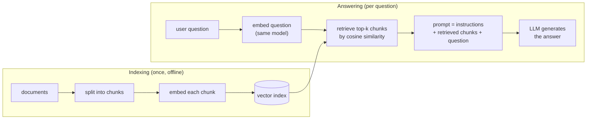

# 4.6 Sentence Embeddings and Applications

So far every embedding in this chapter has represented a single word or token. Many practical problems, though, are about whole pieces of text. Which help-center article answers this customer's question? Which of these million support tickets are about the same problem? Which passages from a company's documents should an LLM read before answering? Each of these calls for a single vector per sentence, paragraph, or document, arranged so that texts with similar meanings are close together. This section shows how to get such **sentence embeddings**, first by pooling word or token vectors and then by training a model specifically for the purpose, and uses them for three applications: semantic search, clustering, and retrieval-augmented generation (RAG). It ends with a summary of the chapter and exercises.

## From word vectors to sentence vectors

We want a function that maps a text of any length to a fixed-size vector $`\mathbf{s} \in \mathbb{R}^d`$, such that the cosine similarity of two texts' vectors reflects how similar their meanings are. There are three increasingly effective ways to build one.

### Averaging static word vectors

The simplest approach averages the static embeddings (Section 4.2) of the words in the text:

```math
\mathbf{s} = \frac{1}{T} \sum_{t=1}^{T} \mathbf{v}_{w_t} .
```

This is fast, needs no extra training, and works surprisingly well as a baseline for grouping texts by topic: a text about cooking averages many cooking-related vectors and lands in the cooking region of the space. Its weaknesses are the ones Section 4.4 identified for static embeddings, made worse by averaging. Word order disappears completely, so "the dog chased the cat" and "the cat chased the dog" get identical vectors. Each word keeps only its one blended sense. And very frequent words such as "the" and "of" contribute as much as the informative ones; a common improvement is a weighted average that gives rare words more weight.

### Pooling contextual token vectors

A pretrained transformer gives us something better to average: the contextual vectors $`\mathbf{h}_1, \dots, \mathbf{h}_T`$ from its last layer (Section 4.4), which already reflect word order and context. The most common pooling methods are:

- **Mean pooling**: average the contextual vectors of all real tokens.
- **A special token**: encoder models such as BERT prepend a special classification token to every input, and its final vector can serve as a summary of the whole text.
- **Last token**: in a decoder model, only the final position has seen the entire text (Section 4.4), so its vector is the natural summary.

Mean pooling needs one piece of care. Sentences in a batch have different lengths, so shorter ones are padded with filler tokens to a common length, and the padding positions must not be counted in the average. The tokenizer supplies an **attention mask** with 1 for real tokens and 0 for padding (Chapter 5):

```python
import torch
import torch.nn.functional as F

def mean_pool(token_vecs, mask):
    """token_vecs: (B, T, d) contextual vectors; mask: (B, T), 1 for real tokens, 0 for padding."""
    m = mask.unsqueeze(-1).float()                    # (B, T, 1)
    summed = (token_vecs * m).sum(dim=1)              # padding contributes nothing
    counts = m.sum(dim=1).clamp(min=1e-9)             # number of real tokens per sentence
    return summed / counts                            # (B, d)

token_vecs = torch.tensor([[[1., 0.], [3., 2.], [0., 0.]],     # 2 real tokens + 1 pad
                           [[2., 2.], [0., 4.], [4., 0.]]])    # 3 real tokens
mask = torch.tensor([[1, 1, 0],
                     [1, 1, 1]])
print(mean_pool(token_vecs, mask))
```

```text
tensor([[2., 1.],
        [2., 2.]])
```

The first sentence's vector is the average of its two real tokens only; a plain `token_vecs.mean(dim=1)` would have divided by 3 and given `[1.33, 0.67]`.

There is a catch. A transformer pretrained to predict words was never asked to make whole-sentence vectors comparable by cosine similarity. Reimers and Gurevych (2019) found that sentence vectors pooled from an off-the-shelf BERT model performed poorly on semantic similarity benchmarks, in some settings worse than simply averaging static word vectors. The pretrained representations contain the needed information, but not in a geometry where cosine similarity reads it out.

### Training for similarity

The fix is to train the encoder directly for the property we want. **Sentence-BERT** (Reimers and Gurevych 2019) runs two texts through the *same* transformer encoder (a *siamese* setup, since the two branches share all their weights), mean-pools each into a vector, and fine-tunes the encoder so that the two vectors are close when the texts have similar meanings and far apart when they do not. Because both texts are encoded independently by the same network, the result is a single function from text to vector: every document can be embedded once, and any two vectors can be compared with a cheap cosine.

Most sentence embedding models today are trained with a **contrastive** objective that should look familiar from Section 4.2. Training data consists of pairs of texts that belong together: a question and its answer, a search query and the page that was clicked, a title and its article, two paraphrases. For a batch of $`B`$ pairs $`(q_i, p_i)`$, embed all of them, and treat each query's own partner as the positive and the other $`B - 1`$ partners in the batch as negatives. The loss is a softmax cross-entropy over cosine similarities:

```math
\ell_i = -\log \frac{\exp\!\left(\cos(\mathbf{q}_i, \mathbf{p}_i) / \tau\right)}{\sum_{j=1}^{B} \exp\!\left(\cos(\mathbf{q}_i, \mathbf{p}_j) / \tau\right)} ,
```

where $`\tau`$ is a small **temperature** (such as 0.05) that sharpens the softmax, since cosines lie only between $`-1`$ and $`1`$. This is a $`B`$-way classification: for each query, pick out its true partner among the passages in the batch. It is the same idea as negative sampling, "score real pairs above fake ones," but with the other examples in the batch serving as the negatives for free, and with a softmax instead of independent sigmoids. In code it is only a few lines:

```python
def in_batch_contrastive_loss(q, p, temperature=0.05):
    """q, p: (B, d) embeddings of B matching (query, passage) pairs.
    Row i of q should match row i of p; the other B - 1 passages act as negatives."""
    q, p = F.normalize(q, dim=-1), F.normalize(p, dim=-1)
    scores = q @ p.T / temperature                    # (B, B) scaled cosine similarities
    labels = torch.arange(q.shape[0])                 # the correct passage is on the diagonal
    return F.cross_entropy(scores, labels)
```

Larger batches provide more negatives and generally train better embeddings. Adding **hard negatives**, passages that look relevant but are not (for instance, retrieved by keyword overlap), forces the model to learn finer distinctions than random negatives do.

### Longer texts and document embeddings

Transformer encoders have a maximum input length, and a single vector can only hold so much. For long documents, the standard practice is to split the document into **chunks** of a few hundred tokens, often with some overlap so that no sentence is cut off from its context, and embed each chunk separately. A search then returns chunks, and the document containing the best chunk can be shown to the user. Averaging all chunk vectors into one document vector is possible, and works for coarse topic grouping, but it blurs together the different things a long document says.

## Semantic search

With a sentence embedding model, search by meaning takes a few lines. Embed every document once and store the vectors. At query time, embed the query with the same model and return the documents with the highest cosine similarity. The `sentence-transformers` library wraps the tokenizer, encoder, and pooling into one call; the small model below produces 384-dimensional vectors:

```python
from sentence_transformers import SentenceTransformer

model = SentenceTransformer("sentence-transformers/all-MiniLM-L6-v2")

docs = [
    "The cat sat on the windowsill, watching birds.",
    "Our quarterly revenue grew by twelve percent.",
    "How to reset a forgotten email password.",
    "Kittens need to be fed several times a day.",
    "The central bank raised interest rates again.",
    "Steps for recovering access to your account.",
]
doc_emb = model.encode(docs, normalize_embeddings=True)       # (6, 384), unit length

def search(query, k=2):
    q = model.encode(query, normalize_embeddings=True)        # (384,)
    scores = doc_emb @ q                                      # cosine similarities
    top = scores.argsort()[::-1][:k]
    return [(float(scores[i]), docs[i]) for i in top]

for query in ["I can't log in to my mailbox", "caring for a young cat", "monetary policy news"]:
    print(query)
    for score, doc in search(query):
        print(f"   {score:.3f}  {doc}")
```

```text
I can't log in to my mailbox
   0.537  How to reset a forgotten email password.
   0.443  Steps for recovering access to your account.
caring for a young cat
   0.437  Kittens need to be fed several times a day.
   0.430  The cat sat on the windowsill, watching birds.
monetary policy news
   0.509  The central bank raised interest rates again.
   0.192  Our quarterly revenue grew by twelve percent.
```

Look at what matched. "I can't log in to my mailbox" shares no content words with "How to reset a forgotten email password," yet it is the top result. "Monetary policy news" finds the sentence about interest rates, and the revenue sentence, related to money but not to monetary policy, comes a distant second. Keyword search would have found none of these. Because we normalized the vectors, the dot product is the cosine similarity (Section 4.3), and scoring the whole collection is a single matrix-vector product.

Two practical points apply to every embedding-based search system:

- **Queries and documents must be embedded by the same model.** Vectors from different models live in unrelated spaces, and their cosine similarities are meaningless. If you change the embedding model, you must re-embed the whole collection.
- **Absolute scores depend on the model.** A cosine of 0.5 may be a strong match for one model and a weak one for another. Compare scores within a model, and calibrate any threshold for "relevant enough" on examples.

### Searching millions of vectors

Exact search compares the query with every stored vector, at a cost of $`N \times d`$ multiply-adds for $`N`$ documents. On a modern CPU or GPU that is fast for thousands or even millions of vectors, but it becomes too slow for billions of vectors or thousands of queries per second. **Approximate nearest neighbor (ANN)** indexes trade a small loss in accuracy for large speedups. Two families are widely used: *clustering-based* indexes partition the vectors into groups and search only the few groups nearest to the query, and *graph-based* indexes connect each vector to its near neighbors and search by walking the graph toward the query. Libraries such as FAISS implement both, and **vector databases** wrap them with storage, filtering by metadata, and updates. Many production systems also combine embedding search with traditional keyword search, because embeddings can miss exact matches that matter, such as product codes, names, and rare technical terms.

## Clustering and other uses

Once texts are vectors, the standard tools of machine learning apply directly.

**Clustering** groups texts by meaning without any labels. Run k-means on the normalized embeddings from the search example:

```python
from sklearn.cluster import KMeans

labels = KMeans(n_clusters=3, n_init=10, random_state=0).fit_predict(doc_emb)
for c in range(3):
    print(f"cluster {c}:", [d for d, l in zip(docs, labels) if l == c])
```

```text
cluster 0: ['The cat sat on the windowsill, watching birds.', 'Kittens need to be fed several times a day.']
cluster 1: ['How to reset a forgotten email password.', 'Steps for recovering access to your account.']
cluster 2: ['Our quarterly revenue grew by twelve percent.', 'The central bank raised interest rates again.']
```

The three topics, cats, account access, and finance, fall out without supervision. (The cluster numbers themselves are arbitrary.) The same approach organizes support tickets by issue, groups news articles into stories, or reveals what topics a large dataset contains. A closely related use is **near-duplicate detection**: pairs of texts with very high cosine similarity are likely paraphrases or copies, which is useful when cleaning the enormous text collections used to pretrain LLMs.

**Classification** with few labels is another. Training a small classifier, even logistic regression (Section 2.1), on top of frozen sentence embeddings often works well with only a few hundred labeled examples, because the embedding model has already done the hard work of representing meaning.

## Retrieval-augmented generation

An LLM knows only what was in its training data, frozen at the time training ended, and it stores that knowledge imperfectly in its weights. It cannot answer questions about a company's internal documents it never saw, about events after its training data was collected, or about the fine print of a specific contract. When it lacks the information, it may produce a fluent answer that is simply wrong. **Retrieval-augmented generation (RAG)** addresses this by combining the semantic search above with an LLM: before answering, retrieve relevant passages and put them in the model's input, so it can base its answer on them. Figure 4.5 shows the pipeline.



*Figure 4.5: Retrieval-augmented generation. Documents are chunked, embedded, and indexed once. For each question, the question is embedded with the same model, the most similar chunks are retrieved, and they are placed in the prompt together with the question for the LLM to answer from.*

The generation step is ordinary text generation with a longer prompt. A minimal version of the prompt assembly looks like this:

```python
def build_prompt(question, chunks):
    context = "\n\n".join(f"[{i + 1}] {c}" for i, c in enumerate(chunks))
    return (
        "Answer the question using only the numbered passages below. "
        "Cite the passages you use, and say so if they do not contain the answer.\n\n"
        f"{context}\n\nQuestion: {question}\nAnswer:"
    )

chunks = [doc for _, doc in search("I can't log in to my mailbox", k=2)]
prompt = build_prompt("I can't log in to my mailbox. What should I do?", chunks)
# prompt is then sent to an LLM (Chapters 7, 8, and 13)
```

RAG has several attractive properties. The knowledge lives in the document collection rather than in the model's weights, so updating it means re-indexing documents, not retraining the model. It can use private data that was never in any training set. And because the model is shown its sources, it can cite them, which lets users check the answer.

RAG is only as good as its retrieval, and most RAG failures trace back to this chapter's material:

- **The right chunk was never retrieved.** If the embedding model does not place the question near the passage that answers it, the LLM never sees the answer. Domain-specific vocabulary, such as legal, medical, or internal jargon, is a common cause, and hybrid keyword-plus-embedding search helps.
- **Chunking split the answer.** A chunk boundary can separate a statement from the context that qualifies it. Chunk size and overlap are tuning knobs.
- **Relevant is not the same as similar.** Embedding similarity measures relatedness of use (Section 4.3). A passage stating the opposite of the answer, or answering a closely related but different question, can score highly.
- **The model may ignore or misuse the context.** Retrieval reduces unsupported answers but does not eliminate them; the LLM can still misread a passage or fall back on what it learned in training. Chapter 12 discusses how to evaluate systems like this.

> **Code Lab 4.5** builds a tiny semantic search with a sentence embedding model: it embeds a small document collection, answers queries by cosine similarity, compares the results with keyword matching, clusters the collection, and closes by assembling a retrieval-augmented prompt.

## Chapter summary

This chapter followed a single idea from its simplest form to its place inside modern LLMs: **represent discrete symbols as dense, learned vectors whose geometry reflects how the symbols are used.**

- **Why embeddings (4.1).** One-hot vectors are $`V`$-dimensional, sparse, and make every pair of words equally unrelated. Multiplying a one-hot vector by a weight matrix selects a row, so the first layer of a network is really a lookup table of dense vectors. The distributional hypothesis, that words in similar contexts have similar meanings, turns raw text into a training signal for those vectors.
- **Word2Vec (4.2).** Skip-gram predicts context words from a center word, and CBOW predicts the center word from its context; both are two-layer networks trained with cross-entropy. Negative sampling replaces the $`V`$-way softmax with $`k + 1`$ binary classifications, making training fast. fastText builds word vectors from character n-grams, which handles rare and unseen words and anticipates subword tokenization.
- **Geometry (4.3).** Cosine similarity compares directions; nearest neighbors are words used in similar contexts, including antonyms. Some relations appear as consistent vector offsets, but analogies are fragile and depend on excluding the input words. Embeddings absorb social biases from their training text, which can be measured but not simply removed.
- **Contextual embeddings (4.4).** A static vector blends all senses of a word. Contextual models compute a separate vector for each occurrence from the whole sentence; transformers do this with attention, a content-weighted average over positions.
- **Embeddings inside LLMs (4.5).** An LLM's first layer is a $`V \times d`$ embedding table trained end to end with the rest of the model; its output layer is a second table of token vectors, often tied to the first. Position embeddings or relative position schemes supply the word order that attention ignores.
- **Sentence embeddings (4.6).** Pooling contextual token vectors and training with a contrastive objective gives one vector per text. Such vectors power semantic search, clustering, and retrieval-augmented generation.

Two threads lead forward. Chapter 5 decides what the rows of the embedding table stand for, by splitting text into subword tokens. Chapter 6 builds the transformer layers that turn a sequence of looked-up token vectors into contextual vectors, with the attention mechanism previewed here.

## Exercises

1. **One-hot versus lookup.** For a vocabulary of $`V = 50{,}000`$ and $`d = 512`$, how many multiply-adds does computing $`\mathbf{e}_i^\top W`$ as a dense matrix-vector product take, and how many does a table lookup take? For a batch of 32 sequences of 1,024 tokens, how much memory would the one-hot input tensor occupy in 32-bit floats? Then verify in PyTorch that `F.one_hot(ids, V).float() @ emb.weight` equals `emb(ids)` for a random `ids` tensor.

2. **Deriving negative sampling.** Starting from $`\ell_{\text{NEG}}`$ in Section 4.2, derive $`\partial \ell / \partial \mathbf{v}_c`$ using $`\sigma'(z) = \sigma(z)(1 - \sigma(z))`$. Show that when all output vectors are zero, the loss equals $`(k + 1) \ln 2`$. Then explain in words why a negative sample that the model already scores as clearly fake contributes almost nothing to the gradient.

3. **The 3/4 power.** For a toy vocabulary with counts $`(10{,}000, 1{,}000, 100, 10, 1)`$, compute the noise distribution $`P_n`$ for exponents $`\alpha = 0, 0.5, 0.75, 1`$. Plot each word's share against $`\alpha`$, and describe what goes wrong at the two extremes $`\alpha = 0`$ (uniform) and $`\alpha = 1`$ (unigram). If you have completed Lab 4.1, retrain with $`\alpha = 0`$ and $`\alpha = 1`$ and compare the nearest neighbors of a few words.

4. **Analogies with and without filtering.** Using the pretrained vectors from Lab 4.2, evaluate 20 analogies of your choice from at least three relation types (for example gender, country-capital, and verb tense). For each, report whether the correct answer is top-1 when the three input words are excluded and when they are not. Which relation types work best, and how often is the unfiltered top answer one of the inputs?

5. **Weight tying and gradients.** Build the `TinyLM` of Section 4.5 with a vocabulary of 1,000 tokens, with and without tying. Run one forward and backward pass on a batch that contains only token IDs 0 through 9. In each case, count how many rows of the token embedding table receive a nonzero gradient, and explain the difference.

6. **Semantic search evaluation.** Write 10 queries for the collection you built in Lab 4.5, and for each mark by hand which documents are relevant. Compute recall@3 (the fraction of queries for which at least one relevant document appears in the top 3) for embedding search, for keyword overlap, and for a simple combination of the two scores. Find one query where each method beats the other and explain why.

## Further reading

Bojanowski, Piotr, Edouard Grave, Armand Joulin, and Tomas Mikolov. "Enriching Word Vectors with Subword Information." *Transactions of the Association for Computational Linguistics* 5 (2017): 135–146. https://arxiv.org/abs/1607.04606.

Mikolov, Tomas, Ilya Sutskever, Kai Chen, Greg Corrado, and Jeffrey Dean. "Distributed Representations of Words and Phrases and Their Compositionality." In *Advances in Neural Information Processing Systems 26*, 2013. https://arxiv.org/abs/1310.4546.

Press, Ofir, and Lior Wolf. "Using the Output Embedding to Improve Language Models." In *Proceedings of the 15th Conference of the European Chapter of the Association for Computational Linguistics*, 2017. https://arxiv.org/abs/1608.05859.

Reimers, Nils, and Iryna Gurevych. "Sentence-BERT: Sentence Embeddings Using Siamese BERT-Networks." In *Proceedings of the 2019 Conference on Empirical Methods in Natural Language Processing and the 9th International Joint Conference on Natural Language Processing*, 2019. https://arxiv.org/abs/1908.10084.

Vaswani, Ashish, et al. "Attention Is All You Need." In *Advances in Neural Information Processing Systems 30*, 2017. https://arxiv.org/abs/1706.03762.
