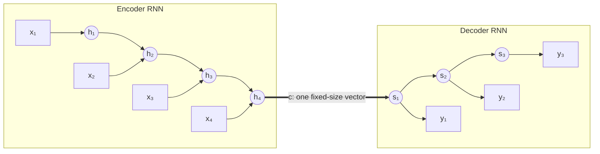
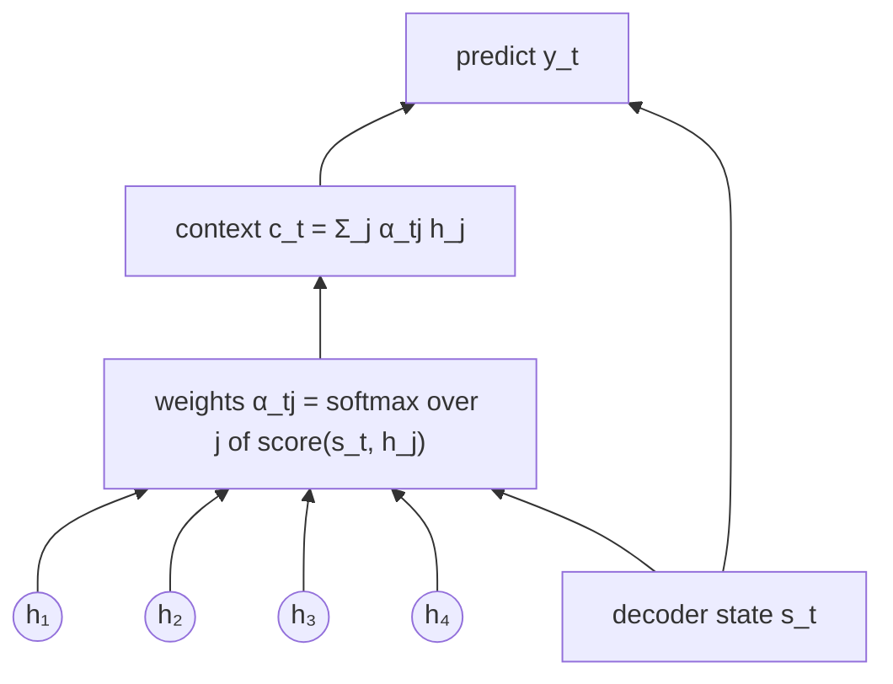
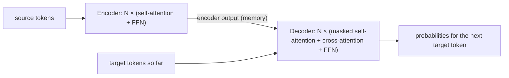

# 6.1 From Recurrence to Attention

Many useful language tasks map one sequence to another: translate a German sentence into English, summarize a document, convert "March 7, 2019" into "2019-03-07." Chapter 3 ended with the limits of recurrent networks. This section shows how those limits played out in **sequence-to-sequence** learning, how **attention** was added to recurrent models to work around them, and how the **Transformer** (Vaswani et al. 2017) removed recurrence altogether.

## The recurrent encoder-decoder

A sequence-to-sequence model reads a **source** $`x_1, \dots, x_m`$ and produces a **target** $`y_1, \dots, y_n`$, whose lengths can differ. Sutskever et al. (2014) and Cho et al. (2014) proposed the **encoder-decoder** design. An encoder RNN reads the source one token at a time, and its final hidden state $`\mathbf{c} = \mathbf{h}_m`$ serves as a summary of the whole source. A decoder RNN starts from $`\mathbf{c}`$ and generates the target one token at a time, each step taking the previous token as input. The model is trained to maximize

```math
p_\theta(y_1, \dots, y_n \mid \mathbf{x}) = \prod_{t=1}^{n} p_\theta(y_t \mid y_{\lt t}, \mathbf{x}),
```

with the cross-entropy loss of Chapter 2 summed over target positions. The Transformer keeps exactly this factorization; what changes is how each factor is computed.



*Figure 6.1.1. The recurrent encoder-decoder. The whole source must pass through the single vector* $`\mathbf{c}`$ *(the thick arrow).*

The design has two weaknesses, both inherited from recurrence. First, everything the decoder will need about the source must fit in one fixed-size vector, whether the sentence has 5 tokens or 50; Bahdanau et al. (2015) found that the translation quality of a basic encoder-decoder dropped sharply as sentences got longer. Second, computation is sequential: the state at step $`t`$ depends on the state at step $`t-1`$, so a sequence of length $`m`$ takes $`m`$ dependent steps no matter how much parallel hardware is available. Gated units such as LSTMs help gradients survive long sequences but remove neither problem.

## Attention in recurrent models

Bahdanau et al. (2015) removed the first weakness. Instead of compressing the source into one vector, keep **all** encoder states $`\mathbf{h}_1, \dots, \mathbf{h}_m`$ and let the decoder consult them at every step. At step $`t`$, a small learned function scores how relevant each $`\mathbf{h}_j`$ is to the decoder's state, a softmax turns the scores into weights $`\alpha_{tj}`$, and the weighted average $`\mathbf{c}_t = \sum_j \alpha_{tj} \mathbf{h}_j`$ becomes a **context vector** for that step. Each output token thus gets its own view of the source. In translation, the weights often line up with the word alignment between the two languages, learned from sentence pairs alone. Luong et al. (2015) showed that simpler scores work too, including the plain dot product $`\mathbf{s}_t^\top \mathbf{h}_j`$, the form the Transformer builds on.



*Figure 6.1.2. Attention in a recurrent translation model: at every decoder step, a softmax over relevance scores selects a mixture of all encoder states.*

Attention fixed the bottleneck, but the encoder and decoder were still RNNs, so computation within a sequence was still sequential.

## Attention without recurrence

Vaswani et al. (2017) asked whether the recurrence was needed at all. In the Transformer, each encoder position builds its new representation by attending to all source positions (**self-attention**), so the whole sentence is processed at once. Each decoder position attends to the earlier target positions (**masked self-attention**) and to all encoder outputs (**cross-attention**, the direct descendant of Bahdanau attention). A small feed-forward network transforms each position between attention layers, and residual connections and layer normalization (Chapter 3) let many such blocks be stacked. The paper's title, "Attention Is All You Need," states the claim, and the model outperformed the best previous systems on the English-German and English-French translation benchmarks it studied, at a fraction of their training cost.



*Figure 6.1.3. The Transformer at a glance.*

Removing recurrence brings two gains. Any position can reach any other in a single step, so the path between two tokens has constant length instead of growing with their distance. And all positions in a layer can be computed in parallel as a few large matrix multiplications, the operation GPUs execute fastest; even the decoder processes every target position at once during training. The price is also twofold. Attention compares every pair of positions, so its cost grows quadratically with sequence length. And attention by itself has no notion of order: without extra information, "dog bites man" and "man bites dog" look the same. Generating an output still proceeds one token at a time.

All of this operates on vectors, yet the model's input is a sequence of token IDs and its output must be a choice of the next token. How do tokens become vectors on the way in, and how do vectors become probabilities over the vocabulary on the way out?

## Key takeaways

- Recurrent encoder-decoder models squeeze the whole source into one vector and process sequences step by step, which limits both quality and speed.
- Attention lets the decoder compute a fresh weighted average of all encoder states at every step, learning alignments between source and target.
- The Transformer removes recurrence: self-attention in the encoder, masked self-attention and cross-attention in the decoder, feed-forward layers in between.
- It gains constant path length between positions and parallel computation across positions in training.
- It pays with attention costs quadratic in sequence length and needs explicit positional information; generation remains sequential.

## Further reading

Bahdanau, Dzmitry, Kyunghyun Cho, and Yoshua Bengio. "Neural Machine Translation by Jointly Learning to Align and Translate." In *International Conference on Learning Representations*, 2015. https://arxiv.org/abs/1409.0473.

Cho, Kyunghyun, et al. "Learning Phrase Representations Using RNN Encoder–Decoder for Statistical Machine Translation." In *Proceedings of the 2014 Conference on Empirical Methods in Natural Language Processing*, 2014. https://arxiv.org/abs/1406.1078.

Luong, Minh-Thang, Hieu Pham, and Christopher D. Manning. "Effective Approaches to Attention-Based Neural Machine Translation." In *Proceedings of the 2015 Conference on Empirical Methods in Natural Language Processing*, 2015. https://arxiv.org/abs/1508.04025.

Sutskever, Ilya, Oriol Vinyals, and Quoc V. Le. "Sequence to Sequence Learning with Neural Networks." In *Advances in Neural Information Processing Systems 27*, 2014. https://arxiv.org/abs/1409.3215.

Vaswani, Ashish, et al. "Attention Is All You Need." In *Advances in Neural Information Processing Systems 30*, 2017. https://arxiv.org/abs/1706.03762.
