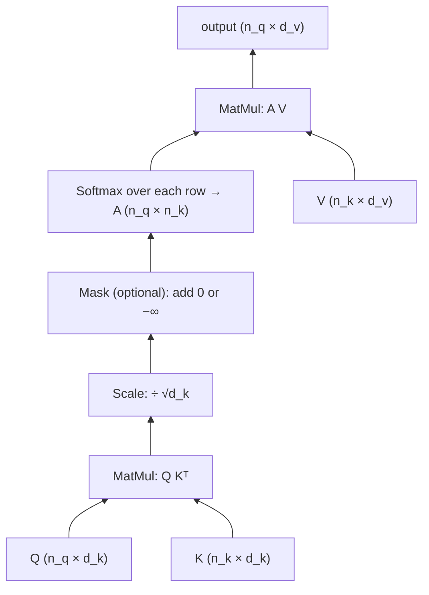
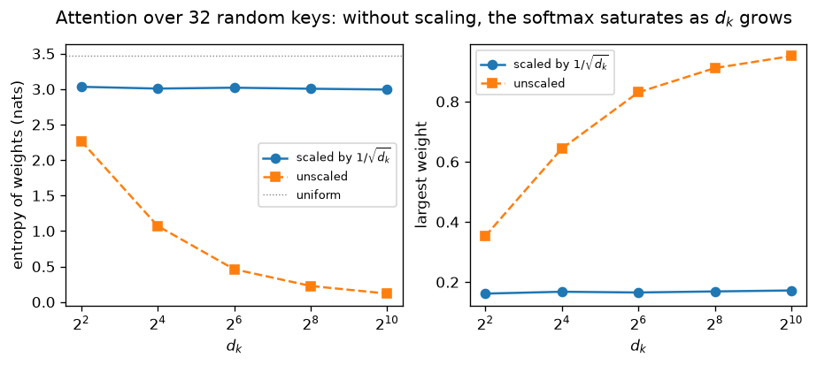
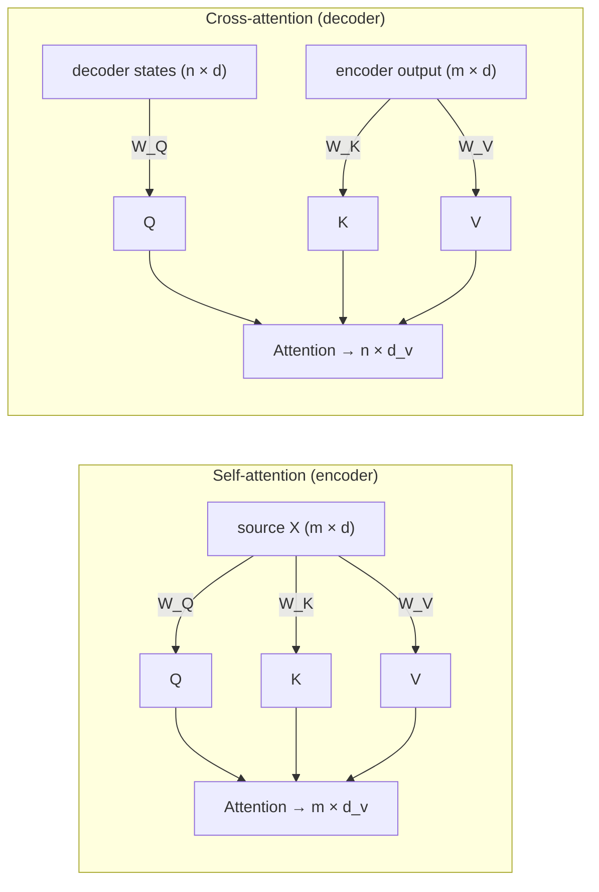

# 6.3 Scaled Dot-Product Attention

Attention is the operation the whole Transformer is built around. This section defines it precisely: queries, keys, and values; the formula for scaled dot-product attention; why the scores are divided by $`\sqrt{d_k}`$; the shapes of every tensor involved; and the two ways the Transformer uses it, **self-attention** and **cross-attention**. It ends with a from-scratch implementation checked against PyTorch.

## Queries, keys, and values

Attention answers a question for each position of a sequence: *which other positions should I gather information from, and how much from each?* It splits that question into three roles, each given by a learned linear projection:

- A **query** $`\mathbf{q}`$ describes what a position is looking for.
- A **key** $`\mathbf{k}`$ describes what a position offers, for the purpose of being found.
- A **value** $`\mathbf{v}`$ is the content a position hands over when it is selected.

Queries come from one sequence, whose representations are the rows of a matrix $`X \in \mathbb{R}^{n_q \times d}`$. Keys and values come from a sequence $`Z \in \mathbb{R}^{n_k \times d}`$, which may be the same sequence or a different one:

```math
Q = X W_Q, \qquad K = Z W_K, \qquad V = Z W_V,
```

with $`W_Q, W_K \in \mathbb{R}^{d \times d_k}`$ and $`W_V \in \mathbb{R}^{d \times d_v}`$. Each row of $`Q`$ is one position's query; each row of $`K`$ and $`V`$ is one position's key and value.

A useful analogy is a soft dictionary lookup. A Python dictionary compares a query with every key, finds the exact match, and returns its value. Attention compares a query with every key by a similarity score, turns the scores into weights that sum to 1, and returns a **weighted average of all values**. Because the lookup is soft, it is differentiable, so the projections $`W_Q, W_K, W_V`$ can be learned by gradient descent.

## The formula

Scaled dot-product attention (Vaswani et al. 2017) is

```math
\mathrm{Attention}(Q, K, V) = \mathrm{softmax}\!\left(\frac{QK^\top}{\sqrt{d_k}}\right) V,
```

where the softmax is applied to each row separately. Step by step:

1. **Scores.** $`S = QK^\top \in \mathbb{R}^{n_q \times n_k}`$. Entry $`S_{ts} = \mathbf{q}_t^\top \mathbf{k}_s`$ is the dot product of query $`t`$ with key $`s`$: large when they point in similar directions.
2. **Scale.** Divide by $`\sqrt{d_k}`$ (explained below).
3. **Mask** (optional). Add $`-\infty`$ to scores that must be ignored (Section 6.4).
4. **Softmax** over each row: $`A_{ts} = \exp(S_{ts}/\sqrt{d_k}) / \sum_{s'} \exp(S_{ts'}/\sqrt{d_k})`$. Row $`t`$ of $`A`$ is a probability distribution over key positions.
5. **Weighted sum.** The output for query $`t`$ is $`\sum_s A_{ts} \mathbf{v}_s`$, row $`t`$ of $`AV`$.



*Figure 6.3.1. Scaled dot-product attention, following the diagram in Vaswani et al. (2017).*

## Why divide by $`\sqrt{d_k}`$

Suppose the entries of a query $`\mathbf{q}`$ and a key $`\mathbf{k}`$ are independent random variables with mean 0 and variance 1. Their dot product $`\mathbf{q}^\top\mathbf{k} = \sum_{i=1}^{d_k} q_i k_i`$ is a sum of $`d_k`$ independent terms, each with mean 0 and variance $`\mathrm{Var}(q_i k_i) = \mathbb{E}[q_i^2]\,\mathbb{E}[k_i^2] = 1`$. So

```math
\mathbb{E}[\mathbf{q}^\top \mathbf{k}] = 0, \qquad \mathrm{Var}(\mathbf{q}^\top \mathbf{k}) = d_k.
```

The scores' standard deviation grows like $`\sqrt{d_k}`$. With $`d_k = 64`$, typical scores are around $`\pm 8`$; with $`d_k = 1{,}024`$, around $`\pm 32`$. Softmax is sensitive to the *differences* between scores: a gap of 10 between the top two scores already makes the top weight about $`e^{10} \approx 22{,}000`$ times larger than the next. Large scores therefore push the softmax toward a one-hot distribution. In that **saturated** regime, its gradient is nearly zero (Chapter 3 discussed the same problem for sigmoid and tanh units): small changes to the scores barely change the weights, so the query and key projections learn slowly.

Dividing by $`\sqrt{d_k}`$ restores unit variance to the scores regardless of $`d_k`$. Vaswani et al. gave exactly this argument and noted that, without scaling, dot-product attention performed worse than an additive scoring function for large $`d_k`$, which they attributed to softmax saturation. Luong et al. (2015) had earlier compared several scoring functions for attention in recurrent translation models, including the plain dot product, a bilinear form and an additive (concatenation-based) form.

The effect is easy to measure. The figure below draws random unit-variance queries and keys, computes attention over 32 keys, and records the entropy of the weights and the size of the largest weight. With scaling, both stay constant as $`d_k`$ grows (the entropy stays near 3.0 nats, a little below the uniform distribution's $`\ln 32 \approx 3.47`$). Without scaling, the entropy falls to about 0.12 nats at $`d_k = 1{,}024`$ and the largest weight averages about 0.95: attention has collapsed onto a single key.



*Figure 6.3.2. Attention over 32 random keys, averaged over 200 random queries (generated by [`code/06-transformer-basic-architecture/make_figures.py`](../../code/06-transformer-basic-architecture/make_figures.py)).*

## Shapes

Writing out shapes is the best defense against bugs. For a single sequence without batching:

| Tensor | Shape | Notes |
|---|---|---|
| $`X`$ (query source) | $`n_q \times d`$ | |
| $`Z`$ (key/value source) | $`n_k \times d`$ | $`Z = X`$ for self-attention |
| $`Q`$ | $`n_q \times d_k`$ | |
| $`K`$ | $`n_k \times d_k`$ | |
| $`V`$ | $`n_k \times d_v`$ | |
| $`S = QK^\top`$, $`A = \mathrm{softmax}(S / \sqrt{d_k})`$ | $`n_q \times n_k`$ | one row per query, one column per key |
| Output $`AV`$ | $`n_q \times d_v`$ | one output per query |

Two properties follow directly from the table. First, the **output has one row per query**, regardless of how many keys there are: attention changes *what* each query position contains, not how many positions there are. Second, the **attention matrix is** $`n_q \times n_k`$, which is where attention's quadratic cost comes from.

In the Transformer, attention appears in three places, with three shapes of attention matrix:

| Where | Queries from | Keys and values from | Attention matrix |
|---|---|---|---|
| Encoder self-attention | source ($`m`$ positions) | source | $`m \times m`$ |
| Decoder self-attention | target ($`n`$ positions) | target | $`n \times n`$ |
| Decoder cross-attention | target | encoder output ($`m`$ positions) | $`n \times m`$ |

## Attention as a weighted average

Because each row of $`A`$ is a probability distribution, each output row is a **convex combination** of the value vectors: all weights are non-negative and sum to 1. Attention cannot create values larger than the largest value it mixes; it can only select and blend. The richness comes from the projections (which decide what gets compared and what gets passed along), from stacking many layers, and from the feed-forward networks between them (Section 7.1).

A second property matters for Section 6. If the rows of $`X`$ are permuted in self-attention, the rows of $`Q`$, $`K`$, and $`V`$ are permuted the same way, the attention matrix is permuted along both axes, and the output rows come out permuted in the same order. Formally, for any permutation matrix $`P`$,

```math
\mathrm{SelfAttention}(PX) = P \, \mathrm{SelfAttention}(X).
```

Self-attention is **permutation-equivariant**: it has no idea which token came first. Positional encodings (Section 6.6) supply that information.

## Self-attention vs. cross-attention

**Self-attention** sets $`Z = X`$: every position of a sequence attends to positions of the same sequence. In the encoder, this lets each source token build a representation informed by the whole sentence: the vector for "bank" can pull in information from "river" or from "money." In the decoder, masked self-attention lets each target position look at the target tokens before it.

**Cross-attention** takes queries from one sequence and keys and values from another. In the Transformer's decoder, the queries come from the target positions and the keys and values come from the encoder's output. Each target position asks, in effect, "which source tokens are relevant to what I am producing now?" This is the Transformer's version of the attention that Bahdanau et al. (2015) added to recurrent translation models (Section 6.1).



*Figure 6.3.3. Self-attention draws queries, keys, and values from one sequence; cross-attention draws queries from the decoder and keys and values from the encoder.*

The same function computes both. Only the inputs differ.

## Implementation

Attention takes only a few lines of code: two matrix multiplications, a scaling, an optional mask and a softmax. Written to accept batches and arbitrary numbers of queries and keys, one function serves for self- and cross-attention alike (Phuong and Hutter 2022 give precise pseudocode for this and the other algorithms of this chapter). The appendix implements it from scratch and confirms three properties: every row of attention weights sums to 1; the output matches PyTorch's built-in `F.scaled_dot_product_attention`; and permuting the inputs of self-attention permutes its outputs in exactly the same way, the permutation equivariance described above.

In a real layer, the query, key and value inputs would first be multiplied by the learned $`W_Q, W_K, W_V`$; Section 6.5 adds those projections along with multiple heads. `F.scaled_dot_product_attention` computes the same result with fused, memory-efficient kernels, and is what production code should call; a from-scratch version is for understanding and testing.

## Key takeaways

- Attention projects inputs into queries, keys, and values; each query scores every key, a softmax turns scores into weights, and the output is a weighted average of values.
- Dot products of random $`d_k`$-dimensional vectors have variance $`d_k`$; dividing by $`\sqrt{d_k}`$ keeps the softmax out of saturation, where its gradients vanish.
- The attention matrix is $`n_q \times n_k`$ and the output has one row per query; the Transformer uses $`m \times m`$, $`n \times n`$, and $`n \times m`$ attention matrices.
- Each output is a convex combination of values, and self-attention is permutation-equivariant, so it needs positional information.
- Self-attention takes queries, keys, and values from one sequence; cross-attention takes queries from the decoder and keys and values from the encoder output.

## Appendix: Code

The snippets below reproduce the checks and results described in this section. They need only PyTorch and run on a CPU; snippets in the same appendix are meant to be run in order in one Python session.

### Attention from scratch, with three checks

Notebook: [6.3-attention-from-scratch-with-three-checks.ipynb](../../code/06-transformer-basic-architecture/6.3-attention-from-scratch-with-three-checks.ipynb)

## Further reading

Bahdanau, Dzmitry, Kyunghyun Cho, and Yoshua Bengio. "Neural Machine Translation by Jointly Learning to Align and Translate." In *International Conference on Learning Representations*, 2015. https://arxiv.org/abs/1409.0473.

Luong, Minh-Thang, Hieu Pham, and Christopher D. Manning. "Effective Approaches to Attention-Based Neural Machine Translation." In *Proceedings of the 2015 Conference on Empirical Methods in Natural Language Processing*, 2015. https://arxiv.org/abs/1508.04025.

Phuong, Mary, and Marcus Hutter. "Formal Algorithms for Transformers." arXiv preprint arXiv:2207.09238, 2022. https://arxiv.org/abs/2207.09238.

Vaswani, Ashish, et al. "Attention Is All You Need." In *Advances in Neural Information Processing Systems 30*, 2017. https://arxiv.org/abs/1706.03762.
