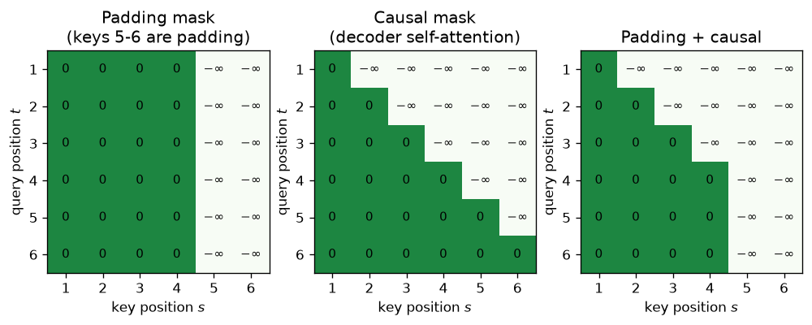
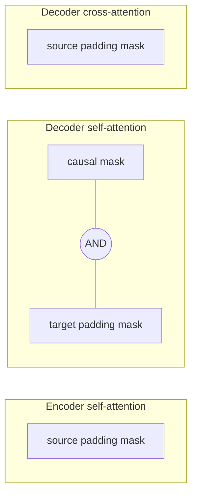

# 6.4 Masking

Attention, as defined in Section 6.3, lets every query look at every key. Two situations require forbidding some of those connections. **Padding** tokens, added so that sequences of different lengths fit in one batch, carry no information and must be ignored. And the decoder, when it is trained to predict target token $`t`$, must not be allowed to see target tokens $`t, t+1, \dots`$, or it could simply copy the answer. **Masks** implement both restrictions. This section shows how a mask works, where each kind of mask appears in the Transformer, how to combine them, a common pitfall, and how to test that a mask really prevents information from leaking.

## How a mask works

A mask is a matrix $`M`$ of the same shape as the attention scores, $`n_q \times n_k`$, whose entries are 0 where attention is allowed and $`-\infty`$ where it is forbidden. It is added to the scaled scores before the softmax:

```math
\mathrm{MaskedAttention}(Q, K, V) = \mathrm{softmax}\!\left(\frac{QK^\top}{\sqrt{d_k}} + M\right) V, \qquad M_{ts} \in \{0, -\infty\}.
```

Since $`\exp(-\infty) = 0`$, every forbidden entry gets weight exactly 0, and the remaining weights in each row are renormalized among the allowed keys. A forbidden key contributes nothing to the output, and, just as important, no gradient flows through it.

Masking the scores is different from zeroing the weights *after* the softmax. Zeroing afterward would leave rows that no longer sum to 1, and the probability mass that the softmax assigned to forbidden keys would be lost rather than redistributed. Adding $`-\infty`$ before the softmax is both correct and cheap. It is also how the original paper describes its decoder mask: illegal connections are masked out by setting the corresponding softmax inputs to $`-\infty`$ (Vaswani et al. 2017). Phuong and Hutter (2022) write attention in pseudocode with the mask as an explicit argument, which is a useful reference when implementing it.

In code, masks are usually stored as boolean tensors (True meaning "allowed," or in some APIs "forbidden"; check the convention) and applied with `masked_fill`. Implementations often use a large negative number such as $`-10^9`$ instead of $`-\infty`$; either works as long as the number overwhelms any real score, and the true $`-\infty`$ has a pitfall discussed below.

## Padding masks

To process several sequences in one tensor, shorter sequences are extended with `<pad>` tokens up to the length of the longest (Chapter 5). A batch of two source sentences of lengths 4 and 6 becomes a `(2, 6)` tensor, where the first row ends in two padding tokens.

Padding positions must never be *attended to*: their key and value vectors are meaningless, and letting real tokens mix them in would make a sentence's representation depend on how much padding its batch happened to need. So a padding mask forbids **keys** at padding positions, for every query:

```math
M^{\text{pad}}_{ts} = \begin{cases} 0 & \text{if key position } s \text{ is a real token} \\ -\infty & \text{if key position } s \text{ is padding} \end{cases}
```

Every row of the mask is identical: the mask depends only on the key position. It is stored compactly as a `(B, n_k)` boolean vector per sequence (a *key padding mask*) and broadcast over the query dimension.

What about padding positions as *queries*? Their outputs are computed but meaningless. They do no harm, because no real token attends to them (their keys are masked) and their outputs are excluded from the loss (Section 7.3) by ignoring padding labels. So padding needs to be masked only on the key side.

In the Transformer, padding masks appear in all three attention layers:

| Attention layer | Keys come from | Padding mask on |
|---|---|---|
| Encoder self-attention | source | source padding |
| Decoder self-attention | target | target padding (combined with the causal mask) |
| Decoder cross-attention | encoder output | **source** padding |

The cross-attention entry is easy to forget. The decoder's queries are target positions, but its keys and values are the encoder's outputs, one per *source* position, so the mask must hide the source's padding positions.

## The causal mask

During training, the decoder receives the whole target sequence, shifted right (Section 6.2), and is asked to predict the next token at every position at once. Without a restriction, decoder self-attention at position $`t`$ could attend to position $`t+1`$, whose input *is* the token it is supposed to predict. The model would learn to copy, reach near-zero training loss, and fail completely at inference, when future tokens do not exist yet.

The **causal mask** (also called the *look-ahead* or *subsequent* mask) forbids each target position from attending to any later target position:

```math
M^{\text{causal}}_{ts} = \begin{cases} 0 & s \le t \\ -\infty & s \gt t \end{cases}
```

It is lower triangular: position 1 sees only itself, position 2 sees positions 1 and 2, and so on. With it, the output at position $`t`$ depends only on decoder inputs $`1, \dots, t`$, which are `<bos>` and $`y_1, \dots, y_{t-1}`$. That is exactly the information available when generating token $`y_t`$ at inference time.

The causal mask is what lets the decoder be **trained in parallel**: a single forward pass computes predictions for all $`n`$ target positions, each correctly conditioned only on its prefix. An RNN decoder gets this property from its sequential structure; the Transformer gets it from the mask.

Neither the encoder nor cross-attention uses a causal mask. The whole source sentence is available before decoding begins, so every source token may attend to every other, in both directions, and every decoder position may attend to the whole source.

## Combining masks

Decoder self-attention needs both the causal mask and the target padding mask. Masks combine by allowing a connection only if every mask allows it: with boolean "allowed" masks, take the logical AND; with additive masks, add them (any $`-\infty`$ wins).



*Figure 6.4.1. Masks as matrices, for a sequence of 6 positions whose last two are padding. Rows are queries, columns are keys; green entries (0) are allowed and white entries (* $`-\infty`$ *) are forbidden. Left: a padding mask forbids the padding columns for every query. Middle: the causal mask forbids everything above the diagonal. Right: their combination, used in decoder self-attention.*



*Figure 6.4.2. Which masks each attention layer uses.*

## A pitfall: rows with nothing to attend to

If every key in a row is masked, the row's scores are all $`-\infty`$, and the softmax computes $`0/0`$, producing NaN. The NaN then spreads through every later layer and into the loss. This can happen, for example, if a sequence in the batch is entirely padding, or if a mask convention is accidentally inverted.

Common defenses are to use a large finite negative number instead of $`-\infty`$ (the row then becomes a uniform distribution, which is harmless for a position whose output is ignored), to make sure no sequence is empty, or to rely on library implementations that handle fully masked rows. Whatever the choice, a NaN appearing in the first forward pass is a strong hint to check the masks.

## Testing masks for leaks

A wrong mask fails silently: the model still trains, and a decoder that can see the future may even look unusually good. The only reliable way to know a mask is right is to *test* that no information leaks: change an input that a position should not be able to see, and check that the outputs it must not affect stay exactly the same. Two tests cover the Transformer's masks:

- **Causal mask.** Change the target tokens after position $`t`$. The decoder self-attention outputs at positions up to $`t`$ must not change.
- **Padding mask.** Keep the mask computed from the original source and overwrite only the tokens at padding positions, simulating "whatever is at a padding position must not matter." No cross-attention output may change.

With masks built as boolean "allowed" tensors and applied before the softmax, both tests pass; running them with the masks removed makes them fail, which confirms the tests are sensitive (code in the appendix). The code labs extend these tests to full encoder and decoder blocks, where leaks can also enter through layers other than attention.

In PyTorch's `nn.Transformer` and `nn.MultiheadAttention`, the conventions are the reverse of the "True means allowed" convention used in this section's code: a boolean `attn_mask` or `key_padding_mask` marks positions that are **not** allowed (True means "mask out"), and `nn.Transformer.generate_square_subsequent_mask(n)` returns a float causal mask with $`-\infty`$ above the diagonal. Getting a convention backward is one of the most common Transformer bugs, and the leak tests above catch it.

## Key takeaways

- A mask adds $`-\infty`$ to forbidden attention scores before the softmax, so forbidden keys get exactly zero weight and the rest are renormalized.
- Padding masks hide padding keys in all three attention layers; in cross-attention the mask comes from the **source** padding.
- The causal mask makes decoder position $`t`$ depend only on target inputs up to $`t`$, which allows all target positions to be trained in parallel without seeing the answer.
- The encoder and cross-attention need no causal mask, because the whole source is known in advance.
- Rows with every key masked produce NaN; and mask conventions differ between libraries, so test for leaks directly.

## Appendix: Code

The snippets below reproduce the checks and results described in this section. They need only PyTorch and run on a CPU; snippets in the same appendix are meant to be run in order in one Python session.

### Building masks and testing them for leaks

Notebook: [6.4-building-masks-and-testing-them-for-leaks.ipynb](../../code/06-transformer-basic-architecture/6.4-building-masks-and-testing-them-for-leaks.ipynb)

## Further reading

Phuong, Mary, and Marcus Hutter. "Formal Algorithms for Transformers." arXiv preprint arXiv:2207.09238, 2022. https://arxiv.org/abs/2207.09238.

Vaswani, Ashish, et al. "Attention Is All You Need." In *Advances in Neural Information Processing Systems 30*, 2017. https://arxiv.org/abs/1706.03762.
