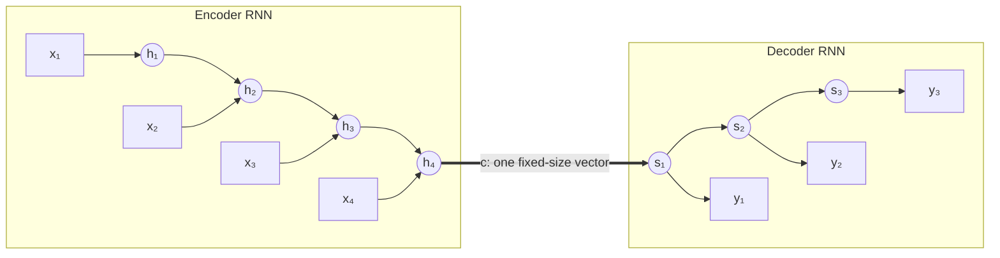
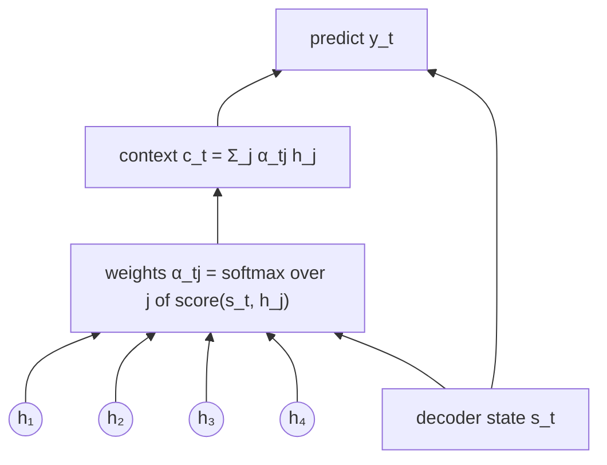
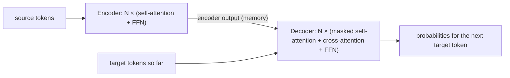

# 6.1 From Recurrence to Attention

Many of the most useful language tasks map one sequence to another: translate a German sentence into English, summarize a document, convert a date written as "March 7, 2019" into "2019-03-07." Chapter 3 introduced recurrent networks, which process sequences one element at a time, and ended with their limits. This section follows how those limits played out in **sequence-to-sequence** learning, how **attention** was first added to recurrent translation models to work around them, and how the **Transformer** (Vaswani et al. 2017) took the final step of removing recurrence entirely. By the end you will know what problem each piece of this chapter solves and how the pieces fit together.

## Sequence-to-sequence learning with recurrent networks

A sequence-to-sequence (seq2seq) model reads a **source** sequence $`x_1, \dots, x_m`$ and produces a **target** sequence $`y_1, \dots, y_n`$, where $`m`$ and $`n`$ can differ and vary from example to example. Sutskever et al. (2014) and Cho et al. (2014) proposed the **encoder-decoder** design that became standard:

- An **encoder** RNN reads the source one token at a time and updates its hidden state. Its final hidden state $`\mathbf{c} = \mathbf{h}_m`$ is a single vector meant to summarize the whole source.
- A **decoder** RNN is initialized from $`\mathbf{c}`$ and generates the target one token at a time. At each step it takes the previously generated token as input, updates its state, and outputs a distribution over the next token.

The model is trained to maximize the probability of the reference target given the source,

```math
p_\theta(y_1, \dots, y_n \mid \mathbf{x}) = \prod_{t=1}^{n} p_\theta(y_t \mid y_{\lt t}, \mathbf{x}),
```

with the cross-entropy loss of Chapter 2 summed over target positions. The same factorization, one target token at a time conditioned on the source and the previous target tokens, is exactly what the Transformer's decoder computes later in this chapter.



*Figure 6.1.1. The recurrent encoder-decoder. The whole source must pass through the single vector* $`\mathbf{c}`$ *(the thick arrow) before the decoder produces anything.*

## The bottleneck

This design has two problems, both inherited from recurrence.

**A fixed-size summary.** Every fact about the source that the decoder will need, including which word came first, which noun an adjective modifies, and how a long clause ends, must be packed into one vector $`\mathbf{c}`$ of fixed dimension, whether the source has 5 tokens or 50. Bahdanau et al. (2015) measured this directly: the translation quality of a basic encoder-decoder dropped sharply as source sentences got longer, while their attention-based model, described next, held up much better. A decoder producing the last word of a long translation depends on information that entered the encoder dozens of steps earlier and survived every update since.

**Sequential computation.** Section 10 of Chapter 3 explained that an RNN's state at step $`t`$ depends on its state at step $`t-1`$. Processing a sequence of length $`m`$ takes $`m`$ dependent steps in both the forward and backward passes, no matter how much parallel hardware is available, and each step is a relatively small matrix-vector product. Training on large datasets is slow. Gated units (LSTMs) help gradients survive long sequences but do not remove either problem.

## Attention in recurrent translation models

Bahdanau et al. (2015) removed the first problem. Instead of compressing the source into one vector, keep **all** of the encoder's hidden states $`\mathbf{h}_1, \dots, \mathbf{h}_m`$, and let the decoder look back at them at every step. At decoder step $`t`$:

1. Score how relevant each encoder state $`\mathbf{h}_j`$ is to the decoder's current state $`\mathbf{s}_{t-1}`$ with a small learned function, giving scores $`e_{tj}`$.
2. Turn the scores into weights with a softmax: $`\alpha_{tj} = \exp(e_{tj}) / \sum_{k} \exp(e_{tk})`$.
3. Form a **context vector** as the weighted average of encoder states, $`\mathbf{c}_t = \sum_j \alpha_{tj} \mathbf{h}_j`$, and feed it to the decoder along with the previous token.

Each output step now gets its own context vector, focused on the source positions that matter for that step. When translating a sentence, the weights $`\alpha_{tj}`$ often line up with the word alignment between the two languages, and the model learns this alignment from translation pairs alone, without alignment labels. Luong et al. (2015) compared simpler scoring functions, including the plain dot product $`e_{tj} = \mathbf{s}_t^\top \mathbf{h}_j`$, which is the form the Transformer builds on.



*Figure 6.1.2. Attention in a recurrent translation model: at every decoder step, a softmax over relevance scores selects a mixture of all encoder states.*

Attention fixed the bottleneck: the decoder no longer depends on a single summary vector. But the encoder and decoder were still RNNs, so computation was still sequential within each sequence.

## The Transformer: attention is all you need

Vaswani et al. (2017) asked what happens if recurrence is removed entirely. In the **Transformer**, both the encoder and the decoder are built from attention plus simple position-wise layers:

- In the encoder, every source position computes its new representation by attending to **all source positions** (*self-attention*). There is no left-to-right state; the whole sentence is processed at once.
- In the decoder, every target position attends to the **earlier target positions** (*masked self-attention*) and to **all encoder outputs** (*cross-attention*, the direct descendant of Bahdanau attention).
- Between attention layers, a small feed-forward network transforms each position independently.
- Residual connections and layer normalization (Chapter 3) wrap every sublayer, and stacks of identical blocks give the model depth.

The paper's title, "Attention Is All You Need," states the claim: no recurrence and no convolution are needed to get state-of-the-art translation quality. The Transformer outperformed the best previous translation models on the English-German and English-French benchmarks the paper studied, at a fraction of their training cost.

## What is gained

**Every position reaches every other in one step.** In an RNN, information from token 1 reaches token 50 through 49 sequential updates. In a self-attention layer, token 50 attends to token 1 directly. The maximum path length between any two positions is constant, which makes long-range relationships easier to learn.

**All positions are computed in parallel.** Within a layer, the outputs for all positions are independent given the layer's input, so a whole sequence becomes a few large matrix multiplications, exactly the operation that GPUs execute fastest. During training, even the decoder processes all target positions at once (Section 9 explains how masking makes this legal).

**Content-based routing.** Which positions exchange information is decided by the data, through learned queries and keys, rather than fixed by the architecture. The same layer can link an adjective to its noun in one sentence and a pronoun to its antecedent in another.

## What it costs

**Quadratic cost in sequence length.** If every position attends to every other, a sequence of length $`n`$ has $`n^2`$ pairs. Attention's compute and memory grow quadratically with length, while an RNN's grow linearly. For sentence-length inputs this is cheap; for long documents it dominates. Section 11 does the accounting.

**No built-in notion of order.** Attention computes weighted averages over a set of positions; nothing in it knows which position came first. Without extra information, "dog bites man" and "man bites dog" look the same to the encoder. Section 6 fixes this with positional encodings.

**Generation is still sequential.** At inference time, the decoder must still produce the target one token at a time, because each token depends on the previous ones. Parallelism helps training most; Section 10 covers decoding.

## A map of the chapter

The rest of the chapter builds the Transformer piece by piece, roughly in the order that data flows through it, and then turns to how the finished model is trained, used, sized and extended.

It starts at the edges of the model. [Inputs and outputs](02-inputs-and-outputs.md) (Section 2) explains how token IDs become vectors on the way in and how vectors become next-token probabilities on the way out, so that everything in between can be described as operations on sequences of vectors. With that settled, [Scaled dot-product attention](03-scaled-dot-product-attention.md) (Section 3) introduces the operation at the heart of the model: each position asks a question, compares it with every other position, and takes a weighted average of what it finds. The same operation serves as self-attention, where a sequence looks at itself, and as cross-attention, where the decoder looks at the encoder's output.

Attention as first defined lets every position see every other one, which is not always allowed. [Masking](04-masking.md) (Section 4) shows how to hide padding tokens and, in the decoder, the target tokens that have not been generated yet. A single attention operation can also follow only one pattern of relationships at a time, so [Multi-head attention](05-multi-head-attention.md) (Section 5) runs several smaller attention operations side by side and combines them. One gap remains: attention has no notion of word order, since shuffling the input simply shuffles the output. [Positional encodings](06-positional-encodings.md) (Section 6) fill that gap by adding information about each token's position to its embedding.

With these parts in hand, the chapter assembles the model. [The encoder block](07-the-encoder-block.md) (Section 7) combines self-attention with a small feed-forward network, wrapping each in a residual connection and layer normalization, and stacks several such blocks to read the source sentence. [The decoder block and the full encoder-decoder model](08-the-decoder-block-and-the-full-encoder-decoder-model.md) (Section 8) adds the two ingredients the decoder needs, masked self-attention over the output so far and cross-attention to the encoder, and then connects both stacks into the complete Transformer shown in Figure 6.1.3.

The last four sections take the finished architecture and put it to work. [Training on sequence-to-sequence data](09-training-on-sequence-to-sequence-data.md) (Section 9) shows how the model learns from pairs of sentences, feeding the decoder the correct previous tokens (teacher forcing) so that every target position is trained at once, together with label smoothing and a warmup learning-rate schedule. Training does not by itself produce translations, so [Decoding](10-decoding-from-a-trained-model-to-an-output-sequence.md) (Section 10) explains how a trained model generates an output one token at a time, using greedy decoding or beam search. [Counting parameters and compute](11-counting-parameters-and-compute.md) (Section 11) then asks what the model costs, deriving its size and computation directly from its configuration and showing when attention's quadratic cost begins to matter. Finally, [Transformer families](12-transformer-families.md) (Section 12) looks beyond translation, at encoder-decoder models pretrained for many tasks at once and at encoder-only models such as BERT, which reuse the same building blocks for different purposes.



*Figure 6.1.3. The Transformer at a glance. Section 8 expands each box.*

## Key takeaways

- Recurrent encoder-decoder models compress the whole source into one vector and process sequences step by step; both limit quality and speed.
- Attention lets the decoder compute a fresh weighted average of all encoder states at every step, learning alignments between source and target.
- The Transformer removes recurrence entirely: self-attention in the encoder, masked self-attention and cross-attention in the decoder, feed-forward layers in between.
- It gains constant path length between positions and full parallelism across positions in training.
- It pays with attention costs quadratic in sequence length and needs explicit positional information; generation remains sequential.

## Further reading

Bahdanau, Dzmitry, Kyunghyun Cho, and Yoshua Bengio. "Neural Machine Translation by Jointly Learning to Align and Translate." In *International Conference on Learning Representations*, 2015. https://arxiv.org/abs/1409.0473.

Cho, Kyunghyun, et al. "Learning Phrase Representations Using RNN Encoder–Decoder for Statistical Machine Translation." In *Proceedings of the 2014 Conference on Empirical Methods in Natural Language Processing*, 2014. https://arxiv.org/abs/1406.1078.

Luong, Minh-Thang, Hieu Pham, and Christopher D. Manning. "Effective Approaches to Attention-Based Neural Machine Translation." In *Proceedings of the 2015 Conference on Empirical Methods in Natural Language Processing*, 2015. https://arxiv.org/abs/1508.04025.

Sutskever, Ilya, Oriol Vinyals, and Quoc V. Le. "Sequence to Sequence Learning with Neural Networks." In *Advances in Neural Information Processing Systems 27*, 2014. https://arxiv.org/abs/1409.3215.

Vaswani, Ashish, et al. "Attention Is All You Need." In *Advances in Neural Information Processing Systems 30*, 2017. https://arxiv.org/abs/1706.03762.
