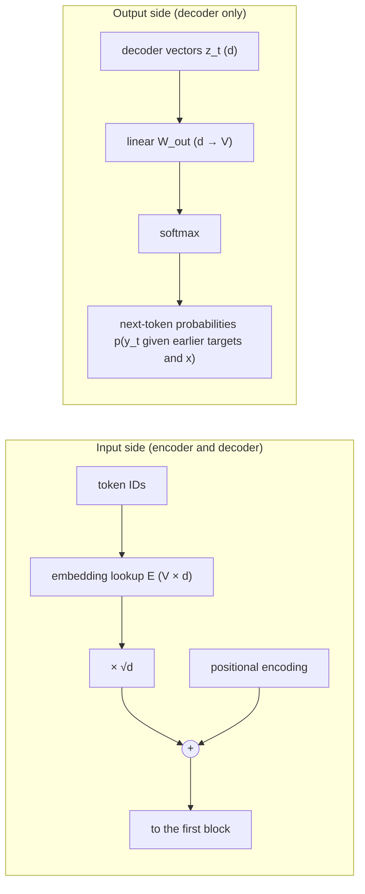

# 6.2 Inputs and Outputs

Before looking inside the Transformer, it helps to pin down what goes in and what comes out. This section describes the translation setting the original model was built for, how tokens become vectors, the notation used for the rest of the chapter, the special tokens a seq2seq model needs, how the decoder's vectors become probabilities, and the weight sharing the original model used between its embedding and output layers.

## The translation setting

A training example is a pair of sequences: a **source** $`\mathbf{x} = (x_1, \dots, x_m)`$ and a **target** $`\mathbf{y} = (y_1, \dots, y_n)`$. For English-German translation, the source is an English sentence and the target its German translation. Both are sequences of integer token IDs produced by a subword tokenizer (Chapter 5).

Source and target can use separate vocabularies or one shared vocabulary. The original Transformer's English-German model used byte-pair encoding (Sennrich et al. 2016; Chapter 5) with a **shared source-target vocabulary of about 37,000 tokens** (Vaswani et al. 2017). Sharing makes sense for related languages that share many subwords (names, numbers, cognates), and it enables the weight sharing described at the end of this section.

The same setup covers any task that maps one sequence to another. In this chapter's code labs, the "languages" are tiny and synthetic: a digit sequence and its reversal, or a date in one format and the same date in another. The model does not care what the tokens mean.

## Token embeddings

Chapter 4 represents a token as a learned vector. An **embedding matrix** $`E \in \mathbb{R}^{V \times d}`$ has one row per vocabulary entry, and embedding a token is a table lookup: token $`i`$ becomes row $`E_i`$. A sequence of $`m`$ tokens becomes a matrix

```math
X = \begin{bmatrix} E_{x_1} \\ \vdots \\ E_{x_m} \end{bmatrix} \in \mathbb{R}^{m \times d}.
```

The lookup is equivalent to multiplying a one-hot vector by $`E`$, so the embedding is trained by backpropagation like any other weight: only the rows of tokens that appear in a batch receive gradients.

The original Transformer **multiplies the embeddings by** $`\sqrt{d}`$ before adding positional encodings (Section 6). One reading of this choice: embeddings are initialized with small values, and the scaling puts them on a scale comparable to the positional encodings, whose entries lie in $`[-1, 1]`$, so the position signal does not drown out the token signal. The paper states the scaling without further justification, and later implementations differ on whether to include it. (A minimal embedding lookup with this scaling is in the appendix.)

## Notation

The rest of the chapter uses the following symbols. They follow the original paper, except that its $`d_{\text{model}}`$ is written $`d`$.

| Symbol | Meaning | Original base model |
|---|---|---|
| $`d`$ | Model width: the size of every token's vector between sublayers | 512 |
| $`N`$ | Number of blocks in the encoder, and separately in the decoder | 6 |
| $`h`$ | Number of attention heads | 8 |
| $`d_k`$ | Dimension of each head's queries and keys, $`d_k = d / h`$ | 64 |
| $`d_v`$ | Dimension of each head's values (usually equal to $`d_k`$) | 64 |
| $`d_{\text{ff}}`$ | Hidden width of the feed-forward network | 2,048 |
| $`V`$ | Vocabulary size | about 37,000 |
| $`m`$ | Source length (varies by example) | |
| $`n`$ | Target length (varies by example) | |

Activations are arranged with one row per token: the encoder works with matrices of shape $`m \times d`$, the decoder with $`n \times d`$. In code, a batch adds a leading dimension $`B`$, so tensors have shape `(B, m, d)` or `(B, n, d)`.

Every sublayer of the Transformer reads a matrix of shape $`(\cdot) \times d`$ and writes one of the same shape. That constant width is what allows residual connections everywhere: the output of any sublayer can be added to its input (Section 7).

## Special tokens

A seq2seq model needs a few tokens that do not correspond to words:

- **Beginning-of-sequence** (`<bos>`): the first input to the decoder. When the decoder predicts the first target token, it has no previous target token to condition on, so it is given `<bos>` instead.
- **End-of-sequence** (`<eos>`): appended to every target. The model learns to produce it when the output is complete, which is how generation knows when to stop (Section 10).
- **Padding** (`<pad>`): filler used to bring sequences in a batch to a common length, so they fit in one rectangular tensor. Padding carries no information, and masks keep attention from looking at it (Section 4).

For a target $`y_1, \dots, y_n`$, the decoder's input and the training labels are offset by one position:

| Position | 1 | 2 | 3 | ... | $`n`$ | $`n+1`$ |
|---|---|---|---|---|---|---|
| Decoder input | `<bos>` | $`y_1`$ | $`y_2`$ | ... | $`y_{n-1}`$ | $`y_n`$ |
| Label to predict | $`y_1`$ | $`y_2`$ | $`y_3`$ | ... | $`y_n`$ | `<eos>` |

This "shifted right" arrangement means that the decoder output at each position predicts the next target token. Section 9 builds training on it.

## The output side

The decoder produces one vector $`\mathbf{z}_t \in \mathbb{R}^{d}`$ per target position. A final linear layer maps it to one score (**logit**) per vocabulary entry, and a softmax turns the logits into a probability distribution:

```math
\mathbf{o}_t = W_{\text{out}} \mathbf{z}_t \in \mathbb{R}^{V}, \qquad
p_\theta(y_t = i \mid y_{\lt t}, \mathbf{x}) = \frac{\exp(o_{t,i})}{\sum_{j=1}^{V} \exp(o_{t,j})},
```

where $`W_{\text{out}} \in \mathbb{R}^{V \times d}`$. The softmax and the cross-entropy loss are the same as for any classifier (Chapter 2); here the classes are the $`V`$ vocabulary entries, and there is one classification per target position.



*Figure 6.2.1. How token IDs enter the model and how probabilities leave it.*

## Weight sharing between embeddings and the output layer

The model has three matrices of the same shape $`V \times d`$ when the vocabulary is shared: the source embedding, the target embedding, and the output projection $`W_{\text{out}}`$. The original Transformer **ties all three**, using one matrix for all of them (Vaswani et al. 2017). Press and Wolf (2017) studied tying the input embedding and output projection in language models and found that it reduced the number of parameters while improving or matching quality.

Why would the same matrix work for input and output? Each row $`E_i`$ is used in two roles: as the vector representing token $`i`$ when it is read, and as the direction whose dot product with $`\mathbf{z}_t`$ gives the logit for token $`i`$ when it is predicted. Tokens that behave similarly should be close in both roles, so sharing the rows is a reasonable constraint, and it gives rare tokens more gradient signal, since each row is trained from both sides.

The saving is substantial. With $`V \approx 37{,}000`$ and $`d = 512`$, one $`V \times d`$ matrix has about 18.9 million entries. Section 11 shows that this is close to a third of the base model's parameters, so untied matrices would add tens of millions more. A module that uses one matrix in all three roles takes only a few lines (see the appendix).

Tying is a design choice, not a requirement. Separate vocabularies for source and target make full tying impossible (the target embedding and output projection can still be tied), and some later models choose not to tie.

## Key takeaways

- A seq2seq example is a pair of token sequences; the original model used a shared byte-pair vocabulary of about 37,000 tokens for English-German.
- Embeddings are a $`V \times d`$ lookup table; the original model scales them by $`\sqrt{d}`$ before adding positional encodings.
- Every sublayer maps $`(\cdot) \times d`$ to $`(\cdot) \times d`$, which is what makes residual connections possible throughout.
- `<bos>`, `<eos>`, and `<pad>` handle the start of decoding, the end of generation, and batching; the decoder input is the target shifted right by one.
- A linear layer and softmax turn each decoder vector into a distribution over the vocabulary; the original model ties this projection to the two embedding matrices.

## Appendix: Code

The snippets below reproduce the checks and results described in this section. They need only PyTorch and run on a CPU; snippets in the same appendix are meant to be run in order in one Python session.

### Embedding lookup with √d scaling

```python
import math
import torch
import torch.nn as nn

V, d = 1000, 512
emb = nn.Embedding(V, d)
tokens = torch.tensor([[5, 17, 42, 3]])      # a batch with one sequence of 4 token IDs
X = emb(tokens) * math.sqrt(d)               # shape (1, 4, 512)
print(X.shape)
```

### One matrix for source embedding, target embedding and output logits

```python
class TiedEmbeddings(nn.Module):
    """One V x d matrix used for source embedding, target embedding, and output logits."""
    def __init__(self, V, d):
        super().__init__()
        self.E = nn.Embedding(V, d)
        self.d = d
    def embed(self, tokens):
        return self.E(tokens) * math.sqrt(self.d)
    def logits(self, z):                     # z: (B, n, d)
        return z @ self.E.weight.T           # (B, n, V)

tie = TiedEmbeddings(V, d)
z = torch.randn(2, 7, d)
print(tie.embed(torch.tensor([[1, 2, 3]])).shape, tie.logits(z).shape)
```

## Further reading

Press, Ofir, and Lior Wolf. "Using the Output Embedding to Improve Language Models." In *Proceedings of the 15th Conference of the European Chapter of the Association for Computational Linguistics*, 2017. https://arxiv.org/abs/1608.05859.

Sennrich, Rico, Barry Haddow, and Alexandra Birch. "Neural Machine Translation of Rare Words with Subword Units." In *Proceedings of the 54th Annual Meeting of the Association for Computational Linguistics*, 2016. https://arxiv.org/abs/1508.07909.

Vaswani, Ashish, et al. "Attention Is All You Need." In *Advances in Neural Information Processing Systems 30*, 2017. https://arxiv.org/abs/1706.03762.
