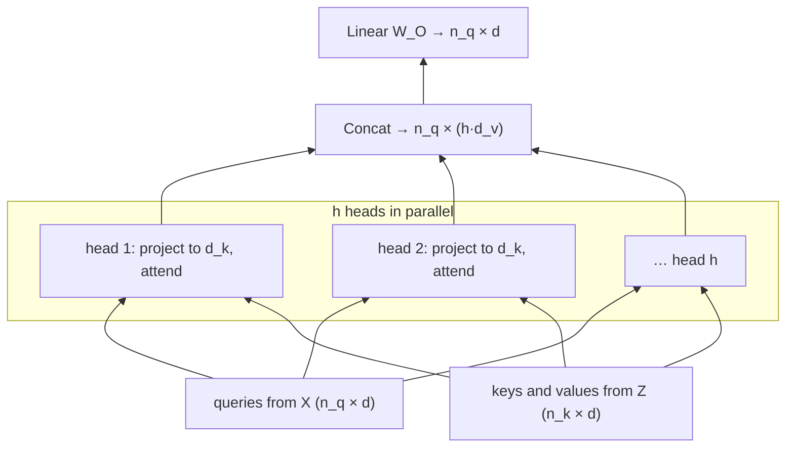

# 6.5 Multi-Head Attention

A single attention operation produces one set of weights per query: one distribution over the keys. But a token usually needs information of several kinds at once. To translate a verb, a model may need its subject (for agreement), its object (for meaning), and the source word it corresponds to (for content). One softmax can put its weight in several places, but it must blend them all into one average with one set of weights. **Multi-head attention** runs several attention operations in parallel, each in its own learned subspace, and combines their results. This section defines it, shows that it costs no more than one full-width head, implements it efficiently, and discusses what heads learn.

## One head, one pattern

Recall single-head attention from Section 3: project the inputs with $`W_Q, W_K, W_V`$, score, softmax, and average. The projections determine *what* gets compared: two tokens receive a high score if their projected query and key vectors align. A single set of projections defines a single notion of relevance. If the model needs "attend to the previous token" and "attend to the syntactic subject" at the same time, a single head must compromise.

The fix is to give the model several sets of projections, several **heads**, each free to learn its own notion of relevance.

## The definition

With $`h`$ heads, head $`i`$ has its own projections $`W_Q^{(i)}, W_K^{(i)} \in \mathbb{R}^{d \times d_k}`$ and $`W_V^{(i)} \in \mathbb{R}^{d \times d_v}`$, and computes ordinary scaled dot-product attention in its $`d_k`$-dimensional subspace:

```math
\mathrm{head}_i = \mathrm{Attention}\big(XW_Q^{(i)},\; ZW_K^{(i)},\; ZW_V^{(i)}\big) \in \mathbb{R}^{n_q \times d_v}.
```

The heads' outputs are concatenated side by side and mixed by an output projection $`W_O \in \mathbb{R}^{h d_v \times d}`$:

```math
\mathrm{MultiHead}(X, Z) = \mathrm{Concat}(\mathrm{head}_1, \dots, \mathrm{head}_h)\, W_O \in \mathbb{R}^{n_q \times d}.
```

As in Section 3, $`Z = X`$ gives multi-head self-attention and $`Z`$ = encoder output gives multi-head cross-attention. The output has the model width $`d`$, so it can be added back to the residual stream (Section 7).

The output projection matters. Concatenation just places the heads' results in separate coordinates; $`W_O`$ lets every output coordinate combine information from every head. Equivalently, splitting $`W_O`$ into $`h`$ row blocks $`W_O^{(i)} \in \mathbb{R}^{d_v \times d}`$ gives

```math
\mathrm{MultiHead}(X, Z) = \sum_{i=1}^{h} \mathrm{head}_i \, W_O^{(i)},
```

so each head writes its own contribution into the $`d`$-dimensional output, and the contributions are added.



*Figure 6.5.1. Multi-head attention: each head projects the inputs into its own subspace and runs scaled dot-product attention (Figure 6.3.1); the results are concatenated and projected back to width* $`d`$.

## It costs no more than one head

The original Transformer sets $`d_k = d_v = d / h`$. With $`d = 512`$ and $`h = 8`$, each head works in 64 dimensions (Vaswani et al. 2017). Count the parameters:

- Query projections: $`h`$ matrices of size $`d \times d_k`$, totaling $`d \times h d_k = d^2`$. The same for keys and for values.
- Output projection: $`h d_v \times d = d^2`$.

So multi-head attention has $`4d^2`$ weight parameters (plus $`4d`$ biases if used), exactly as many as a single head with $`d_k = d_v = d`$. The compute is also about the same: the projections are the same total size, and the score computation, which costs about $`2 n_q n_k d_k`$ FLOPs per head, sums to $`2 n_q n_k d`$ over all heads. What changes is that the $`n_q \times n_k`$ attention matrix is computed $`h`$ times, once per head, each from a smaller subspace. Splitting the width into heads buys several attention patterns at essentially no extra cost.

The trade-off is that each head sees only $`d_k`$ dimensions. Vaswani et al. varied the number of heads while keeping the total width fixed and found that a single head was noticeably worse than their default of eight, and that quality also dropped with too many heads (each then very narrow).

## Implementation without a loop over heads

Looping over heads in Python would be slow. Instead, all heads' projections are packed into one $`d \times d`$ matrix per role, the result is reshaped to separate the heads, and batched matrix multiplication handles all heads at once:

1. Compute $`Q = XW_Q`$ with a single $`d \times d`$ matrix: shape `(B, n_q, d)`.
2. Reshape to `(B, n_q, h, d_k)` and transpose to `(B, h, n_q, d_k)`. Head $`i`$'s queries are the slice `[:, i]`, which uses columns $`i d_k`$ to $`(i+1) d_k - 1`$ of $`W_Q`$, exactly $`W_Q^{(i)}`$.
3. Do the same for $`K`$ and $`V`$, run attention on the 4-D tensors (the head dimension acts as an extra batch dimension), transpose back, and reshape to `(B, n_q, d)`, which *is* the concatenation.
4. Apply $`W_O`$.

Implemented this way (code in the appendix), the layer has $`4d^2 + 4d`$ parameters, 1,050,624 for $`d = 512`$, whatever the number of heads, and copying its weights into PyTorch's `nn.MultiheadAttention` gives the same outputs. PyTorch stores the three input projections stacked in one `in_proj_weight` of shape $`3d \times d`$, so the copy concatenates $`W_Q`$, $`W_K`$ and $`W_V`$. A mask of shape `(n_q, n_k)` or `(B, 1, n_q, n_k)` broadcasts across heads, so every head obeys the same padding and causal constraints (Section 4).

## What heads learn

Because each head computes its own attention matrix, heads can be inspected individually. Studies of trained translation Transformers found heads with recognizable roles, for example heads that attend mostly to the previous or next token, heads that track particular syntactic relations, and heads that attend to rare words (Voita et al. 2019). In cross-attention, some heads produce weights that resemble word alignments between source and target, much like the attention of recurrent translation models (Section 1). The chapter's last code lab plots cross-attention weights for a model trained on a toy task; Figure 6.8.3 in Section 8 shows an example.

Voita et al. also found that many heads can be removed from a trained model with little loss in translation quality, while a small number of specialized heads matter most. Heads are not all equally useful, and the number of heads is a hyperparameter to tune rather than a quantity to maximize.

A caution about interpretation: attention weights show where a head *reads* from, not what it does with the information or how much its output affects the prediction. The value vectors, the output projection, the residual stream, and later layers all intervene. Jain and Wallace (2019) showed that attention weights often do not line up with other measures of which inputs matter to a prediction. Attention maps are a useful window into a model, not a complete explanation of it.

## Key takeaways

- A single head computes one attention pattern per query; multiple heads compute several patterns in parallel, each in its own learned $`d_k`$-dimensional subspace.
- Heads' outputs are concatenated and mixed by $`W_O`$; equivalently, each head adds its own projected contribution to the output.
- With $`d_k = d/h`$, multi-head attention has $`4d^2`$ weights and about the same compute as a single full-width head.
- Efficient implementations project once, reshape to separate heads, and use batched matrix multiplication instead of a loop.
- Heads specialize, and some matter far more than others; attention weights show where a head reads from, not a full explanation of the model.

## Appendix: Code

The snippets below reproduce the checks and results described in this section. They need only PyTorch and run on a CPU; snippets in the same appendix are meant to be run in order in one Python session.

### Multi-head attention, checked against nn.MultiheadAttention

```python
import math
import torch
import torch.nn as nn

class MultiHeadAttention(nn.Module):
    def __init__(self, d, h):
        super().__init__()
        assert d % h == 0
        self.h, self.d_k = h, d // h
        self.W_q, self.W_k, self.W_v, self.W_o = (nn.Linear(d, d) for _ in range(4))

    def split(self, x):                          # (B, n, d) -> (B, h, n, d_k)
        B, n, _ = x.shape
        return x.view(B, n, self.h, self.d_k).transpose(1, 2)

    def forward(self, x, z, allowed=None):       # allowed: broadcastable to (B, h, n_q, n_k)
        Q, K, V = self.split(self.W_q(x)), self.split(self.W_k(z)), self.split(self.W_v(z))
        scores = Q @ K.transpose(-2, -1) / math.sqrt(self.d_k)
        if allowed is not None:
            scores = scores.masked_fill(~allowed, float("-inf"))
        self.weights = scores.softmax(-1)        # keep for inspection: (B, h, n_q, n_k)
        out = self.weights @ V                   # (B, h, n_q, d_k)
        B, _, n_q, _ = out.shape
        out = out.transpose(1, 2).reshape(B, n_q, self.h * self.d_k)   # concatenate heads
        return self.W_o(out)

torch.manual_seed(0)
d, h = 512, 8
mha = MultiHeadAttention(d, h)
x, z = torch.randn(2, 5, d), torch.randn(2, 7, d)       # decoder states, encoder output
print(mha(x, z).shape, mha.weights.shape)               # (2, 5, 512), (2, 8, 5, 7)
print(sum(p.numel() for p in mha.parameters()), 4 * d * d + 4 * d)   # 1050624 both

# Check against PyTorch by copying weights into nn.MultiheadAttention
ref = nn.MultiheadAttention(d, h, batch_first=True)
with torch.no_grad():
    ref.in_proj_weight.copy_(torch.cat([mha.W_q.weight, mha.W_k.weight, mha.W_v.weight]))
    ref.in_proj_bias.copy_(torch.cat([mha.W_q.bias, mha.W_k.bias, mha.W_v.bias]))
    ref.out_proj.weight.copy_(mha.W_o.weight)
    ref.out_proj.bias.copy_(mha.W_o.bias)
ref_out, _ = ref(x, z, z)
print(torch.allclose(mha(x, z), ref_out, atol=1e-5))    # True
```

## Further reading

Jain, Sarthak, and Byron C. Wallace. "Attention Is Not Explanation." In *Proceedings of the 2019 Conference of the North American Chapter of the Association for Computational Linguistics*, 2019. https://arxiv.org/abs/1902.10186.

Vaswani, Ashish, et al. "Attention Is All You Need." In *Advances in Neural Information Processing Systems 30*, 2017. https://arxiv.org/abs/1706.03762.

Voita, Elena, et al. "Analyzing Multi-Head Self-Attention: Specialized Heads Do the Heavy Lifting, the Rest Can Be Pruned." In *Proceedings of the 57th Annual Meeting of the Association for Computational Linguistics*, 2019. https://arxiv.org/abs/1905.09418.
