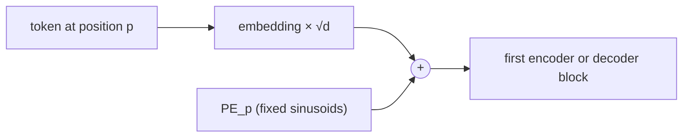
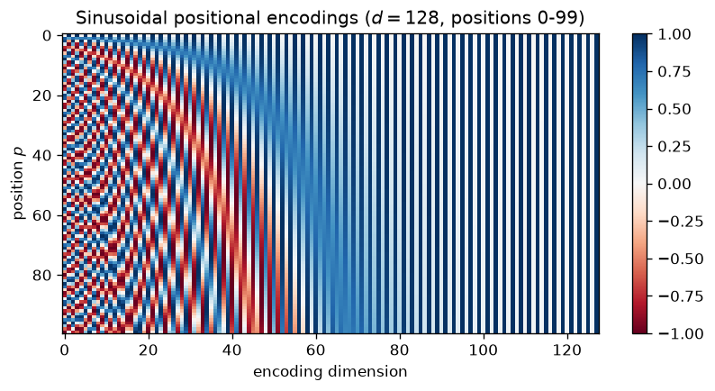
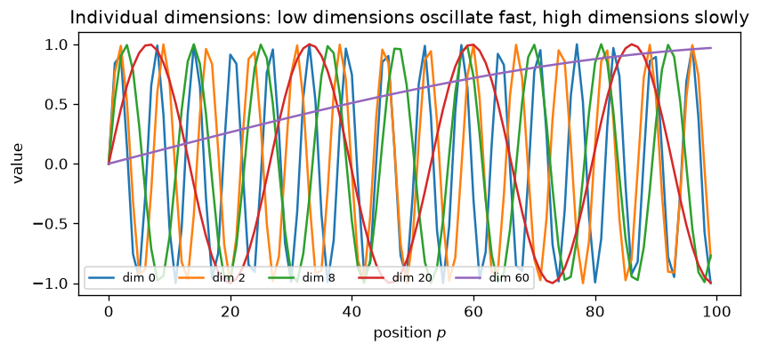
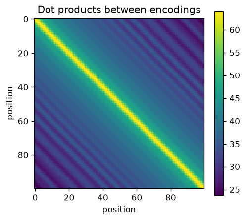

# 6.6 Positional Encodings

Section 3 showed that self-attention is permutation-equivariant: shuffle the input tokens and the outputs come out shuffled the same way, with nothing else changed. For language, that is a serious defect. "Dog bites man" and "man bites dog" contain the same tokens, and an encoder built only from self-attention and position-wise layers would give each token the same representation in both sentences. The Transformer fixes this by adding a **positional encoding** to each token's embedding, so the vectors entering the first layer carry both *what* the token is and *where* it is. This section explains the sinusoidal encodings of the original Transformer, their properties, learned position embeddings, relative-position alternatives, and how each handles sequences longer than those seen in training.

## Why attention needs position information

Everything in a Transformer block except attention acts on each position separately: the feed-forward network, layer normalization, and residual additions do not look at other positions at all. Attention is the only place where positions interact, and it interacts through dot products between queries and keys, which depend on the *contents* of the vectors, not on where they sit in the sequence. Section 3 verified numerically that permuting the input permutes the output.

For the decoder, the causal mask (Section 4) breaks some of this symmetry, because position $`t`$ can see only positions up to $`t`$. But the encoder has no mask, and order matters in both languages: the model must know that the German verb comes at the end of a clause, or that the third source word probably maps to the third or fourth target word. Position must be supplied explicitly.

## Sinusoidal encodings

The original Transformer adds a fixed vector $`\mathrm{PE}_p \in \mathbb{R}^{d}`$ to the embedding of the token at position $`p`$, at the bottom of both the encoder and decoder stacks (Vaswani et al. 2017). The vector's entries are sines and cosines at geometrically spaced frequencies:

```math
\mathrm{PE}_{(p,\, 2i)} = \sin\!\left(\frac{p}{10000^{2i/d}}\right), \qquad \mathrm{PE}_{(p,\, 2i+1)} = \cos\!\left(\frac{p}{10000^{2i/d}}\right), \qquad i = 0, 1, \dots, \tfrac{d}{2} - 1.
```

Each pair of dimensions $`(2i, 2i+1)`$ is a point on a circle rotating at angular frequency $`\omega_i = 10000^{-2i/d}`$ as the position increases. The first pair rotates by one radian per position (wavelength $`2\pi`$); the last pair rotates so slowly that its wavelength is nearly $`10000 \cdot 2\pi`$. The input to the first layer is

```math
\mathbf{x}_p = \sqrt{d}\, E_{\text{token}(p)} + \mathrm{PE}_p .
```



*Figure 6.6.1. Positional encodings are added to the token embeddings once, before the first block.*

The figures below show the encodings for $`d = 128`$. In the heatmap, each row is a position and each column a dimension: the left columns (high frequencies) change rapidly from row to row, and the right columns (low frequencies) change slowly. Together, the dimensions act like the digits of a clock with hands turning at many different speeds: fast hands distinguish neighboring positions, slow hands distinguish distant ones, and no two positions within a very long range have the same combination.



*Figure 6.6.2. Sinusoidal positional encodings for positions 0 to 99 with* $`d = 128`$.



*Figure 6.6.3. Individual dimensions of the encoding: low dimensions oscillate quickly, high dimensions slowly.*

## Properties

**Bounded values.** Every entry lies in $`[-1, 1]`$, and every encoding has the same norm, $`\|\mathrm{PE}_p\|^2 = d/2`$ (one $`\sin^2 + \cos^2 = 1`$ per pair of dimensions). Positions do not grow in magnitude as the sequence gets longer.

**Relative offsets are linear maps.** For any fixed offset $`k`$, there is a matrix $`R_k`$ that does not depend on $`p`$, such that $`\mathrm{PE}_{p+k} = R_k \, \mathrm{PE}_p`$. This follows from the angle-addition formulas: for each pair of dimensions,

```math
\begin{bmatrix} \sin(\omega_i (p+k)) \\ \cos(\omega_i (p+k)) \end{bmatrix}
=
\begin{bmatrix} \cos(\omega_i k) & \sin(\omega_i k) \\ -\sin(\omega_i k) & \cos(\omega_i k) \end{bmatrix}
\begin{bmatrix} \sin(\omega_i p) \\ \cos(\omega_i p) \end{bmatrix},
```

so $`R_k`$ is block diagonal with one $`2 \times 2`$ rotation per frequency. Vaswani et al. chose sinusoids partly for this reason, hypothesizing that it would make it easy for the model to attend by relative position, since "the position $`k`$ steps back" is a fixed linear function of the current encoding.

**Similarity decays with distance.** The dot product between two encodings depends only on their offset:

```math
\mathrm{PE}_p^\top \mathrm{PE}_{p+k} = \sum_{i=0}^{d/2-1} \cos(\omega_i k).
```

It is largest at $`k = 0`$ and generally falls as $`|k|`$ grows, with ripples. The figure below shows this as a matrix: a bright diagonal band, constant along each diagonal because only the offset matters.



*Figure 6.6.4. Dot products between sinusoidal encodings of positions 0 to 99 (* $`d = 128`$ *). Each diagonal is constant because the dot product depends only on the offset.*

**Defined for any position.** The formula can be evaluated at positions never seen in training, which Vaswani et al. suggested might let the model handle longer sequences than those it was trained on.

All three properties are easy to confirm numerically. The appendix computes the encodings and checks that every encoding has squared norm $`d/2`$, that one fixed rotation maps each encoding to the encoding $`k`$ positions later, and that the dot product of two encodings depends only on their offset.

## Learned absolute embeddings

The simplest alternative is to learn the position vectors: a second embedding table $`P \in \mathbb{R}^{n_{\max} \times d}`$ with one trainable row per position, added to the token embeddings exactly like the sinusoids. Vaswani et al. tried this and found that it produced **nearly identical results** to sinusoidal encodings on their translation task. Later encoder-only models such as BERT (Devlin et al. 2019) also use learned position embeddings.

Learned embeddings are flexible, but they have a hard limit: a table with $`n_{\max}`$ rows has no vector for position $`n_{\max}`$ or beyond, so the model cannot process longer inputs at all. Rows for rarely seen positions (near $`n_{\max}`$, if most training sequences are short) are also poorly trained.

## Relative positions

Absolute encodings tell each token *where it is*. For many relationships, what matters is *how far apart* two tokens are: an adjective usually modifies a nearby noun wherever the phrase sits in the sentence. Several methods put relative position directly into attention:

- **Relative position representations** (Shaw et al. 2018) add learned vectors, indexed by the clipped offset $`s - t`$ between query and key positions, to the keys (and optionally the values) inside each attention layer. Shaw et al. reported improved translation quality over absolute sinusoidal encodings on the benchmarks they studied.
- **Rotary position embeddings (RoPE)** (Su et al. 2024) rotate each pair of query and key dimensions by an angle proportional to the token's position, using the same frequencies as the sinusoids. Because rotating both vectors and taking their dot product leaves only the *difference* of the angles, the score $`\mathbf{q}_t^\top \mathbf{k}_s`$ depends on positions only through $`t - s`$. No vector is added to the embeddings.
- **Attention with linear biases (ALiBi)** (Press et al. 2022) adds no position vectors either. Instead, it subtracts from each attention score a penalty proportional to the distance between query and key, with a different slope per head, so nearby tokens are favored by default.

RoPE's relative property takes only a few lines to verify: rotating the same query and key as if they were at positions 12 and 5, or at positions 107 and 100, gives exactly the same score, since both pairs are 7 positions apart (code in the appendix).

## Longer sequences than in training

A model trained on sentences of up to, say, 50 tokens may be given a 100-token sentence at test time. How well it copes depends on the position scheme:

| Scheme | Positions beyond training length | Notes |
|---|---|---|
| Learned absolute | Not representable | Table has no rows for them |
| Sinusoidal | Defined, but never seen in training | The model may not generalize to unfamiliar encodings |
| Relative (Shaw et al.) | Offsets beyond the clipping distance share one vector | Designed to generalize across lengths |
| RoPE | Defined; only offsets matter | Unseen large offsets can still behave poorly |
| ALiBi | Defined; penalty keeps growing with distance | Press et al. designed it for training on short sequences and testing on longer ones |

A formula that *can* be evaluated at a new position does not guarantee that the model has learned to *use* it. Press et al. (2022) measured this directly and found that sinusoidal encodings extrapolated poorly beyond the training length in their language-modeling experiments, which motivated ALiBi. Testing on sequences longer than those in training, as the third code lab does, is the only way to know.

## Key takeaways

- Self-attention ignores order, so the Transformer adds a positional encoding to each token embedding before the first block.
- Sinusoidal encodings use sines and cosines at geometrically spaced frequencies; every encoding has the same norm, an offset corresponds to a fixed rotation, and the dot product between two encodings depends only on their distance.
- Learned absolute embeddings performed about the same as sinusoids in the original paper but cannot represent positions beyond their table.
- Relative schemes (Shaw et al. relative representations, RoPE, ALiBi) put the distance between tokens directly into attention.
- Being defined at unseen positions is not the same as generalizing to them; test on longer sequences to find out.

## Appendix: Code

The snippets below reproduce the checks and results described in this section. They need only PyTorch and run on a CPU; snippets in the same appendix are meant to be run in order in one Python session.

### Sinusoidal encodings: norm, rotation and offset checks

```python
import torch

def sinusoidal_pe(n_pos, d):
    pos = torch.arange(n_pos, dtype=torch.float64)[:, None]
    omega = 10000 ** (-torch.arange(0, d, 2, dtype=torch.float64) / d)   # (d/2,)
    pe = torch.zeros(n_pos, d, dtype=torch.float64)
    pe[:, 0::2] = torch.sin(pos * omega)
    pe[:, 1::2] = torch.cos(pos * omega)
    return pe, omega

d = 64
pe, omega = sinusoidal_pe(200, d)
print(torch.allclose(pe.norm(dim=1) ** 2, torch.full((200,), d / 2, dtype=torch.float64)))  # equal norms

# PE_{p+k} = R_k PE_p with a block-diagonal rotation R_k independent of p
k = 7
R = torch.zeros(d, d, dtype=torch.float64)
for i, w in enumerate(omega):
    c, s = torch.cos(w * k), torch.sin(w * k)
    R[2 * i: 2 * i + 2, 2 * i: 2 * i + 2] = torch.tensor([[c, s], [-s, c]])
print(torch.allclose(pe[k:] , pe[:-k] @ R.T))                          # True for every p

# The dot product depends only on the offset
print(torch.allclose(pe[10] @ pe[10 + k], pe[100] @ pe[100 + k]))       # True
```

### RoPE: the score depends only on the offset

```python
import torch

def rope(x, pos, base=10000.0):
    """Rotate pairs of dimensions of x (..., d) by angles pos * omega_i."""
    d = x.size(-1)
    omega = base ** (-torch.arange(0, d, 2, dtype=x.dtype) / d)
    ang = pos * omega
    x1, x2 = x[..., 0::2], x[..., 1::2]
    out = torch.empty_like(x)
    out[..., 0::2] = x1 * torch.cos(ang) - x2 * torch.sin(ang)
    out[..., 1::2] = x1 * torch.sin(ang) + x2 * torch.cos(ang)
    return out

torch.manual_seed(0)
q, k = torch.randn(64, dtype=torch.float64), torch.randn(64, dtype=torch.float64)
s1 = rope(q, 12.0) @ rope(k, 5.0)       # positions 12 and 5 (offset 7)
s2 = rope(q, 107.0) @ rope(k, 100.0)    # positions 107 and 100 (offset 7)
print(torch.allclose(s1, s2))           # True: the score depends only on the offset
```

## Further reading

Devlin, Jacob, Ming-Wei Chang, Kenton Lee, and Kristina Toutanova. "BERT: Pre-training of Deep Bidirectional Transformers for Language Understanding." In *Proceedings of the 2019 Conference of the North American Chapter of the Association for Computational Linguistics: Human Language Technologies*, 4171–4186, 2019. https://arxiv.org/abs/1810.04805.

Press, Ofir, Noah A. Smith, and Mike Lewis. "Train Short, Test Long: Attention with Linear Biases Enables Input Length Extrapolation." In *International Conference on Learning Representations*, 2022. https://arxiv.org/abs/2108.12409.

Shaw, Peter, Jakob Uszkoreit, and Ashish Vaswani. "Self-Attention with Relative Position Representations." In *Proceedings of the 2018 Conference of the North American Chapter of the Association for Computational Linguistics*, 2018. https://arxiv.org/abs/1803.02155.

Su, Jianlin, et al. "RoFormer: Enhanced Transformer with Rotary Position Embedding." *Neurocomputing* 568 (2024): 127063. https://arxiv.org/abs/2104.09864.

Vaswani, Ashish, et al. "Attention Is All You Need." In *Advances in Neural Information Processing Systems 30*, 2017. https://arxiv.org/abs/1706.03762.
