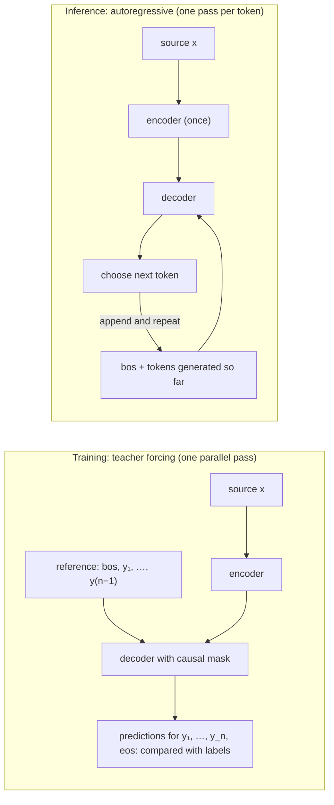
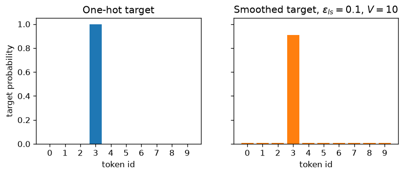
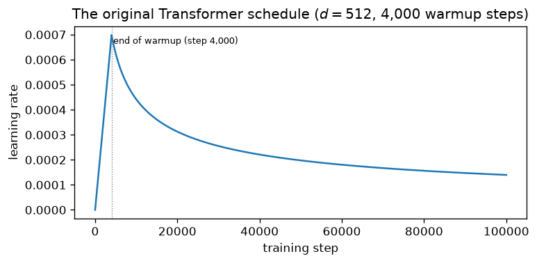

# 6.9 Training on Sequence-to-Sequence Data

With the architecture complete, this section explains how to train it. The objective is the familiar cross-entropy of Chapter 2, applied to every target token. What makes Transformer training efficient is **teacher forcing** combined with the causal mask, which lets the decoder learn from every target position of a sentence in one parallel forward pass. We also cover the gap this creates between training and inference (*exposure bias*), **label smoothing**, the original optimizer settings and **warmup schedule**, practical details such as batching by length and checkpoint averaging, and what to monitor while training.

## The objective

A seq2seq model defines the probability of a target sequence given a source as a product of per-token conditionals (Section 1). Training maximizes the log-probability of the reference targets in the training set, which is the same as minimizing the cross-entropy loss summed over target positions:

```math
\mathcal{L}(\theta) = -\sum_{t=1}^{n} \log p_\theta(y_t \mid y_{\lt t}, \mathbf{x}),
```

averaged over the sentence pairs in a batch. Here $`y_n`$ is the end-of-sequence token, so the model also learns *when to stop*. Each term is an ordinary classification loss over the $`V`$ vocabulary entries, and its gradient with respect to the logits is the predicted distribution minus the target distribution, as derived in Chapter 2.

Padding positions contribute nothing: their labels are set to an "ignore" value so that they are excluded from the sum and from the count used for averaging. In PyTorch, `nn.CrossEntropyLoss(ignore_index=pad_id)` does this. Implementations differ in whether they average over sentences or over non-padding tokens; averaging over tokens gives every token equal weight regardless of sentence length.

## Teacher forcing

At training time the whole reference target is known. **Teacher forcing** feeds the decoder the *reference* previous tokens rather than the model's own predictions: the decoder input is the target shifted right by one position and starting with `<bos>`, and the labels are the target itself followed by `<eos>` (Section 2).

| Decoder position | 1 | 2 | 3 | 4 | 5 |
|---|---|---|---|---|---|
| Decoder input | `<bos>` | `Das` | `ist` | `gut` | `.` |
| Label | `Das` | `ist` | `gut` | `.` | `<eos>` |

With the causal mask (Section 4), the output at position $`t`$ depends only on decoder inputs $`1, \dots, t`$, that is, on `<bos>` and the reference tokens $`y_1, \dots, y_{t-1}`$. So one forward pass computes all $`n`$ conditional distributions $`p_\theta(y_t \mid y_{\lt t}, \mathbf{x})`$ at once, each correctly conditioned, and one backward pass trains on all of them. A sentence pair with a 30-token target gives 30 training signals for the cost of one pass. A recurrent decoder, by contrast, must step through the 30 positions one after another even with teacher forcing.



*Figure 6.9.1. Teacher forcing feeds the reference prefix and trains all positions in one pass; inference feeds the model's own outputs back in, one token at a time.*

## Exposure bias

Teacher forcing creates a mismatch. During training, the decoder always conditions on **correct** prefixes. During inference, it conditions on its **own** previous outputs, which may contain mistakes, and it has never been trained to recover from a prefix it produced itself. An early error can put the decoder in unfamiliar territory, making later errors more likely. This mismatch is called **exposure bias**.

In practice, teacher forcing works well enough that it remains the standard way to train Transformers for seq2seq tasks: it is simple, parallel, and stable. The effects of exposure bias are mitigated at inference time by search procedures that keep several candidate outputs alive instead of committing to the single most likely token at every step, and by label smoothing, discussed next, which makes the model less overconfident. Alternatives that train on the model's own outputs exist, but they give up the parallelism that makes teacher forcing attractive.

## Label smoothing

With a one-hot target, cross-entropy keeps pushing the probability of the correct token toward 1, which it can approach only by making its logit arbitrarily larger than all the others. The model becomes overconfident. **Label smoothing** (Szegedy et al. 2016) replaces the one-hot target with a mixture of the one-hot vector and a uniform distribution over the vocabulary:

```math
q(k) = (1 - \epsilon_{\text{ls}})\, \mathbb{1}[k = y_t] + \frac{\epsilon_{\text{ls}}}{V}, \qquad
\mathcal{L}_t = -\sum_{k=1}^{V} q(k) \log p_\theta(k \mid y_{\lt t}, \mathbf{x}).
```

The correct token gets probability $`1 - \epsilon_{\text{ls}} + \epsilon_{\text{ls}}/V`$, and every other token gets $`\epsilon_{\text{ls}}/V`$. The loss is minimized by predicting exactly $`q`$, so the logits no longer need to grow without bound. Equivalently, the smoothed loss is a weighted sum of the ordinary cross-entropy and the cross-entropy against the uniform distribution, which penalizes distributions that put almost no mass on alternatives.



*Figure 6.9.2. A one-hot target and its smoothed version with* $`\epsilon_{\text{ls}} = 0.1`$ *over a 10-token vocabulary.*

The original Transformer used $`\epsilon_{\text{ls}} = 0.1`$. Vaswani et al. (2017) reported that this **hurt perplexity**, because the model learns to be more unsure, **but improved accuracy and BLEU**, a standard translation-quality score based on how many of the output's word sequences also appear in a reference translation (Papineni et al. 2002). The perplexity result is expected: perplexity measures how much probability the model assigns to the reference tokens, and label smoothing deliberately holds some probability back. Müller et al. (2019) studied why label smoothing helps and found that it improves calibration (predicted probabilities better match actual accuracy) and makes representations of different classes more tightly clustered. They also found that a teacher network trained with label smoothing is worse for knowledge distillation.

PyTorch's cross-entropy has label smoothing built in, through the `label_smoothing` argument of `nn.CrossEntropyLoss`, and it matches the formula above exactly (check in the appendix).

## The optimization recipe

The original Transformer was trained with Adam (Chapter 3) using $`\beta_1 = 0.9`$, $`\beta_2 = 0.98`$, and $`\epsilon = 10^{-9}`$, and a learning rate that changes every step (Vaswani et al. 2017):

```math
\eta_t = d^{-0.5} \cdot \min\!\left(t^{-0.5},\; t \cdot T_{\text{warmup}}^{-1.5}\right), \qquad T_{\text{warmup}} = 4000.
```

For $`t \lt T_{\text{warmup}}`$ the second term is smaller, so the learning rate **increases linearly**; afterward the first term is smaller, so it **decays with the inverse square root** of the step number. The two terms are equal at $`t = T_{\text{warmup}}`$, where the peak is $`(d \cdot T_{\text{warmup}})^{-0.5}`$. For $`d = 512`$ that peak is about $`7.0 \times 10^{-4}`$. The factor $`d^{-0.5}`$ makes wider models use smaller learning rates.



*Figure 6.9.3. The warmup-then-inverse-square-root schedule for* $`d = 512`$ *and 4,000 warmup steps.*

Warmup matters especially for the original post-norm Transformer. Section 7 described the analysis of Xiong et al. (2020): at initialization, post-norm Transformers have large gradients near the output, and a full-size learning rate in the first steps can destabilize training. Starting small gives Adam's moment estimates time to settle and keeps the early updates from wrecking the initialization (Chapter 3 discusses warmup in general).

In PyTorch, the schedule can be written as a `LambdaLR` wrapped around Adam, with the optimizer's base learning rate set to 1 so that the lambda gives the actual value. The appendix uses it to train a small encoder-decoder to reverse sequences of digits, with label smoothing and a 200-step warmup; in 400 steps the training loss falls from 3.42 to about 0.57.

A freshly initialized model should have a loss near $`\ln V`$, since it spreads its probability roughly evenly (Chapter 3's debugging checklist); that check is why the appendix code initializes the embedding with standard deviation $`d^{-1/2}`$. The same matrix is multiplied by $`\sqrt{d}`$ on the way in and reused as the output projection; with PyTorch's default initialization (standard deviation 1) the initial logits are large and the initial loss is many times $`\ln V`$, which slows early training. Note that with label smoothing the loss cannot reach zero: its minimum is the entropy of the smoothed target distribution. The code labs train a model like this to completion and look inside it at its cross-attention.

## Practical details

Several engineering choices from the original work are still standard for seq2seq Transformers:

- **Batching by length.** Sentence pairs were grouped by approximate length, and each batch held roughly 25,000 source tokens and 25,000 target tokens (Vaswani et al. 2017). Grouping similar lengths wastes less computation on padding, and specifying batches in tokens rather than sentences keeps the work per step roughly constant.
- **Dropout.** Rate 0.1 on every sublayer output and on the embedding sums in the base model (Section 7). Unlike very large models trained on one pass over huge corpora (Chapter 3), translation models see their training data many times, so regularization matters.
- **Checkpoint averaging.** For the base models, the final model was the average of the weights of the last 5 checkpoints, saved at 10-minute intervals; the big models averaged the last 20 (Vaswani et al. 2017). Averaging nearby points along the training trajectory smooths out the noise of the final steps, much like the late-training learning-rate decay of Chapter 3.
- **Training length.** The base models trained for 100,000 steps (about 12 hours on 8 GPUs in the original setup) and the big models for 300,000 steps (3.5 days).

## Monitoring training

The training loss, computed with teacher forcing, measures how well the model predicts each reference token given a *correct* prefix. That is not the same as how good its generated outputs are, which depends on the decoding procedure and on exposure bias. So seq2seq training is usually monitored at two levels:

1. **Loss (or perplexity) on a validation set**, computed with teacher forcing. It is cheap and smooth, and it is the right signal for spotting divergence or overfitting (with the caveat, above, that label smoothing raises it).
2. **Quality of decoded outputs** on a validation set, generated by the model one token at a time from its own predictions and scored with a task metric: exact match for toy tasks, BLEU for translation. This is slower but measures what actually matters.

The two usually move together early in training and can diverge later; when choosing checkpoints or hyperparameters, prefer the decoded-output metric.

With training in place, the model of this chapter is complete. Token embeddings and positional encodings feed a stack of encoder blocks, each pairing self-attention with a feed-forward network; a stack of decoder blocks adds masked self-attention over the target prefix and cross-attention to the encoder's output; and teacher forcing, label smoothing and a warmup schedule train the whole network end to end on sentence pairs. Every piece serves the idea that opened the chapter: instead of passing information step by step through a recurrent state, let each position gather what it needs from every other position, by content and all at once.

## Key takeaways

- Training minimizes the cross-entropy of every reference target token, including `<eos>`, ignoring padding positions.
- Teacher forcing feeds the reference prefix (shifted right) to the decoder; with the causal mask, all target positions are trained in one parallel pass.
- Exposure bias is the gap between training on correct prefixes and generating from the model's own outputs; search and label smoothing mitigate it.
- Label smoothing with $`\epsilon_{\text{ls}} = 0.1`$ mixes the one-hot target with a uniform distribution; in the original work it hurt perplexity but improved accuracy and BLEU.
- The original recipe: Adam with $`\beta_2 = 0.98`$, $`\epsilon = 10^{-9}`$, and a schedule with 4,000 linear warmup steps followed by inverse-square-root decay; batches of about 25,000 tokens per side; dropout 0.1; checkpoint averaging.
- Monitor both teacher-forced validation loss and the quality of decoded outputs.

## Appendix: Code

The snippets below reproduce the checks and results described in this section. They need only PyTorch and run on a CPU; snippets in the same appendix are meant to be run in order in one Python session.

### Label smoothing in nn.CrossEntropyLoss matches the formula

```python
import torch
import torch.nn as nn
import torch.nn.functional as F

torch.manual_seed(0)
V, eps = 10, 0.1
logits = torch.randn(4, V)
labels = torch.tensor([3, 0, 7, 3])

q = torch.full((4, V), eps / V)
q[torch.arange(4), labels] += 1 - eps                        # smoothed targets
manual = -(q * F.log_softmax(logits, dim=-1)).sum(-1).mean()
builtin = nn.CrossEntropyLoss(label_smoothing=eps)(logits, labels)
print(torch.allclose(manual, builtin))                       # True
```

### A small training run with the warmup schedule

```python
import math
import torch
import torch.nn as nn

PAD, BOS, EOS, V = 0, 1, 2, 13          # tokens 3..12 are the digits 0..9

class Seq2Seq(nn.Module):
    def __init__(self, d=64, h=4, N=2, max_len=32):
        super().__init__()
        self.emb = nn.Embedding(V, d)
        nn.init.normal_(self.emb.weight, std=d ** -0.5)     # see note below
        pos = torch.arange(max_len)[:, None]
        omega = 10000 ** (-torch.arange(0, d, 2) / d)
        pe = torch.zeros(max_len, d)
        pe[:, 0::2], pe[:, 1::2] = torch.sin(pos * omega), torch.cos(pos * omega)
        self.register_buffer("pe", pe)
        self.tf = nn.Transformer(d, h, N, N, 4 * d, dropout=0.1, batch_first=True)
        self.d = d
    def embed(self, x):
        return self.emb(x) * math.sqrt(self.d) + self.pe[: x.size(1)]
    def forward(self, src, tgt_in):
        n = tgt_in.size(1)
        causal = torch.triu(torch.ones(n, n, dtype=torch.bool), 1)   # True = blocked
        out = self.tf(self.embed(src), self.embed(tgt_in), tgt_mask=causal,
                      src_key_padding_mask=src == PAD, memory_key_padding_mask=src == PAD,
                      tgt_key_padding_mask=tgt_in == PAD)
        return out @ self.emb.weight.T                     # tied output projection

def batch(B=64, length=8):                                   # task: reverse a digit sequence
    src = torch.randint(3, V, (B, length))
    tgt = src.flip(1)
    tgt_in = torch.cat([torch.full((B, 1), BOS), tgt], 1)   # shifted right
    labels = torch.cat([tgt, torch.full((B, 1), EOS)], 1)
    return src, tgt_in, labels

torch.manual_seed(0)
model = Seq2Seq()
opt = torch.optim.Adam(model.parameters(), lr=1.0, betas=(0.9, 0.98), eps=1e-9)
d, warmup = model.d, 200                                     # short warmup for a short run
sched = torch.optim.lr_scheduler.LambdaLR(
    opt, lambda s: d ** -0.5 * min((s + 1) ** -0.5, (s + 1) * warmup ** -1.5))
loss_fn = nn.CrossEntropyLoss(ignore_index=PAD, label_smoothing=0.1)

print(f"initial loss {loss_fn(model(*batch()[:2]).reshape(-1, V), batch()[2].reshape(-1)).item():.2f}"
      f" vs ln V = {math.log(V):.2f}")
for step in range(400):
    src, tgt_in, labels = batch()
    loss = loss_fn(model(src, tgt_in).reshape(-1, V), labels.reshape(-1))
    opt.zero_grad(); loss.backward(); opt.step(); sched.step()
    if step % 100 == 99:
        print(f"step {step + 1}: loss {loss.item():.3f}, lr {sched.get_last_lr()[0]:.2e}")
```

## Further reading

Müller, Rafael, Simon Kornblith, and Geoffrey Hinton. "When Does Label Smoothing Help?" In *Advances in Neural Information Processing Systems 32*, 2019. https://arxiv.org/abs/1906.02629.

Papineni, Kishore, Salim Roukos, Todd Ward, and Wei-Jing Zhu. "BLEU: A Method for Automatic Evaluation of Machine Translation." In *Proceedings of the 40th Annual Meeting of the Association for Computational Linguistics*, 311–318, 2002. https://aclanthology.org/P02-1040/.

Szegedy, Christian, et al. "Rethinking the Inception Architecture for Computer Vision." In *Proceedings of the IEEE Conference on Computer Vision and Pattern Recognition*, 2016. https://arxiv.org/abs/1512.00567.

Vaswani, Ashish, et al. "Attention Is All You Need." In *Advances in Neural Information Processing Systems 30*, 2017. https://arxiv.org/abs/1706.03762.

Xiong, Ruibin, et al. "On Layer Normalization in the Transformer Architecture." In *Proceedings of the 37th International Conference on Machine Learning*, 2020. https://arxiv.org/abs/2002.04745.
