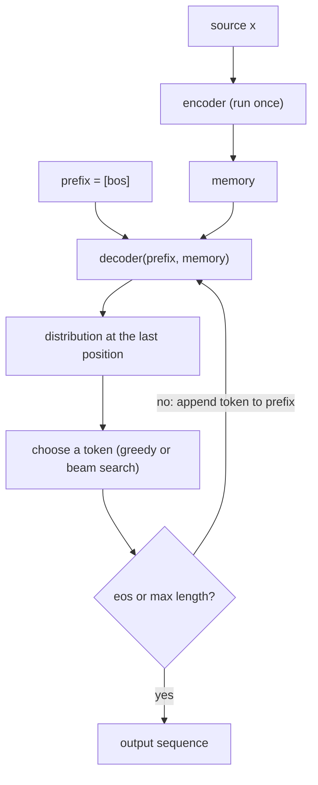
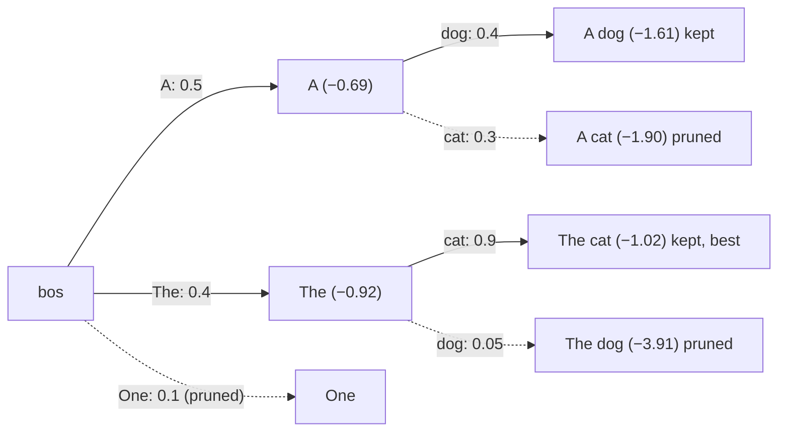

# 6.10 Decoding: From a Trained Model to an Output Sequence

A trained Transformer gives, for any source $`\mathbf{x}`$ and any target prefix $`y_{\lt t}`$, a distribution $`p_\theta(y_t \mid y_{\lt t}, \mathbf{x})`$ over the next token. Turning that into an output sentence is the job of a **decoding** procedure. This section covers autoregressive generation with an encoder-decoder model, **greedy decoding**, **beam search** and the **length penalty** that makes it work, how to avoid redundant computation, and how outputs are evaluated.

## Autoregressive generation

At inference time there is no reference target to feed the decoder. Instead, the model generates one token at a time and feeds each choice back in:

1. Run the **encoder once** on the source to get the memory $`H^{(N)}`$.
2. Start the decoder input with `<bos>`.
3. Run the decoder on the current prefix and take the distribution at the **last** position.
4. Choose a token from that distribution, append it to the prefix, and repeat from step 3.
5. Stop when the chosen token is `<eos>` or a maximum length is reached. The original Transformer set the maximum output length to the input length plus 50, stopping early when possible (Vaswani et al. 2017).



*Figure 6.10.1. Autoregressive decoding with an encoder-decoder Transformer.*

This loop is inherently sequential: token $`t+1`$ cannot be computed until token $`t`$ has been chosen. The parallelism that makes training fast (Section 9) is not available here. What remains to decide is step 4, how to choose.

The goal, in principle, is the most probable output under the model,

```math
\hat{\mathbf{y}} = \arg\max_{\mathbf{y}} \; \log p_\theta(\mathbf{y} \mid \mathbf{x}) = \arg\max_{\mathbf{y}} \sum_{t=1}^{|\mathbf{y}|} \log p_\theta(y_t \mid y_{\lt t}, \mathbf{x}).
```

With a vocabulary of $`V`$ tokens there are $`V^T`$ sequences of length $`T`$, far too many to enumerate, so decoding algorithms search this space approximately.

## Greedy decoding

**Greedy decoding** picks the single most probable token at every step:

```math
y_t = \arg\max_{k} \; p_\theta(k \mid y_{\lt t}, \mathbf{x}).
```

It is fast, needing exactly one decoder pass per output token, and deterministic. For tasks where the model is confident, it is often all that is needed. But a locally best choice need not lead to the best sequence. Suppose the most likely first word leads to continuations that are all fairly unlikely, while the second most likely first word leads to one very likely continuation; greedy decoding commits to the first word and never reconsiders. Because the decoder was trained only on correct prefixes (exposure bias, Section 9), an early mistake can also make later predictions worse.

## Beam search

**Beam search** keeps several candidates instead of one. With **beam size** $`k`$:

1. Start with one hypothesis, `[<bos>]`, with score 0.
2. At each step, extend every live hypothesis by every possible next token, scoring each extension by its total log-probability: the hypothesis's score plus $`\log p_\theta(\text{token} \mid \text{hypothesis}, \mathbf{x})`$.
3. Keep the $`k`$ best extensions. A hypothesis that ends in `<eos>` is moved to a list of finished hypotheses.
4. Stop when enough hypotheses have finished (or the length limit is reached), and return the finished hypothesis with the best final score.

With $`k = 1`$, beam search is exactly greedy decoding. Larger $`k`$ explores more of the search space at proportionally higher cost: each step runs the decoder on $`k`$ prefixes (usually batched together) instead of one.

The tree below illustrates two steps with $`k = 2`$, using made-up probabilities for a hypothetical model. Greedy decoding would take "A" (probability 0.5) at the first step. Beam search also keeps "The" (0.4), and at the second step "The cat" (total log-probability $`\log 0.4 + \log 0.9 \approx -1.02`$) beats every continuation of "A," the best of which is "A dog" ($`\log 0.5 + \log 0.4 \approx -1.61`$).



*Figure 6.10.2. Beam search with beam size 2 on a hypothetical model (illustrative probabilities; scores are total natural-log probabilities). Solid edges survive pruning; dotted edges are discarded.*

## Length bias and the length penalty

Every token adds a log-probability, which is negative, to a hypothesis's score. Longer hypotheses therefore accumulate lower scores, and plain beam search is biased toward **short** outputs: a hypothesis that ends early with `<eos>` can beat a longer, better translation simply because it has fewer negative terms. Wider beams make this worse, because they are more likely to find a short hypothesis with a high total probability.

The fix is to **normalize scores by length** before comparing finished hypotheses. The original Transformer used beam size 4 with the length penalty of Wu et al. (2016) and $`\alpha = 0.6`$ (Vaswani et al. 2017):

```math
\mathrm{score}(\mathbf{y}) = \frac{\log p_\theta(\mathbf{y} \mid \mathbf{x})}{\mathrm{lp}(\mathbf{y})}, \qquad \mathrm{lp}(\mathbf{y}) = \left(\frac{5 + |\mathbf{y}|}{5 + 1}\right)^{\alpha}.
```

With $`\alpha = 0`$ there is no normalization; with $`\alpha = 1`$ the score is close to the average log-probability per token. Values in between trade off the two, and $`\alpha`$ is tuned on a development set. Wu et al. reported that values between 0.6 and 0.7 were usually best in their system, which also added a *coverage penalty* rewarding hypotheses whose attention covers the whole source.

## Implementation

The appendix trains a small model to reverse digit sequences of variable length (as in Section 9), then implements greedy decoding and beam search with the length penalty for any model that exposes separate encode and decode steps, and compares the two. Three details of the implementation are worth noticing. The encoder runs once per source, and its memory is reused by every decoder call. The live beams are stacked into one batch so that each step is a single decoder call. And beam search with $`k = 1`$ reproduces greedy decoding exactly, a useful test when implementing beam search. On an easy task like reversal, a reasonably trained model gets nearly every example right with either method (in our run, both exceeded 95% exact match, and beam search was not better). Beam search finds hypotheses with higher model score, which is not the same thing as a correct output: if the model's probabilities are miscalibrated, a wider search can surface a high-scoring wrong answer. Its advantage shows up when the greedy path goes wrong early on harder tasks, as in translation. The fourth code lab compares the two on a harder task.

## Avoiding repeated work

The loop above reruns the decoder on the entire prefix at every step, recomputing the representations of earlier target positions each time. Two things can be reused:

- **The encoder memory** is computed once per source (as above) and shared by every step and every beam. Its keys and values in each cross-attention layer are also the same at every step, so they can be projected once and cached.
- **Earlier decoder positions** do not change when a new token is appended, because of the causal mask: position $`t`$ never sees later positions. Implementations therefore cache each decoder layer's self-attention keys and values for the positions already processed and compute only the new position at each step.

For short outputs the savings are modest; for long outputs, recomputing the prefix at every step makes total decoding work grow quadratically with output length, and caching avoids that.

## Evaluating outputs

Decoded outputs are compared with references using a task metric:

- **Exact match** for tasks with one correct answer, such as the toy reversal and date-conversion tasks in the code labs.
- **BLEU** (Papineni et al. 2002) for translation. BLEU counts how many of the output's n-grams (up to length 4) appear in the reference, combines those precisions with a geometric mean, and multiplies by a *brevity penalty* that punishes outputs shorter than the reference (otherwise a very short output with only safe words would score well). Scores are computed over a whole test set, not averaged over sentences.

BLEU scores depend on details such as tokenization and normalization of the reference, so numbers computed by different scripts are often not comparable. Post (2018) documented these differences and released **sacreBLEU**, a tool that computes BLEU on detokenized text in a standard way and reports a signature of the settings used. Reporting sacreBLEU scores with their signature makes translation results comparable across papers.

## Key takeaways

- Generation runs the encoder once, then the decoder once per output token, feeding each chosen token back in until `<eos>` or a length limit.
- Greedy decoding takes the most probable token at each step: fast, but a locally best choice can lead to a worse sequence.
- Beam search keeps the $`k`$ best partial hypotheses at each step; $`k = 1`$ is greedy decoding.
- Summed log-probabilities favor short outputs, so beam search normalizes scores with a length penalty; the original Transformer used beam size 4 and the penalty of Wu et al. with $`\alpha = 0.6`$.
- Reuse the encoder memory, and cache earlier decoder positions, to avoid redundant work.
- Evaluate with exact match on toy tasks and BLEU for translation, reported with a standard tool such as sacreBLEU.

## Appendix: Code

The snippets below reproduce the checks and results described in this section. They need only PyTorch and run on a CPU; snippets in the same appendix are meant to be run in order in one Python session.

### Training a toy model, then greedy decoding and beam search

```python
import math
import torch
import torch.nn as nn

PAD, BOS, EOS, V = 0, 1, 2, 13

class Seq2Seq(nn.Module):
    def __init__(self, d=64, h=4, N=2, max_len=40):
        super().__init__()
        self.emb = nn.Embedding(V, d)
        nn.init.normal_(self.emb.weight, std=d ** -0.5)             # tied + scaled by sqrt(d)
        pos, omega = torch.arange(max_len)[:, None], 10000 ** (-torch.arange(0, d, 2) / d)
        pe = torch.zeros(max_len, d)
        pe[:, 0::2], pe[:, 1::2] = torch.sin(pos * omega), torch.cos(pos * omega)
        self.register_buffer("pe", pe)
        self.tf = nn.Transformer(d, h, N, N, 4 * d, dropout=0.0, batch_first=True)
        self.d = d
    def embed(self, x):
        return self.emb(x) * math.sqrt(self.d) + self.pe[: x.size(1)]
    def encode(self, src):
        return self.tf.encoder(self.embed(src))                      # run once per source
    def decode(self, tgt_in, memory):
        causal = nn.Transformer.generate_square_subsequent_mask(tgt_in.size(1))
        return self.tf.decoder(self.embed(tgt_in), memory, tgt_mask=causal) @ self.emb.weight.T
    def forward(self, src, tgt_in):
        return self.decode(tgt_in, self.encode(src))

def batch(B=64, lo=4, hi=10):
    L = int(torch.randint(lo, hi + 1, ()))
    src = torch.randint(3, V, (B, L))
    tgt = src.flip(1)
    return src, torch.cat([torch.full((B, 1), BOS), tgt], 1), torch.cat([tgt, torch.full((B, 1), EOS)], 1)

torch.manual_seed(0)
model = Seq2Seq()
opt = torch.optim.Adam(model.parameters(), lr=1e-3, betas=(0.9, 0.98), eps=1e-9)
loss_fn = nn.CrossEntropyLoss(label_smoothing=0.1)
for step in range(1500):                                             # about a minute on a CPU
    src, tgt_in, labels = batch()
    loss = loss_fn(model(src, tgt_in).reshape(-1, V), labels.reshape(-1))
    opt.zero_grad(); loss.backward(); opt.step()
model.eval()

@torch.no_grad()
def greedy(model, src, max_len=30):
    memory = model.encode(src)
    ys = [BOS]
    for _ in range(max_len):
        logits = model.decode(torch.tensor([ys]), memory)[0, -1]
        ys.append(int(logits.argmax()))
        if ys[-1] == EOS:
            break
    return ys[1:]

@torch.no_grad()
def beam_search(model, src, k=4, alpha=0.6, max_len=30):
    memory = model.encode(src)
    lp = lambda n: ((5 + n) / 6) ** alpha                            # Wu et al. length penalty
    beams, finished = [([BOS], 0.0)], []
    for _ in range(max_len):
        prefixes = torch.tensor([seq for seq, _ in beams])           # all live beams in one batch
        logp = model.decode(prefixes, memory.expand(len(beams), -1, -1))[:, -1].log_softmax(-1)
        cands = [(seq + [tok], score + float(logp[i, tok]))
                 for i, (seq, score) in enumerate(beams)
                 for tok in logp[i].topk(k).indices.tolist()]
        cands.sort(key=lambda c: c[1], reverse=True)
        beams = []
        for seq, score in cands:
            if seq[-1] == EOS:
                finished.append((seq[1:], score / lp(len(seq) - 1)))
            else:
                beams.append((seq, score))
            if len(beams) == k:
                break
        if len(finished) >= k or not beams:
            break
    finished += [(seq[1:], score / lp(len(seq) - 1)) for seq, score in beams]
    return max(finished, key=lambda f: f[1])[0]

torch.manual_seed(1)
tests = [torch.randint(3, V, (1, int(torch.randint(4, 11, ())))) for _ in range(200)]
target = lambda s: s[0].flip(0).tolist() + [EOS]
acc_g = sum(greedy(model, s) == target(s) for s in tests) / len(tests)
acc_b = sum(beam_search(model, s) == target(s) for s in tests) / len(tests)
print(f"exact match: greedy {acc_g:.2f}, beam(k=4) {acc_b:.2f}")
print(all(beam_search(model, s, k=1) == greedy(model, s) for s in tests[:20]))  # k=1 is greedy
```

## Further reading

Papineni, Kishore, Salim Roukos, Todd Ward, and Wei-Jing Zhu. "BLEU: A Method for Automatic Evaluation of Machine Translation." In *Proceedings of the 40th Annual Meeting of the Association for Computational Linguistics*, 311–318, 2002. https://aclanthology.org/P02-1040/.

Post, Matt. "A Call for Clarity in Reporting BLEU Scores." In *Proceedings of the Third Conference on Machine Translation: Research Papers*, 2018. https://arxiv.org/abs/1804.08771.

Vaswani, Ashish, et al. "Attention Is All You Need." In *Advances in Neural Information Processing Systems 30*, 2017. https://arxiv.org/abs/1706.03762.

Wu, Yonghui, et al. "Google's Neural Machine Translation System: Bridging the Gap between Human and Machine Translation." arXiv preprint arXiv:1609.08144, 2016. https://arxiv.org/abs/1609.08144.
