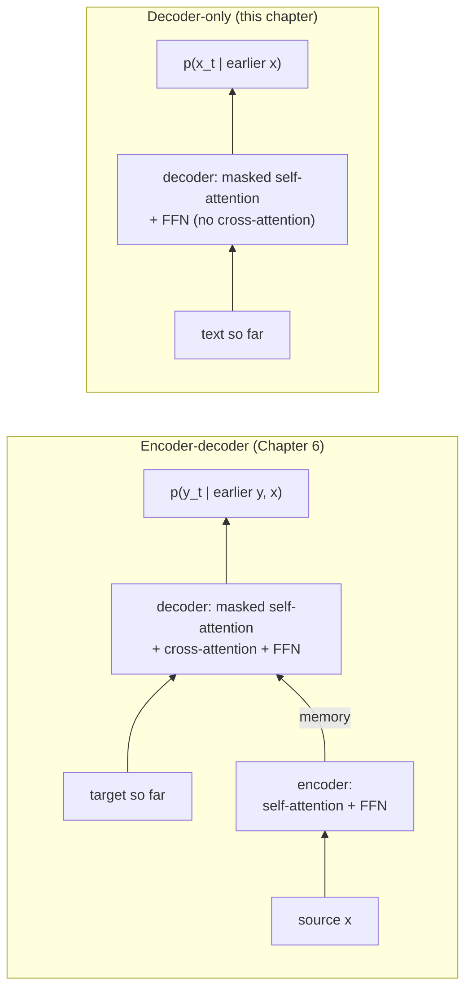
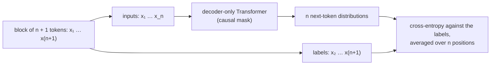

# 7.1 Language Modeling as Next-Token Prediction

Chapter 6 trained a Transformer on pairs of sentences, and someone had to write the target side of every pair: a human translation, a reference summary, a date in the other format. Take the source sentence away and what remains is a model of text alone, a **language model**, which predicts each token from the ones before it. The change looks small, but it removes the need for labels, because in ordinary text the next token is always the answer. This section writes down the objective, turns the Chapter 6 decoder into a decoder-only model, shows how teacher forcing becomes "shift the text by one token," defines the loss and perplexity, and explains why this objective could be scaled to far more data than any translation corpus.

## The chain rule for text

Take a text and tokenize it with a subword tokenizer (Chapter 5), giving a sequence $`\mathbf{x} = (x_1, \dots, x_n)`$ of token IDs from a vocabulary of size $`V`$. The chain rule of probability writes the probability of the whole sequence as a product of conditional probabilities, one per token:

```math
p_\theta(x_1, \dots, x_n) = \prod_{t=1}^{n} p_\theta(x_t \mid x_{\lt t}).
```

This is an identity, not an approximation: any distribution over sequences can be written this way. A **language model** is a network that computes each factor, a distribution over the $`V`$ possible next tokens given the **prefix** $`x_{\lt t} = (x_1, \dots, x_{t-1})`$. The first factor, $`p_\theta(x_1)`$, conditions on an empty prefix; in practice the text starts with a special token, and every prediction has something to condition on.

The formula is the factorization of Section 6.1 with the source sentence removed. The encoder-decoder model computed $`p_\theta(y_t \mid y_{\lt t}, \mathbf{x})`$, a target token given the earlier target tokens *and* the source. A language model computes $`p_\theta(x_t \mid x_{\lt t})`$: the "target" is the text itself, and there is nothing else to condition on.

Older language models truncated the prefix to make the problem tractable. An **n-gram model** assumes each token depends only on the previous $`n - 1`$ tokens and estimates the conditionals by counting; a bigram model, for example, uses $`p(x_t \mid x_{t-1})`$ and forgets everything earlier. A Transformer needs no such assumption. Attention can reach every earlier position directly (Section 6.1), so the model conditions on the whole prefix, up to its maximum context length $`n_{\max}`$.

## From encoder-decoder to decoder-only

Which parts of the Chapter 6 Transformer are needed to compute $`p_\theta(x_t \mid x_{\lt t})`$ for every $`t`$? Section 6.12 gave the answer: only the decoder.

- **The encoder goes.** There is no source sentence to read.
- **Cross-attention goes with it.** The decoder block's middle sublayer exists only to read the encoder's memory (Section 6.8); without a memory it has nothing to attend to.
- **Masked self-attention stays.** Each position must gather information from the positions before it, and the causal mask of Section 6.4 must stop it from seeing the positions after it.
- **The FFN, residual connections, and normalization stay**, along with token embeddings, positions, and the output projection to $`V`$ logits.

What remains is a stack of blocks with two sublayers each, masked self-attention and an FFN: structurally the encoder block of Section 6.7, but with the causal mask of the decoder. This **decoder-only** Transformer is the architecture of GPT and of nearly every large language model since. Section 2 assembles it in detail.



*Figure 7.1.1. Removing the source sentence removes the encoder and cross-attention. The decoder-only model predicts each token of a text from the tokens before it.*

## Teacher forcing on plain text

Section 6.9 trained the decoder with **teacher forcing**: feed the reference target shifted right by one position, and ask every position to predict the next reference token. For a language model, the input and the target are the same text, so teacher forcing becomes a simple rule. Take a block of $`n + 1`$ consecutive tokens. The inputs are the first $`n`$ tokens, $`x_1, \dots, x_n`$, and the labels are the last $`n`$, $`x_2, \dots, x_{n+1}`$. Position $`t`$ reads $`x_t`$ and must predict $`x_{t+1}`$.

Here is the arrangement for the start of the sentence "The cat sat on the mat because it was tired." with GPT-2's tokenizer, which splits it into 11 tokens ([Code 7.1.1](#code-711-shift-by-one-loss-and-perplexity-with-gpt-2) prints them):

| Position $`t`$ | 1 | 2 | 3 | 4 | 5 | … |
|---|---|---|---|---|---|---|
| Input $`x_t`$ | `The` | `␣cat` | `␣sat` | `␣on` | `␣the` | … |
| Label $`x_{t+1}`$ | `␣cat` | `␣sat` | `␣on` | `␣the` | `␣mat` | … |

(The symbol `␣` marks the leading space that GPT-2's byte-level tokens carry.) This is exactly the shifted-right arrangement of Section 6.2, with the label row and the input row cut from the same text. The `<bos>` token that started the Chapter 6 decoder is not needed: every block of $`n + 1`$ tokens supplies its own first input.

With the causal mask (Section 6.4), the output at position $`t`$ depends only on inputs $`x_1, \dots, x_t`$. So one forward pass over a block of $`n`$ inputs produces all $`n`$ conditional distributions $`p_\theta(x_{t+1} \mid x_{\le t})`$, each correctly conditioned on its own prefix, and one backward pass trains all of them. A block of 1,024 tokens gives 1,024 training signals for the cost of one pass. That is why training a language model is efficient even though generating from one (Section 5) must proceed one token at a time.



*Figure 7.1.2. Teacher forcing on plain text. The labels are the inputs shifted left by one token, and one forward pass trains every position.*

## The loss and perplexity

Training maximizes the log-probability of the training text, which is the same as minimizing the cross-entropy loss of Chapter 2 averaged over positions:

```math
\mathcal{L}(\theta) = -\frac{1}{n} \sum_{t=1}^{n} \log p_\theta(x_{t+1} \mid x_{\le t}), \qquad \mathrm{PPL} = \exp(\mathcal{L}).
```

In practice the average runs over every position of every block in a batch. Each term is an ordinary $`V`$-way classification loss, and the gradient with respect to the logits is the predicted distribution minus the one-hot label, exactly as in Chapter 2 and Section 6.9.

Two differences from the recipe of Chapter 6 are worth noting.

- **No label smoothing.** Section 6.9 smoothed the targets to keep a translation model from becoming overconfident, and noted that doing so hurts perplexity. For a language model, the predicted distribution itself is the product: Section 5 samples from it, so it should match the real distribution of next tokens as closely as possible. Pretraining uses the plain one-hot cross-entropy.
- **No padding in the loss.** Section 3 shows that pretraining text is packed into full blocks, so every position has a real label and no positions need to be ignored.

**Perplexity** is the exponential of the average loss. It has a useful interpretation: a model with perplexity $`k`$ is, on average, as uncertain as if it were choosing uniformly among $`k`$ tokens at each step. A model that predicted every token with certainty would have loss 0 and perplexity 1; a model that spread its probability evenly over the vocabulary would have perplexity $`V`$.

[Code 7.1.1](#code-711-shift-by-one-loss-and-perplexity-with-gpt-2) checks the loss on the sentence above with the released GPT-2 small model. Computing the cross-entropy of the shifted labels by hand gives 3.876 nats per token, a perplexity of about 48, and matches the loss that Hugging Face's `GPT2LMHeadModel` returns when it is given the unshifted text as labels (it shifts them internally). One short sentence is a noisy measurement, but the mechanics are the same on a whole validation set.

## Reading the numbers

Loss values mean little without reference points. Three help.

**The starting point is about $`\ln V`$.** A freshly initialized model assigns nearly equal probability to every token, so each term of the loss is close to $`-\log(1/V) = \ln V`$. For GPT-2's vocabulary of 50,257 tokens that is $`\ln 50{,}257 \approx 10.82`$ nats. A randomly initialized GPT-2 scores 11.05 on the example sentence, a little above $`\ln V`$ because its small random logits are not exactly equal. An initial loss far from $`\ln V`$, for example 40, points to a bug such as badly scaled initialization (the debugging checklist of Section 3.9; Section 6.9 made the same check).

**A simple baseline tells you whether the model has learned anything beyond local statistics.** A bigram model, which predicts each token from the previous one by counting, is the cheapest such baseline and the subject of this chapter's first code lab. [Code 7.1.2](#code-712-a-bigram-baseline-on-tiny-shakespeare) fits one on the tiny Shakespeare corpus (about 1.1 million characters, 338,025 GPT-2 tokens), holding out the last 10% for validation. With add-$`\alpha`$ smoothing, which adds a small pseudo-count $`\alpha`$ to every bigram so that unseen pairs do not get probability zero, the best of the values tried gives a validation loss of 5.86 nats (perplexity about 350), against 10.82 for the uniform model. Because $`\alpha`$ was chosen by looking at the validation loss, this slightly flatters the baseline. The gap between training loss (3.85) and validation loss shows how quickly counting overfits a small corpus. Section 4 trains a small GPT on the same data and compares it with this baseline.

**Losses are comparable only with the same tokenizer.** The loss is measured per token, and different tokenizers cut the same text into different numbers of tokens. A tokenizer with longer tokens has fewer, harder predictions per text, so its per-token loss is higher even if the model is just as good. To compare models with different tokenizers, convert the total loss on a text into **bits per byte** (Section 5.8), which divides by the length of the text in bytes rather than in tokens. On tiny Shakespeare, GPT-2's tokenizer produces 3.30 bytes per token.

Losses are usually reported in nats (natural logarithms), as here; dividing by $`\ln 2`$ converts to bits.

## Why this objective scales

The translation model of Chapter 6 learned from sentence pairs, and every pair had to be produced by a translator. Supervised data of this kind is expensive, and its size is limited by what people have labeled.

Next-token prediction needs no labels at all. Every token of every text is a training target, and the text supplies its own labels. The amount of training data is limited only by how much usable text exists and how much compute is available to process it. Web pages, books, articles, and code all qualify without any annotation. This is what made it possible to train on hundreds of billions of tokens (Section 3), and to keep improving models by making them and their data larger (Section 4).

The objective also uses the data densely. Compare **masked language modeling**, the objective of the encoder-only BERT (Section 6.12): it hides 15% of the tokens and trains the model to predict only those, so each sequence provides a loss at 15% of its positions. A causal language model receives a loss at every position of every sequence. The price is that each position sees only its left context, whereas BERT's positions see both sides; for generating text, left-to-right is exactly what is needed.

Finally, the task is hard in a useful way. Predicting the next token well requires, at various times, knowing grammar, facts about the world, the plot of the story so far, the conventions of a programming language, or the answer to an arithmetic problem stated earlier in the text. None of these are taught explicitly; they are learned because they reduce the loss.

## Pretrain, then fine-tune

Radford et al. (2018) combined these ideas into what they called **generative pretraining**, the "GP" in GPT. Their model was a 12-block decoder-only Transformer. It was first trained as a language model on the BooksCorpus, a collection of over 7,000 unpublished books chosen because it contains long stretches of contiguous text. The pretrained network was then **fine-tuned** on each of several supervised tasks (natural language inference, question answering, semantic similarity, and classification), with a small task-specific output layer and the inputs rewritten as token sequences. The same pretrained model, fine-tuned separately for each task, improved the state of the art on 9 of the 12 datasets they studied.

The lesson was that language modeling on unlabeled text learns general-purpose representations, which a small amount of labeled data can then adapt to a specific task. The same two-stage pattern appeared in BERT (Section 6.12), and it structures the rest of this book: this chapter covers pretraining, and Chapters 8 to 10 and Chapter 13 cover the adaptation that turns a pretrained model into a useful assistant. Later GPT models found that with enough scale, a pretrained model can perform many tasks with no fine-tuning at all, only a suitable prompt (Section 6).

The objective, then, is settled: predict every next token of the text, all positions at once. What exactly does the network that computes these predictions look like, and how much of Chapter 6's code carries over?

## Code for this section

The listings below collect the code for this section in the order in which the text refers to them. They need PyTorch, `tiktoken` (GPT-2's tokenizer), and Hugging Face `transformers` (which downloads the GPT-2 small weights, about 500 MB, on first use), and they run on a CPU.

### Code 7.1.1: Shift by one, loss, and perplexity with GPT-2

Cuts the example sentence into inputs and labels shifted by one token, computes the loss of the released GPT-2 small model by hand and with Hugging Face's built-in loss, and checks that an untrained GPT-2 starts near $`\ln V`$.

```python
import math
import tiktoken
import torch
import torch.nn.functional as F
from transformers import GPT2LMHeadModel, GPT2Config

enc = tiktoken.get_encoding("gpt2")
text = "The cat sat on the mat because it was tired."
ids = enc.encode(text)
print(len(ids), enc.n_vocab)                           # tokens in the text, vocabulary size V
x = torch.tensor(ids)
inputs, labels = x[:-1], x[1:]                         # a block of n + 1 tokens gives n training positions
for i, l in zip(inputs[:4].tolist(), labels[:4].tolist()):
    print(repr(enc.decode([i])), "->", repr(enc.decode([l])))

model = GPT2LMHeadModel.from_pretrained("gpt2").eval()
with torch.no_grad():
    logits = model(inputs[None]).logits[0]             # (n, V): one distribution per position
    loss = F.cross_entropy(logits, labels)             # average of -log p(x_{t+1} | x_{<=t})
    hf_loss = model(x[None], labels=x[None]).loss      # Hugging Face shifts the labels internally
print(f"loss {loss:.4f} nats, HF loss {hf_loss:.4f}, perplexity {loss.exp():.1f}")

# An untrained model spreads its probability almost evenly: loss close to ln V
torch.manual_seed(0)
untrained = GPT2LMHeadModel(GPT2Config()).eval()
with torch.no_grad():
    print(f"untrained loss {untrained(x[None], labels=x[None]).loss:.3f}, ln V = {math.log(enc.n_vocab):.3f}")
# 11 50257
# 'The' -> ' cat'
# ' cat' -> ' sat'
# ' sat' -> ' on'
# ' on' -> ' the'
# loss 3.8762 nats, HF loss 3.8762, perplexity 48.2
# untrained loss 11.048, ln V = 10.825
```

### Code 7.1.2: A bigram baseline on tiny Shakespeare

Tokenizes tiny Shakespeare with GPT-2's tokenizer, holds out the last 10% for validation, and scores add-$`\alpha`$ bigram models against the uniform model.

```python
import math, os, urllib.request
from collections import Counter
import tiktoken

url = "https://raw.githubusercontent.com/karpathy/char-rnn/master/data/tinyshakespeare/input.txt"
if not os.path.exists("input.txt"):
    urllib.request.urlretrieve(url, "input.txt")
text = open("input.txt", encoding="utf-8").read()
enc = tiktoken.get_encoding("gpt2")
ids = enc.encode(text)
split = int(0.9 * len(ids))
train, val = ids[:split], ids[split:]
V = enc.n_vocab
print(len(text), len(ids), f"{len(text.encode()) / len(ids):.2f} bytes per token")

pair = Counter(zip(train[:-1], train[1:]))             # c(a, b)
first = Counter(train[:-1])                            # c(a)

def bigram_loss(tokens, alpha):
    """Average -log p(b | a) with add-alpha smoothing over all V tokens."""
    nll = 0.0
    for a, b in zip(tokens[:-1], tokens[1:]):
        nll -= math.log((pair[(a, b)] + alpha) / (first[a] + alpha * V))
    return nll / (len(tokens) - 1)

print(f"uniform model: {math.log(V):.3f}")
for alpha in [0.1, 0.01, 0.001, 0.0001]:
    tr, va = bigram_loss(train, alpha), bigram_loss(val, alpha)
    print(f"alpha={alpha}: train {tr:.3f}, val {va:.3f} (perplexity {math.exp(va):.0f})")
# 1115394 338025 3.30 bytes per token
# uniform model: 10.825
# alpha=0.1: train 6.057, val 6.878 (perplexity 970)
# alpha=0.01: train 4.672, val 6.095 (perplexity 444)
# alpha=0.001: train 3.849, val 5.859 (perplexity 350)
# alpha=0.0001: train 3.501, val 6.074 (perplexity 435)
```

## Key takeaways

- A language model factors the probability of a text with the chain rule, predicting each token from all the tokens before it; it is the factorization of Section 6.1 without a source sentence.
- Dropping the source removes the encoder and cross-attention, leaving a decoder-only Transformer: masked self-attention and an FFN in each block.
- Teacher forcing on text is a shift by one: a block of $`n + 1`$ tokens gives inputs $`x_1, \dots, x_n`$ and labels $`x_2, \dots, x_{n+1}`$, and the causal mask trains all $`n`$ positions in one pass.
- The loss is plain cross-entropy averaged over positions; perplexity is its exponential. An untrained model starts near $`\ln V`$ (about 10.82 nats for GPT-2), and per-token losses are comparable only between models with the same tokenizer.
- Every token of any text is a label, so the data is limited only by how much text exists; this is the property that allowed language models to scale.
- Generative pretraining learns general representations from unlabeled text, which are then adapted to tasks.

## Further reading

Devlin, Jacob, Ming-Wei Chang, Kenton Lee, and Kristina Toutanova. "BERT: Pre-training of Deep Bidirectional Transformers for Language Understanding." In *Proceedings of the 2019 Conference of the North American Chapter of the Association for Computational Linguistics: Human Language Technologies*, 4171–4186, 2019. https://arxiv.org/abs/1810.04805.

Radford, Alec, Karthik Narasimhan, Tim Salimans, and Ilya Sutskever. "Improving Language Understanding by Generative Pre-Training." OpenAI technical report, 2018. https://cdn.openai.com/research-covers/language-unsupervised/language_understanding_paper.pdf.

Radford, Alec, et al. "Language Models Are Unsupervised Multitask Learners." OpenAI technical report, 2019. https://cdn.openai.com/better-language-models/language_models_are_unsupervised_multitask_learners.pdf.
