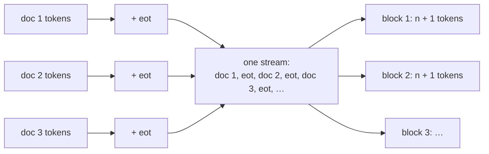

# 7.3 Pretraining Data

Section 1 showed that any text can train a language model, because the next token is always the label. That does not make all text equally good. A model learns whatever its data contains, the facts and the errors, the fluent prose and the boilerplate, the useful code and the spam, and it learns more from some text than from other text per token of compute spent. This section follows a pretraining corpus from raw sources to training blocks: where the text comes from, with GPT-2's WebText as a concrete example; how it is cleaned and deduplicated; how sources are mixed; and how documents become fixed-length blocks with the tokenizer of Chapter 5.

## Where the text comes from

Pretraining corpora combine a few kinds of sources:

- **Web crawls.** The largest source by far. **Common Crawl**, a nonprofit project that regularly crawls the web and publishes the archives, is the usual starting point; it produces about 20 TB of scraped text each month (Raffel et al. 2020). Raw crawls are mostly unusable as they stand: navigation menus, error pages, cookie notices, machine-generated spam, duplicated templates, and text in every language. Most of the work in this section goes into filtering them.
- **Books.** Long, carefully edited, contiguous text. The first GPT trained only on the BooksCorpus of over 7,000 unpublished books, chosen because its long stretches of contiguous text let the model learn to condition on long-range context (Radford et al. 2018).
- **Reference text** such as Wikipedia: well-written, factual, and broad in coverage, but small.
- **Code** from public repositories, and increasingly other specialized sources such as scientific papers and mathematics.

Each source brings different strengths, and a corpus is built by combining them in chosen proportions, as discussed below.

## An example: WebText

Radford et al. (2019) wanted web text of higher quality than a raw crawl, without filtering it by hand. Their solution was to let people do the filtering indirectly. They collected every outbound link posted on the social media site Reddit that received at least 3 karma (net upvotes), treating the karma as a heuristic signal that other users found the linked page interesting, educational, or funny. The text of the pages behind these 45 million links, after extraction from HTML, deduplication, and heuristic cleaning, formed **WebText**: slightly over 8 million documents and 40 GB of text. They also removed all Wikipedia articles, since Wikipedia is a common source for evaluation datasets and its presence could complicate the analysis of what the model had seen.

WebText illustrates the central tension of pretraining data. Quality filtering, here by crowd approval, improves what the model learns, but every filter also removes data, and scale matters too. GPT-3's training set (Brown et al. 2020) used an expanded WebText as one of its high-quality sources, but most of its tokens came from a filtered version of Common Crawl.

## Cleaning

Turning raw web pages into training text involves a pipeline of filters. The details vary between projects, but the main steps recur.

**Text extraction and language identification.** HTML is stripped to its main text, and a language classifier labels each document. An English-only corpus keeps documents classified as English with high confidence; the C4 corpus of Raffel et al. (2020), for example, kept pages classified as English with probability at least 0.99. Multilingual corpora use the labels to balance languages instead.

**Heuristic quality filters.** Simple rules remove much of the junk. C4 kept only lines ending in terminal punctuation, discarded pages with fewer than 3 sentences, kept only lines with at least 5 words, and removed pages containing "lorem ipsum" placeholder text, pages containing a curly bracket (a sign of code in what should be natural language), and pages containing words from a list of obscene or offensive words (Raffel et al. 2020). Rules like these are cheap and transparent, but blunt. The bad-words filter, for instance, also removes legitimate pages that mention the listed words.

**Classifier-based quality filters.** A learned classifier can score how much a document resembles known high-quality text. GPT-3's Common Crawl filter was a logistic-regression classifier trained to distinguish curated corpora (WebText, Wikipedia, and books) from raw Common Crawl; documents were then kept with a probability that favored high scores but still admitted some low-scoring ones, to preserve diversity (Brown et al. 2020). Filtering 45 TB of compressed Common Crawl text this way left 570 GB. The risk of such filters is that "resembles the reference corpus" is not the same as "good": they can over-represent the styles and topics of the reference and under-represent everything else.

**Removing personal information and unwanted content.** Pipelines commonly detect and remove or mask personal data such as email addresses and phone numbers, and filter content such as spam, adult content, and hate speech, using lists, rules, and classifiers. These filters matter for privacy and safety, and every one of them also shapes which dialects, communities, and topics are represented in the data.

**Removing benchmark test sets.** If a benchmark's test questions appear in the training data, the model may simply have memorized the answers, and its score no longer measures what it can do on unseen examples. This is called **contamination**. Pipelines search for overlaps between the training data and the test sets of benchmarks they intend to evaluate on, typically by matching long n-grams, and remove them. It is harder than it sounds: Brown et al. (2020) searched for and attempted to remove such overlaps for GPT-3, but a bug caused some to be missed, and since retraining was too expensive they instead measured how much the remaining overlaps affected each benchmark. Chapter 12 returns to contamination in evaluation.

## Deduplication

The web is full of repetition: mirrored sites, syndicated news articles, license text, templates, and pages that differ only in a date or a product name. Duplicated text is harmful for two reasons (Lee et al. 2022). It **wastes compute**, since the model spends training steps on text it has already seen. And it makes **memorization** more likely: text that appears many times is more likely to be reproduced verbatim by the model. Lee et al. found, for example, a single 61-word English sentence repeated 61,036 times in C4. They reported that over 1% of the tokens emitted unprompted by models trained on standard datasets were part of memorized sequences, and that training on deduplicated data reduced the rate of emitting memorized text by a factor of about 10, while needing fewer training steps to reach the same or better accuracy. Deduplication also reduced train-test overlap, which affected over 4% of the validation sets of the standard datasets they studied.

Deduplication happens at two levels.

- **Exact duplicates** are found by hashing. Normalize each document (for example, lowercase it and collapse whitespace), compute a hash such as SHA-256, and keep one document per hash. Lee et al. went further and removed exact duplicate *substrings* shared between documents: using a **suffix array** of the whole corpus, they found and removed every repeated span of at least 50 tokens.
- **Near duplicates** differ by a few words: a changed date, a different header, a fixed typo. Hashing the whole document misses them. The standard tool is **MinHash** (Broder 1997). Represent each document by its set of **shingles**, the overlapping word n-grams it contains, and measure the similarity of two documents by the **Jaccard index** of their sets, $`J(A, B) = |A \cap B| / |A \cup B|`$. Comparing every pair of documents is impossible at the scale of billions of documents, so MinHash computes a short **signature** for each document: for each of many hash functions, the minimum hash value over the document's shingles. The probability that two documents have the same minimum under a random hash function equals their Jaccard index, so the fraction of matching signature entries estimates it. Locality-sensitive hashing then groups signatures so that only documents likely to be similar are compared. Lee et al. used 5-gram shingles and signatures of 9,000 hashes, and treated two documents as duplicates if they were matched this way and their edit similarity exceeded 0.8; GPT-3 used MinHash to remove near duplicates within each of its datasets, and to remove WebText documents from Common Crawl, which reduced the datasets' size by an average of 10% (Brown et al. 2020).

[Code 7.3.1](#code-731-exact-and-near-duplicate-detection) runs both steps on a toy collection of five documents. Exact hashing after whitespace normalization removes a copy that differs only in spacing. For a pair that differs in one word, the Jaccard index of their word 3-gram sets is 0.80, and a 128-hash MinHash signature estimates it as 0.83.

## The data mixture

A corpus is a mixture of sources, and the model does not have to see them in proportion to their sizes. Training samples each batch from the sources with chosen weights, so that small, high-quality sources are seen more often than large, noisy ones. GPT-3 is the standard illustration (Brown et al. 2020, Table 2.2):

| Dataset | Tokens | Weight in training mix | Epochs over 300B training tokens |
|---|---|---|---|
| Common Crawl (filtered) | 410 billion | 60% | 0.44 |
| WebText2 | 19 billion | 22% | 2.9 |
| Books1 | 12 billion | 8% | 1.9 |
| Books2 | 55 billion | 8% | 0.43 |
| Wikipedia | 3 billion | 3% | 3.4 |

Common Crawl provided 82% of the available tokens but only 60% of the training mix, and fewer than half of its tokens were seen at all during training. Wikipedia and WebText2 were seen about three times each. Brown et al. described this as accepting a small amount of overfitting in exchange for higher-quality training data. Choosing the weights is largely empirical: train small models on candidate mixtures, compare their losses on a range of held-out data and their benchmark scores, and use what works. The mixture determines much of what a model knows. A model that sees little code during pretraining, for example, has little chance to become good at programming.

## From documents to training examples

The final step turns cleaned documents into the fixed-length blocks of $`n + 1`$ tokens that Section 1 trains on:

1. **Tokenize** each document with the tokenizer of Chapter 5.
2. **Append an end-of-text token** to each document. In GPT-2's vocabulary this is `<|endoftext|>`, token 50,256, the last of the 50,257 IDs.
3. **Concatenate** all documents into one long stream of tokens, shuffling the order of documents.
4. **Cut** the stream into consecutive blocks of $`n + 1`$ tokens. Each block gives inputs $`x_1, \dots, x_n`$ and labels $`x_2, \dots, x_{n+1}`$. The final partial block is dropped. (With consecutive, non-overlapping blocks, the one prediction that spans each block boundary is never trained, a negligible loss when $`n`$ is large.)

This is called **packing**. A block may contain the end of one document, an end-of-text token, and the beginning of the next; a long document is spread over many blocks. The benefit is that **every position of every block is a real token**. There is no padding, so the padding masks of Section 6.4 are not needed, no compute is wasted on padding positions, and the length bucketing of Section 6.9, which grouped sentence pairs of similar length to reduce padding, has no purpose. Every batch has exactly $`B \times n`$ training positions. GPT-3, for example, trained on sequences of the full 2,048-token context, packing multiple documents into one sequence when documents were shorter (Brown et al. 2020).



*Figure 7.3.1. Packing. Documents separated by end-of-text tokens are concatenated and cut into fixed-length blocks, which may cross document boundaries.*

In [Code 7.3.2](#code-732-packing-documents-into-blocks), the four documents that survive deduplication become a stream of 79 tokens, which is cut into 8 blocks of 9 tokens ($`n = 8`$), dropping the last 7 tokens. One of these blocks reads "is measured in tokens. `<|endoftext|>` The museum": the end of one document and the start of another.

## A detail of packing: attention across documents

Look again at that block. With the plain causal mask of Section 6.4, the token "museum" can attend to "is measured in tokens.", text from an unrelated document. Is that a problem?

Mostly not. The end-of-text token tells the model that what follows is unrelated, and the model learns to make little use of attention across it. GPT-3 did exactly this: sequences with multiple documents were not masked in any special way, and the end-of-text delimiter gave the model the information it needed (Brown et al. 2020). The cost is that some capacity and compute go to attention that carries no useful information, and that the first tokens of a document are predicted from a context full of unrelated text rather than from an empty one.

The alternative is a **block-diagonal causal mask**: a token may attend to an earlier token only if both belong to the same document. It is built by giving each position a document index (a running count of end-of-text tokens) and allowing position $`t`$ to attend to position $`s`$ only if $`s \le t`$ and both have the same index. This is a combination of masks in the sense of Section 6.4: the causal mask AND a same-document mask. For the block above, the first six positions (the end of the first document and its end-of-text token) form one lower-triangular block, and the last two positions ("The museum") form another, with no connections between them. [Code 7.3.3](#code-733-a-block-diagonal-causal-mask-and-its-leak-test) builds this mask and runs the leak test of Section 6.4: overwriting tokens of the previous document leaves the attention outputs of the next document unchanged. The cost is simplicity: the mask differs for every block, so it must be built and passed to the attention computation instead of using a fixed causal mask, and efficient attention kernels need explicit support for variable-length segments.

## Measuring data in tokens

Corpus sizes are quoted in several units: documents (8 million for WebText), bytes (40 GB for WebText, 570 GB for GPT-3's filtered Common Crawl), and tokens. For training, **tokens** are the unit that matters. The number of training tokens $`D`$ sets the training compute, which is about $`6PD`$ for a model with $`P`$ parameters (Section 4), and the scaling laws of Section 4 are expressed in tokens.

Converting between units requires the tokenizer's compression rate, which depends on both the tokenizer and the text (Chapter 5). GPT-2's tokenizer averages 3.30 bytes per token on the tiny Shakespeare corpus (Section 1), but the rate differs for other languages, for code, and for other tokenizers. Conversions from bytes are therefore only rough, and a dataset described in bytes should be tokenized before planning a training run.

The data is now a long stream of tokens, cut into blocks, ready to train on. How should the optimization be set up for a run over hundreds of billions of such tokens, and, for a fixed compute budget, how large should the model be and how many tokens should it see?

## Code for this section

The listings below collect the code for this section in the order in which the text refers to them. They need PyTorch and `tiktoken` and run on a CPU; later listings reuse definitions from earlier ones, so run them in order in one Python session.

### Code 7.3.1: Exact and near-duplicate detection

Builds five toy documents, one a whitespace variant and one a one-word variant of another. Exact deduplication hashes a normalized copy of each document; near-duplicate detection compares word 3-gram sets by their Jaccard index and estimates it with a 128-hash MinHash signature. The MinHash uses salted MD5 hashes for clarity; production implementations use fast non-cryptographic hash families and locality-sensitive hashing to avoid comparing every pair of signatures.

```python
import hashlib, re
import torch
import tiktoken

enc = tiktoken.get_encoding("gpt2")
EOT = enc.eot_token                                     # <|endoftext|>, id 50256
page = ("The museum is open from nine in the morning until five in the evening, "
        "and admission is free for children under twelve and for students with a valid card.")
docs = [page,
        "Pretraining data is measured in tokens.",
        page.replace(" ", "  "),                          # duplicate up to whitespace
        page.replace("five", "six"),                      # near duplicate: one word changed
        "A short one."]

# Exact deduplication: hash a normalized copy of each document
def normalize(s):
    return re.sub(r"\s+", " ", s.lower()).strip()
seen, unique = set(), []
for doc in docs:
    key = hashlib.sha256(normalize(doc).encode()).hexdigest()
    if key not in seen:
        seen.add(key); unique.append(doc)
print(len(docs), "->", len(unique), "documents after exact dedup")

# Near-duplicate detection: Jaccard similarity of word 3-gram sets, estimated with MinHash
def shingles(s, k=3):
    w = re.findall(r"\w+", s.lower())
    return {" ".join(w[i:i + k]) for i in range(len(w) - k + 1)}
def minhash(sh, num_hashes=128):
    return [min(int(hashlib.md5(f"{i}:{g}".encode()).hexdigest()[:8], 16) for g in sh)
            for i in range(num_hashes)]
a, b = shingles(unique[0]), shingles(unique[2])
jaccard = len(a & b) / len(a | b)
ma, mb = minhash(a), minhash(b)
estimate = sum(x == y for x, y in zip(ma, mb)) / len(ma)
print(f"Jaccard {jaccard:.2f}, MinHash estimate {estimate:.2f}")
# 5 -> 4 documents after exact dedup
# Jaccard 0.80, MinHash estimate 0.83
```

### Code 7.3.2: Packing documents into blocks

Appends GPT-2's end-of-text token to each surviving document, concatenates them, and cuts the stream into blocks of $`n + 1 = 9`$ tokens. It reuses the definitions of Code 7.3.1.

```python
# Packing: append <|endoftext|> to each document, concatenate, cut into blocks of n + 1 tokens
stream = []
for doc in unique:
    stream += enc.encode(doc) + [EOT]
n = 8
blocks = torch.tensor(stream[: len(stream) // (n + 1) * (n + 1)]).view(-1, n + 1)
inputs, labels = blocks[:, :-1], blocks[:, 1:]
print(len(stream), "tokens ->", tuple(blocks.shape), "blocks; dropped", len(stream) % (n + 1))
print([enc.decode([t]) for t in inputs[4].tolist()])
# 79 tokens -> (8, 9) blocks; dropped 7
# [' is', ' measured', ' in', ' tokens', '.', '<|endoftext|>', 'The', ' museum']
```

### Code 7.3.3: A block-diagonal causal mask and its leak test

Builds the block-diagonal causal mask for the block that crosses a document boundary, then checks with a toy attention layer that overwriting tokens of the previous document leaves the outputs for the next document unchanged. It reuses the definitions of Code 7.3.1 and 7.3.2.

```python
# A block-diagonal causal mask: a token may attend only to earlier tokens of its own document
def document_causal_mask(tokens, eot=EOT):
    doc_id = torch.cumsum((tokens == eot).long(), dim=-1)
    doc_id = doc_id - (tokens == eot).long()            # an EOT token belongs to the document it ends
    same_doc = doc_id[:, :, None] == doc_id[:, None, :]
    causal = torch.tril(torch.ones(tokens.size(-1), tokens.size(-1), dtype=torch.bool))
    return same_doc & causal                            # True = allowed
print(document_causal_mask(inputs[4:5])[0].int())

# Leak test: with the document mask, changing the previous document leaves the next one unchanged
torch.manual_seed(0)
emb = torch.nn.Embedding(enc.n_vocab, 16)
def attend(tok):
    x = emb(tok)
    scores = (x @ x.transpose(-2, -1)).masked_fill(~document_causal_mask(tok), float("-inf"))
    return scores.softmax(-1) @ x
x = inputs[4:5]
x2 = x.clone(); x2[0, :2] = 1000                        # overwrite tokens of the previous document
start = int((x[0] == EOT).nonzero()[0]) + 1             # first position of the next document
print(torch.allclose(attend(x)[0, start:], attend(x2)[0, start:]))
# tensor([[1, 0, 0, 0, 0, 0, 0, 0],
#         [1, 1, 0, 0, 0, 0, 0, 0],
#         [1, 1, 1, 0, 0, 0, 0, 0],
#         [1, 1, 1, 1, 0, 0, 0, 0],
#         [1, 1, 1, 1, 1, 0, 0, 0],
#         [1, 1, 1, 1, 1, 1, 0, 0],
#         [0, 0, 0, 0, 0, 0, 1, 0],
#         [0, 0, 0, 0, 0, 0, 1, 1]], dtype=torch.int32)
# True
```

## Key takeaways

- Pretraining corpora combine filtered web crawls (mostly Common Crawl), books, reference text such as Wikipedia, and code.
- GPT-2's WebText used Reddit links with at least 3 karma as a human quality filter: about 8 million documents and 40 GB of text.
- Cleaning includes text extraction, language identification, heuristic and classifier-based quality filters, removal of personal information and unwanted content, and removal of benchmark test sets to avoid contamination.
- Deduplication, exact (hashing, suffix arrays) and near-duplicate (MinHash over shingles), saves compute and reduces memorization.
- Sources are sampled with weights that differ from their sizes, so small high-quality sources are seen several times and large noisy ones less than once.
- Documents are tokenized, separated by an end-of-text token, concatenated, and packed into blocks of $`n + 1`$ tokens with no padding; a block-diagonal mask can stop attention across document boundaries, but many models, GPT-3 among them, rely on the end-of-text token instead.
- Training data is measured in tokens, the unit of both compute and scaling laws.

## Further reading

Broder, Andrei Z. "On the Resemblance and Containment of Documents." In *Proceedings of Compression and Complexity of SEQUENCES 1997*, 21–29. IEEE, 1997.

Brown, Tom B., et al. "Language Models Are Few-Shot Learners." In *Advances in Neural Information Processing Systems 33*, 2020. https://arxiv.org/abs/2005.14165.

Lee, Katherine, et al. "Deduplicating Training Data Makes Language Models Better." In *Proceedings of the 60th Annual Meeting of the Association for Computational Linguistics*, 2022. https://arxiv.org/abs/2107.06499.

Radford, Alec, Karthik Narasimhan, Tim Salimans, and Ilya Sutskever. "Improving Language Understanding by Generative Pre-Training." OpenAI technical report, 2018. https://cdn.openai.com/research-covers/language-unsupervised/language_understanding_paper.pdf.

Radford, Alec, et al. "Language Models Are Unsupervised Multitask Learners." OpenAI technical report, 2019. https://cdn.openai.com/better-language-models/language_models_are_unsupervised_multitask_learners.pdf.

Raffel, Colin, et al. "Exploring the Limits of Transfer Learning with a Unified Text-to-Text Transformer." *Journal of Machine Learning Research* 21, no. 140 (2020): 1–67. https://arxiv.org/abs/1910.10683.
