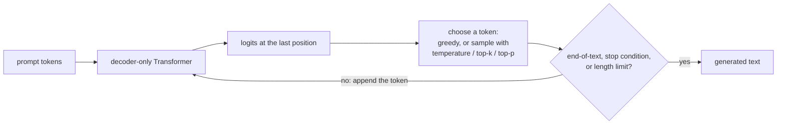
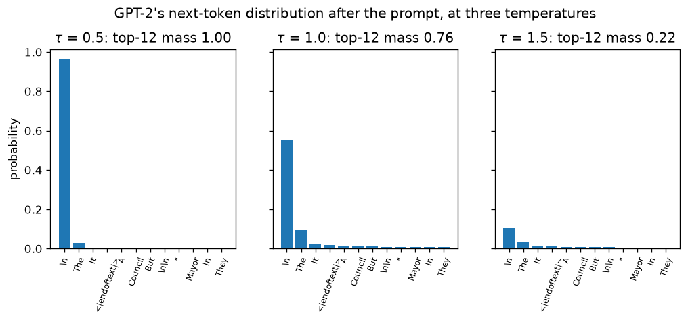
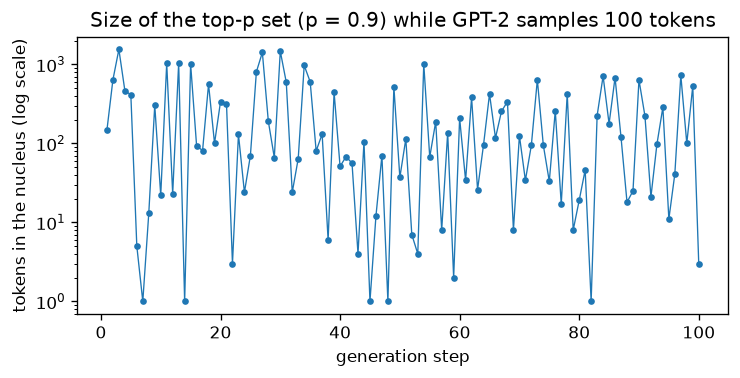

# 7.5 Generating Text

Section 4 ended with a trained model: a set of weights that, given any prefix, assigns a probability to each of the $`V`$ possible next tokens. A distribution is not yet text. To write, the model must be run in a loop that turns each distribution into one chosen token, appends it, and asks again. Section 6.10 built that loop for translation and chose tokens with greedy decoding and beam search, which look for the most probable output. For open-ended writing, the most probable output turns out to be a poor goal: it is dull and repetitive. This section adapts the loop to a decoder-only model, shows why maximizing probability fails for open-ended text, and introduces the three settings that control sampling in practice, **temperature**, **top-k**, and **top-p**. We try each of them on the mini GPT of Section 4 and on the released GPT-2 small.

## The generation loop without an encoder

The autoregressive loop of Section 6.10 ran the decoder once per output token, each time conditioning on the encoder's memory of the source and on the target tokens produced so far. A decoder-only model has no source and no memory; the text it is continuing plays both roles. Generation therefore starts from a **prompt**, a sequence of tokens supplied by the user, and repeats four steps:

1. Run the model on the tokens so far (the prompt plus everything generated).
2. Take the logits $`\mathbf{o} \in \mathbb{R}^{V}`$ at the *last* position, the model's prediction for the token that comes next.
3. Choose a token from the distribution $`\mathrm{softmax}(\mathbf{o})`$.
4. Append it to the sequence and go back to step 1.

The loop stops when the model produces the end-of-text token (which separated documents during training, Section 3), when the output matches a stop condition set by the application, such as a maximum number of new tokens or a particular string, or when the sequence reaches the context limit $`n_{\max}`$. At that limit the model has no position embedding for the next token. A simple program can keep going by feeding only the last $`n_{\max}`$ tokens, a sliding window that forgets the start of the text; our mini GPT, with $`n_{\max} = 128`$, generates this way in [Code 7.5.3](#code-753-generating-from-the-mini-gpt).

Only step 3 is new. Section 6.10 made the choice deterministically, and the rest of this section is about making it well. The loop also shows a basic asymmetry. Training processes all positions of a block in one parallel pass (Section 1), but generation is sequential: token $`t + 1`$ cannot be computed until token $`t`$ has been chosen. The first pass over the prompt is parallel, like a training step, and every later pass adds one token.



*Figure 7.5.1. The generation loop of a decoder-only model. The prompt takes the place of both the source and the target prefix of Section 6.10; only the choice of the next token differs between decoding methods.*

## Why the most probable text is the wrong goal

The simplest choice in step 3 is the one Section 6.10 started with: **greedy decoding**, which takes the most probable token every time. Beam search keeps several candidate sequences and returns the one with the highest total log-probability, a better approximation to the single most probable output. For translation that is the right goal, because the source sentence pins down what a good output says and the most probable translation is usually a good one.

Open-ended generation is different. A prompt such as the opening of a news story can be continued in countless reasonable ways, and the goal is not the single most probable continuation but one that reads like text a person might have written. Here the search for high probability backfires. [Code 7.5.2](#code-752-greedy-beam-search-and-sampling-with-gpt-2) gives GPT-2 small the prompt "The city council met on Tuesday night to discuss the plan for the new park." and asks for 60 new tokens. Greedy decoding (our loop, whose output matches Hugging Face's greedy `generate` token for token) produces:

> The city council voted to approve the plan for the new park on Tuesday night. (CBC)
>
> The city council voted to approve the plan for the new park on Tuesday night.
>
> The city council voted to approve the plan for the new park on Tuesday night.
>
> The

Beam search with 5 beams does not escape the problem; it finds a different loop:

> "I think it's a good idea, and I think it's a good idea for the future of the park," Councillor Doug Ford said.
>
> "I think it's a good idea, and I think it's a good idea for the future of the park."

(The quotation and its attribution are made up by the model, a first sign of the problem Section 6 returns to.) To measure the repetition, count the fraction of 4-grams, runs of four consecutive tokens, that already occurred earlier in the same output. It is 0.58 for the greedy output and 0.44 for the beam-search output. The mini GPT of Section 4 does the same on a smaller scale: started from "ROMEO:" and decoded greedily, it writes "And I have not the king," three times in a row ([Code 7.5.3](#code-753-generating-from-the-mini-gpt)).

Holtzman et al. (2020) studied this failure, which they called **neural text degeneration**: decoding methods that maximize probability, such as beam search, produce output that is "bland, incoherent, or gets stuck in repetitive loops," even with a model as large as GPT-2 Large. Two observations explain it.

- **Repetition reinforces itself.** Once a phrase has appeared, the model assigns a higher probability to repeating it, and each repetition raises the probability further. Holtzman et al. measured this positive feedback loop for the vast majority of phrases they tested. A procedure that always picks the most likely next token follows the loop wherever it starts.
- **Human text is not the most probable text.** The model assigns high probability to well-formed text, but the highest-scoring long texts are, in Holtzman et al.'s words, "generic, repetitive, and awkward." Real text keeps surprising the model a little at every step: people choose words that are plausible but not always the most likely one. Holtzman et al. show that the probability the model assigns to each token of human text varies much more from token to token than it does for beam-search output, which keeps choosing high-probability tokens as it repeats itself.

The alternative is to **sample**: draw the next token at random from the model's distribution $`\mathrm{softmax}(\mathbf{o})`$, so that each token is chosen with the probability the model gives it. If the model's distribution matched the distribution of human text exactly, sampling would produce text statistically indistinguishable from human text, surprises included. This is also why pretraining does without label smoothing (Section 1): the distribution itself is what generation uses.

Pure sampling from the full distribution fixes the repetition. Over 10 samples of 60 tokens from GPT-2, the average fraction of repeated 4-grams rounds to 0.00. But it overshoots in the other direction. The model's distribution has a long tail of tens of thousands of tokens, each with a small probability, that together hold a noticeable share of the mass, and pure sampling picks one of them fairly often. Holtzman et al. blame this "unreliable tail" for the incoherence of pure sampling: once an implausible token has been chosen, the model must continue from it, and the text drifts. Code 7.5.2 shows the effect in miniature. With the same random seed, a pure sample and a top-p sample (introduced below) draw the same tokens as long as the draws land on likely tokens, and both begin:

> The existing seven-story building has been "tree-lined" on both sides, and new condos would include retail and restaurants.
>
> The change would lower parking in a large downtown

Where the top-p sample continues with "area", the model's top choice at probability 0.22, the pure sample draws "spike", which [Code 7.5.4](#code-754-where-the-pure-sample-left-the-nucleus) finds to be only the 2,444th most likely token, with probability $`4.4 \times 10^{-6}`$, far outside the 317 tokens that top-p sampling with $`p = 0.95`$ would have considered. The pure sample writes "spike zone." and then ends the text with an end-of-text token. The top-p sample, which never considers the tail, carries on for the full 60 tokens. Neither continuation is great journalism, since GPT-2 small is a small model, but only the pure sample produced a phrase that no writer would.

Every practical decoding method for open-ended text is a compromise between these extremes: sample, so that the output varies and does not loop, but reduce the chance of drawing from the unreliable tail. The three settings below do this in different ways.

## Temperature

The first setting reshapes the whole distribution. **Temperature** $`\tau \gt 0`$ divides the logits before the softmax:

```math
p_\tau(i) = \frac{\exp(o_i / \tau)}{\sum_{j=1}^{V} \exp(o_j / \tau)}.
```

At $`\tau = 1`$ this is the model's own distribution. Dividing by $`\tau \lt 1`$ stretches the gaps between logits, so the most probable tokens gain probability and the rest lose it; as $`\tau \to 0`$, all the probability goes to the largest logit and sampling becomes greedy decoding. Dividing by $`\tau \gt 1`$ shrinks the gaps and flattens the distribution; as $`\tau \to \infty`$ it becomes uniform over the vocabulary. Temperature never changes the *order* of the tokens, only how sharply probability is concentrated on the top of the list. The name comes from statistical physics, where the same formula, the Boltzmann distribution, gives the probability of a state with energy $`-o_i`$ at temperature $`\tau`$.

A toy vocabulary of five tokens with logits $`(3, 2, 1, 0.5, -1)`$ shows the effect ([Code 7.5.1](#code-751-temperature-top-k-and-top-p)). At $`\tau = 1`$ the most probable token has probability 0.624. At $`\tau = 0.5`$ it has 0.862, and the last two tokens are nearly impossible; at $`\tau = 2`$ it has only 0.417, and the least likely token rises from 0.011 to 0.056.

Figure 7.5.2 shows the same effect on GPT-2's distribution for the token after the prompt "The city council met on Tuesday night to discuss the plan for the new park." At $`\tau = 1`$, a newline is the most likely continuation with probability 0.551, and the 12 most likely tokens together hold 0.76 of the probability. At $`\tau = 0.5`$ the newline takes 0.966 and the top 12 hold essentially everything; at $`\tau = 1.5`$ the newline falls to 0.106, and the top 12 hold only 0.22, because the other 50,245 tokens, each individually unlikely, now hold most of the mass together. (The fourth most likely token at every temperature is the end-of-text token: after one sentence, GPT-2 considers it plausible that the document is over.)



*Figure 7.5.2. Temperature reshapes GPT-2's next-token distribution without changing the order of the tokens. Low temperature concentrates probability on the top tokens; high temperature moves it into the long tail.*

Lowering the temperature is the simplest way to trade diversity for coherence, and values between about 0.7 and 1 are common for open-ended writing. It is a blunt tool, though. Holtzman et al. (2020) point out that temperature controls the shape of the distribution without sufficiently suppressing the unreliable tail: a temperature low enough to make tail tokens rare also makes the text more repetitive, moving back toward the greedy behavior we were trying to avoid. The remaining two settings cut the tail off instead of shrinking it.

## Top-k sampling

**Top-k sampling** keeps only the $`k`$ most probable tokens, sets the probability of every other token to zero, renormalizes, and samples (Fan et al. 2018). If $`V^{(k)}`$ is the set of the $`k`$ tokens with the largest logits,

```math
p_k(i) = \begin{cases} \dfrac{p(i)}{\sum_{j \in V^{(k)}} p(j)} & \text{if } i \in V^{(k)}, \\ 0 & \text{otherwise.} \end{cases}
```

With $`k = 1`$ this is greedy decoding, and with $`k = V`$ it is pure sampling. In the toy example, $`k = 2`$ keeps the tokens with probabilities 0.624 and 0.229 and rescales them to 0.731 and 0.269; 10,000 draws from our implementation produce frequencies of 0.734 and 0.266. Fan et al. generated stories by sampling from the 10 most likely tokens, and the samples shown in the GPT-2 paper were generated with $`k = 40`$ (Radford et al. 2019).

A fixed $`k`$ ignores how confident the model is. Where the context leaves only one or two sensible continuations, as after "The capital of France is", a setting such as $`k = 40`$ lets dozens of poor candidates back in, their chances raised by the renormalization. Where hundreds of continuations are reasonable, as after "My favorite food is", a setting such as $`k = 10`$ arbitrarily discards most of them. Holtzman et al. (2020) make this argument: if $`k`$ is small, some contexts get bland or generic text, and if $`k`$ is large, the candidate set of other contexts includes inappropriate tokens.

## Top-p (nucleus) sampling

**Top-p sampling**, also called **nucleus sampling**, fixes the probability mass to keep instead of the number of tokens (Holtzman et al. 2020). Sort the tokens by probability and keep the smallest set whose total probability reaches $`p`$:

```math
V^{(p)} = \text{smallest set such that} \sum_{i \in V^{(p)}} p(i) \ge p,
```

then renormalize over $`V^{(p)}`$ and sample, just as top-k does over $`V^{(k)}`$. The set is called the **nucleus**. In the toy example with $`p = 0.9`$, the first two tokens hold 0.853, not enough, and the first three hold 0.937, so the nucleus has three tokens, renormalized to 0.666, 0.244, and 0.090; the sampled frequencies are 0.666, 0.246, and 0.088.

The size of the nucleus adapts to the model's confidence. When one token dominates, the nucleus shrinks to that token and top-p sampling behaves like greedy decoding; when the distribution is flat, the nucleus grows to include many reasonable candidates. Figure 7.5.3 tracks the nucleus while GPT-2 samples 100 tokens after the city-council prompt with $`p = 0.9`$. Its size ranges from 1 token, at 5 of the 100 steps, to 1,544 tokens, with a median of 98, changing by factors of a hundred from one step to the next. No single value of $`k`$ could match both extremes. Holtzman et al. describe the nucleus as a small subset of the vocabulary that tends to range between one and a thousand candidates, which is what we see here.



*Figure 7.5.3. The size of the top-p set ($`p = 0.9`$) at each step while GPT-2 small samples 100 tokens. The candidate set contracts to a single token where the continuation is nearly certain and expands to hundreds where many continuations are plausible.*

## Combining the settings

The three settings can be used together, and most generation libraries apply them in sequence to the logits of each step: divide by the temperature, then keep the top $`k`$, then keep the nucleus of what remains, and sample. Our `sample_next` in [Code 7.5.1](#code-751-temperature-top-k-and-top-p) follows that order, and treats a temperature of 0 as greedy decoding. Typical settings for open-ended text use one truncation, top-k or top-p, with a temperature at or somewhat below 1.

How do the settings trade diversity against coherence? Code 7.5.2 generates 10 continuations of 60 tokens for the city-council prompt with each setting and measures two things: the fraction of repeated 4-grams within each continuation, as above, and **distinct-2**, the number of different token pairs across all 10 continuations divided by the total number of pairs, a common measure of diversity (higher means more varied).

| Decoding | Repeated 4-grams | Distinct-2 (10 samples) |
|---|---|---|
| Greedy | 0.58 | (one output) |
| Beam search, 5 beams | 0.44 | (one output) |
| Pure sampling | 0.00 | 0.91 |
| Temperature 0.7 | 0.00 | 0.81 |
| Top-k, $`k = 40`$ | 0.00 | 0.87 |
| Top-p, $`p = 0.95`$ | 0.00 | 0.88 |

All four sampling methods remove the loops that greedy decoding and beam search fall into. Among them, pure sampling is the most diverse, and each form of truncation gives up some of that diversity: temperature 0.7 the most, top-k and top-p a little. What the numbers cannot show is the other side of the trade, coherence, which is exactly what truncation buys, as the "spike zone" example showed. Measuring coherence needs human judgment or another model. Holtzman et al. (2020) used an evaluation that combines human judgments with the model's probabilities to assess quality and diversity together, and by that measure nucleus sampling was the best of the methods they compared. Ten short samples from one prompt are a small experiment, so the differences among the sampling methods here should be read as illustrative, not as a ranking.

Temperatures above 1 push in the opposite direction. The mini GPT shows how quickly coherence goes when the tail is amplified. With top-p sampling at $`p = 0.9`$, it produces text with the shape of a play and roughly English phrases, though with little sense:

> ROMEO:
> KING HENRY VI:
> I so Clifford! and be what I say he's the prince.

At temperature 1.5 with no truncation, the same seed produces a fragment of a word, then something close to random tokens:

> ROMEO:
> KINGSound trumpet for the raised together from soguby and be ancestors laceBR treasury dram nothing? yet would scared poison

Finally, **reproducibility**. Sampling makes generation random, which is what we want for variety but not for debugging, testing, or writing a book whose outputs readers can check. Fixing the seed of the random number generator makes the sequence of draws, and therefore the output, repeatable: every listing in this section passes an explicitly seeded `torch.Generator` to `torch.multinomial`, and rerunning it gives the same text on the same software and hardware. Across different hardware or library versions, tiny numerical differences in the logits can change a draw, after which the two outputs diverge completely. Greedy decoding is deterministic without a seed, but it is subject to the same numerical caveat when two tokens have nearly equal logits.

## Reusing work between steps

A naive loop reruns the whole model on the whole sequence at every step, as the mini GPT's loop in Code 7.5.3 does. Most of that work is repeated. Because of the causal mask, appending a token changes nothing at the earlier positions: their keys and values in every attention layer are exactly what they were at the previous step. Section 6.10 introduced the fix for the decoder of a translation model, and it applies unchanged here: keep each layer's keys and values for the positions already processed in a **key-value cache**, and at each step run the model on the new token alone, letting it attend to the cached keys and values. The prompt is processed once, in parallel, and each new token then costs one position's worth of computation instead of a pass over the whole sequence. The GPT-2 loop in [Code 7.5.2](#code-752-greedy-beam-search-and-sampling-with-gpt-2) works this way: it passes the cache (`past_key_values`) back to the model with each new token.

The cache is not free. It stores two vectors of size $`d`$ per layer for every token of every sequence being generated, so its memory grows with the batch size and the length of the text and, for long contexts, can exceed the memory of the weights themselves. How large it gets, how to shrink it, and the other techniques that make generation fast and cheap to serve are the subject of Chapter 12, which also covers practical decoding controls, such as repetition penalties, stop sequences, and constrained decoding, that go beyond the three settings of this section.

With a trained model and a way to generate from it, we can finally ask what pretraining has actually produced. What does a model trained only to continue text do when we give it a question, an instruction, or a few examples of a task?

## Code for this section

The listings below collect the code for this section in the order in which the text refers to them. They need PyTorch, Hugging Face `transformers` (for GPT-2 small, as in Code 7.1.1), and, for Code 7.5.3, `tiktoken`, `gpt.py` from Code 7.2.1, and `mini_gpt.pt` from Code 7.4.2. All run on a CPU in a few minutes.

### Code 7.5.1: Temperature, top-k, and top-p

Defines `sample_next`, which applies temperature, top-k, and top-p to a vector of logits and samples one token (temperature 0 means greedy decoding), and checks it on a toy vocabulary of five tokens. Save it as `sampling.py`; the other listings import it.

```python
import torch

def sample_next(logits, temperature=1.0, top_k=None, top_p=None, generator=None):
    """Choose the next token from a (V,) vector of logits.
    temperature=0 means greedy; otherwise rescale, truncate, renormalize, and sample."""
    if temperature == 0:
        return int(logits.argmax())
    logits = logits / temperature                           # a new tensor; the caller's is untouched
    if top_k is not None:                                   # keep the k largest logits
        kth = torch.topk(logits, top_k).values[-1]
        logits = logits.masked_fill(logits < kth, float("-inf"))
    if top_p is not None:                                   # keep the smallest set with mass >= p
        probs, order = logits.softmax(-1).sort(descending=True)
        drop = probs.cumsum(-1) - probs >= top_p            # the mass before this token already reaches p
        logits[order[drop]] = float("-inf")
    return int(torch.multinomial(logits.softmax(-1), 1, generator=generator))

if __name__ == "__main__":
    logits = torch.tensor([3.0, 2.0, 1.0, 0.5, -1.0])       # a toy vocabulary of five tokens
    for tau in [0.5, 1.0, 2.0]:
        print(f"tau={tau}:", (logits / tau).softmax(-1).numpy().round(3))
    g = torch.Generator().manual_seed(0)
    for name, kw in [("top-k 2", dict(top_k=2)), ("top-p 0.9", dict(top_p=0.9))]:
        draws = torch.tensor([sample_next(logits, generator=g, **kw) for _ in range(10000)])
        print(f"{name}: sampled frequencies", (torch.bincount(draws, minlength=5) / 10000).numpy().round(3))
# tau=0.5: [0.862 0.117 0.016 0.006 0.   ]
# tau=1.0: [0.624 0.229 0.084 0.051 0.011]
# tau=2.0: [0.417 0.253 0.154 0.12  0.056]
# top-k 2: sampled frequencies [0.734 0.266 0.    0.    0.   ]
# top-p 0.9: sampled frequencies [0.666 0.246 0.088 0.    0.   ]
```

### Code 7.5.2: Greedy, beam search, and sampling with GPT-2

Generates 60-token continuations of the city-council prompt from GPT-2 small with a key-value cache, checks the greedy loop against Hugging Face's `generate` and the top-p filter against Hugging Face's `TopPLogitsWarper`, and measures repetition and diversity for each decoding setting.

```python
import torch
from transformers import GPT2LMHeadModel, GPT2TokenizerFast
from transformers.generation.logits_process import TopPLogitsWarper
from sampling import sample_next                       # Code 7.5.1

tok = GPT2TokenizerFast.from_pretrained("gpt2")
model = GPT2LMHeadModel.from_pretrained("gpt2").eval()
prompt = "The city council met on Tuesday night to discuss the plan for the new park."
ids = tok(prompt, return_tensors="pt").input_ids

@torch.no_grad()
def generate(ids, max_new=60, seed=0, **kw):
    """The autoregressive loop with a key-value cache: the prompt once, then one token per step."""
    g = torch.Generator().manual_seed(seed)
    out = model(ids, use_cache=True)
    past, logits, new = out.past_key_values, out.logits[0, -1], []
    for _ in range(max_new):
        t = sample_next(logits.clone(), generator=g, **kw)
        if t == tok.eos_token_id:
            break
        new.append(t)
        out = model(torch.tensor([[t]]), past_key_values=past, use_cache=True)
        past, logits = out.past_key_values, out.logits[0, -1]
    return new

def repeated_4grams(t):                  # fraction of 4-grams that already occurred earlier in the text
    grams = [tuple(t[i:i + 4]) for i in range(len(t) - 3)]
    return sum(g in set(grams[:i]) for i, g in enumerate(grams)) / len(grams)

def distinct_2(samples):                 # distinct bigrams / total bigrams, pooled over samples
    grams = [tuple(s[i:i + 2]) for s in samples for i in range(len(s) - 1)]
    return len(set(grams)) / len(grams)

# Our greedy loop matches Hugging Face's greedy generate
greedy = generate(ids, temperature=0)
hf_greedy = model.generate(ids, max_new_tokens=60, do_sample=False, pad_token_id=tok.eos_token_id)
print(greedy == hf_greedy[0, ids.size(1):].tolist())
print(repr(tok.decode(greedy)))
beam = model.generate(ids, max_new_tokens=60, num_beams=5, do_sample=False,
                      pad_token_id=tok.eos_token_id)[0, ids.size(1):].tolist()
print(repr(tok.decode(beam)))

settings = {"pure sampling": dict(), "temperature 0.7": dict(temperature=0.7),
            "top-k 40": dict(top_k=40), "top-p 0.95": dict(top_p=0.95)}
print(f"{'greedy':16s} repeated 4-grams {repeated_4grams(greedy):.2f}")
print(f"{'beam 5':16s} repeated 4-grams {repeated_4grams(beam):.2f}")
for name, kw in settings.items():
    samples = [generate(ids, seed=s, **kw) for s in range(10)]
    rep = sum(repeated_4grams(s) for s in samples) / len(samples)
    print(f"{name:16s} repeated 4-grams {rep:.2f}, distinct-2 {distinct_2(samples):.2f}")
for s in range(2):
    print(repr(tok.decode(generate(ids, seed=s, top_p=0.95))))
print(repr(tok.decode(generate(ids, seed=0))))                   # pure sampling

# Our top-p filter keeps the same tokens as Hugging Face's TopPLogitsWarper
logits = model(ids).logits[0, -1].detach()
warped = TopPLogitsWarper(top_p=0.9)(ids, logits[None].clone())[0]
probs, order = logits.softmax(-1).sort(descending=True)
ours = order[: int(((probs.cumsum(-1) - probs) < 0.9).sum())]
print(torch.equal(ours.sort().values, torch.isfinite(warped).nonzero().flatten()))
# True
# '\n\nThe city council voted to approve the plan for the new park on Tuesday night. (CBC)\n\nThe city council voted to approve the plan for the new park on Tuesday night.\n\nThe city council voted to approve the plan for the new park on Tuesday night.\n\nThe'
# '\n\n"I think it\'s a good idea, and I think it\'s a good idea for the future of the park," Councillor Doug Ford said.\n\n"I think it\'s a good idea, and I think it\'s a good idea for the future of the park."\n'
# greedy           repeated 4-grams 0.58
# beam 5           repeated 4-grams 0.44
# pure sampling    repeated 4-grams 0.00, distinct-2 0.91
# temperature 0.7  repeated 4-grams 0.00, distinct-2 0.81
# top-k 40         repeated 4-grams 0.00, distinct-2 0.87
# top-p 0.95       repeated 4-grams 0.00, distinct-2 0.88
# ' The existing seven-story building has been "tree-lined" on both sides, and new condos would include retail and restaurants.\n\nThe change would lower parking in a large downtown area which currently pays for gas and a key component of the new park.\n\nKitchener said the city'
# "\n\nAs the news broke, the controversy over the lack of funding for the park soared into the air from the park's website, where outraged members of the park community flooded and demanded more land after the proposed structure had been rejected.\n\nCouncil spokesman Mike Diaz said the council had therefore agreed to"
# ' The existing seven-story building has been "tree-lined" on both sides, and new condos would include retail and restaurants.\n\nThe change would lower parking in a large downtown spike zone.'
# True
```

### Code 7.5.3: Generating from the mini GPT

Loads the mini GPT saved by Code 7.4.2 and generates from the prompt "ROMEO:" with greedy decoding, top-p sampling, and temperature 1.5. The loop has no cache and feeds at most the last $`n_{\max}`$ tokens.

```python
import tiktoken
import torch
from gpt import GPT                                      # Code 7.2.1
from sampling import sample_next                        # Code 7.5.1

ckpt = torch.load("mini_gpt.pt", weights_only=False)   # saved by Code 7.4.2
mini = GPT(ckpt["cfg"]).eval()
mini.load_state_dict(ckpt["model"])
vocab, enc = ckpt["vocab"], tiktoken.get_encoding("gpt2")

@torch.no_grad()
def generate_mini(prompt, max_new=40, seed=0, **kw):
    g = torch.Generator().manual_seed(seed)
    x = torch.searchsorted(vocab, torch.tensor(enc.encode(prompt)))[None]   # GPT-2 IDs -> model IDs
    for _ in range(max_new):
        logits = mini(x[:, -mini.cfg.n_max:])[0, -1]   # no cache: rerun the last n_max tokens
        x = torch.cat([x, torch.tensor([[sample_next(logits, generator=g, **kw)]])], dim=1)
    return enc.decode(vocab[x[0]].tolist())

for name, kw in [("greedy", dict(temperature=0)), ("top-p 0.9", dict(top_p=0.9)),
                 ("temperature 1.5", dict(temperature=1.5))]:
    print(f"--- {name}")
    print(generate_mini("ROMEO:\n", **kw))
# --- greedy
# ROMEO:
# I'll be a man,
# And I have not,
# And I have not the king,
# And I have not the king,
# And I have not the king,
# And I have
# --- top-p 0.9
# ROMEO:
# KING HENRY VI:
# I so Clifford! and be what I say he's the prince.
# Let me too is sir; but pity?
# How, is ourost that speak's
# --- temperature 1.5
# ROMEO:
# KINGSound trumpet for the raised together from soguby and be ancestors laceBR treasury dram nothing? yet would scared poison
# But sir on him pity thy wordsVill sh guess figure of that speak's
```

### Code 7.5.4: Where the pure sample left the nucleus

Finds the rank and probability of the token at which the pure sample of Code 7.5.2 diverged from the top-p sample, and the size of the top-p set ($`p = 0.95`$) at that step.

```python
# Where the pure sample of Code 7.5.2 left the top-p set: rank and probability of its token
import torch
from transformers import GPT2LMHeadModel, GPT2TokenizerFast
tok = GPT2TokenizerFast.from_pretrained("gpt2"); model = GPT2LMHeadModel.from_pretrained("gpt2").eval()
prompt = "The city council met on Tuesday night to discuss the plan for the new park."
cont = ' The existing seven-story building has been "tree-lined" on both sides, and new condos would include retail and restaurants.\n\nThe change would lower parking in a large downtown'
ids = tok(prompt + cont, return_tensors="pt").input_ids
with torch.no_grad(): p = model(ids).logits[0, -1].softmax(-1)
probs, order = p.sort(descending=True)
nuc = int(((probs.cumsum(-1) - probs) < 0.95).sum())
for w in [" spike", " area"]:
    t = tok.encode(w)[0]; rank = int((order == t).nonzero())
    print(repr(w), f"p={p[t]:.2e} rank={rank + 1} nucleus size={nuc}")
# ' spike' p=4.40e-06 rank=2444 nucleus size=317
# ' area' p=2.20e-01 rank=1 nucleus size=317
```

## Key takeaways

- A decoder-only model generates by running the Section 6.10 loop on its own text: process the prompt, choose a token from the distribution at the last position, append it, and repeat until an end-of-text token, a stop condition, or the context limit.
- Greedy decoding and beam search look for the most probable text, which for open-ended generation is dull and repetitive; repetition reinforces itself, and human text is not the most probable text (Holtzman et al. 2020).
- Sampling from the model's distribution removes the loops, but pure sampling sometimes draws from the long, unreliable tail, and the text drifts.
- Temperature rescales the logits: $`\tau \lt 1`$ sharpens the distribution toward greedy decoding and $`\tau \gt 1`$ flattens it toward uniform, without changing the order of the tokens.
- Top-k keeps a fixed number of candidates; top-p keeps the smallest set holding probability $`p`$, so the number of candidates adapts to the model's confidence, from one token to over a thousand in our GPT-2 run.
- Truncation trades some diversity for coherence; a fixed random seed makes sampled outputs reproducible on the same software and hardware.
- A key-value cache (Section 6.10) avoids recomputing earlier positions at each step; its costs and other ways to speed up generation are covered in Chapter 12.

## Further reading

Fan, Angela, Mike Lewis, and Yann Dauphin. "Hierarchical Neural Story Generation." In *Proceedings of the 56th Annual Meeting of the Association for Computational Linguistics*, 2018. https://arxiv.org/abs/1805.04833.

Holtzman, Ari, et al. "The Curious Case of Neural Text Degeneration." In *International Conference on Learning Representations*, 2020. https://arxiv.org/abs/1904.09751.

Radford, Alec, et al. "Language Models Are Unsupervised Multitask Learners." OpenAI technical report, 2019. https://cdn.openai.com/better-language-models/language_models_are_unsupervised_multitask_learners.pdf.
