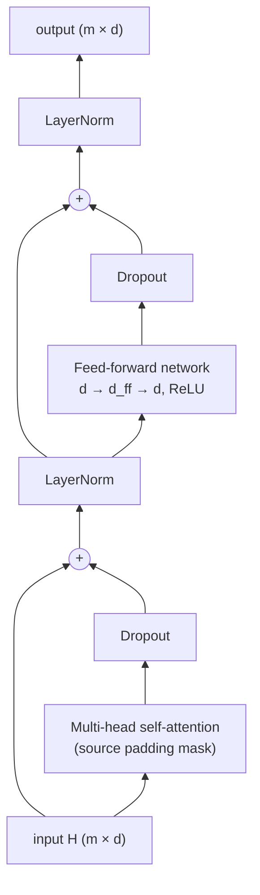
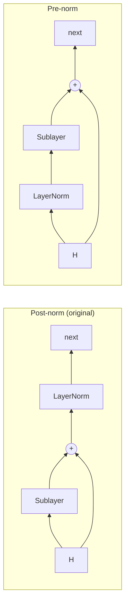
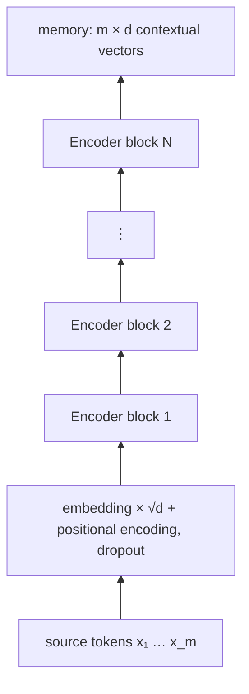

# 7.1 The Encoder Block

Chapter 6 built the Transformer's parts: embeddings with positional encodings, attention, masks, and multiple heads. This section assembles them into the **encoder block**, the unit that is stacked $`N`$ times to form the encoder. A block has two sublayers, multi-head self-attention and a position-wise feed-forward network, each wrapped in a residual connection with layer normalization. We look at each sublayer, at the division of labor between them, at where normalization and dropout go, at the original post-norm arrangement and the pre-norm alternative, and at the encoder stack as a whole.

## Two sublayers

An encoder block maps a matrix $`H \in \mathbb{R}^{m \times d}`$ (one row per source position) to a new matrix of the same shape. It applies:

1. **Multi-head self-attention** (Section 6.5), with the source padding mask (Section 6.4). Every source position gathers information from every other source position.
2. **A position-wise feed-forward network (FFN)**: the same small MLP applied to every position independently.

For the FFN, the original Transformer uses two linear layers with a ReLU between them (Vaswani et al. 2017):

```math
\mathrm{FFN}(\mathbf{x}) = W_2\, \mathrm{ReLU}(W_1 \mathbf{x} + \mathbf{b}_1) + \mathbf{b}_2, \qquad W_1 \in \mathbb{R}^{d_{\text{ff}} \times d}, \quad W_2 \in \mathbb{R}^{d \times d_{\text{ff}}}.
```

The hidden layer is wider than the model: $`d_{\text{ff}} = 2048 = 4d`$ in the base model. "Position-wise" means the same $`W_1, W_2`$ are applied to each row of $`H`$ separately, so in code the FFN is simply two `nn.Linear` layers acting on the last dimension of a `(B, m, d)` tensor. Vaswani et al. note that this is equivalent to two convolutions with kernel size 1.

## Division of labor

The two sublayers do complementary jobs:

- **Attention moves information between positions.** It is the only sublayer in which a position's output depends on other positions. But as Section 6.3 noted, each attention output is a weighted average of value vectors: it mixes, but by itself it adds little nonlinear processing.
- **The FFN transforms information within each position.** It never looks at other positions, but it applies a nonlinear function with a large hidden layer to whatever each position now contains. It also holds most of the block's parameters: $`2 d \, d_{\text{ff}} = 8d^2`$ weights against attention's $`4d^2`$.

Stacking blocks alternates the two operations: gather, transform, gather, transform. After a few blocks, each source position's vector reflects the token itself, its position, and whatever the model has learned to extract from the rest of the sentence. This is the "hierarchical features" picture of deep networks from Chapter 3, with attention supplying the connections between positions.

## Residual connections and layer normalization

Each sublayer is wrapped in a **residual connection** (He et al. 2016; Chapter 3): the sublayer's output is added to its input, so the block learns a change to the representation rather than a whole new representation. Residual connections give gradients a direct path through a deep stack, and they are why every sublayer must preserve the width $`d`$ (Section 6.2).

Each residual addition is followed by **layer normalization** (Ba et al. 2016; Chapter 3), which normalizes each position's vector to zero mean and unit variance across its $`d`$ features and then applies a learned scale and shift. LayerNorm treats each position independently, so it works for any batch size and sequence length and behaves identically in training and inference, the reasons Chapter 3 gave for preferring it to batch normalization in Transformers.

**Dropout** is applied to each sublayer's output before it is added to the residual stream, and to the sum of the embeddings and positional encodings at the bottom of each stack, with rate 0.1 in the base model (Vaswani et al. 2017).

Putting it together, the original ("post-norm") encoder block computes

```math
\begin{aligned}
H' &= \mathrm{LayerNorm}\big(H + \mathrm{Dropout}(\mathrm{MultiHead}(H, H))\big), \\
H'' &= \mathrm{LayerNorm}\big(H' + \mathrm{Dropout}(\mathrm{FFN}(H'))\big).
\end{aligned}
```



*Figure 7.1.1. The original (post-norm) encoder block. The side arrows into each "+" are the residual connections.*

## Post-norm vs. pre-norm

The original arrangement normalizes *after* each residual addition, hence **post-norm**. A widely used alternative, **pre-norm**, normalizes the input to each sublayer and leaves the residual path untouched:

```math
\text{post-norm: } H \leftarrow \mathrm{LayerNorm}\big(H + \mathrm{Sublayer}(H)\big), \qquad \text{pre-norm: } H \leftarrow H + \mathrm{Sublayer}\big(\mathrm{LayerNorm}(H)\big).
```

A pre-norm stack also applies one final LayerNorm after its last block, since the residual stream itself is never normalized along the way.



*Figure 7.1.2. Post-norm normalizes on the residual path; pre-norm normalizes only the sublayer's input, leaving a clean identity path from input to output.*

The difference matters for training. In post-norm, the gradient flowing back to early layers passes through a LayerNorm at every sublayer. In pre-norm, the residual stream is a plain sum, so there is an unobstructed identity path, as in the residual networks of Chapter 3. Xiong et al. (2020) showed that at initialization, post-norm Transformers have large gradients near the output layer, which is why they need a learning-rate warmup (Section 7.3) to train stably, while pre-norm Transformers have well-behaved gradients and, in their experiments, could be trained without warmup and reached comparable results faster. Pre-norm has become the common choice in deep Transformers; post-norm is still sometimes preferred when it can be trained successfully.

## Implementation

In code, the block takes about twenty lines. The version in the appendix supports both the post-norm and the pre-norm arrangement; with its weights copied into PyTorch's `nn.TransformerEncoderLayer`, the two produce the same outputs. Like PyTorch's layer, it also applies dropout to the FFN's hidden activations, a detail not described in the paper. For $`d = 512`$ and $`d_{\text{ff}} = 2048`$, one block has 3,152,384 parameters: $`12d^2 = 3{,}145{,}728`$ weights plus $`6{,}656`$ biases and LayerNorm parameters.

## The encoder stack

The encoder is $`N`$ identical blocks applied in sequence, each with its own parameters ($`N = 6`$ in the original model):

```math
H^{(0)} = \mathrm{Dropout}\big(\sqrt{d}\, E_{\mathbf{x}} + \mathrm{PE}\big), \qquad H^{(\ell)} = \mathrm{EncoderBlock}_\ell\big(H^{(\ell-1)}\big), \quad \ell = 1, \dots, N.
```

The final output $`H^{(N)} \in \mathbb{R}^{m \times d}`$ has one contextual vector per source token. It is often called the **memory**, because the decoder consults it at every layer and every decoding step through cross-attention (Section 7.2). The encoder runs **once** per source sentence, in parallel over all its positions; the memory is then reused for however many decoding steps the output needs.



*Figure 7.1.3. The encoder stack.*

## Key takeaways

- An encoder block has two sublayers: multi-head self-attention (with the source padding mask) and a position-wise FFN with hidden width $`d_{\text{ff}} = 4d`$.
- Attention moves information between positions; the FFN transforms each position independently and holds two thirds of the block's weights.
- Each sublayer is wrapped in dropout, a residual connection, and LayerNorm; the original model normalizes after the addition (post-norm).
- Pre-norm normalizes each sublayer's input instead, keeping a clean identity path; it trains more stably and is common in deep Transformers.
- The encoder stacks $`N`$ blocks and produces the memory, one contextual vector per source token, computed once and reused by the decoder.

## Appendix: Code

The snippets below reproduce the checks and results described in this section. They need only PyTorch and run on a CPU; snippets in the same appendix are meant to be run in order in one Python session.

### Encoder block, checked against nn.TransformerEncoderLayer

```python
import torch
import torch.nn as nn

class EncoderBlock(nn.Module):
    def __init__(self, d, h, d_ff, dropout=0.1, pre_norm=False):
        super().__init__()
        self.attn = nn.MultiheadAttention(d, h, dropout=dropout, batch_first=True)
        self.ffn = nn.Sequential(nn.Linear(d, d_ff), nn.ReLU(), nn.Dropout(dropout), nn.Linear(d_ff, d))
        self.norm1, self.norm2 = nn.LayerNorm(d), nn.LayerNorm(d)
        self.drop1, self.drop2 = nn.Dropout(dropout), nn.Dropout(dropout)
        self.pre_norm = pre_norm

    def _sa(self, x, pad):
        return self.attn(x, x, x, key_padding_mask=pad, need_weights=False)[0]

    def forward(self, x, src_pad=None):          # src_pad: (B, m), True at padding
        if self.pre_norm:
            x = x + self.drop1(self._sa(self.norm1(x), src_pad))
            x = x + self.drop2(self.ffn(self.norm2(x)))
        else:
            x = self.norm1(x + self.drop1(self._sa(x, src_pad)))
            x = self.norm2(x + self.drop2(self.ffn(x)))
        return x

torch.manual_seed(0)
d, h, d_ff = 512, 8, 2048
block = EncoderBlock(d, h, d_ff).eval()          # eval(): dropout off for the comparison
ref = nn.TransformerEncoderLayer(d, h, d_ff, dropout=0.1, batch_first=True).eval()
with torch.no_grad():
    ref.self_attn.load_state_dict(block.attn.state_dict())
    ref.linear1.load_state_dict(block.ffn[0].state_dict())
    ref.linear2.load_state_dict(block.ffn[3].state_dict())
    ref.norm1.load_state_dict(block.norm1.state_dict())
    ref.norm2.load_state_dict(block.norm2.state_dict())

x = torch.randn(2, 6, d)
pad = torch.tensor([[False] * 4 + [True] * 2, [False] * 6])    # first sequence has 2 padding tokens
print(torch.allclose(block(x, pad)[:, :4], ref(x, src_key_padding_mask=pad)[:, :4], atol=1e-5))  # True
print(sum(p.numel() for p in block.parameters()))   # 3152384 = 12 d^2 + biases and LayerNorm
```

The comparison is restricted to non-padding positions because PyTorch may skip computing outputs at padding positions in evaluation mode; those outputs are never used.

## Further reading

Ba, Jimmy Lei, Jamie Ryan Kiros, and Geoffrey E. Hinton. "Layer Normalization." arXiv preprint arXiv:1607.06450, 2016. https://arxiv.org/abs/1607.06450.

He, Kaiming, et al. "Deep Residual Learning for Image Recognition." In *Proceedings of the IEEE Conference on Computer Vision and Pattern Recognition*, 2016. https://arxiv.org/abs/1512.03385.

Vaswani, Ashish, et al. "Attention Is All You Need." In *Advances in Neural Information Processing Systems 30*, 2017. https://arxiv.org/abs/1706.03762.

Xiong, Ruibin, et al. "On Layer Normalization in the Transformer Architecture." In *Proceedings of the 37th International Conference on Machine Learning*, 2020. https://arxiv.org/abs/2002.04745.
