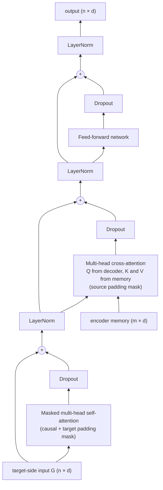
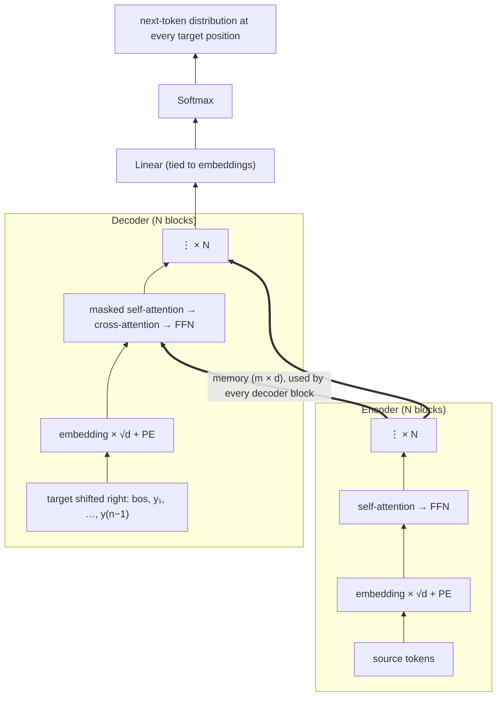
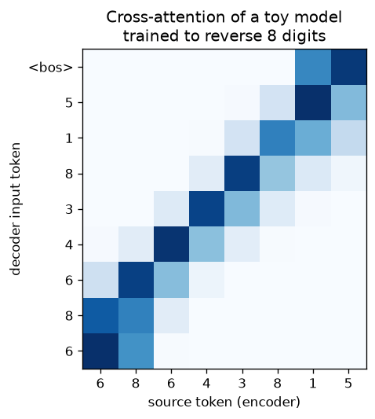

# 7.2 The Decoder Block and the Full Encoder-Decoder Model

The encoder turns the source sentence into a memory of contextual vectors (Section 7.1). The decoder's job is to produce the target sentence from that memory, one token at a time. This section describes the **decoder block**, which adds a third sublayer to the encoder's two: masked self-attention over the target prefix, cross-attention to the encoder's memory, and the feed-forward network. It then assembles the **complete encoder-decoder Transformer**, traces how information flows through it, lists the original configurations, implements the whole model, and maps it onto PyTorch's built-in modules.

## Three sublayers

A decoder block maps a matrix $`G \in \mathbb{R}^{n \times d}`$ (one row per target position) to a new matrix of the same shape, given the encoder memory $`H^{(N)} \in \mathbb{R}^{m \times d}`$. It applies three sublayers, each wrapped in dropout, a residual connection, and LayerNorm exactly as in the encoder:

1. **Masked multi-head self-attention.** Queries, keys, and values all come from the target positions. The causal mask (Section 6.4), combined with the target padding mask, ensures that position $`t`$ attends only to target positions $`\le t`$.
2. **Multi-head cross-attention.** Queries come from the decoder (the output of sublayer 1); keys and values come from the encoder memory; the source padding mask hides source padding. This is where the target side reads the source.
3. **Position-wise FFN**, identical in form to the encoder's.

In the original post-norm arrangement:

```math
\begin{aligned}
G' &= \mathrm{LayerNorm}\big(G + \mathrm{Dropout}(\mathrm{MultiHead}_{\text{self}}(G, G;\ \text{causal and target padding mask}))\big), \\
G'' &= \mathrm{LayerNorm}\big(G' + \mathrm{Dropout}(\mathrm{MultiHead}_{\text{cross}}(G', H^{(N)};\ \text{source padding mask}))\big), \\
G''' &= \mathrm{LayerNorm}\big(G'' + \mathrm{Dropout}(\mathrm{FFN}(G''))\big).
\end{aligned}
```



*Figure 7.2.1. The original (post-norm) decoder block. Cross-attention is the only sublayer that sees the source.*

The order of the first two sublayers matters. Masked self-attention first lets each target position build a representation of "what has been produced so far"; cross-attention then uses that representation as the query to decide which source positions are relevant for producing the next token.

The decoder block has one more attention sublayer than the encoder block, so its parameter count is $`4d^2 + 4d^2 + 8d^2 = 16d^2`$ weights (with $`d_{\text{ff}} = 4d`$), against the encoder block's $`12d^2`$.

## The full architecture

The complete Transformer connects an encoder stack and a decoder stack:

1. **Source side.** Embed the source tokens, scale by $`\sqrt{d}`$, add positional encodings, apply dropout, and run $`N`$ encoder blocks. The result is the memory $`H^{(N)}`$.
2. **Target side.** Embed the decoder input, which is the target shifted right by one position and starting with `<bos>` (Section 6.2); scale, add positional encodings, apply dropout, and run $`N`$ decoder blocks. **Every** decoder block cross-attends to the same final memory $`H^{(N)}`$, not to the corresponding encoder layer.
3. **Output.** A linear layer (tied to the embeddings in the original model) and a softmax turn each decoder output vector into a distribution over the vocabulary.



*Figure 7.2.2. The complete encoder-decoder Transformer. The thick arrows carry the encoder memory into the cross-attention sublayer of every decoder block.*

## How information flows

It helps to trace one prediction. Suppose the source is a German sentence and the model has produced the first three English words. To predict the fourth:

- The **encoder** has already processed the whole German sentence once. Each German token's memory vector encodes that token in the context of the entire sentence.
- In each decoder block, **masked self-attention** lets the fourth target position (whose input is the third English word) gather information from the English words produced so far.
- **Cross-attention** then uses that position's updated vector as a query against the German memory, pulling in information from the German words that matter for what comes next.
- The **FFN** transforms the result, and the next block repeats the process with a more refined query.
- The final vector at that position is projected to vocabulary logits, giving the distribution for the fourth English word.

The two stacks run at different rhythms. The encoder runs once per source sentence. During training, the decoder runs once per sentence pair, computing all target positions in parallel thanks to the causal mask (Section 7.3). During generation, the decoder runs once per output token, reusing the same memory each time.

Cross-attention weights are often interpretable. The figure below comes from a tiny Transformer (two encoder and two decoder blocks, $`d = 64`$, four heads) trained by `figures/make_figures.py` to reverse sequences of eight digits. Each row is a decoder input position and each column a source position; the weights are averaged over the heads of the last decoder block. The model has learned to attend to the source position it must copy next: when its input is `<bos>`, it attends mostly to the *last* source digit, which is the first digit of the reversed output, and so on down the anti-diagonal.



*Figure 7.2.3. Cross-attention of a toy encoder-decoder trained on sequence reversal. After 1,500 training steps, its teacher-forced token accuracy on fresh sequences was above 99.9%.*

## The original configurations

Vaswani et al. (2017) reported two main configurations for translation:

| Hyperparameter | Base | Big |
|---|---|---|
| Blocks per stack, $`N`$ | 6 | 6 |
| Model width, $`d`$ | 512 | 1,024 |
| FFN width, $`d_{\text{ff}}`$ | 2,048 | 4,096 |
| Heads, $`h`$ | 8 | 16 |
| Head dimension, $`d_k = d_v`$ | 64 | 64 |
| Dropout, $`P_{\text{drop}}`$ | 0.1 | 0.3 |
| Parameters (reported) | 65 million | 213 million |

For English-French, the big model used dropout 0.1 instead of 0.3. Both configurations keep $`d_{\text{ff}} = 4d`$ and $`d_k = 64`$; the big model doubles the width and the number of heads.

## Implementation

The decoder block follows the same pattern as the encoder block. The appendix implements it, checks it against PyTorch's `nn.TransformerDecoderLayer` by copying weights, and combines it with the encoder block of Section 7.1 into a complete model. That from-scratch model, with the base configuration and a 37,000-token vocabulary has about 63.1 million parameters, close to the 65 million the paper reports. The paper gives its vocabulary only as about 37,000 tokens, so the exact count cannot be reproduced. For a notation-level description of the same encoder-decoder forward pass, see the pseudocode in Phuong and Hutter (2022). PyTorch's attention modules use the "True means masked" convention for `attn_mask` and `key_padding_mask` (Section 6.4), so a causal mask for them marks the positions *above* the diagonal, as `torch.triu(..., diagonal=1)` produces.

## PyTorch's built-in modules

PyTorch provides the same architecture as `nn.Transformer`, built from `nn.TransformerEncoderLayer` and `nn.TransformerDecoderLayer`:

| Argument | Meaning in this chapter |
|---|---|
| `d_model` | $`d`$ |
| `nhead` | $`h`$ |
| `num_encoder_layers`, `num_decoder_layers` | $`N`$ for each stack |
| `dim_feedforward` | $`d_{\text{ff}}`$ |
| `dropout` | $`P_{\text{drop}}`$ |
| `activation` | the FFN nonlinearity (default ReLU) |
| `norm_first` | `False` for post-norm (default), `True` for pre-norm |
| `batch_first` | `True` for `(B, n, d)` tensors |
| `tgt_mask` | causal mask for decoder self-attention |
| `src_key_padding_mask`, `tgt_key_padding_mask`, `memory_key_padding_mask` | the three padding masks of Section 6.4 |

`nn.Transformer` contains only the two stacks. The embeddings, positional encodings, and output projection must be added separately, as in the toy model of `figures/make_figures.py`. Its encoder and decoder each end with an extra final LayerNorm, which the paper's post-norm description does not include; for post-norm stacks it is redundant but harmless.

## Key takeaways

- A decoder block has three sublayers: masked self-attention over the target prefix, cross-attention from the target to the encoder memory, and a position-wise FFN, each with dropout, a residual connection, and LayerNorm.
- Every decoder block cross-attends to the same final encoder output.
- The encoder runs once per source; the decoder runs once per sentence pair in training (all positions in parallel) and once per output token in generation.
- The base model uses $`N = 6`$, $`d = 512`$, $`d_{\text{ff}} = 2048`$, $`h = 8`$; the big model doubles $`d`$, $`d_{\text{ff}}`$, and $`h`$.
- The complete model is a few dozen lines of PyTorch; `nn.Transformer` provides the two stacks, with embeddings, positions, and the output layer added separately.

## Appendix: Code

The snippets below reproduce the checks and results described in this section. They need only PyTorch and run on a CPU; snippets in the same appendix are meant to be run in order in one Python session.

### Decoder block and the complete model

```python
import math
import torch
import torch.nn as nn

class EncoderBlock(nn.Module):                       # post-norm, as in Section 7.1
    def __init__(self, d, h, d_ff, dropout=0.1):
        super().__init__()
        self.attn = nn.MultiheadAttention(d, h, dropout=dropout, batch_first=True)
        self.ffn = nn.Sequential(nn.Linear(d, d_ff), nn.ReLU(), nn.Dropout(dropout), nn.Linear(d_ff, d))
        self.norm1, self.norm2 = nn.LayerNorm(d), nn.LayerNorm(d)
        self.drop = nn.Dropout(dropout)
    def forward(self, x, src_pad):
        x = self.norm1(x + self.drop(self.attn(x, x, x, key_padding_mask=src_pad, need_weights=False)[0]))
        return self.norm2(x + self.drop(self.ffn(x)))

class DecoderBlock(nn.Module):
    def __init__(self, d, h, d_ff, dropout=0.1):
        super().__init__()
        self.self_attn = nn.MultiheadAttention(d, h, dropout=dropout, batch_first=True)
        self.cross_attn = nn.MultiheadAttention(d, h, dropout=dropout, batch_first=True)
        self.ffn = nn.Sequential(nn.Linear(d, d_ff), nn.ReLU(), nn.Dropout(dropout), nn.Linear(d_ff, d))
        self.norm1, self.norm2, self.norm3 = nn.LayerNorm(d), nn.LayerNorm(d), nn.LayerNorm(d)
        self.drop = nn.Dropout(dropout)
    def forward(self, y, memory, causal, tgt_pad, src_pad):
        sa = self.self_attn(y, y, y, attn_mask=causal, key_padding_mask=tgt_pad, need_weights=False)[0]
        y = self.norm1(y + self.drop(sa))
        ca = self.cross_attn(y, memory, memory, key_padding_mask=src_pad, need_weights=False)[0]
        y = self.norm2(y + self.drop(ca))
        return self.norm3(y + self.drop(self.ffn(y)))

def sinusoidal_pe(n, d):
    pos = torch.arange(n)[:, None]
    omega = 10000 ** (-torch.arange(0, d, 2) / d)
    pe = torch.zeros(n, d)
    pe[:, 0::2], pe[:, 1::2] = torch.sin(pos * omega), torch.cos(pos * omega)
    return pe

class Transformer(nn.Module):
    def __init__(self, V, d=512, h=8, d_ff=2048, N=6, dropout=0.1, max_len=512, pad_id=0):
        super().__init__()
        self.emb = nn.Embedding(V, d)                               # shared by source, target, output
        self.register_buffer("pe", sinusoidal_pe(max_len, d))
        self.enc = nn.ModuleList(EncoderBlock(d, h, d_ff, dropout) for _ in range(N))
        self.dec = nn.ModuleList(DecoderBlock(d, h, d_ff, dropout) for _ in range(N))
        self.drop, self.d, self.pad_id = nn.Dropout(dropout), d, pad_id

    def embed(self, tokens):
        return self.drop(self.emb(tokens) * math.sqrt(self.d) + self.pe[: tokens.size(1)])

    def encode(self, src):
        src_pad = src == self.pad_id
        h = self.embed(src)
        for block in self.enc:
            h = block(h, src_pad)
        return h, src_pad

    def decode(self, tgt_in, memory, src_pad):
        n = tgt_in.size(1)
        causal = torch.triu(torch.ones(n, n, dtype=torch.bool), diagonal=1)   # True = masked
        g = self.embed(tgt_in)
        for block in self.dec:
            g = block(g, memory, causal, tgt_in == self.pad_id, src_pad)
        return g @ self.emb.weight.T                                # tied output projection

    def forward(self, src, tgt_in):
        memory, src_pad = self.encode(src)
        return self.decode(tgt_in, memory, src_pad)                 # (B, n, V) logits

torch.manual_seed(0)
d, h, d_ff = 512, 8, 2048
blk = DecoderBlock(d, h, d_ff).eval()
ref = nn.TransformerDecoderLayer(d, h, d_ff, batch_first=True).eval()
with torch.no_grad():
    ref.self_attn.load_state_dict(blk.self_attn.state_dict())
    ref.multihead_attn.load_state_dict(blk.cross_attn.state_dict())
    ref.linear1.load_state_dict(blk.ffn[0].state_dict())
    ref.linear2.load_state_dict(blk.ffn[3].state_dict())
    for i in (1, 2, 3):
        getattr(ref, f"norm{i}").load_state_dict(getattr(blk, f"norm{i}").state_dict())
y, mem = torch.randn(2, 5, d), torch.randn(2, 7, d)
causal = torch.triu(torch.ones(5, 5, dtype=torch.bool), diagonal=1)
print(torch.allclose(blk(y, mem, causal, None, None), ref(y, mem, tgt_mask=causal), atol=1e-5))  # True

model = Transformer(V=37000).eval()
src = torch.randint(3, 37000, (2, 11))
tgt_in = torch.randint(3, 37000, (2, 9))
print(model(src, tgt_in).shape)                                    # (2, 9, 37000)
print(f"{sum(p.numel() for p in model.parameters()) / 1e6:.1f}M parameters")
```

## Further reading

Phuong, Mary, and Marcus Hutter. "Formal Algorithms for Transformers." arXiv preprint arXiv:2207.09238, 2022. https://arxiv.org/abs/2207.09238.

Vaswani, Ashish, et al. "Attention Is All You Need." In *Advances in Neural Information Processing Systems 30*, 2017. https://arxiv.org/abs/1706.03762.
