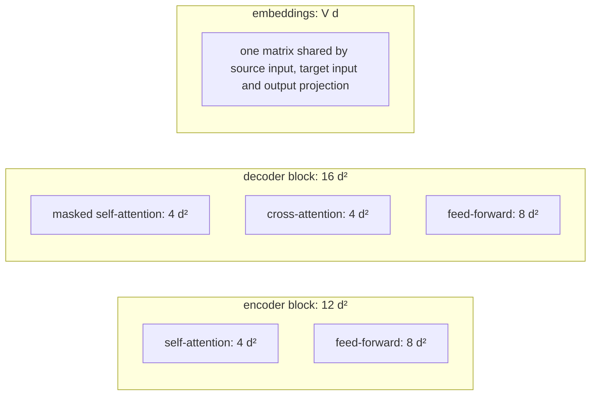
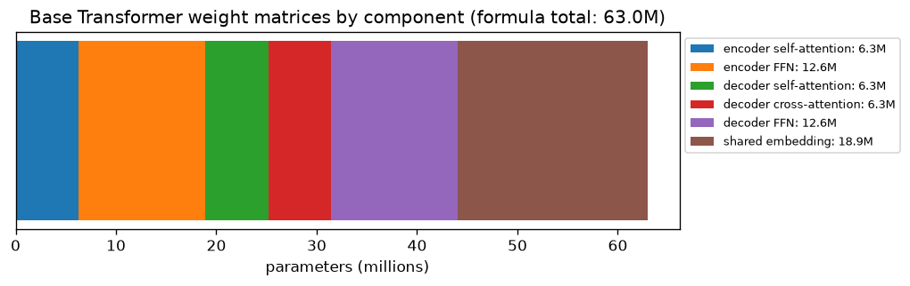
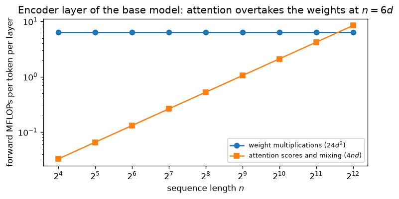

# 7.5 Counting Parameters and Compute

How big is a Transformer, and how much computation does it need? The answers follow directly from the architecture of Sections 6.3 to 7.2, and working them out is a good test of understanding: every parameter belongs to a specific matrix, and every FLOP to a specific multiplication. This section counts the parameters of the base model from its hyperparameters, estimates the computation of a forward and backward pass, and explains where attention's quadratic cost begins to matter. The same accounting carries over to the larger models of later chapters.

Throughout, $`d`$ is the model width, $`d_{\text{ff}}`$ the feed-forward width, $`N`$ the number of layers in each stack, $`V`$ the vocabulary size, $`n`$ the source length and $`m`$ the target length. The base model has $`d = 512`$, $`d_{\text{ff}} = 2048 = 4d`$, $`N = 6`$ and a shared vocabulary of about 37,000 tokens (Vaswani et al. 2017).

## Parameters of one block

**Multi-head attention** (Section 6.5) has four $`d \times d`$ projections, $`W^Q`$, $`W^K`$, $`W^V`$ and $`W^O`$. The number of heads does not matter: the per-head matrices are slices of these four. That gives $`4d^2`$ weights (plus $`4d`$ biases in implementations that use them).

**The feed-forward network** (Section 7.1) has a $`d \times d_{\text{ff}}`$ matrix and a $`d_{\text{ff}} \times d`$ matrix: $`2 d\, d_{\text{ff}} = 8d^2`$ weights when $`d_{\text{ff}} = 4d`$, plus $`d_{\text{ff}} + d`$ biases.

**Layer normalization** has a gain and a bias vector per sublayer, $`2d`$ parameters each, which are negligible.

So, ignoring biases and normalization,

```math
\text{encoder block: } 4d^2 + 8d^2 = 12d^2, \qquad \text{decoder block: } 4d^2 + 4d^2 + 8d^2 = 16d^2,
```

where the decoder's extra $`4d^2`$ is its cross-attention sublayer (Section 7.2). For the base model, $`12d^2 = 3{,}145{,}728`$ and, with biases and the two layer norms, one encoder block has exactly 3,152,384 parameters (the figure checked against PyTorch in Section 7.1).



*Figure 7.5.1. Where the weights live (with $`d_{\text{ff}} = 4d`$; biases and layer norms omitted).*

## Parameters of the whole model

With $`N`$ blocks in each stack and one shared embedding matrix,

```math
P \approx N(12d^2 + 16d^2) + Vd = 28Nd^2 + Vd.
```

The sinusoidal positional encodings (Section 6.6) add no parameters. For the base model:

| Component | Formula | Weights |
|---|---|---|
| Encoder self-attention | $`N \cdot 4d^2`$ | 6,291,456 |
| Encoder feed-forward | $`N \cdot 8d^2`$ | 12,582,912 |
| Decoder self-attention | $`N \cdot 4d^2`$ | 6,291,456 |
| Decoder cross-attention | $`N \cdot 4d^2`$ | 6,291,456 |
| Decoder feed-forward | $`N \cdot 8d^2`$ | 12,582,912 |
| Shared embedding ($`V = 37{,}000`$) | $`Vd`$ | 18,944,000 |
| **Total** | $`28Nd^2 + Vd`$ | **62,984,192** |



*Figure 7.5.2. Base Transformer weights by component. The feed-forward networks hold twice as many weights as the attention sublayers of the same stack, and the embedding holds about 30% of the total.*

Adding biases and layer-norm parameters brings the total to 63,082,496. The paper reports 65 million. The paper gives the vocabulary only as "about 37000 tokens," so the exact count cannot be reproduced; the remaining gap of about 1.9 million is the size of roughly 3,700 more embedding rows, and differences in vocabulary size or in what was counted could account for it. The general lesson holds regardless: at this scale the embedding matrix is a large fraction of the model. Tying the source embedding, target embedding and output projection (Section 6.2) saves two further copies of an 18.9-million-parameter matrix, which would otherwise make the model about 60% larger.

Note which hyperparameters do *not* appear: the number of heads $`h`$ and the sequence lengths. Adding heads (at fixed $`d`$) changes how the $`4d^2`$ attention weights are sliced, not how many there are. Sequence length affects compute and memory, as below, but not the parameter count, which is why the same model can process inputs of different lengths.

## Checking the formulas

These formulas can be checked against a real implementation (code in the appendix). Counting from the hyperparameters, including biases and layer norms, gives exactly the number of parameters in PyTorch's `nn.Transformer` with the base configuration: 44,140,544, which includes the final layer norm PyTorch adds after each stack. With the shared embedding the total is 63.08 million. Likewise, the forward-pass FLOP formula derived in the next section agrees exactly with PyTorch's FLOP counter: 3,947,102,208 FLOPs for a 48-token source and a 40-token target.

## Compute of a forward pass

Multiplying a vector by a $`d_{\text{in}} \times d_{\text{out}}`$ weight matrix takes $`d_{\text{in}} d_{\text{out}}`$ multiply-adds, or $`2 d_{\text{in}} d_{\text{out}}`$ floating-point operations (FLOPs). So each weight costs about **2 FLOPs per token it is applied to**. That rule accounts for most of the computation:

- Each **encoder** layer applies its $`12d^2`$ weights to each of the $`n`$ source tokens: $`24d^2`$ FLOPs per source token per layer, about 37.7 million per source token for the six-layer base encoder.
- Each **decoder** layer applies its self-attention, feed-forward, and cross-attention query and output projections to each of the $`m`$ target tokens ($`2 \cdot 14d^2 = 28d^2`$ FLOPs per target token), and the cross-attention key and value projections to each of the $`n`$ memory vectors ($`4d^2`$ per source token). The key and value projections of the memory do not depend on the target, so during decoding they are computed once per source (Section 7.4).
- The **output projection** costs $`2Vd`$ FLOPs per target token, about 37.9 million for the base model: as much as the entire six-layer encoder costs per token. The input embeddings are table lookups and cost essentially nothing.

**Attention itself** adds work that has no weights. For a query sequence of length $`q`$ attending to keys of length $`k`$, computing $`QK^\top`$ and multiplying the weights by $`V`$ each take $`2qkd`$ FLOPs, summed over heads. Per layer, that is $`4n^2 d`$ for encoder self-attention, $`4m^2 d`$ for decoder self-attention, and $`4mnd`$ for cross-attention. Softmax, layer norm and residual additions cost a number of operations proportional to the size of their inputs, which is small next to the matrix multiplications.

Putting this together, with $`d_{\text{ff}} = 4d`$,

```math
\text{FLOPs}_{\text{forward}} \approx N\left[\, 24nd^2 + 4n^2 d \;+\; 28md^2 + 4nd^2 + 4m^2 d + 4mnd \,\right] + 2mVd,
```

which is the `forward_flops` function above plus the output projection (`nn.Transformer` does not include one).

### Training costs about three forward passes

The backward pass needs two matrix products for every one in the forward pass: one for the gradient with respect to the layer's input (to continue backpropagation) and one for the gradient with respect to the weights. So a training step costs roughly three times the forward FLOPs, or about **6 FLOPs per parameter per token** when the weight terms dominate. This rule of thumb, together with the batch size in tokens and the number of steps, gives a quick estimate of a training run's total computation; Chapter 3 discussed how that relates to hardware throughput.

## When attention's quadratic cost matters

The attention terms grow with the square of sequence length, while the weight terms grow linearly. In an encoder layer, the per-token costs are $`24d^2`$ for the weights and $`4nd`$ for attention, so attention dominates only when

```math
4nd \gt 24d^2 \quad\Longleftrightarrow\quad n \gt 6d.
```

For the base model, $`6d = 3072`$ tokens, far longer than a typical translation sentence pair. At the sentence lengths the original Transformer was designed for, almost all of the computation is in the weight multiplications, and attention's quadratic cost is a minor term.



*Figure 7.5.3. Per-token forward cost of one base-model encoder layer. The weight multiplications cost the same per token at any length; attention's cost per token grows with $`n`$ and overtakes them at $`n = 6d = 3072`$.*

This matches the comparison in the original paper, which contrasted layer types by their cost per layer, the number of operations that must happen one after another, and the longest path a signal travels between two positions (Vaswani et al. 2017, Table 1):

| Layer type | Complexity per layer | Sequential operations | Maximum path length |
|---|---|---|---|
| Self-attention | $`O(n^2 \cdot d)`$ | $`O(1)`$ | $`O(1)`$ |
| Recurrent | $`O(n \cdot d^2)`$ | $`O(n)`$ | $`O(n)`$ |
| Convolutional (kernel width $`k`$) | $`O(k \cdot n \cdot d^2)`$ | $`O(1)`$ | $`O(\log_k n)`$ |
| Restricted self-attention (neighborhood $`r`$) | $`O(r \cdot n \cdot d)`$ | $`O(1)`$ | $`O(n/r)`$ |

The paper's argument was that self-attention is faster than a recurrent layer when $`n`$ is smaller than $`d`$, which is the usual case for sentences, and that it needs only a constant number of sequential steps and a constant path length between any two positions (Section 6.1). For inputs much longer than $`d`$, restricting each position to a neighborhood of $`r`$ positions reduces the cost at the price of a longer path.

## Memory

Parameters are only part of the memory needed for training. Adam keeps two extra values per parameter (Chapter 3), and backpropagation needs the **activations** saved during the forward pass. Most activations scale with (batch size) × (sequence length) × $`d`$, but the attention weights are an $`h \times q \times k`$ tensor per layer per sequence. For $`h = 8`$ and $`n = 512`$, one encoder layer's self-attention weights have $`8 \cdot 512^2 = 2{,}097{,}152`$ entries for a single sequence, and doubling the length quadruples that. This quadratic memory, more than the FLOPs, is what first limits attention on long inputs. Memory-efficient attention kernels such as FlashAttention (Dao et al. 2022) compute exactly the same result without ever storing the full weight matrix, processing it in tiles and recomputing what the backward pass needs. PyTorch's `F.scaled_dot_product_attention` dispatches to such kernels when it can.

At inference, the encoder runs once and its memory is kept for all decoding steps; the decoder's cost per generated token is dominated by its weights and the output projection when outputs are short, as in translation.

All of these counts are for one architecture: the encoder-decoder built for translation, whose parameters split between two stacks. Many tasks have no output sequence to generate, and others have no separate input to read. Does every task need both stacks, or can one of them, used alone, do the job?

## Key takeaways

- An attention sublayer has $`4d^2`$ weights regardless of the number of heads; a feed-forward network with $`d_{\text{ff}} = 4d`$ has $`8d^2`$.
- An encoder block has about $`12d^2`$ parameters and a decoder block about $`16d^2`$, so the model has about $`28Nd^2 + Vd`$: 63.0 million weights for the base configuration, against the 65 million reported.
- A forward pass costs about 2 FLOPs per parameter per token, plus attention terms proportional to $`n^2 d`$, $`m^2 d`$ and $`mnd`$; a training step costs about three times as much.
- Attention's quadratic cost exceeds the weight cost in an encoder layer only for $`n \gt 6d`$, about 3,000 tokens for the base model, so at sentence lengths the weights dominate.
- The attention-weight tensor's memory grows quadratically with length; fused kernels such as FlashAttention avoid storing it.

## Appendix: Code

The snippets below reproduce the checks and results described in this section. They need only PyTorch and run on a CPU; snippets in the same appendix are meant to be run in order in one Python session.

### Parameter and FLOP counters, checked against PyTorch

```python
import torch
import torch.nn as nn
from torch.utils.flop_counter import FlopCounterMode
from torch.nn.attention import sdpa_kernel, SDPBackend

def transformer_params(d=512, d_ff=2048, N=6, V=37000, final_norms=True):
    attn = 4 * d * d + 4 * d                     # W_Q, W_K, W_V, W_O and their biases
    ffn = 2 * d * d_ff + d_ff + d                # two linear layers with biases
    ln = 2 * d                                   # gain and bias
    enc_layer = attn + ffn + 2 * ln
    dec_layer = 2 * attn + ffn + 3 * ln
    final = 2 * ln if final_norms else 0         # PyTorch adds a LayerNorm after each stack
    return N * (enc_layer + dec_layer) + final, V * d

body, emb = transformer_params()
tf = nn.Transformer(512, 8, 6, 6, 2048, dropout=0.0, batch_first=True)
print(body, sum(p.numel() for p in tf.parameters()))            # formula vs PyTorch
print(f"with shared embedding: {(body + emb) / 1e6:.2f}M")

def forward_flops(n, m, d=512, d_ff=2048, N=6):
    """Matrix-multiply FLOPs of one forward pass (source length n, target length m)."""
    enc = N * (n * 2 * (4 * d * d + 2 * d * d_ff) + 4 * n * n * d)
    dec = N * (m * 2 * (4 * d * d + 2 * d * d + 2 * d * d_ff)   # self Q,K,V,O; cross Q,O; FFN
               + n * 2 * (2 * d * d)                             # cross K,V on the memory
               + 4 * m * m * d + 4 * m * n * d)                  # self and cross attention
    return enc + dec

n, m = 48, 40
src, tgt = torch.randn(1, n, 512), torch.randn(1, m, 512)
tf.train()                            # eval mode would use a fused fast path the counter cannot see
with torch.no_grad(), sdpa_kernel(SDPBackend.MATH), FlopCounterMode(display=False) as counter:
    tf(src, tgt, tgt_mask=nn.Transformer.generate_square_subsequent_mask(m))
print(forward_flops(n, m), counter.get_total_flops())         # formula vs measured
```

Two settings make every multiplication visible to the FLOP counter: `sdpa_kernel(SDPBackend.MATH)` computes attention with ordinary batched matrix multiplications instead of a fused kernel, and training mode (with dropout 0, so the output is unchanged) keeps PyTorch from using its fused inference path for encoder layers.

## Further reading

Dao, Tri, Daniel Y. Fu, Stefano Ermon, Atri Rudra, and Christopher Ré. "FlashAttention: Fast and Memory-Efficient Exact Attention with IO-Awareness." In *Advances in Neural Information Processing Systems 35*, 2022. https://arxiv.org/abs/2205.14135.

Vaswani, Ashish, et al. "Attention Is All You Need." In *Advances in Neural Information Processing Systems 30*, 2017. https://arxiv.org/abs/1706.03762.
