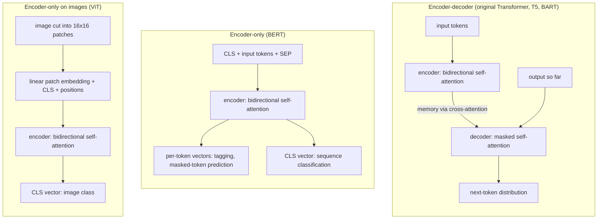

# 7.6 Transformer Families

The model assembled in Section 7.2 (Vaswani et al. 2017) has two halves: an encoder that reads the whole input with bidirectional self-attention, and a decoder that generates an output one token at a time while attending to the encoder's output. Soon after the original paper, researchers found that each half was useful on its own terms, and that the architecture was not specific to translation, or even to text. This section surveys the main families that grew from the encoder-decoder Transformer: encoder-decoder models pretrained as general text-to-text systems, encoder-only models for understanding tasks, and the same encoder applied to images. The architecture changes very little from one family to another. What changes is which stacks are kept, which attention masks are used, and what the model is trained to predict.

## The encoder-decoder family

The original Transformer was trained from scratch for each translation direction. Later encoder-decoder models keep exactly the structure of Section 7.2 but **pretrain** it on large amounts of unlabeled text with a *denoising* objective, then **fine-tune** it on each downstream task. Two influential examples are T5 and BART.

### T5: every task as text-to-text

T5 (Raffel et al. 2020) casts every task, whether translation, summarization, classification or question answering, as mapping an input string to an output string. The task is named by a text prefix on the input; for example, translation inputs look like "translate English to German: That is good." and the target is the German sentence. Classification tasks output the label as a word. One model, one loss (the cross-entropy of Section 7.3) and one decoding procedure (Section 7.4) then serve every task.

T5's pretraining objective is **span corruption**. Random spans of the input, 15% of the tokens in total with a mean span length of 3 in the final models, are removed, and each span is replaced by a unique sentinel token. The target lists the removed spans, each introduced by its sentinel. The paper's own example:

| | Sequence |
|---|---|
| Original text | Thank you for inviting me to your party last week. |
| Encoder input | Thank you `<X>` me to your party `<Y>` week. |
| Decoder target | `<X>` for inviting `<Y>` last `<Z>` |

The encoder sees the corrupted text bidirectionally, and the decoder learns to generate the missing pieces. Because the targets contain only the removed spans, they are much shorter than the input, which makes pretraining cheaper.

T5 made a few changes to the original blocks: pre-norm layer normalization (Section 7.1) with a simplified normalization that rescales without an additive bias, and **relative position biases** instead of sinusoidal encodings, where a learned scalar for each (bucketed) offset between query and key is added to the attention logit (Section 6.6). The largest T5 model had about 11 billion parameters, but the architecture is recognizably the one in Figure 7.2.2.

### BART: a denoising autoencoder

BART (Lewis et al. 2020) also pretrains a standard encoder-decoder, with the objective of reconstructing an original document from a corrupted version of it. The paper compared several corruptions: token masking (as in BERT, below), token deletion, **text infilling** (spans with lengths drawn from a Poisson distribution with $`\lambda = 3`$ are each replaced by a single `[MASK]`, so the model must also work out how many tokens are missing), sentence permutation and document rotation. The final model combined text infilling with sentence permutation. Unlike T5, BART's decoder reconstructs the *entire* original document, so the target is as long as the input. BART was particularly effective when fine-tuned for generation tasks such as summarization, where the output is a rewriting of the input.

Encoder-decoder models remain a natural choice whenever there is a clear input to be read in full and a separate output to be produced: translation, summarization, speech recognition (with an audio encoder) and structured-prediction tasks cast as text generation.

## The encoder-only family

Many tasks do not need to generate a sequence at all. Classifying a sentence's sentiment, deciding whether two sentences contradict each other, tagging each word with a part of speech, or finding the span of a passage that answers a question all require a good *representation* of the input, not an autoregressive output. For these, the decoder can be dropped entirely.

### BERT

BERT (Devlin et al. 2019) is a stack of Transformer encoder blocks: bidirectional self-attention with no causal mask (Section 6.4) and the post-norm blocks of Section 7.1, with learned position embeddings, a GELU activation in the feed-forward network, and an added *segment* embedding marking which of two input sentences each token belongs to. BERT-base has 12 layers, $`d = 768`$ and 12 heads, with 110 million parameters; BERT-large has 24 layers, $`d = 1024`$ and 16 heads, with 340 million.

An encoder that sees the whole input cannot be trained to predict the next token: each position can see it. BERT instead uses a **masked language modeling** objective. It chooses 15% of the token positions at random and asks the model to predict the original token at each chosen position from the rest of the sequence. Of the chosen positions, 80% are replaced by a `[MASK]` token, 10% by a random token, and 10% are left unchanged, so that the model cannot learn to attend to its predictions only where it sees `[MASK]` (a token that never appears during fine-tuning). BERT also used a second objective, next-sentence prediction, a binary prediction of whether the second sentence actually followed the first.

Every BERT input starts with a special `[CLS]` token, and sentence pairs are separated by `[SEP]`. After pretraining, a task is solved by adding a small output layer: for classifying a sentence or a pair, a linear layer on the final `[CLS]` vector; for tagging, a linear layer on every token's vector; for span extraction, layers that score each token as the start or end of the answer. The whole network is then fine-tuned on the task's labeled data.

*Figure 7.6.1. Three uses of the Transformer's building blocks. All three reuse the encoder block of Section 7.1 unchanged; only the encoder-decoder keeps the decoder of Section 7.2.*

The appendix implements BERT's corruption rule, confirming the 15% and 80/10/10 proportions on random data, and a small encoder-only classifier that predicts from the `[CLS]` position. Such a classifier differs from the encoder of Section 7.1 only in the learned position embedding and the use of position 0 as a summary of the whole input: because every position attends to every other, the `[CLS]` vector can gather information from the entire sequence during fine-tuning.

## Beyond text: the Vision Transformer

Nothing in the encoder block refers to language. Self-attention operates on a set of vectors, with order supplied by position embeddings (Section 6.6). The **Vision Transformer** (ViT; Dosovitskiy et al. 2021) applies a standard Transformer encoder to images by treating an image as a sequence of patches:

1. Cut the image into non-overlapping $`16 \times 16`$-pixel patches. A $`224 \times 224`$ color image gives $`14 \times 14 = 196`$ patches.
2. Flatten each patch (here $`16 \cdot 16 \cdot 3 = 768`$ numbers) and map it to $`d`$ dimensions with one learned linear layer. These are the image's "tokens."
3. Prepend a learnable class token, like BERT's `[CLS]`, and add learned 1-D position embeddings.
4. Run a Transformer encoder, and classify the image from the final class-token vector.

The paper's model variants range from ViT-Base (12 layers, $`d = 768`$, 86 million parameters) to ViT-Huge (32 layers, $`d = 1280`$, 632 million), and the title, "An Image Is Worth 16x16 Words," sums up the idea. The authors found no significant gain from 2-D-aware position embeddings over simple learned 1-D ones: the model learns the image's 2-D layout from data. The patch embedding is equivalent to a convolution with kernel size and stride both equal to the patch size, which is how it is usually implemented (the appendix checks the equivalence numerically).

Encoder-decoder Transformers with a non-text encoder follow the same pattern: an image or audio encoder produces the memory, and a text decoder attends to it through cross-attention, exactly as in Section 7.2.

## Comparing the families

| | Encoder-decoder | Encoder-only |
|---|---|---|
| Stacks | encoder and decoder | encoder |
| Attention | bidirectional self-attention in the encoder; causal self-attention and cross-attention in the decoder | bidirectional self-attention |
| Typical pretraining | denoising: reconstruct corrupted spans (T5) or documents (BART) | masked language modeling (BERT); supervised classification (the original ViT) |
| Output | a generated sequence | a vector per position, or one summary vector |
| Typical tasks | translation, summarization, text-to-text tasks | classification, tagging, span extraction, image classification |
| Examples | original Transformer, T5, BART | BERT, ViT |

A third family keeps only the decoder, with causal self-attention and no cross-attention, and trains it to predict the next token of ordinary text. That family is the subject of Chapter 8.

Encoder-only models have one more use that needs no task head at all. Each of their output vectors already depends on the whole input. Can those vectors, taken as they are, represent what a word means in its context, or what a whole text is about?

## Key takeaways

- The Transformer's blocks were reused with little change; families differ mainly in which stacks they keep, which masks they use and what they are trained to predict.
- T5 and BART keep the full encoder-decoder and pretrain it with denoising objectives: T5 reconstructs removed spans marked by sentinel tokens and casts every task as text-to-text; BART reconstructs whole documents from corrupted input.
- BERT keeps only the encoder, pretrains it with masked language modeling (15% of positions; 80% `[MASK]`, 10% random, 10% unchanged), and solves tasks with small heads on the `[CLS]` vector or on each token.
- ViT shows the encoder is not specific to text: an image becomes a sequence of $`16 \times 16`$ patch embeddings with a class token and learned positions.
- Encoder-decoder models suit tasks with a distinct input and output sequence; encoder-only models suit tasks that need a representation of the input.

## Appendix: Code

The snippets below reproduce the checks and results described in this section. They need only PyTorch and run on a CPU; snippets in the same appendix are meant to be run in order in one Python session.

### BERT's masking rule and an encoder-only classifier

Notebook: [7.6-bert-masking-rule-and-an-encoder-only-classifier.ipynb](../../code/07-training-a-transformer/7.6-bert-masking-rule-and-an-encoder-only-classifier.ipynb)

### ViT's patch embedding is a strided convolution

Notebook: [7.6-vit-patch-embedding-is-a-strided-convolution.ipynb](../../code/07-training-a-transformer/7.6-vit-patch-embedding-is-a-strided-convolution.ipynb)

## Further reading

Devlin, Jacob, Ming-Wei Chang, Kenton Lee, and Kristina Toutanova. "BERT: Pre-training of Deep Bidirectional Transformers for Language Understanding." In *Proceedings of the 2019 Conference of the North American Chapter of the Association for Computational Linguistics: Human Language Technologies*, 4171–4186, 2019. https://arxiv.org/abs/1810.04805.

Dosovitskiy, Alexey, et al. "An Image Is Worth 16x16 Words: Transformers for Image Recognition at Scale." In *International Conference on Learning Representations*, 2021. https://arxiv.org/abs/2010.11929.

Lewis, Mike, et al. "BART: Denoising Sequence-to-Sequence Pre-training for Natural Language Generation, Translation, and Comprehension." In *Proceedings of the 58th Annual Meeting of the Association for Computational Linguistics*, 7871–7880, 2020. https://arxiv.org/abs/1910.13461.

Raffel, Colin, et al. "Exploring the Limits of Transfer Learning with a Unified Text-to-Text Transformer." *Journal of Machine Learning Research* 21, no. 140 (2020): 1–67. https://arxiv.org/abs/1910.10683.

Vaswani, Ashish, et al. "Attention Is All You Need." In *Advances in Neural Information Processing Systems 30*, 2017. https://arxiv.org/abs/1706.03762.
