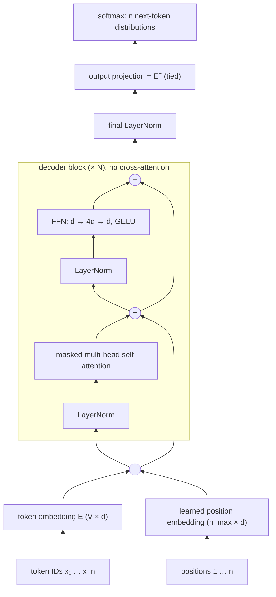

# 8.2 The GPT Architecture

Section 1 reduced the Chapter 6 Transformer to a decoder-only model. This section makes that model concrete, and almost nothing in it is new: a GPT is token embeddings, learned position embeddings, a stack of decoder blocks without cross-attention, a final LayerNorm, and an output projection tied to the embedding, all parts built in Chapters 6 and 7. We follow the arrangement of GPT-2 (Radford et al. 2019), count its parameters with the rules of Section 7.5 and check the count against the released GPT-2 and GPT-3 models, and then look at three substitutions that most recent models make inside the same block: RMSNorm, rotary position embeddings, and a SwiGLU feed-forward network.

## The model

A GPT maps a sequence of $`n \le n_{\max}`$ token IDs to $`n`$ next-token distributions. From bottom to top:

1. **Embeddings.** Each token ID selects a row of the token embedding matrix $`E \in \mathbb{R}^{V \times d}`$ (Section 6.2), and each position $`p = 1, \dots, n`$ selects a row of a learned position embedding matrix $`P \in \mathbb{R}^{n_{\max} \times d}`$ (Section 6.6). The two are added: $`H^{(0)} = E_{\mathbf{x}} + P_{1:n}`$. The first GPT used learned positions instead of the sinusoids of the original Transformer (Radford et al. 2018), and GPT-2 and GPT-3 kept them.
2. **A stack of $`N`$ decoder blocks**, each mapping $`H^{(\ell - 1)} \in \mathbb{R}^{n \times d}`$ to $`H^{(\ell)}`$ of the same shape.
3. **A final LayerNorm** on the output of the last block.
4. **An output projection** from width $`d`$ to $`V`$ logits, followed by a softmax. As in the original Transformer (Section 6.2; Press and Wolf 2017), the projection matrix is the token embedding matrix itself: the logits are $`\mathrm{LayerNorm}(H^{(N)})\, E^\top`$.

Tying the output projection to the embedding saves a $`V \times d`$ matrix, which is a large fraction of a small model (a third of GPT-2 small, as the count below shows). There is also a natural reason for it: a token's input embedding and its output vector both describe the same token, and the logit for token $`i`$ is a dot product that measures how well the final hidden state matches the embedding of $`i`$.

## The block

Each block is the decoder block of Section 7.2 with its cross-attention sublayer removed. What is left has the two sublayers of the encoder block (Section 7.1), masked multi-head self-attention and a position-wise FFN, but the self-attention uses the causal mask (Section 6.4), so position $`t`$ attends only to positions $`1, \dots, t`$. Heads, projections, and shapes are exactly those of Section 6.5: $`h`$ heads of dimension $`d_k = d/h`$, with $`W_Q, W_K, W_V, W_O \in \mathbb{R}^{d \times d}`$. The FFN has hidden width $`d_{\text{ff}} = 4d`$.

The first GPT replaced the FFN's ReLU with the **Gaussian error linear unit** (GELU; Hendrycks and Gimpel 2016), $`\mathrm{GELU}(z) = z\,\Phi(z)`$, where $`\Phi`$ is the standard normal cumulative distribution function (Section 2.2). GELU is a smooth version of ReLU: it lets small negative inputs through slightly instead of cutting them off at zero. GPT-2 kept it, in the $`\tanh`$-based approximation given in Section 2.2.

## GPT-2's arrangement

GPT-2 kept the first GPT's design with a few changes to make deeper models train well (Radford et al. 2019):

- **Pre-norm blocks.** LayerNorm moved from after each residual addition to the input of each sublayer, the pre-norm arrangement of Section 7.1. The residual stream is then a plain sum from the embeddings to the top of the stack, which gives gradients a clean identity path (Section 3.4).
- **A final LayerNorm** after the last block. In a pre-norm stack, the residual stream is never normalized on the way up (Section 7.1), so it is normalized once before the output projection.
- **Scaled initialization of the residual branches.** Each block adds two branches to the residual stream, attention and FFN, so a stack of $`N`$ blocks adds $`2N`$ terms to the embeddings. If every term has similar variance, the variance of the stream grows with depth (the argument of Section 3.3). GPT-2 scales the weights of the last layer of each residual branch, the attention output projection $`W_O`$ and the FFN's second matrix, by $`1/\sqrt{2N}`$ at initialization, so that the sum of all $`2N`$ branches starts with roughly the variance of one. The paper states this as a factor of $`1/\sqrt{N}`$ where $`N`$ counts residual layers, which is $`2N`$ in this chapter's notation.

The block therefore computes

```math
H \leftarrow H + \mathrm{MultiHead}\big(\mathrm{LayerNorm}(H);\ \text{causal mask}\big), \qquad H \leftarrow H + \mathrm{FFN}\big(\mathrm{LayerNorm}(H)\big).
```

GPT-2 also increased the context length from the first GPT's 512 tokens to $`n_{\max} = 1{,}024`$ and used a byte-level BPE vocabulary of $`V = 50{,}257`$ tokens (Chapter 5). GPT-3 used the same model and architecture, including the modified initialization and pre-normalization, with $`n_{\max} = 2{,}048`$; its one architectural change was to alternate dense attention layers with sparse, locally banded ones (Brown et al. 2020).



*Figure 8.2.1. The GPT-2 architecture. The side arrows into each "+" are the residual connections; LayerNorm sits on each sublayer's input (pre-norm), and one more LayerNorm follows the last block.*

## Counting parameters

Section 7.5 counted $`4d^2`$ weights for an attention sublayer and $`2 d\, d_{\text{ff}} = 8d^2`$ for an FFN with $`d_{\text{ff}} = 4d`$, giving $`16d^2`$ for a decoder block with cross-attention. Removing cross-attention's $`4d^2`$ leaves $`12d^2`$ per block, the same as an encoder block. Adding the token and position embeddings (the output projection is tied, so it adds nothing),

```math
P \approx 12Nd^2 + Vd + n_{\max} d.
```

The first term is the part that grows with depth and width; Kaplan et al. (2020) call it the non-embedding parameter count. Biases and LayerNorm gains add $`13d`$ per block and $`2d`$ for the final LayerNorm, too few to matter except in small models.

For GPT-2 small ($`N = 12`$, $`d = 768`$, $`h = 12`$, $`d_{\text{ff}} = 3{,}072`$, $`V = 50{,}257`$, $`n_{\max} = 1{,}024`$) the formula gives

```math
12 \cdot 12 \cdot 768^2 + 50{,}257 \cdot 768 + 1{,}024 \cdot 768 = 84{,}934{,}656 + 38{,}597{,}376 + 786{,}432 = 124{,}318{,}464,
```

and adding biases and LayerNorms gives 124,439,808, exactly the number of parameters in the model of [Code 8.2.1](#code-821-a-gpt-in-about-a-hundred-lines-gptpy) and in the released checkpoint. The GPT-2 paper reported 117 million for this model. The same holds for all four GPT-2 sizes:

| Model | $`N`$ | $`d`$ | Formula | With biases and LayerNorms | Reported in the paper |
|---|---|---|---|---|---|
| GPT-2 small | 12 | 768 | 124.3M | 124,439,808 | 117M |
| GPT-2 medium | 24 | 1,024 | 354.5M | 354,823,168 | 345M |
| GPT-2 large | 36 | 1,280 | 773.4M | 774,030,080 | 762M |
| GPT-2 XL | 48 | 1,600 | 1,556.6M | 1,557,611,200 | 1,542M |

The exact counts match the parameters of the released checkpoints (checked in [Code 8.2.3](#code-823-the-formula-for-all-four-gpt-2-sizes) for small, medium, and large). The reported numbers are consistently smaller; the paper does not explain its counts, so the released checkpoints are the better reference. In GPT-2 small, the tied embedding matrix holds 38.6 million of the 124 million parameters, almost a third. In GPT-2 XL it is about 5%, since $`12Nd^2`$ grows with $`Nd^2`$ while $`Vd`$ grows only with $`d`$.

For GPT-3 ($`N = 96`$, $`d = 12{,}288`$, $`n_{\max} = 2{,}048`$, same vocabulary; Brown et al. 2020), the formula gives 174.6 billion, within 0.3% of the reported 175 billion. At that size the embeddings are about 0.4% of the total, and $`P \approx 12Nd^2`$ is an excellent approximation.

## Changes in recent models

Most decoder-only models since GPT-3 keep the design above but make three substitutions inside the block. LLaMA (Touvron et al. 2023) is a widely copied example; its paper lists all three, along with pre-normalization, as its departures from the original Transformer.

**RMSNorm instead of LayerNorm.** RMSNorm (Zhang and Sennrich 2019; Section 3.5) rescales each vector by its root mean square, $`\mathrm{RMSNorm}(\mathbf{x}) = \boldsymbol{\gamma} \odot \mathbf{x} / \mathrm{RMS}(\mathbf{x})`$, skipping LayerNorm's mean subtraction and additive bias. It is slightly cheaper and works as well in practice. It is still applied in the pre-norm position.

**Rotary position embeddings instead of learned absolute positions.** RoPE (Su et al. 2024; Section 6.6) removes the position embedding table. Instead, inside every attention layer, it rotates each pair of dimensions of every query and key vector by an angle proportional to the token's position. The attention score between positions $`t`$ and $`s`$ then depends on their positions only through the offset $`t - s`$, as Section 6.6 verified. Positions enter through the queries and keys only; the values and the residual stream carry no position vector. The $`n_{\max} d`$ term drops out of the parameter count, and the model is no longer limited to a fixed table of positions, although generalizing to offsets never seen in training is another matter (Section 6.6).

**A SwiGLU feed-forward network instead of ReLU or GELU.** A **gated linear unit** computes two linear projections of the input and multiplies one by a nonlinear function of the other, elementwise. The SwiGLU variant (Shazeer 2020) uses the SiLU (Swish) activation of Chapter 2, $`\mathrm{SiLU}(z) = z\,\sigma(z)`$, as the gate:

```math
\mathrm{FFN}_{\text{SwiGLU}}(\mathbf{x}) = W_2\big(\mathrm{SiLU}(W_1 \mathbf{x}) \odot W_3 \mathbf{x}\big), \qquad W_1, W_3 \in \mathbb{R}^{d_{\text{ff}} \times d}, \quad W_2 \in \mathbb{R}^{d \times d_{\text{ff}}},
```

usually without biases. Shazeer compared several gated variants in the Transformer's FFN and found that they improved language-modeling quality over the ReLU and GELU versions at the same parameter count.

SwiGLU has three weight matrices instead of two, so at the same hidden width it would have $`3 d\, d_{\text{ff}}`$ weights instead of $`2 d\, d_{\text{ff}}`$. To keep the parameter count unchanged, the hidden width is shrunk from $`4d`$ to $`\tfrac{2}{3} \cdot 4d = \tfrac{8}{3} d`$:

```math
3 \cdot d \cdot \tfrac{8}{3} d = 8d^2.
```

The FFN still has about $`8d^2`$ weights, and the block still has about $`12d^2`$. For $`d = 768`$, $`d_{\text{ff}} = 2{,}048`$ and the SwiGLU FFN has exactly $`8d^2 = 4{,}718{,}592`$ weights, as [Code 8.2.4](#code-824-a-block-with-rmsnorm-rope-and-swiglu) confirms. The LLaMA paper specifies the hidden width as $`\tfrac{2}{3} \cdot 4d`$; released models round it to a hardware-friendly multiple, so TinyLlama, for example, with $`d = 2{,}048`$, uses $`d_{\text{ff}} = 5{,}632`$ rather than 5,461.

| Component | GPT-2 | Typical recent model (e.g., LLaMA) |
|---|---|---|
| Normalization | LayerNorm, pre-norm | RMSNorm, pre-norm |
| Positions | learned absolute, added to embeddings | rotary, applied to queries and keys |
| FFN | $`W_2\,\mathrm{GELU}(W_1 \mathbf{x})`$, $`d_{\text{ff}} = 4d`$ | SwiGLU, $`d_{\text{ff}} \approx \tfrac{8}{3} d`$ |
| Biases | yes | usually none |
| Weights per block | about $`12d^2`$ | about $`12d^2`$ |

None of these changes alters the shape of the computation: a pre-norm stack of blocks, each with causal self-attention and a position-wise FFN on a residual stream. Other changes that recent models make to attention itself, such as sharing keys and values across heads to shrink the key-value cache, are about inference cost and belong to Chapter 13.

## Implementation

[Code 8.2.1](#code-821-a-gpt-in-about-a-hundred-lines-gptpy) implements GPT-2 in about a hundred lines of PyTorch. It follows Chapter 6's multi-head attention (Section 6.5) with two conveniences: the three input projections are stored as one $`d \times 3d`$ matrix, split after the multiplication, and the attention itself calls PyTorch's `F.scaled_dot_product_attention` with `is_causal=True`, which applies the causal mask of Section 6.4 internally. Phuong and Hutter (2022) give the same decoder-only forward pass as pseudocode, a useful reference for checking an implementation line by line.

Three checks in [Code 8.2.2](#code-822-parameter-count-leak-test-and-gpt-2s-released-weights) confirm that the model is right:

- **Parameter count.** A GPT-2 small configuration has 124,439,808 parameters, matching the formula plus biases and LayerNorms.
- **Causal leak test.** As in Section 6.4, changing the tokens from position 10 onward leaves the logits at positions 1 to 9 unchanged.
- **Released weights.** Copying GPT-2 small's released weights into the model reproduces the logits of Hugging Face's `GPT2LMHeadModel` on the same input, with a largest difference of $`1.2 \times 10^{-4}`$ on logits as large as 115 in magnitude, which is floating-point rounding. The only subtlety is that Hugging Face stores GPT-2's linear layers as `Conv1D` modules whose weight matrices are the transpose of `nn.Linear`'s.

[Code 8.2.4](#code-824-a-block-with-rmsnorm-rope-and-swiglu) builds a block with the three recent substitutions (RMSNorm, RoPE, and SwiGLU with $`d_{\text{ff}} = \tfrac{8}{3} d`$), confirms that it is still causal, and counts its weights: exactly $`12d^2`$ plus the two RMSNorm gain vectors.

The architecture is now fixed, but a model this general learns only what its training text contains. Where does pretraining text come from, and how is it turned into the blocks of $`n + 1`$ tokens that Section 1 assumed?

## Code for this section

The listings below collect the code for this section in the order in which the text refers to them. They need PyTorch and run on a CPU; Code 8.2.2 and 8.2.3 also need Hugging Face `transformers`, which downloads the released GPT-2 weights on first use.

### Code 8.2.1: A GPT in about a hundred lines (gpt.py)

The complete GPT-2 model: causal self-attention with a fused query-key-value projection, a GELU FFN, pre-norm blocks, learned positions, a final LayerNorm, and a tied output projection.

Notebook: [8.2.1-a-gpt-in-about-a-hundred-lines-gptpy.ipynb](../../code/08-generative-pretraining-gpt/8.2.1-a-gpt-in-about-a-hundred-lines-gptpy.ipynb)

### Code 8.2.2: Parameter count, leak test, and GPT-2's released weights

Builds a GPT-2 small configuration, compares its parameter count with the formula, runs the causal leak test of Section 6.4, then copies in GPT-2 small's released weights and compares the logits with Hugging Face's `GPT2LMHeadModel`. It imports Code 8.2.1.

Notebook: [8.2.2-parameter-count-leak-test-and-gpt-2s-released-weights.ipynb](../../code/08-generative-pretraining-gpt/8.2.2-parameter-count-leak-test-and-gpt-2s-released-weights.ipynb)

### Code 8.2.3: The formula for all four GPT-2 sizes

Evaluates $`12Nd^2 + Vd + n_{\max} d`$ and the exact count with biases and LayerNorms for the four GPT-2 sizes, and counts the parameters of the released medium and large checkpoints.

Notebook: [8.2.3-the-formula-for-all-four-gpt-2-sizes.ipynb](../../code/08-generative-pretraining-gpt/8.2.3-the-formula-for-all-four-gpt-2-sizes.ipynb)

### Code 8.2.4: A block with RMSNorm, RoPE, and SwiGLU

A block with the three recent substitutions. It checks that the SwiGLU FFN with $`d_{\text{ff}} = \tfrac{8}{3} d`$ has $`8d^2`$ weights, that the block has $`12d^2`$ weights plus two RMSNorm gain vectors, and that it is still causal, then applies the parameter formula to GPT-3.

Notebook: [8.2.4-a-block-with-rmsnorm-rope-and-swiglu.ipynb](../../code/08-generative-pretraining-gpt/8.2.4-a-block-with-rmsnorm-rope-and-swiglu.ipynb)

## Key takeaways

- A GPT is token embeddings plus learned position embeddings, $`N`$ decoder blocks without cross-attention, a final LayerNorm, and an output projection tied to the token embedding.
- Each block has masked multi-head self-attention and a GELU FFN, each on a residual branch; GPT-2 moved LayerNorm to the input of each sublayer (pre-norm) and scaled the residual branches' output weights by $`1/\sqrt{2N}`$ at initialization.
- A block has about $`12d^2`$ weights, so $`P \approx 12Nd^2 + Vd + n_{\max} d`$: 124.3 million for GPT-2 small (124,439,808 with biases and LayerNorms, the released checkpoint's size, although the paper reported 117 million) and 174.6 billion for GPT-3.
- Recent models swap in RMSNorm, rotary position embeddings, and a SwiGLU FFN with $`d_{\text{ff}} = \tfrac{8}{3} d`$, which keeps the FFN at $`8d^2`$ weights and the block at $`12d^2`$.
- The whole model is about a hundred lines of PyTorch built from the parts of Chapters 6 and 7, and released GPT-2 weights load into it directly.

## Further reading

Brown, Tom B., et al. "Language Models Are Few-Shot Learners." In *Advances in Neural Information Processing Systems 33*, 2020. https://arxiv.org/abs/2005.14165.

Hendrycks, Dan, and Kevin Gimpel. "Gaussian Error Linear Units (GELUs)." arXiv preprint arXiv:1606.08415, 2016. https://arxiv.org/abs/1606.08415.

Kaplan, Jared, et al. "Scaling Laws for Neural Language Models." arXiv preprint arXiv:2001.08361, 2020. https://arxiv.org/abs/2001.08361.

Phuong, Mary, and Marcus Hutter. "Formal Algorithms for Transformers." arXiv preprint arXiv:2207.09238, 2022. https://arxiv.org/abs/2207.09238.

Press, Ofir, and Lior Wolf. "Using the Output Embedding to Improve Language Models." In *Proceedings of the 15th Conference of the European Chapter of the Association for Computational Linguistics*, 2017. https://arxiv.org/abs/1608.05859.

Radford, Alec, Karthik Narasimhan, Tim Salimans, and Ilya Sutskever. "Improving Language Understanding by Generative Pre-Training." OpenAI technical report, 2018. https://cdn.openai.com/research-covers/language-unsupervised/language_understanding_paper.pdf.

Radford, Alec, et al. "Language Models Are Unsupervised Multitask Learners." OpenAI technical report, 2019. https://cdn.openai.com/better-language-models/language_models_are_unsupervised_multitask_learners.pdf.

Shazeer, Noam. "GLU Variants Improve Transformer." arXiv preprint arXiv:2002.05202, 2020. https://arxiv.org/abs/2002.05202.

Su, Jianlin, et al. "RoFormer: Enhanced Transformer with Rotary Position Embedding." *Neurocomputing* 568 (2024): 127063. https://arxiv.org/abs/2104.09864.

Touvron, Hugo, et al. "LLaMA: Open and Efficient Foundation Language Models." arXiv preprint arXiv:2302.13971, 2023. https://arxiv.org/abs/2302.13971.

Zhang, Biao, and Rico Sennrich. "Root Mean Square Layer Normalization." In *Advances in Neural Information Processing Systems 32*, 2019. https://arxiv.org/abs/1910.07467.
