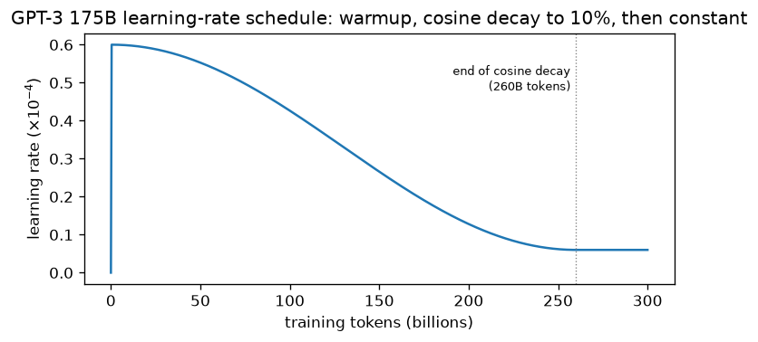
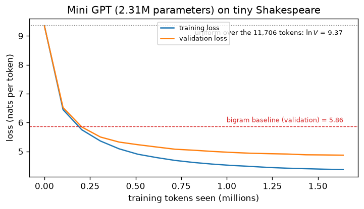
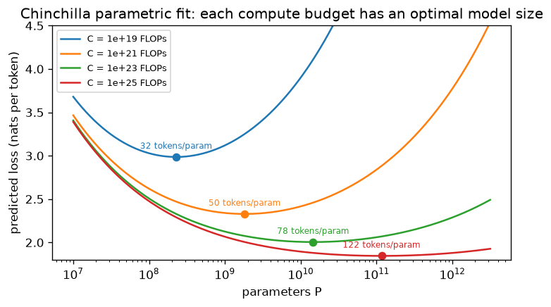

# 8.4 Training at Scale

The model of Section 2 and the packed data of Section 3 are all a pretraining run needs; what remains is to train one on the other. The training loop is the one Section 7.3 wrote for translation: a batch of blocks, a forward pass, the cross-entropy loss of Section 1, a backward pass, and an optimizer step. What changes is the scale. A single run can process hundreds of billions of tokens on thousands of accelerators for weeks, and it is too expensive to repeat. This section covers the optimization recipe that such runs share, how the batch is measured and fitted onto hardware, how to estimate a run's compute before starting it, and the **scaling laws** that tell us how to split a compute budget between model size and data. We also pretrain the mini GPT of Section 2 on tiny Shakespeare and compare it with the bigram baseline of Section 1.

## The optimization recipe

Section 7.3 trained the original Transformer with Adam, a warmup followed by inverse-square-root decay, dropout, and label smoothing. GPT-style pretraining keeps the warmup and changes most of the rest.

- **AdamW.** The optimizer is Adam with **decoupled weight decay** (Loshchilov and Hutter 2019; Section 3.6): each step shrinks the weights directly by a small fraction, instead of adding an L2 penalty to the loss, where Adam's per-parameter scaling would distort it. Decay is usually applied to the weight matrices only, not to biases or normalization gains.
- **Warmup, then cosine decay.** The learning rate rises linearly from zero for a short warmup and then follows half a cosine down to a small final value (Section 3.7). Unlike the inverse-square-root schedule of Section 7.3, which decays forever, the cosine schedule is tied to the planned length of the run: it reaches its minimum when training ends.
- **Gradient clipping.** The global gradient norm is clipped, usually at 1.0 (Section 3.2), which keeps a rare large gradient from wrecking the weights.
- **Little or no dropout, no label smoothing.** Section 1 explained why pretraining drops label smoothing. Dropout exists to fight overfitting, but a large pretraining run sees most of its text only once, so the training loss is itself an unbiased estimate of the validation loss and there is little overfitting to fight. Many large models train without dropout.

GPT-3 is a representative example (Brown et al. 2020). All its sizes used Adam with $`\beta_1 = 0.9`$, $`\beta_2 = 0.95`$, and $`\epsilon = 10^{-8}`$, clipped the global gradient norm at 1.0, and used weight decay 0.1. The learning rate warmed up linearly over the first 375 million tokens and then decayed along a cosine to 10% of its peak over 260 billion tokens, continuing at that value to the end of the 300-billion-token run. Note the lower $`\beta_2`$ than Adam's default of 0.999: the second-moment estimate then averages over fewer steps and adapts faster when gradient statistics change, which helps stability in large runs.



*Figure 8.4.1. The learning-rate schedule of the 175-billion-parameter GPT-3 (peak $`0.6 \times 10^{-4}`$; Brown et al. 2020). The warmup is so short relative to the run that it looks like a vertical line.*

## Batches measured in tokens

Section 7.3 measured batches in tokens rather than sentences, about 25,000 source and 25,000 target tokens per step for the original Transformer. Pretraining batches are measured the same way, since every block has the same length: a batch of $`B`$ blocks holds $`B \times n`$ training positions. They are far larger. The 175-billion-parameter GPT-3 used batches of 3.2 million tokens, that is, about 1,600 blocks of 2,048 tokens per step, and its learning rate was $`0.6 \times 10^{-4}`$; smaller GPT-3 models used smaller batches and larger learning rates (Brown et al. 2020). GPT-3 also ramped the batch size up linearly from 32,000 tokens over the first 4 to 12 billion tokens of training. The idea is that early in training, when the gradients of different examples largely agree, a small batch already gives a good direction, and a large one would spend compute for little gain.

## Fitting the model on hardware

A batch of millions of tokens does not fit in one accelerator's memory, and neither, for large models, do the weights and optimizer state. Three techniques, used together, make the recipe runnable.

- **Mixed precision.** The forward and backward passes run in BF16 while the optimizer keeps FP32 master weights, the recipe of Section 3.9. BF16 halves activation memory and uses the accelerator's fastest matrix units, and because it keeps FP32's exponent range, it needs no loss scaling.
- **Gradient accumulation.** If only $`B'`$ blocks fit in memory, run $`B / B'`$ forward and backward passes, adding their gradients, before each optimizer step. The update is the same as for one batch of $`B`$ blocks (with the loss scaled by $`B'/B`$ so that it is an average), at the cost of time rather than memory.
- **Data parallelism.** Each of $`G`$ devices holds a copy of the model, processes a different slice of the batch, and the devices average their gradients before every step, so the step is again the same as for the whole batch. Models too large for one device must also be split across devices, by layers or within each matrix multiplication; those techniques are beyond the scope of this chapter.

How much memory does training need? Section 7.5 listed the parts: the weights, Adam's two moments per parameter, the gradients, and the activations. With mixed precision and Adam, a common accounting is 16 bytes per parameter before activations: 2 for the BF16 weights, 2 for the BF16 gradients, 4 for the FP32 master weights, and 8 for the two FP32 moments. That is about 2 GB for GPT-2 small, 112 GB for a 7-billion-parameter model, more than one 80 GB accelerator holds, and 2.8 TB for GPT-3 ([Code 8.4.1](#code-841-compute-and-memory-estimates)). Activations come on top and grow with $`B' \times n \times d \times N`$, which is what gradient accumulation keeps in check.

## Estimating compute

Section 7.5 counted about 2 FLOPs per parameter per token for the forward pass and twice that for the backward pass, 6 in total. For a model with $`P`$ parameters trained on $`D`$ tokens, the training compute is therefore about

```math
C \approx 6PD.
```

The rule counts only the weight matrices. Attention's scores and weighted sums add a term that grows with the context length, and Section 7.5 showed that it overtakes the weight term only when $`n \gt 6d`$. That is 4,608 tokens for GPT-2 small, whose context is 1,024, and 73,728 tokens for GPT-3, whose context is 2,048, so at GPT context lengths $`6PD`$ is accurate. For GPT-3, $`6 \cdot 175 \times 10^{9} \cdot 300 \times 10^{9} \approx 3.15 \times 10^{23}`$ FLOPs, against the $`3.14 \times 10^{23}`$ that Brown et al. (2020) reported.

Dividing $`C`$ by the throughput the hardware actually sustains gives the run's duration. Real training runs sustain only a fraction of an accelerator's peak FLOPs, because of memory traffic, communication between devices, and operations other than matrix multiplications, so the achieved throughput, not the peak, is the number to plan with.

## Pretraining a mini GPT

[Code 8.4.2](#code-842-pretraining-a-mini-gpt-on-tiny-shakespeare) applies the whole recipe to a model small enough to train on a laptop CPU in a few minutes: the GPT of Section 2 with $`N = 4`$ blocks, $`d = 128`$, $`h = 4`$, and context $`n = 128`$, trained on the tiny Shakespeare corpus of Section 1 with the same 90/10 split as the bigram baseline. To keep the run short, the embedding table covers only the 11,706 GPT-2 tokens that actually occur in the corpus; the token sequence is unchanged, so the losses remain comparable with the baseline's. The model has 2.31 million parameters, of which only 0.79 million are in the blocks: at this size, the $`Vd`$ embedding term of Section 2 dominates. It trains with AdamW ($`\beta_2 = 0.95`$, weight decay 0.1 on the weight matrices), a 50-step warmup and cosine decay to 10% of the peak learning rate of $`10^{-3}`$, gradient clipping at 1.0, and batches of 16 blocks, or 2,048 tokens. On a GPU the listing would run the forward pass under BF16 autocast; on a CPU it uses FP32.

The first check is the starting loss. Before training, the validation loss is 9.35 nats, next to $`\ln 11{,}706 \approx 9.37`$, as Section 1 predicts for an untrained model. After 800 steps, 1.6 million tokens or 5.4 passes over the training split, the validation loss is 4.87 nats, a perplexity of about 130, against 5.86 (perplexity 350) for the best bigram model of Section 1. That baseline spread its smoothing over all 50,257 GPT-2 tokens; smoothed over the same 11,706 tokens as the mini GPT, the bigram model improves to 5.48 ([Code 8.4.3](#code-843-a-fairer-bigram-baseline)), still 0.6 nats behind. The transformer has learned something beyond pairs of adjacent tokens. The training loss ends at 4.37, and the gap between the two curves in Figure 8.4.2 is the signature of repeated data: the model has begun to memorize a corpus it has seen five times, which is also why this run, unlike a large pretraining run, uses dropout 0.1. The gradient norm stays below 1 after warmup, so clipping is rarely active. The run took 186 seconds on our CPU. Its compute by the $`6PD`$ rule is $`6 \cdot 2.31 \times 10^{6} \cdot 1.64 \times 10^{6} \approx 2.3 \times 10^{13}`$ FLOPs, an achieved throughput of about 122 GFLOP/s. GPT-3's $`3.14 \times 10^{23}`$ FLOPs is more than ten billion times as much.



*Figure 8.4.2. Training and validation loss of the mini GPT against training tokens seen, evaluated every 50 steps, with the uniform model and the bigram baseline of Section 1 for reference.*

## Scaling laws

How good a model do we get for a given amount of compute, and how should that compute be spent? Kaplan et al. (2020) trained many decoder-only Transformers of different sizes on different amounts of data and found that the test loss follows smooth **power laws**. When the loss is limited by only one factor, it falls as a power of that factor:

```math
L(P) = \left(\frac{P_c}{P}\right)^{\alpha_P}, \qquad L(D) = \left(\frac{D_c}{D}\right)^{\alpha_D},
```

with $`\alpha_P \approx 0.076`$ for the non-embedding parameter count (the $`12Nd^2`$ of Section 2), $`\alpha_D \approx 0.095`$ for the data, and a similar law with exponent about 0.050 for compute used efficiently. Some of the trends held over more than seven orders of magnitude. Other architectural choices, such as the ratio of depth to width, mattered much less than the total size over a wide range. A power law is a straight line on a log-log plot: each tenfold increase in parameters removes the same fraction of the loss. The practical consequence is that the result of a large run can be predicted by fitting such laws to small runs and extrapolating, and that is how many pretraining budgets have been planned since.

## Compute-optimal training

Given a compute budget $`C \approx 6PD`$, a larger model means fewer tokens, and the question is where the best trade-off lies. Kaplan et al. concluded that the model size should grow much faster than the data, about as $`C^{0.73}`$, and GPT-3's 175 billion parameters trained on 300 billion tokens reflect that advice. Hoffmann et al. (2022) revisited the question. One reason for the different answer was that Kaplan et al. had used the same learning-rate schedule length for every run, so the losses of shorter runs were measured before their schedules had finished decaying, which overestimated them. Training over 400 models with schedules matched to their lengths, and analyzing the results with three different methods, Hoffmann et al. found that **model size and training tokens should grow in about equal proportion**: the optimal $`P`$ and $`D`$ both scale roughly as $`C^{0.5}`$. Their first method's estimates correspond to about **20 tokens per parameter**: 20.2 billion tokens for a 1-billion-parameter model, 205.1 billion for 10 billion parameters, and 1.5 trillion for 67 billion.

Their test of the prediction was **Chinchilla**, a 70-billion-parameter model trained on 1.4 trillion tokens with the same compute budget as their 280-billion-parameter Gopher, which had been trained on 300 billion tokens. Chinchilla outperformed Gopher, GPT-3, and other larger models across a wide range of evaluations, and, being four times smaller than Gopher, it also needed substantially less compute for fine-tuning and inference.

Their third method fits a parametric function to all the final losses:

```math
\mathcal{L}(P, D) \approx E + \frac{A}{P^{\alpha}} + \frac{B}{D^{\beta}},
```

with $`E = 1.69`$, $`A = 406.4`$, $`B = 410.7`$, $`\alpha = 0.34`$, and $`\beta = 0.28`$. The three terms have a clear reading. $`E`$ is the loss that no model can remove, the entropy of natural text itself; the second term is the penalty for a model with finite capacity; and the third is the penalty for finite data. Minimizing $`\mathcal{L}`$ subject to $`6PD = C`$ has a closed-form solution ([Code 8.4.4](#code-844-the-chinchilla-parametric-fit)). The fit predicts a loss of 1.937 for Chinchilla and 1.993 for Gopher, and it puts the optimum at 32 tokens per parameter for $`C = 10^{19}`$ FLOPs, rising to 122 at $`10^{25}`$: this method favors somewhat smaller models trained on more tokens than the other two, a difference Hoffmann et al. noted themselves. (With the simple $`6PD`$ rule, Chinchilla's and Gopher's budgets come out at $`5.9 \times 10^{23}`$ and $`5.0 \times 10^{23}`$ FLOPs, close but not identical to the "same budget" of the paper, which counted FLOPs in more detail.)



*Figure 8.4.3. The loss predicted by the Chinchilla parametric fit along curves of constant compute $`C = 6PD`$. For each budget, a model that is too small is limited by its capacity and one that is too large by its data; the dot marks the compute-optimal size.*

## Training beyond compute-optimal

"Compute-optimal" means the lowest loss for a given *training* budget. But a model is trained once and then used, often by many people for a long time, and every generated token costs inference compute proportional to $`P`$ (Chapter 13). A smaller model trained on more tokens than the compute-optimal amount reaches a given loss at a higher training cost but is cheaper at every use afterward. Touvron et al. (2023) made this argument explicitly for LLaMA: although Hoffmann et al. recommended training a 10-billion-parameter model on 200 billion tokens, they found that the performance of a 7-billion-parameter model continued to improve even after 1 trillion tokens, and they trained their smaller LLaMA models on 1 trillion tokens and the larger ones on 1.4 trillion. Many later models are trained on far more tokens per parameter still.

## Monitoring a run

A long run is watched through a few signals.

- **Training and validation loss against tokens seen.** Tokens, not steps, are the natural x-axis, since they are what compute and the scaling laws count. A healthy curve falls steeply and then slowly, roughly following a power law. When most text is seen only once, the training and validation curves stay close; a growing gap means the data is being repeated, as in the mini GPT run above.
- **The gradient norm.** Logged before clipping, it shows how often clipping is active and gives an early warning: a gradient norm that rises steadily or jumps often precedes trouble.
- **Loss spikes.** Large runs sometimes show sudden jumps in the loss. Some recover by themselves; others diverge. Common responses are to restart from a checkpoint shortly before the spike with the learning rate lowered, or to skip the batches that preceded it. Because a run cannot be repeated cheaply, checkpoints are saved regularly.
- **Throughput.** Tokens per second, compared with the $`6PD`$ estimate, shows whether the hardware is used efficiently.

The model at the end of such a run is a set of weights that assigns a probability to every possible next token. How do we turn those probabilities into text?

## Code for this section

The listings below collect the code for this section in the order in which the text refers to them. Code 8.4.2 needs PyTorch, `tiktoken`, the file `gpt.py` from Code 8.2.1, and `input.txt` from Code 8.1.2; the other listings are plain Python (Code 8.4.3 also uses `tiktoken`).

### Code 8.4.1: Compute and memory estimates

Applies $`C \approx 6PD`$ to GPT-3, computes the context length $`6d`$ above which attention's FLOPs exceed the weight FLOPs (Section 7.5), and counts the memory for mixed-precision training with Adam at 16 bytes per parameter.

Notebook: [8.4.1-compute-and-memory-estimates.ipynb](../../code/08-generative-pretraining-gpt/8.4.1-compute-and-memory-estimates.ipynb)

### Code 8.4.2: Pretraining a mini GPT on tiny Shakespeare

Trains the GPT of Code 8.2.1 (saved as `gpt.py`) on tiny Shakespeare with AdamW, warmup plus cosine decay, and gradient clipping, printing training and validation loss every 200 steps and the run's $`6PD`$ compute and achieved throughput.

Notebook: [8.4.2-pretraining-a-mini-gpt-on-tiny-shakespeare.ipynb](../../code/08-generative-pretraining-gpt/8.4.2-pretraining-a-mini-gpt-on-tiny-shakespeare.ipynb)

### Code 8.4.3: A fairer bigram baseline

Refits the add-$`\alpha`$ bigram model of Code 8.1.2 with its smoothing spread over only the tokens that occur in the corpus, the vocabulary of the mini GPT.

Notebook: [8.4.3-a-fairer-bigram-baseline.ipynb](../../code/08-generative-pretraining-gpt/8.4.3-a-fairer-bigram-baseline.ipynb)

### Code 8.4.4: The Chinchilla parametric fit

Evaluates the parametric loss fit of Hoffmann et al. (2022) for Gopher and Chinchilla, and finds the compute-optimal model size and token count for four budgets by minimizing the fit subject to $`6PD = C`$.

Notebook: [8.4.4-the-chinchilla-parametric-fit.ipynb](../../code/08-generative-pretraining-gpt/8.4.4-the-chinchilla-parametric-fit.ipynb)

## Key takeaways

- Pretraining uses AdamW with decoupled weight decay, linear warmup followed by cosine decay, gradient clipping at about 1.0, and little or no dropout; GPT-3 used $`\beta_1 = 0.9`$, $`\beta_2 = 0.95`$, and weight decay 0.1.
- Batches are measured in tokens and reach millions of tokens per step; mixed-precision (BF16) training, gradient accumulation, and data parallelism make them fit on hardware.
- Mixed-precision training with Adam needs about 16 bytes per parameter before activations.
- Training compute is about $`C \approx 6PD`$; the attention term is small at GPT context lengths, and the rule reproduces GPT-3's reported $`3.14 \times 10^{23}`$ FLOPs.
- Test loss falls as a smooth power law in model size, data, and compute, so large runs can be planned from small ones (Kaplan et al. 2020).
- For a fixed training budget, model size and data should grow in about equal proportion, roughly 20 tokens per parameter; Chinchilla (70B parameters, 1.4T tokens) beat the 280B Gopher trained with the same budget (Hoffmann et al. 2022).
- Models meant for wide use are often trained on far more tokens than compute-optimal, because a smaller model is cheaper at inference.

## Further reading

Brown, Tom B., et al. "Language Models Are Few-Shot Learners." In *Advances in Neural Information Processing Systems 33*, 2020. https://arxiv.org/abs/2005.14165.

Hoffmann, Jordan, et al. "Training Compute-Optimal Large Language Models." In *Advances in Neural Information Processing Systems 35*, 2022. https://arxiv.org/abs/2203.15556.

Kaplan, Jared, et al. "Scaling Laws for Neural Language Models." arXiv preprint arXiv:2001.08361, 2020. https://arxiv.org/abs/2001.08361.

Loshchilov, Ilya, and Frank Hutter. "Decoupled Weight Decay Regularization." In *International Conference on Learning Representations*, 2019. https://arxiv.org/abs/1711.05101.

Touvron, Hugo, et al. "LLaMA: Open and Efficient Foundation Language Models." arXiv preprint arXiv:2302.13971, 2023. https://arxiv.org/abs/2302.13971.
