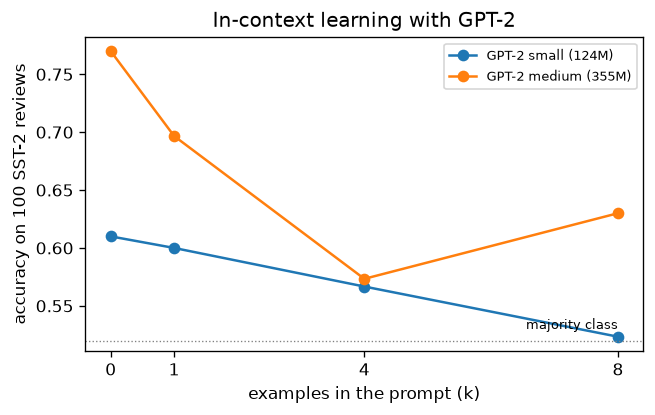
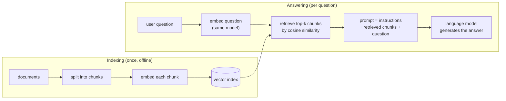

# 8.6 What Pretraining Produces

The last five sections built a GPT, trained it on a large collection of text, and generated from it. The result of all this work is called a **base model** (also a pretrained or foundation model): the network exactly as pretraining left it, before any further training. This section asks what such a model can and cannot do. It can continue any text, and a surprising range of tasks can be posed as text to continue: with the right prompt, a base model summarizes, translates, and answers questions, and it can pick up a new task from a few examples placed in the prompt. It does not, however, reliably do what a user asks, and it has no preference for true or harmless text over likely text. We look at each of these behaviors with GPT-2, at how retrieval can supply knowledge a model lacks, at how base models are evaluated, and at how the rest of the book turns a base model into an assistant.

## A base model continues text

Pretraining optimized a single objective: assign high probability to the next token of text from the training data. A base model therefore does one thing. Given a prompt, it produces a continuation that is likely *as a continuation of a document from its training data*. Everything else follows from what those documents look like.

The mini GPT of Section 4 shows this in its simplest form. It was trained only on Shakespeare's plays, so whatever it is given, it continues with something shaped like a play: a speaker's name in capitals, a colon, a line break, and a few lines of verse (Section 5). The prompt "ROMEO:" is continued with a speech, because that is what follows a name and a colon in its training data.

GPT-2 was trained on WebText, slightly over 8 million web documents (Radford et al. 2019), so its idea of a likely continuation is that of the web. [Code 8.6.1](#code-861-a-base-model-continues-text) gives GPT-2 large (774 million parameters) a few prompts and, except where noted, decodes greedily. Given the question "What is the capital of France?" on a line by itself, it continues:

> The capital of France is Paris.
>
> What is the capital of the United States?
>
> The capital of the United States is Washington, D.C.
>
> What is the capital

The model knows the answer, and it gives it, but it does not stop: it treats the question as the first entry of a quiz or a list of questions and answers, and keeps writing the list. Given the instruction "Write a haiku about the ocean.", it does not write a haiku at all:

> A haiku is a poem that is written in a particular style, usually in a particular language. The style of the poem is determined by the author.
>
> A haiku is a poem

An instruction on a line by itself is, on the web, as likely to begin an article about the topic as to be followed by the requested text, and the model has no reason to prefer the second reading. (The repetition at the end is greedy decoding at work, Section 5.) This behavior is not a failure of the pretraining; it is what the objective asks for. The model has no concept of a user who wants something, only of documents and how they tend to go on. Even a prompt that begins the answer is no guarantee: given "The capital of France is", greedy decoding produces " the capital of France." and not "Paris".

## Zero-shot behavior from prompt design

If a base model does whatever makes the document most likely, then one way to get it to perform a task is to write the start of a document in which performing the task is the most likely continuation. Radford et al. (2019) showed that GPT-2 could do several tasks this way, with no training on the task at all, a setting called **zero-shot**.

The best-known example is summarization. On the web, the abbreviation "TL;DR:" ("too long; didn't read") is often followed by a short summary of the text before it. Radford et al. appended "TL;DR:" to news articles and sampled 100 tokens with top-k sampling at $`k = 2`$, taking the first three generated sentences as the summary. The results resembled summaries, although they often focused on recent content from the article or confused details, and on the standard ROUGE metrics they only just beat choosing three random sentences from the article. Removing the "TL;DR:" hint lowered the score by 6.4 points, showing that the two words in the prompt were what invoked the behavior. In Code 8.6.1, GPT-2 large, given a short made-up news story about a new park followed by "TL;DR:", responds by copying the start of the story almost word for word, dropping only "on Tuesday":

> The city council voted to turn the old rail yard on the east side into a public park. The plan includes a playground, a community garden, and a path for bikes and pedestrians that will connect two

For this story, whose first sentence states the main news, that is a reasonable summary, but it was copied rather than written, and it runs on past the point where a summary should stop.

Other tasks can be posed the same way. For reading comprehension, Radford et al. gave GPT-2 a document, the conversation so far, and a final "A:", and its answers reached 55 F1 on the CoQA dataset, matching or exceeding three of four baseline systems without using any of the 127,000 training examples those systems had learned from. For translation, they conditioned the model on example pairs in the format "english sentence = french sentence" followed by a final "english sentence =". GPT-2 scored 5 BLEU on English-to-French and 11.5 on French-to-English, far below dedicated systems, but notable because non-English pages had been deliberately removed from WebText, and a language detector found only about 10 MB of French in it. In each case the task was specified entirely by the format of the prompt.

## Learning from examples in the prompt

Describing a task in words is one way to make it the likely continuation. Showing it is often better. Brown et al. (2020) organized this idea into three settings, all without any change to the weights:

- **Zero-shot:** the prompt contains only a description of the task, or just the input in a suitable format, and the model continues it.
- **One-shot:** the prompt also contains a single worked example, an input followed by its correct output.
- **Few-shot:** the prompt contains $`K`$ examples, followed by the new input. Brown et al. typically used $`K`$ between 10 and 100, as many as fit in GPT-3's context of 2,048 tokens.

A few-shot prompt for translating English words into French might read:

```text
house => maison
cat => chat
apple => pomme
cheese =>
```

The model sees a document in which every line has the same form, and the most likely continuation of the last line is its French translation. Brown et al. called this **in-context learning**: the model picks up the task from the examples in its context, during the forward pass, and the "learning" disappears as soon as the prompt does. Nothing is stored in the weights. The same pretrained model can do sentiment classification with one prompt and translation with the next.

GPT-3, at 175 billion parameters, showed how far this goes. On TriviaQA, a set of trivia questions answered without access to any documents, it reached 64.3% accuracy zero-shot, 68.0% one-shot, and 71.2% few-shot, the last a new state of the art for this closed-book setting, ahead of fine-tuned models. On the CoQA reading comprehension task on which GPT-2 had scored 55 F1, GPT-3 scored 81.5 zero-shot and 85.0 few-shot. Just as important was the trend across sizes. Brown et al. trained eight models from 125 million to 175 billion parameters, and the benefit of examples in the prompt grew with size: in their words, larger models make increasingly efficient use of in-context information. In-context learning is a capability that appears gradually with scale, not a trick that works equally for any language model.

It also has clear limits. Brown et al. found that GPT-3 did little better than chance, even few-shot, on some tasks that compare two sentences, such as deciding whether one sentence implies another. They also noted an open question about what in-context learning is: whether the model learns a new task "from scratch" at inference time, or recognizes a task it has already met during pretraining and uses the examples to identify it.

How much of this does a model the size of GPT-2 show? [Code 8.6.3](#code-863-in-context-learning-with-gpt-2) poses a simple task, labeling a movie review as positive or negative, using the SST-2 sentiment dataset (Socher et al. 2013). Each prompt holds $`k`$ labeled reviews drawn at random from the training set, in the format "Review: … / Sentiment: positive", followed by a review from the validation set and "Sentiment:". Instead of generating, the code compares the probabilities of the two label words " positive" and " negative" as the next token and counts how often the more likely one is correct, over 100 validation reviews and three random draws of the examples.



*Figure 8.6.1. Sentiment classification by comparing the next-token probabilities of " positive" and " negative", with $`k`$ labeled examples in the prompt (averaged over three random draws of examples for $`k \ge 1`$). At GPT-2's sizes, adding examples does not help.*

The result, in Figure 8.6.1, is a useful corrective. With no examples, GPT-2 medium (355 million parameters) labels 77% of the reviews correctly and GPT-2 small (124 million) 61%, against 52% for always guessing the more common label. The larger model is clearly better, so pretraining has taught both models something about sentiment that a prompt can reach. But adding examples makes both models *worse*: GPT-2 small falls steadily to 52% with 8 examples, and GPT-2 medium drops to 57% with 4 examples and recovers only to 63% with 8. These are small models and a small test set, and a different prompt format or a calibration step might change the picture. Still, the experiment agrees with Brown et al.'s finding that in-context learning strengthens with scale: GPT-3's smallest model had 125 million parameters, the size of GPT-2 small, and its few-shot gains were far weaker than those of the 175-billion-parameter model. The ability that made GPT-3 notable is barely present, if at all, in models of this size.

## What a base model does not do reliably

Everything a base model does, it does because it makes the text more likely. That explains its failures as well as its successes. Ouyang et al. (2022) put the problem this way: predicting the next token on a web page is a different objective from following the user's instructions helpfully and safely, so the language modeling objective is **misaligned** with what we want from an assistant. Three consequences stand out.

- **It does not reliably follow instructions.** A question or an instruction is just the start of a document. On the web, a question is often followed by more questions, as in a quiz, a list of frequently asked questions, or an exam, and an instruction is often followed by more instructions, as in an assignment sheet. A base model may continue in any of these ways, as GPT-2 did above. Prompt design can make the answer more likely, but the model has no notion that a user is waiting for one.
- **It does not refuse harmful requests.** If a request for dangerous or abusive content resembles text in the training data, a base model continues it like any other text. Nothing in next-token prediction distinguishes a request that should be declined.
- **It does not avoid falsehoods or bias.** The model learns what text is *likely*, not what is *true*. When a false claim or a stereotype is common in its training data, the model reproduces it, and when it lacks the knowledge a prompt asks for, it produces a plausible-sounding continuation anyway, like the invented councillor quoted in Section 5. Brown et al. (2020) noted that GPT-3 retains the biases of the data it was trained on, which may lead it to generate stereotyped or prejudiced content, and that its long samples still sometimes repeat themselves, lose coherence, or contradict themselves.

None of these is a bug in the training code; they follow from the objective. A better base model, trained on more and cleaner data, makes some of them less frequent, but a model that behaves as an assistant needs further training aimed at that behavior.

## Grounding a model in retrieved text

One of those failures has a partial remedy that needs no further training. A pretrained model knows only what was in its training data, frozen at the time the data was collected, and it stores that knowledge imperfectly in its weights. It cannot answer questions about a company's internal documents it never saw, about events after its training data was collected, or about the fine print of a specific contract, and when it lacks the information it produces a plausible continuation anyway. **Retrieval-augmented generation (RAG)** addresses this by combining the model with a search step: before generating, retrieve passages relevant to the question and put them in the prompt, so that the answer can be based on them. The retrieval uses an embedding model such as the encoders of Section 7.7, and the generation is the ordinary text generation of Section 5. Figure 8.6.2 shows the pipeline.



*Figure 8.6.2. Retrieval-augmented generation. Documents are chunked, embedded, and indexed once. For each question, the question is embedded with the same model, the most similar chunks are retrieved, and they are placed in the prompt together with the question for the language model to answer from.*

**Retrieval.** Offline, each document is split into chunks of a few hundred tokens, and each chunk is embedded with a sentence embedding model and stored in an index (Section 7.7). For each question, the question is embedded with the same model, and the chunks with the highest cosine similarity are retrieved.

**Generation.** The retrieved chunks are placed in the prompt, together with an instruction and the question. [Code 8.6.4](#code-864-assembling-a-retrieval-augmented-prompt) retrieves the two best passages for "I can't log in to my mailbox" from the small collection of Section 7.7 and assembles:

```text
Answer the question using only the numbered passages below. Cite the passages you use, and say so if they do not contain the answer.

[1] How to reset a forgotten email password.

[2] Steps for recovering access to your account.

Question: I can't log in to my mailbox. What should I do?
Answer:
```

From here, generation proceeds exactly as in Section 5, with the prompt as the document to continue. The format follows the lesson of this section: the prompt is written so that a grounded answer is the likely continuation. A base model may still wander off, as GPT-2 did above, so in practice the generator is usually a model fine-tuned to follow instructions (Chapter 9); the retrieval and the prompt are the same either way.

RAG has several attractive properties. The knowledge lives in the document collection rather than in the model's weights, so updating it means re-indexing documents, not retraining the model. It can use private data that was never in any training set. And because the model is shown its sources, it can cite them, which lets users check the answer. It is only as good as its retrieval, though, and most failures trace back to it:

- **The right chunk was never retrieved.** If the embedding model does not place the question near the passage that answers it, the model never sees the answer. Domain-specific vocabulary, such as legal, medical, or internal jargon, is a common cause, and hybrid keyword-plus-embedding search helps.
- **Chunking split the answer.** A chunk boundary can separate a statement from the context that qualifies it. Chunk size and overlap are tuning knobs.
- **Relevant is not the same as similar.** Embedding similarity measures relatedness of use (Section 4.3). A passage stating the opposite of the answer, or answering a closely related but different question, can score highly.
- **The model may ignore or misuse the context.** Retrieval reduces unsupported answers but does not eliminate them; the model can still misread a passage or fall back on what it learned in pretraining. Chapter 12 discusses how to evaluate systems like this.

## Evaluating a base model

How do we tell whether one base model is better than another? Three kinds of measurement are common, and later chapters return to each.

**Validation loss and perplexity.** The most direct measure is the one training optimizes: the average next-token loss on held-out text, or its exponential, the perplexity (Section 1). It is cheap, it is smooth, and it is what the scaling laws of Section 4 predict. Its limitation, as Section 1 explained, is that per-token numbers compare models only when they share a tokenizer.

**Bits per byte.** Dividing the total loss by the number of bytes of text instead of the number of tokens, and converting nats to bits, gives a measure that does not depend on the tokenizer (Section 5.8). [Code 8.6.2](#code-862-gpt-2-sizes-on-tiny-shakespeare) evaluates the three smallest GPT-2 models on the tiny Shakespeare validation split of Sections 1 and 4, text none of them was trained on specifically:

| Model | Parameters | Loss (nats/token) | Perplexity | Bits per byte |
|---|---|---|---|---|
| GPT-2 small | 124M | 4.009 | 55.1 | 1.876 |
| GPT-2 medium | 355M | 3.432 | 31.0 | 1.606 |
| GPT-2 large | 774M | 3.566 | 35.4 | 1.668 |

The mini GPT of Section 4, trained on the other 90% of this very corpus, reached a validation loss of 4.87 nats per token with the same tokens (measured on windows of 128 tokens rather than 1,024, which favors GPT-2 somewhat), so GPT-2 small, which never trained on tiny Shakespeare as such, predicts it better than a model trained on nothing else. Pretraining on a broad corpus gives a model that is good at text in general, including text of a kind it saw only a little of. The table also carries a warning. GPT-2 large does worse here than GPT-2 medium, although Radford et al. (2019) found that larger GPT-2 models were generally better on their language modeling benchmarks. One corpus of about 34,000 tokens, in an archaic style, is a narrow test, and a single loss number on one kind of text can mislead; evaluations average over many texts and tasks for this reason. Because all GPT-2 sizes share a tokenizer, the per-token losses here are directly comparable; bits per byte would also allow a comparison with a model that tokenizes differently, such as a character-level model.

**Few-shot benchmarks.** Loss says how well a model predicts text, but not directly how well it performs the tasks people care about. The GPT-3 results above are the other standard approach: a suite of tasks, each posed zero-shot or few-shot in a fixed prompt format, scored by accuracy or a task-specific metric. Such benchmarks measure what the model can do rather than how well it predicts, but their results depend on the prompt format, the number of examples, and the details of scoring, and a benchmark whose test questions appeared in the pretraining data measures memory rather than skill. Chapter 12 discusses how to choose and read such evaluations.

## From a base model to an assistant

A base model contains a great deal of knowledge and skill, but as we have seen, getting at it requires phrasing every request as a document to be continued, and even then the model may wander off, invent facts, or continue a harmful request. The remaining chapters of the book's training story address this, building on the pretrained model rather than replacing it.

- **Supervised fine-tuning (Chapter 9)** continues training the base model, with the same next-token loss, on demonstrations: prompts paired with the responses a helpful assistant should give, written or selected by people. The model learns the format of a conversation and the habit of answering the user.
- **Reinforcement learning (Chapter 10)** supplies the tools for improving a model from a score rather than from a demonstration: Markov decision processes, value functions, policy gradients, and Proximal Policy Optimization (PPO).
- **Learning from human preferences (Chapter 11)** applies those tools to language models. People compare pairs of model responses, a reward model is trained to predict their preferences, and the language model is optimized to produce responses that the reward model scores highly, while staying close to the fine-tuned model.
- **Further methods (Chapter 14)** extend and simplify this recipe: reinforcement learning without a value model, direct preference optimization, which learns from preferences without a separate reward model, and reinforcement learning with rewards that can be checked automatically, such as the correctness of a math answer.

Ouyang et al. (2022) demonstrated the combined effect with InstructGPT, which fine-tuned GPT-3 on demonstrations and then on human preferences. On the prompts that customers submitted to their API, people preferred the outputs of a 1.3-billion-parameter InstructGPT model to those of the 175-billion-parameter GPT-3, despite its having over 100 times fewer parameters. Pretraining had provided the knowledge and the skills; the further training taught the model to use them in the way users wanted.

This chapter has followed a GPT from its objective to its outputs: next-token prediction on unlabeled text, a decoder-only Transformer to compute it, a large filtered corpus to learn from, a training recipe that scales, decoding methods that turn probabilities into text, and the base model that results. That model is the starting point for everything that follows. Chapter 9 begins the work of turning it into an assistant.

## Code for this section

The listings below collect the code for this section in the order in which the text refers to them. They need PyTorch and Hugging Face `transformers`, which downloads the GPT-2 models on first use (Code 8.6.4 needs `sentence-transformers` instead); Code 8.6.2 needs `input.txt` from Code 8.1.2, and Code 8.6.3 needs Hugging Face `datasets` to download SST-2. They run on a CPU; Codes 8.6.2 and 8.6.3 take several minutes.

### Code 8.6.1: A base model continues text

Gives GPT-2 large (774 million parameters, about 3 GB to download on first use) a question, an instruction, the start of an answer, and a news story followed by "TL;DR:". The first three are decoded greedily; the summary is sampled with top-k at $`k = 2`$, as Radford et al. (2019) did.

Notebook: [8.6.1-a-base-model-continues-text.ipynb](../../code/08-generative-pretraining-gpt/8.6.1-a-base-model-continues-text.ipynb)

### Code 8.6.2: GPT-2 sizes on tiny Shakespeare

Computes the loss, perplexity, and bits per byte of GPT-2 small, medium, and large on the tiny Shakespeare validation split of Code 8.1.2, in non-overlapping windows of 1,024 tokens.

Notebook: [8.6.2-gpt-2-sizes-on-tiny-shakespeare.ipynb](../../code/08-generative-pretraining-gpt/8.6.2-gpt-2-sizes-on-tiny-shakespeare.ipynb)

### Code 8.6.3: In-context learning with GPT-2

Measures the accuracy of GPT-2 small and medium on the first 100 SST-2 validation reviews with 0, 1, 4, and 8 labeled training reviews in the prompt, by comparing the next-token logits of " negative" and " positive". Accuracies for $`k \ge 1`$ are averaged over three random draws of examples. Figure 8.6.1 plots these numbers.

Notebook: [8.6.3-in-context-learning-with-gpt-2.ipynb](../../code/08-generative-pretraining-gpt/8.6.3-in-context-learning-with-gpt-2.ipynb)

### Code 8.6.4: Assembling a retrieval-augmented prompt

Retrieves the two most similar documents for a question with the sentence embedding model and collection of Code 7.7.4, and builds the prompt shown in the text. It needs `sentence-transformers`, which downloads the model on first use. The prompt would then be passed to a model for generation, as in Code 8.6.1.

Notebook: [8.6.4-assembling-a-retrieval-augmented-prompt.ipynb](../../code/08-generative-pretraining-gpt/8.6.4-assembling-a-retrieval-augmented-prompt.ipynb)

## Key takeaways

- Pretraining produces a base model, which continues text: given a prompt, it produces what would likely come next in a document from its training data.
- A question or an instruction is just the start of a document, so a base model may answer it, continue it with more questions, or write about it instead.
- Many tasks can be posed as text to continue; GPT-2 summarized when "TL;DR:" followed an article and answered questions about a document, zero-shot (Radford et al. 2019).
- In-context learning uses examples in the prompt, zero-, one-, or few-shot, to specify a task without any weight updates; the benefit grows with model size (Brown et al. 2020) and is weak or absent at GPT-2's size in our experiment.
- The language modeling objective is misaligned with being a helpful assistant: base models do not reliably follow instructions, refuse harmful requests, or avoid falsehoods and the biases of their data.
- Retrieval-augmented generation retrieves passages with an embedding model (Section 7.7) and places them in the prompt, so the model can answer from documents it never trained on; it is only as good as its retrieval.
- Base models are evaluated by validation loss or perplexity, by bits per byte across tokenizers, and by few-shot benchmarks (Chapter 12).
- Supervised fine-tuning (Chapter 9) and learning from human preferences (Chapters 10, 11, and 14) turn a base model into an assistant; a small InstructGPT model was preferred to a GPT-3 over 100 times its size (Ouyang et al. 2022).

## Further reading

Brown, Tom B., et al. "Language Models Are Few-Shot Learners." In *Advances in Neural Information Processing Systems 33*, 2020. https://arxiv.org/abs/2005.14165.

Ouyang, Long, et al. "Training Language Models to Follow Instructions with Human Feedback." In *Advances in Neural Information Processing Systems 35*, 2022. https://arxiv.org/abs/2203.02155.

Radford, Alec, et al. "Language Models Are Unsupervised Multitask Learners." OpenAI technical report, 2019. https://cdn.openai.com/better-language-models/language_models_are_unsupervised_multitask_learners.pdf.

Socher, Richard, et al. "Recursive Deep Models for Semantic Compositionality Over a Sentiment Treebank." In *Proceedings of the 2013 Conference on Empirical Methods in Natural Language Processing*, 1631–1642, 2013. https://aclanthology.org/D13-1170/.
