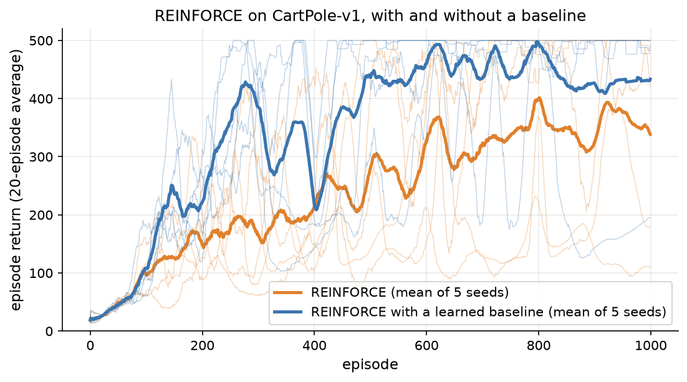
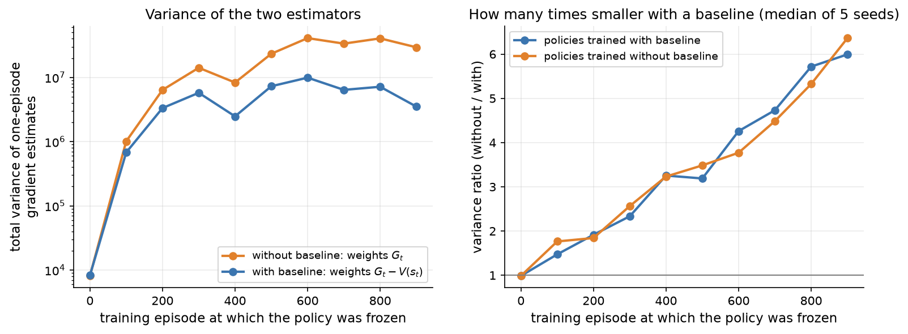
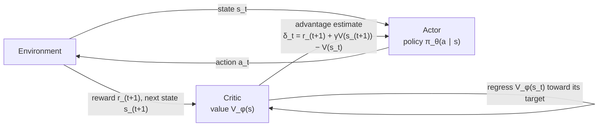
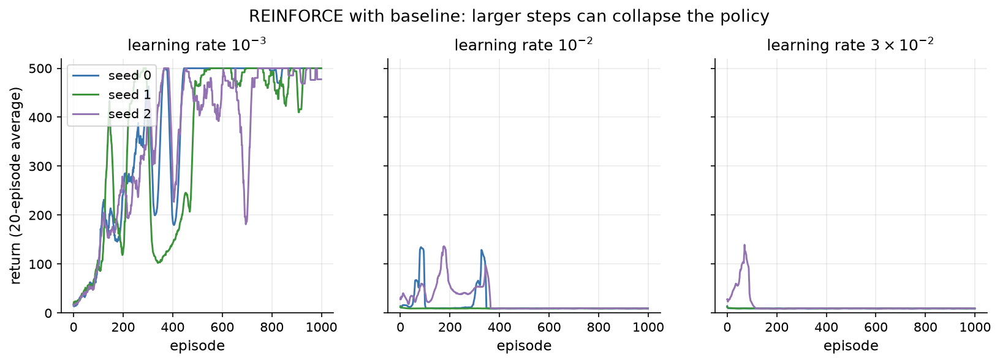

# 9.6 Policy Gradient Methods

The methods of Sections 9.4 and 9.5 learn a value function and derive a policy from it by acting greedily. That works well when there are a few discrete actions, but it becomes awkward when there are many (a language model chooses among tens of thousands of tokens at every step) or when actions are continuous (a robot's joint torques), and it produces deterministic policies even when a stochastic one would be better. *Policy gradient* methods take the direct route. They parameterize the policy itself, typically as a neural network $`\pi_\theta(a \mid s)`$, and adjust $`\theta`$ by gradient ascent on the expected return. This section derives the policy gradient, builds the REINFORCE algorithm and trains it on CartPole, shows how a baseline and the advantage function cut its variance, introduces actor-critic methods, and ends with the problem that motivates PPO: choosing how big a step to take.

## Optimizing the policy directly

Let $`\pi_\theta(a \mid s)`$ be a policy network with parameters $`\theta`$. For discrete actions its last layer produces one logit per action, and a softmax turns the logits into probabilities, exactly as in a classifier (Section 2.4) or a language model's next-token head. For continuous actions it can output the mean and standard deviation of a Gaussian. Either way, the policy is stochastic, differentiable in $`\theta`$, and easy to sample from.

Our objective is the expected return of the policy. For an episodic task, write $`\tau = (s_0, a_0, r_1, s_1, \dots)`$ for a trajectory and $`R(\tau) = \sum_t \gamma^t r_{t+1}`$ for its return. Then

```math
J(\theta) = \mathbb{E}_{\tau \sim \pi_\theta}\left[ R(\tau) \right],
```

where the expectation is over trajectories generated by running $`\pi_\theta`$ in the environment. We want to maximize $`J`$ by gradient ascent, $`\theta \leftarrow \theta + \eta \nabla_\theta J(\theta)`$. The difficulty is that $`\theta`$ affects $`J`$ only through the *distribution* of trajectories: the rewards themselves come from the environment, which is a black box we cannot differentiate. We need a way to compute the gradient of an expectation with respect to the parameters of the distribution it is taken over.

## The log-derivative trick

The key identity is the **log-derivative trick**. For any probability distribution $`p_\theta(x)`$, since $`\nabla_\theta \log p_\theta(x) = \nabla_\theta p_\theta(x) / p_\theta(x)`$,

```math
\nabla_\theta\, \mathbb{E}_{x \sim p_\theta}\left[ f(x) \right] = \sum_x f(x)\, \nabla_\theta p_\theta(x) = \sum_x f(x)\, p_\theta(x)\, \nabla_\theta \log p_\theta(x) = \mathbb{E}_{x \sim p_\theta}\left[ f(x)\, \nabla_\theta \log p_\theta(x) \right].
```

The gradient of an expectation becomes an expectation of something we can compute for each sample: the function value times the gradient of the log-probability of that sample, often called the *score*. We do not need to differentiate $f$ at all, so $f$ can be a black box such as an environment's reward. This is why the resulting estimator is also known as the **score-function estimator** or the likelihood-ratio estimator.

Apply it to trajectories. The probability of a trajectory is a product of the policy's action probabilities and the environment's transition probabilities,

```math
p_\theta(\tau) = p(s_0) \prod_{t} \pi_\theta(a_t \mid s_t)\, P(s_{t+1} \mid s_t, a_t),
```

so its logarithm is a sum, and the transition terms do not depend on $`\theta`$:

```math
\nabla_\theta \log p_\theta(\tau) = \sum_t \nabla_\theta \log \pi_\theta(a_t \mid s_t).
```

The unknown dynamics drop out entirely. Combining the two results gives the basic policy gradient:

```math
\nabla_\theta J(\theta) = \mathbb{E}_{\tau \sim \pi_\theta}\left[ R(\tau) \sum_t \nabla_\theta \log \pi_\theta(a_t \mid s_t) \right].
```

One refinement follows from causality. An action at time $t$ cannot affect rewards that arrived before $t$, and one can show that those earlier rewards contribute zero to the gradient in expectation. Dropping them replaces the full return $`R(\tau)`$ with the **reward-to-go** $`G_t`$, the return from time $t$ onward, and gives the form stated by the **policy gradient theorem**:

```math
\nabla_{\theta} J(\theta) = \mathbb{E}_{\pi_{\theta}}\left[ \sum_t \nabla_{\theta} \log \pi_{\theta}(a_t \mid s_t)\, G_t \right].
```

(The theorem proper, due to Sutton et al. (2000), states the gradient with $`Q^{\pi}(s_t, a_t)`$ in place of $`G_t`$; since $`G_t`$ is a sample whose expectation is $`Q^{\pi}(s_t, a_t)`$, the two forms agree in expectation. In the discounted setting we also drop a factor $`\gamma^t`$ in front of each term, as nearly all practical implementations do.)

The formula has an intuitive reading. The vector $`\nabla_\theta \log \pi_\theta(a_t \mid s_t)`$ is the direction in parameter space that makes action $`a_t`$ more likely in state $`s_t`$. The policy gradient moves in that direction for every action taken, weighted by how much return followed it. Actions followed by high returns become more probable, and actions followed by low returns become less probable. It is supervised learning on the agent's own actions, with each example weighted by how well things went.

We can check the identity numerically on a three-armed bandit with a softmax policy, where the exact gradient is easy to write down ([Code 9.6.1](#code-961-checking-the-log-derivative-trick)). With logits $(0.5, 0, -0.5)$ and mean rewards $(1, 2, 3)$, the exact gradient is $(-0.344, 0.098, 0.246)$: the policy should shift probability from the first arm to the better ones. The average of 200,000 single-sample score-function estimates is $(-0.341, 0.100, 0.240)$, in agreement up to sampling noise.

## REINFORCE

Replacing the expectation with an average over sampled episodes gives the **REINFORCE** algorithm (Williams 1992):

1. Run the current policy $`\pi_\theta`$ for one episode (or a few), recording states, actions, and rewards.
2. Compute the reward-to-go $`G_t`$ for every step.
3. Update $`\theta \leftarrow \theta + \eta \sum_t G_t\, \nabla_\theta \log \pi_\theta(a_t \mid s_t)`$.

In an automatic-differentiation framework, step 3 is implemented by building a **surrogate loss** whose gradient is the policy gradient,

```math
L(\theta) = -\sum_t \log \pi_\theta(a_t \mid s_t)\, G_t ,
```

treating $`G_t`$ as a constant, and calling `backward()`. The loss has the form of a cross-entropy loss on the actions the agent took, weighted by their returns. Its value means nothing by itself (it is not a measure of performance, and it can go up while the policy improves); only its gradient matters. [Code 9.6.2](#code-962-reinforce-with-an-optional-baseline) implements REINFORCE in PyTorch with a small policy network (two hidden layers of 64 tanh units) for CartPole, with $`\gamma = 0.99`$, the Adam optimizer at a learning rate of $`10^{-3}`$, and one update per episode.

REINFORCE is a **Monte Carlo** method in the sense of Section 9.4: it waits until the end of an episode and uses the actual returns, which are unbiased but noisy. Its learning curves on CartPole show the consequence (orange in Figure 9.14). Averaged over 5 random seeds, the return starts near 20, averages 98.0 over the first 200 episodes, and averages 365.5 over the last 100 of 1,000 episodes. But the individual runs are erratic. Two seeds end near the 500-step maximum, while another averages only 109 over its last 100 episodes, less than it managed during its first 200.



*Figure 9.14: REINFORCE on CartPole-v1 with and without a learned value baseline, five seeds each (thin lines) and their mean (thick lines), smoothed over 20 episodes. The baseline speeds up learning and makes it more reliable, although both methods still show sudden drops.*

## Baselines: less variance, no bias

The trouble with REINFORCE is the variance of its gradient estimates. In CartPole every reward is $+1$, so every $`G_t`$ is positive, and REINFORCE increases the probability of *every* action it took, merely increasing the good ones more than the bad ones. The signal that distinguishes good from bad actions is buried in a large common offset, and different episodes push the parameters in very different directions.

The fix is to subtract a **baseline** $`b(s_t)`$ from the return:

```math
\nabla_{\theta} J(\theta) = \mathbb{E}_{\pi_{\theta}}\left[ \sum_t \nabla_{\theta} \log \pi_{\theta}(a_t \mid s_t)\, \left( G_t - b(s_t) \right) \right].
```

Any baseline that depends on the state but not on the action leaves the expected gradient unchanged. The reason is that the score has zero mean: for any state,

```math
\mathbb{E}_{a \sim \pi_\theta}\left[ \nabla_\theta \log \pi_\theta(a \mid s) \right] = \sum_a \pi_\theta(a \mid s)\, \frac{\nabla_\theta \pi_\theta(a \mid s)}{\pi_\theta(a \mid s)} = \nabla_\theta \sum_a \pi_\theta(a \mid s) = \nabla_\theta 1 = 0,
```

so the extra term $`b(s_t)\, \nabla_\theta \log \pi_\theta(a_t \mid s_t)`$ averages to zero. A baseline adds no bias, but a good one can remove a great deal of variance. The best choices are close to the expected return from the state, and the standard choice is a learned estimate of the state value, $`b(s) = V_\phi(s)`$, a second network trained by regression on the observed returns, as in Monte Carlo prediction. With it, the weight on each action becomes $`G_t - V_\phi(s_t)`$: positive if things went better than usual from that state and negative if they went worse. Now bad actions are actively discouraged.

The three-armed bandit check confirms both claims. Using the expected reward $J$ as the baseline, the average of the estimates is still the exact gradient, $(-0.344, 0.100, 0.244)$, but the total variance of a single-sample estimate falls from 3.25 to 0.86, almost a factor of four.

On CartPole, the baseline (blue in Figure 9.14) makes learning both faster and more reliable. Averaged over 5 seeds, the mean return over episodes 201 to 500 is 345.6 with the baseline and 205.6 without, and over the last 100 episodes it is 427.2 versus 365.5. The 20-episode average first reaches 475 after about 250 to 360 episodes with the baseline, and after about 480 to 990 episodes without it. Learning is still not smooth: one baseline run drops from near 500 to an average of 172 over its last 100 episodes. We return to such collapses at the end of the section.

To see the variance reduction directly, [Code 9.6.3](#code-963-measuring-the-variance-of-the-gradient-estimate) freezes the policy every 100 episodes, samples 30 fresh episodes, computes the single-episode gradient estimate with both weightings, $`G_t`$ and $`G_t - V_\phi(s_t)`$, and measures the total variance of each (the sum of the variances of all parameter components). Figure 9.15 shows the result. At the start, when the value network knows nothing, the two are equal. As the critic learns, the baseline's advantage grows: the median ratio between the two variances rises to about 3 after 400 episodes and to about 6 by episode 900. The absolute variance of both estimators grows during training, because a better policy survives longer, so each episode's gradient sums over more steps with larger returns.



*Figure 9.15: Left: total variance of single-episode gradient estimates for policies frozen at different points of training (geometric mean over 5 seeds of the baseline runs), with returns G_t as weights (orange) and with G_t − V(s_t) (blue). Right: the ratio of the two variances (median over seeds), for policies from runs trained with and without the baseline. The critic is untrained at episode 0, so the ratio starts at 1.*

## The advantage function

The best baseline in the family is closely related to the value function, and the weight it produces has a name. The **advantage** of action $a$ in state $s$ is

```math
A^{\pi}(s,a) = Q^{\pi}(s,a) - V^{\pi}(s),
```

the amount by which taking $a$ (and then following $`\pi`$) is expected to beat the policy's average behavior from $s$. By construction, advantages average to zero under the policy. Written with advantages, the policy gradient is

```math
\nabla_{\theta} J(\theta) = \mathbb{E}_{\pi_{\theta}}\left[ \sum_t \nabla_{\theta} \log \pi_{\theta}(a_t \mid s_t)\, A^{\pi}(s_t, a_t) \right],
```

and $`G_t - V_\phi(s_t)`$ is simply a noisy, one-sample estimate of $`A^{\pi}(s_t, a_t)`$. Almost every modern policy gradient method, PPO and its LLM variants included, has this form: estimate an advantage for each action, then increase the log-probability of actions with positive advantage and decrease it for negative advantage. The methods differ in how they estimate the advantage and how they constrain the update.

## Actor-critic methods

REINFORCE with a baseline still uses the full Monte Carlo return $`G_t`$ and must wait for the end of each episode. The bootstrapping idea of Section 9.4 offers an alternative: estimate the advantage from one step of experience and the value network, using the TD error,

```math
\hat{A}_t = \delta_t = r_{t+1} + \gamma V_\phi(s_{t+1}) - V_\phi(s_t).
```

If $`V_\phi`$ were exactly $`V^{\pi}`$, the expected value of $`\delta_t`$ given $`s_t`$ and $`a_t`$ would be exactly $`A^{\pi}(s_t, a_t)`$. In practice $`V_\phi`$ is only an approximation, so the TD error trades a little bias for much lower variance, the same trade-off as between Monte Carlo and TD prediction. Methods that learn a policy together with a value function used in this way are called **actor-critic** methods. The policy is the **actor**, which chooses actions. The value network is the **critic**, which judges them, and the critic's judgment (the advantage) is what the actor learns from (Figure 9.16).



*Figure 9.16: The actor-critic architecture. The actor (the policy) acts in the environment. The critic (a value function) is trained to predict returns and provides the actor with advantage estimates, such as the TD error, in place of raw returns.*

Between the two extremes of the one-step TD error and the full return lie n-step estimates, and generalized advantage estimation (Section 9.7) averages them with a parameter $`\lambda`$, exactly as TD($`\lambda`$) does for values. A widely used synchronous version of actor-critic, **A2C** (advantage actor-critic), runs several copies of the environment in parallel, collects a few steps from each, and updates both networks on the combined batch; it grew out of the asynchronous A3C method of Mnih et al. (2016). PPO, in the next section, keeps this structure and changes how the actor is updated.

The critic plays a role here that is easy to confuse with the value-based methods of Section 9.5. There, the value function *is* the policy (act greedily with respect to $Q$). In an actor-critic method the critic only reduces the variance of the actor's gradient; the policy remains an explicit, stochastic network. This division of labor is what lets policy gradient methods handle huge or continuous action spaces: the actor can be a language model's full softmax over its vocabulary, and the critic only has to output a single number per state.

## On-policy data and its cost

All the gradients in this section are expectations over trajectories drawn from the *current* policy $`\pi_\theta`$. That makes policy gradient methods **on-policy**, like SARSA and unlike Q-learning. Once we take a gradient step, $`\theta`$ changes, and the episodes we just collected were generated by a policy that no longer exists. Using them again would give a biased estimate of the new policy's gradient. So basic policy gradient methods use each batch of experience for one gradient step and then throw it away.

This is expensive. In CartPole, REINFORCE with a baseline needed around 250 to 360 episodes, each up to 500 steps, before its 20-episode average first reached 475, and it used every one of those environment steps exactly once. When the environment is slow, such as a physics simulator or a language model generating long responses, collecting data dominates the cost of training, and throwing data away after a single step hurts. We would like to take several gradient steps on each batch.

## The step-size problem

Taking larger or more steps per batch runs straight into the second weakness of basic policy gradients: they have no notion of how far a step moves the policy. A gradient step of fixed size in parameter space can change the policy's action probabilities a little or a lot, depending on where in parameter space we are, and a policy network's softmax can saturate quickly, turning a moderately stochastic policy into a nearly deterministic one.

In supervised learning an overly large step is usually recoverable: the next batch of data is the same kind of data, and its gradient pulls the model back. In reinforcement learning, a bad step also changes the data. If an update makes the policy much worse, the next batch is collected by that worse policy, and it may contain little useful signal. A CartPole policy that always pushes the same way sees only short, nearly identical episodes, and a policy that has become deterministic stops exploring, so it never tries the actions that would show it how to recover. Performance can collapse and never come back.

Figure 9.17 shows this with REINFORCE with a baseline, changing only the learning rate. At $`10^{-3}`$ all three seeds learn to balance the pole. At $`10^{-2}`$, two seeds climb to 20-episode averages of about 135 and then collapse, and the third barely starts; at $`3 \times 10^{-2}`$, one seed briefly reaches 139 and the other two never get going. In all six runs with the larger learning rates, the average return over the last 100 episodes is between 9.2 and 9.4, which is what a policy that always pushes the cart in the same direction earns (9.4 steps on average for always-left and 9.3 for always-right over 100 episodes). The policy has become deterministic and bad, and because it no longer explores, the gradient no longer contains the information needed to escape. Even the stable learning rate shows the milder version of the problem: the sudden dips in Figure 9.14 are single updates that pushed the policy too far.



*Figure 9.17: REINFORCE with a learned baseline on CartPole-v1 with three learning rates, three seeds each (returns smoothed over 20 episodes). With a learning rate of 10⁻³ every run learns; with 10⁻² and 3 × 10⁻² every run collapses to a deterministic policy that earns about 9 per episode and never recovers.*

We could simply use a small learning rate, but that makes learning slow everywhere to avoid disasters in a few places, and it does nothing to let us reuse data. What we want is a way to take steps that are as large as is *safe*, measured not in parameter space but in how much the policy's behavior changes, and to take several of them on each batch of data. That is precisely what trust-region methods and Proximal Policy Optimization provide, and they are the subject of Section 9.7.

## Code for this section

The listings below collect the code for this section in the order in which the text refers to them. Code 9.6.1 is [`figures/src/score_function_check.py`](figures/src/score_function_check.py). Codes 9.6.2 and 9.6.3 are from [`figures/src/reinforce.py`](figures/src/reinforce.py); the script `run_reinforce_experiments.py` trains all the configurations in parallel (several minutes on a CPU), and `fig_s6_reinforce.py` draws Figures 9.14, 9.15, and 9.17 and prints the numbers quoted in the text.

### Code 9.6.1: Checking the log-derivative trick

Compares the exact gradient of a softmax policy's expected reward on a three-armed bandit with the average of 200,000 single-sample score-function estimates, with and without a baseline.

```python
import numpy as np

theta = np.array([0.5, 0.0, -0.5])          # logits
r_mean = np.array([1.0, 2.0, 3.0])          # expected reward of each arm
pi = np.exp(theta) / np.exp(theta).sum()

# Exact gradient: dJ/dtheta_k = pi_k (r_k - J)
J = pi @ r_mean
exact = pi * (r_mean - J)

rng = np.random.default_rng(0)
n = 200_000
a = rng.choice(3, size=n, p=pi)
r = rng.normal(r_mean[a], 1.0)              # noisy rewards
score = np.eye(3)[a] - pi                   # grad of log softmax: onehot(a) - pi
for name, b in [("no baseline", 0.0), ("baseline b = J", J)]:
    g = score * (r - b)[:, None]            # one gradient estimate per sample
    print(f"{name:15s} mean {np.round(g.mean(0), 3)}  total variance {g.var(0).sum():.3f}")
print(f"{'exact':15s} grad {np.round(exact, 3)}  (pi = {np.round(pi, 3)}, J = {J:.3f})")
```

Output:

```text
no baseline     mean [-0.341  0.1    0.24 ]  total variance 3.248
baseline b = J  mean [-0.344  0.1    0.244]  total variance 0.864
exact           grad [-0.344  0.098  0.246]  (pi = [0.506 0.307 0.186], J = 1.680)
```

### Code 9.6.2: REINFORCE with an optional baseline

A categorical policy network, a function that plays one episode, the reward-to-go computation, the surrogate loss, and the training loop. The value network is trained on the returns in both settings (so that Code 9.6.3 can use it), but only `use_baseline=True` subtracts its predictions in the policy update.

```python
import numpy as np
import torch
import torch.nn as nn
import gymnasium as gym

def mlp(inp, out, hidden=64):
    return nn.Sequential(nn.Linear(inp, hidden), nn.Tanh(),
                         nn.Linear(hidden, hidden), nn.Tanh(),
                         nn.Linear(hidden, out))

class Policy(nn.Module):
    """A categorical policy: the network outputs one logit per action."""
    def __init__(self, obs_dim, n_actions):
        super().__init__()
        self.logits = mlp(obs_dim, n_actions)

    def dist(self, s):
        return torch.distributions.Categorical(logits=self.logits(s))

def rollout(env, policy, seed=None):
    """Play one episode with the current policy; return states, actions, rewards."""
    s, _ = env.reset(seed=seed)
    states, actions, rewards = [], [], []
    done = False
    while not done:
        with torch.no_grad():
            a = int(policy.dist(torch.as_tensor(s, dtype=torch.float32)).sample())
        s2, r, terminated, truncated, _ = env.step(a)
        states.append(s)
        actions.append(a)
        rewards.append(r)
        s, done = s2, terminated or truncated
    return (torch.as_tensor(np.array(states), dtype=torch.float32),
            torch.as_tensor(actions), np.array(rewards, dtype=np.float32))

def rewards_to_go(rewards, gamma):
    """G_t = r_{t+1} + gamma r_{t+2} + ... for every step of one episode."""
    G, out = 0.0, np.zeros_like(rewards)
    for t in reversed(range(len(rewards))):
        G = rewards[t] + gamma * G
        out[t] = G
    return torch.as_tensor(out)

def policy_loss(policy, states, actions, weights):
    """Surrogate whose gradient is the REINFORCE estimate: -sum_t log pi(a_t|s_t) w_t."""
    logp = policy.dist(states).log_prob(actions)
    return -(logp * weights).sum()

def train_reinforce(use_baseline, n_episodes=1000, gamma=0.99, lr=1e-3,
                    lr_value=1e-3, seed=0, variance_every=None, n_var=30):
    torch.manual_seed(seed)
    env = gym.make("CartPole-v1")
    policy = Policy(4, 2)
    value = mlp(4, 1)
    opt_pi = torch.optim.Adam(policy.parameters(), lr=lr)
    opt_v = torch.optim.Adam(value.parameters(), lr=lr_value)
    returns, variances = [], []
    for ep in range(n_episodes):
        if variance_every and ep % variance_every == 0:
            variances.append((ep, *gradient_variance(env, policy, value, gamma, n_var,
                                                     seed=seed * 100_000 + ep)))
        states, actions, rewards = rollout(env, policy, seed=seed * 100_000 + ep)
        G = rewards_to_go(rewards, gamma)
        v = value(states).squeeze(1)                 # critic: regress V(s_t) on G_t
        v_loss = ((v - G) ** 2).mean()
        opt_v.zero_grad()
        v_loss.backward()
        opt_v.step()
        weights = G - v.detach() if use_baseline else G
        loss = policy_loss(policy, states, actions, weights)
        opt_pi.zero_grad()
        loss.backward()
        opt_pi.step()
        returns.append(rewards.sum())
    return np.array(returns), variances
```

### Code 9.6.3: Measuring the variance of the gradient estimate

For the current, frozen policy, samples `n` episodes, computes the flattened gradient of the surrogate loss for each episode with both weightings, and returns the total variance (the trace of the covariance matrix) of each set of estimates. It reuses the definitions of Code 9.6.2.

```python
def flat_grad(policy, states, actions, weights):
    policy.zero_grad()
    policy_loss(policy, states, actions, weights).backward()
    return torch.cat([p.grad.flatten() for p in policy.parameters()]).clone()

def gradient_variance(env, policy, value, gamma, n, seed):
    """Total variance of single-episode gradient estimates, without and with
    the value baseline, for the current, frozen policy."""
    g_plain, g_base = [], []
    for i in range(n):
        states, actions, rewards = rollout(env, policy, seed=seed + 50_000 + i)
        G = rewards_to_go(rewards, gamma)
        with torch.no_grad():
            b = value(states).squeeze(1)
        g_plain.append(flat_grad(policy, states, actions, G))
        g_base.append(flat_grad(policy, states, actions, G - b))
    policy.zero_grad()
    tv = lambda g: torch.stack(g).var(dim=0).sum().item()
    return tv(g_plain), tv(g_base)
```

Running `train_reinforce` for 1,000 episodes with seeds 0 to 4 (`variance_every=100`), with and without the baseline, and printing summary statistics gives:

```text
no baseline  mean return eps 1-200:   98.0  eps 201-500:  205.6  last 100:  365.5 (per seed [321, 494, 500, 109, 404]); first episode with 20-ep average >= 475: [608, 630, 480, 511, 988]
baseline     mean return eps 1-200:  134.7  eps 201-500:  345.6  last 100:  427.2 (per seed [500, 483, 484, 172, 496]); first episode with 20-ep average >= 475: [361, 248, 359, 277, 250]
```

## A short history

Ronald Williams introduced REINFORCE in 1992, together with the observation that a baseline reduces variance without introducing bias (Williams 1992). Actor-critic architectures are older: Andrew Barto, Richard Sutton, and Charles Anderson's 1983 pole-balancing system already paired an "adaptive critic" with an action-selecting element. The policy gradient theorem, which justified using a learned critic with function approximation, was published by Sutton, McAllester, Singh, and Mansour in 2000 (Sutton et al. 2000), and Vijay Konda and John Tsitsiklis analyzed actor-critic algorithms in the same period. Sham Kakade's natural policy gradient (2001) first addressed the step-size problem by measuring steps in terms of the change in the policy's distribution rather than in parameters, an idea that led to TRPO and PPO. Deep actor-critic methods took off with A3C (Mnih et al. 2016), which trained on many parallel copies of an environment.

## Key takeaways

- Policy gradient methods parameterize a stochastic policy $`\pi_\theta(a \mid s)`$ and maximize the expected return $`J(\theta)`$ by gradient ascent. They handle large and continuous action spaces naturally.
- The log-derivative trick turns the gradient of an expectation into an expectation of $`f(x)\nabla_\theta \log p_\theta(x)`$; the environment's dynamics drop out, giving $`\nabla_\theta J = \mathbb{E}[\sum_t \nabla_\theta \log \pi_\theta(a_t \mid s_t)\, G_t]`$.
- REINFORCE estimates this gradient from complete episodes. It is unbiased but has high variance; on CartPole it learns, but erratically.
- Subtracting a state-dependent baseline leaves the gradient unbiased and reduces its variance. With a learned value baseline, REINFORCE learned faster and more reliably on CartPole, and the baseline made single-episode gradient estimates up to about 6 times less variable.
- The advantage $`A^{\pi}(s,a) = Q^{\pi}(s,a) - V^{\pi}(s)`$ measures how much better an action was than expected. Actor-critic methods estimate it with a learned critic, for example with the TD error, trading a little bias for lower variance.
- Policy gradients are on-policy: each batch of experience supports one update of the current policy. Larger or repeated steps can wreck the policy, and because a bad policy collects bad data, the damage can be permanent (every run with learning rates of $`10^{-2}`$ or more collapsed on CartPole). Section 9.7 fixes this with PPO.
