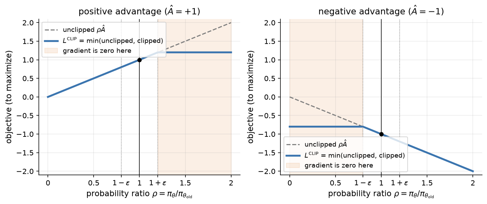
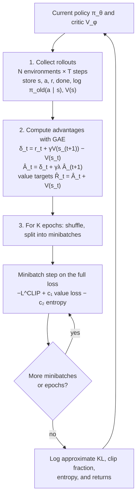
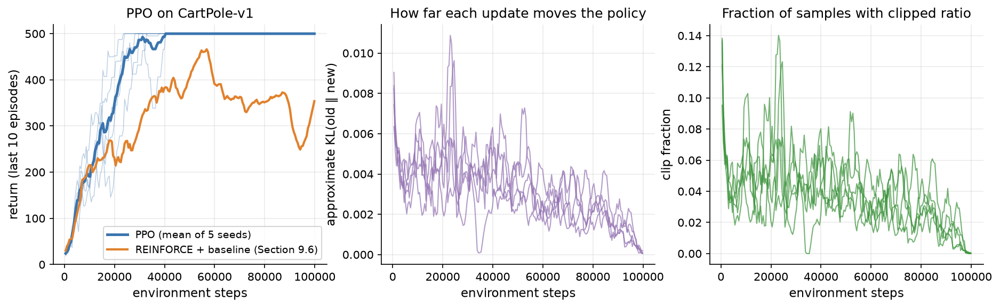
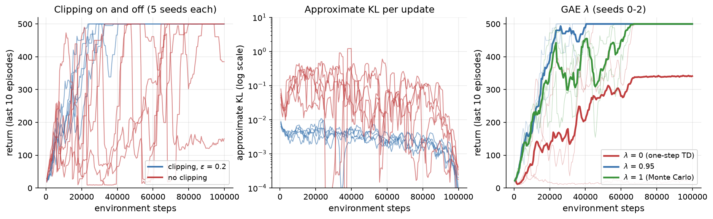

# 9.7 Proximal Policy Optimization (PPO)

Section 9.6 ended with two problems. Policy gradient methods are on-policy, so each batch of experience supports only one gradient step before it goes stale; and they have no notion of a safe step size, so an update that is too large can turn a good policy into a bad one that then collects useless data. **Proximal Policy Optimization** (PPO), introduced by Schulman et al. (2017), addresses both with a few simple changes to the actor-critic recipe. It rewrites the objective in terms of the probability ratio between the new and old policies, which lets one batch be reused for several epochs of minibatch updates, and it clips that ratio so that no update gains anything from moving the policy far from the one that collected the data. Combined with generalized advantage estimation for the critic, the result is robust, easy to implement, and effective across a wide range of problems. PPO became the default policy gradient algorithm for games and robotics, and it is the algorithm of classic RLHF for language models (Chapter 10). This section builds PPO step by step, implements it from scratch, and trains it on CartPole.

## Trust regions

The step-size problem has a natural fix: measure the size of an update not by how far the parameters move but by how much the *policy* changes, and keep that change small. A standard measure of the difference between two policies is the Kullback-Leibler (KL) divergence between their action distributions, averaged over the states the old policy visits:

```math
\bar{D}_{\mathrm{KL}}(\theta_{\mathrm{old}}, \theta) = \mathbb{E}_{s \sim \pi_{\theta_{\mathrm{old}}}}\left[ D_{\mathrm{KL}}\left( \pi_{\theta_{\mathrm{old}}}(\cdot \mid s) \,\|\, \pi_{\theta}(\cdot \mid s) \right) \right].
```

The set of policies within a small KL distance of the current one is a **trust region**: a neighborhood in which we trust our estimate of the objective, since it was computed from data collected by the current policy. **Trust Region Policy Optimization** (TRPO; Schulman et al. 2015) maximizes an estimate of the improvement in expected return subject to the constraint $`\bar{D}_{\mathrm{KL}} \le \delta`$ for a small $`\delta`$ (such as 0.01), and it backs this up with theory showing that improving the estimate while staying inside the trust region is guaranteed to improve the true objective, up to a penalty term.

TRPO works well, but it is complicated. Solving the constrained problem requires second-order information about the KL divergence (its curvature, the Fisher information matrix). TRPO never forms that matrix; it uses the conjugate-gradient method with Fisher-vector products to find an update direction, followed by a line search to make sure the constraint holds. This is hard to implement, hard to combine with architectures that share parameters between the policy and the value function, and awkward at scale. PPO's goal was to keep TRPO's benefits using only first-order optimization: ordinary minibatch gradient steps with Adam.

## The probability ratio: reusing data

Both TRPO and PPO start from a surrogate objective that makes the old data usable for evaluating a new policy. Suppose a batch of data was collected by $`\pi_{\theta_{\mathrm{old}}}`$ and we have advantage estimates $`\hat{A}_t`$ for each step. Define the **probability ratio**

```math
\rho_t(\theta) = \frac{\pi_{\theta}(a_t \mid s_t)}{\pi_{\theta_{\mathrm{old}}}(a_t \mid s_t)},
```

which equals 1 when $`\theta = \theta_{\mathrm{old}}`$ and measures how much more (or less) likely the new policy is to take the action that was actually taken. The surrogate objective is

```math
L^{\mathrm{IS}}(\theta) = \mathbb{E}_t\left[ \rho_t(\theta)\, \hat{A}_t \right],
```

where $`\mathbb{E}_t`$ denotes the average over the time steps in the batch. The ratio is an **importance weight**: it corrects for the fact that the actions were sampled from the old policy while we are evaluating the new one. Two properties make this objective useful. At $`\theta = \theta_{\mathrm{old}}`$ its gradient is exactly the policy gradient of Section 9.6, since $`\nabla_\theta \rho_t = \rho_t \nabla_\theta \log \pi_\theta(a_t \mid s_t)`$ and $`\rho_t = 1`$ there. And for $`\theta`$ near $`\theta_{\mathrm{old}}`$, it approximates how much better the new policy is than the old one, so we can take *several* gradient steps on it, using the same batch, without collecting new data.

The catch is the word "near." The approximation ignores the fact that a new policy would also visit different states, and it becomes meaningless when the policies differ a lot. Maximized without restraint, $`L^{\mathrm{IS}}`$ happily drives the ratio of a positive-advantage action toward infinity, and taking many steps on one batch invites exactly the destructive updates we are trying to avoid. TRPO restrains it with the KL constraint. PPO restrains it by clipping.

## The clipped surrogate objective

PPO's main objective is

```math
L^{\mathrm{CLIP}}(\theta) = \mathbb{E}_t\left[ \min\left( \rho_t(\theta)\, \hat{A}_t,\ \mathrm{clip}\left(\rho_t(\theta), 1 - \epsilon, 1 + \epsilon\right) \hat{A}_t \right) \right],
```

where $`\mathrm{clip}(x, 1-\epsilon, 1+\epsilon)`$ limits $x$ to the interval $`[1-\epsilon, 1+\epsilon]`$ and $`\epsilon`$ is a small constant, typically 0.2. For each sample the objective takes the smaller of two numbers: the unclipped surrogate and a version in which the ratio has been clipped. Figure 9.18 shows what this does to one sample's contribution.



*Figure 9.18: One sample's contribution to L^CLIP as a function of the probability ratio ρ, for ε = 0.2. Left: when the action was better than expected, the objective rises with ρ until ρ = 1 + ε and is flat beyond it. Right: when the action was worse than expected, the objective rises as ρ decreases until ρ = 1 − ε and is flat below it. In the shaded regions the gradient is zero, so the sample stops pushing the policy further. The dashed line is the unclipped importance-sampling objective.*

It helps to go through the two cases.

- **Positive advantage** ($`\hat{A}_t \gt 0`$): the action was better than expected, and the objective rewards making it more likely. The term $`\rho_t \hat{A}_t`$ grows with $`\rho_t`$, but once $`\rho_t`$ exceeds $`1 + \epsilon`$ the clipped term is smaller and the minimum selects it. The objective is then constant, its gradient with respect to this sample is zero, and there is no incentive to raise the action's probability further.
- **Negative advantage** ($`\hat{A}_t \lt 0`$): the action was worse than expected, and the objective rewards making it less likely. Once $`\rho_t`$ falls below $`1 - \epsilon`$, the clipped term takes over and again the gradient vanishes.

The minimum makes the objective **pessimistic**. Clipping removes the incentive to move the ratio outside $`[1-\epsilon, 1+\epsilon]`$ in the direction the advantage favors, but the minimum never lets clipping hide a change in the wrong direction: if an update has made a good action *less* likely ($`\hat{A}_t \gt 0`$, $`\rho_t \lt 1 - \epsilon`$), the unclipped term is the smaller one, so the full gradient pulls the action back. In the language of the PPO paper, $`L^{\mathrm{CLIP}}`$ is a lower bound on the unclipped objective, and it ignores changes in the ratio only when they would make the objective look better.

Clipping is not a hard constraint. The ratio can still leave the interval, for example because updates driven by other samples move the shared network, and after many epochs some ratios usually do. But the objective gives no reward for pushing them further, and in practice this keeps each round of updates within a modest distance of the old policy, which is all we need to reuse the batch safely.

## Generalized advantage estimation

PPO needs an advantage estimate $`\hat{A}_t`$ for every step, and its quality matters a great deal. Section 9.6 described two extremes. The Monte Carlo estimate $`G_t - V(s_t)`$ is unbiased if $V$ is used only as a baseline, but it has high variance. The one-step TD error $`\delta_t = r_{t+1} + \gamma V(s_{t+1}) - V(s_t)`$ has low variance but is biased whenever $V$ is inaccurate. (From here on we follow the common convention of writing the reward received after action $`a_t`$ as $`r_t`$ rather than $`r_{t+1}`$, which matches how rollouts are stored in code.)

In between lie the n-step estimates, which use $n$ real rewards and then bootstrap:

```math
\hat{A}_t^{(n)} = r_t + \gamma r_{t+1} + \cdots + \gamma^{n-1} r_{t+n-1} + \gamma^n V(s_{t+n}) - V(s_t) = \sum_{l=0}^{n-1} \gamma^l \delta_{t+l}.
```

The second equality, which follows by writing out the TD errors and cancelling the intermediate values, shows that an n-step advantage is a discounted sum of TD errors. **Generalized advantage estimation** (GAE; Schulman et al. 2015) takes an exponentially weighted average of all the n-step estimates, with weights proportional to $`\lambda^{n-1}`$, which simplifies to

```math
\delta_t = r_t + \gamma V(s_{t+1}) - V(s_t), \qquad \hat{A}_t = \sum_{l=0}^{\infty} (\gamma \lambda)^l\, \delta_{t+l}.
```

The parameter $`\lambda \in [0, 1]`$ trades bias against variance, just as in TD($`\lambda`$) (Section 9.4). With $`\lambda = 0`$, $`\hat{A}_t = \delta_t`$, the one-step TD error: low variance, but as biased as the critic. With $`\lambda = 1`$, the sum telescopes to $`G_t - V(s_t)`$, the Monte Carlo advantage: unbiased, but high variance. Values around 0.9 to 0.97 usually work best, and $`\lambda = 0.95`$ is the common default. Within a rollout of finite length, the sum stops at the last step, where we bootstrap from the critic's value of the final state, and it is cut at the end of every episode.

In code, GAE is computed with a backward recursion over the rollout,

```math
\hat{A}_t = \delta_t + \gamma \lambda\, \hat{A}_{t+1},
```

in the same way that returns were computed backward in Sections 9.4 and 9.6 ([Code 9.7.3](#code-973-generalized-advantage-estimation)). The critic's regression targets are then $`\hat{R}_t = \hat{A}_t + V(s_t)`$, which are $`\lambda`$-returns: exponentially weighted averages of n-step returns.

## The full loss

A PPO agent has two networks, or one network with two heads: the policy $`\pi_\theta`$ and the value function $`V_\phi`$. PPO trains both with a single combined loss, to be minimized:

```math
L(\theta, \phi) = -L^{\mathrm{CLIP}}(\theta) + c_1\, \mathbb{E}_t\left[ \left( V_\phi(s_t) - \hat{R}_t \right)^2 \right] - c_2\, \mathbb{E}_t\left[ \mathcal{H}\left( \pi_\theta(\cdot \mid s_t) \right) \right].
```

The three terms are:

1. **The clipped policy loss**, $`-L^{\mathrm{CLIP}}`$, which improves the policy.
2. **The value loss**, a squared error between the critic's predictions and the targets $`\hat{R}_t`$, weighted by $`c_1`$ (typically 0.5). A better critic gives better advantages at the next iteration. Some implementations also clip the value update in the same spirit as the policy's, though the evidence that this helps is mixed.
3. **The entropy bonus**, where $`\mathcal{H}(\pi(\cdot \mid s)) = -\sum_a \pi(a \mid s) \log \pi(a \mid s)`$ is the entropy of the policy's action distribution, weighted by $`c_2`$ (typically 0 to 0.01). Rewarding entropy discourages the policy from becoming deterministic too early and so keeps it exploring (Section 9.3).

When the policy and value networks share parameters, the coefficients balance their competing demands on the shared layers. With separate networks, as in our implementation, the combined loss simply trains both at once.

## The training loop

A PPO iteration alternates between collecting data and learning from it (Figure 9.19):

1. **Collect rollouts.** Run the current policy $`\pi_{\theta_{\mathrm{old}}}`$ for $T$ steps in each of $N$ parallel copies of the environment, recording states, actions, rewards, episode ends, the log-probabilities $`\log \pi_{\theta_{\mathrm{old}}}(a_t \mid s_t)`$, and the critic's values $`V(s_t)`$.
2. **Compute advantages and returns** with GAE, bootstrapping from the value of the last state in each environment.
3. **Optimize.** For $K$ epochs, shuffle the $N T$ samples, split them into minibatches, and take one gradient step on the full loss for each minibatch. The old log-probabilities stay fixed throughout; only $`\theta`$ and $`\phi`$ change.
4. Repeat from step 1 with the updated policy.



*Figure 9.19: The PPO training loop. Each iteration collects a fresh batch of experience with the current policy, estimates advantages with GAE, and then reuses the batch for several epochs of minibatch updates on the clipped objective, after which the batch is discarded.*

Step 3 is where PPO differs from the actor-critic methods of Section 9.6: instead of one gradient step per batch, it takes $K$ times the number of minibatches, often 10 to 40 steps, and clipping is what makes that safe. [Codes 9.7.1 to 9.7.5](#code-for-this-section) implement the whole algorithm in about 150 lines of PyTorch.

## PPO on CartPole

We train PPO on `CartPole-v1` with settings close to common defaults for this task: $N = 4$ environments and $T = 128$ steps per iteration (512 samples per batch), $K = 10$ epochs of 4 minibatches of 128 samples, Adam with a learning rate of $`10^{-3}`$ decayed linearly to zero, $`\gamma = 0.99`$, $`\lambda = 0.95`$, $`\epsilon = 0.2`$, $`c_1 = 0.5`$, $`c_2 = 0.01`$, gradient-norm clipping at 0.5, and separate actor and critic networks with two hidden layers of 64 tanh units. Each run lasts 100,000 environment steps (195 iterations) and takes under a minute on a CPU. Figure 9.20 shows five seeds.



*Figure 9.20: PPO on CartPole-v1, five seeds. Left: the return of the last 10 finished episodes (thin lines: individual seeds; thick blue: their mean), with REINFORCE with a learned baseline from Section 9.6 for comparison, re-indexed by environment steps (mean of five seeds). Middle: the approximate KL divergence between the policy before and after each iteration's updates, smoothed over 5 iterations. Right: the fraction of samples whose ratio was outside [1 − ε, 1 + ε] during the updates. Both diagnostics shrink toward zero as the learning rate is annealed.*

Every seed reaches the maximum return of 500, averaged over 10 episodes, after between 23,552 and 32,768 environment steps, and none of them drops below it again for the rest of training: the mean return over the second half of training is exactly 500 in all five runs. REINFORCE with a baseline, trained on the same task in Section 9.6, is far less steady when measured in the same environment steps. Its five-seed mean return is 406.8 at 50,000 steps and 353.9 at 100,000 steps, and at no point does its average reach 500.

The diagnostics in the middle and right panels are the ones to watch in any PPO run. The **approximate KL divergence** between the policy before and after an iteration's updates averages 0.0031 and never exceeds 0.021, so each iteration moves the policy only a little, even though it takes 40 gradient steps on the same batch. The **clip fraction**, the share of samples whose ratio ended up outside $`[1-\epsilon, 1+\epsilon]`$, averages 3.7 percent. If it were near zero, clipping would never be active and we could afford larger steps; if it were very high, most samples would contribute no gradient and the updates would be wasteful or erratic. Both quantities decline over training as the learning rate is annealed toward zero.

## What clipping and GAE contribute

Two ablations show where PPO's robustness comes from (Figure 9.21), using [Code 9.7.5](#code-975-the-training-loop) with one setting changed at a time.



*Figure 9.21: Left and middle: PPO with clipping (ε = 0.2, blue) and without it (red), five seeds each, with everything else unchanged, including 10 epochs per batch. Without clipping the updates are one to two orders of magnitude larger in KL, and several runs collapse after solving the task. Right: GAE with λ = 0 (one-step TD errors), 0.95, and 1 (Monte Carlo advantages), seeds 0 to 2, with clipping on.*

**Clipping.** Removing clipping (setting $`\epsilon`$ to a huge value, so the objective becomes the unclipped importance-sampling surrogate) while keeping 10 epochs per batch makes the updates much larger: the approximate KL per iteration averages 0.097, about 30 times the clipped value, and peaks at 6.0. Learning is faster in places but erratic. The five runs first reach 500 after 32,768 to 79,872 steps, and three of them later collapse to returns below 200 for many iterations (14, 83, and 11 iterations after having solved the task). Averaged over the second half of training, the unclipped runs return 359.3, against 500 with clipping, and one run ends at 150.5. This is exactly the step-size problem of Section 9.6: taking many steps on one batch without a brake overshoots, and the degraded policy then collects poor data.

**GAE $`\lambda`$.** With $`\lambda = 0`$, the advantages are one-step TD errors and inherit the bias of the critic, which is poor early in training. Learning is much slower: averaged over training, the return is 240.3, compared with 434.9 for $`\lambda = 0.95`$ on the same seeds, and one of the three runs never gets going (it ends with a return of 23.3). With $`\lambda = 1`$, the advantages are unbiased Monte Carlo estimates with higher variance; every run solves the task, but more slowly, first reaching 500 after 56,320 to 67,072 steps instead of 23,552 to 32,768. The intermediate value is best, as the bias-variance argument predicts.

## The KL-penalty variant

The PPO paper also proposed a second version that replaces clipping with a KL penalty:

```math
L^{\mathrm{KLPEN}}(\theta) = \mathbb{E}_t\left[ \rho_t(\theta)\, \hat{A}_t - \beta\, D_{\mathrm{KL}}\left( \pi_{\theta_{\mathrm{old}}}(\cdot \mid s_t) \,\|\, \pi_\theta(\cdot \mid s_t) \right) \right].
```

A fixed $`\beta`$ is hard to choose, because the right value changes during training, so the coefficient is adapted after each iteration. With a target divergence $`d_{\mathrm{targ}}`$, measure the actual divergence $d$ after the updates; if $`d \lt d_{\mathrm{targ}}/1.5`$, halve $`\beta`$, and if $`d \gt 1.5\, d_{\mathrm{targ}}`$, double it. The penalty then settles at whatever strength keeps the updates near the target size. In the PPO paper's experiments this version performed somewhat worse than clipping, and the clipped objective became the standard. The idea of a KL penalty with an adaptive coefficient did not disappear, though. In RLHF, a KL penalty against a fixed *reference* model (rather than the previous iterate) keeps a language model from drifting too far from its starting point, and adaptive schemes for its coefficient are used there too (Chapter 10).

## Practical tips

PPO is easy to write down, but its performance depends on a number of implementation details, many of which are not in the original paper; Huang et al. (2022) catalog 37 of them. The most important ones are:

- **Advantage normalization.** Standardize the advantages to zero mean and unit variance within each minibatch (or batch) before computing the loss. This keeps the scale of the policy gradient independent of the scale of the rewards. Our implementation does this per minibatch.
- **Observation and reward scaling.** Neural networks train best on inputs of order 1. For environments with badly scaled observations, normalize them with running means and standard deviations; for large or erratic rewards, scale them (for example by a running estimate of the standard deviation of the return) and possibly clip them. CartPole needs neither.
- **Gradient clipping.** Clip the global gradient norm, commonly at 0.5, to protect against occasional huge gradients.
- **Learning-rate annealing.** Decaying the learning rate linearly to zero over training helps the policy settle, as the declining KL and clip fraction in Figure 9.20 show.
- **Early stopping on approximate KL.** Estimate the KL divergence between the old and current policies during the epochs, with the cheap estimator $`\mathbb{E}_t[(\rho_t - 1) - \log \rho_t]`$, which is always non-negative and needs only the ratios already computed. If it exceeds a threshold (for example 0.01 to 0.05), stop the remaining epochs for this batch. This is a simple backstop against the multi-epoch overshooting that clipping alone does not always prevent.
- **Monitor the clip fraction and the entropy.** A clip fraction that climbs toward large values signals updates that are too aggressive; an entropy that collapses early signals premature convergence to a deterministic policy.
- **Handle time limits correctly.** An episode cut off by a time limit (CartPole stops at 500 steps) did not really end, so the return should be bootstrapped from the value of the last state rather than treated as zero. Our rollout code adds $`\gamma V(s_{\mathrm{final}})`$ to the last reward in that case.
- **Initialization.** Orthogonal initialization of the weights, with a small scale (0.01) for the policy's output layer, makes the initial policy nearly uniform and helps early exploration.

Typical settings are $`\epsilon = 0.2`$ (sometimes 0.1), $`\lambda = 0.95`$, $`\gamma = 0.99`$, 3 to 10 epochs per batch, a few minibatches per epoch, and learning rates of $`10^{-4}`$ to $`10^{-3}`$ with Adam. For continuous-control benchmarks the original paper used $`\epsilon = 0.2`$, $`\lambda = 0.95`$, 10 epochs, rollouts of 2,048 steps, minibatches of 64, and a learning rate of $`3 \times 10^{-4}`$. For continuous actions, the policy network outputs the mean of a Gaussian distribution (with a learned, state-independent log standard deviation), and everything else, including the ratio and the clipping, is unchanged, since the ratio only needs the probability densities of the actions taken.

## Where this leads

PPO is generic: nothing in this section assumed anything about the environment beyond states, actions, and rewards. Chapter 10 applies it to language models, where the policy is a pretrained LLM, an action is a token, an episode is one generated response, and the reward comes from a learned reward model. That setting adds its own ingredients: a KL penalty toward a reference model, a value head on the language model, and the cost of keeping four large models in memory at once. Chapter 11 then covers simpler alternatives that drop the learned critic, estimating advantages from groups of sampled responses instead, and methods that skip online RL altogether.

## A short history

The idea of limiting how far each policy update moves goes back to Sham Kakade and John Langford's conservative policy iteration (2002) and Kakade's natural policy gradient (2001). John Schulman and colleagues turned it into a practical deep RL algorithm with TRPO in 2015, introduced generalized advantage estimation the same year (Schulman et al. 2015), and in 2017 proposed PPO as a simpler first-order alternative (Schulman et al. 2017). PPO quickly became the default policy gradient method. It was used to train OpenAI Five, which defeated the reigning world champions at the video game Dota 2 in 2019, and to train a robot hand to solve a Rubik's Cube in simulation before transferring to the real world. In 2017 Paul Christiano and colleagues used a policy gradient method to optimize agents against a reward model learned from human preferences, and from 2019 OpenAI applied PPO to fine-tune language models against such reward models, leading to InstructGPT (Ouyang et al. 2022) and ChatGPT. Chapter 10 continues that story.

## Code for this section

The listings below are taken from [`figures/src/ppo.py`](figures/src/ppo.py), in the order of the algorithm. The script `run_ppo_experiments.py` trains the 16 runs of Figures 9.20 and 9.21 in parallel (a few minutes on a CPU), and `fig_s7_ppo.py` draws Figures 9.18, 9.20, and 9.21 and prints the numbers quoted in the text. Together the listings form one self-contained file.

### Code 9.7.1: The actor-critic networks

Separate policy and value networks with two hidden layers of 64 tanh units, orthogonal initialization, and a small initial scale for the policy's output so that the initial policy is nearly uniform.

```python
import numpy as np
import torch
import torch.nn as nn
import gymnasium as gym

def layer(inp, out, std=np.sqrt(2)):
    """A linear layer with orthogonal weights and zero bias."""
    lin = nn.Linear(inp, out)
    nn.init.orthogonal_(lin.weight, std)
    nn.init.zeros_(lin.bias)
    return lin

class ActorCritic(nn.Module):
    """Separate policy (actor) and value (critic) networks."""
    def __init__(self, obs_dim, n_actions, hidden=64):
        super().__init__()
        self.actor = nn.Sequential(layer(obs_dim, hidden), nn.Tanh(),
                                   layer(hidden, hidden), nn.Tanh(),
                                   layer(hidden, n_actions, std=0.01))
        self.critic = nn.Sequential(layer(obs_dim, hidden), nn.Tanh(),
                                    layer(hidden, hidden), nn.Tanh(),
                                    layer(hidden, 1, std=1.0))

    def dist(self, s):
        return torch.distributions.Categorical(logits=self.actor(s))

    def value(self, s):
        return self.critic(s).squeeze(-1)
```

### Code 9.7.2: Collecting rollouts

Runs each of several environments for `n_steps` with the current policy, storing everything the update will need, including the old log-probabilities and values. An episode that ends by the time limit (truncation) gets the discounted value of its final state added to its last reward.

```python
def collect_rollout(envs, obs, model, n_steps, gamma, stats):
    """Run every environment for n_steps with the current policy.

    Returns a dict of tensors with a leading (n_steps, n_envs) shape and the
    observations to continue from. Finished-episode returns go into stats.
    """
    n_envs = len(envs)
    buf = {k: [] for k in ("obs", "act", "logp", "rew", "term", "val")}
    for _ in range(n_steps):
        s = torch.as_tensor(np.array(obs), dtype=torch.float32)
        with torch.no_grad():
            d = model.dist(s)
            a = d.sample()
            logp, v = d.log_prob(a), model.value(s)
        rew, term = np.zeros(n_envs, np.float32), np.zeros(n_envs, np.float32)
        for i, env in enumerate(envs):
            s2, r, terminated, truncated, _ = env.step(int(a[i]))
            stats["ep_ret"][i] += r
            if truncated and not terminated:
                # A time limit is not a real ending: bootstrap from V(s_final).
                with torch.no_grad():
                    r += gamma * model.value(torch.as_tensor(s2, dtype=torch.float32)).item()
            if terminated or truncated:
                stats["finished"].append(stats["ep_ret"][i])
                stats["ep_ret"][i] = 0.0
                s2, _ = env.reset()
            rew[i], term[i] = r, float(terminated or truncated)
            obs[i] = s2
        for k, x in zip(buf, (s, a, logp, torch.as_tensor(rew), torch.as_tensor(term), v)):
            buf[k].append(x)
    return {k: torch.stack(x) for k, x in buf.items()}, obs
```

### Code 9.7.3: Generalized advantage estimation

The backward recursion $`\hat{A}_t = \delta_t + \gamma\lambda \hat{A}_{t+1}`$, cut at episode boundaries, and the value targets $`\hat{R}_t = \hat{A}_t + V(s_t)`$.

```python
def compute_gae(rew, val, term, last_val, gamma, lam):
    """Generalized advantage estimation, computed backward in time.

    delta_t = r_t + gamma V(s_{t+1}) - V(s_t);  A_t = delta_t + gamma lam A_{t+1},
    with the recursion cut wherever an episode ended.
    """
    T = rew.shape[0]
    adv = torch.zeros_like(rew)
    next_adv, next_val = torch.zeros_like(last_val), last_val
    for t in reversed(range(T)):
        not_done = 1.0 - term[t]
        delta = rew[t] + gamma * next_val * not_done - val[t]
        next_adv = delta + gamma * lam * not_done * next_adv
        adv[t] = next_adv
        next_val = val[t]
    return adv, adv + val            # advantages and value targets (returns)
```

### Code 9.7.4: The PPO update

Several epochs of shuffled minibatch updates on the combined loss: the clipped policy objective (with advantages normalized per minibatch), the value loss, and the entropy bonus. It also records the approximate KL and the clip fraction.

```python
def ppo_update(model, opt, batch, clip_eps, epochs, n_minibatches,
               vf_coef=0.5, ent_coef=0.01, max_grad_norm=0.5):
    """Several epochs of minibatch updates on the clipped PPO loss."""
    N = batch["obs"].shape[0]
    mb_size = N // n_minibatches
    kls, clipfracs = [], []
    for _ in range(epochs):
        perm = torch.randperm(N)
        for start in range(0, N, mb_size):
            idx = perm[start:start + mb_size]
            d = model.dist(batch["obs"][idx])
            logp = d.log_prob(batch["act"][idx])
            log_ratio = logp - batch["logp"][idx]
            ratio = log_ratio.exp()
            adv = batch["adv"][idx]
            adv = (adv - adv.mean()) / (adv.std() + 1e-8)       # normalize per minibatch
            unclipped = ratio * adv
            clipped = torch.clamp(ratio, 1 - clip_eps, 1 + clip_eps) * adv
            policy_loss = -torch.min(unclipped, clipped).mean()
            value_loss = ((model.value(batch["obs"][idx]) - batch["ret"][idx]) ** 2).mean()
            entropy = d.entropy().mean()
            loss = policy_loss + vf_coef * value_loss - ent_coef * entropy
            opt.zero_grad()
            loss.backward()
            nn.utils.clip_grad_norm_(model.parameters(), max_grad_norm)
            opt.step()
            with torch.no_grad():                              # diagnostics
                kls.append(((ratio - 1) - log_ratio).mean().item())
                clipfracs.append(((ratio - 1).abs() > clip_eps).float().mean().item())
    return np.mean(kls), np.mean(clipfracs)
```

### Code 9.7.5: The training loop

Alternates rollout collection, GAE, and PPO updates, annealing the learning rate linearly to zero. Each row of the returned log holds the number of environment steps so far, the mean return of the last 10 finished episodes, the approximate KL, and the clip fraction.

```python
def train_ppo(total_steps=100_000, n_envs=4, n_steps=128, gamma=0.99, lam=0.95,
              clip_eps=0.2, epochs=4, n_minibatches=4, lr=2.5e-4, seed=0,
              anneal_lr=True):
    torch.manual_seed(seed)
    envs = [gym.make("CartPole-v1") for _ in range(n_envs)]
    obs = [env.reset(seed=seed * 100 + i)[0] for i, env in enumerate(envs)]
    model = ActorCritic(4, 2)
    opt = torch.optim.Adam(model.parameters(), lr=lr, eps=1e-5)
    stats = {"ep_ret": np.zeros(n_envs), "finished": []}
    n_iters = total_steps // (n_envs * n_steps)
    log = []
    for it in range(n_iters):
        if anneal_lr:                                   # linear decay to zero
            opt.param_groups[0]["lr"] = lr * (1 - it / n_iters)
        roll, obs = collect_rollout(envs, obs, model, n_steps, gamma, stats)
        with torch.no_grad():
            last_val = model.value(torch.as_tensor(np.array(obs), dtype=torch.float32))
        adv, ret = compute_gae(roll["rew"], roll["val"], roll["term"], last_val, gamma, lam)
        batch = {"obs": roll["obs"].reshape(-1, 4), "act": roll["act"].reshape(-1),
                 "logp": roll["logp"].reshape(-1), "adv": adv.reshape(-1),
                 "ret": ret.reshape(-1)}
        kl, clipfrac = ppo_update(model, opt, batch, clip_eps, epochs, n_minibatches)
        recent = stats["finished"][-10:]
        log.append(((it + 1) * n_envs * n_steps, np.mean(recent) if recent else np.nan,
                    kl, clipfrac))
    return np.array(log)

# The configuration of Figure 9.20 (seeds 0-4); the ablations change one argument.
log = train_ppo(total_steps=100_000, lr=1e-3, epochs=10, clip_eps=0.2, lam=0.95, seed=0)
solved = log[log[:, 1] >= 500, 0]
print(f"first reached 500 after {int(solved[0])} steps; final return {log[-1, 1]:.1f}; "
      f"mean approx KL {log[:, 2].mean():.4f}; mean clip fraction {log[:, 3].mean():.3f}")
```

Output (seed 0):

```text
first reached 500 after 24064 steps; final return 500.0; mean approx KL 0.0029; mean clip fraction 0.034
```

The summary printed by `fig_s7_ppo.py` over all runs:

```text
PPO (clip 0.2, lambda 0.95)  first step with 10-ep mean 500: [24064, 32768, 23552, 28160, 29696]; mean return over training 432.2; mean return after 50k steps 500.0; final [500.0, 500.0, 500.0, 500.0, 500.0]; iterations below 200 after reaching 500: [0, 0, 0, 0, 0]; mean/max approx KL 0.0031/0.021; mean clip fraction 0.037
no clipping                  first step with 10-ep mean 500: [32768, 68096, 45568, 48128, 79872]; mean return over training 280.8; mean return after 50k steps 359.3; final [500.0, 384.9, 150.5, 500.0, 500.0]; iterations below 200 after reaching 500: [14, 0, 83, 11, 0]; mean/max approx KL 0.0965/6.040; mean clip fraction 0.000
lambda = 0                   first step with 10-ep mean 500: [None, 68096, 44544]; mean return over training 240.3; mean return after 50k steps 325.9; final [23.3, 500.0, 500.0]; iterations below 200 after reaching 500: [0, 0, 0]; mean/max approx KL 0.0114/0.280; mean clip fraction 0.080
lambda = 1                   first step with 10-ep mean 500: [62464, 56320, 67072]; mean return over training 387.9; mean return after 50k steps 479.8; final [500.0, 500.0, 500.0]; iterations below 200 after reaching 500: [0, 0, 0]; mean/max approx KL 0.0021/0.038; mean clip fraction 0.021
```
