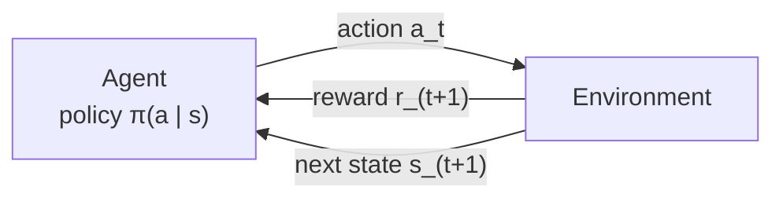
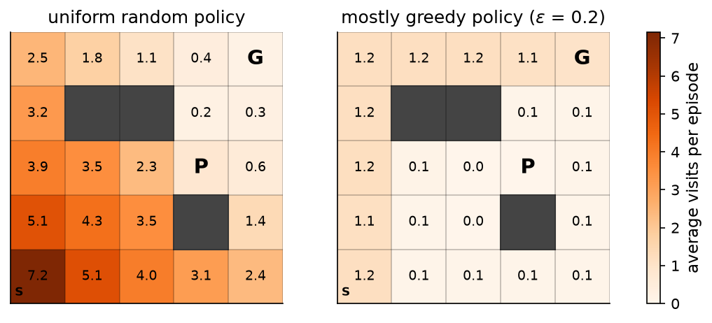

# 10.1 What Reinforcement Learning Is

Every model in the book so far has learned by imitation. A pretrained model learns to predict the next token of text that people wrote, and a fine-tuned model learns to reproduce responses that people demonstrated. In both cases a dataset supplies the right answer for every input, and training pushes the model toward it. *Reinforcement learning* (RL) removes that crutch. An RL agent is never told which action is correct. It acts, the world responds with a number called a *reward*, and the agent must work out, from many such experiences, which behavior earns the most reward over time. This section sets up the basic loop of interaction, explains why learning from reward is harder than learning from labels, and previews the methods that the rest of the chapter develops, ending with Proximal Policy Optimization (PPO), the algorithm that Chapter 11 applies to language models.

## Learning from reward

Consider teaching a program to balance a pole on a moving cart, the classic *CartPole* task. At every moment the program sees four numbers: the cart's position and velocity and the pole's angle and angular velocity. It then chooses to push the cart left or right. If we tried to solve this with supervised learning, we would need a dataset in which an expert had labeled thousands of situations with the correct push. Nobody has such a dataset, and for most interesting problems nobody could produce one: the "correct" action depends on everything that happens afterward.

What we *can* do easily is score an outcome. In CartPole the environment gives a reward of $+1$ for every time step the pole stays up, and the episode ends when the pole falls past about 12 degrees, the cart leaves the track, or 500 steps have passed. A program that balances longer collects more reward. Reinforcement learning is the study of algorithms that turn such scores into good behavior.

The same shift from labels to scores is what makes RL useful for language models. It is hard to write the single best answer to "explain quantum tunneling to a ten-year-old," but it is much easier for a person to say which of two answers is better, or for a program to check whether the final answer to a math problem is right. Chapters 11 and 14 build on exactly this: they turn human preferences or automatic checks into rewards and use the methods of this chapter to optimize a model against them.

## The agent-environment loop

RL describes the learner and the world it acts in as two parties that take turns. The **agent** is the learner and decision maker. The **environment** is everything outside the agent. They interact in discrete time steps $`t = 0, 1, 2, \dots`$ (Figure 10.1):

1. The agent observes the current **state** $`s_t`$.
2. It chooses an **action** $`a_t`$.
3. The environment responds with a scalar **reward** $`r_{t+1}`$ and moves to a **next state** $`s_{t+1}`$.

Then the loop repeats from $`s_{t+1}`$.



*Figure 10.1: The agent-environment loop. At each step the agent sees a state and picks an action; the environment returns a reward and the next state. The index of the reward is t + 1 because it arrives together with the next state, as a consequence of the action taken at time t.*

The rule by which the agent picks actions is its **policy**, written $`\pi`$. A deterministic policy is a function from states to actions, $`a = \pi(s)`$. A stochastic policy gives a probability distribution over actions, $`\pi(a \mid s)`$, from which the agent samples. Stochastic policies will matter a great deal later: a language model's softmax over the vocabulary is exactly a stochastic policy over the next token.

A sequence of states, actions, and rewards produced by the loop is a **trajectory**,

```math
\tau = (s_0, a_0, r_1, s_1, a_1, r_2, s_2, \dots),
```

and in tasks that have a natural end, such as a game or a balancing attempt, the trajectory from a start state to a terminal state is called an **episode**. The agent's goal is not to maximize the next reward but the total reward over the whole episode (Section 10.2 makes this precise with the *return*). That distinction is what makes RL interesting. A chess move that loses a pawn now may win the game twenty moves later, and a push that looks harmless may set the pole on a trajectory from which no later push can save it.

The loop maps directly onto code. Gymnasium, the standard Python library of RL environments, exposes exactly this interface: `env.reset()` returns a first state, and `env.step(action)` returns the next state, the reward, and flags saying whether the episode has ended. [Code 10.1.1](#code-1011-the-agent-environment-loop-in-gymnasium) runs CartPole with two hand-written policies. A policy that pushes left or right at random keeps the pole up for an average of 23.7 steps over 100 episodes (between 9 and 63). A one-line policy that pushes the cart in the direction the pole is leaning, measured by the sum of the pole's angle and angular velocity, averages 493.1 steps and reaches the 500-step limit in most episodes. The environment and the loop are identical in both runs; only the policy differs. RL is the business of finding the good policy automatically, from reward alone, without a human writing it down.

## How RL differs from supervised learning

It is tempting to view RL as supervised learning with a noisier label. Three differences make it a genuinely different problem.

**No correct action is ever given.** A supervised classifier that predicts "cat" for a dog image is told the right label, "dog," and the gradient of the cross-entropy loss points straight toward it (Section 2.4). An RL agent that takes an action receives a reward, say $+1$ or $0$, but it is not told what would have happened had it acted differently. It must estimate the value of the actions it did not take by trying them at other times. The feedback is *evaluative* ("how good was that?") rather than *instructive* ("this is what you should have done").

**Feedback is delayed.** A reward may arrive long after the actions that caused it. In a game of Go, the only reward is a win or a loss at the very end, after hundreds of moves. Deciding which of those moves deserve the credit or the blame is the **credit assignment problem**, and much of RL is about solving it well. For a language model scored once per response, the same problem appears at the level of tokens: which words in a long answer made it good?

**The data depend on the agent's own choices.** A supervised dataset is fixed before training begins, and its examples are usually assumed to be drawn independently from one distribution. In RL, the agent generates its own data, and what it sees depends on what it does. An agent that never walks through a door never learns what lies behind it. As the policy changes, so does the distribution of states it visits.

Figure 10.2 makes the third point concrete in a small gridworld, the running example of Sections 10.2 and 10.4. The agent starts in the bottom-left corner (S) and moves up, down, left, or right; stepping onto the goal (G) earns $+1$ and ends the episode, and stepping into the pit (P) costs $-1$ and also ends it. Under a uniformly random policy the agent spends most of its time wandering near the start and falls into the pit in about 82 percent of episodes, reaching the goal in only 18 percent. A mostly greedy policy that follows the best route 80 percent of the time and acts randomly otherwise reaches the goal in 99 percent of episodes, and the states it visits are almost entirely those on its route ([Code 10.1.2](#code-1012-state-visitation-under-two-policies)). The two policies see very different data. An algorithm that learns from the second policy's experience knows a lot about the route along the top row and almost nothing about the bottom-right of the grid.



*Figure 10.2: Average number of visits per episode to each cell of the gridworld (walls in dark gray) over 2,000 episodes from S. Left: a uniform random policy wanders widely and usually ends in the pit P. Right: a mostly greedy policy (the best action with probability 0.8, a random one otherwise) goes up the left column and along the top row to the goal G, and rarely visits the rest of the grid.*

These three differences lead to a problem supervised learning never faces: the **exploration-exploitation trade-off**. To collect reward, the agent should *exploit* the actions it currently believes are best. To find better actions, it must *explore* actions whose value it does not yet know, which usually costs some reward in the short run. Section 10.3 studies this trade-off in its purest form, the multi-armed bandit.

## The families of RL methods

Almost every RL algorithm learns one or more of three things:

- A **policy** $`\pi(a \mid s)`$ that chooses actions directly.
- A **value function** that predicts how much future reward to expect from a state, $V(s)$, or from a state and an action, $Q(s, a)$ (Section 10.2).
- Sometimes a **model** of the environment that predicts the next state and reward, which the agent can use to plan. Methods that learn or are given such a model are called *model-based*. This chapter covers only *model-free* methods, which learn from experience without one, and which are the ones used to train language models.

The methods in this chapter form a progression. Sections 10.2 through 10.4 build *value-based* methods: estimate $V$ or $Q$ from experience, by averaging complete returns (Monte Carlo) or by bootstrapping from the agent's own estimates (temporal-difference learning), and then act greedily with respect to $Q$. This leads to Q-learning and, with a neural network in place of a table, to the deep Q-networks of Section 10.5. Section 10.6 turns to *policy gradient* methods, which adjust the parameters of a policy network directly in the direction that increases expected reward, often with a learned value function as a helper (the *actor-critic* architecture). Section 10.7 develops PPO, a policy gradient method that makes each update safe and reuses each batch of experience several times. PPO is the algorithm that Chapter 11 adapts to language models.

## A short history

Reinforcement learning grew out of two older threads: the psychology of trial-and-error learning, which goes back to Edward Thorndike's "law of effect" around 1900, and the mathematics of optimal control, where Richard Bellman's dynamic programming of the 1950s introduced value functions and the equation that bears his name. Arthur Samuel's checkers program of 1959 already improved by playing against itself and adjusting its evaluation of positions toward later ones. In the 1980s Richard Sutton and Andrew Barto unified these ideas; Sutton's temporal-difference learning (1988) and Christopher Watkins's Q-learning (1989) remain central to the field.

The first spectacular success was Gerald Tesauro's TD-Gammon (1992–1995), a neural network trained by temporal-difference learning from self-play that reached the level of the world's best backgammon players. Two decades later, DeepMind's deep Q-network (2013, 2015) learned to play dozens of Atari video games from raw pixels, and AlphaGo (2016) combined policy and value networks with tree search to defeat Lee Sedol, one of the strongest Go players in the world. Policy gradient methods, and PPO in particular, went on to train agents for robotic control and complex video games. The same methods then turned to language: fine-tuning with reinforcement learning from human feedback made InstructGPT (2022) and ChatGPT far more helpful than their base models, and reinforcement learning with automatically checked rewards later produced models that reason step by step. Chapters 11 and 14 tell that part of the story.

## Code for this section

The listings below collect the code for this section in the order in which the text refers to them. The full scripts, which also draw the figures, are in [`figures/src/`](figures/src/) (`fig_s1_loop.py` and `gridworld.py`).

### Code 10.1.1: The agent-environment loop in Gymnasium

Runs 100 CartPole episodes with a random policy and with a hand-written policy that pushes toward the side the pole is falling, and prints the average return (the number of steps survived).

Notebook: [10.1.1-the-agent-environment-loop-in-gymnasium.ipynb](../../code/10-reinforcement-learning-basics/10.1.1-the-agent-environment-loop-in-gymnasium.ipynb)

### Code 10.1.2: State visitation under two policies

Counts how often each gridworld cell is visited under the uniform random policy and under a policy that takes the optimal action (computed by value iteration, Code 10.2.3) with probability 0.8. The `GridWorld` class is listed in Code 10.2.1.

Notebook: [10.1.2-state-visitation-under-two-policies.ipynb](../../code/10-reinforcement-learning-basics/10.1.2-state-visitation-under-two-policies.ipynb)

