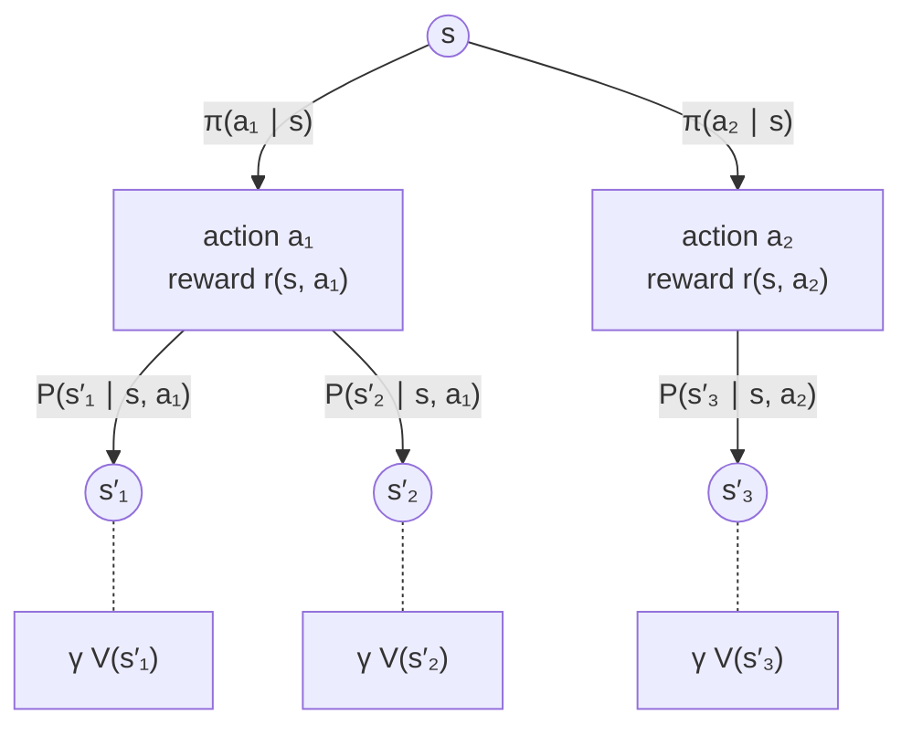
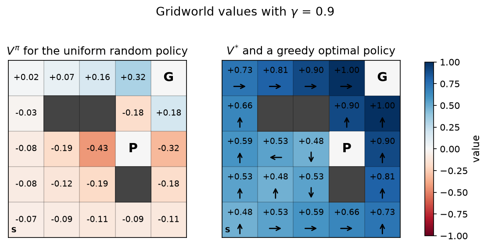
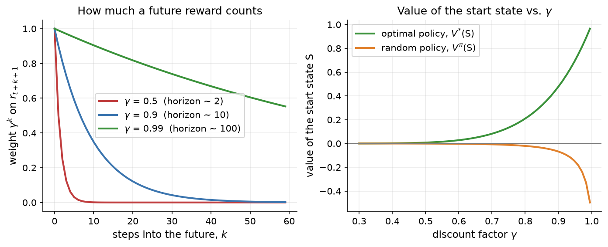

# 10.2 MDPs, Policies, and Value Functions

Section 10.1 described reinforcement learning informally: an agent acts, the environment answers with a reward and a new state, and the agent tries to collect as much reward as it can. To design and analyze algorithms we need a precise version of this picture. The standard one is the *Markov decision process* (MDP). This section defines MDPs, policies, and returns; introduces the value functions $V$ and $Q$ that almost every RL method estimates; and derives the Bellman equations that tie a state's value to the values of its successors. Throughout, a small gridworld serves as the running example, small enough that we can compute every value exactly and see what the equations mean.

## Markov decision processes

An MDP consists of

- a set of **states** $`\mathcal{S}`$,
- a set of **actions** $`\mathcal{A}`$ (possibly depending on the state),
- **transition probabilities** $`P(s' \mid s, a)`$, the probability that taking action $a$ in state $s$ leads to state $s'$,
- a **reward function** $r(s, a)$, the expected reward for taking action $a$ in state $s$ (more generally the reward can be random and can also depend on $s'$),
- a **discount factor** $`\gamma \in [0, 1]`$, which we meet shortly.

The defining assumption is the **Markov property**: the next state and reward depend only on the current state and action, not on how the agent got there,

```math
P(s_{t+1} \mid s_t, a_t, s_{t-1}, a_{t-1}, \dots, s_0, a_0) = P(s_{t+1} \mid s_t, a_t).
```

The Markov property is a statement about what the state contains. If a state includes everything relevant about the past, the future is independent of the rest of the history. The positions of all pieces on a chessboard (plus a few flags such as whose turn it is) form a Markov state; a single frame of a video game in which objects move does not, because one frame does not reveal velocities, which is why the Atari agents of Section 10.5 stack four consecutive frames into one state. For a language model, the prompt together with all tokens generated so far is a Markov state for choosing the next token, since it is everything the model conditions on (Chapter 11 develops this view).

Some tasks end: an **episodic** task has terminal states, after which nothing more happens, and each run from a start state to a terminal state is an episode. Others, like controlling a thermostat, go on forever and are called **continuing** tasks. The discount factor lets us treat both in the same framework.

### The running example: a gridworld

Our gridworld has 5 rows and 5 columns, with three walls (dark gray in the figures), so 22 of its cells are states. The agent has four actions: up, down, left, and right. Transitions are deterministic: an action moves the agent one cell in that direction, unless a wall or the edge of the grid is in the way, in which case it stays put. Entering the goal G in the top-right corner gives reward $+1$ and entering the pit P gives reward $-1$; both are terminal. Every other step gives reward $0$. Episodes start in the bottom-left corner S. The whole MDP is about thirty lines of code, the `GridWorld` class of [Code 10.2.1](#code-1021-the-gridworld-mdp), which stores the transitions as two tables, `next_state[s, a]` and `reward[s, a]`.

Deterministic transitions keep the example easy to follow, but nothing below depends on them. With a "slippery" floor, where an action sometimes moves the agent sideways, $`P(s' \mid s, a)`$ would spread over several next states, and every equation would acquire a sum over $s'$ weighted by those probabilities.

## Policies

A **policy** describes how the agent behaves. A stochastic policy $`\pi(a \mid s)`$ gives the probability of each action in each state; a deterministic policy is the special case that puts probability 1 on a single action. In a finite MDP a policy is just a table with one row per state and one column per action, each row summing to 1. The uniform random policy of the gridworld puts probability $1/4$ on every action in every state.

Two properties of this definition are worth noticing. First, the policy depends only on the current state, which, thanks to the Markov property, loses nothing: in an MDP there is always an optimal policy of this form. Second, it is *stationary*: the same table is used at every time step. The policies in later sections are neural networks $`\pi_\theta(a \mid s)`$ with parameters $`\theta`$, but they play exactly the same role as the table.

## Returns and discounting

The agent's objective is the reward accumulated over time. The **return** from time $t$ is the discounted sum of all rewards that follow:

```math
G_t = r_{t+1} + \gamma r_{t+2} + \gamma^2 r_{t+3} + \cdots = \sum_{k=0}^{\infty} \gamma^k r_{t+k+1}.
```

In an episodic task the sum stops at the terminal state (equivalently, all later rewards are zero). The **discount factor** $`\gamma`$ controls how much future rewards count. With $`\gamma = 0`$ the agent cares only about the next reward; as $`\gamma`$ approaches 1 it weighs distant rewards almost as much as immediate ones. Discounting has three justifications. Mathematically, with $`\gamma \lt 1`$ and bounded rewards the infinite sum is finite, so continuing tasks have well-defined returns. Practically, the future is uncertain, and a reward now is more reliable than a promised reward later. And, as the gridworld shows, discounting expresses a preference for getting things done sooner.

The return satisfies a simple recursion that the rest of the chapter uses constantly:

```math
G_t = r_{t+1} + \gamma \left( r_{t+2} + \gamma r_{t+3} + \cdots \right) = r_{t+1} + \gamma\, G_{t+1}.
```

A useful rule of thumb is that $`\gamma`$ corresponds to an *effective horizon* of about $`1/(1 - \gamma)`$ steps, since $`\sum_k \gamma^k = 1/(1-\gamma)`$. The left panel of Figure 10.5 (below) plots the weight $`\gamma^k`$ for three values: with $`\gamma = 0.5`$ a reward 5 steps away already counts for only about 3 percent, while with $`\gamma = 0.99`$ a reward 60 steps away still counts for more than half.

## Value functions

A return is a random quantity: it depends on which actions the policy samples and, in stochastic environments, on which next states occur. Value functions average over that randomness. The **state-value function** of a policy $`\pi`$ is the expected return when starting in state $s$ and following $`\pi`$ thereafter:

```math
V^{\pi}(s) = \mathbb{E}_{\pi}\left[ G_t \mid s_t = s \right].
```

The **action-value function** is the expected return when starting in $s$, taking action $a$ first, and following $`\pi`$ afterward:

```math
Q^{\pi}(s, a) = \mathbb{E}_{\pi}\left[ G_t \mid s_t = s,\ a_t = a \right].
```

The two are related in both directions. The value of a state is the average of its action values under the policy, and the value of an action is its immediate reward plus the discounted value of wherever it leads:

```math
V^{\pi}(s) = \sum_{a} \pi(a \mid s)\, Q^{\pi}(s, a), \qquad Q^{\pi}(s, a) = r(s, a) + \gamma \sum_{s'} P(s' \mid s, a)\, V^{\pi}(s').
```

$`V^{\pi}`$ answers "how good is it to be here, if I keep behaving as I do?" and $`Q^{\pi}`$ answers "how good is it to do this here, and then keep behaving as I do?" The second question is the one an agent needs to improve its behavior: if some action has a higher $`Q^{\pi}(s, a)`$ than the policy's average $`V^{\pi}(s)`$, the policy should take that action more often. That difference, $`Q^{\pi}(s,a) - V^{\pi}(s)`$, is the *advantage* of Section 10.6, and it is the quantity that PPO ultimately optimizes.

## The Bellman equation

Taking the expectation of the recursion $`G_t = r_{t+1} + \gamma G_{t+1}`$ gives the most important equation in reinforcement learning. Starting in $s$, the agent draws an action from $`\pi`$, receives reward $r(s, a)$, and lands in $s'$, from which its expected future return is $`V^{\pi}(s')`$. Therefore

```math
V^{\pi}(s) = \mathbb{E}_{a \sim \pi,\, s' \sim P}\left[ r(s,a) + \gamma V^{\pi}(s') \right] = \sum_{a} \pi(a \mid s) \left[ r(s,a) + \gamma \sum_{s'} P(s' \mid s, a)\, V^{\pi}(s') \right].
```

This is the **Bellman expectation equation**. In words: *a state's value is the expected immediate reward plus the discounted value of the next state.* It replaces an expectation over entire futures with a one-step lookahead, which Figure 10.3 draws as a small tree.



*Figure 10.3: The one-step lookahead behind the Bellman equation (a "backup diagram"). From state s, the policy chooses among actions, and the environment chooses among next states. The value of s is the probability-weighted average, over both choices, of the reward received plus the discounted value of the state reached.*

For a finite MDP, the Bellman equation holds at every state simultaneously, giving one linear equation per state with the values $`V^{\pi}(s)`$ as unknowns. We could solve the system directly, but a simpler method generalizes better: start from any guess, for example $V = 0$, and repeatedly replace each $V(s)$ by the right-hand side of the equation. This is **iterative policy evaluation** ([Code 10.2.2](#code-1022-iterative-policy-evaluation)). Each sweep is a contraction by a factor of $`\gamma`$, so the error shrinks geometrically and the iteration converges to $`V^{\pi}`$ from any starting point. For the random policy in our gridworld with $`\gamma = 0.9`$, 77 sweeps bring the largest change below $`10^{-6}`$.

The left panel of Figure 10.4 shows the result. The random policy's values are mostly negative, because a random walk from almost anywhere is more likely to stumble into the centrally placed pit than to reach the goal in the corner. The value of the start state is $-0.068$. Cells next to the goal have positive values (0.317 for the cell to the goal's left), while the cell directly left of the pit has the lowest value, $-0.432$. Notice that nothing about the policy's behavior was simulated: the values came entirely from repeatedly applying the one-step equation, and they account for every possible future.



*Figure 10.4: Left: the value function of the uniform random policy, computed by iterative policy evaluation with γ = 0.9. Right: the optimal value function V\* from value iteration, with arrows showing a greedy optimal action in each cell. Because the only nonzero rewards are +1 at G and −1 at P, the optimal value of a cell n steps from the goal is 0.9 to the power n − 1.*

## Optimal policies and the Bellman optimality equation

Value functions give us a way to compare policies: $`\pi'`$ is at least as good as $`\pi`$ if $`V^{\pi'}(s) \ge V^{\pi}(s)`$ in every state. A central theorem of MDP theory says that there is always a policy that is at least as good as every other policy in every state simultaneously. It is called an **optimal policy** $`\pi^*`$, and all optimal policies share the same **optimal value functions**,

```math
V^*(s) = \max_{\pi} V^{\pi}(s), \qquad Q^*(s, a) = \max_{\pi} Q^{\pi}(s, a).
```

The optimal values satisfy their own Bellman equation, in which the average over the policy's actions is replaced by a maximum, because an optimal agent picks the best action:

```math
V^*(s) = \max_{a} \left[ r(s,a) + \gamma \sum_{s'} P(s' \mid s, a)\, V^*(s') \right], \qquad Q^*(s, a) = r(s,a) + \gamma \sum_{s'} P(s' \mid s, a) \max_{a'} Q^*(s', a').
```

This is the **Bellman optimality equation**. Once we know $`Q^*`$, acting optimally is trivial: in each state, pick $`\arg\max_a Q^*(s, a)`$. No lookahead or model is needed. That observation is the foundation of Q-learning (Section 10.4) and DQN (Section 10.5), which estimate $`Q^*`$ from experience.

When the MDP is known, we can solve the optimality equation the same way we solved the expectation equation: start from $V = 0$ and repeatedly apply the right-hand side. This is **value iteration** ([Code 10.2.3](#code-1023-value-iteration)). In the gridworld it converges to within $`10^{-6}`$ in just 9 sweeps, because values propagate backward from the goal one cell per sweep and the longest shortest path is short. The right panel of Figure 10.4 shows $`V^*`$ and a greedy policy. Since the only positive reward is $+1$ at the goal, the optimal value of a cell $n$ steps away is $`\gamma^{n-1}`$: 1 next to the goal, 0.9 two steps away, and 0.478 at the start, which is 8 steps away. The optimal policy steers around the pit and, where two routes are equally short (as from S, which can go up first or right first), either choice is optimal.

Value iteration and policy evaluation are examples of **dynamic programming**: they compute exact values by sweeping over all states, using a known model $P$ and $r$. They are the ideal that learning methods approximate. In most problems we cannot sweep over the states (there are too many) and we do not know $P$ (the environment is a black box that we can only sample from). Sections 10.4 and 10.5 replace the sums over $s'$ with samples of real experience, and the tables with neural networks.

## The discount factor in action

The discount factor is part of the problem specification, but in practice it is also a hyperparameter, and it changes what the agent values. The right panel of Figure 10.5 plots the value of the start state as $`\gamma`$ varies. For the optimal policy, $`V^*(S) = \gamma^7`$ grows from essentially zero at small $`\gamma`$ (0.008 at $`\gamma = 0.5`$) to 0.478 at $`\gamma = 0.9`$ and 0.932 at $`\gamma = 0.99`$: a myopic agent sees almost no benefit in a reward eight steps away. For the random policy, the value falls from $-0.001$ at $`\gamma = 0.5`$ to $-0.068$ at $`\gamma = 0.9`$ and $-0.410$ at $`\gamma = 0.99`$, because with a long horizon the likely eventual fall into the pit counts almost in full.



*Figure 10.5: Left: the weight γ^k that the return puts on a reward k steps in the future, for three discount factors; the effective horizon 1/(1 − γ) is shown in the legend. Right: the value of the start state S under the optimal and the random policy as a function of γ, computed exactly by value iteration and policy evaluation.*

Small discount factors make learning easier, since values depend on only a few steps of the future, but they can make an agent short-sighted enough to ignore the very rewards we care about. CartPole agents typically use $`\gamma = 0.99`$, and so do the PPO experiments of Section 10.7. For language models, where a response is a single short episode with a reward at the end, $`\gamma = 1`$ (no discounting) is common (Chapter 11).

## A short history

The Markov decision process and dynamic programming come from operations research and control theory. Richard Bellman formulated the principle of optimality and the equation named after him in the 1950s, in his book *Dynamic Programming* (1957), and Ronald Howard's policy iteration (1960) gave another exact solution method. For decades these methods assumed a known model and were limited by what Bellman called the "curse of dimensionality," the explosion in the number of states as problems grow. Reinforcement learning can be seen as the effort to keep Bellman's equations while dropping those two assumptions: learning from sampled experience instead of a known model, and generalizing across states with function approximation instead of sweeping over a table.

## Code for this section

The listings below collect the code for this section in the order in which the text refers to them. They are taken from [`code/10-reinforcement-learning-basics/gridworld.py`](../../code/10-reinforcement-learning-basics/gridworld.py); the script `fig_s2_mdp.py` in the same folder produces Figures 10.4 and 10.5 and the numbers quoted in the text.

### Code 10.2.1: The gridworld MDP

The grid, its walls, goal, and pit, and a class that precomputes the deterministic transition table `next_state[s, a]` and the reward table `reward[s, a]`. Only non-wall cells are states, numbered 0 to 21.

```python
import numpy as np

ROWS, COLS = 5, 5
WALLS = {(1, 1), (1, 2), (3, 3)}
GOAL, PIT = (0, 4), (2, 3)
START = (4, 0)
ACTIONS = [(-1, 0), (1, 0), (0, -1), (0, 1)]          # up, down, left, right

class GridWorld:
    def __init__(self):
        self.cells = [(r, c) for r in range(ROWS) for c in range(COLS)
                      if (r, c) not in WALLS]
        self.index = {cell: i for i, cell in enumerate(self.cells)}
        self.n_states, self.n_actions = len(self.cells), len(ACTIONS)
        self.terminal = np.array([cell in (GOAL, PIT) for cell in self.cells])
        # Deterministic transitions: next_state[s, a] and reward[s, a].
        self.next_state = np.zeros((self.n_states, self.n_actions), int)
        self.reward = np.zeros((self.n_states, self.n_actions))
        for s, (r, c) in enumerate(self.cells):
            for a, (dr, dc) in enumerate(ACTIONS):
                nr, nc = r + dr, c + dc
                if not (0 <= nr < ROWS and 0 <= nc < COLS) or (nr, nc) in WALLS:
                    nr, nc = r, c                      # bump: stay put
                self.next_state[s, a] = self.index[(nr, nc)]
                self.reward[s, a] = {GOAL: 1.0, PIT: -1.0}.get((nr, nc), 0.0)

    def step(self, s, a):
        """Return (next_state, reward, done) for action a in state s."""
        s2 = self.next_state[s, a]
        return s2, self.reward[s, a], bool(self.terminal[s2])

    def to_grid(self, v, fill=np.nan):
        """Arrange a per-state vector as a ROWS x COLS array (walls = fill)."""
        g = np.full((ROWS, COLS), fill, dtype=float)
        for s, (r, c) in enumerate(self.cells):
            g[r, c] = v[s]
        return g

def random_policy(env):
    return np.full((env.n_states, env.n_actions), 1.0 / env.n_actions)
```

### Code 10.2.2: Iterative policy evaluation

Repeatedly applies the Bellman expectation equation to all states at once. `V[env.next_state]` looks up $`V(s')`$ for every state-action pair; the factor `~env.terminal[...]` sets the value beyond a terminal state to zero.

```python
def policy_evaluation(env, pi, gamma, tol=1e-12):
    """Iterate the Bellman expectation equation until V stops changing.

    pi[s, a] is the probability of action a in state s.
    """
    V = np.zeros(env.n_states)
    while True:
        # Q[s, a] = r(s, a) + gamma * V(s'), with V = 0 beyond terminal states
        Q = env.reward + gamma * V[env.next_state] * ~env.terminal[env.next_state]
        V_new = np.where(env.terminal, 0.0, (pi * Q).sum(axis=1))
        if np.max(np.abs(V_new - V)) < tol:
            return V_new
        V = V_new

env = GridWorld()
V = policy_evaluation(env, random_policy(env), gamma=0.9)
print(np.round(env.to_grid(V), 3))
```

Output (walls shown as `nan`, terminal states as 0):

```text
[[ 0.019  0.073  0.159  0.317  0.   ]
 [-0.027    nan    nan -0.179  0.177]
 [-0.085 -0.186 -0.432  0.    -0.322]
 [-0.08  -0.122 -0.192    nan -0.176]
 [-0.068 -0.086 -0.106 -0.087 -0.108]]
```

### Code 10.2.3: Value iteration

The same loop with the average over the policy replaced by a maximum over actions. It returns $`V^*`$ and a greedy policy (one action index per state).

```python
def value_iteration(env, gamma, tol=1e-12):
    """Iterate the Bellman optimality equation; return V* and a greedy policy."""
    V = np.zeros(env.n_states)
    while True:
        Q = env.reward + gamma * V[env.next_state] * ~env.terminal[env.next_state]
        V_new = np.where(env.terminal, 0.0, Q.max(axis=1))
        if np.max(np.abs(V_new - V)) < tol:
            return V_new, Q.argmax(axis=1)
        V = V_new

V_star, greedy = value_iteration(env, gamma=0.9)
print(np.round(env.to_grid(V_star), 3))
```

Output:

```text
[[0.729 0.81  0.9   1.    0.   ]
 [0.656   nan   nan 0.9   1.   ]
 [0.59  0.531 0.478 0.    0.9  ]
 [0.531 0.478 0.531   nan 0.81 ]
 [0.478 0.531 0.59  0.656 0.729]]
```
