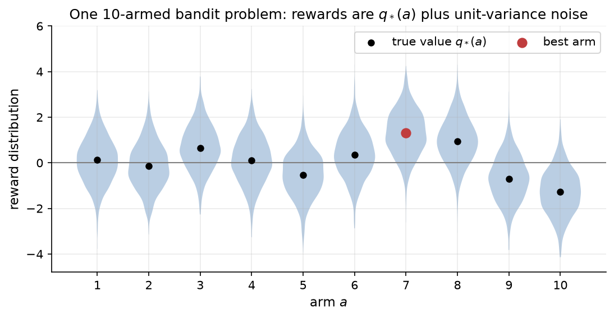
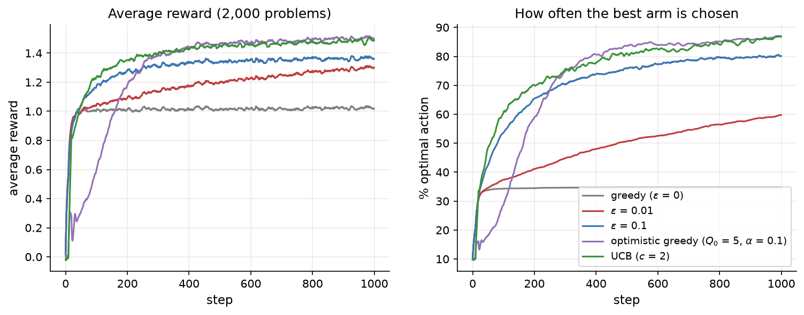

# 10.3 Bandits and Exploration

An RL agent learns only about the actions it takes. If it always does what currently looks best, it may never discover that something else is better; if it keeps experimenting, it wastes reward on actions it already knows are poor. This tension, the *exploration-exploitation trade-off*, runs through all of reinforcement learning, and it is easiest to study in a setting stripped of everything else: the *multi-armed bandit*, an MDP with a single state. This section defines the bandit problem, builds the incremental value estimates that reappear in every later method, and compares several exploration strategies on a standard testbed of 10-armed bandits.

## The multi-armed bandit

Imagine a row of slot machines (in old slang, "one-armed bandits"), each paying out according to its own unknown distribution. On each turn you pull one arm and receive a random reward. Your goal is to maximize the total reward over many pulls. That is the **$k$-armed bandit problem**: at each step $t$ the agent chooses an action $`a_t \in \{1, \dots, k\}`$ and receives a reward $`r_t`$ drawn from a distribution that depends only on the arm. The expected reward of arm $a$ is its **true value**

```math
q_*(a) = \mathbb{E}\left[ r_t \mid a_t = a \right].
```

If we knew $`q_*`$, we would always pull $`\arg\max_a q_*(a)`$. We do not, so we must estimate it from the rewards we observe.

In the language of Section 10.2, a bandit is an MDP with one state that the agent never leaves, so every episode lasts one step and there is no delayed consequence to worry about: an action affects only its own reward. That makes the bandit the simplest possible RL problem, but it keeps the ingredient that distinguishes RL from supervised learning. When the agent pulls arm 3 and receives a reward of 0.7, it learns nothing about what arm 5 would have paid. The feedback is evaluative, not instructive. (Bandits also show up directly in practice: choosing which version of a web page to show, which ad to display, or which treatment to assign in an adaptive clinical trial. And one common view of RL for language models treats a whole response as a single action in a *contextual bandit*, a bandit whose best arm depends on an observed context, the prompt; Chapter 11 discusses that view.)

To compare algorithms we use a **10-armed testbed**. Each problem draws the ten true values $`q_*(a)`$ independently from a standard normal distribution, and each pull of arm $a$ returns $`q_*(a)`$ plus standard normal noise. Figure 10.6 shows one such problem. Arm 7 is the best, with $`q_*(7) = 1.30`$, but arm 8 ($`q_*(8) = 0.95`$) is close, and the noise is large enough that a few pulls of each can easily rank them the wrong way. To average away the luck of any one problem, every result below is averaged over 2,000 independently generated problems, each run for 1,000 steps.



*Figure 10.6: One problem from the 10-armed testbed. Each arm's rewards are normally distributed with mean q\*(a) (black dots) and variance 1. The best arm, arm 7, is marked in red. Individual rewards from different arms overlap heavily, so the agent must pull each arm many times to tell them apart.*

## Estimating action values incrementally

The natural estimate of an arm's value is the average of the rewards it has returned. If arm $a$ has been pulled $n$ times with rewards $`R_1, \dots, R_n`$, its estimate is $`Q_n = (R_1 + \dots + R_n)/n`$. We do not need to store all the rewards to compute this. The average after $n + 1$ rewards can be written in terms of the previous average:

```math
Q_{n+1} = \frac{1}{n+1} \sum_{i=1}^{n+1} R_i = Q_n + \frac{1}{n+1} \left( R_{n+1} - Q_n \right).
```

This innocent-looking identity has a form that we will see again and again:

```math
\text{new estimate} \leftarrow \text{old estimate} + \text{step size} \times \left( \text{target} - \text{old estimate} \right).
```

The difference between the target and the current estimate is an *error*, and the update moves the estimate a fraction of the way toward the target. Monte Carlo learning, temporal-difference learning, and Q-learning (Section 10.4) are all updates of exactly this shape; they differ only in what they use as the target. It is also a form of stochastic gradient descent: the update is a gradient step on the squared error $`\tfrac{1}{2}(\text{target} - Q)^2`$, with step size $`1/(n+1)`$.

With step size $`1/n`$, the estimate is the exact sample average, and by the law of large numbers it converges to $`q_*(a)`$ if the arm is pulled infinitely often. Often we use a **constant step size** $`\alpha \in (0, 1]`$ instead:

```math
Q \leftarrow Q + \alpha \left( R - Q \right).
```

Unrolling this update shows that it computes an exponentially weighted average, in which a reward received $j$ pulls ago has weight $`\alpha (1-\alpha)^j`$. Recent rewards count more than old ones. That is exactly what we want when the problem is **nonstationary**, meaning the true values drift over time, and nonstationarity is the normal state of affairs in RL: as a policy improves, the returns it earns change, so the targets that value estimates chase keep moving.

## Greedy and epsilon-greedy action selection

The simplest strategy is **greedy**: always pull the arm with the highest current estimate, $`a_t = \arg\max_a Q_t(a)`$, breaking ties at random. Greedy selection exploits perfectly and explores not at all. Its weakness is plain on the testbed. Starting from estimates of zero, it tries some arm, and if that arm happens to pay a positive reward it becomes the favorite, and the greedy agent may never try the others again. Averaged over 2,000 problems, the greedy agent chooses the best arm only 34.7 percent of the time in its last 100 steps, and its average reward levels off at about 1.02 (Figure 10.7). For comparison, the best possible average reward, obtained by always pulling the best arm, is 1.53 on these problems: the expected maximum of ten standard normal values.

The simplest fix is **ε-greedy** selection: with probability $`1 - \epsilon`$ act greedily, and with probability $`\epsilon`$ pick an arm uniformly at random. Every arm keeps being sampled, so every estimate eventually converges to its true value, and the greedy choice eventually becomes the best arm. [Code 10.3.1](#code-1031-a-vectorized-10-armed-testbed) implements the testbed and the agents, running all 2,000 problems in parallel with NumPy arrays.



*Figure 10.7: Five agents on the 10-armed testbed, averaged over 2,000 problems (curves smoothed over 10 steps). Left: average reward per step. Right: percentage of steps on which the best arm was chosen. The greedy agent locks onto a suboptimal arm in most problems. ε-greedy agents keep improving, faster with more exploration. Optimistic initial values and UCB explore systematically rather than at random and do best by the end.*

The results show the trade-off clearly. With $`\epsilon = 0.1`$ the agent quickly finds better arms: in the last 100 steps it picks the best arm 80.0 percent of the time and averages a reward of 1.36. It can never exceed about 91 percent optimal choices, though, because it still explores randomly on 10 percent of steps (and picks the best arm on only one tenth of those). With $`\epsilon = 0.01`$ the agent explores ten times less. It improves more slowly (59.0 percent optimal and an average reward of 1.30 in the last 100 steps), but it wastes fewer steps on random actions, so in the long run it would overtake the $`\epsilon = 0.1`$ agent. Over the full 1,000 steps the average rewards are 1.01 for greedy, 1.18 for $`\epsilon = 0.01`$, and 1.30 for $`\epsilon = 0.1`$. How much exploration pays depends on the horizon: the longer the agent will keep acting, the more worthwhile it is to learn now.

## Exploring more cleverly

Random exploration is crude. It spends as much effort on an arm that has been tried 500 times and is clearly bad as on one tried twice. Two simple ideas do better.

**Optimistic initial values.** Instead of starting all estimates at 0, start them at a value that is surely too high, such as $`Q_0 = 5`$ when the true values are around 0. A greedy agent then tries some arm, is "disappointed" by the reward, lowers that arm's estimate, and moves on to another arm that still looks wonderful. Every arm gets tried several times before the estimates settle down. With a constant step size of $`\alpha = 0.1`$ (so that the optimistic start fades gradually rather than being erased by the first reward), the optimistic greedy agent starts badly, because it spends its first steps cycling through all the arms, but by the last 100 steps it picks the best arm 86.4 percent of the time and earns an average reward of 1.50, close to the maximum of 1.53. Optimism is a simple trick that works only at the start of learning and only when the initial values can be set sensibly, but the underlying principle is general: treat what you do not know as promising, and let experience correct you.

**Upper confidence bounds (UCB).** A more principled version of the same idea adds to each estimate a bonus that is large for arms we are unsure about:

```math
a_t = \arg\max_a \left[ Q_t(a) + c \sqrt{\frac{\ln t}{N_t(a)}} \right],
```

where $`N_t(a)`$ is the number of times arm $a$ has been chosen and $`c \gt 0`$ sets the amount of exploration. An arm that has never been tried is chosen first. The bonus is roughly the width of a confidence interval for $`Q_t(a)`$: it shrinks as $`N_t(a)`$ grows and grows slowly, like $`\sqrt{\ln t}`$, for arms that are neglected, so every arm is tried again eventually, but a clearly bad arm only rarely. UCB is "optimism in the face of uncertainty" made systematic. With $c = 2$ it picks the best arm 86.1 percent of the time in the last 100 steps and averages 1.48 there. It also learns fastest early on: over all 1,000 steps its average reward is 1.38, the best of the five agents. UCB algorithms come with guarantees that the total reward lost relative to always pulling the best arm, called the **regret**, grows only logarithmically in the number of steps (Auer et al. 2002). That is the best possible rate, whereas an agent with a fixed $`\epsilon`$ has linear regret, because it keeps exploring at the same rate forever.

A third family, **Thompson sampling**, keeps a probability distribution over each arm's value and pulls each arm with the probability that it is the best, which it implements by sampling one plausible value per arm from these distributions and acting greedily on the samples. It performs very well in practice and is widely used in applications such as online advertising.

## Exploration beyond bandits

In full RL problems exploration becomes both more important and harder. With many states, the agent must explore not just actions but regions of the state space, and a reward may be reachable only through a long sequence of specific actions that random exploration is unlikely to stumble upon. UCB-style bonuses do not scale easily to large state spaces, so the methods in the rest of this chapter mostly rely on two simple mechanisms:

- **ε-greedy** action selection for value-based methods such as Q-learning and DQN (Sections 10.4 and 10.5), usually with $`\epsilon`$ decayed from 1 toward a small value during training.
- **Stochastic policies** for policy gradient methods (Sections 10.6 and 10.7). The policy samples its actions, so it explores naturally wherever it is uncertain, and an *entropy bonus* in the loss discourages it from becoming deterministic too early.

For language models, the second mechanism is the one that matters. The model's softmax over the vocabulary is a stochastic policy, and sampling at a temperature above zero produces varied responses to the same prompt. An RL method can only reinforce good responses that the model actually samples, so a model that never produces a correct answer to a hard problem cannot learn to produce one from reward alone. This is the exploration problem in its LLM form, and it returns in Chapters 11 and 14.

## A short history

The bandit problem was first posed in the 1930s by William Thompson, who studied how to allocate patients between two medical treatments of unknown effectiveness and proposed what is now called Thompson sampling. Herbert Robbins formalized the multi-armed bandit in 1952. In 1985 Tze Leung Lai and Robbins proved that regret must grow at least logarithmically with time and constructed policies that achieve this rate, and in 2002 Peter Auer, Nicolò Cesa-Bianchi, and Paul Fischer gave the simple UCB1 rule with a finite-time guarantee. The 10-armed testbed used here follows the experiments popularized by Sutton and Barto's textbook.

## Code for this section

The listing below is taken from [`figures/src/bandit.py`](figures/src/bandit.py); the script `fig_s3_bandits.py` in the same folder runs the five agents and draws Figures 10.6 and 10.7.

### Code 10.3.1: A vectorized 10-armed testbed

Runs one agent on 2,000 random bandit problems at once. Row $i$ of every array belongs to problem $i$, so a single pass through the loop advances all problems by one step. The agent is ε-greedy (with optional optimistic initial values and constant step size) or UCB. It reuses nothing from earlier sections.

```python
import numpy as np

def argmax_random_ties(Q, rng):
    """Row-wise argmax that breaks ties uniformly at random."""
    noise = rng.random(Q.shape) * 1e-9
    return np.argmax(np.where(Q == Q.max(axis=1, keepdims=True), 1.0 + noise, 0.0), axis=1)

def run_testbed(agent, n_problems=2000, n_arms=10, steps=1000, seed=0,
                eps=0.0, c=None, q0=0.0, alpha=None):
    rng = np.random.default_rng(seed)
    q_true = rng.normal(0.0, 1.0, (n_problems, n_arms))     # true arm values
    best = q_true.argmax(axis=1)
    Q = np.full((n_problems, n_arms), q0, dtype=float)      # estimates
    N = np.zeros((n_problems, n_arms))                      # pull counts
    rows = np.arange(n_problems)
    avg_reward, frac_optimal = np.zeros(steps), np.zeros(steps)
    for t in range(steps):
        if agent == "eps":
            greedy = argmax_random_ties(Q, rng)
            explore = rng.random(n_problems) < eps
            a = np.where(explore, rng.integers(n_arms, size=n_problems), greedy)
        else:  # UCB: try every arm once, then add an exploration bonus
            bonus = c * np.sqrt(np.log(t + 1) / np.maximum(N, 1e-12))
            a = argmax_random_ties(np.where(N == 0, np.inf, Q + bonus), rng)
        r = rng.normal(q_true[rows, a], 1.0)                 # noisy reward
        N[rows, a] += 1
        step = 1.0 / N[rows, a] if alpha is None else alpha
        Q[rows, a] += step * (r - Q[rows, a])                 # incremental update
        avg_reward[t] = r.mean()
        frac_optimal[t] = (a == best).mean()
    return avg_reward, frac_optimal

agents = {"greedy": dict(agent="eps", eps=0.0),
          "eps=0.01": dict(agent="eps", eps=0.01),
          "eps=0.1": dict(agent="eps", eps=0.1),
          "optimistic": dict(agent="eps", eps=0.0, q0=5.0, alpha=0.1),
          "UCB c=2": dict(agent="ucb", c=2.0)}
for name, kw in agents.items():
    r, opt = run_testbed(**kw, seed=1)
    print(f"{name:10s} mean reward (all steps) {r.mean():.3f}   last 100 steps: "
          f"reward {r[-100:].mean():.3f}, optimal {100 * opt[-100:].mean():.1f}%")
```

Output:

```text
greedy     mean reward (all steps) 1.009   last 100 steps: reward 1.022, optimal 34.7%
eps=0.01   mean reward (all steps) 1.178   last 100 steps: reward 1.295, optimal 59.0%
eps=0.1    mean reward (all steps) 1.297   last 100 steps: reward 1.363, optimal 80.0%
optimistic mean reward (all steps) 1.292   last 100 steps: reward 1.501, optimal 86.4%
UCB c=2    mean reward (all steps) 1.384   last 100 steps: reward 1.485, optimal 86.1%
```
