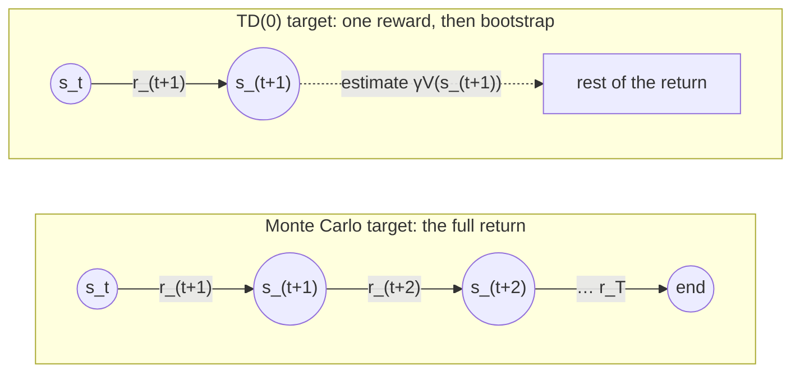
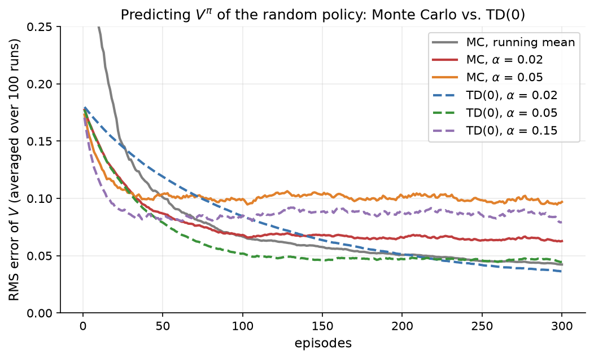
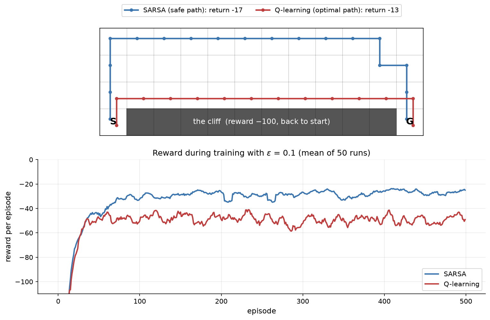

# 10.4 Learning from Experience: Monte Carlo and TD

Section 10.2 computed value functions exactly by sweeping over every state with a known model of the environment. Real agents rarely have that luxury. A robot does not know the physics of its world in closed form, and a game-playing agent cannot enumerate every position. What an agent *can* do is act and observe what happens. This section develops the two basic ways of learning values from such experience. **Monte Carlo** methods wait until an episode ends and average the returns that actually occurred. **Temporal-difference (TD)** methods update after every step, using their own current estimate of the next state's value as a stand-in for the rest of the return. We compare the two on the gridworld of Section 10.2, then turn them into control algorithms that learn good behavior, SARSA and Q-learning, and compare those on the classic cliff-walking task.

## Monte Carlo prediction

Start with the **prediction** problem: given a fixed policy $`\pi`$, estimate its value function $`V^{\pi}`$. By definition, $`V^{\pi}(s)`$ is the expected return from $s$. The most direct way to estimate an expectation is to average samples of it, so a Monte Carlo method runs the policy for many episodes, computes the return $`G_t`$ that followed each visit to each state, and averages them.

Computing all the returns of an episode is easy if we walk through it backward, using the recursion $`G_t = r_{t+1} + \gamma G_{t+1}`$ from Section 10.2 with $G = 0$ at the end. Each visited state's estimate is then moved toward the return that followed it:

```math
V(s_t) \leftarrow V(s_t) + \alpha \left[ G_t - V(s_t) \right].
```

This is the incremental update of Section 10.3 with the return $`G_t`$ as the target. With $`\alpha = 1/N(s_t)`$, where $`N(s_t)`$ counts the visits to $`s_t`$ so far, $V(s)$ is exactly the average of all returns observed from $s$; with a constant $`\alpha`$ it is an exponentially weighted average that favors recent episodes. ([Code 10.4.1](#code-1041-monte-carlo-prediction) implements both. It updates every visit to a state within an episode, the *every-visit* variant; a *first-visit* variant uses only the first visit per episode. Both converge to $`V^{\pi}`$.)

Monte Carlo has two attractive properties. It needs no model: it uses only sampled episodes. And its target is **unbiased**: $`G_t`$ is a sample of exactly the quantity $`V^{\pi}(s_t)`$ is defined as the mean of. As a check, a long Monte Carlo run of 100,000 episodes of the random policy in the gridworld, starting each episode in a random non-terminal cell, gives estimates that agree with the exact Bellman solution of Section 10.2 to within 0.007 in every state.

The price is **variance**. A return sums many random rewards along a random trajectory, so it can vary enormously from one episode to the next. In the gridworld, an episode of the random policy lasts 40.2 steps on average, and from the same starting cell the return may be $+1$ times some discount (if the walk happens to reach the goal) or $-1$ times some discount (if it falls into the pit). Monte Carlo also has to wait until an episode ends before it can learn anything from it, which is a problem for long episodes and impossible for continuing tasks.

## Temporal-difference learning

Temporal-difference learning removes the wait. The Bellman equation says that $`V^{\pi}(s_t)`$ equals the expected value of $`r_{t+1} + \gamma V^{\pi}(s_{t+1})`$. TD learning takes that expression, with the current estimate $V$ in place of the unknown $`V^{\pi}`$, as its target. After every single step it updates

```math
V(s_t) \leftarrow V(s_t) + \alpha \big[ \underbrace{r_{t+1} + \gamma V(s_{t+1})}_{\text{TD target}} - V(s_t) \big].
```

The bracketed quantity is the **TD error**,

```math
\delta_t = r_{t+1} + \gamma V(s_{t+1}) - V(s_t),
```

the difference between what the agent predicted from $`s_t`$ and a slightly better-informed prediction made one step later. (If $`s_{t+1}`$ is terminal, its value is zero.) This method is called **TD(0)**, and [Code 10.4.2](#code-1042-td0-prediction) implements it in a dozen lines. The TD error will return in Section 10.7 as the building block of generalized advantage estimation in PPO.

Using an estimate to update an estimate is called **bootstrapping**. It sounds circular, but it works: the TD target contains one real reward, so each update injects a little true information, and the values of states near rewards become accurate first and then propagate backward to the states that lead to them. Figure 10.8 contrasts the two targets.



*Figure 10.8: The Monte Carlo target uses every reward until the end of the episode, G_t = r_(t+1) + γ r_(t+2) + … . The TD(0) target uses a single real reward and replaces the rest of the return with the current estimate of the next state's value, r_(t+1) + γ V(s_(t+1)). It is available after one step.*

## The bias-variance trade-off

The two targets make opposite trade-offs. The Monte Carlo target $`G_t`$ is unbiased but has high variance, because it depends on every random action and transition until the end of the episode. The TD target $`r_{t+1} + \gamma V(s_{t+1})`$ depends on only one action, one transition, and one reward, so its variance is much lower; but it is **biased**, because $`V(s_{t+1})`$ is only an estimate, and early in learning it may be badly wrong. As learning proceeds and $V$ approaches $`V^{\pi}`$, the bias shrinks.

Which effect dominates is an empirical question, and on many problems the answer favors TD. Figure 10.9 compares the two on the gridworld, estimating the value of the random policy with $`\gamma = 0.9`$ from episodes that start in random cells. The error is the root-mean-square difference between the estimates and the exact values, averaged over 100 independent runs of 300 episodes each.



*Figure 10.9: Estimating V^π of the random gridworld policy (γ = 0.9) by Monte Carlo (solid lines) and TD(0) (dashed lines) with several step sizes α, and by Monte Carlo with a running mean (α = 1/N). The error is measured against the exact values of Section 10.2 and averaged over 100 runs. At equal step sizes TD(0) reaches a lower error than Monte Carlo; larger step sizes learn faster at first but level off at a higher error.*

At equal step sizes, TD(0) ends up well ahead. With $`\alpha = 0.05`$, TD(0) reaches an RMS error of 0.052 after 100 episodes and 0.045 after 300, while Monte Carlo with the same step size stalls at about 0.10. With $`\alpha = 0.02`$, the final errors after 300 episodes are 0.036 for TD(0) and 0.063 for Monte Carlo. The figure also shows the role of the step size. A constant step size never stops reacting to the latest samples, so the error levels off at a floor set by the variance of the targets: higher for larger $`\alpha`$ and much higher for the noisy Monte Carlo targets. Larger step sizes learn faster at first (TD(0) with $`\alpha = 0.15`$ has the lowest error after 10 episodes, 0.116) but settle at a higher floor (about 0.08). Monte Carlo with a running mean ($`\alpha = 1/N`$) has no floor and keeps improving, reaching 0.042 after 300 episodes, but it starts slowly because its first estimates are single noisy returns.

The two methods can be combined. An **n-step return** uses $n$ real rewards and then bootstraps, $`r_{t+1} + \gamma r_{t+2} + \dots + \gamma^{n-1} r_{t+n} + \gamma^n V(s_{t+n})`$. With $n = 1$ this is the TD(0) target, and as $n$ grows it approaches the Monte Carlo return. The TD($`\lambda`$) family takes an exponentially weighted average of all n-step returns, with a parameter $`\lambda \in [0, 1]`$ sliding from TD(0) at $`\lambda = 0`$ to Monte Carlo at $`\lambda = 1`$. The same idea, applied to advantages, gives generalized advantage estimation, which Section 10.7 uses in PPO.

## From prediction to control

Prediction evaluates a fixed policy. **Control** means finding a good policy. The general recipe, called **generalized policy iteration**, alternates two steps: evaluate the current policy, then improve it by acting greedily with respect to the evaluation. Each improved policy is at least as good as the one before, and the process converges to an optimal policy.

To improve a policy without a model we need action values rather than state values. Knowing $V(s)$ does not tell us which action to take unless we can predict where each action leads, which requires $`P(s' \mid s, a)`$. Knowing $Q(s, a)$ does: we simply pick $`\arg\max_a Q(s, a)`$. So model-free control methods learn $Q$. They must also keep exploring, since a purely greedy agent would never learn the values of actions it does not take, and they usually do this with ε-greedy action selection (Section 10.3).

### SARSA: on-policy TD control

**SARSA** applies TD learning to action values. After taking action $`a_t`$ in state $`s_t`$, observing $`r_{t+1}`$ and $`s_{t+1}`$, and choosing the next action $`a_{t+1}`$ with its ε-greedy policy, the agent updates

```math
Q(s_t, a_t) \leftarrow Q(s_t, a_t) + \alpha \left[ r_{t+1} + \gamma\, Q(s_{t+1}, a_{t+1}) - Q(s_t, a_t) \right].
```

The name comes from the five quantities in the update: $`(s_t, a_t, r_{t+1}, s_{t+1}, a_{t+1})`$. Because the policy is ε-greedy with respect to $Q$, improving $Q$ also improves the policy, so evaluation and improvement happen together, one step at a time. SARSA is **on-policy**: it learns the value of the policy it is actually following, exploration included.

### Q-learning: off-policy TD control

**Q-learning** changes one thing. Instead of the value of the next action the agent will actually take, it uses the value of the best next action:

```math
Q(s,a) \leftarrow Q(s,a) + \alpha \left[ r + \gamma \max_{a'} Q(s',a') - Q(s,a) \right].
```

This target is a sample of the right-hand side of the Bellman *optimality* equation (Section 10.2), so Q-learning estimates $`Q^*`$, the value of acting optimally, regardless of how the agent actually behaves. The agent can explore with an ε-greedy policy, or even act completely at random, and still learn the values of the greedy policy, provided it keeps visiting every state-action pair. Q-learning is therefore **off-policy**: it learns about one policy (the greedy *target policy*) from data generated by another (the exploratory *behavior policy*). Off-policy learning is powerful, because it can learn from old experience, from demonstrations, or from other agents, and Section 10.5 exploits it to reuse past experience in DQN. It also carries risks when combined with function approximation, as we will see there.

[Code 10.4.3](#code-1043-sarsa-and-q-learning-on-cliffwalking) implements both algorithms in a single function; the only difference is one line computing the target.

## On-policy vs. off-policy: cliff walking

The difference between learning the value of the policy you follow and learning the value of the optimal policy has real consequences, and the **cliff-walking** task shows them vividly. It is available in Gymnasium as `CliffWalking-v1`: a 4 × 12 grid in which the agent starts in the bottom-left corner and must reach the bottom-right corner. Every step costs $-1$. The cells between start and goal along the bottom edge are a cliff: stepping into one costs $-100$ and sends the agent back to the start. The shortest route runs right along the edge of the cliff and takes 13 steps.

We train SARSA and Q-learning with the same settings, $`\alpha = 0.5`$, $`\gamma = 1`$, and $`\epsilon = 0.1`$ throughout, for 500 episodes, and repeat everything 50 times with different random seeds. Figure 10.10 shows the results.



*Figure 10.10: Top: the greedy paths learned by SARSA and Q-learning in one run. Q-learning learns the optimal path along the edge of the cliff (return −13); SARSA learns a longer path that keeps its distance (return −17). Bottom: reward per episode during training with ε = 0.1, averaged over 50 runs and smoothed over 10 episodes. Because the agents keep exploring, SARSA's safe path earns more reward during training than Q-learning's optimal but risky one.*

Q-learning learns the optimal route. In all 50 runs, the greedy policy read off its final Q-table walks along the edge of the cliff and earns $-13$. SARSA learns a safer route: in 40 of the 50 runs its greedy path climbs to the top row and goes around, taking 17 steps, and in 3 more it takes a 19-step route. (In the remaining 7 runs the greedy policy extracted from SARSA's table gets stuck, bumping into the top wall or stepping back and forth between two cells, because with a constant step size of 0.5 SARSA's estimates keep fluctuating from episode to episode and in the top row the values of "move on" and "bump into the wall" are close. The ε-greedy policy it actually follows does not get stuck, since its random actions break such loops.)

Yet during training the ranking reverses. Over the last 100 episodes, SARSA's average reward per episode is $-26.3$ while Q-learning's is $-49.3$. The reason is exploration. Both agents take a random action 10 percent of the time. For Q-learning, walking along the edge, a random step down means falling off the cliff, and it happens often. Q-learning ignores this, because its target assumes greedy behavior from the next step on. SARSA's target includes the exploratory actions it actually takes, so it learns that cells next to the cliff are dangerous *for an agent that sometimes stumbles*, and it prefers a path where a stumble costs only a step.

Neither answer is wrong; they answer different questions. Q-learning finds the best policy for an agent that will eventually stop exploring. SARSA finds the best policy given that the agent keeps exploring. If exploration is gradually reduced to zero, SARSA's policy also converges to the optimal one. The distinction between learning about the policy that generated the data and learning about a different one runs through the rest of this chapter. Policy gradient methods (Section 10.6) are on-policy, and PPO (Section 10.7) is built around carefully reusing slightly off-policy data.

## A short history

Monte Carlo methods take their name from the casino and date to the 1940s, when Stanislaw Ulam, John von Neumann, and Nicholas Metropolis used random sampling for physics calculations; their use for estimating values from sampled episodes came much later. The idea behind TD learning appeared in Arthur Samuel's checkers player of 1959 and in models of animal learning, and Richard Sutton formalized it as a family of prediction methods, TD($`\lambda`$), in 1988 (Sutton 1988). Christopher Watkins introduced Q-learning in his 1989 PhD thesis, with a convergence proof published with Peter Dayan in 1992 (Watkins et al. 1992). SARSA was proposed by Gavin Rummery and Mahesan Niranjan in 1994 under the name "modified connectionist Q-learning"; the shorter name came from Sutton. The cliff-walking example comes from Sutton and Barto's textbook.

## Code for this section

The listings below collect the code for this section in the order in which the text refers to them. The prediction code is from [`figures/src/fig_s4_mc_td.py`](figures/src/fig_s4_mc_td.py) and uses the `GridWorld` class of Code 10.2.1; the control code is from `fig_s4_cliff.py` in the same folder. The scripts also draw Figures 10.9 and 10.10.

### Code 10.4.1: Monte Carlo prediction

Generates episodes of the uniform random policy from random non-terminal start cells, walks each episode backward to compute returns, and moves each visited state's estimate toward its return. With `alpha=None` the step size is $`1/N(s)`$, giving the running mean.

Notebook: [10.4.1-monte-carlo-prediction.ipynb](../../code/10-reinforcement-learning-basics/10.4.1-monte-carlo-prediction.ipynb)

### Code 10.4.2: TD(0) prediction

Updates after every step toward the one-step TD target, and measures the RMS error of both methods against the exact values from Code 10.2.2 (the 100-run averages plotted in Figure 10.9 repeat this with seeds 1000 to 1099).

Notebook: [10.4.2-td0-prediction.ipynb](../../code/10-reinforcement-learning-basics/10.4.2-td0-prediction.ipynb)

### Code 10.4.3: SARSA and Q-learning on CliffWalking

Tabular SARSA and Q-learning with ε-greedy exploration on Gymnasium's `CliffWalking-v1`. The two methods share everything except the target. `greedy_path` follows the learned greedy policy from the start state (for at most 100 steps) and reports its return.

Notebook: [10.4.3-sarsa-and-q-learning-on-cliffwalking.ipynb](../../code/10-reinforcement-learning-basics/10.4.3-sarsa-and-q-learning-on-cliffwalking.ipynb)

