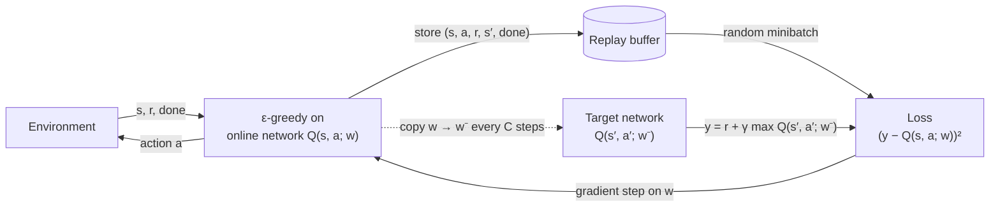
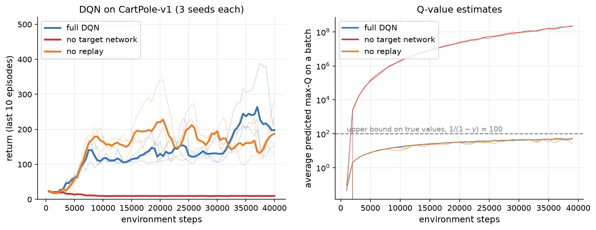
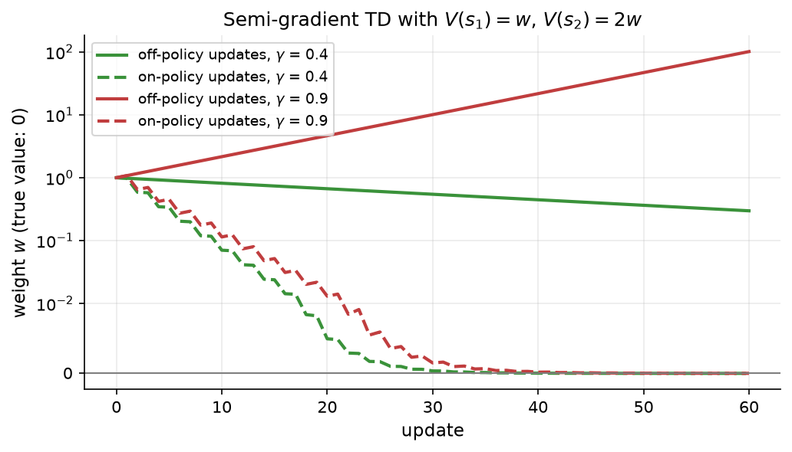

# 10.5 Function Approximation and Deep Q-Networks (Briefly)

Every method so far has stored one number per state or per state-action pair in a table. The gridworld has 22 states and cliff walking has 48, so tables are fine there. Most problems worth solving are different. CartPole's state is four real numbers, a Go board has more positions than there are atoms in the universe, and an Atari game is seen as a stream of images. This section, deliberately brief, explains how neural networks replace tables, presents the deep Q-network (DQN) that made this work at scale, and explains why the combination is fragile. It ends with the reason value-based methods like DQN are a poor fit for language models, which is why the rest of the chapter turns to policy gradients.

## Why tables fail

A table has two problems in large state spaces. The obvious one is size: we cannot store a value for every Go position or every possible screen image. The deeper one is **generalization**. A table learns about each state separately, so experience in one state tells it nothing about any other, and in a continuous space such as CartPole's the agent essentially never visits exactly the same state twice. We want a representation in which learning that one situation is dangerous also teaches us about similar situations.

The solution is **function approximation**: represent the value function by a parameterized function, $`\hat{Q}(s, a; \mathbf{w})`$, with far fewer parameters $`\mathbf{w}`$ than there are states. Early work used linear functions of hand-designed features. Modern methods use neural networks, which learn their own features. For a discrete set of actions, the usual design is a network that takes the state as input and outputs one Q-value per action, so a single forward pass gives everything needed to act greedily.

Training the network looks like regression. The tabular Q-learning update of Section 10.4 moved $Q(s, a)$ toward the target $`y = r + \gamma \max_{a'} Q(s', a')`$. With a network, we instead take a gradient step on the squared error between the prediction and the target,

```math
L(\mathbf{w}) = \left( y - \hat{Q}(s, a; \mathbf{w}) \right)^2, \qquad y = r + \gamma \max_{a'} \hat{Q}(s', a'; \mathbf{w}),
```

treating the target $y$ as a constant even though it also depends on $`\mathbf{w}`$. Because we ignore the target's dependence on the weights, this is called a **semi-gradient** method. It is not gradient descent on any fixed objective, and that is the root of the instabilities discussed below.

## DQN: experience replay and a target network

Naively plugging a neural network into Q-learning works badly. Consecutive transitions are strongly correlated (the next CartPole state is almost the same as this one), so minibatches of recent experience are far from the independent samples that stochastic gradient descent expects. And the target moves every time the weights change, so the network chases its own tail. The **deep Q-network** of Mnih et al. (2015) added two stabilizing ideas, and with them a single architecture learned to play 49 Atari games from raw pixels, reaching a level comparable to a professional human games tester on many of them.

**Experience replay.** Instead of learning from each transition once, as it happens, the agent stores every transition $`(s, a, r, s', \text{done})`$ in a large **replay buffer** (the last million transitions, in the Atari work) and trains on minibatches sampled uniformly at random from it. Random sampling breaks the correlations between consecutive steps, and each transition can be reused in many updates, which makes learning far more data-efficient. Replay is possible only because Q-learning is off-policy (Section 10.4): the stored transitions were generated by older versions of the policy, and Q-learning's target does not care which policy produced the data.

**A target network.** The targets are computed with a separate copy of the network, $`\hat{Q}(s', a'; \mathbf{w}^-)`$, whose weights $`\mathbf{w}^-`$ are frozen and copied from the online network only every few thousand steps:

```math
y = r + \gamma \max_{a'} \hat{Q}(s', a'; \mathbf{w}^-).
```

Between copies, the regression target stays still, so each phase of training is closer to ordinary supervised learning.

The rest of the algorithm is Q-learning with ε-greedy exploration, with $`\epsilon`$ decayed from 1 to a small value early in training. Figure 10.11 shows how the pieces fit together.



*Figure 10.11: The DQN training loop. The agent acts ε-greedily with the online network and stores every transition in a replay buffer. Training samples random minibatches from the buffer and regresses the online network toward targets computed by a periodically updated copy, the target network.*

[Code 10.5.1](#code-1051-a-small-dqn) implements DQN for CartPole in PyTorch: a Q-network with two hidden layers of 128 units, a replay buffer of 50,000 transitions, minibatches of 64, one update per environment step after the first 1,000, a target network copied every 500 steps, $`\gamma = 0.99`$, and $`\epsilon`$ decaying linearly from 1 to 0.05 over the first 10,000 steps. (It also uses two standard safety measures: the Huber loss, which grows linearly rather than quadratically for large errors, and gradient-norm clipping.) To see what each stabilizer contributes, we train three variants for 40,000 steps with three seeds each: full DQN, DQN with the target network removed (targets computed with the online network), and DQN with replay removed (each update uses the 64 most recent transitions instead of a random sample from the buffer).



*Figure 10.12: Left: return (average of the last 10 episodes) during training for three DQN variants, three seeds each (thin lines) and their mean (thick lines). Right: the average of the largest predicted Q-value over each training minibatch, on a log scale. With every reward equal to +1 and γ = 0.99, no true value can exceed 100 (dashed line). Without a target network the estimates grow without bound, to about 2 × 10⁸, and the policy collapses.*

The results in Figure 10.12 are a useful dose of reality. Full DQN learns, but slowly and unevenly for such a simple task: its best 10-episode averages are 221, 239, and 414 across the three seeds, and its average over the last 20 episodes of training is 136.9, 184.0, and 311.4. Removing the target network is catastrophic. In all three runs the predicted Q-values grow without bound, reaching about $`2 \times 10^8`$ by the end, against a true maximum of 100, and the greedy policy degenerates into pushing the cart the same way every time, with final returns of about 9. Removing replay, in contrast, made little difference in this small problem (last-20-episode returns of 163.4, 140.7, and 211.6), though in the Atari experiments of Mnih et al. (2015) replay was the more important of the two components. Value-based deep RL is sensitive to such details, and getting DQN to solve CartPole reliably takes more tuning than we did here. The PPO agent of Section 10.7 solves it in every run with standard settings.

## The deadly triad

The divergence in Figure 10.12 is not a bug in our code; it is a known property of the algorithm class. Sutton and Barto call it the **deadly triad**. Learning can become unstable, with value estimates that grow without bound, whenever three ingredients are combined:

1. **Function approximation**: states share parameters, so updating one state's value changes others.
2. **Bootstrapping**: targets are built from the method's own estimates, as in TD learning and Q-learning.
3. **Off-policy learning**: updates are made on a distribution of transitions different from the one the target policy would produce, as when Q-learning learns about the greedy policy from exploratory data or from a replay buffer.

Any two of the three are safe. Tabular Q-learning is off-policy and bootstraps, but a table has no shared parameters. Monte Carlo methods with neural networks approximate and may be off-policy, but they do not bootstrap. On-policy TD with linear function approximation is guaranteed to converge (Tsitsiklis et al. 1997). All three together have no such guarantee.

A tiny example shows how it happens ([Code 10.5.2](#code-1052-divergence-of-off-policy-td)). Two states share a single weight $w$: the first has value estimate $w$ and the second $2w$. From the first state the agent moves to the second with reward 0, and from the second it moves to a terminal state with reward 0, so all true values are zero and $w = 0$ is correct. Suppose we only ever update the first transition, as can happen off-policy. Its TD error is $`\delta = 0 + \gamma \cdot 2w - w = (2\gamma - 1)w`$, so each semi-gradient update multiplies $w$ by $`1 + \alpha(2\gamma - 1)`$. For $`\gamma \gt 0.5`$ this factor exceeds 1 and $w$ grows forever: increasing $w$ to reduce the first state's error raises the second state's value, which raises the target, which calls for a still larger $w$. With $`\alpha = 0.1`$ and $`\gamma = 0.9`$, $w$ grows from 1 to 101 in 60 updates (Figure 10.13). If we also update the second transition as often as the first, as an agent following the chain would, its error pulls $w$ down, and the same $w$ shrinks to about $`2 \times 10^{-6}`$.



*Figure 10.13: Semi-gradient TD(0) on two states whose value estimates are w and 2w, with α = 0.1, starting from w = 1 (true value 0; the vertical axis is linear near zero and logarithmic elsewhere). Updating only the first transition (off-policy, solid lines) converges slowly for γ = 0.4 but diverges for γ = 0.9. Updating both transitions as often as they occur on-policy (dashed lines) converges for both.*

DQN's target network and replay buffer do not remove the triad; they damp it enough to work in practice. Later refinements such as double Q-learning (to reduce the overestimation caused by the max in the target), prioritized replay, and dueling architectures made value-based deep RL considerably more robust, and combinations of them remain competitive on Atari-style benchmarks.

## Why value-based methods are awkward for LLMs

For language models, value-based methods face a structural problem. Casting text generation as an MDP (as Chapter 11 does), the state is the prompt plus the tokens generated so far and the action is the next token. The action space is the whole vocabulary, often 50,000 to 200,000 tokens, at every step.

- **Acting and learning require a max over the vocabulary.** Q-learning's target and its greedy policy both take $`\max_{a'} Q(s', a')`$. A network can output all the Q-values in one pass, much like a language model's output layer, but a Q-function must assign accurate values to every token, including the vast majority the model would never produce, and the max in the target amplifies errors in exactly those rarely trained entries.
- **Greedy policies are the wrong kind of policy.** Value-based methods produce (nearly) deterministic greedy policies. We want a language model to remain a well-calibrated distribution over text, from which we can sample diverse responses and which stays close to the pretrained model's distribution. A policy gradient method optimizes that distribution directly.
- **We already have a good policy.** A pretrained and fine-tuned language model is itself a strong stochastic policy. Policy gradient methods start from it and improve it gradually. A value-based method would have to learn a Q-function from scratch or bolt one onto the model, and the pretrained knowledge sits in the policy, not in a value function.
- **Rewards are sparse and sequence-level.** A reward model scores a complete response. Bootstrapping this single number back through hundreds of token-level max operations, off-policy, runs straight into the deadly triad.

For these reasons, RL for language models relies on policy gradient methods, possibly with a learned value function as a critic (which estimates the value of states, not of every token as an action). Sections 10.6 and 10.7 develop those methods.

## A short history

Function approximation has been part of reinforcement learning from the start: Samuel's checkers player used a linear evaluation function, and TD-Gammon used a neural network. Long-Ji Lin introduced experience replay in the early 1990s (Lin 1992). Through the 1990s, a series of counterexamples by Leemon Baird, John Tsitsiklis, Benjamin Van Roy, and others showed that off-policy TD learning with function approximation can diverge (Tsitsiklis et al. 1997), and this made neural-network value functions unfashionable for more than a decade. DQN (Mnih et al. 2013, 2015) revived them with replay and a target network, and started the era of deep reinforcement learning. Hado van Hasselt, Arthur Guez, and David Silver's double DQN (2016) and many other refinements followed.

## Code for this section

The listings below collect the code for this section. Code 10.5.1 is condensed from [`figures/src/dqn.py`](figures/src/dqn.py) (the full file also records the Q-value estimates plotted in Figure 10.12); `run_dqn_experiments.py` trains the nine runs in parallel (several minutes on a CPU) and `fig_s5_dqn.py` draws the figure. Code 10.5.2 is from `fig_s5_triad.py`.

### Code 10.5.1: A small DQN

A Q-network, a circular replay buffer, and the training loop. The flags `use_replay` and `use_target` switch off the two stabilizers for the ablation in Figure 10.12.

```python
import numpy as np
import torch
import torch.nn as nn
import gymnasium as gym

class QNetwork(nn.Module):
    """Maps a state to one Q-value per action."""
    def __init__(self, obs_dim, n_actions, hidden=128):
        super().__init__()
        self.net = nn.Sequential(nn.Linear(obs_dim, hidden), nn.ReLU(),
                                 nn.Linear(hidden, hidden), nn.ReLU(),
                                 nn.Linear(hidden, n_actions))

    def forward(self, s):
        return self.net(s)

class ReplayBuffer:
    """A fixed-size circular buffer of transitions (s, a, r, s', terminated)."""
    def __init__(self, capacity, obs_dim, rng):
        self.s = np.zeros((capacity, obs_dim), np.float32)
        self.a = np.zeros(capacity, np.int64)
        self.r = np.zeros(capacity, np.float32)
        self.s2 = np.zeros((capacity, obs_dim), np.float32)
        self.term = np.zeros(capacity, np.float32)
        self.capacity, self.size, self.pos, self.rng = capacity, 0, 0, rng

    def add(self, s, a, r, s2, term):
        i = self.pos
        self.s[i], self.a[i], self.r[i], self.s2[i], self.term[i] = s, a, r, s2, term
        self.pos = (self.pos + 1) % self.capacity
        self.size = min(self.size + 1, self.capacity)

    def _get(self, idx):
        return (torch.as_tensor(self.s[idx]), torch.as_tensor(self.a[idx]),
                torch.as_tensor(self.r[idx]), torch.as_tensor(self.s2[idx]),
                torch.as_tensor(self.term[idx]))

    def sample(self, batch_size):                  # uniform random minibatch
        return self._get(self.rng.integers(self.size, size=batch_size))

    def latest(self, batch_size):                  # the most recent transitions
        return self._get((self.pos - 1 - np.arange(batch_size)) % self.capacity)

def run_dqn(use_replay=True, use_target=True, total_steps=40_000, seed=0,
            gamma=0.99, lr=5e-4, batch_size=64, buffer_size=50_000,
            target_every=500, learning_starts=1_000, eps_decay_steps=10_000):
    torch.manual_seed(seed)
    rng = np.random.default_rng(seed)
    env = gym.make("CartPole-v1")
    obs_dim, n_actions = env.observation_space.shape[0], env.action_space.n
    q = QNetwork(obs_dim, n_actions)
    q_target = QNetwork(obs_dim, n_actions)
    q_target.load_state_dict(q.state_dict())
    opt = torch.optim.Adam(q.parameters(), lr=lr)
    buf = ReplayBuffer(buffer_size, obs_dim, rng)

    s, _ = env.reset(seed=seed)
    ep_return, returns = 0.0, []
    for step in range(total_steps):
        # epsilon-greedy exploration, epsilon decaying linearly from 1 to 0.05
        eps = max(0.05, 1.0 - 0.95 * step / eps_decay_steps)
        if rng.random() < eps:
            a = int(rng.integers(n_actions))
        else:
            with torch.no_grad():
                a = int(q(torch.as_tensor(s, dtype=torch.float32)).argmax())
        s2, r, terminated, truncated, _ = env.step(a)
        buf.add(s, a, r, s2, float(terminated))
        s, ep_return = s2, ep_return + r
        if terminated or truncated:
            returns.append(ep_return)
            s, _ = env.reset()
            ep_return = 0.0

        if step >= learning_starts:
            bs, ba, br, bs2, bterm = (buf.sample(batch_size) if use_replay
                                      else buf.latest(batch_size))
            with torch.no_grad():                          # the TD target
                net = q_target if use_target else q
                target = br + gamma * (1 - bterm) * net(bs2).max(dim=1).values
            pred = q(bs).gather(1, ba[:, None]).squeeze(1)
            loss = nn.functional.smooth_l1_loss(pred, target)
            opt.zero_grad()
            loss.backward()
            nn.utils.clip_grad_norm_(q.parameters(), 10.0)
            opt.step()
            if use_target and step % target_every == 0:
                q_target.load_state_dict(q.state_dict())    # periodic copy
    return np.array(returns)
```

The summary printed by `fig_s5_dqn.py` for the nine runs (seeds 0, 1, 2):

```text
full DQN           last-20-episode return per seed [136.9, 184.0, 311.4], best 10-episode average [221.0, 239.0, 414.0], final mean max-Q [48.8, 50.4, 48.0]
no target network  last-20-episode return per seed [9.8, 9.8, 9.3], best 10-episode average [32.0, 84.0, 40.0], final mean max-Q [223680560.0, 209083696.0, 236369408.0]
no replay          last-20-episode return per seed [163.4, 140.7, 211.6], best 10-episode average [215.0, 237.0, 342.0], final mean max-Q [57.2, 52.2, 28.8]
```

### Code 10.5.2: Divergence of off-policy TD

Semi-gradient TD(0) on the two-state example, updating only the first transition (off-policy) or alternating between both transitions (on-policy).

```python
X1, X2 = 1.0, 2.0          # feature of s1 and s2: V(s1) = w, V(s2) = 2w
ALPHA = 0.1

def run(gamma, on_policy, steps=60, w0=1.0):
    w, ws = w0, [w0]
    for t in range(steps):
        if on_policy and t % 2 == 1:     # s2 -> terminal, reward 0
            delta = 0.0 - w * X2
            w += ALPHA * delta * X2
        else:                            # s1 -> s2, reward 0
            delta = 0.0 + gamma * w * X2 - w * X1
            w += ALPHA * delta * X1
        ws.append(w)
    return np.array(ws)

for gamma in (0.4, 0.9):
    off, on = run(gamma, on_policy=False), run(gamma, on_policy=True)
    print(f"gamma={gamma}: w after 60 updates  off-policy {off[-1]:.3g}  on-policy {on[-1]:.3g}")
```

Output:

```text
gamma=0.4: w after 60 updates  off-policy 0.298  on-policy 1.21e-07
gamma=0.9: w after 60 updates  off-policy 101  on-policy 2.22e-06
```
