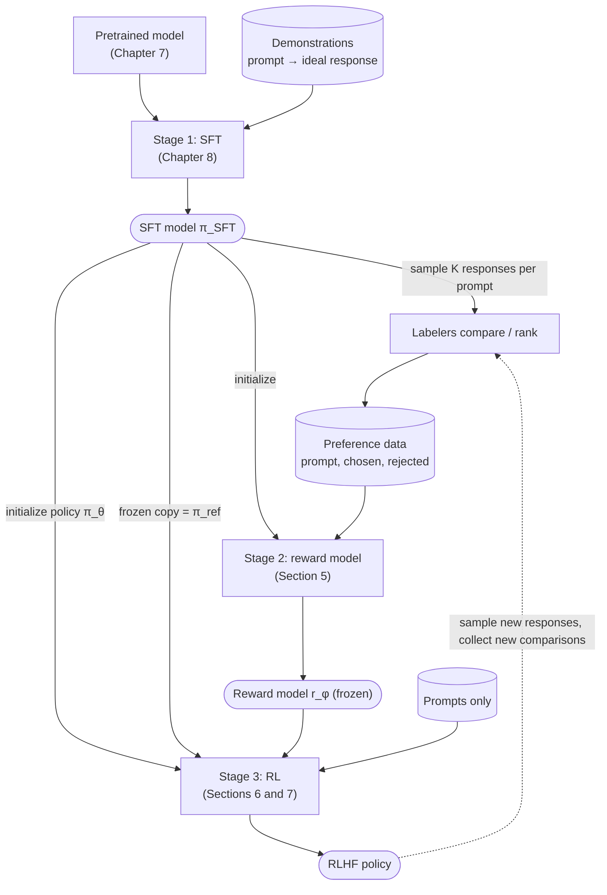

# 10.3 The RLHF Pipeline

Section 1 argued for learning from preferences, and Section 2 showed that a language model is a policy that RL can train. This section puts the pieces in order. Classic RLHF, as described by Ouyang et al. (2022) for InstructGPT and followed by most systems in Section 8, has three stages: supervised fine-tuning, reward modeling, and reinforcement learning. Each stage produces a model that later stages use, sometimes in several copies with different roles. Knowing which model comes from where, and which ones are frozen, makes the rest of the chapter much easier to follow.

## The three stages at a glance



*Figure 10.3.1. The classic three-stage RLHF pipeline. The SFT model is used four times: as the source of responses to compare, as the initialization of the reward model, as the initial policy, and as the frozen reference. The dotted arrow is the optional loop of iterated RLHF.*

The stages differ in what data they need and what they produce.

| Stage | Data | Model trained | Loss or objective | Output |
|---|---|---|---|---|
| 1. SFT | Prompts with demonstration responses | Language model, from pretrained weights | Cross-entropy on response tokens (Chapter 8) | $`\pi_{\mathrm{SFT}}`$ |
| 2. Reward model | Prompts with pairs or rankings of responses | Language model with a scalar head, usually from $`\pi_{\mathrm{SFT}}`$ | Bradley-Terry pairwise loss (Section 5) | $`r_{\phi}(x, y)`$, then frozen |
| 3. RL | Prompts only | Policy $`\pi_{\theta}`$, from $`\pi_{\mathrm{SFT}}`$ | Expected reward minus KL penalty (Section 6), optimized with PPO (Section 7) | Final policy |

For InstructGPT, the three datasets had about 13,000, 33,000, and 31,000 training prompts respectively (Ouyang et al. 2022). The RL stage needs no labels at all: it samples its own responses and scores them with the reward model. What it needs are *prompts* that cover the behaviors we care about.

## Stage 1: SFT

The first stage is Chapter 8 in its entirety. A pretrained model is fine-tuned on demonstrations, and the result, $`\pi_{\mathrm{SFT}}`$, is the foundation of everything that follows. It plays four roles.

1. **The starting policy.** RL initializes $`\pi_{\theta}`$ to $`\pi_{\mathrm{SFT}}`$. Starting from a model that already follows instructions and uses the chat format means RL can spend its limited signal on *quality* rather than on learning the format. A pretrained model that has never seen the chat template rarely produces a response a labeler would rate highly, so RL from it would begin with almost no useful signal.
2. **The reference model.** A frozen copy of $`\pi_{\mathrm{SFT}}`$ becomes $`\pi_{\mathrm{ref}}`$, the anchor of the KL penalty in Section 6. The penalty measures how far the policy has moved *from the SFT model*, so the SFT model defines what "normal" behavior looks like.
3. **The source of responses to compare.** At first, the responses that labelers compare in Stage 2 are sampled from $`\pi_{\mathrm{SFT}}`$ (and sometimes from other models). The reward model is therefore trained on the kind of text the policy will produce, at least at the start of RL.
4. **The reward model's initialization.** The reward model is usually a copy of the SFT model (or a related model) with its output layer replaced by a scalar head (Section 5). Starting from a model that understands the prompts and the style of the responses gives the reward model a strong head start.

The SFT stage is not strictly necessary for RL to work. Chapter 13 describes DeepSeek-R1-Zero, which ran RL directly on a pretrained model with rule-based rewards for math and code. But for RLHF with a learned reward model and open-ended prompts, every system in Section 8 starts from an SFT model.

## Stage 2: the reward model

The second stage turns human judgments into a function. For each of many prompts, several responses are sampled, and labelers say which ones they prefer (Section 4). A reward model $`r_{\phi}(x, y)`$ is then trained to assign higher scores to preferred responses, using the Bradley-Terry loss of Section 5.

Two properties of the result shape Stage 3.

- **The reward model is frozen during RL.** It is a fixed function that the policy tries to maximize. Because the policy can change and the reward model cannot, the policy will find and exploit any systematic error the reward model makes. This is the root of reward hacking (Chapter 13), and the main reason for the KL penalty.
- **Only reward differences are meaningful.** The Bradley-Terry loss depends only on the difference of two scores, so adding a constant to every reward changes nothing. Implementations fix the offset by a convention; InstructGPT, for example, added a bias so that labeler demonstrations had a mean reward of 0 before RL (Ouyang et al. 2022). The scale matters too, because it sets the exchange rate between reward and KL divergence (Section 6).

## Stage 3: reinforcement learning

The third stage trains the policy. Starting from $`\pi_{\theta} = \pi_{\mathrm{SFT}}`$, it repeats a loop:

1. Sample a batch of prompts from the RL prompt set.
2. Generate a response to each prompt with the current policy (Section 2).
3. Score each response with the reward model.
4. Compute how far each response's token probabilities have moved from the reference model.
5. Update the policy to make high-reward responses more likely, while paying a penalty for moving away from the reference.

Steps 4 and 5 are the RLHF objective of Section 6, and Section 7 shows how PPO implements the update, adding a value model to estimate per-token advantages. The output is the RLHF policy, the model that is deployed.

InstructGPT added one more ingredient to Stage 3. Its first RLHF models got worse on some public NLP benchmarks, a cost the authors called an "alignment tax." To reduce it, they mixed gradients from the original pretraining objective into the PPO updates, maximizing

```math
\mathbb{E}_{x \sim \mathcal{D},\, y \sim \pi_{\theta}}\left[ r_{\phi}(x, y) - \beta \log \frac{\pi_{\theta}(y \mid x)}{\pi_{\mathrm{SFT}}(y \mid x)} \right] + \gamma_{\mathrm{ptx}}\, \mathbb{E}_{x \sim \mathcal{D}_{\mathrm{pretrain}}}\left[ \log \pi_{\theta}(x) \right],
```

where the second term is the ordinary language-modeling log-likelihood on pretraining text. They called the resulting models PPO-ptx. The KL coefficient $\beta$ and the pretraining coefficient $`\gamma_{\mathrm{ptx}}`$ (which we write with a subscript to avoid a clash with the discount factor) are both hyperparameters; Ouyang et al. used $\beta = 0.02$ and $`\gamma_{\mathrm{ptx}} = 27.8`$.

## Iterating the pipeline

The figure's dotted arrow marks a common extension. The reward model is trained on responses from the SFT model, but RL moves the policy into regions where its responses look different: longer, more structured, more confident. The reward model has seen few examples like these, and its judgments there are less reliable. The fix is to collect fresh comparisons on responses from the *current* policy, retrain or fine-tune the reward model, and run RL again.

Several systems in Section 8 did exactly this. Bai et al. (2022) updated their preference models and RL policies on a roughly weekly cadence with fresh human feedback, which they called iterated online RLHF. Llama 2-Chat went through five rounds of reward model and policy updates, labeled RLHF-V1 through V5, collecting new preference data on the latest model before each round (Touvron et al. 2023). OpenAI's description of ChatGPT says simply, "We performed several iterations of this process" (OpenAI 2022).

## Variations on Stage 3

PPO is not the only way to use a reward model. Two alternatives appear in Section 8 and are developed in Chapter 13.

- **Rejection sampling fine-tuning (best-of-$n$).** Sample $n$ responses per prompt, keep the one with the highest reward, and fine-tune on these winners with the SFT loss. It needs no value model and no on-policy RL, and it is easy to run at scale. Llama 2-Chat used it for its early rounds and combined it with PPO later (Touvron et al. 2023).
- **Direct preference optimization (DPO).** Chapter 13 shows that the optimal policy for the RLHF objective can be written in closed form (Section 6 previews it), and uses this to train the policy directly on preference pairs, merging Stages 2 and 3 into one supervised-style step with no explicit reward model and no sampling.

These methods share the same ingredients (a starting SFT model, preference data, and a reference model to stay close to) and they optimize closely related objectives. PPO-based RLHF is the original version and the one that produced the models of Section 8, which is why this chapter builds it in full.

## What the pipeline costs

Each stage has a different bottleneck.

- **Stage 1** is bottlenecked by demonstration writing, which requires skilled people (Chapter 8).
- **Stage 2** is bottlenecked by comparison labeling, which is cheaper per example but needed in larger volumes, and by the care needed to make labels consistent (Section 4).
- **Stage 3** is bottlenecked by compute and engineering. It holds several large models in memory at once and alternates between generating text and training (Section 7).

In compute terms, all three stages are small next to pretraining. Ouyang et al. (2022) reported that training their 175-billion-parameter SFT model took 4.9 petaflop/s-days and their 175-billion-parameter PPO-ptx model 60 petaflop/s-days, compared with 3,640 petaflop/s-days to pretrain GPT-3. Most of the cost of RLHF is in people and in engineering complexity, not in raw FLOPs.

The pipeline begins with people comparing responses. How should those comparisons be collected, how consistent are they, and what public datasets exist?

## Key takeaways

- Classic RLHF has three stages: SFT on demonstrations, a reward model trained on human preferences, and RL of the SFT model against the reward model with a KL penalty.
- The SFT model is used four times: as the initial policy, as the frozen reference, as the source of responses for labeling, and as the reward model's initialization.
- The reward model is frozen during RL and only reward differences are meaningful; a bias term fixes the offset, and its scale sets the exchange rate with the KL penalty.
- The RL stage needs prompts but no labels; InstructGPT also mixed in pretraining gradients (PPO-ptx) to reduce regressions on NLP benchmarks.
- Many systems iterate the pipeline, collecting new comparisons on the latest policy so that the reward model stays accurate where the policy now operates.
- Rejection sampling and DPO use the same ingredients with a simpler optimization step; Chapter 13 covers them.

## Further reading

Bai, Yuntao, et al. "Training a Helpful and Harmless Assistant with Reinforcement Learning from Human Feedback." arXiv preprint arXiv:2204.05862, 2022. https://arxiv.org/abs/2204.05862.

OpenAI. "Introducing ChatGPT." November 30, 2022. https://openai.com/index/chatgpt/.

Ouyang, Long, et al. "Training Language Models to Follow Instructions with Human Feedback." In *Advances in Neural Information Processing Systems 35*, 2022. https://arxiv.org/abs/2203.02155.

Stiennon, Nisan, et al. "Learning to Summarize from Human Feedback." In *Advances in Neural Information Processing Systems 33*, 2020. https://arxiv.org/abs/2009.01325.

Touvron, Hugo, et al. "Llama 2: Open Foundation and Fine-Tuned Chat Models." arXiv preprint arXiv:2307.09288, 2023. https://arxiv.org/abs/2307.09288.
