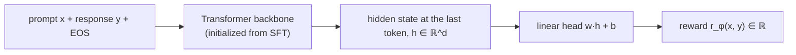
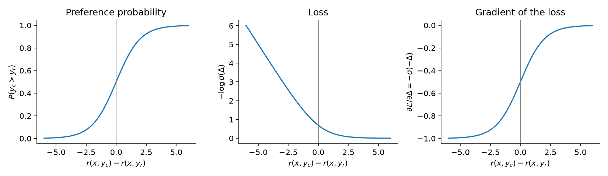

# 10.5 Reward Modeling

Section 4 produced a dataset of prompts with chosen and rejected responses. The RL stage needs something different: a function it can call on any new response and get back a number. A reward model is that function. It is trained to agree with human comparisons and then frozen, standing in for the labelers during RL. This section describes its architecture, derives its training loss from the Bradley-Terry model of paired comparisons, explains how to evaluate it, and catalogs the weaknesses that an RL policy will later find and exploit. The section ends with the chapter's second code lab, training a small reward model on HH-RLHF.

## Architecture

A reward model $`r_{\phi}(x, y)`$ maps a prompt and a response to a single real number. In practice it is a language model with its output layer swapped out.

- **Backbone.** A decoder-only transformer, usually initialized from the SFT model (Section 3). Stiennon et al. (2020) started from their supervised summarization model; Llama 2's reward models were initialized from pretrained chat model checkpoints so that the reward model "knows what the chat model knows," which, the authors argued, prevents it from favoring hallucinations it cannot recognize (Touvron et al. 2023). InstructGPT started from a 6-billion-parameter GPT-3 model fine-tuned on public NLP tasks and found similar results when starting from GPT-3 or the SFT model (Ouyang et al. 2022).
- **Scalar head.** The unembedding matrix, which maps the final hidden state to $`|\mathcal{V}|`$ logits, is replaced with a linear layer that maps it to one number: $`r = \mathbf{w}^\top \mathbf{h} + b`$, with $`\mathbf{w} \in \mathbb{R}^{d}`$.
- **Readout position.** The prompt and response are concatenated, usually followed by an end-of-sequence token, and passed through the backbone. The head reads the hidden state at the *last* token. Because attention is causal (Section 6.4), the last position is the only one whose hidden state depends on the entire prompt and response.



*Figure 10.5.1. A reward model is a language model whose unembedding layer is replaced by a scalar head read out at the final token.*

How big should it be? Larger reward models are more accurate: in a sweep of reward models from 160 million to 13 billion parameters trained on 8,000 to 64,000 comparisons, Stiennon et al. (2020) found that doubling the model size raised validation accuracy by about 1.8 percentage points and doubling the data by about 1.1. But the reward model also has to run on every response during RL, and in PPO the value model is often initialized from it (Section 7). InstructGPT used a 6-billion-parameter reward model for policies of every size, including 175 billion; its authors found 175B reward model training could be unstable and that a 175B reward model and value function would greatly increase the compute cost of PPO (Ouyang et al. 2022).

## The Bradley-Terry model

We need a loss that turns "labelers preferred $`y_c`$ over $`y_r`$" into a gradient on $\phi$. The standard choice comes from a 1952 model of paired comparisons by Bradley and Terry, originally used to rank items such as sports teams or taste-test samples.

The Bradley-Terry model assumes that each item $i$ has a latent strength $`s_i`$ and that, when two items are compared, item $i$ wins with probability

```math
P(i \succ j) = \frac{\exp(s_i)}{\exp(s_i) + \exp(s_j)} = \frac{1}{1 + \exp\big(-(s_i - s_j)\big)} = \sigma(s_i - s_j),
```

where $\sigma$ is the logistic sigmoid of Section 2.2. Only the *difference* of strengths matters. A difference of 0 means a coin flip; a difference of 1 means the stronger item wins with probability $\sigma(1) \approx 0.73$; a difference of 3 gives about 0.95. The Elo ratings of chess and the Chatbot Arena leaderboard (Section 11.3) are built on the same model.

For RLHF, the "items" are responses to the same prompt, and the strength of a response is its reward: $`s = r_{\phi}(x, y)`$. The probability that a labeler prefers the chosen response is modeled as

```math
P(y_c \succ y_r \mid x) = \sigma\big(r_{\phi}(x, y_c) - r_{\phi}(x, y_r)\big).
```

Maximizing the log-likelihood of the observed preferences over the dataset is the same as minimizing

```math
\mathcal{L}_{\mathrm{RM}}(\phi) = -\,\mathbb{E}_{(x, y_c, y_r) \sim \mathcal{D}}\left[ \log \sigma\big( r_{\phi}(x, y_c) - r_{\phi}(x, y_r) \big) \right],
```

which is the loss in the chapter outline, with $`y_c = y_{\mathrm{chosen}}`$ and $`y_r = y_{\mathrm{rejected}}`$. It is binary cross-entropy on the event "the chosen response wins," with the reward difference playing the role of the logit. Christiano et al. (2017) fit their reward model with exactly this model, noting its origin in Bradley and Terry (1952); Stiennon et al. (2020), Ouyang et al. (2022), and Touvron et al. (2023) all use the same loss.

### How the gradient behaves

Write $`\Delta = r_{\phi}(x, y_c) - r_{\phi}(x, y_r)`$. The loss for one pair is $`-\log \sigma(\Delta)`$, and its derivative is

```math
\frac{\partial}{\partial \Delta}\big(-\log \sigma(\Delta)\big) = -\big(1 - \sigma(\Delta)\big) = -\sigma(-\Delta).
```

By the chain rule, the gradient step raises $`r_{\phi}(x, y_c)`$ and lowers $`r_{\phi}(x, y_r)`$ with weight $`\sigma(-\Delta)`$. When the model already ranks the pair correctly by a wide margin, $\Delta$ is large, the weight is near 0, and the pair contributes little. When the model ranks it wrongly, the weight approaches 1. Figure 10.5.2 plots the probability, the loss, and the gradient as functions of the margin.



*Figure 10.5.2. Left: the modeled probability that the chosen response is preferred, as a function of the reward difference. Middle: the loss $-\log\sigma(\Delta)$ keeps decreasing as the margin grows but flattens out. Right: its gradient, which is largest in magnitude for pairs the model gets wrong.*

The loss never reaches zero, and with a perfectly separable dataset it would push margins toward infinity. In practice, noisy and conflicting labels (Section 4) keep margins finite, and training for a single epoch keeps the model from memorizing individual pairs.

### What the loss does not determine

Two properties of the Bradley-Terry loss matter for everything downstream.

**Shift invariance.** Adding the same constant to every reward leaves every difference, and hence the loss, unchanged. The reward model's absolute level is arbitrary. Implementations fix it by convention: Stiennon et al. (2020) normalized rewards so that the human reference summaries had a mean score of 0, and InstructGPT added a bias so that labeler demonstrations did (Ouyang et al. 2022).

**Scale is meaningful, but only through the data.** Unlike the offset, the scale is pinned down by the loss: a reward difference of 1 means odds of about $e : 1$. But the scale reflects how *confidently* the data separate responses, which depends on label noise and on how different the compared responses were. Since the RL objective of Section 6 trades reward against a KL penalty, the scale of the reward sets the effective strength of that penalty. This is one reason some pipelines normalize or whiten rewards before RL (Section 7).

## Rankings, margins, and label noise

Three common variations extend the basic pairwise loss.

**Rankings of $K$ responses.** A ranking of $K$ responses implies $`\binom{K}{2}`$ pairs. InstructGPT averaged the pairwise loss over all of them, and processed all pairs from one prompt together in one batch element (Ouyang et al. 2022):

```math
\mathcal{L}_{\mathrm{RM}}(\phi) = -\frac{1}{\binom{K}{2}}\, \mathbb{E}_{(x, y_w, y_l) \sim \mathcal{D}}\left[ \log \sigma\big( r_{\phi}(x, y_w) - r_{\phi}(x, y_l) \big) \right],
```

where $`y_w`$ is the preferred ("winning") response of each pair. Besides preventing overfitting from correlated pairs (Section 4), this is efficient: each of the $K$ responses needs only one forward pass, and the $`\binom{K}{2}`$ differences are computed from the $K$ scores. An alternative for "best of $K$" labels is a softmax over the $K$ rewards, $`P(b \mid x) = \exp(r(x, y_b)) / \sum_i \exp(r(x, y_i))`$, which is what Ziegler et al. (2019) used when labelers picked the best of four; it generalizes Bradley-Terry from two items to $K$.

**Margins from preference strength.** When labelers say *how much* better the chosen response is, Llama 2 used the strength to demand a larger reward gap for clearer preferences (Touvron et al. 2023):

```math
\mathcal{L}_{\mathrm{ranking}} = -\log \sigma\big( r_{\phi}(x, y_c) - r_{\phi}(x, y_r) - m(r) \big),
```

where $m(r)$ is a discrete function of the rating, large for "significantly better" and small for "negligibly better or unsure." The authors found that the margin improved accuracy on the more separable pairs.

**Label noise.** Christiano et al. (2017) assumed a 10% chance that a human answered uniformly at random, mixing the Bradley-Terry probability with a coin flip. The effect is to cap how confident the model can be, which limits the damage from mislabeled pairs. The same idea appears in modern implementations as label smoothing.

([Code 10.5.1](#code-1051-a-reward-model-and-its-losses) implements the reward model and all three losses.)

## Training in practice

Reward model training is a short fine-tuning run. Several practical choices recur across papers:

- **One epoch.** InstructGPT trained for a single epoch and found that multiple epochs quickly overfit, with obvious deterioration in validation loss (Ouyang et al. 2022). Anthropic's preference models were also trained for one epoch (Bai et al. 2022).
- **Small learning rate.** InstructGPT used $`9 \times 10^{-6}`$ with a cosine schedule and 64 prompts per batch, and found training insensitive to the learning rate but sensitive to the number of epochs.
- **Preference model pretraining.** Anthropic added a stage between pretraining and fine-tuning on their own comparisons, training on large amounts of preference-like data built from public sources: Stack Exchange, Reddit, and Wikipedia edits (Askell et al. 2021; Bai et al. 2022).
- **No dropout**, and one padding and truncation convention used consistently, so that the reward is always read at the true last token. When a prompt is too long, truncate from the left so that the response survives.

## Evaluating a reward model

### Accuracy on held-out pairs

The basic metric is **pairwise accuracy**: the fraction of held-out comparisons for which $`r_{\phi}(x, y_c) \gt r_{\phi}(x, y_r)`$. It should be read against the agreement between humans (Section 4), which is its practical ceiling. Some reported values:

- InstructGPT's reward models predicted the preferences of held-out comparisons from the same labelers with 72.4 ± 0.4% accuracy, and those of a different group of held-out labelers with 69.6 ± 0.9% (Ouyang et al. 2022). Training labelers agreed with each other 72.6% of the time.
- Stiennon et al.'s 1.3B and 6.7B reward models agreed with labelers on CNN/DM news summaries, a domain they were not trained on, 62.4% and 66.5% of the time, close to the inter-labeler agreement of 66.9% on that data (Stiennon et al. 2020).

Accuracy varies with how clear the preference is. Llama 2's reward models were more accurate on pairs labeled "significantly better" than on those labeled "negligibly better or unsure" (Touvron et al. 2023). Reporting accuracy separately by preference strength, by task category, and by prompt source gives a much clearer picture than a single number. Benchmarks such as RewardBench collect preference pairs across chat, safety, and reasoning for comparing reward models (Lambert et al. 2024).

### Beyond accuracy

Accuracy on held-out pairs measures whether the reward model ranks the kind of responses it was trained on. RL will ask it about different responses. Other checks are informative:

- **Calibration.** Does a predicted probability of 0.8 correspond to an 80% empirical win rate? Bai et al. (2022) found their preference models well calibrated on held-out data from the training distribution, but also noted that they become less calibrated at higher scores, precisely where an RL policy pushes.
- **Targeted probes.** Stiennon et al. (2020) had labelers make minimal edits that improved a summary; their 6.7B reward model preferred the edited version 82.8% of the time, compared with 84.1% for a separate set of human evaluators. When the roles of the participants in a summary were swapped, the model chose the original summary 97.2% of the time. Probes like these test whether the model is sensitive to meaning, not just surface features.
- **Best-of-$n$ sampling.** Sample $n$ responses per prompt from the policy, pick the one with the highest reward, and have people compare it with a random sample. If the reward model is good, best-of-$n$ should win more often as $n$ grows. This is a cheap preview of what RL against the reward model will do.

## Known weaknesses

A reward model is a learned approximation of human judgment, trained on a finite set of comparisons. Its errors are not random: they are systematic, and a policy optimized against it will seek them out.

**Length bias.** Longer responses tend to be preferred in the data (Section 4), and reward models learn this readily because length is easy to detect. Stiennon et al. (2020) found that their reward models were biased toward longer summaries. Singhal et al. (2023) found that in several RLHF setups much of the improvement in reward came from making responses longer, and that even a reward based purely on length reproduced most of the downstream improvements; they traced the bias mainly to the reward models, which were easily influenced by length correlations in the preference data. In this section's lab, a small reward model trained for only 50 steps on 400 HH-RLHF pairs preferred the longer response in about 86% of held-out pairs that differ in length, far above the 59% rate at which the data themselves favor longer responses: on so little data, length is one of the easiest things to learn.

**Spurious features.** Anything correlated with preference in the training data can become a shortcut: bullet points, headers, polite phrases, hedges, particular words, or a confident tone. A reward model cannot distinguish "people preferred this because it was correct" from "people preferred this because it had a numbered list" unless the data contain examples that separate the two.

**Overconfidence off-distribution.** The reward model is trained on responses from the SFT model and a few other sources. RL produces responses unlike any it has seen, including degenerate ones such as repeated phrases or unusual formatting. On such inputs the reward model's scores can be extreme and confidently wrong, and nothing in its training penalized this. Stiennon et al. (2020) showed that optimizing a policy too hard against a reward model eventually made the reward model anti-correlated with human preferences.

**A single number for many goals.** Helpfulness, honesty, and harmlessness can conflict (Section 1). One scalar must encode a fixed trade-off between them. Llama 2 addressed this by training separate helpfulness and safety reward models and combining their scores with a rule that prioritizes safety on prompts tagged as potentially unsafe (Touvron et al. 2023).

These weaknesses motivate the remaining machinery of RLHF: the KL penalty that keeps the policy in the region where the reward model is trustworthy (Section 6), iterated data collection that refreshes the reward model where the policy now operates (Section 3), and ensembles of reward models, which reduce but do not remove exploitation (Coste et al. 2024; Eisenstein et al. 2024). Chapter 13 studies reward hacking and over-optimization directly.

## Lab: train a reward model

The second code lab ([Code 10.5.2](#code-1052-training-and-evaluating-a-reward-model-on-hh-rlhf)) fine-tunes DistilGPT-2 with a scalar head on pairs from HH-RLHF's helpful subset, using the prompt-splitting function from Section 4. It reports held-out accuracy and checks the length bias: among held-out pairs whose responses differ in length, how often does the model prefer the longer one?

On a CPU the default setting of 400 training pairs takes a few minutes to tens of minutes. In our CPU run, held-out accuracy on 200 pairs was about 60%, and the model preferred the longer response in about 86% of the pairs whose responses differ in length. Both numbers are noisy at this sample size, but the pattern is instructive: the model had learned something, and a good part of it was length. Training on more pairs, or with a larger backbone, raises accuracy; comparing the length-preference rate with the dataset's own 59% shows how much of the model's judgment is a length shortcut. Save the trained model: Section 7 uses it as the reward for PPO.

With a trained reward model, we could simply ask RL to maximize it. Why is that a bad idea, and what objective should we maximize instead?

## Code for this section

These listings need `torch`, `transformers`, and `datasets`, and reuse `split_prompt` from Code 10.4.1.

### Code 10.5.1: A reward model and its losses

`RewardModel` wraps a transformer backbone (`AutoModel`, which omits the language-modeling head) and reads a scalar at the last real token, assuming right padding. The head is initialized with standard deviation $`1/\sqrt{d+1}`$, following the reference implementation of Stiennon et al. (2020) as documented by Huang et al. (2024). `bt_loss` is the pairwise Bradley-Terry loss with an optional margin, and `ranking_loss` averages it over all pairs of a ranking.

```python
import torch
import torch.nn as nn
import torch.nn.functional as F
from transformers import AutoModel

class RewardModel(nn.Module):
    """A transformer backbone with a scalar head read out at the last real token."""
    def __init__(self, name):
        super().__init__()
        self.backbone = AutoModel.from_pretrained(name)      # e.g. the SFT model without its LM head
        d = self.backbone.config.hidden_size
        self.head = nn.Linear(d, 1)
        nn.init.normal_(self.head.weight, std=1 / (d + 1) ** 0.5)
        nn.init.zeros_(self.head.bias)

    def forward(self, input_ids, attention_mask):
        h = self.backbone(input_ids=input_ids, attention_mask=attention_mask).last_hidden_state
        last = attention_mask.sum(dim=1) - 1                 # index of the last real token (right padding)
        h_last = h[torch.arange(h.size(0)), last]
        return self.head(h_last).squeeze(-1)                 # one scalar per sequence

def bt_loss(r_chosen, r_rejected, margin=0.0):
    """Bradley-Terry pairwise loss: -log sigmoid(r_c - r_r - m)."""
    return -F.logsigmoid(r_chosen - r_rejected - margin).mean()

def ranking_loss(rewards):
    """InstructGPT-style loss for one prompt with K responses ranked best first:
    the pairwise loss averaged over all K*(K-1)/2 pairs."""
    K = rewards.shape[0]
    i, j = torch.triu_indices(K, K, offset=1)                # response i is ranked above response j
    return -F.logsigmoid(rewards[i] - rewards[j]).mean()

print(ranking_loss(torch.tensor([2.0, 1.0, 0.5, -1.0])))     # tensor(0.2276)
```

### Code 10.5.2: Training and evaluating a reward model on HH-RLHF

The second suggested code lab. Trains for one epoch on `N_TRAIN` pairs, then reports held-out accuracy and how often the model prefers the longer response, and saves the weights for Section 7.

```python
import torch
from datasets import load_dataset
from transformers import AutoTokenizer

torch.manual_seed(0)
name, N_TRAIN, N_TEST, BATCH = "distilgpt2", 400, 200, 8
tok = AutoTokenizer.from_pretrained(name)
tok.pad_token = tok.eos_token
tok.padding_side, tok.truncation_side = "right", "left"      # keep the end of long inputs: the response
rm = RewardModel(name)
opt = torch.optim.AdamW(rm.parameters(), lr=1e-5)

ds = load_dataset("Anthropic/hh-rlhf", data_dir="helpful-base")
def to_pairs(split, n):
    pairs = []
    for ex in split.shuffle(seed=0).select(range(n)):
        try:
            pairs.append(split_prompt(ex["chosen"], ex["rejected"]))
        except ValueError:
            pass
    return pairs
train_pairs, test_pairs = to_pairs(ds["train"], N_TRAIN), to_pairs(ds["test"], N_TEST)

def score(prompts, responses, max_len=384):
    texts = [p + r + tok.eos_token for p, r in zip(prompts, responses)]
    enc = tok(texts, return_tensors="pt", padding=True, truncation=True, max_length=max_len)
    return rm(enc["input_ids"], enc["attention_mask"])

rm.eval()                                                    # no dropout
for step in range(0, len(train_pairs), BATCH):               # a single epoch
    p, c, r = zip(*train_pairs[step:step + BATCH])
    r_c, r_r = score(p, c), score(p, r)
    loss = bt_loss(r_c, r_r)
    opt.zero_grad(); loss.backward()
    torch.nn.utils.clip_grad_norm_(rm.parameters(), 1.0)
    opt.step()
    if (step // BATCH) % 10 == 0:
        print(f"step {step // BATCH:3d}  loss {loss.item():.3f}  batch acc {(r_c > r_r).float().mean():.2f}")

correct = longer_pref = n_diff = 0
with torch.no_grad():
    for i in range(0, len(test_pairs), 16):
        p, c, r = zip(*test_pairs[i:i + 16])
        r_c, r_r = score(p, c), score(p, r)
        correct += (r_c > r_r).sum().item()
        for a, b, ra, rb in zip(c, r, r_c, r_r):             # does the RM prefer the longer response?
            if len(a) != len(b):
                n_diff += 1
                longer_pref += int((ra > rb) == (len(a) > len(b)))
print(f"held-out accuracy {correct / len(test_pairs):.3f}; "
      f"prefers the longer response {longer_pref / n_diff:.3f}")
torch.save(rm.state_dict(), "reward_model.pt")
```

## Key takeaways

- A reward model is a transformer, usually initialized from the SFT model, whose unembedding layer is replaced by a linear head that outputs one number read at the final token.
- The Bradley-Terry model assumes $`P(y_c \succ y_r) = \sigma(r(x, y_c) - r(x, y_r))`$; maximizing its likelihood gives the pairwise loss $`-\log\sigma(r_c - r_r)`$, whose gradient focuses on pairs the model gets wrong.
- Rewards are defined only up to a constant; implementations fix the offset, and the scale sets the exchange rate with the KL penalty in RL.
- Rankings contribute all $`\binom{K}{2}`$ pairs, preference strength can enter as a margin, and label noise can be modeled by mixing in a coin flip.
- Held-out pairwise accuracy is the main metric and is capped by human agreement (around 70% in InstructGPT); calibration, targeted probes, and best-of-$n$ tests add information.
- Reward models are biased toward length and other spurious features and are unreliable on unfamiliar responses, which is why RL must stay close to the reference model.

## Further reading

Askell, Amanda, et al. "A General Language Assistant as a Laboratory for Alignment." arXiv preprint arXiv:2112.00861, 2021. https://arxiv.org/abs/2112.00861.

Bai, Yuntao, et al. "Training a Helpful and Harmless Assistant with Reinforcement Learning from Human Feedback." arXiv preprint arXiv:2204.05862, 2022. https://arxiv.org/abs/2204.05862.

Bradley, Ralph Allan, et al. "Rank Analysis of Incomplete Block Designs: I. The Method of Paired Comparisons." *Biometrika* 39, no. 3/4 (1952): 324–345. https://doi.org/10.2307/2334029.

Christiano, Paul F., et al. "Deep Reinforcement Learning from Human Preferences." In *Advances in Neural Information Processing Systems 30*, 2017. https://arxiv.org/abs/1706.03741.

Coste, Thomas, et al. "Reward Model Ensembles Help Mitigate Overoptimization." In *International Conference on Learning Representations*, 2024. https://arxiv.org/abs/2310.02743.

Eisenstein, Jacob, et al. "Helping or Herding? Reward Model Ensembles Mitigate but Do Not Eliminate Reward Hacking." In *Conference on Language Modeling*, 2024. https://arxiv.org/abs/2312.09244.

Huang, Shengyi, et al. "The N+ Implementation Details of RLHF with PPO: A Case Study on TL;DR Summarization." In *Conference on Language Modeling*, 2024. https://arxiv.org/abs/2403.17031.

Lambert, Nathan, et al. "RewardBench: Evaluating Reward Models for Language Modeling." arXiv preprint arXiv:2403.13787, 2024. https://arxiv.org/abs/2403.13787.

Ouyang, Long, et al. "Training Language Models to Follow Instructions with Human Feedback." In *Advances in Neural Information Processing Systems 35*, 2022. https://arxiv.org/abs/2203.02155.

Singhal, Prasann, et al. "A Long Way to Go: Investigating Length Correlations in RLHF." In *Conference on Language Modeling*, 2024. https://arxiv.org/abs/2310.03716.

Stiennon, Nisan, et al. "Learning to Summarize from Human Feedback." In *Advances in Neural Information Processing Systems 33*, 2020. https://arxiv.org/abs/2009.01325.

Touvron, Hugo, et al. "Llama 2: Open Foundation and Fine-Tuned Chat Models." arXiv preprint arXiv:2307.09288, 2023. https://arxiv.org/abs/2307.09288.

Ziegler, Daniel M., et al. "Fine-Tuning Language Models from Human Preferences." arXiv preprint arXiv:1909.08593, 2019. https://arxiv.org/abs/1909.08593.
