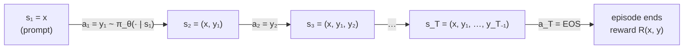

# 11.2 Language Generation as RL

Chapter 10 developed reinforcement learning with small examples: a gridworld, a bandit, a cart balancing a pole. None of them had anything to do with language. This section makes the connection. It casts text generation as a Markov decision process, shows that a language model is already a stochastic policy, describes the unusual shape of the reward, compares two ways of viewing the problem, and explains why RLHF uses policy gradient methods rather than the value-based methods of Section 10.4. It closes with the chapter's first code lab: fine-tuning a small language model with REINFORCE.

## The token-level MDP

Section 10.2 defined an MDP by its states, actions, rewards, and transition probabilities. For a language model answering a prompt, each piece has a natural counterpart.

- **State.** The state at step $t$ is everything the model conditions on: the prompt $x$ followed by the response tokens generated so far,

```math
s_t = (x, y_1, \dots, y_{t-1}) = (x, y_{\lt t}).
```

  The initial state is just the prompt, $s_1 = x$, drawn from a distribution of prompts $`\mathcal{D}`$.
- **Action.** The action is the next token, $a_t = y_t$, chosen from the vocabulary $`\mathcal{V}`$. For a modern tokenizer (Chapter 5), $`|\mathcal{V}|`$ is tens of thousands to a few hundred thousand, so the agent chooses among that many actions at every step.
- **Transition.** The next state is the current state with the chosen token appended, $`s_{t+1} = (x, y_{\le t})`$. Unlike a robot or a game, the environment is *deterministic* and completely known: nothing random happens between choosing a token and seeing it in the context.
- **Termination.** An episode ends when the model emits the end-of-turn token (written EOS here) or reaches a maximum length. A full response $`y = (y_1, \dots, y_T)`$ is one episode, and $T$ varies from response to response.
- **Reward.** A reward arrives at the end of the episode and scores the whole response. We return to its shape below.

The Markov property holds trivially: because the state *is* the whole history, the next state depends only on the current state and action. The state space is astronomically large, since every possible prefix is a distinct state, but that is no obstacle to a transformer, which reads the whole prefix anyway.



*Figure 11.2.1. Generating a response as an episode of the token-level MDP. Each action appends one token; the reward arrives only after the last one.*

## The language model as a policy

A policy maps a state to a probability distribution over actions (Section 10.2). A language model does exactly that. Given the prefix $`(x, y_{\lt t})`$, the transformer produces a vector of logits $`\mathbf{z}_t \in \mathbb{R}^{|\mathcal{V}|}`$, and the softmax turns them into a distribution over the next token:

```math
\pi_{\theta}(a \mid s_t) = \frac{\exp(z_{t,a} / \tau)}{\sum_{a' \in \mathcal{V}} \exp(z_{t,a'} / \tau)},
```

where $\tau$ is the sampling temperature (Section 13.1). Sampling a response token by token is running this policy in the MDP. The probability of a whole response factorizes by the chain rule, so its log-probability is a sum over tokens:

```math
\log \pi_{\theta}(y \mid x) = \sum_{t=1}^{T} \log \pi_{\theta}(y_t \mid x, y_{\lt t}).
```

These per-token log-probabilities are the basic quantity of every algorithm in this chapter and the next. They come out of a single forward pass over the concatenated prompt and response, exactly as in SFT training: the logits at position $t-1$ predict token $t$, and gathering the log-softmax at the sampled token gives $`\log \pi_{\theta}(y_t \mid x, y_{\lt t})`$ ([Code 11.2.1](#code-1121-sampling-responses-and-their-log-probabilities)).

Three consequences of treating the model as a policy matter in practice.

1. **It starts out good.** Classic RL often begins with a random policy. Here the initial policy is the SFT model of Chapter 9, which already produces fluent, relevant responses. RL does not need to discover language; it needs to shift probability among responses the model can already produce. This is why RL works with modest amounts of feedback, and also why staying close to the starting policy is so important (Section 6).
2. **Sampling must match the policy.** During RL, responses are sampled from $`\pi_{\theta}`$ itself, typically at temperature 1 with no top-$k$ or top-$p$ truncation (InstructGPT, for example, used temperature 1 for rollouts). If generation uses a different distribution, such as top-$p$ sampling, then the sampled tokens do not come from the distribution whose log-probabilities the algorithm uses, and the gradient estimates are biased.
3. **Determinism matters.** Dropout makes a forward pass random, so the same response gets a different log-probability each time it is scored. RLHF implementations therefore turn dropout off in every model (Huang et al. 2024), so that log-probabilities computed during generation and during training agree.

## Sparse, sequence-level reward

In most RL problems in Chapter 10, rewards arrive along the way. In RLHF, the natural reward is a single number for the whole response,

```math
r_t = \begin{cases} R(x, y) & t = T \\ 0 & t \lt T, \end{cases}
```

where $`R(x, y)`$ can come from several sources:

- a **reward model** $`r_{\phi}(x, y)`$ trained on human preferences, the classic RLHF case and the subject of Section 5;
- a **human** directly, which is too slow and expensive to use for every sample during training, but is the gold standard for evaluation;
- a **checker** or program, such as one that compares a final numerical answer with the known solution or runs unit tests on generated code. These *verifiable rewards* are the basis of the reasoning-model methods in Chapter 14 (Section 5).

A reward that arrives only at the end is called *sparse*. With no discounting ($\gamma = 1$, the standard choice for text, used for example by Ziegler et al. 2019 and Ouyang et al. 2022), the return from every step is the same number, $G_t = R(x, y)$ for all $t$. Section 7 will add small per-token rewards from a KL penalty, but the signal that says whether the response was *good* still comes only at the end.

## Two views: a bandit or an MDP

There are two equally correct ways to describe this setting, and papers use both.

**The contextual bandit view.** Treat the entire response $y$ as a single action, taken in a context $x$, with an immediate reward $`R(x, y)`$. This is a one-step problem: a contextual bandit (Section 10.3 covered the context-free bandit). InstructGPT described its RL environment exactly this way: a "bandit environment which presents a random customer prompt and expects a response to the prompt" (Ouyang et al. 2022). The action space is enormous, every possible sequence of up to $T$ tokens, but the policy never enumerates it; it samples from it token by token. The policy gradient for this view is REINFORCE on whole sequences,

```math
\nabla_{\theta}\, \mathbb{E}_{y \sim \pi_{\theta}(\cdot \mid x)}\big[R(x, y)\big] = \mathbb{E}_{y \sim \pi_{\theta}(\cdot \mid x)}\Big[ \big(R(x, y) - b(x)\big)\, \nabla_{\theta} \log \pi_{\theta}(y \mid x) \Big],
```

with a baseline $b(x)$ that may depend on the prompt but not on the response (Section 10.6). Substituting the sum of token log-probabilities shows that every token in the response gets the same weight $R - b$.

**The token-level MDP view.** Treat each token as an action, as in the previous section. Stiennon et al. (2020) described their setup this way: "each time step is a BPE token." This view lets us define a value function over partial responses, $`V(s_t)`$, the expected final reward given the prompt and the first $t-1$ tokens, and per-token advantages $`A_t = Q(s_t, a_t) - V(s_t)`$. It also lets rewards arrive at individual tokens, which the KL penalty of Section 7 exploits.

With $\gamma = 1$ and only a terminal reward, the two views give the same expected gradient; the policy gradient theorem of Section 10.6 applied to the MDP gives back the bandit formula. They differ in how the gradient is *estimated*: which baseline is subtracted and therefore how the variance behaves. The bandit view is the natural home of the critic-free methods of Chapter 14, which compare several responses to the same prompt. The MDP view is the natural home of PPO with a learned value model, the classic RLHF algorithm of Section 7.

A third granularity appears in multi-turn dialogue. Bai et al. (2022) treated each assistant *response* as a time step and a whole conversation as the trajectory. For single-turn RLHF, which covers most of this chapter, the response is the episode.

## Credit assignment

Suppose a model answers a math question with ten correct steps, one arithmetic slip, and a wrong final answer, and receives a low reward. Which tokens deserve the blame? This is the *credit assignment* problem, and a sparse sequence-level reward makes it hard.

REINFORCE with a prompt-level baseline gives the same answer for every token: all of them had advantage $R - b(x)$, so all of them become less likely, the ten good steps along with the slip. Over many samples this averages out: good steps appear in both high- and low-reward responses, while the slip appears mostly in low-reward ones, so the slip is pushed down more consistently. But averaging out takes many samples, which is another way of saying the gradient estimate has high variance.

A learned value function can do better. If $`V(s_t)`$ estimates the probability that the response will end up correct given the prefix so far, then the TD error $`\delta_t = r_t + V(s_{t+1}) - V(s_t)`$ is near zero for tokens that do not change the prospects and strongly negative at the token where things went wrong. Generalized advantage estimation (Section 10.7) combines these TD errors into per-token advantages. In principle, then, the critic localizes credit. In practice, learning an accurate value function for partial text is itself hard, and Chapter 14 discusses evidence that for long reasoning chains a critic-free approach with many samples per prompt can work as well or better. Another route to finer credit is to make the reward itself finer: process reward models, which score each step of a solution, are covered in Chapter 14 (Section 5).

## Why policy gradients

Section 10.5 ended by observing that value-based methods are awkward for language models, and Section 10.6 introduced policy gradient methods. Several reasons, taken together, explain why RLHF is built on policy gradients.

- **The action space is the vocabulary at every step.** Q-learning needs a target $`\max_{a'} Q(s', a')`$ and a greedy policy $`\arg\max_a Q(s, a)`$ over $`|\mathcal{V}|`$ actions for every state. Computing a max over logits is cheap, but *learning* accurate Q-values for tens of thousands of actions per state from bootstrapped targets, with function approximation and off-policy data, is exactly the unstable "deadly triad" of Section 10.5. A policy gradient needs values only for the tokens actually sampled.
- **We already have an excellent policy.** The SFT model is a policy with good behavior. Policy gradient methods fine-tune it directly, starting from where it is. A pretrained model's logits are not Q-values, so a value-based method would have to learn its Q-function almost from scratch, or reinterpret the logits in a way they were never trained for.
- **We want a stochastic policy.** A chat model should be able to give varied answers, and exploration during training requires sampling. Policy gradients optimize a stochastic policy naturally, and the KL penalty of Section 6 explicitly rewards staying close to a stochastic reference.
- **The objective is a regularized expectation.** The RLHF objective (Section 6) is an expected reward under the policy minus a divergence from a reference policy, a form that policy gradient methods handle directly.

Value-based and offline methods for language generation do exist; for example, implicit language Q-learning learns token-level values from a fixed dataset (Snell et al. 2023). But the methods that trained the models in Section 8 are policy gradient methods: REINFORCE-style updates, and above all PPO.

## Lab: a language model as a policy

The first code lab makes these ideas concrete with a small model and a reward that can be checked by code, so that no reward model is needed yet ([Code 11.2.2](#code-1122-reinforce-with-and-without-a-kl-penalty)). The policy is DistilGPT-2, an 82-million-parameter distilled version of GPT-2. The prompts are short sentence openings such as "Today I feel," and the reward is 1 if the sampled 24-token continuation contains the word " happy" and 0 otherwise. At the start, almost no samples earn a reward.

Each training step samples 16 responses, computes their rewards, and applies REINFORCE with the batch-mean reward as the baseline. A copy of the initial model is kept frozen as a *reference*, and the reward is optionally penalized by $\beta$ times an estimate of the KL divergence between the policy and the reference:

```math
\tilde{R}(x, y) = R(x, y) - \beta \sum_{t=1}^{T} \log \frac{\pi_{\theta}(y_t \mid x, y_{\lt t})}{\pi_{\mathrm{ref}}(y_t \mid x, y_{\lt t})}.
```

The sum of log-ratios of the sampled tokens is an unbiased single-sample estimate of the sequence-level KL divergence $`D_{\mathrm{KL}}[\pi_{\theta}(\cdot \mid x) \,\|\, \pi_{\mathrm{ref}}(\cdot \mid x)]`$, a fact Section 6 derives.

In our CPU run (60 steps of 16 samples each, DistilGPT-2, seed 0), the two settings behaved very differently. Without a penalty ($`\beta = 0`$), the reward rose from 0.00 at the first step to 0.94 at the last: almost every sample now contained " happy". But the KL estimate climbed to about 11 nats: to earn the reward on nearly every sample, the policy had moved far from the distribution of the original model, and nothing in the objective asked it to keep writing the way the original model did. With $`\beta = 0.1`$, the policy moved much more slowly. The reward stayed near zero for the first 20 steps, reached 0.69 at step 50, and fell back to 0.44 at the last step, while the KL estimate stayed between about 0.5 and 4.5 nats, and the samples remained varied, ordinary-looking continuations. These are single runs, and batch-level numbers from 16 samples are noisy, so the exact values will change with the seed and library versions. The qualitative pattern is robust, though: the penalty trades reward for staying close to the reference model, and the size of $`\beta`$ sets the exchange rate.

This small experiment previews the rest of the chapter. The reward was a crude stand-in for what we want, the policy found the cheapest way to earn it, and the KL penalty was what kept it tied to the original model. Chapter 14 (Lab 1) extends this setup to deliberately flawed rewards to study reward hacking. To replace the hand-written reward with human judgment, we need a pipeline that collects preferences, turns them into a reward model, and optimizes against it. What are its stages, and what does each one produce?

## Code for this section

The listings below collect the code for this section in the order in which the text refers to them. Later listings reuse definitions from earlier ones. They need `torch` and `transformers`, and run on a CPU.

### Code 11.2.1: Sampling responses and their log-probabilities

`generate` samples one response per prompt from the policy at temperature 1 with no truncation, and returns a mask that is 1 on response tokens up to and including the first EOS.

Notebook: [11.2.1-sampling-responses-and-their-log-probabilities.ipynb](../../code/11-rlhf/11.2.1-sampling-responses-and-their-log-probabilities.ipynb)

### Code 11.2.2: REINFORCE with and without a KL penalty

The first suggested code lab. Run it once with `beta=0.0` and once with `beta=0.1`, and compare the printed reward, the estimated KL divergence from the reference model, and the samples. For a sentiment reward instead of a target word, replace the reward line with the positive-class probability of a small sentiment classifier. Each run takes a few minutes on a laptop CPU.

Notebook: [11.2.2-reinforce-with-and-without-a-kl-penalty.ipynb](../../code/11-rlhf/11.2.2-reinforce-with-and-without-a-kl-penalty.ipynb)

## Key takeaways

- Text generation is an MDP: the state is the prompt plus the tokens so far, the action is the next token, transitions are deterministic, and one response is one episode.
- A language model's softmax is a stochastic policy; the log-probability of a response is the sum of its token log-probabilities, computed in one forward pass.
- The reward is sparse and sequence-level: one score for the whole response, from a reward model, a human, or a checker.
- The problem can be viewed as a contextual bandit (the response is one action) or a token-level MDP; they share the same expected gradient but suggest different baselines and estimators.
- Credit assignment is hard with a single terminal reward; a learned value function or finer-grained rewards can localize it.
- RLHF uses policy gradients because the action space is the vocabulary at every step, the SFT model is already a good stochastic policy, and the objective is a regularized expectation.

## Further reading

Huang, Shengyi, et al. "The N+ Implementation Details of RLHF with PPO: A Case Study on TL;DR Summarization." In *Conference on Language Modeling*, 2024. https://arxiv.org/abs/2403.17031.

Ouyang, Long, et al. "Training Language Models to Follow Instructions with Human Feedback." In *Advances in Neural Information Processing Systems 35*, 2022. https://arxiv.org/abs/2203.02155.

Snell, Charlie, et al. "Offline RL for Natural Language Generation with Implicit Language Q Learning." In *International Conference on Learning Representations*, 2023. https://arxiv.org/abs/2206.11871.

Stiennon, Nisan, et al. "Learning to Summarize from Human Feedback." In *Advances in Neural Information Processing Systems 33*, 2020. https://arxiv.org/abs/2009.01325.

Williams, Ronald J. "Simple Statistical Gradient-Following Algorithms for Connectionist Reinforcement Learning." *Machine Learning* 8 (1992): 229–256. https://doi.org/10.1007/BF00992696.

Ziegler, Daniel M., et al. "Fine-Tuning Language Models from Human Preferences." arXiv preprint arXiv:1909.08593, 2019. https://arxiv.org/abs/1909.08593.
