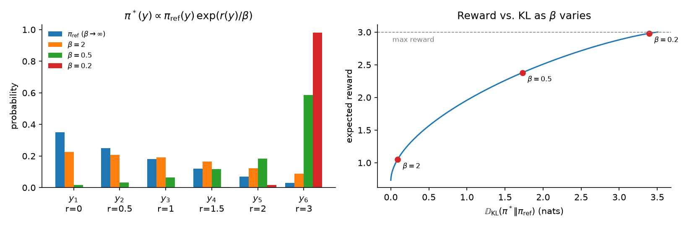

# 11.6 The RLHF Objective

We now have a policy (the SFT model) and a reward model that scores its responses. The obvious next step is to change the policy so that its responses score as highly as possible. This section explains why doing only that goes wrong, and introduces the objective that RLHF actually optimizes: expected reward minus a penalty for drifting away from the SFT model. It derives the per-token form of the penalty used in practice, shows what the optimal policy of this objective looks like, and explains how the penalty coefficient $\beta$ is chosen, including the adaptive controller that tunes it automatically.

## Why not just maximize reward?

Suppose we simply maximize expected reward,

```math
\max_{\theta}\ \mathbb{E}_{x \sim \mathcal{D},\, y \sim \pi_{\theta}(\cdot \mid x)}\left[ r_{\phi}(x, y) \right].
```

For each prompt, the best possible policy puts all its probability on whichever single response has the highest reward. That has two problems.

First, the reward model is only an approximation of human judgment, trained on responses that look like the SFT model's (Section 5). Its scores are trustworthy near that distribution and increasingly unreliable far from it. A policy that searches the whole space of responses for the highest score will find the places where the reward model is most wrong: odd phrasings, extreme lengths, repeated patterns that happen to score well. Stiennon et al. (2020) showed this directly: as optimization against a reward model continued, human-judged quality first rose and then fell, until the reward model became anti-correlated with human preferences. This failure, *reward hacking* or *over-optimization*, is the central hazard of RLHF, and Chapter 14 studies it in depth.

Second, even if the reward model were perfect, collapsing each prompt to one deterministic response throws away the diversity of the model and the broad knowledge learned in pretraining that no reward model was trained to value.

The Section 2 lab showed both effects in miniature: without a penalty, the policy drifted far from the original model in pursuit of a crude reward.

## The KL-regularized objective

The RLHF objective adds a penalty on the Kullback-Leibler divergence between the policy and a fixed **reference model** $`\pi_{\mathrm{ref}}`$, usually the SFT model:

```math
\max_{\theta}\ \mathbb{E}_{x \sim \mathcal{D},\, y \sim \pi_{\theta}(\cdot \mid x)}\left[ r_{\phi}(x, y) \right] - \beta\, \mathbb{E}_{x \sim \mathcal{D}}\Big[ D_{\mathrm{KL}}\left[ \pi_{\theta}(\cdot \mid x) \,\|\, \pi_{\mathrm{ref}}(\cdot \mid x) \right] \Big].
```

Each term has a job.

- $`x \sim \mathcal{D}`$: prompts come from the RL prompt set (Section 3).
- $`y \sim \pi_{\theta}(\cdot \mid x)`$: responses are sampled from the policy being trained, so the objective is *on-policy* and must be estimated with fresh samples.
- $`r_{\phi}(x, y)`$: the frozen reward model's score.
- $`D_{\mathrm{KL}}[\pi_{\theta}(\cdot \mid x) \,\|\, \pi_{\mathrm{ref}}(\cdot \mid x)]`$: how far the policy's distribution over whole responses has moved from the reference's.
- $\beta \gt 0$: the exchange rate between reward and divergence.

Recall the definition of the KL divergence, which measures how much one distribution differs from another; it equals the cross-entropy of Section 2.4 minus the entropy:

```math
D_{\mathrm{KL}}\left[ \pi_{\theta}(\cdot \mid x) \,\|\, \pi_{\mathrm{ref}}(\cdot \mid x) \right] = \mathbb{E}_{y \sim \pi_{\theta}(\cdot \mid x)}\left[ \log \frac{\pi_{\theta}(y \mid x)}{\pi_{\mathrm{ref}}(y \mid x)} \right].
```

Because the KL divergence is itself an expectation over $y \sim \pi_{\theta}$, the two terms merge into one expectation of a penalized reward:

```math
J(\theta) = \mathbb{E}_{x \sim \mathcal{D},\, y \sim \pi_{\theta}(\cdot \mid x)}\left[ r_{\phi}(x, y) - \beta \log \frac{\pi_{\theta}(y \mid x)}{\pi_{\mathrm{ref}}(y \mid x)} \right].
```

This is exactly the form written by Ziegler et al. (2019) and Stiennon et al. (2020): the RL algorithm maximizes an ordinary expected reward, where the reward for a response is the reward model's score minus $\beta$ times its log-probability ratio. Any policy gradient method from Chapter 10 can optimize it. The Section 2 lab did so with REINFORCE.

### The per-token form

The log-probability of a response is a sum over its tokens (Section 2), so the log-ratio is too:

```math
\log \frac{\pi_{\theta}(y \mid x)}{\pi_{\mathrm{ref}}(y \mid x)} = \sum_{t=1}^{T} \log \frac{\pi_{\theta}(y_t \mid x, y_{\lt t})}{\pi_{\mathrm{ref}}(y_t \mid x, y_{\lt t})}.
```

Taking the expectation gives the chain rule for KL divergence: the sequence-level KL equals the expected sum of the per-token KL divergences between the two next-token distributions, at the states the policy visits,

```math
D_{\mathrm{KL}}\left[ \pi_{\theta}(\cdot \mid x) \,\|\, \pi_{\mathrm{ref}}(\cdot \mid x) \right] = \mathbb{E}_{y \sim \pi_{\theta}}\left[ \sum_{t=1}^{T} D_{\mathrm{KL}}\left[ \pi_{\theta}(\cdot \mid s_t) \,\|\, \pi_{\mathrm{ref}}(\cdot \mid s_t) \right] \right], \qquad s_t = (x, y_{\lt t}).
```

This decomposition has two practical consequences. It makes the penalty cheap: both log-probabilities come from one forward pass of each model over the sampled response. And it lets the penalty be charged token by token, as a small negative reward at each step, which is how PPO for language models implements it (Section 7).

### Estimating the KL divergence

In code, the KL term is estimated from samples. For a sampled response, the sum of per-token log-ratios,

```math
\hat{k}_1 = \sum_{t=1}^{T} \log \frac{\pi_{\theta}(y_t \mid x, y_{\lt t})}{\pi_{\mathrm{ref}}(y_t \mid x, y_{\lt t})},
```

is an unbiased estimate of the sequence-level KL divergence. Individual terms can be negative, since a sampled token can be more likely under the reference than under the policy, although the expectation is always non-negative. This is the estimator used in the classic RLHF reward.

Other estimators trade bias for variance. Writing $`\rho_t = \pi_{\mathrm{ref}}(y_t \mid s_t) / \pi_{\theta}(y_t \mid s_t)`$ for the inverse ratio at a sampled token, the estimator $`(\rho_t - 1) - \log \rho_t`$ is also unbiased for the per-token KL, is never negative, and has lower variance when the policy is close to the reference (Schulman 2020). It is popular for *monitoring* KL and appears in some of the critic-free methods of Chapter 14. When the full next-token distributions are available, the per-token KL can also be computed exactly by summing over the vocabulary, at the cost of more memory. [Code 11.6.2](#code-1162-kl-estimators-and-an-adaptive-kl-controller) compares the estimators.

## Why a KL penalty to the reference model?

The penalty serves several purposes at once.

**It keeps outputs fluent.** The reference model assigns high probability to fluent, coherent text. Responses that drift into strange token sequences have low reference probability and pay a large penalty. Without it, a policy can degenerate into repetitive or ungrammatical text that the reward model happens to score well.

**It keeps the policy where the reward model is trustworthy.** The reward model was trained on responses like the SFT model's. Stiennon et al. (2020) put it this way: the KL term "ensures the policy doesn't learn to produce outputs that are too different from those that the reward model has seen during training." Touvron et al. (2023) likewise found the constraint useful "for training stability, and to reduce reward hacking whereby we would achieve high scores from the reward model but low scores from human evaluation."

**It preserves what pretraining and SFT learned.** Knowledge, skills, and formatting that the reward model does not measure, and therefore does not reward, are protected because changing them costs KL. This complements the pretraining-gradient mix of PPO-ptx (Section 3), which targets the same regressions more directly.

**It acts as an entropy bonus.** Expanding the log-ratio,

```math
\mathbb{E}_{y \sim \pi_{\theta}}\left[ -\beta \log \frac{\pi_{\theta}(y \mid x)}{\pi_{\mathrm{ref}}(y \mid x)} \right] = \beta\, \mathcal{H}\left[\pi_{\theta}(\cdot \mid x)\right] + \beta\, \mathbb{E}_{y \sim \pi_{\theta}}\left[ \log \pi_{\mathrm{ref}}(y \mid x) \right],
```

where $`\mathcal{H}`$ is the entropy of the policy's response distribution. The first term rewards the policy for staying random, which encourages exploration and discourages collapse to a single response; Stiennon et al. (2020) noted this role explicitly. The second term rewards responses that the reference finds likely.

### The direction of the divergence

The penalty uses the *reverse* KL divergence, $`D_{\mathrm{KL}}[\pi_{\theta} \,\|\, \pi_{\mathrm{ref}}]`$, with the expectation under the policy. This direction is forced by practicality, since we can sample from the policy, but it also has a useful character. It is very expensive for the policy to put probability where the reference puts almost none, because $`\log(\pi_{\theta} / \pi_{\mathrm{ref}})`$ blows up there. It is cheap for the policy to *drop* responses that the reference considers likely. So the policy can concentrate on a subset of the reference's good behaviors, but it cannot invent behaviors the reference would never produce. That is exactly the "choose among what the model can already do" role that Section 1 described for RL.

## The optimal policy

For a fixed prompt, the KL-regularized objective has a closed-form maximizer. Treat the policy as an arbitrary distribution $`\pi(y)`$ over complete responses, dropping $x$ from the notation. Define

```math
\pi^*(y) = \frac{1}{Z}\, \pi_{\mathrm{ref}}(y) \exp\!\left( \frac{r(y)}{\beta} \right), \qquad Z = \sum_{y} \pi_{\mathrm{ref}}(y) \exp\!\left( \frac{r(y)}{\beta} \right).
```

Then for any $\pi$,

```math
\mathbb{E}_{y \sim \pi}\left[ r(y) - \beta \log \frac{\pi(y)}{\pi_{\mathrm{ref}}(y)} \right] = -\beta\, \mathbb{E}_{y \sim \pi}\left[ \log \frac{\pi(y)}{\pi_{\mathrm{ref}}(y) \exp(r(y)/\beta)} \right] = \beta \log Z - \beta\, D_{\mathrm{KL}}\left[ \pi \,\|\, \pi^* \right].
```

The first term does not depend on $\pi$, and the KL divergence is zero only when $\pi = \pi^*$. So $`\pi^*`$ is the unique optimum: the reference distribution *reweighted* by the exponentiated reward. The coefficient $\beta$ acts as a temperature. As $`\beta \to \infty`$, $`\pi^* \to \pi_{\mathrm{ref}}`$; as $`\beta \to 0`$, $`\pi^*`$ concentrates on the highest-reward response. In between, responses the reference already likes and the reward model scores well get the most probability. Korbak et al. (2022) interpret this as Bayesian inference: $`\pi_{\mathrm{ref}}`$ is a prior, and the exponentiated reward is a likelihood of "being preferred."

We cannot use this formula directly, because $Z$ sums over every possible response, an astronomically large set. RL with PPO is one way to approximate $`\pi^*`$ with a parameterized policy. Chapter 14 (Section 3) shows that the formula can be inverted to express the reward in terms of the optimal policy, which leads to DPO.

Figure 11.6.1 shows the optimal policy for a toy problem with six responses whose reference probabilities and rewards are made up for illustration ([Code 11.6.1](#code-1161-the-kl-regularized-optimum-on-a-toy-problem)). With $\beta = 2$, the optimal policy is a gentle tilt of the reference: its expected reward rises from 0.71 to 1.05 at a KL cost of only 0.09 nats. With $\beta = 0.5$, it puts most of its mass on the two highest-reward responses, reaching an expected reward of 2.38 at a KL of 1.73 nats. With $\beta = 0.2$, it is almost deterministic, with 98% of its probability on the single best response, reaching 2.98 out of a possible 3 at a KL of 3.39 nats. The right panel traces the whole trade-off: each value of $\beta$ picks one point on a curve of expected reward against KL, and the curve bends over as reward approaches its maximum, so each further unit of reward costs more KL.



*Figure 11.6.1. Left: the reference distribution over six responses and the optimal policy $`\pi^* \propto \pi_{\mathrm{ref}} \exp(r/\beta)`$ for three values of $\beta$. Right: expected reward against KL divergence from the reference as $\beta$ varies. The rewards and reference probabilities are illustrative.*

With a real reward model, the true curve has a crucial difference. The x-axis is the same, but the y-axis we care about is *human-judged* quality, not the reward model's score. Up to some KL, the two rise together. Beyond it, the reward model's score keeps rising while true quality flattens and then falls (Stiennon et al. 2020; Gao et al. 2023). The KL penalty exists to stop the policy before that point.

## Choosing $\beta$

The coefficient $\beta$ controls how far the policy moves from the reference. It is the most important hyperparameter of RLHF.

- **Too large**, and the policy barely changes; the KL penalty overwhelms the reward signal, and the RLHF model is nearly the SFT model.
- **Too small**, and the policy drifts far from the reference, reward climbs, and the model starts exploiting the reward model: longer responses, repeated patterns, confident-sounding but empty text.

Published values span more than an order of magnitude:

| System | $\beta$ | Notes |
|---|---|---|
| InstructGPT (Ouyang et al. 2022) | 0.02 | Fixed; plus pretraining mix |
| Llama 2-Chat (Touvron et al. 2023) | 0.01 (7B, 13B); 0.005 (34B, 70B) | Rewards whitened before the penalty |
| Anthropic HH assistant (Bai et al. 2022) | 0.001 | Described as likely having "a very minor impact" and possibly unnecessary |
| Ziegler et al. (2019) | Adaptive | Controller targeting a fixed KL |

These numbers are not directly comparable, because the KL penalty is weighed against the reward, and the reward's scale depends on the reward model and any normalization. A value of $\beta$ that is gentle with a reward model whose scores span 0.1 is strong with one whose scores span 10. This is why Llama 2 whitened its reward scores "in order to increase stability and balance properly with the KL penalty term" (Touvron et al. 2023), and why it is common to report results against the KL actually reached rather than against $\beta$.

### Reward as a function of KL

Because $\beta$ values are hard to compare, the KL divergence reached is a more useful measure of how hard a policy has been optimized. Bai et al. (2022) found a roughly linear relation between RL reward and the square root of the KL divergence from the initial policy during the early phase of training. Gao et al. (2023) used the square root of KL as the x-axis for their scaling laws of reward model over-optimization, discussed in Chapter 14. In practice, plotting reward and human-judged quality against KL, rather than against training steps, is the clearest way to compare runs.

### Adaptive KL control

Two runs with the same $\beta$ but different random seeds can end up at quite different KL divergences, which makes them hard to compare. Ziegler et al. (2019) therefore tuned $\beta$ automatically to reach a *target* KL, using a proportional controller in log space. After each batch with measured KL $`\mathrm{KL}_t`$,

```math
e_t = \mathrm{clip}\left( \frac{\mathrm{KL}_t - \mathrm{KL}_{\mathrm{target}}}{\mathrm{KL}_{\mathrm{target}}},\ -0.2,\ 0.2 \right), \qquad \beta_{t+1} = \beta_t \left( 1 + K_{\beta}\, e_t \right),
```

with $`K_{\beta} = 0.1`$. If the policy has drifted more than the target, $\beta$ grows and pulls it back; if less, $\beta$ shrinks and lets reward pull harder. The clip keeps each adjustment small, at most 2% per batch. The practitioner then chooses a KL budget, say 6 nats, instead of a coefficient.

Do not confuse this with the adaptive-KL variant of PPO from Section 10.7. That variant penalizes the KL divergence between *successive* policies, $`\pi_{\theta}`$ and $`\pi_{\theta_{\mathrm{old}}}`$, as an alternative to clipping; it is a trust region that keeps each *update* small. The RLHF penalty measures the KL divergence to a *fixed* reference model and keeps the *cumulative* change small. PPO for language models uses both kinds of constraint at once: the clipped ratio against the previous policy, and the KL penalty against the reference (Section 7).

## Lab: exploring the KL coefficient

The fourth suggested code lab repeats the PPO run of Section 7 with several values of $\beta$ and compares how far the model drifts, how high the reward goes, and how the outputs read. Before running it, it is worth predicting the result with the toy model of Code 11.6.1, which computes the exact optimum for any $\beta$. Expect three regimes: large $\beta$ gives little change in reward or text; intermediate $\beta$ raises reward while keeping outputs fluent; small $\beta$ gives the highest reward and the largest KL, with outputs that increasingly read as though written *for* the reward model rather than for a person. Also try the adaptive controller of Code 11.6.2 with a few KL targets, and compare runs at equal KL.

We now know what to optimize: reward minus a KL penalty, charged per token. How does PPO, the algorithm of Section 10.7, optimize it for a language model, and what has to change?

## Code for this section

### Code 11.6.1: The KL-regularized optimum on a toy problem

Computes $`\pi^* \propto \pi_{\mathrm{ref}} \exp(r / \beta)`$ for six responses with made-up reference probabilities and rewards, and prints the expected reward and KL divergence for three values of $\beta$. The full plotting script is [`code/11-rlhf/make_figures.py`](../../code/11-rlhf/make_figures.py).

```python
import numpy as np

pi_ref = np.array([0.35, 0.25, 0.18, 0.12, 0.07, 0.03])   # toy reference probabilities
r = np.array([0.0, 0.5, 1.0, 1.5, 2.0, 3.0])              # toy rewards

def optimal_policy(beta):
    w = pi_ref * np.exp(r / beta)
    return w / w.sum()

def kl(p, q):
    return float(np.sum(p * np.log(p / q)))

print(f"reference: E[r]={pi_ref @ r:.2f}")
for beta in [2.0, 0.5, 0.2]:
    p = optimal_policy(beta)
    objective = p @ r - beta * kl(p, pi_ref)
    beta_log_z = beta * np.log(np.sum(pi_ref * np.exp(r / beta)))
    print(f"beta={beta}: E[r]={p @ r:.2f}, KL={kl(p, pi_ref):.2f}, "
          f"objective={objective:.3f} = beta*log Z={beta_log_z:.3f}, pi*={np.round(p, 3)}")
```

The printed values match the text:

```text
reference: E[r]=0.71
beta=2.0: E[r]=1.05, KL=0.09, objective=0.872 = beta*log Z=0.872, pi*=[0.226 0.208 0.192 0.164 0.123 0.087]
beta=0.5: E[r]=2.38, KL=1.73, objective=1.515 = beta*log Z=1.515, pi*=[0.017 0.033 0.064 0.116 0.185 0.585]
beta=0.2: E[r]=2.98, KL=3.39, objective=2.302 = beta*log Z=2.302, pi*=[0.    0.    0.    0.002 0.015 0.982]
```

### Code 11.6.2: KL estimators and an adaptive KL controller

The first part compares two sample-based estimators of the per-token KL divergence with the exact value, for a random next-token distribution over a 50-token vocabulary and a nearby reference. Both are unbiased. On this example the log-ratio estimator is negative on about half the samples and has a standard deviation about six times larger than the second estimator, which is never negative. (When the two distributions are far apart, the advantage of the second estimator shrinks and can reverse.) The second part implements the controller of Ziegler et al. (2019).

```python
import torch

torch.manual_seed(0)
logits_pi = torch.randn(50)
logits_ref = logits_pi + 0.3 * torch.randn(50)                # a nearby reference, as in RLHF
p, q = logits_pi.softmax(-1), logits_ref.softmax(-1)
exact = (p * (p.log() - q.log())).sum()

y = torch.multinomial(p, 100_000, replacement=True)          # tokens sampled from the policy
log_ratio = p.log()[y] - q.log()[y]                           # log pi(y) / pi_ref(y)
k1 = log_ratio                                                # unbiased, can be negative
k3 = (torch.exp(-log_ratio) - 1) + log_ratio                  # (rho - 1) - log rho, rho = pi_ref / pi
print(f"exact {exact:.4f} | k1 mean {k1.mean():.4f} std {k1.std():.3f} "
      f"| k3 mean {k3.mean():.4f} std {k3.std():.3f} | k1 < 0 on {(k1 < 0).float().mean():.0%} of samples")

class AdaptiveKLController:
    """Log-space proportional controller that steers the observed KL toward a target."""
    def __init__(self, init_beta=0.1, target=6.0, k_beta=0.1):
        self.beta, self.target, self.k_beta = init_beta, target, k_beta

    def update(self, observed_kl):
        error = max(-0.2, min(0.2, (observed_kl - self.target) / self.target))
        self.beta *= 1 + self.k_beta * error
        return self.beta

ctl = AdaptiveKLController(init_beta=0.1, target=6.0)
for kl_t in [2.0, 4.0, 8.0, 12.0, 6.0]:
    print(f"observed KL {kl_t:5.1f} -> beta {ctl.update(kl_t):.4f}")
```

## Key takeaways

- Maximizing reward alone drives the policy toward the reward model's errors and collapses its diversity.
- RLHF maximizes $`\mathbb{E}[r_{\phi}(x, y)] - \beta\, D_{\mathrm{KL}}[\pi_{\theta} \,\|\, \pi_{\mathrm{ref}}]`$, equivalently the expected penalized reward $`r_{\phi} - \beta \log(\pi_{\theta} / \pi_{\mathrm{ref}})`$.
- The sequence-level KL is a sum of per-token terms, so the penalty is cheap to compute and can be charged token by token; the sampled log-ratio is an unbiased estimate.
- The penalty keeps text fluent, keeps the policy where the reward model is reliable, preserves pretrained knowledge, and acts as an entropy bonus; the reverse direction lets the policy drop behaviors but not invent new ones.
- The optimal policy is $`\pi^* \propto \pi_{\mathrm{ref}} \exp(r / \beta)`$: the reference reweighted by exponentiated reward, with $\beta$ as a temperature.
- $\beta$ trades reward against drift; its value depends on the reward scale, so compare runs by the KL reached, or use adaptive control toward a KL target. This penalty to a fixed reference is different from PPO's trust region between successive policies.

## Further reading

Bai, Yuntao, et al. "Training a Helpful and Harmless Assistant with Reinforcement Learning from Human Feedback." arXiv preprint arXiv:2204.05862, 2022. https://arxiv.org/abs/2204.05862.

Gao, Leo, et al. "Scaling Laws for Reward Model Overoptimization." In *Proceedings of the 40th International Conference on Machine Learning*, 2023. https://arxiv.org/abs/2210.10760.

Korbak, Tomasz, et al. "RL with KL Penalties Is Better Viewed as Bayesian Inference." In *Findings of the Association for Computational Linguistics: EMNLP 2022*, 2022. https://arxiv.org/abs/2205.11275.

Ouyang, Long, et al. "Training Language Models to Follow Instructions with Human Feedback." In *Advances in Neural Information Processing Systems 35*, 2022. https://arxiv.org/abs/2203.02155.

Schulman, John. "Approximating KL Divergence." Blog post, March 7, 2020. http://joschu.net/blog/kl-approx.html.

Stiennon, Nisan, et al. "Learning to Summarize from Human Feedback." In *Advances in Neural Information Processing Systems 33*, 2020. https://arxiv.org/abs/2009.01325.

Touvron, Hugo, et al. "Llama 2: Open Foundation and Fine-Tuned Chat Models." arXiv preprint arXiv:2307.09288, 2023. https://arxiv.org/abs/2307.09288.

Ziegler, Daniel M., et al. "Fine-Tuning Language Models from Human Preferences." arXiv preprint arXiv:1909.08593, 2019. https://arxiv.org/abs/1909.08593.
