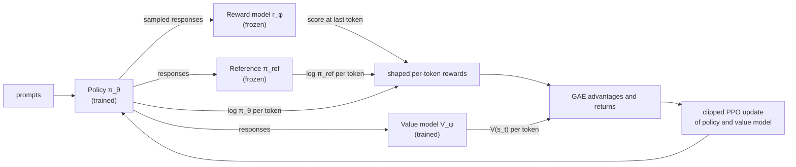

# 11.7 PPO for Language Models

Section 10.7 derived Proximal Policy Optimization and implemented it for CartPole: collect rollouts with the current policy, estimate advantages with GAE, and take several epochs of clipped updates. That algorithm is unchanged here. What changes when the policy is a language model with billions of parameters, the environment is text generation, and the reward comes from another large model? This section covers only those differences: the four models involved, how rollouts are generated, how the KL penalty of Section 6 becomes a per-token reward, how advantages and losses are computed over tokens, the practical details that make training stable, and what it all costs in memory and compute. It ends with the chapter's third code lab, a minimal PPO implementation for a small language model.

## What stays the same

As a reminder, PPO from Section 10.7 has four ingredients:

- the probability ratio between the current policy and the policy that collected the data, $`\rho_t(\theta) = \pi_{\theta}(a_t \mid s_t) / \pi_{\theta_{\mathrm{old}}}(a_t \mid s_t)`$;
- the clipped surrogate objective, $`L^{\mathrm{CLIP}}(\theta) = \mathbb{E}_t[\min(\rho_t \hat{A}_t,\ \mathrm{clip}(\rho_t, 1 - \epsilon, 1 + \epsilon) \hat{A}_t)]`$;
- advantages from generalized advantage estimation, $`\hat{A}_t = \sum_{l \ge 0} (\gamma \lambda)^l \delta_{t+l}`$ with $`\delta_t = r_t + \gamma V(s_{t+1}) - V(s_t)`$;
- a loop that collects a batch of rollouts, computes advantages once, and then runs a few epochs of minibatch updates.

In the token-level MDP of Section 2, a time step is a token: $`s_t = (x, y_{\lt t})`$ and $`a_t = y_t`$. Every quantity above is computed per response token. Everything else in this section is about how to feed this algorithm.

## Four models

PPO for language models involves four networks, two trained and two frozen.

| Model | Role | Trained? | Typical initialization | Output per response |
|---|---|---|---|---|
| Policy (actor) $`\pi_{\theta}`$ | Generates responses; the model we want | Yes | SFT model | Log-probability of each token |
| Value model (critic) $`V_{\psi}`$ | Estimates expected future reward from each prefix | Yes | Reward model | A value at each token |
| Reward model $`r_{\phi}`$ | Scores complete responses (Section 5) | No | (Trained in Stage 2) | One scalar |
| Reference model $`\pi_{\mathrm{ref}}`$ | Anchor for the KL penalty (Section 6) | No | SFT model | Log-probability of each token |



*Figure 11.7.1. The four models of PPO-based RLHF and the data flowing between them in one iteration.*

The **value model** is the one genuinely new component relative to the REINFORCE lab of Section 2. (Chapter 10 wrote its parameters as $\phi$; here $\phi$ already names the reward model $`r_{\phi}`$, so the value model gets $\psi$.) It is a transformer with a scalar head at *every* position, not just the last: $`V_{\psi}(s_t)`$ is read from the hidden state at the position that predicts $`y_t`$, and estimates the reward the response will end up with, given the prompt and the tokens so far. It is usually initialized from the reward model, which already maps text to a reward-like scalar (Ouyang et al. 2022; Huang et al. 2024). Some implementations instead put a value head on the policy's own backbone, which saves memory. Stiennon et al. (2020) used a value network with completely separate parameters, because updates to a shared value head could partially destroy the pretrained policy early in training.

## Rollouts

A rollout in RLHF is a batch of prompts and the responses the current policy generates for them. Collecting one involves:

1. **Generation.** Sample one response per prompt from $`\pi_{\theta}`$, token by token, at temperature 1 and without top-$k$ or top-$p$ truncation, up to a maximum length (Section 2).
2. **Scoring.** Run four forward passes over the prompt-plus-response sequences, all without gradients: the policy, for $`\log \pi_{\theta_{\mathrm{old}}}(y_t \mid s_t)`$, which PPO's ratio needs; the reference model, for $`\log \pi_{\mathrm{ref}}(y_t \mid s_t)`$; the value model, for $`V(s_t)`$; and the reward model, for the scalar score $`r_{\phi}(x, y)`$.

**Generation often dominates training time.** Scoring is a single parallel forward pass over each sequence, like training. Generation is autoregressive: one full forward pass of the policy per generated token, each limited by memory bandwidth rather than compute (Section 13.3). For long responses, generation can take most of each iteration's wall-clock time. Production systems therefore generate with optimized inference engines, such as vLLM with its paged KV cache (Section 13.4), and copy the latest policy weights into the engine after each update; frameworks such as OpenRLHF and HybridFlow (veRL) are organized around this split between a generation engine and a training engine (Hu et al. 2024; Sheng et al. 2025).

The reward model may use a different tokenizer from the policy, or expect a different format. The simplest robust approach, used in this section's code, is to decode the policy's tokens to text and re-tokenize for the reward model.

## Token-level reward shaping

Section 6 wrote the RLHF objective as an expected reward $`r_{\phi}(x, y) - \beta \log(\pi_{\theta}(y \mid x) / \pi_{\mathrm{ref}}(y \mid x))`$ and showed that the log-ratio is a sum over tokens. PPO for language models distributes this reward over the tokens of the response. The KL part is charged at every token, and the reward model's score is added at the last token:

```math
r_t = -\beta \log \frac{\pi_{\theta}(y_t \mid x, y_{\lt t})}{\pi_{\mathrm{ref}}(y_t \mid x, y_{\lt t})} + \mathbf{1}[t = T]\, r_{\phi}(x, y).
```

Here $T$ is the index of the last response token, the EOS token if the response ended, and $\beta$ is the KL coefficient (fixed, or adapted as in Section 6). The log-probabilities in the penalty are those recorded at rollout time, so within one iteration $`r_t`$ is a fixed number, like the rewards from a game environment in Chapter 10. With $\gamma = 1$, the sum of the $`r_t`$ over a response equals the sequence-level penalized reward of Section 6 exactly. InstructGPT describes this as adding "a per-token KL penalty from the SFT model at each token to mitigate over-optimization of the reward model" (Ouyang et al. 2022).

Why distribute the penalty rather than subtract it all at the end? The sum is the same, but the per-token form gives the value model and GAE a dense signal: a token that the policy makes much more likely than the reference would is penalized right where it occurs, rather than being blamed together with every other token in the response. The *quality* signal, however, still arrives only at the end, and the credit-assignment problem of Section 2 remains.

## Advantages and returns over tokens

With per-token rewards and per-token values in hand, GAE runs backward over each response exactly as in Section 10.7:

```math
\delta_t = r_t + \gamma V(s_{t+1}) - V(s_t), \qquad \hat{A}_t = \delta_t + \gamma \lambda \hat{A}_{t+1}, \qquad \hat{R}_t = \hat{A}_t + V(s_t),
```

with $`V(s_{T+1}) = 0`$ and $`\hat{A}_{T+1} = 0`$, since the episode ends after the last token. The returns $`\hat{R}_t`$ are the regression targets for the value model.

Two settings are standard for text. The discount is $\gamma = 1$: the response is short compared with a game episode, and there is no reason to prefer reward earlier in a response. InstructGPT reports that "no discount is applied when estimating the generalized advantage" (Ouyang et al. 2022). The GAE parameter $\lambda$ is commonly 0.95, as in Chapter 10, trading the bias of the value model against the variance of the single terminal reward.

Positions after the end of a response (padding) must be excluded everywhere: they get no reward, no value, no advantage, and no loss. In code, a response mask that is 1 on real response tokens and 0 elsewhere multiplies every per-token quantity, and averages are taken over masked tokens only ([Code 11.7.1](#code-1171-shaped-rewards-gae-and-the-ppo-losses)).

## The update

After the rollout is scored and advantages computed, PPO performs a few epochs of minibatch updates. For each minibatch, it recomputes $`\log \pi_{\theta}(y_t \mid s_t)`$ and $`V_{\psi}(s_t)`$ with gradients, and minimizes

```math
\mathcal{L}(\theta, \psi) = \underbrace{\frac{1}{N} \sum_{i,t} \max\Big( -\hat{A}_{i,t}\, \rho_{i,t}(\theta),\ -\hat{A}_{i,t}\, \mathrm{clip}\big(\rho_{i,t}(\theta), 1 - \epsilon, 1 + \epsilon\big) \Big)}_{\text{clipped policy loss}} + c_v\, \underbrace{\frac{1}{N} \sum_{i,t} \tfrac{1}{2} \big( V_{\psi}(s_{i,t}) - \hat{R}_{i,t} \big)^2}_{\text{value loss}},
```

where the sums run over the response tokens $t$ of each response $i$ in the minibatch, $N$ is the number of such tokens, and $`c_v`$ weights the value loss. This is the clipped objective of Section 10.7 written as a loss to minimize. Many implementations also clip the value prediction to stay within a range of its rollout-time value, as the reference PPO implementations do (Huang et al. 2022). An explicit entropy bonus is usually omitted, because the KL penalty already rewards entropy (Section 6).

Two different constraints are now active, and it is worth keeping them apart:

- The **clip** limits how far one *update* moves the policy from $`\pi_{\theta_{\mathrm{old}}}`$, the policy that generated this rollout. It is PPO's trust region and resets every iteration.
- The **KL penalty** limits how far the policy has moved *in total* from the fixed $`\pi_{\mathrm{ref}}`$. It is part of the reward and accumulates over training.

Putting it together, one iteration of PPO-based RLHF is:

1. Sample a batch of prompts; generate responses with $`\pi_{\theta}`$.
2. Compute $`\log \pi_{\theta_{\mathrm{old}}}`$, $`\log \pi_{\mathrm{ref}}`$, $V$, and $`r_{\phi}`$ for the batch, without gradients.
3. Form the shaped rewards $`r_t`$; compute $`\hat{A}_t`$ and $`\hat{R}_t`$ with GAE; whiten the advantages.
4. For a few epochs, for each minibatch: recompute log-probabilities and values, compute the clipped policy loss and the value loss, and take a gradient step on the policy and value model.
5. Optionally update $\beta$ with the adaptive controller; log reward, KL, response length, clip fraction, and approximate KL.

## LLM-specific practice

PPO has many small implementation details that matter (Huang et al. 2022 counted 37 of them for standard RL benchmarks). RLHF adds its own. Huang et al. (2024) reproduced the summarization results of Stiennon et al. (2020) and documented the details needed to do so; Xu et al. (2024) identified advantage normalization, large batch sizes, and an exponential moving average of the reference model as key factors for PPO's performance in their experiments. The most important are these.

**Reward normalization and whitening.** The reward model's offset is arbitrary and its scale sets the effective $\beta$ (Section 5). Ziegler et al. (2019) normalized the reward model to mean 0 and variance 1 on samples from the initial policy; Stiennon et al. (2020) and InstructGPT set the offset so that reference or demonstration responses scored 0 on average. Llama 2 went further and whitened its reward scores during PPO, after first undoing the reward model's sigmoid, "in order to increase stability and balance properly with the KL penalty term" (Touvron et al. 2023). Whitening the *advantages* within each batch, subtracting the mean and dividing by the standard deviation over all response tokens, is standard, as it is in Chapter 10 (Huang et al. 2024).

**Handling responses that never end.** A response that hits the maximum length without an EOS token is cut off mid-thought. The reward model was trained on complete responses with the reward read at the final token, so its score for a truncated one is unreliable, and a policy may learn to exploit it. A common remedy, the "EOS trick," replaces the reward model's score with a fixed low value, such as $-1$, for any response without an EOS token (Huang et al. 2024, describing the procedure of Ziegler et al. 2019 and Stiennon et al. 2020). This keeps rewards well defined and discourages rambling. It also requires that the SFT model reliably learned to emit EOS in the first place, which is why padding must not be confused with EOS during SFT (Section 9.2).

**Small learning rates.** The policy starts at a good solution and should move gently. Llama 2 used a constant learning rate of $`10^{-6}`$ for PPO (Touvron et al. 2023), and InstructGPT used $`9 \times 10^{-6}`$ for its value function (Ouyang et al. 2022). Gradient clipping (Llama 2 clipped at 1.0) and, in InstructGPT's case, an exponential moving average of the policy weights add further stability.

**Large prompt batches.** Each rollout's reward signal is noisy: one sample per prompt, one scalar per sample. Large batches average out the noise. InstructGPT and Llama 2 both used 512 prompts per PPO iteration, split into minibatches of 64, with a single pass over the batch (Ouyang et al. 2022; Touvron et al. 2023). Ziegler et al. (2019) used four PPO epochs per batch. Few epochs keep the data close to on-policy.

**Determinism.** Dropout must be disabled in all four models. With dropout, the ratio $`\rho_t`$ is not 1 at the start of the first epoch even though the policy has not changed, and the KL penalty becomes noisy (Huang et al. 2024).

**Monitoring.** The quantities worth watching are the mean reward-model score, the KL divergence from the reference, the mean response length (a rising length with rising reward is a warning sign of length exploitation), the fraction of responses that end with EOS, and, from Chapter 10, the approximate KL between old and new policies and the clip fraction. Sampling and reading responses regularly is irreplaceable.

## Memory and compute

The four models make PPO for language models expensive. Consider a 7-billion-parameter policy with mixed-precision training and Adam. Chapter 9 estimated about 16 bytes per trained parameter for weights, gradients, and optimizer states, about 112 GB for the policy alone. If the value model is also a separate 7B model, it needs another 112 GB. The frozen reference and reward models need only their 16-bit weights, 14 GB each. Before any activations or KV cache for generation, that is roughly 250 GB, spread across several GPUs.

Common ways to reduce this:

- **A smaller reward model and value model.** InstructGPT used a 6B reward model and value function even for its 175B policy (Ouyang et al. 2022).
- **Sharing a backbone.** A value head on the policy's backbone removes one large model, at some risk to stability.
- **Parameter-efficient training.** With LoRA (Section 9.6), the policy is the frozen SFT weights plus small adapters, and the reference model is the same weights with the adapters switched off, so one copy of the base weights serves both roles.
- **Offloading and sharding.** Frozen models can be offloaded to CPU memory when not in use, and all models can be sharded across devices (Section 13.7).

The loop itself alternates between two very different workloads: generation, which is latency- and memory-bandwidth-bound and benefits from inference optimizations, and training, which is compute-bound and needs gradients and optimizer states. Systems such as DeepSpeed-Chat switch a single set of GPUs between the two modes (Yao et al. 2023); others place generation and training on separate GPUs and synchronize weights between them (Hu et al. 2024; Sheng et al. 2025). The cost and complexity of this machinery is one of the main motivations for the simpler methods of Chapter 14.

## Lab: PPO on a small language model

The third suggested code lab puts the pieces together ([Code 11.7.2](#code-1172-a-minimal-ppo-loop-for-a-small-language-model)). It uses DistilGPT-2 as a stand-in for an SFT model and the reward model from the Section 5 lab, and runs PPO with per-token KL shaping, GAE with $\gamma = 1$ and $\lambda = 0.95$, advantage whitening, a softened EOS trick, and two epochs of minibatch updates per iteration. Because DistilGPT-2 was never trained to end an assistant turn, the lab treats a newline as the end of a reply as well as EOS (in the HH-RLHF format, a new line would begin the next "Human:" turn), gives each reply a budget of 48 tokens, and, instead of replacing the score of an unfinished reply with a constant, subtracts a fixed penalty of 1 from its reward-model score, so unfinished replies are discouraged but still carry the reward model's signal. It prints, for each iteration, the mean penalized score, the mean raw reward-model score, the summed KL divergence from the reference, the mean response length, the fraction of responses that ended, and the approximate KL and clip fraction of the last update. Libraries such as TRL, OpenRLHF, and veRL implement the same algorithm with many more options and at much larger scale; after writing it once yourself, their configuration options will be easy to map onto this section.

In our CPU run of this listing (20 iterations of 16 replies, single seed, with the reward model from Section 5), the penalized score that PPO optimizes rose from 1.83 in the first iteration to between 2.12 and 2.13 in each of the last four, and the fraction of replies that ended within the budget rose from 69% to 94–100%. The KL divergence from the reference stayed bounded, between about 0.7 and 2.2 nats per reply after the first few iterations, and the approximate KL of each update stayed below 0.04. The run went through two phases worth reading closely. In the first five iterations, the replies grew longer (from 22 to 43 tokens on average) and the *raw* reward-model score rose from 2.14 to 2.41, exactly the length bias the Section 5 lab measured, but so many replies ran past the budget (only 19% ended in iteration 4) that the penalized score fell. From iteration 7 on, the policy learned to finish its replies: lengths dropped to 12–22 tokens, 81–100% of replies ended, and the penalized score climbed. The raw reward-model score over the last five iterations (2.0–2.2) was about where it started, so almost all of the measured improvement came from finishing replies rather than from replies the reward model liked better. That is a real, useful behavior, and it is what a 20-iteration run with a weak 400-pair reward model can teach; more iterations, more prompts, and a stronger reward model are needed before the raw score itself moves much. The run also shows why the EOS trick needs care. Our first version replaced the score of every unfinished reply with a constant $`-1`$ and stopped only at EOS; DistilGPT-2 almost never emits EOS, so nearly every reply got the same $`-1`$, the advantages carried no signal, and nothing was learned. Whatever end-of-reply rule you use, track the fraction of replies that end and the raw score alongside the reward being optimized, because a single hand-set rule can quietly dominate the reward model.

The fourth lab (Section 6) reruns this loop with several values of $\beta$. Watch the three curves together: reward, KL, and length. A run where reward climbs quickly while KL and length climb with it is usually a run that is learning the reward model's shortcuts rather than what people want.

With the full recipe in place, what did it actually achieve? The next section surveys the models built with PPO-based RLHF, from the first GPT-2 experiments to GPT-4 and Llama 2-Chat.

## Code for this section

These listings reuse `generate` and `response_logprobs` from Code 11.2.1 and `RewardModel` from Code 11.5.1.

### Code 11.7.1: Shaped rewards, GAE, and the PPO losses

The core computations of PPO for language models, all operating on tensors of shape (batch, response length) with a response mask. `shaped_rewards` implements the per-token reward of this section, `gae` computes whitened advantages and value targets with $\gamma = 1$, and `ppo_loss` returns the clipped policy loss, the clipped value loss, and two diagnostics.

Notebook: [11.7.1-shaped-rewards-gae-and-the-ppo-losses.ipynb](../../code/11-rlhf/11.7.1-shaped-rewards-gae-and-the-ppo-losses.ipynb)

### Code 11.7.2: A minimal PPO loop for a small language model

The third suggested code lab. It loads the reward model saved by Code 11.5.2, initializes the value model from it, and runs PPO on a few HH-RLHF-style prompts. Swap in prompts from the HH-RLHF training set (using `split_prompt` from Code 11.4.1) and increase `ITERS` for a real run; pass `beta` values from 0.01 to 0.2 for the fourth lab.

Notebook: [11.7.2-a-minimal-ppo-loop-for-a-small-language-model.ipynb](../../code/11-rlhf/11.7.2-a-minimal-ppo-loop-for-a-small-language-model.ipynb)

## Key takeaways

- PPO for language models is the PPO of Chapter 10 applied per token; what changes is the setup around it.
- Four models are involved: the trained policy and value model, and the frozen reward and reference models; the value model is usually initialized from the reward model.
- Rollouts are generated responses to a batch of prompts; generation is autoregressive and often dominates training time.
- The reward is shaped per token: $`-\beta \log(\pi_{\theta} / \pi_{\mathrm{ref}})`$ at every token, plus the reward model's score at the last token. GAE with $\gamma = 1$ turns it into per-token advantages.
- The clip bounds each update relative to the rollout policy; the KL penalty bounds the total drift from the reference.
- Stable training depends on reward normalization and advantage whitening, handling responses without EOS, small learning rates, large prompt batches, no dropout, and careful monitoring of reward, KL, and length.
- Four large models and an alternating generate-and-train loop make PPO memory-hungry and complex, which motivates the methods of Chapter 14.

## Further reading

Hu, Jian, et al. "OpenRLHF: An Easy-to-Use, Scalable and High-Performance RLHF Framework." arXiv preprint arXiv:2405.11143, 2024. https://arxiv.org/abs/2405.11143.

Huang, Shengyi, et al. "The 37 Implementation Details of Proximal Policy Optimization." *ICLR Blog Track*, 2022. https://iclr-blog-track.github.io/2022/03/25/ppo-implementation-details/.

Huang, Shengyi, et al. "The N+ Implementation Details of RLHF with PPO: A Case Study on TL;DR Summarization." In *Conference on Language Modeling*, 2024. https://arxiv.org/abs/2403.17031.

Ouyang, Long, et al. "Training Language Models to Follow Instructions with Human Feedback." In *Advances in Neural Information Processing Systems 35*, 2022. https://arxiv.org/abs/2203.02155.

Schulman, John, et al. "Proximal Policy Optimization Algorithms." arXiv preprint arXiv:1707.06347, 2017. https://arxiv.org/abs/1707.06347.

Schulman, John, et al. "High-Dimensional Continuous Control Using Generalized Advantage Estimation." arXiv preprint arXiv:1506.02438, 2015. https://arxiv.org/abs/1506.02438.

Sheng, Guangming, et al. "HybridFlow: A Flexible and Efficient RLHF Framework." In *Proceedings of the Twentieth European Conference on Computer Systems*, 2025. https://arxiv.org/abs/2409.19256.

Stiennon, Nisan, et al. "Learning to Summarize from Human Feedback." In *Advances in Neural Information Processing Systems 33*, 2020. https://arxiv.org/abs/2009.01325.

Touvron, Hugo, et al. "Llama 2: Open Foundation and Fine-Tuned Chat Models." arXiv preprint arXiv:2307.09288, 2023. https://arxiv.org/abs/2307.09288.

Xu, Shusheng, et al. "Is DPO Superior to PPO for LLM Alignment? A Comprehensive Study." In *Proceedings of the 41st International Conference on Machine Learning*, 2024. https://arxiv.org/abs/2404.10719.

Yao, Zhewei, et al. "DeepSpeed-Chat: Easy, Fast and Affordable RLHF Training of ChatGPT-like Models at All Scales." arXiv preprint arXiv:2308.01320, 2023. https://arxiv.org/abs/2308.01320.

Ziegler, Daniel M., et al. "Fine-Tuning Language Models from Human Preferences." arXiv preprint arXiv:1909.08593, 2019. https://arxiv.org/abs/1909.08593.
