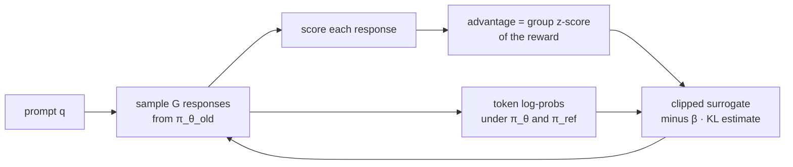

# 14.2 RL without a Value Model

Section 1 spent most of PPO's memory on a model that never speaks to the user. The value model exists to guess, at each token, how the response will eventually be scored, so the policy gradient can use that guess as a baseline. For a language model the guess is expensive and, on long answers with a single score at the end, often not very good. This section drops it. REINFORCE with a baseline, RLOO, and GRPO estimate the advantage by comparing the rewards of responses that were actually sampled. They keep the policy-gradient idea of Chapter 10 and the KL-regularized objective of Chapter 11, and they delete the critic.

## Why the critic is expensive for LLMs

Recall the split from Section 10.6. The policy gradient has the form

```math
\nabla_{\theta} J(\theta) = \mathbb{E}\left[ \sum_t \nabla_{\theta} \log \pi_{\theta}(a_t \mid s_t)\, A_t \right],
```

and any baseline that does not depend on the action $`a_t`$ leaves this expectation unchanged. In actor-critic PPO the baseline is a learned value $`V_{\psi}(s_t)`$, and the advantage is a GAE mix of temporal-difference errors (Section 10.7, Section 11.7). The value model is a second transformer. On the accounting of Section 11.7, a 7-billion-parameter critic in mixed precision with Adam is another 112 GB, on top of the policy's 112 GB and the frozen reference and reward models.

The statistical problem is as serious as the memory. In the token-level MDP of Section 11.2 the reward that measures quality arrives once, at the last token. With $\gamma = 1$, the return of every earlier token is that same final number plus the KL penalties along the way. A value model asked to predict it from the first few tokens of a long chain of thought is regressing a noisy, delayed target. Bias in $`V_{\psi}`$ becomes bias in the advantage, and the policy follows the biased direction. The longer the response, the worse the credit-assignment problem the critic was hired to solve.

There is also a simpler baseline sitting in the data. Sample several responses to the *same* prompt, score them, and compare each score with the others. The prompt is held fixed, so the comparison is exactly a baseline that depends on the state (the prompt) and not on the action (this particular response). No second network has to learn it. That observation is the whole of this section. The three algorithms differ in how they turn a group of scores into a number $`A`$, and in how carefully they constrain the update that follows.

## REINFORCE with a baseline

Take the contextual-bandit view from Section 11.2, in which the whole response $`y`$ is one action and the prompt $`x`$ is the state. The KL-regularized objective is an expected reward $`R(x, y)`$, where $`R`$ may already include the KL penalty, $`R(x, y) = r(x, y) - \beta \log(\pi_{\theta}(y \mid x) / \pi_{\mathrm{ref}}(y \mid x))`$, or the KL term may be added separately. Either way, the policy gradient theorem gives

```math
\nabla_{\theta} J(\theta) = \mathbb{E}_{x,\, y \sim \pi_{\theta}}\left[ \nabla_{\theta} \log \pi_{\theta}(y \mid x)\, \big(R(x, y) - b(x)\big) \right].
```

Because $`\log \pi_{\theta}(y \mid x) = \sum_t \log \pi_{\theta}(y_t \mid x, y_{\lt t})`$, the scalar $`R(x, y) - b(x)`$ multiplies every token of the response. Tokens are not distinguished. A response that earned a high reward has all of its tokens made more likely, including the ones that were irrelevant or wrong on the way to a lucky answer. That is the credit-assignment limit of any outcome-only method, and Section 5 returns to it when it discusses process rewards. What the baseline does achieve is variance reduction: a response is reinforced only to the extent that it beat $`b(x)`$.

The cheapest $`b(x)`$ is a constant, the mean reward of the whole batch. It is not quite legal. The mean includes the sample being scored, so the baseline depends slightly on the action, and the gradient is slightly biased. For a large batch the contamination is small. A running average of recent rewards has the same character. Williams (1992) already noted that a baseline cuts variance without adding bias when it does not depend on the action; the batch mean is the version of that idea people implement when they have one sample per prompt.

In code the update is a weighted language-modeling loss. Detach the advantage so that it is a constant, and minimize

```math
L(\theta) = -\frac{1}{N} \sum_{i} \big(R_i - b\big)\, \sum_{t} \log \pi_{\theta}(y_{i,t} \mid x_i, y_{i,\lt t}),
```

where the inner sum runs over the tokens of response $`i`$. This is the surrogate-loss trick of Section 10.6. The value of $`L`$ is not a performance metric. Only its gradient matters.

Ahmadian et al. (2024) argued that this family, rather than a learned critic, is the right default for language models. In their comparisons a carefully implemented REINFORCE-style update matched or beat PPO on the preference-optimization tasks they ran, while removing the value model and the tuning that goes with it. The result does not say a critic can never help. It says that for a single sequence-level reward, the critic's variance reduction is easy to lose to its bias and its cost, and a simple baseline is a strong starting point.

## RLOO: leave-one-out baselines

RLOO (REINFORCE Leave-One-Out) makes the baseline legal and prompt-specific (Ahmadian et al. 2024). For each prompt, sample $`K`$ responses $`y_1, \ldots, y_K`$ from the current policy and score them $`R_1, \ldots, R_K`$. The baseline for response $`i`$ is the average of the *other* scores:

```math
b_i = \frac{1}{K - 1} \sum_{j \neq i} R_j, \qquad A_i^{\mathrm{RLOO}} = R_i - b_i.
```

The baseline does not depend on $`y_i`$, so it does not bias the policy gradient. It does depend on the prompt, through the other samples, so it removes the part of the reward that every answer to this prompt shares. An easy prompt, on which every sample scores well, does not produce a pile of large positive advantages. Only the sample that beat its siblings is reinforced, and the one that lost is suppressed.

The leave-one-out advantage is the centered reward up to a constant that depends only on $`K`$. Let $`\bar{R} = \frac{1}{K}\sum_j R_j`$. Then

```math
A_i^{\mathrm{RLOO}} = R_i - \frac{K\bar{R} - R_i}{K - 1} = \frac{K}{K - 1}\big(R_i - \bar{R}\big).
```

For a fixed group size, RLOO and "subtract the group mean" are the same gradient direction. The factor $`K/(K-1)`$ is 2 when $`K = 2`$ and approaches 1 as the group grows. Using the group mean directly is slightly biased, because $`\bar{R}`$ contains $`R_i`$; multiplying the centered reward by $`K/(K-1)`$ is the unbiased version. [Code 14.2.1](#code-1421-rloo-and-grpo-advantages-on-one-group) checks the identity on a group of four scores.

A worked group makes the arithmetic obvious. Four responses to one prompt score $`1, 0, 1, 0`$. The group mean is $`0.5`$. The centered rewards are $`+0.5, -0.5, +0.5, -0.5`$. The leave-one-out baselines are $`1/3, 2/3, 1/3, 2/3`$, and the RLOO advantages are $`+2/3, -2/3, +2/3, -2/3`$, which is $`4/3`$ times the centered rewards. The two correct answers are pushed up equally; the two incorrect answers are pushed down equally. If all four scores are $`1`$, every advantage is zero. The prompt contributes nothing, which is the right outcome: the samples do not tell the policy which way to move.

The gradient estimator averages the $`K`$ samples:

```math
\nabla_{\theta} J(\theta) \approx \frac{1}{K} \sum_{i=1}^{K} A_i^{\mathrm{RLOO}}\, \nabla_{\theta} \log \pi_{\theta}(y_i \mid x).
```

$`K`$ is the new hyperparameter. $`K = 2`$ is a paired comparison and is cheap. Larger $`K`$ estimates the prompt's mean reward more accurately and reduces variance, at a linear cost in generated tokens. Ahmadian et al. (2024) use small $`K`$ and show that the leave-one-out baseline is enough to make REINFORCE competitive with PPO on their tasks. The update itself can be a single gradient step on the fresh samples, which keeps the estimator on-policy, or it can be clipped in the manner of the next algorithm.

## GRPO: normalize within the group, then clip

Group Relative Policy Optimization, introduced by Shao et al. (2024) for DeepSeekMath, starts from the same group of samples and then does two things RLOO does not. It divides by the group's standard deviation, and it wraps the result in PPO's clipped surrogate, with a KL penalty against a reference model.

For a prompt $`q`$, sample $`G`$ outputs $`o_1, \ldots, o_G`$ from the policy $`\pi_{\theta_{\mathrm{old}}}`$ that is being held fixed for this iteration, and let $`r_i`$ be the reward of output $`i`$. The advantage of every token in output $`i`$ is the standardized reward

```math
\hat{A}_{i,t} = \hat{A}_i = \frac{r_i - \mathrm{mean}(r_1, \ldots, r_G)}{\mathrm{std}(r_1, \ldots, r_G)}.
```

Outcome supervision uses one reward per output, so the advantage does not depend on $`t`$. If the standard deviation is zero, the group has no ranking and the advantages are set to zero. On the four scores above, the population standard deviation is $`0.5`$, and the GRPO advantages are $`+1, -1, +1, -1`$. Standardizing removes the scale of the reward. A verifier that returns $`0`$ or $`1`$ and a reward model that returns numbers around $`10`$ produce advantages of the same magnitude, which is why GRPO runs are less sensitive to reward scaling than a raw REINFORCE update is. The cost of that normalization is a bias that Section 8 names: dividing by a per-prompt standard deviation upweights prompts whose rewards barely vary. Dr. GRPO removes the division for that reason. Within this section, the formula above is the one Shao et al. (2024) use.

The policy update is the clipped objective of Section 10.7, applied to tokens, minus a KL penalty:

```math
J_{\mathrm{GRPO}}(\theta) = \mathbb{E}\left[ \frac{1}{G} \sum_{i=1}^{G} \frac{1}{|o_i|} \sum_{t=1}^{|o_i|} \left( \min\big(\rho_{i,t} \hat{A}_i,\, \mathrm{clip}(\rho_{i,t}, 1 - \epsilon, 1 + \epsilon)\, \hat{A}_i\big) - \beta\, \mathbb{D}_{\mathrm{KL}}^{(i,t)} \right) \right],
```

where the expectation is over prompts and over groups sampled from $`\pi_{\theta_{\mathrm{old}}}`$, and the probability ratio is the usual one,

```math
\rho_{i,t}(\theta) = \frac{\pi_{\theta}(o_{i,t} \mid q, o_{i,\lt t})}{\pi_{\theta_{\mathrm{old}}}(o_{i,t} \mid q, o_{i,\lt t})}.
```

The factor $`1/|o_i|`$ averages the tokens of each output before the outputs are averaged, so a long output does not dominate the batch merely by having more tokens. Later variants change this average; it is part of the original objective, not a law of nature.

The KL term is not folded into the reward, as it was in the shaped reward of Section 11.7. It is subtracted inside the loss, and it is estimated with the non-negative estimator from Schulman (2020) that Section 11.6 already compared with the raw log-ratio. With $`\rho^{\mathrm{ref}}_{i,t} = \pi_{\mathrm{ref}} / \pi_{\theta}`$ at the sampled token,

```math
\mathbb{D}_{\mathrm{KL}}^{(i,t)} = \rho^{\mathrm{ref}}_{i,t} - \log \rho^{\mathrm{ref}}_{i,t} - 1.
```

The estimator is always at least zero and is unbiased for the per-token KL between $`\pi_{\theta}`$ and $`\pi_{\mathrm{ref}}`$. [Code 14.2.1](#code-1421-rloo-and-grpo-advantages-on-one-group) computes it for three tokens. On that example the raw log-ratio sums to $`-0.1`$ (a single sample can land where the reference is more probable), while the non-negative estimator sums to about $`0.045`$.

Putting the pieces together, one GRPO iteration is:

1. Sample a batch of prompts. For each prompt, generate $`G`$ responses from $`\pi_{\theta_{\mathrm{old}}}`$.
2. Score each response with a reward model or a verifier. Compute $`\hat{A}_i`$. Drop or zero out groups whose rewards are all equal.
3. For one or more epochs, recompute token log-probabilities under $`\pi_{\theta}`$, form the clipped surrogate and the KL estimator, and take a gradient step on the policy.
4. Log the mean reward, the mean advantage magnitude, the KL, the response length, and the fraction of groups that were all ties.

The models in memory are the policy, the frozen reference, and whatever produces the reward. If the reward is a program, the third model is gone too. There is no value network and no GAE.



*Figure 14.2.1. One GRPO iteration. The advantage is computed from the group of rewards for a single prompt. The value model of Figure 11.7.1 is absent.*

## How these compare with PPO

The three critic-free updates and PPO optimize the same kind of objective. They differ in the baseline, in whether the update is clipped, and in what has to sit in GPU memory.

| | Baseline | Update | Models trained | Sampling |
|---|---|---|---|---|
| REINFORCE, batch mean | One number for the batch | A single weighted log-prob step | Policy | Yes, one response per prompt |
| RLOO | Mean of the other $`K - 1`$ scores for this prompt | Same, with an unbiased prompt-level baseline | Policy | Yes, $`K`$ responses per prompt |
| GRPO | Group z-score | Clipped ratio, several epochs, plus a KL estimate | Policy | Yes, $`G`$ responses per prompt |
| PPO (Section 11.7) | Learned $`V_{\psi}`$ and GAE | Clipped ratio, value regression, KL in the reward | Policy and value model | Yes, usually one response per prompt |

On the Section 11.7 accounting, dropping a 7B value model removes about 112 GB of optimizer state. GRPO still pays for generation, and it pays $`G`$ times, because every prompt is answered several times. That trade is often favorable. The extra samples are what replace the critic, and they are exactly the samples a verifier needs in order to have both successes and failures on the same problem (Section 5). PPO's single sample per prompt has a lower generation bill per prompt and a higher memory bill, and its advantage is only as good as $`V_{\psi}`$.

Stability follows the same split. REINFORCE with a large learning rate can collapse the policy, which is the step-size problem of Section 10.6. GRPO inherits PPO's clip, so a single update cannot move the token probabilities by an unlimited factor; $\epsilon$ is doing the same job it did in Section 10.7. GRPO does not inherit the value loss, which removes one of the two networks that can diverge. What it adds is a dependence on the group: if $`G`$ is small and rewards are coarse, many groups are ties and the effective batch shrinks. Section 8 discusses filtering those groups on purpose.

Empirically, the paper that introduced each method is the evidence to read, and the claims are narrower than the slogans. Ahmadian et al. (2024) report that leave-one-out REINFORCE is competitive with PPO on the alignment tasks in their study, with a simpler setup. Shao et al. (2024) introduce GRPO and use it to train DeepSeekMath's reinforcement-learning stage, presenting the removal of the value model as the simplification that makes the math experiments practical. Neither paper is a universal ranking. Section 11.8 records the complementary finding that a carefully tuned PPO still beats a naive preference loss. The fair summary is that, for a sequence-level reward, a group baseline is a sufficient critic for many LLM runs, and it is the form most open reasoning recipes adopted after 2024 (Section 8).

## Code for this section

### Code 14.2.1: RLOO and GRPO advantages on one group

Four responses to one prompt score $`1, 0, 1, 0`$. The listing checks that the leave-one-out advantage equals $`K/(K-1)`$ times the centered reward, computes the GRPO z-scores, and compares the two KL estimators of Section 11.6 on three arbitrary token log-probabilities.

Notebook: [14.2.1-rloo-and-grpo-advantages-on-one-group.ipynb](../../code/14-more-rl-methods-for-llms/14.2.1-rloo-and-grpo-advantages-on-one-group.ipynb)

## Key takeaways

- A baseline that depends only on the prompt leaves the policy gradient unbiased. A learned value model is one such baseline; the other responses to the same prompt are another.
- REINFORCE multiplies every token of a response by the same scalar, $`R - b`$. The batch-mean baseline is simple and slightly biased; it is already a large improvement on using the raw reward.
- RLOO's leave-one-out baseline is exactly $`K/(K-1)`$ times the centered group reward, and it does not depend on the response being scored.
- GRPO replaces the raw centered reward with a group z-score, then applies PPO's clipped token-level update and an unbiased KL estimator. It trains only the policy.
- Relative to PPO, these methods trade a second trained network for several samples per prompt. That trade became the default for open reasoning models (Section 8).

## Further reading

Ahmadian, Arash, et al. "Back to Basics: Revisiting REINFORCE-Style Optimization for Learning from Human Feedback in LLMs." In *Proceedings of the 62nd Annual Meeting of the Association for Computational Linguistics (Volume 1: Long Papers)*, 2024. https://arxiv.org/abs/2402.14740.

Schulman, John. "Approximating KL Divergence." Blog post, March 7, 2020. http://joschu.net/blog/kl-approx.html.

Shao, Zhihong, et al. "DeepSeekMath: Pushing the Limits of Mathematical Reasoning in Open Language Models." arXiv preprint arXiv:2402.03300, 2024. https://arxiv.org/abs/2402.03300.

Williams, Ronald J. "Simple Statistical Gradient-Following Algorithms for Connectionist Reinforcement Learning." *Machine Learning* 8 (1992): 229–256. https://doi.org/10.1007/BF00992696.
